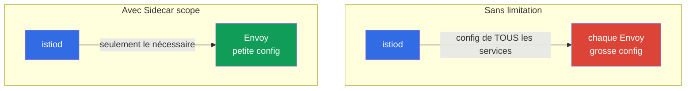

[RU version](ru.md) · [Eng version](en.md) · [Versión en español](es.md) · [Deutsche Version](de.md)

# Chapitre 19. Sidecar scoping et optimisation de la configuration des proxys

> **La suite.** On entre dans le domaine des scénarios avancés. Le premier d'entre eux :
> l'optimisation. Par défaut, chaque sidecar connaît tous les services du maillage, et sur un grand
> cluster c'est coûteux : des configurations Envoy gonflées, de la mémoire superflue, une charge sur
> istiod. Dans ce chapitre, nous verrons comment limiter le champ de visibilité des proxys via la
> ressource `Sidecar` et les discovery selectors.

## 19.1. Le problème : le « full mesh » par défaut

Par défaut, Istio fonctionne comme un « maillage complet » : istiod diffuse à **chaque** sidecar la
configuration de **tous** les services du cluster - même ceux auxquels ce pod ne s'adresse jamais.
Sur un petit cluster, cela passe inaperçu, mais avec des centaines et des milliers de services, de
vrais problèmes apparaissent :

- **Mémoire.** Chaque Envoy stocke la configuration de tous les services - cela représente des
  dizaines et des centaines de mégaoctets par proxy, multipliés par des milliers de pods.
- **Charge sur istiod.** À chaque changement (un pod apparaît, un service change), istiod recalcule
  et rediffuse la configuration à tous les proxys.
- **Vitesse de diffusion.** Plus la configuration est grande, plus elle met de temps à atteindre
  Envoy et à s'appliquer.



L'idée de l'optimisation est simple : dire à Istio quels services sont réellement nécessaires à des
pods précis, et ne pas leur diffuser tout le reste.

## 19.2. La ressource Sidecar : limiter la visibilité

La ressource `Sidecar` (celle-là même que nous avons vue au chapitre 12 pour l'egress) permet de
limiter les services que « voit » le proxy, via `egress.hosts` :

```yaml
apiVersion: networking.istio.io/v1
kind: Sidecar
metadata:
  name: default            # le nom default = pour tout le namespace
  namespace: app
spec:
  egress:
  - hosts:
    - "./*"                # les services de son propre namespace
    - "istio-system/*"     # les services système (gateways, etc.)
```

- **`egress.hosts`** - la liste de ce que voit le sidecar, au format `namespace/service`.
- **`"./*"`** - tous les services du namespace courant.
- **`"istio-system/*"`** - les services d'istio-system (nécessaires au fonctionnement du maillage).

Désormais, istiod n'enverra aux pods de ce namespace que la configuration des services énumérés, et
non celle de tout le cluster. Si l'application s'adresse à des services situés dans un autre
namespace encore, on l'ajoute à la liste : par exemple, `"payments/*"`.

Il faut se rappeler que `Sidecar` ne gère pas seulement `egress.hosts`. La même ressource définit :

- **`outboundTrafficPolicy`** - le mode de sortie vers l'extérieur (`REGISTRY_ONLY`/`ALLOW_ANY`,
  chapitre 12) ;
- **`ingress`** - quels ports entrants le proxy écoute (réglage fin de la réception du trafic) ;
- **`egress.hosts`** - ce que le proxy voit en sortie (notre sujet d'optimisation).

Autrement dit, `Sidecar` est le « bouton » unique du champ de visibilité et du trafic du proxy dans
un namespace.

## 19.3. Ce que cela apporte

Limiter la visibilité frappe directement les trois problèmes de la 19.1 :

- **Moins de mémoire sur le proxy.** Envoy ne stocke que la partie utile de la configuration.
- **Moins de charge sur istiod.** Un changement dans un namespace « invisible » n'oblige plus à
  recalculer et rediffuser la configuration à ces pods.
- **Diffusion et application plus rapides.** Une petite configuration arrive et s'applique plus
  vite.

Sur les grands clusters, la différence est spectaculaire : la configuration du proxy peut passer de
centaines de mégaoctets à quelques unités. C'est l'une des principales optimisations d'Istio à
l'échelle.

Un effet de bord utile est la sécurité : un pod à qui seuls les services nécessaires sont « visibles »
a une surface d'abus plus faible (rappelez-vous `REGISTRY_ONLY` du chapitre 12, qui se définit avec
la même ressource `Sidecar`).

## 19.4. Discovery selectors : limitation au niveau du maillage

`Sidecar` agit au niveau du namespace. Il existe un levier plus large - les **discovery selectors**,
qui se définit globalement dans `MeshConfig` (lors de l'installation d'Istio). Il indique à istiod
**quels namespaces suivre du tout**.

```yaml
meshConfig:
  discoverySelectors:
  - matchLabels:
      istio-discovery: enabled
```

Avec un tel réglage, istiod ne prendra en compte que les namespaces portant le label
`istio-discovery: enabled`, et tout ce qui se passe dans les autres namespaces (par exemple, dans
des namespaces purement « kubernetes » sans maillage), il l'ignore complètement - il ne dépense pas
de ressources et n'en diffuse pas l'information aux proxys.

Différence avec `Sidecar` :

- **discovery selectors** - un filtre grossier au niveau de tout le maillage : quels namespaces
  istiod prend en compte du tout. Se configure une seule fois à l'installation.
- **Sidecar** - un réglage précis au niveau namespace/pods : ce que voit un proxy concret.

On les utilise ensemble : les discovery selectors écartent des namespaces entiers inutiles, et
`Sidecar` restreint en plus la visibilité au sein de ceux qui restent.

## 19.5. Quand et comment appliquer en pratique

La question centrale de l'exploitation : comment comprendre que le full mesh gêne déjà, et dans quel
ordre introduire les limitations pour ne rien casser.

### Signes qu'il est temps

N'optimisez pas « au cas où ». Observez les signaux :

- **istiod sous charge.** Le CPU et la mémoire d'istiod montent, il n'arrive plus à diffuser la
  configuration.
- **Convergence lente.** La métrique `pilot_proxy_convergence_time` (le temps que prend la
  diffusion de la configuration vers les proxys) augmente ; les proxys restent longtemps au statut
  `STALE` (`istioctl proxy-status`).
- **Grosses configurations de proxys.** Les conteneurs Envoy consomment beaucoup de mémoire ; la
  taille du dump `istioctl proxy-config all <pod>` atteint des dizaines de mégaoctets et croît.
- **Échelle.** Le maillage compte des centaines de services et beaucoup de namespaces, dont une
  partie n'est pas du tout liée entre elle.

Si les services sont peu nombreux et que les métriques d'istiod sont calmes - gardez le full mesh,
c'est normal.

### Ordre de déploiement

Procédez progressivement et de façon mesurable, et non « activons le scope partout d'un coup » :

1. **Prenez une baseline.** Notez avant les changements : la mémoire d'istiod, la mémoire des
   proxys, la taille de la configuration (`istioctl proxy-config all <pod> -o json | wc -c`),
   `pilot_proxy_convergence_time`. Sans chiffres de référence, vous ne saurez pas si cela a aidé.
2. **Écartez les namespaces superflus via les discovery selectors.** L'étape la plus économique et
   la plus large : retirez du champ de vision d'istiod les namespaces qui ne sont pas du tout dans
   le maillage.
3. **Construisez la carte des dépendances.** Découvrez qui s'adresse réellement à qui - via le
   graphe Kiali (chapitre 17), via les métriques `istio_requests_total` (labels `source_workload` /
   `destination_service`) ou via les access logs. C'est la base pour `egress.hosts`.
4. **Déployez `Sidecar` un namespace à la fois,** en commençant par les non-critiques et en staging.
   Pour chaque namespace, décrivez `egress.hosts` = son propre namespace + istio-system + ceux
   auxquels il s'adresse d'après la carte des dépendances.
5. **Vérifiez que rien n'est cassé.** `istioctl analyze`, tests d'accès entre services,
   `istioctl proxy-config` (les clusters nécessaires sont-ils visibles). Attention particulière aux
   dépendances rarement utilisées et faciles à oublier.
6. **Mesurez l'effet et déployez plus loin.** Comparez à la baseline, assurez-vous du gain, passez
   aux namespaces suivants.

### Comment construire la carte des dépendances

Le moyen le plus fiable est de partir du trafic réel, et non de la documentation :

```bash
# qui s'adresse au service payments (d'après les métriques Istio)
istio_requests_total{destination_service_name="payments"}   # on regarde source_workload
```

Le graphe Kiali montre la même chose visuellement. En rassemblant une vraie carte du « qui-à-qui »,
vous savez exactement quoi inscrire dans `egress.hosts` et vous ne coupez pas le nécessaire.

## 19.6. Trois leviers de limitation de la visibilité

Outre `Sidecar` et les discovery selectors, Istio dispose d'un troisième mécanisme - `exportTo`. Il
est utile de voir les trois ensemble, car ils agissent à des niveaux différents et se complètent :

| Mécanisme | Niveau | Ce qu'il limite |
|----------|---------|------------------|
| **discovery selectors** (MeshConfig) | tout le maillage | quels namespaces istiod suit du tout |
| **`Sidecar`** (`egress.hosts`) | namespace / pods | ce que voit un proxy concret |
| **`exportTo`** (sur la ressource) | la ressource elle-même | dans quels namespaces ce service/config est visible |

`exportTo` se définit **côté ressource** et indique à qui elle est accessible du tout : `.` -
uniquement son propre namespace, `*` - tous (par défaut), ou une liste de namespaces. Il existe sur
`Service` (via l'annotation `networking.istio.io/exportTo`), ainsi que sur `VirtualService`,
`DestinationRule` et `ServiceEntry` (chapitre 12) :

```yaml
apiVersion: v1
kind: Service
metadata:
  name: internal-only
  namespace: payments
  annotations:
    networking.istio.io/exportTo: "."     # visible uniquement dans son propre namespace
```

La différence est dans le sens : `Sidecar` c'est « ce que je veux voir » (côté consommateur),
`exportTo` c'est « à qui j'autorise à me voir » (côté propriétaire du service). Sur les grandes
plateformes, on les combine : les discovery selectors écartent grossièrement des namespaces,
`exportTo` cache les services internes aux équipes tierces, et `Sidecar` restreint la configuration
de proxys concrets.

> **L'ambient mode change la donne.** Tout ce qui précède concerne le mode sidecar classique, où
> chaque pod a son propre Envoy avec la configuration complète. En **ambient mode** (chapitre 22),
> le trafic L4 est desservi par un `ztunnel` partagé par nœud, et le L7 par un `waypoint` optionnel,
> de sorte que le problème de l'« Envoy gonflé dans chaque pod » ne se pose pas sous cette forme. Les
> discovery selectors y restent utiles, mais le besoin de `Sidecar`-scoping diminue nettement.

## 19.7. Autres optimisations de proxy

Le champ de visibilité est le réglage principal, mais pas le seul, pour adapter les proxys à
l'échelle. Encore quelques leviers à connaître :

- **`concurrency` (workers d'Envoy).** Combien de threads de travail a le sidecar. Par défaut, Istio
  le fixe au nombre de vCPU du pod ; sur des pods avec une grande limite CPU mais peu de trafic
  réel, cela gonfle la consommation. On fixe souvent `concurrency: 2` (annotation
  `proxy.istio.io/config` ou globalement), pour que le proxy n'occupe pas des threads/de la mémoire
  superflus.
- **Ressources du sidecar.** Définissez les requests/limits du conteneur `istio-proxy` de façon
  réfléchie (annotations `sidecar.istio.io/proxyCPU`, `proxyMemory`), et non par défaut - surtout
  sur des nœuds densément peuplés.
- **`holdApplicationUntilProxyStarts`.** Force le conteneur de l'application à attendre que le
  sidecar soit prêt - élimine la course au démarrage du pod (l'application démarre avant le proxy et
  les premières requêtes échouent). Utile pour les jobs courts et les services sensibles au
  démarrage.
- **Surveillance d'istiod.** Les métriques `PILOT_*` et `pilot_proxy_convergence_time` (19.5) sont
  l'indicateur principal pour savoir si l'optimisation aide ; suivez-les avant/après les
  changements.

Ces réglages sont orthogonaux au scoping : on les applique aussi bien sur un grand cluster que sur un
cluster moyen, quand on veut une consommation de ressources prévisible pour les proxys.

## 19.8. Best practices

- **Sur un petit cluster, ne compliquez pas.** Tant que les services sont peu nombreux, le full mesh
  par défaut fonctionne bien. L'optimisation est nécessaire à la croissance (des centaines+ de
  services).
- **Commencez par les discovery selectors.** Si une partie des namespaces n'est pas du tout dans le
  maillage, écartez-les au niveau d'istiod - c'est le gain le plus économique et le plus large.
- **Ajoutez Sidecar par namespace.** Pour chaque namespace, décrivez un `Sidecar` avec la vraie liste
  de dépendances (son propre namespace + ceux auxquels il s'adresse). Cela réduit la configuration du
  proxy et améliore du même coup la sécurité.
- **Gardez la liste des dépendances à jour.** Si un service se met à s'adresser à un nouveau
  namespace absent du `Sidecar`, le trafic se cassera. C'est un compromis : un scope plus précis
  signifie des exigences de rigueur plus strictes.
- **Surveillez l'effet.** Regardez la taille de la configuration du proxy (`istioctl proxy-config` et
  les métriques d'istiod) avant et après - ainsi vous verrez le gain réel.

## 19.9. Résumé du chapitre

- Par défaut, chaque sidecar reçoit la configuration de tous les services du maillage ; sur un grand
  cluster, c'est coûteux en mémoire, en charge sur istiod et en vitesse de diffusion.
- La **ressource `Sidecar`**, via `egress.hosts`, limite les services que voit le proxy dans un
  namespace - la configuration diminue, istiod est déchargé.
- Les **discovery selectors** dans `MeshConfig` définissent quels namespaces istiod suit du tout -
  un filtre grossier au niveau de tout le maillage.
- On les applique ensemble : les discovery selectors écartent des namespaces, `Sidecar` restreint la
  visibilité au sein de ceux qui restent.
- Le troisième levier de visibilité est **`exportTo`** (sur
  `Service`/`VirtualService`/`DestinationRule`/`ServiceEntry`) : côté propriétaire, il limite à qui
  le service est visible ; `Sidecar` - côté consommateur. On les combine avec les discovery
  selectors.
- `Sidecar` gère non seulement `egress.hosts`, mais aussi `outboundTrafficPolicy` et `ingress`.
- Autres optimisations de proxy : `concurrency` (workers d'Envoy), ressources du sidecar,
  `holdApplicationUntilProxyStarts`.
- En **ambient mode** (chapitre 22), le problème de la configuration Envoy par pod gonflée disparaît
  sous cette forme ; le Sidecar-scoping y est moins nécessaire.
- Un plus de bord du scope est la sécurité (moins de services visibles).
- Compromis : un scope précis exige de maintenir la liste des dépendances à jour.
- Il est temps d'introduire le scope quand montent la charge sur istiod, le temps de convergence
  (`pilot_proxy_convergence_time`) et la taille de la configuration des proxys. Déployez
  progressivement : baseline -> discovery selectors -> carte des dépendances (Kiali/métriques) ->
  Sidecar par namespace -> vérification -> mesure de l'effet.

## 19.10. Questions d'auto-évaluation

1. Pourquoi le full mesh par défaut devient-il un problème sur un grand cluster ?
2. Comment la ressource `Sidecar` limite-t-elle la visibilité et qu'advient-il alors de la
   configuration du proxy ?
3. En quoi les discovery selectors diffèrent-ils de `Sidecar` par leur niveau d'action ?
4. Comment les discovery selectors et `Sidecar` se complètent-ils ?
5. Quel est le risque d'un scope trop étroit et comment l'éviter ?
6. À quels signes reconnaître qu'il est temps d'introduire des limitations ? Décrivez l'ordre d'un
   déploiement sûr et comment construire la carte des dépendances.
7. Quels sont les trois mécanismes qui limitent la visibilité et en quoi `exportTo` diffère-t-il de
   `Sidecar` par le sens ?
8. Quelles autres optimisations de proxy existe-t-il en plus du scoping (`concurrency`, ressources,
   holdApplicationUntilProxyStarts) ?
9. Pourquoi le Sidecar-scoping est-il moins nécessaire en ambient mode ?

## Pratique

Exercez-vous à limiter le champ de la configuration des proxys via la ressource `Sidecar` :

🧪 Lab 21 : [tasks/ica/labs/21](../../labs/21/README_FR.MD)

---
[Table des matières](../README_FR.md) · [Chapitre 18](../18/fr.md) · [Chapitre 20](../20/fr.md)
