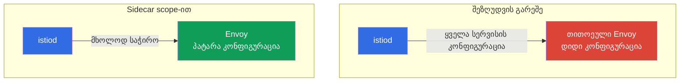

[Русская версия](ru.md) · [Eng version](en.md) · [Versión en español](es.md) · [Version française](fr.md) · [Deutsche Version](de.md) · [繁體中文版](tw.md) · [日本語版](jp.md)

# თავი 19. Sidecar scoping და პროქსის კონფიგურაციის ოპტიმიზაცია

> **რა იქნება შემდეგ.** იწყება გაფართოებული სცენარების დომენი. პირველი მათგანი ოპტიმიზაციაა.
> ნაგულისხმევად, თითოეულმა sidecar-მა mesh-ის ყველა სერვისის შესახებ იცის, დიდ კლასტერში კი ეს
> ძვირია: Envoy-ის გაბერილი კონფიგურაციები, ზედმეტი მეხსიერება, დატვირთვა istiod-ზე. ამ თავში
> განვიხილავთ, როგორ შევზღუდოთ პროქსის ხილვადობის არეალი `Sidecar` რესურსისა და discovery
> selectors-ის საშუალებით.

## 19.1. პრობლემა: ნაგულისხმევი „full mesh“

ნაგულისხმევად, Istio მუშაობს როგორც „სრული mesh“: istiod **თითოეულ** sidecar-ს უგზავნის
კლასტერის **ყველა** სერვისის კონფიგურაციას - მათიც კი, რომლებსაც ეს პოდი არასოდეს
მიმართავს. პატარა კლასტერში ეს შეუმჩნეველია, მაგრამ ასობით და ათასობით სერვისის შემთხვევაში
რეალური პრობლემები ჩნდება:

- **მეხსიერება.** თითოეული Envoy ყველა სერვისის კონფიგურაციას ინახავს - ეს ერთ პროქსიზე
  ათობით და ასობით მეგაბაიტია, გამრავლებული ათასობით პოდზე.
- **დატვირთვა istiod-ზე.** ნებისმიერი ცვლილებისას (პოდი დაემატა, სერვისი შეიცვალა) istiod
  კონფიგურაციას ხელახლა ითვლის და ყველა პროქსის უგზავნის.
- **მიწოდების სიჩქარე.** რაც უფრო დიდია კონფიგურაცია, მით უფრო დიდხანს მიეწოდება ის Envoy-ს
  და გამოიყენება.



ოპტიმიზაციის იდეა მარტივია: Istio-ს ვუთხრათ, რომელი სერვისები სჭირდება რეალურად კონკრეტულ
პოდებს და დანარჩენი ყველაფერი არ გავუგზავნოთ.

## 19.2. Sidecar რესურსი: ხილვადობის შეზღუდვა

`Sidecar` რესურსი (იგივე, რომელიც მე-12 თავში egress-ისთვის ვნახეთ) საშუალებას გვაძლევს,
`egress.hosts`-ის საშუალებით შევზღუდოთ, რომელ სერვისებს „ხედავს“ პროქსი:

```yaml
apiVersion: networking.istio.io/v1
kind: Sidecar
metadata:
  name: default            # default სახელი = მთელ namespace-ზე
  namespace: app
spec:
  egress:
  - hosts:
    - "./*"                # საკუთარი namespace-ის სერვისები
    - "istio-system/*"     # სისტემური სერვისები (gateway-ები და ა.შ.)
```

- **`egress.hosts`** - ჩამონათვალი იმისა, რასაც sidecar ხედავს, `namespace/service` ფორმატში.
- **`"./*"`** - მიმდინარე namespace-ის ყველა სერვისი.
- **`"istio-system/*"`** - სერვისები istio-system-იდან (საჭიროა mesh-ის მუშაობისთვის).

ახლა istiod ამ namespace-ის პოდებს მხოლოდ ჩამოთვლილი სერვისების კონფიგურაციას გაუგზავნის
და არა მთელი კლასტერისას. თუ აპლიკაცია კიდევ რომელიმე namespace-ის სერვისებს მიმართავს,
მას სიაში ამატებენ: მაგალითად, `"payments/*"`.

უნდა გვახსოვდეს, რომ `Sidecar` მხოლოდ `egress.hosts`-ს არ მართავს. იგივე რესურსი განსაზღვრავს:

- **`outboundTrafficPolicy`** - გარეთ გასვლის რეჟიმი (`REGISTRY_ONLY`/`ALLOW_ANY`, თავი 12);
- **`ingress`** - რომელ შემომავალ პორტებს უსმენს პროქსი (ტრაფიკის მიღების დეტალური გამართვა);
- **`egress.hosts`** - რას ხედავს პროქსი გამავალ მიმართულებაზე (ჩვენი ოპტიმიზაციის თემა).

ამრიგად, `Sidecar` namespace-ში პროქსის ხილვადობისა და ტრაფიკის არეალის ერთიანი „მართვის
ბერკეტია“.

## 19.3. რას გვაძლევს ეს

ხილვადობის შეზღუდვა პირდაპირ აგვარებს 19.1-ში აღწერილ სამ პრობლემას:

- **ნაკლები მეხსიერება პროქსიზე.** Envoy კონფიგურაციის მხოლოდ საჭირო ნაწილს ინახავს.
- **ნაკლები დატვირთვა istiod-ზე.** ცვლილება „უხილავ“ namespace-ში ამ პოდებისთვის
  კონფიგურაციის ხელახლა დათვლასა და გაგზავნას აღარ იწვევს.
- **უფრო სწრაფი მიწოდება და გამოყენება.** პატარა კონფიგურაცია უფრო სწრაფად მიდის და
  გამოიყენება.

დიდ კლასტერებში სხვაობა დრამატულია: პროქსის კონფიგურაცია შეიძლება ასობით მეგაბაიტიდან
ერთეულებამდე შემცირდეს. ეს Istio-ს მასშტაბზე მორგების ერთ-ერთი მთავარი ოპტიმიზაციაა.

დამატებითი სასარგებლო ეფექტია უსაფრთხოება: პოდს, რომელსაც მხოლოდ საჭირო სერვისები „უჩანს“,
ბოროტად გამოყენებისთვის ნაკლები ზედაპირი აქვს (გაიხსენეთ მე-12 თავის `REGISTRY_ONLY`, რომელიც
იმავე `Sidecar` რესურსით განისაზღვრება).

## 19.4. Discovery selectors: შეზღუდვა mesh-ის დონეზე

`Sidecar` namespace-ის დონეზე მუშაობს. არსებობს უფრო მსხვილი ბერკეტიც - **discovery
selectors**, რომელიც გლობალურად `MeshConfig`-ში განისაზღვრება (Istio-ს დაყენებისას). ის
istiod-ს ეუბნება, **საერთოდ რომელ namespace-ებს ადევნოს თვალი**.

```yaml
meshConfig:
  discoverySelectors:
  - matchLabels:
      istio-discovery: enabled
```

ასეთი პარამეტრით istiod მხოლოდ `istio-discovery: enabled` ჭდის მქონე namespace-ებს
გაითვალისწინებს, ხოლო დანარჩენ namespace-ებში მიმდინარე ყველაფერს (მაგალითად, სუფთა
„Kubernetes-ის“ namespace-ებში, mesh-ის გარეშე) სრულიად უგულებელყოფს - რესურსებს არ ხარჯავს
და მათ შესახებ ინფორმაციას პროქსებს არ უგზავნის.

განსხვავება `Sidecar`-თან:

- **discovery selectors** - უხეში ფილტრი მთელი mesh-ის დონეზე: საერთოდ რომელ namespace-ებს
  ითვალისწინებს istiod. დაყენებისას ერთხელ კონფიგურირდება.
- **Sidecar** - ზუსტი გამართვა namespace-ის/პოდების დონეზე: რას ხედავს კონკრეტული პროქსი.

მათ ერთად იყენებენ: discovery selectors მთლიან არასაჭირო namespace-ებს გამორიცხავს, ხოლო
`Sidecar` დარჩენილთა შიგნით ხილვადობას დამატებით ავიწროებს.

## 19.5. როდის და როგორ გამოვიყენოთ პრაქტიკაში

ექსპლუატაციის მთავარი კითხვაა: როგორ მივხვდეთ, რომ full mesh უკვე ხელს გვიშლის და რა
თანმიმდევრობით შემოვიღოთ შეზღუდვები ისე, რომ არაფერი გაფუჭდეს.

### ნიშნები, რომ დროა

ნუ ჩაატარებთ ოპტიმიზაციას „ყოველი შემთხვევისთვის“. დააკვირდით სიგნალებს:

- **istiod დატვირთულია.** istiod-ის CPU-სა და მეხსიერების მოხმარება იზრდება და ის
  კონფიგურაციის გაგზავნას ვეღარ ასწრებს.
- **ნელი კონვერგენცია.** მეტრიკა `pilot_proxy_convergence_time` (რამდენ ხანს გრძელდება
  კონფიგურაციის პროქსიმდე მიწოდება) იზრდება; პროქსები დიდხანს რჩებიან `STALE` სტატუსში
  (`istioctl proxy-status`).
- **პროქსის დიდი კონფიგურაციები.** Envoy კონტეინერები ბევრ მეხსიერებას მოიხმარენ;
  `istioctl proxy-config all <pod>` dump-ის ზომა ათობით მეგაბაიტია და იზრდება.
- **მასშტაბი.** mesh-ში ასობით სერვისი და ბევრი namespace-ია, რომელთა ნაწილი ერთმანეთს
  საერთოდ არ უკავშირდება.

თუ სერვისი ცოტაა და istiod-ის მეტრიკები მშვიდია - დატოვეთ full mesh, ეს ნორმალურია.

### დანერგვის თანმიმდევრობა

იმოქმედეთ თანდათანობით და გაზომვადად და არა პრინციპით „scope ყველგან ერთდროულად ჩავრთოთ“:

1. **აიღეთ baseline.** ცვლილებებამდე დააფიქსირეთ: istiod-ის მეხსიერება, პროქსის მეხსიერება,
   კონფიგურაციის ზომა (`istioctl proxy-config all <pod> -o json | wc -c`), `pilot_proxy_convergence_time`.
   საწყისი ციფრების გარეშე ვერ გაიგებთ, დაგეხმარათ თუ არა ცვლილება.
2. **გამორიცხეთ ზედმეტი namespace-ები discovery selectors-ის საშუალებით.** ყველაზე იაფი და
   მსხვილი ნაბიჯია: istiod-ის ხედვის არედან ამოიღეთ namespace-ები, რომლებიც საერთოდ არ არიან mesh-ში.
3. **შექმენით დამოკიდებულებების რუკა.** გაარკვიეთ, ვინ ვის მიმართავს რეალურად - Kiali-ს
   გრაფით (თავი 17), `istio_requests_total` მეტრიკებით (`source_workload` /
   `destination_service` ჭდეები) ან access-ლოგებით. ეს `egress.hosts`-ის საფუძველია.
4. **დანერგეთ `Sidecar` თითო namespace-ში ცალ-ცალკე,** დაიწყეთ არაკრიტიკული namespace-ებით
   და staging-ით. თითოეული namespace-ისთვის აღწერეთ `egress.hosts` = საკუთარი namespace +
   istio-system + ისინი, რომლებსაც ის დამოკიდებულებების რუკის მიხედვით მიმართავს.
5. **შეამოწმეთ, რომ არაფერი გაფუჭდა.** `istioctl analyze`, სერვისებს შორის წვდომის ტესტები,
   `istioctl proxy-config` (ჩანს თუ არა საჭირო კლასტერები). განსაკუთრებული ყურადღება მიაქციეთ
   იშვიათად გამოყენებულ დამოკიდებულებებს, რომელთა დავიწყებაც ადვილია.
6. **გაზომეთ ეფექტი და განაგრძეთ გაშლა.** შეადარეთ baseline-ს, დარწმუნდით სარგებელში და
   გადადით შემდეგ namespace-ებზე.

### როგორ შევქმნათ დამოკიდებულებების რუკა

ყველაზე საიმედო გზა ფაქტობრივი ტრაფიკის გამოყენებაა და არა დოკუმენტაციის:

```bash
# ვინ მიმართავს payments სერვისს (Istio-ს მეტრიკებით)
istio_requests_total{destination_service_name="payments"}   # ვუყურებთ source_workload-ს
```

Kiali-ს გრაფი იმავეს ვიზუალურად აჩვენებს. რეალური „ვინ-ვის“ რუკის შეგროვებით ზუსტად
გეცოდინებათ, რა ჩაწეროთ `egress.hosts`-ში და საჭირო კავშირს არ გაწყვეტთ.

## 19.6. ხილვადობის შეზღუდვის სამი ბერკეტი

`Sidecar`-ისა და discovery selectors-ის გარდა, Istio-ს მესამე მექანიზმიც აქვს - `exportTo`.
სასარგებლოა სამივეს ერთად დანახვა, რადგან ისინი სხვადასხვა დონეზე მუშაობენ და ერთმანეთს ავსებენ:

| მექანიზმი | დონე | რას ზღუდავს |
|----------|---------|------------------|
| **discovery selectors** (MeshConfig) | მთელი mesh | საერთოდ რომელ namespace-ებს ადევნებს თვალს istiod |
| **`Sidecar`** (`egress.hosts`) | namespace / პოდები | რას ხედავს კონკრეტული პროქსი |
| **`exportTo`** (რესურსზე) | თავად რესურსი | რომელ namespace-ებში ჩანს ეს სერვისი/კონფიგურაცია |

`exportTo` **რესურსის მხარეს** განისაზღვრება და მიუთითებს, ვისთვისაა ის საერთოდ ხელმისაწვდომი:
`.` - მხოლოდ საკუთარი namespace, `*` - ყველა (ნაგულისხმევად), ან namespace-ების ჩამონათვალი.
ის აქვს `Service`-ს (`networking.istio.io/exportTo` ანოტაციის საშუალებით), ასევე
`VirtualService`-ს, `DestinationRule`-სა და `ServiceEntry`-ს (თავი 12):

```yaml
apiVersion: v1
kind: Service
metadata:
  name: internal-only
  namespace: payments
  annotations:
    networking.istio.io/exportTo: "."     # ჩანს მხოლოდ საკუთარ namespace-ში
```

განსხვავება მიმართულებაშია: `Sidecar` არის „რისი დანახვა მსურს“ (მომხმარებლის მხრიდან),
`exportTo` კი - „ვის ვაძლევ ჩემი დანახვის უფლებას“ (სერვისის მფლობელის მხრიდან). დიდ
პლატფორმებზე მათ აერთიანებენ: discovery selectors უხეშად გამორიცხავს namespace-ებს,
`exportTo` შიდა სერვისებს უცხო გუნდებისგან მალავს, ხოლო `Sidecar` კონკრეტული პროქსების
კონფიგურაციას ავიწროებს.

> **Ambient mode სურათს ცვლის.** ყოველივე ზემოთქმული ეხება კლასიკურ sidecar-რეჟიმს, სადაც
> თითოეულ პოდს საკუთარი Envoy აქვს სრული კონფიგურაციით. **ambient mode**-ში (თავი 22) L4-ტრაფიკს
> საერთო per-node `ztunnel` ემსახურება, L7-ს კი - არასავალდებულო `waypoint`, ამიტომ „თითოეულ
> პოდში გაბერილი Envoy-ის“ პრობლემა ამ ფორმით არ დგას. discovery selectors იქ კვლავ
> სასარგებლოა, `Sidecar`-scoping-ის საჭიროება კი საგრძნობლად მცირდება.

## 19.7. პროქსის სხვა ოპტიმიზაციები

ხილვადობის არეალი მთავარია, მაგრამ მასშტაბისთვის პროქსის ერთადერთი პარამეტრი არ არის. კიდევ
რამდენიმე ბერკეტი, რომელთა ცოდნაც სასარგებლოა:

- **`concurrency` (Envoy-ის worker-ები).** sidecar-ის სამუშაო ნაკადების რაოდენობა. ნაგულისხმევად,
  Istio მას პოდის vCPU-ების რაოდენობის მიხედვით აყენებს; დიდი CPU ლიმიტის, მაგრამ მცირე რეალური
  ტრაფიკის მქონე პოდებზე ეს მოხმარებას ზრდის. ხშირად აფიქსირებენ `concurrency: 2`-ს
  (`proxy.istio.io/config` ანოტაციით ან გლობალურად), რათა პროქსიმ ზედმეტი ნაკადები/მეხსიერება
  არ დაიკავოს.
- **sidecar-ის რესურსები.** კონტეინერ `istio-proxy`-ს requests/limits გააზრებულად
  მიუთითეთ (`sidecar.istio.io/proxyCPU`, `proxyMemory` ანოტაციები) და არა ნაგულისხმევად -
  განსაკუთრებით მჭიდროდ დატვირთულ ნოდებზე.
- **`holdApplicationUntilProxyStarts`.** აპლიკაციის კონტეინერს sidecar-ის მზადყოფნამდე
  ლოდინს აიძულებს - პოდის გაშვებისას race condition-ს გამორიცხავს (აპლიკაცია პროქსიზე ადრე
  ეშვება და პირველი მოთხოვნები იშლება). სასარგებლოა მოკლე job-ებისა და გაშვების მიმართ
  მგრძნობიარე სერვისებისთვის.
- **istiod-ის მონიტორინგი.** `PILOT_*` მეტრიკები და `pilot_proxy_convergence_time` (19.5) -
  მთავარი ინდიკატორია იმისა, ეხმარება თუ არა ოპტიმიზაცია; დააკვირდით მათ ცვლილებებამდე/შემდეგ.

ეს პარამეტრები scoping-ისგან ორთოგონალურია: მათ დიდ და საშუალო კლასტერებშიც იყენებენ, როდესაც
პროქსის რესურსების პროგნოზირებადი მოხმარება სურთ.

## 19.8. საუკეთესო პრაქტიკები

- **პატარა კლასტერში ნუ გაართულებთ.** სანამ სერვისი ცოტაა, ნაგულისხმევი full mesh ნორმალურად
  მუშაობს. ოპტიმიზაცია ზრდისასაა საჭირო (ასობით+ სერვისი).
- **დაიწყეთ discovery selectors-ით.** თუ namespace-ების ნაწილი საერთოდ არ არის mesh-ში,
  ისინი istiod-ის დონეზე გამორიცხეთ - ეს ყველაზე იაფ და დიდ სარგებელს მოგცემთ.
- **დაამატეთ Sidecar namespace-ების მიხედვით.** თითოეული namespace-ისთვის აღწერეთ `Sidecar`
  დამოკიდებულებების რეალური სიით (საკუთარი namespace + ისინი, რომლებსაც მიმართავს). ეს ამცირებს
  პროქსის კონფიგურაციას და, ამავე დროს, უსაფრთხოებას აუმჯობესებს.
- **დამოკიდებულებების სია აქტუალურ მდგომარეობაში შეინარჩუნეთ.** თუ სერვისმა ახალ namespace-ს
  მიმართა, `Sidecar`-ში კი ის არ არის - ტრაფიკი გაფუჭდება. ეს კომპრომისია: უფრო ზუსტი scope
  აკურატულობის მიმართ უფრო მკაცრ მოთხოვნებს ნიშნავს.
- **დააკვირდით ეფექტს.** შეამოწმეთ პროქსის კონფიგურაციის ზომა (`istioctl proxy-config` და
  istiod-ის მეტრიკები) ცვლილებებამდე და შემდეგ - ასე რეალურ სარგებელს დაინახავთ.

## 19.9. თავის შეჯამება

- ნაგულისხმევად, თითოეული sidecar mesh-ის ყველა სერვისის კონფიგურაციას იღებს; დიდ
  კლასტერში ეს ძვირია მეხსიერების, istiod-ის დატვირთვისა და მიწოდების სიჩქარის მხრივ.
- **`Sidecar` რესურსი** `egress.hosts`-ის საშუალებით ზღუდავს, რომელ სერვისებს ხედავს პროქსი
  namespace-ში - კონფიგურაცია მცირდება, istiod კი იტვირთება ნაკლებად.
- **Discovery selectors** `MeshConfig`-ში განსაზღვრავს, საერთოდ რომელ namespace-ებს
  ადევნებს თვალს istiod - ეს უხეში ფილტრია მთელი mesh-ის დონეზე.
- მათ ერთად იყენებენ: discovery selectors გამორიცხავს namespace-ებს, `Sidecar` კი
  დარჩენილთა შიგნით ხილვადობას ავიწროებს.
- ხილვადობის მესამე ბერკეტია **`exportTo`** (`Service`/`VirtualService`/`DestinationRule`/
  `ServiceEntry`-ზე): მფლობელის მხრიდან ზღუდავს, ვისთვის ჩანს სერვისი; `Sidecar` კი ამას
  მომხმარებლის მხრიდან აკეთებს. მათ discovery selectors-თან ერთად აერთიანებენ.
- `Sidecar` არა მხოლოდ `egress.hosts`-ს, არამედ `outboundTrafficPolicy`-სა და `ingress`-საც მართავს.
- პროქსის სხვა ოპტიმიზაციები: `concurrency` (Envoy-ის worker-ები), sidecar-ის რესურსები,
  `holdApplicationUntilProxyStarts`.
- **ambient mode**-ში (თავი 22) გაბერილი per-pod Envoy-კონფიგურაციის პრობლემა ამ ფორმით ქრება;
  Sidecar-scoping იქ ნაკლებად საჭიროა.
- scope-ის დამატებითი უპირატესობა უსაფრთხოებაა (ნაკლები ხილული სერვისი).
- კომპრომისი: ზუსტი scope დამოკიდებულებების სიის აქტუალურ მდგომარეობაში შენარჩუნებას მოითხოვს.
- scope-ის შემოღების დროა, როდესაც იზრდება istiod-ის დატვირთვა, კონვერგენციის დრო
  (`pilot_proxy_convergence_time`) და პროქსის კონფიგურაციის ზომა. დანერგეთ თანდათანობით: baseline
  -> discovery selectors -> დამოკიდებულებების რუკა (Kiali/მეტრიკები) -> Sidecar namespace-ების
  მიხედვით -> შემოწმება -> ეფექტის გაზომვა.

## 19.10. თვითშემოწმების კითხვები

1. რატომ იქცევა ნაგულისხმევი full mesh დიდ კლასტერში პრობლემად?
2. როგორ ზღუდავს `Sidecar` რესურსი ხილვადობას და რა ემართება ამ დროს პროქსის
   კონფიგურაციას?
3. მოქმედების დონით რით განსხვავდება discovery selectors `Sidecar`-ისგან?
4. როგორ ავსებს discovery selectors და `Sidecar` ერთმანეთს?
5. რა რისკს ქმნის ზედმეტად ვიწრო scope და როგორ ავიცილოთ ის თავიდან?
6. რა ნიშნებით მივხვდეთ, რომ შეზღუდვების შემოღების დროა? აღწერეთ უსაფრთხო დანერგვის
   თანმიმდევრობა და დამოკიდებულებების რუკის შექმნის გზა.
7. რომელი სამი მექანიზმი ზღუდავს ხილვადობას და მიმართულების მხრივ რით განსხვავდება `exportTo`
   `Sidecar`-ისგან?
8. კიდევ რომელი პროქსის ოპტიმიზაციები არსებობს scoping-ის გარდა (`concurrency`, რესურსები,
   holdApplicationUntilProxyStarts)?
9. რატომ არის ambient mode-ში Sidecar-scoping ნაკლებად საჭირო?

## პრაქტიკა

ივარჯიშეთ პროქსის კონფიგურაციის არეალის შეზღუდვაში `Sidecar` რესურსის საშუალებით:

🧪 ლაბორატორია 21: [tasks/ica/labs/21](../../labs/21/README_GE.MD)

---
[სარჩევი](../README_GE.md) · [თავი 18](../18/ge.md) · [თავი 20](../20/ge.md)