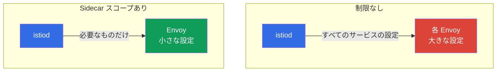

[Русская версия](ru.md) · [Eng version](en.md) · [Versión en español](es.md) · [Version française](fr.md) · [Deutsche Version](de.md) · [ქართული ვერსია](ge.md) · [繁體中文版](tw.md)

# 第19章: Sidecar のスコープ設定とプロキシ設定の最適化

> **この先について。** 高度なシナリオの領域が始まります。最初のテーマは最適化です。
> デフォルトでは、各 sidecar は mesh 内のすべてのサービスを認識しており、大規模なクラスターでは
> コストがかかります。Envoy 設定の肥大化、余分なメモリ、istiod への負荷です。この章では、
> `Sidecar` リソースと discovery selectors を使ってプロキシの可視範囲を制限する方法を
> 学びます。

## 19.1. 問題: デフォルトの「full mesh」

デフォルトでは、Istio は「完全な mesh」として動作します。istiod は**すべての** sidecar に
クラスター内の**すべて**のサービスの設定を配信します。その Pod が決してアクセスしないサービスも
含まれます。小規模なクラスターでは目立ちませんが、数百から数千のサービスになると、
実際の問題が発生します。

- **メモリ。** 各 Envoy はすべてのサービスの設定を保持します。これはプロキシあたり数十から数百 MB に
  なり、数千の Pod に掛け合わされます。
- **istiod への負荷。** 何らかの変更（Pod の出現、サービスの変更）があるたび、istiod は
  すべてのプロキシの設定を再計算して配信します。
- **配信速度。** 設定が大きいほど、Envoy に届いて適用されるまでの時間が長くなります。



最適化の考え方は単純です。特定の Pod が実際に必要とするサービスを Istio に伝え、
それ以外を配信しないようにします。

## 19.2. Sidecar リソース: 可視性の制限

`Sidecar` リソース（第12章で egress 用に見たもの）は、`egress.hosts` を通じて、
プロキシが「見える」サービスを制限できます。

```yaml
apiVersion: networking.istio.io/v1
kind: Sidecar
metadata:
  name: default            # 名前 default = namespace 全体に対して
  namespace: app
spec:
  egress:
  - hosts:
    - "./*"                # 自 namespace のサービス
    - "istio-system/*"     # システムサービス (gateway など)
```

- **`egress.hosts`** は、sidecar が認識する対象を `namespace/service` 形式で列挙したリストです。
- **`"./*"`** は、現在の namespace 内のすべてのサービスです。
- **`"istio-system/*"`** は、istio-system のサービスです（mesh の動作に必要です）。

これで istiod は、この namespace の Pod に対し、クラスター全体ではなく、列挙された
サービスだけの設定を送信します。アプリケーションが他の namespace のサービスにもアクセスする場合は、
たとえば `"payments/*"` のようにリストへ追加します。

`Sidecar` は `egress.hosts` だけを管理するものではない点も覚えておくべきです。同じリソースで、
以下も設定します。

- **`outboundTrafficPolicy`** は、外部への通信モードです（`REGISTRY_ONLY`/`ALLOW_ANY`、第12章）。
- **`ingress`** は、プロキシがリッスンする受信ポートです（トラフィック受信の細かな設定）。
- **`egress.hosts`** は、プロキシが送信時に認識する対象です（今回の最適化テーマ）。

つまり、`Sidecar` は namespace におけるプロキシの可視範囲とトラフィックをまとめて制御する手段です。

## 19.3. 得られる効果

可視性の制限は、19.1 の3つの問題に直接効きます。

- **プロキシのメモリを削減。** Envoy は必要な設定の部分だけを保持します。
- **istiod の負荷を削減。** 「見えない」 namespace での変更は、これらの Pod に対する設定の
  再計算・再配信をもはや引き起こしません。
- **配信と適用が高速化。** 小さな設定はより速く届き、適用されます。

大規模なクラスターでは、その差は劇的です。プロキシ設定は数百 MB から数 MB まで縮小できることがあります。
これは、規模に対応するための Istio の主要な最適化の一つです。

副次的な利点はセキュリティです。必要なサービスだけが「見える」 Pod は、悪用の対象領域が小さくなります
（同じ `Sidecar` リソースで設定する第12章の `REGISTRY_ONLY` を思い出してください）。

## 19.4. Discovery selectors: mesh レベルでの制限

`Sidecar` は namespace レベルで動作します。より大きなレバーとして、Istio のインストール時に
`MeshConfig` でグローバルに設定する **discovery selectors** があります。これは istiod に、
**そもそもどの namespace を監視するか**を伝えます。

```yaml
meshConfig:
  discoverySelectors:
  - matchLabels:
      istio-discovery: enabled
```

この設定では、istiod は `istio-discovery: enabled` ラベルを持つ namespace だけを考慮します。
その他の namespace（たとえば mesh を使用しない純粋な Kubernetes の namespace）で起きることは
完全に無視し、リソースを消費せず、それらの情報をプロキシに配信しません。

`Sidecar` との違いは次のとおりです。

- **discovery selectors** は、mesh 全体に対する粗いフィルターです。istiod がそもそも考慮する
  namespace を定めます。インストール時に一度設定します。
- **Sidecar** は、namespace/Pod レベルの精密な設定です。特定のプロキシが認識する対象を定めます。

両者は併用します。discovery selectors で不要な namespace 全体を除外し、`Sidecar` で
残った namespace 内の可視性をさらに絞り込みます。

## 19.5. 実運用での適用タイミングと方法

運用上の重要な問いは、full mesh がいつ問題になり始めたかをどう判断し、何も壊さずにどの順序で
制限を導入するかです。

### 導入すべき兆候

「念のため」の最適化はしないでください。次のシグナルを確認します。

- **istiod に負荷がかかっている。** istiod の CPU とメモリが増加し、設定配信が追いつかなくなります。
- **収束が遅い。** メトリクス `pilot_proxy_convergence_time`（プロキシへの設定配信にかかる時間）が
  増加し、プロキシが `STALE` ステータス（`istioctl proxy-status`）に長く留まります。
- **プロキシ設定が大きい。** Envoy コンテナが大量のメモリを消費し、ダンプ
  `istioctl proxy-config all <pod>` のサイズが数十 MB に達して増加しています。
- **規模。** mesh に数百のサービスと多数の namespace があり、その一部は互いにまったく関係ありません。

サービスが少なく istiod のメトリクスが安定している場合は、full mesh のままで問題ありません。

### 導入の順序

「一度にどこでもスコープを有効にする」のではなく、段階的かつ測定可能な形で進めてください。

1. **baseline を取得する。** 変更前に、istiod のメモリ、プロキシのメモリ、設定サイズ
   （`istioctl proxy-config all <pod> -o json | wc -c`）、`pilot_proxy_convergence_time` を記録します。
   基準となる数値がなければ、効果があったかどうかは判断できません。
2. **discovery selectors で不要な namespace を除外する。** 最も低コストで大きなステップです。
   mesh にまったく属さない namespace を istiod の視野から外します。
3. **依存関係マップを作る。** Kiali のグラフ（第17章）、`istio_requests_total` のメトリクス
   （ラベル `source_workload` / `destination_service`）、または access log から、実際にどこがどこへ
   通信しているかを調べます。これが `egress.hosts` の基礎になります。
4. **`Sidecar` を namespace ごとに1つずつ導入する。** 重要度の低いものから staging で始めます。
   各 namespace について、依存関係マップに基づき `egress.hosts` = 自身の namespace + istio-system +
   アクセス先を記述します。
5. **何も壊れていないことを確認する。** `istioctl analyze`、サービス間のアクセステスト、
   `istioctl proxy-config`（必要なクラスターが見えるか）を実行します。利用頻度が低く忘れがちな依存関係には
   特に注意してください。
6. **効果を測定してさらに展開する。** baseline と比較して改善を確認し、次の namespace に進みます。

### 依存関係マップの作り方

最も信頼できる方法は、ドキュメントではなく実際のトラフィックに基づくことです。

```bash
# payments サービスにアクセスしているのは誰か (Istio のメトリクスによる)
istio_requests_total{destination_service_name="payments"}   # source_workload を確認
```

Kiali のグラフも同じ内容を視覚的に示します。実際の「誰が誰へ」のマップを集めれば、
`egress.hosts` に何を記述すべきかを正確に把握でき、必要なものを切り落とすことがありません。

## 19.6. 可視性を制限する3つのレバー

`Sidecar` と discovery selectors に加え、Istio には3つ目の仕組みである `exportTo` があります。
3つは異なるレベルで動作し、互いを補完するため、まとめて把握すると便利です。

| 仕組み | レベル | 制限するもの |
|----------|---------|------------------|
| **discovery selectors** (MeshConfig) | mesh 全体 | istiod がそもそも監視する namespace |
| **`Sidecar`** (`egress.hosts`) | namespace / Pod | 特定のプロキシが認識する対象 |
| **`exportTo`** (リソース上) | リソース自身 | このサービス/設定が見える namespace |

`exportTo` は**リソース側**で設定し、誰がそのリソースにアクセスできるかを定めます。`.` は自身の
namespace のみ、`*` はすべて（デフォルト）、または namespace の一覧です。これは `Service`（アノテーション
`networking.istio.io/exportTo` 経由）のほか、`VirtualService`、`DestinationRule`、`ServiceEntry`
（第12章）でも使用できます。

```yaml
apiVersion: v1
kind: Service
metadata:
  name: internal-only
  namespace: payments
  annotations:
    networking.istio.io/exportTo: "."     # 自 namespace 内でのみ見える
```

方向性の違いは次のとおりです。`Sidecar` は「何を見たいか」（コンシューマー側）、`exportTo` は
「誰に自分を見せることを許可するか」（サービス所有者側）です。大規模なプラットフォームではこれらを
組み合わせます。discovery selectors で namespace を大まかに除外し、`exportTo` で内部サービスを
他チームから隠し、`Sidecar` で特定プロキシの設定を絞り込みます。

> **Ambient mode では状況が変わります。** ここまでの内容は、各 Pod が完全な設定を持つ Envoy を
> 使用する従来の sidecar モードについてです。**ambient mode**（第22章）では、L4 トラフィックは
> ノードごとに共有される `ztunnel` が処理し、L7 はオプションの `waypoint` が処理します。そのため、
> 「各 Pod にある肥大化した Envoy」という問題はこの形では生じません。discovery selectors は引き続き有用ですが、
> `Sidecar` スコープ設定の必要性は大きく下がります。

## 19.7. その他のプロキシ最適化

可視範囲は主要なものですが、規模に対応するプロキシ設定はそれだけではありません。知っておくべき
その他のレバーをいくつか紹介します。

- **`concurrency`（Envoy ワーカー）。** sidecar のワーカースレッド数です。デフォルトでは Istio は
  Pod の vCPU 数に応じて設定します。CPU 制限は大きいが実トラフィックが少ない Pod では、これは
  消費量を膨らませます。プロキシが余分なスレッドやメモリを使用しないよう、`concurrency: 2`
  （`proxy.istio.io/config` アノテーションまたはグローバル設定）に固定することがよくあります。
- **sidecar のリソース。** `istio-proxy` コンテナの requests/limits は、デフォルト任せでなく、
  意図して設定してください（`sidecar.istio.io/proxyCPU`、`proxyMemory` アノテーション）。特に密に
  配置されたノードでは重要です。
- **`holdApplicationUntilProxyStarts`。** アプリケーションコンテナを sidecar の準備完了まで待機させ、
  Pod 起動時の競合（アプリケーションがプロキシより先に起動し、最初のリクエストが失敗する）を解消します。
  短命な job や起動に敏感なサービスで有用です。
- **istiod の監視。** `PILOT_*` メトリクスと `pilot_proxy_convergence_time`（19.5）は、最適化が
  効果を上げているかを示す主要な指標です。変更の前後で追跡してください。

これらの設定はスコープ設定とは直交しています。予測可能なプロキシのリソース消費を望む場合、
大規模・中規模を問わず適用します。

## 19.8. ベストプラクティス

- **小規模なクラスターでは複雑にしない。** サービス数が少ない間は、デフォルトの full mesh で
  正常に動作します。最適化が必要なのは規模が増えたとき（数百以上のサービス）です。
- **discovery selectors から始める。** 一部の namespace がそもそも mesh に含まれないなら、
  istiod レベルで除外してください。最も低コストで大きな改善です。
- **namespace ごとに Sidecar を追加する。** 各 namespace に対し、実際の依存関係リスト
  （自身の namespace + アクセス先）を持つ `Sidecar` を記述します。これによりプロキシ設定が減り、
  同時にセキュリティも向上します。
- **依存関係リストを最新に保つ。** あるサービスが新しい namespace へアクセスし始めても、`Sidecar` に
  それがなければトラフィックは壊れます。これはトレードオフです。より正確なスコープには、より慎重な
  維持管理が求められます。
- **効果を監視する。** 変更前後でプロキシ設定のサイズ（`istioctl proxy-config` と istiod のメトリクス）を
  見て、実際の改善を確認してください。

## 19.9. この章のまとめ

- デフォルトでは各 sidecar が mesh 内のすべてのサービスの設定を受け取ります。大規模なクラスターでは、
  メモリ、istiod の負荷、配信速度の面でコストがかかります。
- **`Sidecar` リソース**は `egress.hosts` を通じて、namespace 内のプロキシが認識するサービスを
  制限します。設定が小さくなり、istiod の負荷も下がります。
- `MeshConfig` の **Discovery selectors** は、istiod がそもそも監視する namespace を定める、
  mesh 全体の粗いフィルターです。
- 両者は併用します。discovery selectors で namespace を除外し、`Sidecar` で残りの内部の可視性を
  絞り込みます。
- 3つ目の可視性レバーは **`exportTo`**（`Service`/`VirtualService`/`DestinationRule`/
  `ServiceEntry` 上）です。所有者側からサービスを見せる相手を制限します。`Sidecar` はコンシューマー側です。
  discovery selectors と合わせて併用します。
- `Sidecar` は `egress.hosts` だけでなく、`outboundTrafficPolicy` と `ingress` も管理します。
- その他のプロキシ最適化には、`concurrency`（Envoy ワーカー）、sidecar のリソース、
  `holdApplicationUntilProxyStarts` があります。
- **ambient mode**（第22章）では、肥大化した Pod ごとの Envoy 設定という問題はこの形ではなくなり、
  Sidecar のスコープ設定はあまり必要ではありません。
- スコープ設定の副次的な利点はセキュリティです（見えるサービスが少なくなります）。
- トレードオフとして、正確なスコープでは依存関係リストを最新の状態に保つ必要があります。
- istiod の負荷、収束時間（`pilot_proxy_convergence_time`）、プロキシ設定のサイズが増加したら、
  スコープ設定を導入する時期です。段階的に導入します。baseline → discovery selectors →
  依存関係マップ（Kiali/メトリクス）→ namespace ごとの Sidecar → 検証 → 効果測定。

## 19.10. 理解度チェック

1. デフォルトの full mesh は、なぜ大規模なクラスターで問題になるのでしょうか？
2. `Sidecar` リソースはどのように可視性を制限し、その結果プロキシ設定には何が起きますか？
3. discovery selectors と `Sidecar` は、作用するレベルにおいてどのように異なりますか？
4. discovery selectors と `Sidecar` はどのように互いを補完しますか？
5. スコープを狭くしすぎるリスクは何ですか？ また、それをどう回避しますか？
6. 制限を導入するべき兆候は何ですか？ 安全な導入順序と、依存関係マップの作り方を説明してください。
7. 可視性を制限する3つの仕組みは何ですか？ また、`exportTo` は方向性において `Sidecar` とどう異なりますか？
8. スコープ設定以外には、どのようなプロキシ最適化がありますか（`concurrency`、リソース、
   `holdApplicationUntilProxyStarts`）？
9. ambient mode で Sidecar のスコープ設定があまり必要でないのはなぜですか？

## 演習

`Sidecar` リソースを通じて、プロキシ設定の可視範囲を制限する練習をしてください。

🧪 ラボ21: [tasks/ica/labs/21](../../labs/21/README_JP.MD)

---
[目次](../README_JP.md) · [第18章](../18/jp.md) · [第20章](../20/jp.md)
