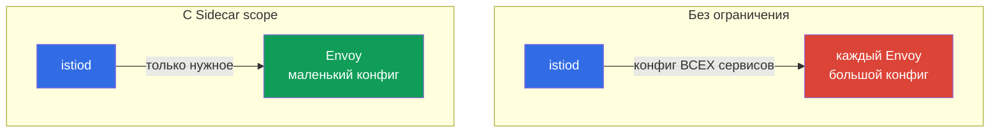

[Eng version](en.md) · [Versión en español](es.md) · [Version française](fr.md) · [Deutsche Version](de.md)

# Глава 19. Sidecar scoping и оптимизация конфигурации прокси

> **Что дальше.** Начинается домен продвинутых сценариев. Первый из них - оптимизация.
> По умолчанию каждый sidecar знает про все сервисы mesh, и на большом кластере это
> дорого: раздутые конфиги Envoy, лишняя память, нагрузка на istiod. В этой главе
> разберём, как ограничить область видимости прокси через ресурс `Sidecar` и discovery
> selectors.

## 19.1. Проблема: «full mesh» по умолчанию

По умолчанию Istio работает как «полный mesh»: istiod рассылает **каждому** sidecar
конфигурацию **всех** сервисов кластера - даже тех, к которым этот под никогда не
обращается. В маленьком кластере это незаметно, но при сотнях и тысячах сервисов
возникают реальные проблемы:

- **Память.** Каждый Envoy хранит конфиг всех сервисов - это десятки и сотни мегабайт
  на прокси, помноженные на тысячи подов.
- **Нагрузка на istiod.** При любом изменении (появился под, поменялся сервис) istiod
  пересчитывает и рассылает конфиг всем прокси.
- **Скорость доставки.** Чем больше конфиг, тем дольше он летит до Envoy и применяется.



Идея оптимизации простая: сказать Istio, какие сервисы реально нужны конкретным подам, и
не рассылать им всё остальное.

## 19.2. Ресурс Sidecar: ограничение видимости

Ресурс `Sidecar` (тот самый, что мы видели в главе 12 для egress) позволяет ограничить,
какие сервисы «видит» прокси, через `egress.hosts`:

```yaml
apiVersion: networking.istio.io/v1
kind: Sidecar
metadata:
  name: default            # имя default = на весь namespace
  namespace: app
spec:
  egress:
  - hosts:
    - "./*"                # сервисы своего namespace
    - "istio-system/*"     # системные сервисы (шлюзы и т.п.)
```

- **`egress.hosts`** - список того, что видит sidecar, в формате `namespace/service`.
- **`"./*"`** - все сервисы текущего namespace.
- **`"istio-system/*"`** - сервисы из istio-system (нужны для работы mesh).

Теперь istiod пришлёт подам этого namespace конфигурацию только для перечисленных
сервисов, а не для всего кластера. Если приложение обращается к сервисам ещё в
каком-то namespace, его добавляют в список: например, `"payments/*"`.

Стоит помнить, что `Sidecar` управляет не только `egress.hosts`. Тот же ресурс задаёт:

- **`outboundTrafficPolicy`** - режим выхода наружу (`REGISTRY_ONLY`/`ALLOW_ANY`, глава 12);
- **`ingress`** - какие входящие порты слушает прокси (тонкая настройка приёма трафика);
- **`egress.hosts`** - что видно прокси на исходящих (наша тема оптимизации).

То есть `Sidecar` - это единая «ручка» области видимости и трафика прокси в namespace.

## 19.3. Что это даёт

Ограничение видимости напрямую бьёт по трём проблемам из 19.1:

- **Меньше памяти на прокси.** Envoy хранит только нужную часть конфигурации.
- **Меньше нагрузки на istiod.** Изменение в «невидимом» namespace больше не заставляет
  пересчитывать и рассылать конфиг этим подам.
- **Быстрее доставка и применение.** Маленький конфиг долетает и применяется быстрее.

На больших кластерах разница драматичная: конфиг прокси может уменьшиться с сотен
мегабайт до единиц. Это одна из главных оптимизаций Istio под масштаб.

Побочный полезный эффект - безопасность: под, которому «видны» только нужные сервисы,
имеет меньшую поверхность для злоупотреблений (вспомните `REGISTRY_ONLY` из главы 12,
который задаётся тем же ресурсом `Sidecar`).

## 19.4. Discovery selectors: ограничение на уровне mesh

`Sidecar` работает на уровне namespace. Есть и более крупный рычаг - **discovery
selectors**, который задаётся глобально в `MeshConfig` (при установке Istio). Он говорит
istiod, **какие namespace вообще отслеживать**.

```yaml
meshConfig:
  discoverySelectors:
  - matchLabels:
      istio-discovery: enabled
```

С такой настройкой istiod будет учитывать только namespace с меткой
`istio-discovery: enabled`, а всё, что происходит в остальных namespace (например, в
чисто «кубернетесных» неймспейсах без mesh), он вообще игнорирует - не тратит ресурсы и
не рассылает информацию о них в прокси.

Разница с `Sidecar`:

- **discovery selectors** - грубый фильтр на уровне всего mesh: какие namespace istiod
  вообще берёт в расчёт. Настраивается один раз при установке.
- **Sidecar** - точная настройка на уровне namespace/подов: что видит конкретный прокси.

Их используют вместе: discovery selectors отсекают целые ненужные namespace, а `Sidecar`
дополнительно сужает видимость внутри тех, что остались.

## 19.5. Когда и как применять на практике

Главный вопрос эксплуатации: как понять, что full mesh уже мешает, и в каком порядке
вводить ограничения, чтобы ничего не сломать.

### Признаки, что пора

Не оптимизируйте «на всякий случай». Смотрите на сигналы:

- **istiod под нагрузкой.** Растут CPU и память istiod, он не успевает рассылать конфиг.
- **Медленная сходимость.** Метрика `pilot_proxy_convergence_time` (сколько занимает
  доставка конфига до прокси) увеличивается; прокси подолгу висят в статусе `STALE`
  (`istioctl proxy-status`).
- **Большие конфиги прокси.** Envoy-контейнеры едят много памяти; размер дампа
  `istioctl proxy-config all <pod>` - десятки мегабайт и растёт.
- **Масштаб.** В mesh сотни сервисов и много namespace, часть которых вообще не связана
  друг с другом.

Если сервисов немного и метрики istiod спокойны - оставьте full mesh, это нормально.

### Порядок внедрения

Действуйте постепенно и измеримо, а не «включим scope везде разом»:

1. **Снимите baseline.** Зафиксируйте до изменений: память istiod, память прокси, размер
   конфига (`istioctl proxy-config all <pod> -o json | wc -c`), `pilot_proxy_convergence_time`.
   Без базовых цифр вы не поймёте, помогло ли.
2. **Отсеките лишние namespace через discovery selectors.** Самый дешёвый и крупный шаг:
   уберите из поля зрения istiod namespace, которые вообще не в mesh.
3. **Постройте карту зависимостей.** Выясните, кто к кому реально ходит - по графу Kiali
   (глава 17), по метрикам `istio_requests_total` (метки `source_workload` /
   `destination_service`) или по access-логам. Это основа для `egress.hosts`.
4. **Внедряйте `Sidecar` по одному namespace,** начиная с некритичных и в staging.
   Для каждого namespace опишите `egress.hosts` = свой namespace + istio-system + те, к
   кому он обращается по карте зависимостей.
5. **Проверьте, что ничего не сломалось.** `istioctl analyze`, тесты доступа между
   сервисами, `istioctl proxy-config` (видны ли нужные кластеры). Особое внимание -
   зависимостям, которые редко используются и легко забыть.
6. **Измерьте эффект и раскатывайте дальше.** Сравните с baseline, убедитесь в выигрыше,
   переходите к следующим namespace.

### Как строить карту зависимостей

Самый надёжный способ - по фактическому трафику, а не по документации:

```bash
# кто обращается к сервису payments (по метрикам Istio)
istio_requests_total{destination_service_name="payments"}   # смотрим source_workload
```

Граф Kiali показывает это же визуально. Собрав реальную карту «кто-кому», вы точно
знаете, что вписать в `egress.hosts`, и не отрежете нужное.

## 19.6. Три рычага ограничения видимости

Помимо `Sidecar` и discovery selectors, у Istio есть третий механизм - `exportTo`. Полезно
видеть все три вместе, потому что они работают на разных уровнях и дополняют друг друга:

| Механизм | Уровень | Что ограничивает |
|----------|---------|------------------|
| **discovery selectors** (MeshConfig) | весь mesh | какие namespace istiod вообще отслеживает |
| **`Sidecar`** (`egress.hosts`) | namespace / поды | что видит конкретный прокси |
| **`exportTo`** (на ресурсе) | сам ресурс | в какие namespace виден этот сервис/конфиг |

`exportTo` задаётся **на стороне ресурса** и говорит, кому он вообще доступен: `.` - только
свой namespace, `*` - все (по умолчанию), либо перечень namespace. Он есть у `Service` (через
аннотацию `networking.istio.io/exportTo`), а также у `VirtualService`, `DestinationRule` и
`ServiceEntry` (глава 12):

```yaml
apiVersion: v1
kind: Service
metadata:
  name: internal-only
  namespace: payments
  annotations:
    networking.istio.io/exportTo: "."     # виден только в своём namespace
```

Разница в направлении: `Sidecar` - это «что я хочу видеть» (со стороны потребителя),
`exportTo` - «кому я разрешаю себя видеть» (со стороны владельца сервиса). На больших
платформах их комбинируют: discovery selectors грубо отсекают namespace, `exportTo` прячет
внутренние сервисы от чужих команд, а `Sidecar` сужает конфиг конкретных прокси.

> **Ambient mode меняет расклад.** Всё вышесказанное - про классический sidecar-режим, где у
> каждого пода свой Envoy с полным конфигом. В **ambient mode** (глава 22) L4-трафик обслуживает
> общий per-node `ztunnel`, а L7 - опциональный `waypoint`, поэтому проблема «раздутый Envoy в
> каждом поде» в такой форме не стоит. discovery selectors там всё ещё полезны, а вот
> необходимость в `Sidecar`-scoping заметно снижается.

## 19.7. Другие оптимизации прокси

Область видимости - главная, но не единственная настройка прокси под масштаб. Ещё несколько
рычагов, которые стоит знать:

- **`concurrency` (воркеры Envoy).** Сколько рабочих потоков у sidecar. По умолчанию Istio
  ставит его по числу vCPU пода; на подах с большим лимитом CPU, но малым реальным трафиком это
  раздувает потребление. Часто фиксируют `concurrency: 2` (аннотация
  `proxy.istio.io/config` или глобально), чтобы прокси не занимал лишние потоки/память.
- **Ресурсы sidecar.** Задавайте requests/limits для контейнера `istio-proxy` осознанно
  (аннотации `sidecar.istio.io/proxyCPU`, `proxyMemory`), а не по дефолту - особенно на плотно
  упакованных нодах.
- **`holdApplicationUntilProxyStarts`.** Заставляет контейнер приложения ждать готовности
  sidecar - устраняет гонку на старте пода (приложение стартует раньше прокси и первые запросы
  падают). Полезно для коротких job'ов и чувствительных к старту сервисов.
- **Мониторинг istiod.** `PILOT_*` метрики и `pilot_proxy_convergence_time` (19.5) - основной
  индикатор, помогает ли оптимизация; следите за ними до/после изменений.

Эти настройки ортогональны scoping: их применяют и на большом, и на среднем кластере, когда
хотят предсказуемого потребления ресурсов прокси.

## 19.8. Best practices

- **На небольшом кластере не усложняйте.** Пока сервисов немного, дефолтный full mesh
  работает нормально. Оптимизация нужна при росте (сотни+ сервисов).
- **Начните с discovery selectors.** Если часть namespace вообще не в mesh, отсеките их
  на уровне istiod - это самый дешёвый и крупный выигрыш.
- **Добавьте Sidecar по namespace.** Для каждого namespace опишите `Sidecar` с реальным
  списком зависимостей (свой namespace + те, к кому обращается). Это снижает конфиг
  прокси и заодно улучшает безопасность.
- **Держите список зависимостей в актуальном состоянии.** Если сервис начал обращаться к
  новому namespace, а в `Sidecar` его нет - трафик сломается. Это компромисс: точнее
  scope значит строже требования к аккуратности.
- **Мониторьте эффект.** Смотрите на размер конфига прокси (`istioctl proxy-config` и
  метрики istiod) до и после - так вы увидите реальный выигрыш.

## 19.9. Итоги главы

- По умолчанию каждый sidecar получает конфигурацию всех сервисов mesh; на большом
  кластере это дорого по памяти, нагрузке на istiod и скорости доставки.
- **Ресурс `Sidecar`** через `egress.hosts` ограничивает, какие сервисы видит прокси в
  namespace - конфиг уменьшается, istiod разгружается.
- **Discovery selectors** в `MeshConfig` задают, какие namespace istiod вообще
  отслеживает - грубый фильтр на уровне всего mesh.
- Их применяют вместе: discovery selectors отсекают namespace, `Sidecar` сужает
  видимость внутри оставшихся.
- Третий рычаг видимости - **`exportTo`** (на `Service`/`VirtualService`/`DestinationRule`/
  `ServiceEntry`): со стороны владельца ограничивает, кому сервис виден; `Sidecar` - со стороны
  потребителя. Их комбинируют вместе с discovery selectors.
- `Sidecar` управляет не только `egress.hosts`, но и `outboundTrafficPolicy` и `ingress`.
- Другие прокси-оптимизации: `concurrency` (воркеры Envoy), ресурсы sidecar,
  `holdApplicationUntilProxyStarts`.
- В **ambient mode** (глава 22) проблема раздутого per-pod Envoy-конфига в этой форме уходит;
  Sidecar-scoping там нужен меньше.
- Побочный плюс scope - безопасность (меньше видимых сервисов).
- Компромисс: точный scope требует поддерживать список зависимостей в актуальном виде.
- Пора вводить scope, когда растут нагрузка на istiod, время сходимости
  (`pilot_proxy_convergence_time`) и размер конфига прокси. Внедрять постепенно: baseline
  -> discovery selectors -> карта зависимостей (Kiali/метрики) -> Sidecar по namespace ->
  проверка -> замер эффекта.

## 19.10. Вопросы для самопроверки

1. Почему full mesh по умолчанию становится проблемой на большом кластере?
2. Как ресурс `Sidecar` ограничивает видимость и что при этом происходит с конфигом
   прокси?
3. Чем discovery selectors отличаются от `Sidecar` по уровню действия?
4. Как discovery selectors и `Sidecar` дополняют друг друга?
5. В чём риск слишком узкого scope и как его избежать?
6. По каким признакам понять, что пора вводить ограничения? Опишите порядок безопасного
   внедрения и как построить карту зависимостей.
7. Какие три механизма ограничивают видимость и чем `exportTo` отличается от `Sidecar` по
   направлению?
8. Какие ещё оптимизации прокси есть помимо scoping (`concurrency`, ресурсы,
   holdApplicationUntilProxyStarts)?
9. Почему в ambient mode Sidecar-scoping нужен меньше?

## Практика

Отработайте ограничение области конфигурации прокси через ресурс `Sidecar`:

🧪 Лаба 21: [tasks/ica/labs/21](../../labs/21/README_RU.MD)

---
[Оглавление](../README.md) · [Глава 18](../18/ru.md) · [Глава 20](../20/ru.md)
