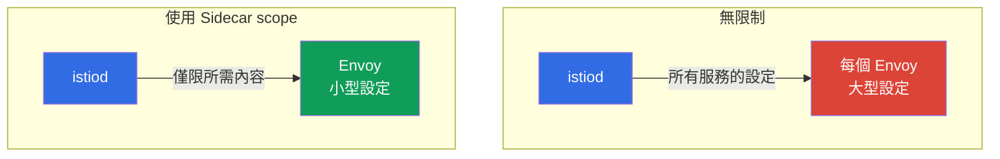

[Русская версия](ru.md) · [Eng version](en.md) · [Versión en español](es.md) · [Version française](fr.md) · [Deutsche Version](de.md) · [ქართული ვერსია](ge.md) · [日本語版](jp.md)

# 第 19 章。Sidecar 範圍界定與 Proxy 設定最佳化

> **接下來。** 進入進階情境的領域。第一個就是最佳化。預設情況下，每個 sidecar 都知道 mesh 中的所有服務；在大型叢集上，這代價高昂：Envoy 設定膨脹、額外記憶體用量、istiod 負載。本章將說明如何透過 `Sidecar` 資源與 discovery selectors 限制 Proxy 的可見範圍。

## 19.1. 問題：預設的「full mesh」

預設情況下，Istio 以「完整 mesh」運作：istiod 將叢集中**所有**服務的設定發送給**每個** sidecar--即使該 Pod 永遠不會存取那些服務。在小型叢集中這不明顯，但當有數百甚至數千個服務時，就會出現實際問題：

- **記憶體。** 每個 Envoy 都儲存所有服務的設定--每個 Proxy 需數十到數百 MB，再乘上數千個 Pod。
- **istiod 負載。** 每當有任何變更（新增 Pod、服務變更），istiod 都會重新計算並將設定發送給所有 Proxy。
- **傳送速度。** 設定越大，傳送到 Envoy 並套用所需的時間越長。



最佳化的概念很簡單：告訴 Istio 特定 Pod 實際需要哪些服務，不要將其餘所有內容發送給它們。

## 19.2. Sidecar 資源：限制可見性

`Sidecar` 資源（我們在第 12 章針對 egress 看過的那個）可透過 `egress.hosts` 限制 Proxy「看得見」哪些服務：

```yaml
apiVersion: networking.istio.io/v1
kind: Sidecar
metadata:
  name: default            # 名稱 default = 套用於整個 namespace
  namespace: app
spec:
  egress:
  - hosts:
    - "./*"                # 自己 namespace 的服務
    - "istio-system/*"     # 系統服務（gateway 等）
```

- **`egress.hosts`**--sidecar 可見項目的清單，格式為 `namespace/service`。
- **`"./*"`**--目前 namespace 中的所有服務。
- **`"istio-system/*"`**--istio-system 中的服務（mesh 運作所需）。

現在 istiod 只會將列出服務的設定發送給該 namespace 的 Pod，而非整個叢集。若應用程式還會存取其他 namespace 中的服務，請將其加入清單，例如：`"payments/*"`。

請記住，`Sidecar` 不只管理 `egress.hosts`。同一個資源還會設定：

- **`outboundTrafficPolicy`**--對外流量模式（`REGISTRY_ONLY`/`ALLOW_ANY`，第 12 章）；
- **`ingress`**--Proxy 監聽哪些傳入連接埠（接收流量的精細設定）；
- **`egress.hosts`**--Proxy 在傳出流量時可見哪些項目（本章的最佳化主題）。

換言之，`Sidecar` 是 namespace 中 Proxy 可見性與流量的一個統一「控制項」。

## 19.3. 帶來的效益

限制可見性會直接解決 19.1 節中的三個問題：

- **Proxy 使用更少記憶體。** Envoy 僅儲存所需的設定部分。
- **istiod 負載更低。** 「不可見」namespace 中的變更不再迫使它重新計算並將設定發送給這些 Pod。
- **傳送與套用更快。** 較小的設定傳送及套用都更快。

在大型叢集中，差異非常顯著：Proxy 設定可從數百 MB 縮小至個位數 MB。這是 Istio 因應規模的主要最佳化之一。

一個有益的附帶效果是安全性：僅「看得見」所需服務的 Pod，其遭濫用的攻擊面較小（請回想第 12 章，同樣由 `Sidecar` 資源設定的 `REGISTRY_ONLY`）。

## 19.4. Discovery selectors：mesh 層級的限制

`Sidecar` 在 namespace 層級運作。另有一個更大範圍的控制項--**discovery selectors**，它在 `MeshConfig` 中全域設定（安裝 Istio 時）。它告訴 istiod **應該追蹤哪些 namespace**。

```yaml
meshConfig:
  discoverySelectors:
  - matchLabels:
      istio-discovery: enabled
```

使用此設定時，istiod 僅會考量具有 `istio-discovery: enabled` 標籤的 namespace；其他 namespace 中發生的一切（例如完全沒有 mesh 的純「Kubernetes」namespace）都會被它完全忽略--不消耗資源，也不將其資訊發送給 Proxy。

與 `Sidecar` 的差異：

- **discovery selectors**--整個 mesh 層級的粗略篩選：istiod 整體會將哪些 namespace 納入考量。在安裝時設定一次。
- **Sidecar**--namespace/Pod 層級的精確設定：特定 Proxy 可看見哪些項目。

它們會一起使用：discovery selectors 篩除整個不需要的 namespace，而 `Sidecar` 進一步縮小其餘 namespace 內的可見性。

## 19.5. 實務上何時及如何使用

營運上的主要問題是：如何知道 full mesh 是否已造成阻礙，以及應依什麼順序引入限制才不會破壞任何東西。

### 該開始的徵兆

不要「以防萬一」就最佳化。請觀察以下訊號：

- **istiod 處於負載下。** istiod 的 CPU 與記憶體用量上升，來不及發送設定。
- **收斂緩慢。** `pilot_proxy_convergence_time` 指標（設定送達 Proxy 所花費的時間）增加；Proxy 長時間停留在 `STALE` 狀態（`istioctl proxy-status`）。
- **Proxy 設定很大。** Envoy 容器消耗大量記憶體；`istioctl proxy-config all <pod>` dump 的大小達數十 MB 且持續成長。
- **規模。** mesh 中有數百個服務及許多 namespace，其中一部分彼此毫無關聯。

如果服務不多且 istiod 指標穩定，請保留 full mesh，這完全正常。

### 導入順序

請漸進且可衡量地執行，而不是「一次在所有地方啟用 scope」：

1. **取得 baseline。** 在變更前記錄：istiod 記憶體、Proxy 記憶體、設定大小（`istioctl proxy-config all <pod> -o json | wc -c`）、`pilot_proxy_convergence_time`。沒有基準數字，就無法判斷是否有效。
2. **透過 discovery selectors 篩除多餘 namespace。** 最便宜且影響範圍最大的步驟：從 istiod 的視野中移除根本不在 mesh 內的 namespace。
3. **建立相依性地圖。** 透過 Kiali 圖表（第 17 章）、`istio_requests_total` 指標（標籤 `source_workload` / `destination_service`）或 access log，查明誰實際呼叫誰。這是 `egress.hosts` 的基礎。
4. **一次針對一個 namespace 導入 `Sidecar`，** 從非關鍵環境和 staging 開始。為每個 namespace 描述 `egress.hosts` = 自身 namespace + istio-system + 依相依性地圖所呼叫的對象。
5. **確認沒有任何東西損壞。** `istioctl analyze`、服務間存取測試、`istioctl proxy-config`（所需 cluster 是否可見）。尤其注意很少使用而容易遺漏的相依性。
6. **衡量效果並繼續推出。** 與 baseline 比較，確認收益後，再移至下一個 namespace。

### 如何建立相依性地圖

最可靠的方法是根據實際流量，而非文件：

```bash
# 誰在存取 payments 服務（依 Istio metrics）
istio_requests_total{destination_service_name="payments"}   # 查看 source_workload
```

Kiali 圖表以視覺化方式呈現相同資訊。收集真實的「誰呼叫誰」地圖後，您就能確實知道要在 `egress.hosts` 填入什麼，且不會切斷必要服務。

## 19.6. 三個限制可見性的控制項

除了 `Sidecar` 與 discovery selectors 之外，Istio 還有第三種機制--`exportTo`。應將三者一併理解，因為它們在不同層級運作且互為補充：

| 機制 | 層級 | 限制的項目 |
|----------|---------|------------------|
| **discovery selectors** (`MeshConfig`) | 整個 mesh | istiod 整體追蹤哪些 namespace |
| **`Sidecar`** (`egress.hosts`) | namespace / Pod | 特定 Proxy 可看見哪些項目 |
| **`exportTo`**（在資源上） | 資源本身 | 此服務/設定對哪些 namespace 可見 |

`exportTo` 在**資源端**設定，並表示它整體對誰可用： `.`--僅自身 namespace，`*`--全部（預設），或 namespace 清單。它存在於 `Service`（透過 `networking.istio.io/exportTo` 註解），以及 `VirtualService`、`DestinationRule` 與 `ServiceEntry`（第 12 章）：

```yaml
apiVersion: v1
kind: Service
metadata:
  name: internal-only
  namespace: payments
  annotations:
    networking.istio.io/exportTo: "."     # 僅在自己的 namespace 可見
```

方向上的差異是：`Sidecar` 是「我想看見什麼」（從消費者端），`exportTo` 是「我允許誰看見我」（從服務擁有者端）。在大型平台上，它們會組合使用：discovery selectors 粗略篩除 namespace，`exportTo` 對其他團隊隱藏內部服務，而 `Sidecar` 則縮小特定 Proxy 的設定。

> **Ambient mode 改變了情況。** 以上內容是針對傳統 sidecar 模式，其中每個 Pod 都有自己的 Envoy 與完整設定。在 **ambient mode**（第 22 章）中，L4 流量由共用的 per-node `ztunnel` 處理，而 L7 則由選用的 `waypoint` 處理，因此「每個 Pod 中 Envoy 膨脹」的問題不再以這種形式存在。discovery selectors 在其中仍然有用，但對 `Sidecar`-scoping 的需求顯著降低。

## 19.7. 其他 Proxy 最佳化

可見範圍是主要但非唯一的針對規模的 Proxy 設定。還有幾個值得了解的控制項：

- **`concurrency`（Envoy worker）。** sidecar 的工作執行緒數。預設 Istio 依 Pod 的 vCPU 數量設定；對於 CPU limit 很高但實際流量很小的 Pod，這會膨脹用量。通常會固定 `concurrency: 2`（`proxy.istio.io/config` 註解或全域設定），使 Proxy 不會佔用多餘的執行緒/記憶體。
- **sidecar 資源。** 有意識地為 `istio-proxy` 容器設定 requests/limits（`sidecar.istio.io/proxyCPU`、`proxyMemory` 註解），而不是使用預設值--尤其在密集部署的 Node 上。
- **`holdApplicationUntilProxyStarts`。** 使應用程式容器等待 sidecar 就緒--消除 Pod 啟動時的競態條件（應用程式比 Proxy 更早啟動，因而使前幾個請求失敗）。這對短期 job 及對啟動敏感的服務很有用。
- **監控 istiod。** `PILOT_*` 指標與 `pilot_proxy_convergence_time`（19.5 節）是最佳化是否有效的主要指標；請在變更前後追蹤它們。

這些設定與 scoping 正交：當需要可預測的 Proxy 資源用量時，無論大型或中型叢集都會使用它們。

## 19.8. Best practices

- **小型叢集不要複雜化。** 當服務數量不多時，預設 full mesh 運作良好。成長後（數百個以上服務）才需要最佳化。
- **從 discovery selectors 開始。** 若部分 namespace 根本不在 mesh 中，請在 istiod 層級將它們篩除--這是最便宜且影響最大的收益。
- **依 namespace 新增 Sidecar。** 為每個 namespace 描述具有實際相依性清單的 `Sidecar`（自身 namespace + 所呼叫的對象）。這可縮小 Proxy 設定並同時提升安全性。
- **保持相依性清單為最新狀態。** 若服務開始呼叫新的 namespace，但該 namespace 未加入 `Sidecar`，流量就會中斷。這是一種取捨：scope 越精確，對維護嚴謹性的要求越高。
- **監控效果。** 在變更前後查看 Proxy 設定大小（`istioctl proxy-config` 與 istiod 指標）--如此就能看見實際收益。

## 19.9. 本章總結

- 預設情況下，每個 sidecar 都會收到 mesh 中所有服務的設定；在大型叢集上，這會消耗記憶體、增加 istiod 負載並降低傳送速度。
- **`Sidecar` 資源**透過 `egress.hosts` 限制 Proxy 在 namespace 中可看見哪些服務--設定縮小，istiod 負載降低。
- `MeshConfig` 中的 **Discovery selectors** 定義 istiod 整體追蹤哪些 namespace--這是整個 mesh 層級的粗略篩選。
- 它們會一起使用：discovery selectors 篩除 namespace，`Sidecar` 縮小其餘部分的可見性。
- 第三個可見性控制項是 **`exportTo`**（位於 `Service`/`VirtualService`/`DestinationRule`/`ServiceEntry`）：從擁有者端限制服務對誰可見；`Sidecar` 則從消費者端限制。它們會與 discovery selectors 一起組合使用。
- `Sidecar` 不只管理 `egress.hosts`，也管理 `outboundTrafficPolicy` 與 `ingress`。
- 其他 Proxy 最佳化：`concurrency`（Envoy worker）、sidecar 資源、`holdApplicationUntilProxyStarts`。
- 在 **ambient mode**（第 22 章）中，膨脹的 per-pod Envoy 設定問題以此形式消失；對 Sidecar-scoping 的需求較低。
- scope 的附帶好處是安全性（較少可見服務）。
- 取捨是：精確 scope 需要讓相依性清單保持最新。
- 當 istiod 負載、收斂時間（`pilot_proxy_convergence_time`）及 Proxy 設定大小開始上升時，就該導入 scope。請漸進導入：baseline -> discovery selectors -> 相依性地圖（Kiali/指標）-> 依 namespace 導入 Sidecar -> 驗證 -> 衡量效果。

## 19.10. 自我檢查問題

1. 為何預設 full mesh 在大型叢集上會成為問題？
2. `Sidecar` 資源如何限制可見性，以及這對 Proxy 設定有何影響？
3. discovery selectors 與 `Sidecar` 的作用層級有何不同？
4. discovery selectors 與 `Sidecar` 如何互補？
5. scope 過窄有什麼風險，以及如何避免？
6. 根據哪些徵兆可以判斷該導入限制？請描述安全導入的順序，以及如何建立相依性地圖。
7. 哪三種機制限制可見性？`exportTo` 與 `Sidecar` 在方向上有何不同？
8. 除了 scoping 之外，還有哪些 Proxy 最佳化（`concurrency`、資源、`holdApplicationUntilProxyStarts`）？
9. 為何在 ambient mode 中較少需要 Sidecar-scoping？

## 實作練習

透過 `Sidecar` 資源練習限制 Proxy 設定範圍：

🧪 實驗 21：[tasks/ica/labs/21](../../labs/21/README_TW.MD)

---
[目錄](../README_TW.md) · [第 18 章](../18/tw.md) · [第 20 章](../20/tw.md)
