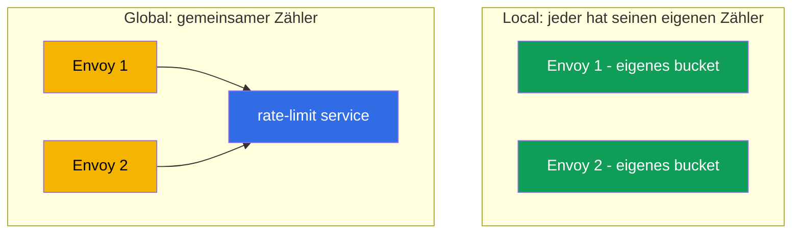
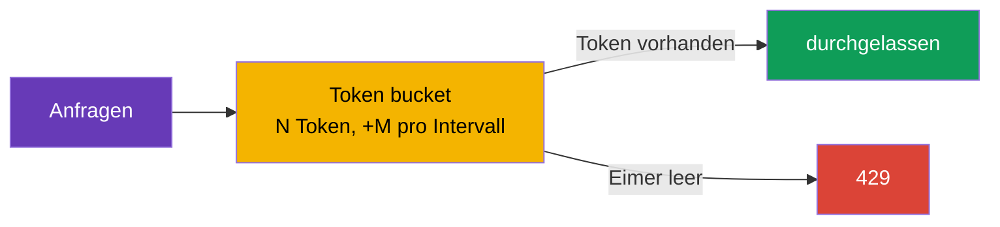

[RU version](ru.md) · [Eng version](en.md) · [Versión en español](es.md) · [Version française](fr.md)

# Kapitel 20. Rate limiting: lokale Begrenzung von Anfragen

> **Was kommt als Nächstes.** Wir setzen die fortgeschrittenen Szenarien fort. Rate limiting
> (Begrenzung der Anfragehäufigkeit) schützt Dienste vor Überlastung, Missbrauch und DoS. In
> diesem Kapitel betrachten wir zwei Ansätze von Istio: den lokalen (einfach, jeder Envoy zählt
> selbst) und den globalen (gemeinsamer Zähler über einen externen Dienst), und verstehen, wann
> man was wählt.

## 20.1. Wozu Rate limiting

Selbst einen gesunden Dienst kann man mit einer zu großen Zahl von Anfragen „überrollen": ein
aggressiver Client, ein verbuggter Retry-Zyklus, ein Parser-Bot oder ein direkter DoS-Angriff.
Rate limiting begrenzt, wie viele Anfragen pro Zeiteinheit erlaubt sind, und weist die
überzähligen sofort mit dem Code `429 Too Many Requests` ab.

Wichtig ist, dies nicht mit dem Circuit Breaking aus Kapitel 8 zu verwechseln:

- **Circuit Breaking** (`connectionPool`) begrenzt **gleichzeitige** Verbindungen und
  Anfragen – Schutz vor Sättigung im Moment.
- **Rate limiting** begrenzt die **Häufigkeit** – die Zahl der Anfragen pro Zeitintervall
  (zum Beispiel 100 Anfragen pro Minute).

Das sind unterschiedliche Werkzeuge für unterschiedliche Aufgaben, oft werden sie zusammen
eingesetzt.

## 20.2. Zwei Ansätze: local und global

In Istio gibt es zwei Arten von Rate limiting.

- **Local rate limit** – jeder Envoy zählt die Anfragen **selbst** und führt einen eigenen
  Zähler. Einfach, schnell, ohne externe Abhängigkeiten. Aber das Limit gilt für jeden proxy
  einzeln.
- **Global rate limit** – Envoy wendet sich an einen **externen** Rate-limit-Dienst mit einem
  gemeinsamen Zähler. Das ergibt ein einheitliches Limit für den gesamten Dienst unabhängig von
  der Zahl der Repliken, fügt aber eine Abhängigkeit und Latenz hinzu.



## 20.3. Local rate limit

Zugrunde liegt der Algorithmus **token bucket** („Eimer mit Token"): Es gibt einen Eimer für N
Token, der mit einer Rate von M Token pro Intervall aufgefüllt wird. Jede Anfrage nimmt einen
Token. Ist ein Token vorhanden – geht die Anfrage durch; ist der Eimer leer – erhält die Anfrage
`429`.



In Istio gibt es kein eigenes komfortables CRD für Local rate limit – man aktiviert es über
`EnvoyFilter`, indem man den Envoy-Filter `local_ratelimit` einbindet. Der Kernteil der
Konfiguration sind gerade die Parameter des Eimers (`token_bucket`). Die vollständige Ressource
für den Dienst `ping-pong`:

```yaml
apiVersion: networking.istio.io/v1alpha3
kind: EnvoyFilter
metadata:
  name: local-ratelimit
  namespace: app
spec:
  workloadSelector:
    labels:
      app: ping-pong                  # auf welche Pods es angewendet wird
  configPatches:
  - applyTo: HTTP_FILTER
    match:
      context: SIDECAR_INBOUND        # wir begrenzen den eingehenden Traffic zum Dienst
      listener:
        filterChain:
          filter:
            name: envoy.filters.network.http_connection_manager
    patch:
      operation: INSERT_BEFORE
      value:
        name: envoy.filters.http.local_ratelimit
        typed_config:
          "@type": type.googleapis.com/envoy.extensions.filters.http.local_ratelimit.v3.LocalRateLimit
          stat_prefix: http_local_rate_limiter
          token_bucket:
            max_tokens: 100           # Größe des Eimers (maximaler Burst)
            tokens_per_fill: 100      # wie viel pro Intervall hinzugefügt wird
            fill_interval: 60s        # Auffüllintervall (100 Anfragen pro Minute)
          filter_enabled:             # für welchen Anteil des Traffics der Filter aktiv ist
            default_value: { numerator: 100, denominator: HUNDRED }
          filter_enforced:            # für welchen Anteil tatsächlich abgewiesen wird (nicht nur gezählt)
            default_value: { numerator: 100, denominator: HUNDRED }
          response_headers_to_add:
          - append_action: OVERWRITE_IF_EXISTS_OR_ADD
            header: { key: x-local-rate-limited, value: "true" }
```

Beachten Sie `filter_enabled` und `filter_enforced` – das sind eben jene „Regler des
Beobachtungsmodus" (20.7): Setzen Sie `filter_enforced` auf 0 %, dann werden Sie
Überschreitungen **nur zählen** (Metrik `http_local_rate_limiter.rate_limited`), ohne etwas zu
blockieren, und schalten die Abweisung erst später ein.

Betrachten wir die physikalische Bedeutung jedes Parameters, denn von ihnen hängen sowohl die
durchschnittliche Rate als auch der zulässige Burst ab (im Manifest stehen sie in snake_case –
`max_tokens`, `tokens_per_fill`, `fill_interval`; unten schreiben wir der Kürze halber
`maxTokens` usw.).

- **`maxTokens` – die Kapazität des Eimers, also der maximale Burst.** Mehr als diese Zahl an
  Token sammelt sich im Eimer niemals an, selbst wenn lange kein Traffic da war. Das heißt, das
  ist das Maximum an Anfragen, die man auf einen Schlag „salvenartig" durchlassen kann. Hier
  100 – auf einmal kann man nicht mehr als 100 Anfragen durchlassen.
- **`tokensPerFill` – wie viele Token pro Auffüllintervall hinzugefügt werden.**
- **`fillInterval` – wie oft das Auffüllen stattfindet.**

Zusammen legen `tokensPerFill` und `fillInterval` die **durchschnittliche eingeschwungene Rate**
fest: `tokensPerFill / fillInterval`. Im Beispiel sind das 100 Token pro 60 Sekunden, also im
Durchschnitt ~100 Anfragen pro Minute. `maxTokens` ist dabei dafür verantwortlich, wie
„stoßhaft" der Traffic um diesen Durchschnitt herum sein darf.

Der Schlüsselunterschied zwischen `maxTokens` und `tokensPerFill`:

- Wenn `maxTokens = tokensPerFill` (wie oben, 100 und 100) – ist der Burst auf eine
  „Portion" Auffüllung begrenzt. Pro Periode gehen nicht mehr als 100 durch, und salvenartig
  ebenfalls nicht mehr als 100.
- Wenn `maxTokens > tokensPerFill` – sammeln sich in ruhigen Perioden ungenutzte Token bis zu
  `maxTokens` an, und danach kann man einen größeren Burst zulassen. Zum Beispiel `maxTokens: 300`,
  `tokensPerFill: 100`, `fillInterval: 60s`: Die durchschnittliche Rate ist immer noch dieselbe
  ~100/min, aber nach einer Ruhephase kann der Client bis zu 300 Anfragen auf einmal „abfeuern",
  bis die angesammelten Token aufgebraucht sind.

Analogie: Der Eimer wird mit Wasser (Token) mit konstanter Rate
(`tokensPerFill`/`fillInterval`) gefüllt, läuft aber nicht über den Rand hinaus (`maxTokens`).
Jede Anfrage schöpft eine Tasse; ist kein Wasser da – erhält die Anfrage `429`. Wollen Sie
„gleichmäßigeren" Traffic ohne große Salven – machen Sie `fillInterval` klein (zum Beispiel
2 Token pro Sekunde hinzufügen statt 120-mal pro Minute in einem Stück) und halten Sie
`maxTokens` nahe an `tokensPerFill`.

Ein wichtiges Detail: Der Zähler ist bei **jedem Envoy eigen**. Hat der Dienst 3 Repliken und
gilt auf jeder ein Limit von 100 Anfragen pro Minute, lässt der Dienst insgesamt bis zu 300
durch – weil sich die Clients auf die Repliken verteilen und jede unabhängig zählt. Das ist in
Ordnung für einen groben Schutz einer einzelnen Instanz, gibt aber kein präzises Limit für den
gesamten Dienst.

## 20.4. Global rate limit

Wenn ein **einheitliches Limit für den gesamten Dienst** unabhängig von der Zahl der Repliken
nötig ist, verwendet man Global rate limit. Hier fragt Envoy bei jeder Anfrage einen externen
**Rate-limit-Dienst** (üblicherweise die Referenzimplementierung Envoy Rate Limit Service + Redis
für den gemeinsamen Zähler): „darf ich noch?". Der Dienst führt einen gemeinsamen Zähler und
antwortet mit erlauben oder abweisen.

Vorteile: präzises Limit für den gesamten Dienst, flexible Regeln (pro Benutzer, pro API-Key,
pro Pfad). Nachteile: Ein zusätzlicher Dienst (und ein Speicher für die Zähler) wird benötigt und
muss laufen, und jede Anfrage macht einen zusätzlichen Netzwerkaufruf zu ihm – das ist eine
Abhängigkeit und eine kleine Latenz.

## 20.5. Begrenzung nach Merkmal (per-IP, per-header)

Ein Rate limit muss nicht „ein Eimer für den ganzen Dienst" sein. Man kann **nach Merkmal**
begrenzen: zum Beispiel nicht mehr als 10 Anfragen pro Sekunde **von einer IP**, oder ein eigenes
Limit pro API-Key, Pfad oder Benutzer. Dafür sind **Deskriptoren** (descriptors) zuständig –
Schlüssel, nach deren Werten ein separater Zähler geführt wird.

Typische Merkmale für die Begrenzung:

- **Client-IP** (`remote_address`) – das klassische „10 rps von einer IP" gegen Bots;
- **Header** – zum Beispiel `x-api-key` oder `x-user-id` (Limit pro Client/Tenant);
- **Pfad oder Methode** – ein strengeres Limit für einen „schweren" oder teuren Endpoint.

Wie sich das auf die beiden Ansätze abbildet:

- **Global rate limit** ist genau dafür geschaffen. Sie beschreiben Regeln nach Deskriptoren, und
  der externe Rate-limit-Dienst führt **einen separaten gemeinsamen Zähler für jeden Wert** des
  Schlüssels. „10 rps pro IP" für den gesamten Dienst – das gehört genau hierher: Jede IP hat
  ihren eigenen Zähler, gemeinsam für alle Repliken.
- **Local rate limit** beherrscht ebenfalls Deskriptoren (separate Eimer pro Schlüssel), aber der
  Zähler bleibt lokal für jeden Envoy. Für „per-IP pro Instanz" taugt es, aber für ein präzises
  „per-IP für den gesamten Dienst" – nicht, weil ein und dieselbe IP auf verschiedene Repliken
  treffen kann und jede sie separat zählt.

### Wichtige Falle: die echte Client-IP

Wenn Sie nach IP begrenzen, stellen Sie sicher, dass Envoy die **echte** Client-IP sieht und
nicht die Adresse des Load Balancers. Hinter einem Cloud-LB kommt der gesamte Traffic
gewissermaßen von einer Adresse, und ein naives per-IP-Limit verwandelt sich in ein
Gesamtlimit für alle. Wie man die echte Client-IP zum gateway durchreicht – hängt vom Typ des
Load Balancers ab (ausführlich in Kapitel 14 behandelt):

- hinter **ALB (L7)** setzt er selbst `X-Forwarded-For`, es genügt, `numTrustedProxies`
  in der MeshConfig zu setzen;
- hinter **NLB (L4)** gibt es den Header `X-Forwarded-For` überhaupt nicht – die echte IP wird
  über **Proxy Protocol v2** durchgereicht (Annotation am Service des gateways + Listener-Filter).

Ohne korrekt durchgereichte Client-IP funktioniert das Limit nach IP nicht – es greift entweder
nach der Adresse des Load Balancers (Gesamtlimit für alle) oder findet den benötigten Wert nicht.

## 20.6. Was wählen

| | Local rate limit | Global rate limit |
|---|------------------|-------------------|
| Wo der Zähler ist | in jedem Envoy | im externen Dienst (gemeinsam) |
| Präzision des Limits | pro Replik (insgesamt = Limit × Repliken) | einheitlich für den gesamten Dienst |
| Abhängigkeiten | keine | Rate-limit-Dienst + Speicher (Redis) |
| Latenz | minimal | +Aufruf an den externen Dienst |
| Komplexität | niedriger | höher |

Praktische Faustregel:

- **Local** – für einen einfachen groben Schutz der Instanz vor Überlastung, wenn die genaue
  Zahl „für den gesamten Dienst" nicht kritisch ist. Beginnen Sie damit – das ist günstig und
  ohne Abhängigkeiten.
- **Global** – wenn ein präzises Gesamtlimit nötig ist (zum Beispiel „nicht mehr als 1000
  Anfragen pro Minute von einem API-Key für den gesamten Dienst") und Sie bereit sind, einen
  Rate-limit-Dienst zu betreiben.

Ein häufiger sinnvoller Ansatz: local als erste Linie an jedem proxy, und global – dort, wo die
Geschäftsregeln ein präzises Gesamtlimit verlangen.

## 20.7. Rate limiting und Autoscaling (HPA/KEDA)

Rate limiting und horizontales Autoscaling (HPA oder KEDA) lösen auf den ersten Blick
entgegengesetzte Aufgaben: Das Limit **schneidet** überschüssigen Traffic ab, das Autoscaling
**fügt Kapazität hinzu**, um ihn zu bedienen. In der Praxis ergänzen sie einander gut, aber man
muss sie aufeinander abstimmen – sonst bekommt man leicht entweder ein „Limit, das selbst wächst
und nichts begrenzt" oder einen „Autoscaler, der nicht auf die Last reagiert".

**Schlüsselfakt: das local-Limit skaliert zusammen mit den Repliken.** Der Zähler ist bei jedem
Envoy eigen, deshalb ist der gesamte Durchsatz = `Limit pro Pod × Zahl der Repliken` (20.3). Das
ist sowohl Vorteil als auch Fallstrick:

- **Vorteil.** Setzt man das per-Pod-Limit gleich der sicheren Kapazität **eines** Pods, so
  wächst beim Hinzufügen von Repliken die Gesamtobergrenze von selbst – jede Instanz ist
  geschützt, und der Dienst insgesamt skaliert. Das heißt Local rate limit + Autoscaling =
  „Schutz der Instanz, der mit der Flotte mitwächst".
- **Fallstrick.** Wollten Sie eine **harte Gesamtobergrenze** (zum Beispiel „nicht mehr als 1000
  rps für den gesamten Dienst"), gibt local sie nicht her: Das Autoscaling hebt die Repliken an
  und das Gesamtlimit steigt mit hoch. Für ein festes Gesamtlimit braucht man **global** rate
  limit – es ist unabhängig von der Zahl der Repliken.

**Zweites Detail – auf welches Signal skalieren.** Abgewiesene Anfragen (`429`) wehrt Envoy früh
und günstig ab, sie belasten die CPU der Anwendung kaum. Deshalb:

- Schaut der Autoscaler auf **CPU/Speicher**, wird er die abgewiesene Last **nicht sehen** und
  keine Repliken hinzufügen – obwohl die Nachfrage real ist. Das ist ok, wenn Sie bewusst eine
  Obergrenze setzen, aber schlecht, wenn Sie einen Burst bedienen wollten.
- Richtiger ist es, auf die **eingehende Nachfrage** zu skalieren: RPS vor dem Limit oder die
  Tiefe der Warteschlange. Hier ist **KEDA** praktisch – es kann nach Prometheus-Metriken
  skalieren (u. a. nach `istio_requests_total`) oder nach der Länge der Warteschlange
  (SQS/Kafka).

**Praktischer Fall: KEDA nach Istio-Metrik + Local rate limit.** Der Dienst `orders` hinter dem
ingress gateway. KEDA skaliert ihn nach dem eingehenden RPS aus den Istio-Metriken, und das
Local rate limit auf jedem Pod schützt die Instanz vor Überlastung, während die Repliken
hochfahren (KEDA/HPA reagieren in zig Sekunden, der Token-Eimer – augenblicklich).

```yaml
apiVersion: keda.sh/v1alpha1
kind: ScaledObject
metadata:
  name: orders
  namespace: app
spec:
  scaleTargetRef:
    name: orders                       # Deployment, das wir skalieren
  minReplicaCount: 2
  maxReplicaCount: 20
  triggers:
  - type: prometheus
    metadata:
      serverAddress: http://prometheus.istio-system:9090
      # eingehender RPS zu orders nach der Istio-Metrik (Kapitel 17)
      query: sum(rate(istio_requests_total{destination_service_name="orders"}[1m]))
      threshold: "50"                  # Ziel ~50 rps pro Replik -> KEDA fügt Pods hinzu
```

Logik der Kopplung:

1. Der RPS steigt → KEDA sieht das über `istio_requests_total` und **fügt Repliken** von `orders` hinzu.
2. Während die neuen Pods starten, lässt das **Local rate limit** auf jedem Pod nicht zu, die
   bereits laufenden Instanzen zu überlasten (augenblicklicher Schutz vor dem Burst, den der
   Autoscaler nicht rechtzeitig liefern kann).
3. Es gibt mehr Repliken → die Gesamtobergrenze des local-Limits ist automatisch gestiegen → der
   Dienst hält mehr Traffic aus.
4. Die Nachfrage sinkt → KEDA entfernt Repliken, die Obergrenze sinkt.

Empfehlungen zur Abstimmung:

- **Skalieren Sie nach der Nachfrage, nicht nach den „erfolgreichen".** Der KEDA-Trigger ist der
  eingehende RPS/die Warteschlange, sonst löst die abgewiesene Last (`429`) keine Skalierung aus.
- **Per-Pod-local-Limit = sichere Kapazität eines Pods**, nicht „Gesamtobergrenze / Repliken".
  Dann schützt das Limit die Instanz, und das Gesamtwachstum liefert der Autoscaler.
- **Harte Gesamtobergrenze – nur global RLS** (es ist invariant gegenüber der Zahl der Repliken);
  local eignet sich dafür nicht.
- **`429` als Signal.** Einen Burst an Abweisungen kann man ebenfalls als Trigger in KEDA einbinden
  („ans Limit gestoßen – füge Repliken hinzu") oder zumindest in Alerts.
- **Berücksichtigen Sie `maxReplicaCount`.** Es legt implizit das maximale gesamte local-Limit
  fest (`Limit × maxReplicas`); behalten Sie es im Kopf, damit das Autoscaling nicht die Kapazität
  der Abhängigkeiten (DB usw.) „durchbricht".

## 20.8. Best Practices für die Produktion

- **Zuerst messen, dann begrenzen.** Schauen Sie sich den realen Traffic anhand der Metriken an
  (Kapitel 17): normaler RPS und Spitzen. Setzen Sie das Limit mit Reserve über die Spitze. Ein
  Limit „aufs Geratewohl" schützt entweder nicht oder schneidet legitime Benutzer ab.
- **Beginnen Sie im Beobachtungsmodus.** Loggen Sie nach Möglichkeit zunächst nur die
  Überschreitungen, ohne zu blockieren, vergewissern Sie sich der Richtigkeit des Schwellwerts,
  und schalten Sie erst dann die Abweisung ein.
- **Geben Sie eine korrekte Antwort zurück.** `429` plus den Header `Retry-After`, damit der
  Client weiß, wann er es erneut versuchen soll. Ein verständlicher Antwort-Body hilft
  Integratoren.
- **Unterschiedliche Limits für unterschiedliche Clients.** Legen Sie über Deskriptoren Tiers
  fest (free und premium nach API-Key), und schützen Sie teure Endpoints (Login, Suche, Export)
  strenger.
- **Global RLS – eine kritische Abhängigkeit.** Sorgen Sie für HA des Rate-limit-Dienstes selbst
  und seines Speichers (Redis), überwachen Sie die Latenz der Aufrufe. Entscheiden Sie vorab das
  Verhalten bei Nichtverfügbarkeit des RLS: **fail-open** (durchlassen, damit ein Ausfall des RLS
  den Dienst nicht lahmlegt) – standardmäßig sicherer, **fail-closed** – wenn der Schutz wichtiger
  ist als die Verfügbarkeit.
- **Bauen Sie den Schutz in Schichten auf.** Ein grobes per-IP-Limit am ingress gateway
  (Perimeter) + lokale Limits an den Diensten + Circuit Breaking (Kapitel 8). Ein Rate limit
  ersetzt nicht die übrigen. Auf AWS lässt sich die äußerste Schicht bequem noch weiter
  hinausschieben – **AWS WAF rate-based rules** an CloudFront/ALB: Sie schneiden Flut und Bots
  **vor** dem Eintritt in den cluster ab und entlasten das mesh; und die präzisen
  Geschäftslimits (per-API-key, per-tenant) belässt man beim global RLS innerhalb des mesh.
- **Stimmen Sie es mit den Retries ab.** Aggressive Client-Retries (Kapitel 8) erzeugen selbst
  Last und stoßen ans Limit; konfigurieren Sie sie gemeinsam, um keinen Sturm an
  Wiederholungen zu bekommen.
- **Überwachen Sie die Auslösungen.** Die Metrik der Abweisungen (`429`) ist ein Signal sowohl
  für einen Angriff als auch für ein zu strenges Limit. Richten Sie Alerts auf Bursts ein.
- **Testen Sie unter Last.** Fahren Sie die Limits mit einem Lasttest (fortio, k6) im Staging vor
  der Produktion durch.
- **Vorsicht mit EnvoyFilter.** Local rate limit lebt im `EnvoyFilter`, und der ist bei
  Istio-Upgrades fragil – fixieren und testen Sie nach Aktualisierungen.

## 20.9. Zusammenfassung des Kapitels

- Rate limiting begrenzt die **Häufigkeit** der Anfragen und weist die überzähligen mit dem
  Code `429` ab; schützt vor Überlastung, Abuse und DoS.
- Das ist nicht dasselbe wie Circuit Breaking (`connectionPool`): jenes begrenzt
  **gleichzeitige** Verbindungen/Anfragen, Rate limiting dagegen die Zahl pro Zeitintervall.
- **Local rate limit**: token bucket in jedem Envoy, wird über `EnvoyFilter` aktiviert,
  ohne externe Abhängigkeiten; der Zähler ist bei jeder Replik eigen.
- **Global rate limit**: gemeinsamer Zähler in einem externen Rate-limit-Dienst; präzises Limit
  für den gesamten Dienst, fügt aber eine Abhängigkeit und Latenz hinzu.
- Wahl: local für einfachen Schutz der Instanz, global für ein präzises Gesamtlimit; oft
  werden sie zusammen eingesetzt.
- Man kann **nach Merkmal** begrenzen über Deskriptoren (per-IP, per-header, per-path).
  Ein präzises „10 rps von einer IP für den gesamten Dienst" – das ist Global rate limit; für ein
  Limit nach IP muss Envoy die echte Client-IP sehen: hinter **ALB** über `numTrustedProxies`,
  hinter **NLB** über Proxy Protocol (Kapitel 14).
- Local rate limit aktiviert man mit einem vollständigen `EnvoyFilter` (`local_ratelimit`);
  `filter_enforced` erlaubt den Start im Beobachtungsmodus (nur zählen), Metrik
  `http_local_rate_limiter.rate_limited`.
- Auf AWS lässt sich die äußerste Schicht (Flut, Bots) bequem mit **AWS WAF rate-based rules** an
  CloudFront/ALB abdecken, und die präzisen Geschäftslimits im global RLS innerhalb des mesh
  halten.
- Mit Autoscaling (HPA/KEDA): das gesamte **local**-Limit = `Limit × Repliken`, das heißt es
  wächst mit der Flotte mit (per-Pod-Limit = Kapazität eines Pods); eine harte Gesamtobergrenze
  gibt nur **global**. Skalieren muss man nach der **eingehenden Nachfrage** (KEDA nach
  `istio_requests_total`/Warteschlange), nicht nach CPU, sonst löst die abgewiesene (`429`) Last
  keine Skalierung aus.
- Prod-Praktiken: das Limit nach Metriken des realen Traffics setzen (über der Spitze), im
  Beobachtungsmodus beginnen, `429` + `Retry-After` zurückgeben, HA des global RLS sicherstellen
  und fail-open/fail-closed entscheiden, den Schutz in Schichten aufbauen, die Auslösungen
  überwachen, unter Last testen.

## 20.10. Fragen zur Selbstüberprüfung

1. Wodurch unterscheidet sich Rate limiting vom Circuit Breaking aus Kapitel 8?
2. Wie funktioniert der Algorithmus token bucket?
3. Warum ist bei Local rate limit das Gesamtlimit des Dienstes gleich dem Limit multipliziert mit
   der Zahl der Repliken?
4. Wann braucht man Global rate limit und was ist sein Preis?
5. Welchen Ansatz wählt man für einen einfachen Schutz der Instanz und welchen – für ein präzises
   Gesamtlimit?
6. Wie begrenzt man „10 rps von einer IP"? Warum braucht man dafür Global rate limit und wie
   reicht man die echte Client-IP hinter **ALB** und hinter **NLB** durch?
7. Was ist fail-open und fail-closed bei Nichtverfügbarkeit des Rate-limit-Dienstes und was wählt
   man?
8. Warum sollte man das Limit nach Metriken auswählen und im Beobachtungsmodus beginnen?
9. Wie startet man Local rate limit im Beobachtungsmodus (nur zählen, nicht blockieren)?
10. Wo im geschichteten Schutz ist der Platz für AWS WAF rate-based rules und wo – für global RLS
    innerhalb des mesh?
11. Wie verhält sich Local rate limit beim Autoscaling (HPA/KEDA) und warum braucht man für eine
    harte Gesamtobergrenze global? Auf welches Signal skaliert man richtig und warum nicht auf CPU?

## Praxis

Üben Sie die lokale Begrenzung von Anfragen über `EnvoyFilter` (token bucket):

🧪 Lab 17: [tasks/ica/labs/17](../../labs/17/README_DE.MD)

---
[Inhaltsverzeichnis](../README_DE.md) · [Kapitel 19](../19/de.md) · [Kapitel 21](../21/de.md)
