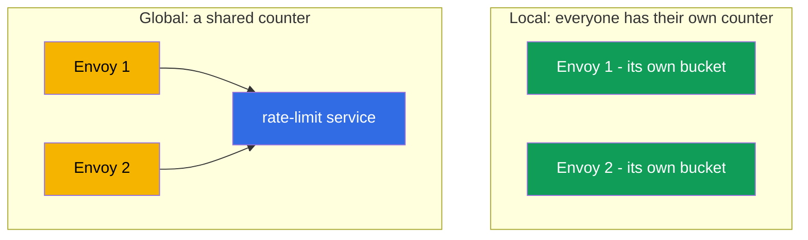
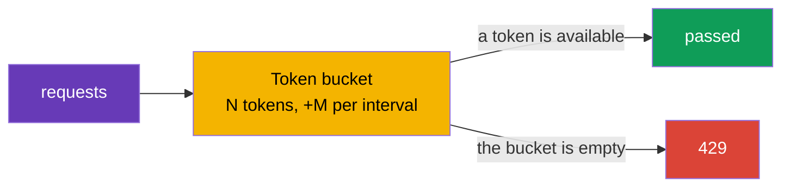

[RU version](ru.md) · [Versión en español](es.md)

# Chapter 20. Rate limiting: local request limiting

> **What's next.** We continue with the advanced scenarios. Rate limiting protects services from
> overload, abuse and DoS. In this chapter we look at Istio's two approaches: local (simple, each
> Envoy counts on its own) and global (a shared counter via an external service), and work out what
> to choose when.

## 20.1. Why rate limiting is needed

Even a healthy service can be "flooded" with too many requests: an aggressive client, a buggy retry
loop, a scraper bot or a direct DoS attack. Rate limiting limits how many requests are allowed per
unit of time, and rejects the excess right away with the code `429 Too Many Requests`.

It is important not to confuse it with circuit breaking from chapter 8:

- **Circuit breaking** (`connectionPool`) limits **concurrent** connections and requests -
  protection against saturation in the moment.
- **Rate limiting** limits the **rate** - the number of requests per time interval (for example,
  100 requests per minute).

These are different tools for different tasks, often used together.

## 20.2. Two approaches: local and global

Istio has two kinds of rate limiting.

- **Local rate limit** - each Envoy counts requests **itself**, keeping its own counter. Simple,
  fast, no external dependencies. But the limit applies to each proxy separately.
- **Global rate limit** - Envoy queries an **external** rate-limit service with a shared counter.
  It gives a single limit for the whole service regardless of the number of replicas, but adds a
  dependency and latency.



## 20.3. Local rate limit

At its core is the **token bucket** algorithm: there is a bucket of N tokens, refilled at a rate of
M tokens per interval. Each request takes a token. There is a token - the request passes; the
bucket is empty - the request gets a `429`.



In Istio there is no dedicated convenient CRD for a local rate limit - it is enabled via an
`EnvoyFilter`, plugging in the Envoy `local_ratelimit` filter. The key part of the configuration is
exactly the bucket parameters (`token_bucket`). The full resource for the `ping-pong` service:

```yaml
apiVersion: networking.istio.io/v1alpha3
kind: EnvoyFilter
metadata:
  name: local-ratelimit
  namespace: app
spec:
  workloadSelector:
    labels:
      app: ping-pong                  # which pods it applies to
  configPatches:
  - applyTo: HTTP_FILTER
    match:
      context: SIDECAR_INBOUND        # limit the inbound traffic to the service
      listener:
        filterChain:
          filter:
            name: envoy.filters.network.http_connection_manager
    patch:
      operation: INSERT_BEFORE
      value:
        name: envoy.filters.http.local_ratelimit
        typed_config:
          "@type": type.googleapis.com/envoy.extensions.filters.http.local_ratelimit.v3.LocalRateLimit
          stat_prefix: http_local_rate_limiter
          token_bucket:
            max_tokens: 100           # the bucket size (the maximum burst)
            tokens_per_fill: 100      # how much to add per interval
            fill_interval: 60s        # the refill interval (100 requests per minute)
          filter_enabled:             # for what fraction of the traffic the filter is active
            default_value: { numerator: 100, denominator: HUNDRED }
          filter_enforced:            # for what fraction to actually reject (not just count)
            default_value: { numerator: 100, denominator: HUNDRED }
          response_headers_to_add:
          - append_action: OVERWRITE_IF_EXISTS_OR_ADD
            header: { key: x-local-rate-limited, value: "true" }
```

Note `filter_enabled` and `filter_enforced` - these are the very "observation-mode knobs" (20.7):
by setting `filter_enforced` to 0% you will **only count** the overages (the
`http_local_rate_limiter.rate_limited` metric) without blocking anything, and later enable the
rejection.

Let us go through the physical meaning of each parameter, because the average rate and the allowed
burst depend on them (in the manifest they are in snake_case - `max_tokens`, `tokens_per_fill`,
`fill_interval`; below, for brevity, we write `maxTokens` and so on).

- **`maxTokens` - the bucket capacity, i.e. the maximum burst.** More than this number of tokens
  will never accumulate in the bucket, even if there was no traffic for a long time. So this is the
  maximum number of requests that can be let through "in one salvo" at a single moment. Here 100 -
  no more than 100 requests can pass at once.
- **`tokensPerFill` - how many tokens are added per one refill interval.**
- **`fillInterval` - how often the refill happens.**

Together `tokensPerFill` and `fillInterval` set the **average steady-state rate**: `tokensPerFill /
fillInterval`. In the example this is 100 tokens per 60 seconds, i.e. on average ~100 requests per
minute. `maxTokens` meanwhile is responsible for how "spiky" the traffic can be around this
average.

The key difference between `maxTokens` and `tokensPerFill`:

- If `maxTokens = tokensPerFill` (as above, 100 and 100) - the burst is limited to one refill
  "portion". No more than 100 will pass per period, and no more than 100 in a salvo.
- If `maxTokens > tokensPerFill` - during quiet periods the unused tokens accumulate up to
  `maxTokens`, and then a bigger burst can be issued. For example, `maxTokens: 300`,
  `tokensPerFill: 100`, `fillInterval: 60s`: the average rate is still the same ~100/min, but after
  a lull a client can "fire" up to 300 requests at once, until the accumulated tokens run out.

An analogy: the bucket fills with water (tokens) at a constant rate (`tokensPerFill`/`fillInterval`),
but does not overflow above the brim (`maxTokens`). Each request scoops out a cup; no water - the
request gets a `429`. Want smoother traffic without big salvos - make `fillInterval` small (for
example, add 2 tokens every second instead of 120 at once 120 times a minute) and keep `maxTokens`
close to `tokensPerFill`.

An important nuance: the counter is **each Envoy's own**. If a service has 3 replicas and each has a
limit of 100 requests per minute, in total the service will let through up to 300 - because clients
are distributed across the replicas, and each counts independently. This is fine for coarse
protection of an individual instance, but does not give a precise limit for the whole service.

## 20.4. Global rate limit

When you need a **single limit for the whole service** regardless of the number of replicas, a
global rate limit is used. Here Envoy, for each request, asks an external **rate-limit service**
(usually the reference Envoy Rate Limit Service + Redis for the shared counter): "may I have one
more?". The service keeps a shared counter and answers allow or reject.

Pros: a precise limit for the whole service, flexible rules (by user, by API key, by path). Cons: an
additional service (and a counter store) is needed and running, and each request incurs an extra
network call to it - this is a dependency and a small latency.

## 20.5. Limiting by a feature (per-IP, per-header)

A rate limit does not have to be "one bucket for the whole service". You can limit **by a feature**:
for example, no more than 10 requests per second **from one IP**, or a separate limit for each API
key, path or user. This is handled by **descriptors** - keys whose values are used to keep a
separate counter.

Typical features for limiting:

- **The client IP** (`remote_address`) - the classic "10 rps from one IP" against bots;
- **a header** - for example, `x-api-key` or `x-user-id` (a per-client/tenant limit);
- **a path or a method** - a stricter limit on a "heavy" or expensive endpoint.

How this maps onto the two approaches:

- **Global rate limit** was made exactly for this. You describe the rules by descriptors, and the
  external rate-limit service keeps a **separate shared counter for each value** of the key. "10 rps
  per IP" for the whole service is exactly here: each IP has its own counter, shared across all
  replicas.
- **Local rate limit** can also do descriptors (separate buckets per key), but the counter stays
  local to each Envoy. For "per-IP per instance" it works, but for a precise "per-IP for the whole
  service" - no, because the same IP can land on different replicas, and each counts it separately.

### An important trap: the real client IP

If you limit by IP, make sure Envoy sees the **real** client IP, not the balancer's address. Behind
a cloud LB all the traffic arrives as if from a single address, and a naive per-IP limit turns into
a common limit on everyone. How to get the real client IP to the gateway depends on the type of
balancer (covered in detail in chapter 14):

- behind an **ALB (L7)** it sets `X-Forwarded-For` itself, it is enough to set `numTrustedProxies`
  in MeshConfig;
- behind an **NLB (L4)** there is no `X-Forwarded-For` header at all - the real IP is carried via
  **Proxy Protocol v2** (an annotation on the gateway Service + a listener filter).

Without the client IP being carried correctly, an IP limit will not work - it will either trigger by
the balancer's address (a common limit on everyone) or not find the needed value.

## 20.6. What to choose

| | Local rate limit | Global rate limit |
|---|------------------|-------------------|
| Where the counter is | in each Envoy | in an external service (shared) |
| The limit's precision | per replica (total = limit × replicas) | single for the whole service |
| Dependencies | none | a rate-limit service + a store (Redis) |
| Latency | minimal | + a call to the external service |
| Complexity | lower | higher |

The practical rule:

- **Local** - for simple coarse protection of an instance from overload, when the exact "for the
  whole service" number is not critical. Start with it - it is cheap and dependency-free.
- **Global** - when you need a precise total limit (for example, "no more than 1000 requests per
  minute from one API key for the whole service") and you are ready to run a rate-limit service.

A common reasonable approach: local as the first line on each proxy, and global where the business
rules require a precise total limit.

## 20.7. Rate limiting and autoscaling (HPA/KEDA)

Rate limiting and horizontal autoscaling (HPA or KEDA) solve, at first glance, opposite tasks: the
limit **cuts** excess traffic, autoscaling **adds capacity** to serve it. In practice they
complement each other well, but they must be reconciled - otherwise it is easy to get either "a
limit that grows by itself and limits nothing" or "an autoscaler that does not react to the load".

**The key fact: a local limit scales together with the replicas.** Each Envoy's counter is its own,
so the total throughput = `the limit per pod × the number of replicas` (20.3). This is both a plus
and a catch:

- **The plus.** If you set the per-pod limit equal to the safe capacity of **one** pod, then as
  replicas are added the total ceiling grows by itself - each instance is protected, and the service
  as a whole scales. That is, local rate limit + autoscaling = "instance protection that grows
  together with the fleet".
- **The catch.** If you wanted a **hard total ceiling** (for example, "no more than 1000 rps for the
  whole service"), local will not give it: autoscaling will raise the replicas and the total limit
  will drift up. For a fixed total limit you need a **global** rate limit - it does not depend on the
  number of replicas.

**The second nuance is which signal to scale on.** Rejected requests (`429`) are batted away by
Envoy early and cheaply, they barely load the application's CPU. Therefore:

- If the autoscaler looks at **CPU/memory**, it will **not see** the rejected load and will not add
  replicas - although the demand is real. This is fine if you deliberately set a ceiling, but bad if
  you wanted to serve the spike.
- It is more correct to scale on the **incoming demand**: the RPS before the limit or the queue
  depth. Here **KEDA** is handy - it can scale by Prometheus metrics (including by
  `istio_requests_total`) or by queue length (SQS/Kafka).

**A practical case: KEDA by an Istio metric + local rate limit.** The `orders` service behind the
ingress gateway. KEDA scales it by the incoming RPS from Istio metrics, and a local rate limit on
each pod protects the instance from overload while the replicas come up (KEDA/HPA react in tens of
seconds, while the token bucket does so instantly).

```yaml
apiVersion: keda.sh/v1alpha1
kind: ScaledObject
metadata:
  name: orders
  namespace: app
spec:
  scaleTargetRef:
    name: orders                       # the Deployment we scale
  minReplicaCount: 2
  maxReplicaCount: 20
  triggers:
  - type: prometheus
    metadata:
      serverAddress: http://prometheus.istio-system:9090
      # the incoming RPS to orders by the Istio metric (chapter 17)
      query: sum(rate(istio_requests_total{destination_service_name="orders"}[1m]))
      threshold: "50"                  # a target of ~50 rps per replica -> KEDA adds pods
```

The logic of the pairing:

1. The RPS grows → KEDA sees it via `istio_requests_total` and **adds replicas** of `orders`.
2. While the new pods start, the **local rate limit** on each pod keeps the already-working instances
   from being overloaded (instant protection against a spike that the autoscaler cannot provide in
   time).
3. There are more replicas → the total ceiling of the local limit has automatically grown → the
   service handles more traffic.
4. Demand dropped → KEDA removes replicas, the ceiling comes down.

Recommendations for reconciling them:

- **Scale by demand, not by "successful".** The KEDA trigger is the incoming RPS/queue, otherwise
  the rejected load (`429`) will not trigger scaling.
- **The per-pod local limit = the safe capacity of one pod**, not "the total ceiling / replicas".
  Then the limit protects the instance, and the total growth is provided by the autoscaler.
- **A hard total ceiling - only global RLS** (it is invariant to the number of replicas); local is
  not suitable for this.
- **`429` as a signal.** A spike of rejections can also be fed into KEDA as a trigger ("we hit the
  limit - add replicas") or at least into alerts.
- **Account for `maxReplicaCount`.** It implicitly sets the maximum total local limit (`the limit ×
  maxReplicas`); keep it in mind so autoscaling does not "punch through" the capacity of dependencies
  (databases, etc.).

## 20.8. Best practices for production

- **Measure first, then limit.** Look at the real traffic by the metrics (chapter 17): the normal
  RPS and the peaks. Set the limit above the peak with a margin. A limit "at random" either does not
  protect or cuts off legitimate users.
- **Start in observation mode.** Where possible, first only log the overages without blocking,
  confirm the threshold is right, and only then enable the rejection.
- **Return a correct response.** `429` plus a `Retry-After` header so the client knows when to
  retry. A clear response body helps integrators.
- **Different limits for different clients.** Via descriptors set tiers (free and premium by API
  key), and protect expensive endpoints (login, search, export) more strictly.
- **A global RLS is a critical dependency.** Ensure HA of the rate-limit service itself and its
  store (Redis), watch the call latency. Decide in advance the behavior when the RLS is unavailable:
  **fail-open** (let traffic through, so an RLS failure does not take down the service) - safer by
  default, **fail-closed** - when protection is more important than availability.
- **Build defense in layers.** A coarse per-IP limit on the ingress gateway (the perimeter) + local
  limits on the services + circuit breaking (chapter 8). One rate limit does not replace the rest. On
  AWS the outermost layer is conveniently moved even further out - **AWS WAF rate-based rules** on
  CloudFront/ALB: they cut off floods and bots **before** entry into the cluster, offloading the
  mesh; while the precise business limits (per-API-key, per-tenant) are left to the global RLS inside
  the mesh.
- **Reconcile with retries.** Clients' aggressive retries (chapter 8) themselves create load and run
  into the limit; configure them jointly so as not to get a retry storm.
- **Monitor the triggers.** The metric of rejected requests (`429`) is a signal both of an attack and
  of too strict a limit. Set alerts on spikes.
- **Test under load.** Run the limits through a load test (fortio, k6) in staging before production.
- **Be careful with EnvoyFilter.** A local rate limit lives in an `EnvoyFilter`, and it is fragile on
  Istio upgrades - pin it and test after updates.

## 20.9. Chapter summary

- Rate limiting limits the **rate** of requests and rejects the excess with the code `429`; it
  protects against overload, abuse and DoS.
- It is not the same as circuit breaking (`connectionPool`): that limits **concurrent**
  connections/requests, while rate limiting limits the number per time interval.
- **Local rate limit**: a token bucket in each Envoy, enabled via an `EnvoyFilter`, with no external
  dependencies; the counter is each replica's own.
- **Global rate limit**: a shared counter in an external rate-limit service; a precise limit for the
  whole service, but it adds a dependency and latency.
- The choice: local for simple protection of an instance, global for a precise total limit; they are
  often used together.
- You can limit **by a feature** via descriptors (per-IP, per-header, per-path). A precise "10 rps
  from one IP for the whole service" is a global rate limit; for a limit by IP Envoy must see the
  real client IP: behind an **ALB** via `numTrustedProxies`, behind an **NLB** via Proxy Protocol
  (chapter 14).
- A local rate limit is enabled with a full `EnvoyFilter` (`local_ratelimit`); `filter_enforced`
  lets you run in observation mode (only count), the metric is
  `http_local_rate_limiter.rate_limited`.
- On AWS the outermost layer (floods, bots) is conveniently closed off by **AWS WAF rate-based
  rules** on CloudFront/ALB, while the precise business limits are kept in the global RLS inside the
  mesh.
- With autoscaling (HPA/KEDA): the total **local** limit = `the limit × replicas`, i.e. it grows
  together with the fleet (the per-pod limit = the capacity of one pod); a hard total ceiling is
  given only by **global**. You must scale by the **incoming demand** (KEDA by
  `istio_requests_total`/queue), not by CPU, otherwise the rejected (`429`) load will not trigger
  scaling.
- Production practices: set the limit by the metrics of real traffic (above the peak), start in
  observation mode, return `429` + `Retry-After`, ensure HA of the global RLS and decide
  fail-open/fail-closed, build defense in layers, monitor the triggers, test under load.

## 20.10. Self-check questions

1. How does rate limiting differ from circuit breaking from chapter 8?
2. How does the token bucket algorithm work?
3. Why, with a local rate limit, is the service's total limit equal to the limit multiplied by the
   number of replicas?
4. When is a global rate limit needed and what is its cost?
5. Which approach do you choose for simple protection of an instance, and which for a precise total
   limit?
6. How do you limit "10 rps from one IP"? Why is a global rate limit needed for this and how do you
   carry the real client IP behind an **ALB** and an **NLB**?
7. What are fail-open and fail-closed when the rate-limit service is unavailable and which do you
   choose?
8. Why should the limit be chosen by the metrics and started in observation mode?
9. How do you run a local rate limit in observation mode (only count, do not block)?
10. Where in a layered defense is the place for AWS WAF rate-based rules, and where for the global
    RLS inside the mesh?
11. How does a local rate limit behave with autoscaling (HPA/KEDA) and why is a global one needed for
    a hard total ceiling? Which signal do you scale on correctly and why not on CPU?

## Practice

Practice local request limiting via an `EnvoyFilter` (token bucket):

🧪 Lab 17: [tasks/ica/labs/17](../../labs/17/README.MD)

---
[Contents](../README.md) · [Chapter 19](../19/en.md) · [Chapter 21](../21/en.md)
