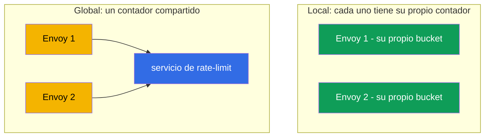
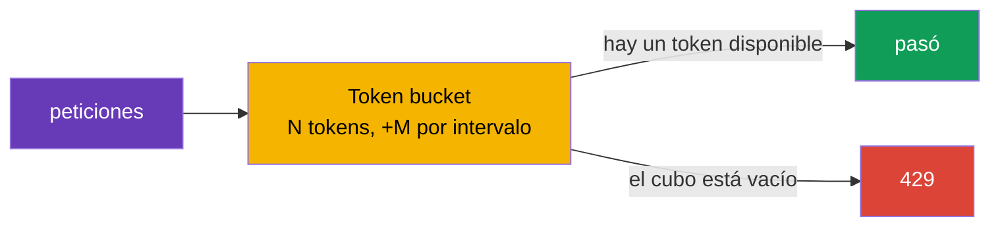

[RU version](ru.md) · [Eng version](en.md)

# Capítulo 20. Rate limiting: limitación local de peticiones

> **Qué sigue.** Continuamos con los escenarios avanzados. El rate limiting protege los servicios de
> la sobrecarga, el abuso y el DoS. En este capítulo vemos los dos enfoques de Istio: local (simple,
> cada Envoy cuenta por su cuenta) y global (un contador compartido vía un servicio externo), y
> aclaramos qué elegir en cada caso.

## 20.1. Por qué se necesita el rate limiting

Incluso un servicio sano puede ser "inundado" con demasiadas peticiones: un cliente agresivo, un bucle
de reintentos con bug, un bot scraper o un ataque DoS directo. El rate limiting limita cuántas
peticiones se permiten por unidad de tiempo, y rechaza el exceso de inmediato con el código `429 Too
Many Requests`.

Es importante no confundirlo con el circuit breaking del capítulo 8:

- **Circuit breaking** (`connectionPool`) limita las conexiones y peticiones **concurrentes**:
  protección contra la saturación en el momento.
- **Rate limiting** limita la **tasa**: el número de peticiones por intervalo de tiempo (por ejemplo,
  100 peticiones por minuto).

Son herramientas distintas para tareas distintas, a menudo usadas juntas.

## 20.2. Dos enfoques: local y global

Istio tiene dos tipos de rate limiting.

- **Local rate limit**: cada Envoy cuenta las peticiones **él mismo**, manteniendo su propio contador.
  Simple, rápido, sin dependencias externas. Pero el límite se aplica a cada proxy por separado.
- **Global rate limit**: Envoy consulta un servicio de rate-limit **externo** con un contador
  compartido. Da un único límite para todo el servicio independientemente del número de réplicas, pero
  añade una dependencia y latencia.



## 20.3. Local rate limit

En su núcleo está el algoritmo **token bucket**: hay un cubo de N tokens, que se rellena a un ritmo de
M tokens por intervalo. Cada petición toma un token. Hay un token, la petición pasa; el cubo está
vacío, la petición recibe un `429`.



En Istio no hay un CRD dedicado y cómodo para un rate limit local: se habilita vía un `EnvoyFilter`,
enchufando el filtro `local_ratelimit` de Envoy. La parte clave de la configuración son exactamente
los parámetros del bucket (`token_bucket`). El recurso completo para el servicio `ping-pong`:

```yaml
apiVersion: networking.istio.io/v1alpha3
kind: EnvoyFilter
metadata:
  name: local-ratelimit
  namespace: app
spec:
  workloadSelector:
    labels:
      app: ping-pong                  # a qué pods se aplica
  configPatches:
  - applyTo: HTTP_FILTER
    match:
      context: SIDECAR_INBOUND        # limitar el tráfico entrante al servicio
      listener:
        filterChain:
          filter:
            name: envoy.filters.network.http_connection_manager
    patch:
      operation: INSERT_BEFORE
      value:
        name: envoy.filters.http.local_ratelimit
        typed_config:
          "@type": type.googleapis.com/envoy.extensions.filters.http.local_ratelimit.v3.LocalRateLimit
          stat_prefix: http_local_rate_limiter
          token_bucket:
            max_tokens: 100           # el tamaño del bucket (el burst máximo)
            tokens_per_fill: 100      # cuánto añadir por intervalo
            fill_interval: 60s        # el intervalo de rellenado (100 peticiones por minuto)
          filter_enabled:             # para qué fracción del tráfico está activo el filtro
            default_value: { numerator: 100, denominator: HUNDRED }
          filter_enforced:            # para qué fracción rechazar realmente (no solo contar)
            default_value: { numerator: 100, denominator: HUNDRED }
          response_headers_to_add:
          - append_action: OVERWRITE_IF_EXISTS_OR_ADD
            header: { key: x-local-rate-limited, value: "true" }
```

Fíjate en `filter_enabled` y `filter_enforced`: estos son esos mismos "mandos del modo observación"
(20.7): fijando `filter_enforced` al 0% **solo contarás** los excesos (la métrica
`http_local_rate_limiter.rate_limited`) sin bloquear nada, y más tarde habilitas el rechazo.

Repasemos el significado físico de cada parámetro, porque de ellos dependen la tasa media y el burst
permitido (en el manifiesto están en snake_case: `max_tokens`, `tokens_per_fill`, `fill_interval`; más
abajo, por brevedad, escribimos `maxTokens` y demás).

- **`maxTokens`: la capacidad del bucket, es decir, el burst máximo.** Nunca se acumularán en el bucket
  más tokens que este número, aunque no haya habido tráfico durante mucho tiempo. Así que este es el
  número máximo de peticiones que pueden dejarse pasar "de una salva" en un único momento. Aquí 100: no
  más de 100 peticiones pueden pasar a la vez.
- **`tokensPerFill`: cuántos tokens se añaden por un intervalo de rellenado.**
- **`fillInterval`: con qué frecuencia ocurre el rellenado.**

Juntos `tokensPerFill` y `fillInterval` fijan la **tasa media en estado estable**: `tokensPerFill /
fillInterval`. En el ejemplo esto son 100 tokens por 60 segundos, es decir, en promedio ~100 peticiones
por minuto. `maxTokens` mientras tanto es responsable de cuán "picudo" puede ser el tráfico alrededor
de esta media.

La diferencia clave entre `maxTokens` y `tokensPerFill`:

- Si `maxTokens = tokensPerFill` (como arriba, 100 y 100), el burst está limitado a una "porción" de
  rellenado. No pasarán más de 100 por periodo, y no más de 100 en una salva.
- Si `maxTokens > tokensPerFill`, durante los periodos tranquilos los tokens no usados se acumulan hasta
  `maxTokens`, y entonces se puede emitir un burst mayor. Por ejemplo, `maxTokens: 300`,
  `tokensPerFill: 100`, `fillInterval: 60s`: la tasa media sigue siendo la misma ~100/min, pero tras una
  calma un cliente puede "disparar" hasta 300 peticiones a la vez, hasta que se agoten los tokens
  acumulados.

Una analogía: el bucket se llena de agua (tokens) a un ritmo constante (`tokensPerFill`/`fillInterval`),
pero no se desborda por encima del borde (`maxTokens`). Cada petición saca una taza; sin agua, la
petición recibe un `429`. ¿Quieres un tráfico más suave sin grandes salvas? Haz `fillInterval` pequeño
(por ejemplo, añade 2 tokens cada segundo en vez de 120 de una sola vez una vez por minuto) y mantén
`maxTokens` cerca de `tokensPerFill`.

Un matiz importante: el contador es **propio de cada Envoy**. Si un servicio tiene 3 réplicas y cada una
tiene un límite de 100 peticiones por minuto, en total el servicio dejará pasar hasta 300, porque los
clientes se distribuyen entre las réplicas, y cada una cuenta de forma independiente. Esto está bien
para una protección gruesa de una instancia individual, pero no da un límite preciso para todo el
servicio.

## 20.4. Global rate limit

Cuando se necesita un **único límite para todo el servicio** independientemente del número de réplicas,
se usa un global rate limit. Aquí Envoy, por cada petición, pregunta a un **servicio de rate-limit**
externo (normalmente el Envoy Rate Limit Service de referencia + Redis para el contador compartido):
"¿me das uno más?". El servicio mantiene un contador compartido y responde permitir o rechazar.

Ventajas: un límite preciso para todo el servicio, reglas flexibles (por usuario, por API key, por
ruta). Desventajas: se necesita un servicio adicional (y un almacén del contador) en funcionamiento, y
cada petición incurre en una llamada de red extra a él: esto es una dependencia y una pequeña latencia.

## 20.5. Limitar por una característica (per-IP, per-header)

Un rate limit no tiene por qué ser "un cubo para todo el servicio". Puedes limitar **por una
característica**: por ejemplo, no más de 10 peticiones por segundo **desde una IP**, o un límite aparte
para cada API key, ruta o usuario. Esto lo manejan los **descriptores**: claves cuyos valores se usan
para mantener un contador separado.

Características típicas para limitar:

- **La IP del cliente** (`remote_address`): el clásico "10 rps desde una IP" contra bots;
- **una cabecera**: por ejemplo, `x-api-key` o `x-user-id` (un límite por cliente/tenant);
- **una ruta o un método**: un límite más estricto sobre un endpoint "pesado" o costoso.

Cómo se mapea esto sobre los dos enfoques:

- **Global rate limit** se hizo exactamente para esto. Describes las reglas por descriptores, y el
  servicio de rate-limit externo mantiene un **contador compartido separado para cada valor** de la
  clave. "10 rps por IP" para todo el servicio está exactamente aquí: cada IP tiene su propio contador,
  compartido entre todas las réplicas.
- **Local rate limit** también puede hacer descriptores (buckets separados por clave), pero el contador
  se queda local en cada Envoy. Para "por IP por instancia" funciona, pero para un preciso "por IP para
  todo el servicio" no, porque la misma IP puede caer en réplicas distintas, y cada una la cuenta por
  separado.

### Una trampa importante: la IP real del cliente

Si limitas por IP, asegúrate de que Envoy ve la IP **real** del cliente, no la dirección del
balanceador. Detrás de un LB en la nube todo el tráfico llega como si fuera de una única dirección, y un
límite per-IP ingenuo se convierte en un límite común sobre todos. Cómo hacer llegar la IP real del
cliente al gateway depende del tipo de balanceador (cubierto en detalle en el capítulo 14):

- detrás de un **ALB (L7)** este pone `X-Forwarded-For` él mismo, basta con fijar `numTrustedProxies` en
  MeshConfig;
- detrás de un **NLB (L4)** no hay cabecera `X-Forwarded-For` en absoluto: la IP real se transporta vía
  **Proxy Protocol v2** (una anotación en el Service del gateway + un listener filter).

Sin que la IP del cliente se transporte correctamente, un límite por IP no funcionará: o se disparará
por la dirección del balanceador (un límite común sobre todos) o no encontrará el valor necesario.

## 20.6. Qué elegir

| | Local rate limit | Global rate limit |
|---|------------------|-------------------|
| Dónde está el contador | en cada Envoy | en un servicio externo (compartido) |
| Precisión del límite | por réplica (total = límite × réplicas) | único para todo el servicio |
| Dependencias | ninguna | un servicio de rate-limit + un almacén (Redis) |
| Latencia | mínima | + una llamada al servicio externo |
| Complejidad | menor | mayor |

La regla práctica:

- **Local**: para una protección gruesa simple de una instancia frente a la sobrecarga, cuando el número
  exacto "para todo el servicio" no es crítico. Empieza con él: es barato y sin dependencias.
- **Global**: cuando necesitas un límite total preciso (por ejemplo, "no más de 1000 peticiones por
  minuto desde una API key para todo el servicio") y estás listo para operar un servicio de rate-limit.

Un enfoque razonable común: local como primera línea en cada proxy, y global donde las reglas de negocio
requieran un límite total preciso.

## 20.7. Rate limiting y autoescalado (HPA/KEDA)

El rate limiting y el autoescalado horizontal (HPA o KEDA) resuelven, a primera vista, tareas opuestas:
el límite **recorta** el tráfico excesivo, el autoescalado **añade capacidad** para servirlo. En la
práctica se complementan bien, pero hay que conciliarlos, de lo contrario es fácil obtener o "un límite
que crece solo y no limita nada" o "un autoescalador que no reacciona a la carga".

**El hecho clave: un límite local escala junto con las réplicas.** El contador de cada Envoy es propio,
así que el throughput total = `el límite por pod × el número de réplicas` (20.3). Esto es a la vez una
ventaja y una trampa:

- **La ventaja.** Si fijas el límite por pod igual a la capacidad segura de **un** pod, entonces a medida
  que se añaden réplicas el techo total crece solo: cada instancia está protegida, y el servicio en su
  conjunto escala. Es decir, local rate limit + autoescalado = "protección de instancia que crece junto
  con la flota".
- **La trampa.** Si querías un **techo total duro** (por ejemplo, "no más de 1000 rps para todo el
  servicio"), local no lo dará: el autoescalado subirá las réplicas y el límite total se irá hacia
  arriba. Para un límite total fijo necesitas un **global** rate limit: no depende del número de
  réplicas.

**El segundo matiz es por qué señal escalar.** Las peticiones rechazadas (`429`) las despacha Envoy
pronto y de forma barata, apenas cargan la CPU de la aplicación. Por lo tanto:

- Si el autoescalador mira la **CPU/memoria**, **no verá** la carga rechazada y no añadirá réplicas,
  aunque la demanda sea real. Esto está bien si deliberadamente fijas un techo, pero mal si querías
  servir el pico.
- Es más correcto escalar por la **demanda entrante**: el RPS antes del límite o la profundidad de la
  cola. Aquí **KEDA** viene bien: puede escalar por métricas de Prometheus (incluida
  `istio_requests_total`) o por longitud de cola (SQS/Kafka).

**Un caso práctico: KEDA por una métrica de Istio + local rate limit.** El servicio `orders` detrás del
ingress gateway. KEDA lo escala por el RPS entrante desde las métricas de Istio, y un local rate limit en
cada pod protege la instancia de la sobrecarga mientras suben las réplicas (KEDA/HPA reaccionan en
decenas de segundos, mientras que el token bucket lo hace al instante).

```yaml
apiVersion: keda.sh/v1alpha1
kind: ScaledObject
metadata:
  name: orders
  namespace: app
spec:
  scaleTargetRef:
    name: orders                       # el Deployment que escalamos
  minReplicaCount: 2
  maxReplicaCount: 20
  triggers:
  - type: prometheus
    metadata:
      serverAddress: http://prometheus.istio-system:9090
      # el RPS entrante a orders por la métrica de Istio (capítulo 17)
      query: sum(rate(istio_requests_total{destination_service_name="orders"}[1m]))
      threshold: "50"                  # un objetivo de ~50 rps por réplica -> KEDA añade pods
```

La lógica del emparejamiento:

1. El RPS crece → KEDA lo ve vía `istio_requests_total` y **añade réplicas** de `orders`.
2. Mientras arrancan los nuevos pods, el **local rate limit** en cada pod mantiene las instancias ya en
   funcionamiento sin sobrecargarse (protección instantánea contra un pico que el autoescalador no puede
   proporcionar a tiempo).
3. Hay más réplicas → el techo total del límite local ha crecido automáticamente → el servicio maneja más
   tráfico.
4. La demanda cayó → KEDA quita réplicas, el techo baja.

Recomendaciones para conciliarlos:

- **Escala por demanda, no por "exitosas".** El trigger de KEDA es el RPS/cola entrante, de lo contrario
  la carga rechazada (`429`) no disparará el escalado.
- **El límite local por pod = la capacidad segura de un pod**, no "el techo total / réplicas". Entonces el
  límite protege la instancia, y el crecimiento total lo proporciona el autoescalador.
- **Un techo total duro: solo global RLS** (es invariante al número de réplicas); local no sirve para
  esto.
- **`429` como señal.** Un pico de rechazos también se puede alimentar a KEDA como trigger ("hemos
  alcanzado el límite, añade réplicas") o al menos a las alertas.
- **Ten en cuenta `maxReplicaCount`.** Fija implícitamente el límite local total máximo (`el límite ×
  maxReplicas`); tenlo en mente para que el autoescalado no "atraviese" la capacidad de las dependencias
  (bases de datos, etc.).

## 20.8. Buenas prácticas para producción

- **Mide primero, luego limita.** Mira el tráfico real por las métricas (capítulo 17): el RPS normal y
  los picos. Fija el límite por encima del pico con margen. Un límite "al azar" o no protege o recorta a
  usuarios legítimos.
- **Empieza en modo observación.** Donde sea posible, primero solo registra los excesos sin bloquear,
  confirma que el umbral es correcto, y solo entonces habilita el rechazo.
- **Devuelve una respuesta correcta.** `429` más una cabecera `Retry-After` para que el cliente sepa
  cuándo reintentar. Un cuerpo de respuesta claro ayuda a los integradores.
- **Límites distintos para clientes distintos.** Vía descriptores define niveles (free y premium por API
  key), y protege más estrictamente los endpoints costosos (login, search, export).
- **Un global RLS es una dependencia crítica.** Asegura la HA del propio servicio de rate-limit y de su
  almacén (Redis), vigila la latencia de la llamada. Decide de antemano el comportamiento cuando el RLS
  no está disponible: **fail-open** (dejar pasar el tráfico, para que un fallo del RLS no tumbe el
  servicio), más seguro por defecto, **fail-closed**, cuando la protección importa más que la
  disponibilidad.
- **Construye la defensa en capas.** Un límite grueso per-IP en el ingress gateway (el perímetro) +
  límites locales en los servicios + circuit breaking (capítulo 8). Un rate limit no reemplaza al resto.
  En AWS la capa más externa se mueve cómodamente aún más afuera: las **AWS WAF rate-based rules** en
  CloudFront/ALB: recortan inundaciones y bots **antes** de la entrada al clúster, descargando la malla;
  mientras que los límites de negocio precisos (per-API-key, per-tenant) se dejan al global RLS dentro de
  la malla.
- **Concilia con los reintentos.** Los reintentos agresivos de los clientes (capítulo 8) crean carga por
  sí mismos y chocan con el límite; configúralos conjuntamente para no obtener una tormenta de
  reintentos.
- **Monitoriza los triggers.** La métrica de peticiones rechazadas (`429`) es una señal tanto de un
  ataque como de un límite demasiado estricto. Pon alertas sobre los picos.
- **Prueba bajo carga.** Pasa los límites por una prueba de carga (fortio, k6) en staging antes de
  producción.
- **Ten cuidado con EnvoyFilter.** Un rate limit local vive en un `EnvoyFilter`, y es frágil en las
  actualizaciones de Istio: fíjalo y pruébalo tras las actualizaciones.

## 20.9. Resumen del capítulo

- El rate limiting limita la **tasa** de peticiones y rechaza el exceso con el código `429`; protege
  contra la sobrecarga, el abuso y el DoS.
- No es lo mismo que el circuit breaking (`connectionPool`): este limita las conexiones/peticiones
  **concurrentes**, mientras que el rate limiting limita el número por intervalo de tiempo.
- **Local rate limit**: un token bucket en cada Envoy, habilitado vía un `EnvoyFilter`, sin dependencias
  externas; el contador es propio de cada réplica.
- **Global rate limit**: un contador compartido en un servicio de rate-limit externo; un límite preciso
  para todo el servicio, pero añade una dependencia y latencia.
- La elección: local para una protección simple de una instancia, global para un límite total preciso; a
  menudo se usan juntos.
- Puedes limitar **por una característica** vía descriptores (per-IP, per-header, per-path). Un preciso
  "10 rps desde una IP para todo el servicio" es un global rate limit; para un límite por IP Envoy debe
  ver la IP real del cliente: detrás de un **ALB** vía `numTrustedProxies`, detrás de un **NLB** vía Proxy
  Protocol (capítulo 14).
- Un local rate limit se habilita con un `EnvoyFilter` completo (`local_ratelimit`); `filter_enforced`
  permite funcionar en modo observación (solo contar), la métrica es
  `http_local_rate_limiter.rate_limited`.
- En AWS la capa más externa (inundaciones, bots) se cierra cómodamente con las **AWS WAF rate-based
  rules** en CloudFront/ALB, mientras que los límites de negocio precisos se guardan en el global RLS
  dentro de la malla.
- Con autoescalado (HPA/KEDA): el límite **local** total = `el límite × réplicas`, es decir, crece junto
  con la flota (el límite por pod = la capacidad de un pod); un techo total duro lo da solo el **global**.
  Debes escalar por la **demanda entrante** (KEDA por `istio_requests_total`/cola), no por CPU, de lo
  contrario la carga rechazada (`429`) no disparará el escalado.
- Prácticas de producción: fija el límite por las métricas de tráfico real (por encima del pico), empieza
  en modo observación, devuelve `429` + `Retry-After`, asegura la HA del global RLS y decide
  fail-open/fail-closed, construye la defensa en capas, monitoriza los triggers, prueba bajo carga.

## 20.10. Preguntas de autoevaluación

1. ¿En qué se diferencia el rate limiting del circuit breaking del capítulo 8?
2. ¿Cómo funciona el algoritmo token bucket?
3. ¿Por qué, con un local rate limit, el límite total del servicio es igual al límite multiplicado por el
   número de réplicas?
4. ¿Cuándo se necesita un global rate limit y cuál es su coste?
5. ¿Qué enfoque eliges para una protección simple de una instancia, y cuál para un límite total preciso?
6. ¿Cómo limitas "10 rps desde una IP"? ¿Por qué se necesita un global rate limit para esto y cómo
   transportas la IP real del cliente detrás de un **ALB** y un **NLB**?
7. ¿Qué son fail-open y fail-closed cuando el servicio de rate-limit no está disponible y cuál eliges?
8. ¿Por qué el límite debe elegirse por las métricas y empezarse en modo observación?
9. ¿Cómo ejecutas un local rate limit en modo observación (solo contar, no bloquear)?
10. ¿Dónde en una defensa en capas está el sitio para las AWS WAF rate-based rules, y dónde para el global
    RLS dentro de la malla?
11. ¿Cómo se comporta un local rate limit con autoescalado (HPA/KEDA) y por qué se necesita uno global
    para un techo total duro? ¿Por qué señal escalas correctamente y por qué no por CPU?

## Práctica

Practica la limitación local de peticiones vía un `EnvoyFilter` (token bucket):

🧪 Laboratorio 17: [tasks/ica/labs/17](../../labs/17/README_ES.MD)

---
[Índice](../README_ES.md) · [Capítulo 19](../19/es.md) · [Capítulo 21](../21/es.md)
