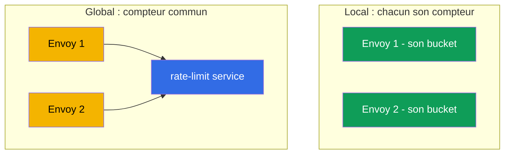
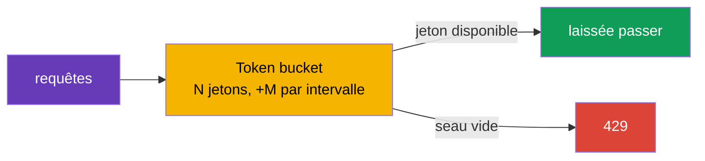

[RU version](ru.md) · [Eng version](en.md) · [Versión en español](es.md) · [Deutsche Version](de.md)

# Chapitre 20. Rate limiting : limitation locale des requêtes

> **La suite.** On poursuit les scénarios avancés. Le rate limiting (limitation de la fréquence des
> requêtes) protège les services contre la surcharge, les abus et les DoS. Dans ce chapitre, nous
> verrons deux approches d'Istio : locale (simple, chaque Envoy compte de son côté) et globale
> (compteur commun via un service externe), et nous comprendrons quand choisir laquelle.

## 20.1. À quoi sert le rate limiting

Même un service en bonne santé peut être « submergé » par un nombre de requêtes trop élevé : un
client agressif, une boucle de retry buguée, un bot-parseur ou une attaque DoS directe. Le rate
limiting limite le nombre de requêtes autorisées par unité de temps, et rejette immédiatement les
requêtes en trop avec le code `429 Too Many Requests`.

Il ne faut pas confondre avec le circuit breaking du chapitre 8 :

- **Circuit breaking** (`connectionPool`) limite les connexions et requêtes **simultanées** - une
  protection contre la saturation à l'instant présent.
- **Rate limiting** limite la **fréquence** - le nombre de requêtes sur un intervalle de temps (par
  exemple, 100 requêtes par minute).

Ce sont des outils différents pour des tâches différentes, et on les utilise souvent ensemble.

## 20.2. Deux approches : local et global

Istio propose deux types de rate limiting.

- **Local rate limit** - chaque Envoy compte les requêtes **lui-même**, en tenant son propre
  compteur. Simple, rapide, sans dépendances externes. Mais la limite s'applique à chaque proxy
  séparément.
- **Global rate limit** - Envoy s'adresse à un **service** de rate-limit **externe** doté d'un
  compteur commun. Cela donne une limite unique pour tout le service, indépendamment du nombre de
  répliques, mais ajoute une dépendance et de la latence.



## 20.3. Local rate limit

À la base se trouve l'algorithme du **token bucket** (« seau à jetons ») : il y a un seau de N
jetons, qui se remplit à la vitesse de M jetons par intervalle. Chaque requête prend un jeton. S'il
y a un jeton, la requête passe ; si le seau est vide, la requête reçoit `429`.



Dans Istio, il n'y a pas de CRD dédié pratique pour le local rate limit - on l'active via un
`EnvoyFilter`, en branchant le filtre Envoy `local_ratelimit`. La partie clé de la configuration,
ce sont justement les paramètres du seau (`token_bucket`). La ressource complète pour le service
`ping-pong` :

```yaml
apiVersion: networking.istio.io/v1alpha3
kind: EnvoyFilter
metadata:
  name: local-ratelimit
  namespace: app
spec:
  workloadSelector:
    labels:
      app: ping-pong                  # à quels pods cela s'applique
  configPatches:
  - applyTo: HTTP_FILTER
    match:
      context: SIDECAR_INBOUND        # on limite le trafic entrant vers le service
      listener:
        filterChain:
          filter:
            name: envoy.filters.network.http_connection_manager
    patch:
      operation: INSERT_BEFORE
      value:
        name: envoy.filters.http.local_ratelimit
        typed_config:
          "@type": type.googleapis.com/envoy.extensions.filters.http.local_ratelimit.v3.LocalRateLimit
          stat_prefix: http_local_rate_limiter
          token_bucket:
            max_tokens: 100           # taille du seau (rafale maximale)
            tokens_per_fill: 100      # combien ajouter par intervalle
            fill_interval: 60s        # intervalle de remplissage (100 requêtes par minute)
          filter_enabled:             # pour quelle part du trafic le filtre est actif
            default_value: { numerator: 100, denominator: HUNDRED }
          filter_enforced:            # pour quelle part rejeter réellement (et pas seulement compter)
            default_value: { numerator: 100, denominator: HUNDRED }
          response_headers_to_add:
          - append_action: OVERWRITE_IF_EXISTS_OR_ADD
            header: { key: x-local-rate-limited, value: "true" }
```

Notez `filter_enabled` et `filter_enforced` - ce sont justement les « boutons du mode observation »
(20.7) : en mettant `filter_enforced` à 0 %, vous ne ferez que **compter** les dépassements (métrique
`http_local_rate_limiter.rate_limited`) sans rien bloquer, puis vous activerez le rejet.

Décortiquons le sens physique de chaque paramètre, car d'eux dépendent à la fois la vitesse moyenne
et la rafale admissible (dans le manifeste ils sont en snake_case - `max_tokens`, `tokens_per_fill`,
`fill_interval` ; ci-dessous, pour la concision, on écrit `maxTokens`, etc.).

- **`maxTokens` - la capacité du seau, c'est-à-dire la rafale maximale (burst).** Le seau
  n'accumulera jamais plus de jetons que ce nombre, même s'il n'y a pas eu de trafic pendant
  longtemps. C'est donc le maximum de requêtes qu'on peut laisser passer « en salve » à un instant
  donné. Ici 100 - on peut laisser passer au plus 100 requêtes d'un coup.
- **`tokensPerFill` - combien de jetons sont ajoutés à chaque intervalle de remplissage.**
- **`fillInterval` - à quelle fréquence a lieu le remplissage.**

Ensemble, `tokensPerFill` et `fillInterval` définissent la **vitesse moyenne établie** :
`tokensPerFill / fillInterval`. Dans l'exemple, c'est 100 jetons en 60 secondes, soit en moyenne
~100 requêtes par minute. `maxTokens`, lui, détermine à quel point le trafic peut être « saccadé »
autour de cette moyenne.

Différence clé entre `maxTokens` et `tokensPerFill` :

- Si `maxTokens = tokensPerFill` (comme ci-dessus, 100 et 100) - la rafale est limitée à une seule
  « portion » de remplissage. Sur une période, il ne passera pas plus de 100, et en salve pas plus
  de 100 non plus.
- Si `maxTokens > tokensPerFill` - dans les périodes calmes, les jetons inutilisés s'accumulent
  jusqu'à `maxTokens`, et on peut ensuite délivrer une rafale plus grande. Par exemple,
  `maxTokens: 300`, `tokensPerFill: 100`, `fillInterval: 60s` : la vitesse moyenne reste les mêmes
  ~100/min, mais après une accalmie, le client peut « tirer » jusqu'à 300 requêtes d'un coup,
  jusqu'à épuisement des jetons accumulés.

Analogie : le seau se remplit d'eau (de jetons) à vitesse constante
(`tokensPerFill`/`fillInterval`), mais ne déborde pas au-dessus des bords (`maxTokens`). Chaque
requête puise une tasse ; plus d'eau - la requête reçoit `429`. Vous voulez un trafic plus « lisse »
sans grosses salves - faites un `fillInterval` petit (par exemple, ajouter 2 jetons chaque seconde
au lieu de 120 fois par minute en un seul bloc) et gardez `maxTokens` proche de `tokensPerFill`.

Nuance importante : le compteur est **propre à chaque Envoy**. Si un service a 3 répliques et que sur
chacune la limite est de 100 requêtes par minute, au total le service laissera passer jusqu'à 300 -
parce que les clients se répartissent entre les répliques, et chacune compte indépendamment. C'est
normal pour une protection grossière d'une instance individuelle, mais cela ne donne pas de limite
précise pour tout le service.

## 20.4. Global rate limit

Quand il faut une **limite unique pour tout le service** indépendamment du nombre de répliques, on
utilise le global rate limit. Ici, Envoy demande à chaque requête à un **service** de rate-limit
externe (généralement l'implémentation de référence Envoy Rate Limit Service + Redis pour le compteur
commun) : « on peut encore ? ». Le service tient un compteur commun et répond d'autoriser ou de
rejeter.

Avantages : limite précise pour tout le service, règles flexibles (par utilisateur, par clé d'API,
par chemin). Inconvénients : il faut un service supplémentaire qui fonctionne (et un stockage de
compteurs), et chaque requête entraîne un appel réseau supplémentaire vers lui - c'est une dépendance
et une petite latence.

## 20.5. Limitation par critère (per-IP, per-header)

Le rate limit n'a pas à être « un seul seau pour tout le service ». On peut limiter **par critère** :
par exemple, pas plus de 10 requêtes par seconde **depuis une même IP**, ou une limite propre à
chaque clé d'API, chemin ou utilisateur. Ce sont les **descripteurs** (descriptors) qui s'en
chargent - des clés dont les valeurs servent à tenir un compteur séparé.

Critères typiques pour la limitation :

- **IP du client** (`remote_address`) - le classique « 10 rps depuis une même IP » contre les bots ;
- **en-tête** - par exemple, `x-api-key` ou `x-user-id` (limite par client/tenant) ;
- **chemin ou méthode** - une limite plus stricte sur un endpoint « lourd » ou coûteux.

Comment cela se rattache aux deux approches :

- **Global rate limit** est fait exactement pour cela. Vous décrivez des règles par descripteurs, et
  le service de rate-limit externe tient un **compteur commun séparé pour chaque valeur** de la clé.
  « 10 rps par IP » pour tout le service, c'est précisément ici : chaque IP a son compteur, commun à
  toutes les répliques.
- **Local rate limit** sait aussi faire des descripteurs (des seaux séparés par clés), mais le
  compteur reste local à chaque Envoy. Pour « per-IP par instance », ça convient, mais pour un
  « per-IP précis sur tout le service » - non, parce qu'une même IP peut tomber sur des répliques
  différentes, et chacune la compte séparément.

### Un piège important : la vraie IP du client

Si vous limitez par IP, assurez-vous qu'Envoy voit la **vraie** IP du client, et non l'adresse du
load balancer. Derrière un LB cloud, tout le trafic arrive comme depuis une seule adresse, et une
limite per-IP naïve se transformera en une limite globale sur tous. La façon d'acheminer la vraie IP
cliente jusqu'à la gateway dépend du type de load balancer (détaillé au chapitre 14) :

- derrière un **ALB (L7)**, il place lui-même `X-Forwarded-For`, il suffit de définir
  `numTrustedProxies` dans MeshConfig ;
- derrière un **NLB (L4)**, il n'y a pas du tout d'en-tête `X-Forwarded-For` - la vraie IP est
  acheminée via le **Proxy Protocol v2** (annotation sur le Service de la gateway + filtre de
  listener).

Sans une IP cliente correctement acheminée, la limite par IP ne fonctionnera pas - soit elle
s'appliquera à l'adresse du load balancer (une limite globale sur tous), soit elle ne trouvera pas la
valeur voulue.

## 20.6. Que choisir

| | Local rate limit | Global rate limit |
|---|------------------|-------------------|
| Où est le compteur | dans chaque Envoy | dans un service externe (commun) |
| Précision de la limite | par réplique (au total = limite × répliques) | unique pour tout le service |
| Dépendances | aucune | service de rate-limit + stockage (Redis) |
| Latence | minimale | +appel au service externe |
| Complexité | plus faible | plus élevée |

Règle pratique :

- **Local** - pour une protection simple et grossière d'une instance contre la surcharge, quand le
  nombre exact « pour tout le service » n'est pas critique. Commencez par lui - c'est bon marché et
  sans dépendances.
- **Global** - quand il faut une limite commune précise (par exemple, « pas plus de 1000 requêtes par
  minute depuis une même clé d'API pour tout le service ») et que vous êtes prêt à maintenir un
  service de rate-limit.

Approche raisonnable et fréquente : local comme première ligne sur chaque proxy, et global là où les
règles métier exigent une limite commune précise.

## 20.7. Rate limiting et autoscaling (HPA/KEDA)

Le rate limiting et l'autoscaling horizontal (HPA ou KEDA) résolvent, à première vue, des tâches
opposées : la limite **coupe** le trafic excédentaire, l'autoscaling **ajoute de la capacité** pour
le servir. En pratique, ils se complètent bien, mais il faut les coordonner - sinon on obtient
facilement soit « une limite qui grandit d'elle-même et ne limite rien », soit « un autoscaler qui ne
réagit pas à la charge ».

**Fait clé : la limite locale se met à l'échelle avec les répliques.** Le compteur est propre à
chaque Envoy, donc la capacité totale = `limite par pod × nombre de répliques` (20.3). C'est à la
fois un plus et un piège :

- **Plus.** Si vous fixez la limite per-pod égale à la capacité sûre d'**un** pod, alors en ajoutant
  des répliques le plafond global grandit de lui-même - chaque instance est protégée, et le service
  dans son ensemble se met à l'échelle. Autrement dit, local rate limit + autoscaling = « protection
  d'instance qui grandit avec la flotte ».
- **Piège.** Si vous vouliez un **plafond global strict** (par exemple, « pas plus de 1000 rps pour
  tout le service »), local ne le donnera pas : l'autoscaling montera les répliques et la limite
  globale partira vers le haut. Pour une limite globale fixe, il faut un **global** rate limit - il
  ne dépend pas du nombre de répliques.

**Deuxième nuance - sur quel signal se mettre à l'échelle.** Les requêtes rejetées (`429`), Envoy les
renvoie tôt et à bon marché, elles ne chargent presque pas le CPU de l'application. Par conséquent :

- Si l'autoscaler regarde le **CPU/la mémoire**, il **ne verra pas** la charge rejetée et n'ajoutera
  pas de répliques - alors que la demande est réelle. C'est ok si vous fixez délibérément un plafond,
  mais mauvais si vous vouliez servir une rafale.
- Il vaut mieux se mettre à l'échelle sur la **demande entrante** : le RPS avant la limite ou la
  profondeur de la file. Ici, **KEDA** est pratique - il sait se mettre à l'échelle sur des métriques
  Prometheus (dont `istio_requests_total`) ou sur la longueur d'une file (SQS/Kafka).

**Cas pratique : KEDA sur une métrique Istio + local rate limit.** Le service `orders` derrière un
ingress gateway. KEDA le met à l'échelle sur le RPS entrant issu des métriques d'Istio, tandis que le
local rate limit sur chaque pod protège l'instance contre la surcharge pendant que les répliques
montent (KEDA/HPA réagissent en dizaines de secondes, alors que le seau à jetons - instantanément).

```yaml
apiVersion: keda.sh/v1alpha1
kind: ScaledObject
metadata:
  name: orders
  namespace: app
spec:
  scaleTargetRef:
    name: orders                       # Deployment que l'on met à l'échelle
  minReplicaCount: 2
  maxReplicaCount: 20
  triggers:
  - type: prometheus
    metadata:
      serverAddress: http://prometheus.istio-system:9090
      # RPS entrant vers orders d'après la métrique Istio (chapitre 17)
      query: sum(rate(istio_requests_total{destination_service_name="orders"}[1m]))
      threshold: "50"                  # cible ~50 rps par réplique -> KEDA ajoute des pods
```

Logique de la combinaison :

1. Le RPS monte → KEDA le voit via `istio_requests_total` et **ajoute des répliques** `orders`.
2. Pendant que les nouveaux pods démarrent, le **local rate limit** sur chaque pod empêche de
   surcharger les instances déjà en fonctionnement (protection instantanée contre la rafale, que
   l'autoscaler n'a pas le temps de fournir).
3. Il y a plus de répliques → le plafond total de la limite locale a automatiquement grandi → le
   service supporte plus de trafic.
4. La demande baisse → KEDA retire des répliques, le plafond redescend.

Recommandations de coordination :

- **Mettez à l'échelle sur la demande, et non sur les « succès ».** Le trigger de KEDA est le RPS
  entrant/la file, sinon la charge rejetée (`429`) ne provoquera pas de mise à l'échelle.
- **Limite locale per-pod = capacité sûre d'un pod**, et non « plafond global / répliques ». Alors la
  limite protège l'instance, et la croissance globale est donnée par l'autoscaler.
- **Plafond global strict - uniquement le global RLS** (il est invariant au nombre de répliques) ;
  local ne convient pas pour cela.
- **`429` comme signal.** Une poussée de rejets peut aussi être branchée dans KEDA comme trigger
  (« on a buté sur la limite - ajoute des répliques ») ou au moins dans les alertes.
- **Tenez compte de `maxReplicaCount`.** Il définit implicitement la limite locale totale maximale
  (`limite × maxReplicas`) ; gardez-le à l'esprit pour que l'autoscaling ne « perce » pas la capacité
  des dépendances (BDD, etc.).

## 20.8. Best practices pour la production

- **Mesurez d'abord, limitez ensuite.** Regardez le trafic réel via les métriques (chapitre 17) : le
  RPS normal et les pics. Placez la limite au-dessus du pic avec une marge. Une limite « au pif » soit
  ne protège pas, soit coupe des utilisateurs légitimes.
- **Commencez en mode observation.** Si possible, ne journalisez d'abord que les dépassements sans
  bloquer, assurez-vous de la justesse du seuil, et n'activez le rejet qu'ensuite.
- **Renvoyez une réponse correcte.** `429` plus l'en-tête `Retry-After`, pour que le client sache
  quand réessayer. Un corps de réponse clair aide les intégrateurs.
- **Des limites différentes pour des clients différents.** Via les descripteurs, définissez des tiers
  (free et premium par clé d'API), et protégez plus strictement les endpoints coûteux (login,
  recherche, export).
- **Le global RLS est une dépendance critique.** Assurez la HA du service de rate-limit lui-même et
  de son stockage (Redis), surveillez la latence des appels. Décidez à l'avance du comportement en
  cas d'indisponibilité du RLS : **fail-open** (laisser passer, pour qu'une panne du RLS ne mette pas
  le service à terre) - plus sûr par défaut, **fail-closed** - quand la protection prime sur la
  disponibilité.
- **Construisez la protection par couches.** Une limite per-IP grossière sur l'ingress gateway (le
  périmètre) + des limites locales sur les services + le circuit breaking (chapitre 8). Un seul rate
  limit ne remplace pas le reste. Sur AWS, la couche la plus externe se déporte commodément encore
  plus loin - les **AWS WAF rate-based rules** sur CloudFront/ALB : elles coupent le flood et les bots
  **avant** l'entrée dans le cluster, déchargeant le maillage ; et les limites métier précises
  (per-API-key, per-tenant) restent au global RLS à l'intérieur du maillage.
- **Coordonnez avec les retries.** Des retries clients agressifs (chapitre 8) créent eux-mêmes de la
  charge et butent sur la limite ; configurez-les conjointement pour ne pas obtenir une tempête de
  répétitions.
- **Surveillez les déclenchements.** La métrique des rejets (`429`) est un signal à la fois d'une
  attaque et d'une limite trop stricte. Configurez des alertes sur les poussées.
- **Testez sous charge.** Passez les limites au crible d'un test de charge (fortio, k6) en staging
  avant la production.
- **Attention avec EnvoyFilter.** Le local rate limit vit dans un `EnvoyFilter`, or il est fragile
  lors des mises à niveau d'Istio - figez-le et testez-le après les mises à jour.

## 20.9. Résumé du chapitre

- Le rate limiting limite la **fréquence** des requêtes et rejette les excédentaires avec le code
  `429` ; il protège contre la surcharge, les abus et les DoS.
- Ce n'est pas la même chose que le circuit breaking (`connectionPool`) : ce dernier limite les
  connexions/requêtes **simultanées**, tandis que le rate limiting - le nombre sur un intervalle de
  temps.
- **Local rate limit** : token bucket dans chaque Envoy, activé via un `EnvoyFilter`, sans
  dépendances externes ; le compteur est propre à chaque réplique.
- **Global rate limit** : compteur commun dans un service de rate-limit externe ; limite précise pour
  tout le service, mais ajoute une dépendance et de la latence.
- Choix : local pour une protection simple d'instance, global pour une limite commune précise ; on
  les utilise souvent ensemble.
- On peut limiter **par critère** via les descripteurs (per-IP, per-header, per-path). Un « 10 rps
  depuis une même IP pour tout le service » précis, c'est du global rate limit ; pour une limite par
  IP, il faut qu'Envoy voie la vraie IP du client : derrière un **ALB** via `numTrustedProxies`,
  derrière un **NLB** via le Proxy Protocol (chapitre 14).
- Le local rate limit s'active via un `EnvoyFilter` complet (`local_ratelimit`) ; `filter_enforced`
  permet de le lancer en mode observation (compter seulement), métrique
  `http_local_rate_limiter.rate_limited`.
- Sur AWS, la couche la plus externe (flood, bots) se ferme commodément avec les **AWS WAF
  rate-based rules** sur CloudFront/ALB, et les limites métier précises se gardent dans le global RLS
  à l'intérieur du maillage.
- Avec l'autoscaling (HPA/KEDA) : la limite **local** totale = `limite × répliques`, elle grandit
  donc avec la flotte (limite per-pod = capacité d'un pod) ; un plafond global strict n'est donné que
  par le **global**. Il faut se mettre à l'échelle sur la **demande entrante** (KEDA sur
  `istio_requests_total`/la file), et non sur le CPU, sinon la charge rejetée (`429`) ne provoquera
  pas de mise à l'échelle.
- Pratiques de production : placer la limite d'après les métriques du trafic réel (au-dessus du pic),
  commencer en mode observation, renvoyer `429` + `Retry-After`, assurer la HA du global RLS et
  décider du fail-open/fail-closed, construire la protection par couches, surveiller les
  déclenchements, tester sous charge.

## 20.10. Questions d'auto-évaluation

1. En quoi le rate limiting diffère-t-il du circuit breaking du chapitre 8 ?
2. Comment fonctionne l'algorithme du token bucket ?
3. Pourquoi, avec le local rate limit, la limite totale du service est-elle égale à la limite
   multipliée par le nombre de répliques ?
4. Quand a-t-on besoin du global rate limit et quel en est le prix ?
5. Quelle approche choisir pour une protection simple d'instance, et laquelle - pour une limite
   commune précise ?
6. Comment limiter « 10 rps depuis une même IP » ? Pourquoi faut-il pour cela un global rate limit et
   comment acheminer la vraie IP du client derrière un **ALB** et derrière un **NLB** ?
7. Qu'est-ce que le fail-open et le fail-closed en cas d'indisponibilité du service de rate-limit et
   que choisir ?
8. Pourquoi faut-il choisir la limite d'après les métriques et commencer en mode observation ?
9. Comment lancer le local rate limit en mode observation (compter seulement, ne pas bloquer) ?
10. Où se situe la place des AWS WAF rate-based rules dans la protection par couches, et où - celle du
    global RLS à l'intérieur du maillage ?
11. Comment le local rate limit se comporte-t-il avec l'autoscaling (HPA/KEDA) et pourquoi un plafond
    global strict nécessite-t-il le global ? Sur quel signal faut-il se mettre à l'échelle et pourquoi
    pas sur le CPU ?

## Pratique

Exercez-vous à la limitation locale des requêtes via `EnvoyFilter` (token bucket) :

🧪 Lab 17 : [tasks/ica/labs/17](../../labs/17/README_FR.MD)

---
[Table des matières](../README_FR.md) · [Chapitre 19](../19/fr.md) · [Chapitre 21](../21/fr.md)
