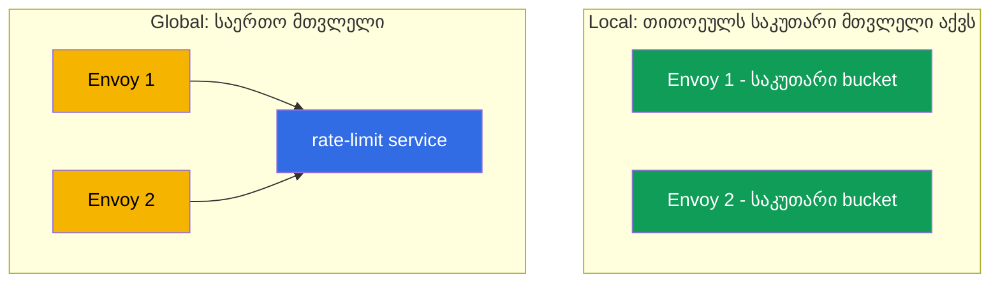
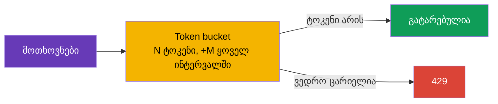

[Русская версия](ru.md) · [Eng version](en.md) · [Versión en español](es.md) · [Version française](fr.md) · [Deutsche Version](de.md) · [繁體中文版](tw.md) · [日本語版](jp.md)

# თავი 20. Rate limiting: მოთხოვნების ლოკალური შეზღუდვა

> **რა იქნება შემდეგ.** ვაგრძელებთ გაფართოებულ სცენარებს. Rate limiting (მოთხოვნების სიხშირის
> შეზღუდვა) სერვისებს გადატვირთვისგან, ბოროტად გამოყენებისა და DoS-ისგან იცავს. ამ თავში
> განვიხილავთ Istio-ს ორ მიდგომას: ლოკალურს (მარტივს, სადაც თითოეული Envoy თავად ითვლის) და
> გლობალურს (საერთო მთვლელი გარე სერვისის საშუალებით), და გავიგებთ, როდის რომელი ავირჩიოთ.

## 20.1. რისთვის არის საჭირო rate limiting

ჯანმრთელი სერვისიც კი შეიძლება მოთხოვნების მეტისმეტად დიდი რაოდენობით „წაიქცეს“: აგრესიული
კლიენტი, შეცდომიანი retry-ციკლი, parser-ბოტი ან პირდაპირი DoS-შეტევა. Rate limiting
ზღუდავს დროის ერთეულში დაშვებული მოთხოვნების რაოდენობას, ზედმეტ მოთხოვნებს კი დაუყოვნებლივ
უარყოფს კოდით `429 Too Many Requests`.

მნიშვნელოვანია, არ აგვერიოს მე-8 თავში განხილულ circuit breaking-ში:

- **Circuit breaking** (`connectionPool`) ზღუდავს **ერთდროულ** კავშირებსა და
  მოთხოვნებს - ეს მიმდინარე გაჯერებისგან დაცვაა.
- **Rate limiting** ზღუდავს **სიხშირეს** - დროის ინტერვალში მოთხოვნების რაოდენობას
  (მაგალითად, 100 მოთხოვნა წუთში).

ეს სხვადასხვა ამოცანისთვის განკუთვნილი სხვადასხვა ინსტრუმენტებია და მათ ხშირად ერთად იყენებენ.

## 20.2. ორი მიდგომა: local და global

Istio-ში rate limiting-ის ორი სახეობა არსებობს.

- **Local rate limit** - თითოეული Envoy მოთხოვნებს **თავად** ითვლის და საკუთარ მთვლელს
  ინახავს. მარტივია, სწრაფია და გარე დამოკიდებულებები არ აქვს. თუმცა ლიმიტი თითოეულ
  პროქსიზე ცალ-ცალკე მოქმედებს.
- **Global rate limit** - Envoy საერთო მთვლელის მქონე **გარე** rate-limit-სერვისს
  მიმართავს. რეპლიკების რაოდენობის მიუხედავად, მთელ სერვისზე ერთიან ლიმიტს უზრუნველყოფს,
  თუმცა დამოკიდებულებასა და დაყოვნებას ამატებს.



## 20.3. Local rate limit

საფუძვლად გამოიყენება **token bucket** („ტოკენების ვედრო“) ალგორითმი: გვაქვს N ტოკენის
ტევადობის ვედრო, რომელიც ყოველ ინტერვალში M ტოკენით ივსება. თითოეული მოთხოვნა ერთ ტოკენს
იღებს. თუ ტოკენი არის, მოთხოვნა გაივლის; თუ ვედრო ცარიელია, მოთხოვნა მიიღებს `429`-ს.



Istio-ში local rate limit-ისთვის ცალკე, მოსახერხებელი CRD არ არსებობს - მას
`EnvoyFilter`-ის საშუალებით რთავენ, Envoy-ის `local_ratelimit` ფილტრის მიერთებით.
კონფიგურაციის მთავარი ნაწილი სწორედ ვედროს პარამეტრებია (`token_bucket`). სრული რესურსი
`ping-pong` სერვისისთვის:

```yaml
apiVersion: networking.istio.io/v1alpha3
kind: EnvoyFilter
metadata:
  name: local-ratelimit
  namespace: app
spec:
  workloadSelector:
    labels:
      app: ping-pong                  # რომელ pod-ებზე გამოიყენება
  configPatches:
  - applyTo: HTTP_FILTER
    match:
      context: SIDECAR_INBOUND        # ვზღუდავთ სერვისზე შემომავალ ტრაფიკს
      listener:
        filterChain:
          filter:
            name: envoy.filters.network.http_connection_manager
    patch:
      operation: INSERT_BEFORE
      value:
        name: envoy.filters.http.local_ratelimit
        typed_config:
          "@type": type.googleapis.com/envoy.extensions.filters.http.local_ratelimit.v3.LocalRateLimit
          stat_prefix: http_local_rate_limiter
          token_bucket:
            max_tokens: 100           # ვედროს ზომა (მაქსიმალური აფეთქება)
            tokens_per_fill: 100      # რამდენი დაემატოს ინტერვალზე
            fill_interval: 60s        # შევსების ინტერვალი (100 მოთხოვნა წუთში)
          filter_enabled:             # ტრაფიკის რა წილზეა ფილტრი აქტიური
            default_value: { numerator: 100, denominator: HUNDRED }
          filter_enforced:            # ტრაფიკის რა წილზე რეალურად უარვყოთ (და არა მხოლოდ ვითვალოთ)
            default_value: { numerator: 100, denominator: HUNDRED }
          response_headers_to_add:
          - append_action: OVERWRITE_IF_EXISTS_OR_ADD
            header: { key: x-local-rate-limited, value: "true" }
```

ყურადღება მიაქციეთ `filter_enabled`-სა და `filter_enforced`-ს - ეს სწორედ „დაკვირვების
რეჟიმის“ სამართავი პარამეტრებია (20.7): თუ `filter_enforced`-ს 0%-ზე დააყენებთ, გადაჭარბებებს
**მხოლოდ დათვლით** (მეტრიკა `http_local_rate_limiter.rate_limited`) და არაფერს დაბლოკავთ,
შემდეგ კი უარყოფას ჩართავთ.

განვიხილოთ თითოეული პარამეტრის ფიზიკური მნიშვნელობა, რადგან მათზეა დამოკიდებული როგორც
საშუალო სიჩქარე, ისე დასაშვები პიკური მატება (მანიფესტში ისინი snake_case-ითაა ჩაწერილი -
`max_tokens`, `tokens_per_fill`, `fill_interval`; ქვემოთ სიმოკლისთვის `maxTokens`-სა და სხვებს
ვიყენებთ).

- **`maxTokens` - ვედროს ტევადობა, ანუ მაქსიმალური პიკური მატება (burst).** ვედროში ამ
  რაოდენობაზე მეტი ტოკენი ვერასოდეს დაგროვდება, მაშინაც კი, თუ ტრაფიკი დიდი ხნის განმავლობაში
  არ ყოფილა. ესე იგი, ეს არის მოთხოვნების მაქსიმალური რაოდენობა, რომელიც ერთ მომენტში
  „ერთბაშად“ შეიძლება გატარდეს. აქ მნიშვნელობა 100-ია - ერთ ჯერზე მაქსიმუმ 100 მოთხოვნა გაივლის.
- **`tokensPerFill` - ტოკენების რაოდენობა, რომელიც შევსების ერთ ინტერვალში ემატება.**
- **`fillInterval` - შევსების სიხშირე.**

`tokensPerFill` და `fillInterval` ერთად **საშუალო დამყარებულ სიჩქარეს** განსაზღვრავს:
`tokensPerFill / fillInterval`. მაგალითში ეს არის 100 ტოკენი 60 წამში, ანუ საშუალოდ
დაახლოებით 100 მოთხოვნა წუთში. ამასთან, `maxTokens` განსაზღვრავს, რამდენად „წყვეტილი“ შეიძლება
იყოს ტრაფიკი ამ საშუალო მნიშვნელობის გარშემო.

მთავარი განსხვავება `maxTokens`-სა და `tokensPerFill`-ს შორის:

- თუ `maxTokens = tokensPerFill` (როგორც ზემოთ, 100 და 100), პიკური მატება შევსების ერთი
  „პორციით“ იზღუდება. ერთ პერიოდში 100-ზე მეტი მოთხოვნა ვერ გაივლის და ერთბაშადაც მაქსიმუმ
  100 მოთხოვნა გატარდება.
- თუ `maxTokens > tokensPerFill`, მშვიდ პერიოდებში გამოუყენებელი ტოკენები `maxTokens`-მდე
  გროვდება, შემდეგ კი უფრო დიდი პიკური ნაკადის გატარებაა შესაძლებელი. მაგალითად,
  `maxTokens: 300`, `tokensPerFill: 100`, `fillInterval: 60s`: საშუალო სიჩქარე კვლავ
  დაახლოებით 100 მოთხოვნაა წუთში, მაგრამ პაუზის შემდეგ კლიენტს შეუძლია ერთბაშად 300-მდე
  მოთხოვნა „ისროლოს“, სანამ დაგროვილი ტოკენები არ ამოიწურება.

ანალოგია: ვედრო წყლით (ტოკენებით) მუდმივი სიჩქარით ივსება
(`tokensPerFill`/`fillInterval`), მაგრამ კიდეებს (`maxTokens`) ზემოთ არ გადმოედინება.
თითოეული მოთხოვნა ერთ ჭიქა წყალს იღებს; თუ წყალი არ არის, მოთხოვნა `429`-ს მიიღებს. თუ
დიდი პიკების გარეშე უფრო „თანაბარი“ ტრაფიკი გსურთ, `fillInterval` მცირე მნიშვნელობაზე
დააყენეთ (მაგალითად, წუთში ერთხელ 120 ტოკენის ერთიანად დამატების ნაცვლად ყოველ წამში 2
ტოკენი დაამატეთ) და `maxTokens` `tokensPerFill`-თან ახლოს შეინარჩუნეთ.

მნიშვნელოვანი ნიუანსი: **თითოეულ Envoy-ს საკუთარი** მთვლელი აქვს. თუ სერვისს 3 რეპლიკა
აქვს და თითოეულზე წუთში 100 მოთხოვნის ლიმიტია, სერვისი ჯამურად 300-მდე მოთხოვნას გაატარებს,
რადგან კლიენტები რეპლიკებზე ნაწილდებიან და თითოეული მათგანი დამოუკიდებლად ითვლის. ეს
ცალკეული ინსტანსის უხეში დაცვისთვის ნორმალურია, მაგრამ მთელ სერვისზე ზუსტ ლიმიტს არ იძლევა.

## 20.4. Global rate limit

როდესაც რეპლიკების რაოდენობის მიუხედავად **მთელი სერვისისთვის ერთიანი ლიმიტია** საჭირო,
global rate limit-ს იყენებენ. აქ Envoy თითოეულ მოთხოვნაზე გარე **rate-limit-სერვისს**
(ჩვეულებრივ, ეს არის Envoy Rate Limit Service-ის ეტალონური იმპლემენტაცია + Redis საერთო
მთვლელისთვის) ეკითხება: „კიდევ შეიძლება?“. სერვისი საერთო მთვლელს მართავს და პასუხობს,
მოთხოვნა დაუშვას თუ უარყოს.

უპირატესობები: ზუსტი ლიმიტი მთელ სერვისზე და მოქნილი წესები (მომხმარებლის, API-გასაღების ან
გზის მიხედვით). ნაკლოვანებები: საჭიროა დამატებითი სერვისი (და მთვლელების საცავი) და ის
გამართულად უნდა მუშაობდეს; გარდა ამისა, თითოეული მოთხოვნა მისკენ დამატებით ქსელურ გამოძახებას
ასრულებს - ეს დამოკიდებულებასა და მცირე დაყოვნებას ქმნის.

## 20.5. ნიშნით შეზღუდვა (per-IP, per-header)

Rate limit აუცილებელი არ არის „ერთი ვედრო იყოს მთელი სერვისისთვის“. შეზღუდვა შეიძლება
**ნიშნის მიხედვით** დაწესდეს: მაგალითად, წამში მაქსიმუმ 10 მოთხოვნა **ერთი IP-დან**, ან
ცალკე ლიმიტი თითოეული API-გასაღებისთვის, გზისთვის ან მომხმარებლისთვის. ამას **დესკრიპტორები**
(descriptors) უზრუნველყოფს - გასაღებები, რომელთა მნიშვნელობების მიხედვითაც ცალკე მთვლელი
იწარმოება.

შეზღუდვის ტიპური ნიშნებია:

- **კლიენტის IP** (`remote_address`) - კლასიკური „10 rps ერთი IP-დან“ ბოტების წინააღმდეგ;
- **სათაური** - მაგალითად, `x-api-key` ან `x-user-id` (ლიმიტი კლიენტზე/ტენანტზე);
- **გზა ან მეთოდი** - უფრო მკაცრი ლიმიტი „მძიმე“ ან ძვირად ღირებულ endpoint-ზე.

როგორ შეესაბამება ეს ორ მიდგომას:

- **Global rate limit** სწორედ ამისთვისაა შექმნილი. წესებს დესკრიპტორების მიხედვით აღწერთ,
  გარე rate-limit-სერვისი კი გასაღების **თითოეული მნიშვნელობისთვის ცალკე საერთო მთვლელს**
  მართავს. მთელ სერვისზე „10 rps თითოეული IP-სთვის“ სწორედ ამ კატეგორიას ეკუთვნის: თითოეულ
  IP-ს საკუთარი მთვლელი აქვს, რომელიც ყველა რეპლიკისთვის საერთოა.
- **Local rate limit**-საც შეუძლია დესკრიპტორების გამოყენება (ცალკე ვედროები გასაღებებისთვის),
  მაგრამ მთვლელი თითოეული Envoy-სთვის ლოკალური რჩება. „per-IP თითო ინსტანსზე“ გამოდგება, ხოლო
  ზუსტი „per-IP მთელ სერვისზე“ - არა, რადგან ერთი და იგივე IP შეიძლება სხვადასხვა რეპლიკაზე
  მოხვდეს და თითოეული მათგანი მას ცალ-ცალკე დაითვლის.

### მნიშვნელოვანი ხაფანგი: კლიენტის რეალური IP

თუ შეზღუდვას IP-ის მიხედვით აწესებთ, დარწმუნდით, რომ Envoy კლიენტის **რეალურ** IP-ს ხედავს
და არა დამბალანსებლის მისამართს. ღრუბლოვანი LB-ის უკან მთელი ტრაფიკი თითქოს ერთი მისამართიდან
მოდის და გულუბრყვილოდ კონფიგურირებული per-IP ლიმიტი ყველასთვის საერთო ლიმიტად გადაიქცევა.
კლიენტის რეალური IP-ის gateway-მდე მიწოდების გზა დამბალანსებლის ტიპზეა დამოკიდებული
(დეტალურად მე-14 თავში განვიხილეთ):

- **ALB-ის (L7)** უკან ის თავად აყენებს `X-Forwarded-For`-ს; საკმარისია MeshConfig-ში
  `numTrustedProxies` მიუთითოთ;
- **NLB-ის (L4)** უკან `X-Forwarded-For` სათაური საერთოდ არ არის - რეალური IP მიეწოდება
  **Proxy Protocol v2**-ით (ანოტაცია gateway-ის Service-ზე + listener-ფილტრი).

კლიენტის IP-ის სწორად მიწოდების გარეშე IP-ზე დაფუძნებული ლიმიტი არ იმუშავებს - ის ან
დამბალანსებლის მისამართზე ამოქმედდება (საერთო ლიმიტი ყველასთვის), ან საჭირო მნიშვნელობას
ვერ იპოვის.

## 20.6. რა ავირჩიოთ

| | Local rate limit | Global rate limit |
|---|------------------|-------------------|
| სად არის მთვლელი | თითოეულ Envoy-ში | გარე სერვისში (საერთო) |
| ლიმიტის სიზუსტე | თითო რეპლიკაზე (ჯამი = ლიმიტი × რეპლიკები) | ერთიანი მთელი სერვისისთვის |
| დამოკიდებულებები | არ არის | rate-limit-სერვისი + საცავი (Redis) |
| დაყოვნება | მინიმალური | +გარე სერვისის გამოძახება |
| სირთულე | ნაკლები | მეტი |

პრაქტიკული წესი:

- **Local** - ინსტანსის გადატვირთვისგან მარტივი, უხეში დაცვისთვის, როდესაც ზუსტი რიცხვი
  „მთელი სერვისისთვის“ კრიტიკული არ არის. დაიწყეთ ამით - იაფია და დამოკიდებულებები არ აქვს.
- **Global** - როდესაც ზუსტი საერთო ლიმიტია საჭირო (მაგალითად, „მთელ სერვისზე ერთი
  API-გასაღებიდან წუთში მაქსიმუმ 1000 მოთხოვნა“) და მზად ხართ rate-limit-სერვისი მართოთ.

ხშირად გონივრული მიდგომაა local-ის გამოყენება თითოეულ პროქსიზე დაცვის პირველ ხაზად, ხოლო
global-ის - იქ, სადაც ბიზნესწესები ზუსტ საერთო ლიმიტს მოითხოვს.

## 20.7. Rate limiting და ავტოსკეილინგი (HPA/KEDA)

ერთი შეხედვით, rate limiting და ჰორიზონტალური ავტოსკეილინგი (HPA ან KEDA) საპირისპირო
ამოცანებს წყვეტს: ლიმიტი ზედმეტ ტრაფიკს **ჭრის**, ავტოსკეილინგი კი მის მოსამსახურებლად
**სიმძლავრეს ამატებს**. პრაქტიკაში ისინი ერთმანეთს კარგად ავსებს, თუმცა მათი შეთანხმება
აუცილებელია - წინააღმდეგ შემთხვევაში ადვილად მიიღებთ ან „ლიმიტს, რომელიც თავად იზრდება და
არაფერს ზღუდავს“, ან „ავტოსკეილერს, რომელიც დატვირთვაზე არ რეაგირებს“.

**მთავარი ფაქტი: local-ლიმიტი რეპლიკებთან ერთად მასშტაბირდება.** თითოეულ Envoy-ს საკუთარი
მთვლელი აქვს, ამიტომ ჯამური გამტარუნარიანობა = `ლიმიტი თითო პოდზე × რეპლიკების რაოდენობა`
(20.3). ამას უპირატესობაც აქვს და ფარული საფრთხეც:

- **უპირატესობა.** თუ per-pod ლიმიტს **ერთი** პოდის უსაფრთხო სიმძლავრის ტოლად დააყენებთ,
  რეპლიკების დამატებისას საერთო ზღვარიც თავისით გაიზრდება - თითოეული ინსტანსი დაცულია, ხოლო
  მთლიანად სერვისი მასშტაბირდება. ანუ local rate limit + ავტოსკეილინგი = „ინსტანსის დაცვა,
  რომელიც ფლოტთან ერთად იზრდება“.
- **ფარული საფრთხე.** თუ **მკაცრი საერთო ზღვარი** გინდოდათ (მაგალითად, „მთელ სერვისზე
  მაქსიმუმ 1000 rps“), local ამას ვერ უზრუნველყოფს: ავტოსკეილინგი რეპლიკებს გაზრდის და საერთო
  ლიმიტიც აიწევს. ფიქსირებული საერთო ლიმიტისთვის **global** rate limit არის საჭირო - ის
  რეპლიკების რაოდენობაზე არ არის დამოკიდებული.

**მეორე ნიუანსი - რომელი სიგნალის მიხედვით უნდა მოხდეს სკეილინგი.** უარყოფილ მოთხოვნებს
(`429`) Envoy ადრეულ ეტაპზე და მცირე დანახარჯით ამუშავებს, ამიტომ ისინი აპლიკაციის CPU-ს
თითქმის არ ტვირთავს. აქედან გამომდინარე:

- თუ ავტოსკეილერი **CPU/მეხსიერებას** აკვირდება, ის უარყოფილ დატვირთვას **ვერ დაინახავს** და
  რეპლიკებს არ დაამატებს, მიუხედავად იმისა, რომ მოთხოვნა რეალურია. ეს მისაღებია, თუ ზღვარს
  განზრახ აწესებთ, მაგრამ ცუდია, თუ პიკური ნაკადის მომსახურება გსურთ.
- უმჯობესია სკეილინგი **შემავალ მოთხოვნაზე** მოახდინოთ: RPS ლიმიტამდე ან რიგის სიღრმე.
  აქ მოსახერხებელია **KEDA** - მას შეუძლია სკეილინგი Prometheus-ის მეტრიკებით (მათ შორის
  `istio_requests_total`-ით) ან რიგის სიგრძით (SQS/Kafka).

**პრაქტიკული შემთხვევა: KEDA Istio-ს მეტრიკით + local rate limit.** `orders` სერვისი ingress
gateway-ის უკანაა. KEDA მას Istio-ს მეტრიკებიდან მიღებული შემავალი RPS-ის მიხედვით ასკეილებს,
ხოლო თითოეულ პოდზე local rate limit ინსტანსს გადატვირთვისგან მანამდე იცავს, სანამ რეპლიკები
გაეშვება (KEDA/HPA-ს რეაგირებას ათობით წამი სჭირდება, ტოკენების ვედრო კი მყისიერად მოქმედებს).

```yaml
apiVersion: keda.sh/v1alpha1
kind: ScaledObject
metadata:
  name: orders
  namespace: app
spec:
  scaleTargetRef:
    name: orders                       # Deployment, რომელსაც ვასკეილებთ
  minReplicaCount: 2
  maxReplicaCount: 20
  triggers:
  - type: prometheus
    metadata:
      serverAddress: http://prometheus.istio-system:9090
      # orders-ზე შემომავალი RPS Istio-ს მეტრიკით (თავი 17)
      query: sum(rate(istio_requests_total{destination_service_name="orders"}[1m]))
      threshold: "50"                  # მიზანი ~50 rps replica-ზე -> KEDA დაამატებს pod-ებს
```

ამ კომბინაციის ლოგიკა:

1. RPS იზრდება → KEDA ამას `istio_requests_total`-ით ხედავს და `orders`-ის **რეპლიკებს ამატებს**.
2. სანამ ახალი პოდები ეშვება, თითოეულ პოდზე **local rate limit** უკვე მომუშავე ინსტანსების
   გადატვირთვას უშლის ხელს (პიკური ნაკადისგან მყისიერი დაცვა, რომლის უზრუნველყოფასაც
   ავტოსკეილერი დროულად ვერ ასწრებს).
3. რეპლიკების რაოდენობა გაიზარდა → local-ლიმიტის ჯამური ზღვარიც ავტომატურად გაიზარდა → სერვისი
   მეტ ტრაფიკს უმკლავდება.
4. მოთხოვნა შემცირდა → KEDA რეპლიკებს შლის და ზღვარიც იკლებს.

შეთანხმების რეკომენდაციები:

- **სკეილინგი მოთხოვნის მიხედვით და არა „წარმატებული მოთხოვნების“ მიხედვით მოახდინეთ.** KEDA-ს
  ტრიგერი შემავალი RPS/რიგი უნდა იყოს, წინააღმდეგ შემთხვევაში უარყოფილი დატვირთვა (`429`)
  მასშტაბირებას არ გამოიწვევს.
- **Per-pod local-ლიმიტი = ერთი პოდის უსაფრთხო სიმძლავრე** და არა „საერთო ზღვარი / რეპლიკები“.
  ამ შემთხვევაში ლიმიტი ინსტანსს იცავს, საერთო ზრდას კი ავტოსკეილერი უზრუნველყოფს.
- **მკაცრი საერთო ზღვარი - მხოლოდ global RLS** (ის რეპლიკების რაოდენობის მიმართ ინვარიანტულია);
  local ამისთვის არ გამოდგება.
- **`429`, როგორც სიგნალი.** უარყოფილი მოთხოვნების პიკი KEDA-ში ტრიგერადაც შეიძლება გამოიყენოთ
  („ლიმიტს მივაღწიეთ - დაამატე რეპლიკები“) ან, სულ მცირე, ალერტებში ჩართოთ.
- **გაითვალისწინეთ `maxReplicaCount`.** ის ირიბად განსაზღვრავს მაქსიმალურ ჯამურ local-ლიმიტს
  (`ლიმიტი × maxReplicas`); ეს მხედველობაში იქონიეთ, რათა ავტოსკეილინგმა დამოკიდებულებების
  (მონაცემთა ბაზისა და სხვ.) სიმძლავრეს არ გადააჭარბოს.

## 20.8. საუკეთესო პრაქტიკები production-ისთვის

- **ჯერ გაზომეთ, შემდეგ შეზღუდეთ.** მეტრიკებში (თავი 17) რეალური ტრაფიკი შეამოწმეთ:
  ნორმალური RPS და პიკები. ლიმიტი პიკზე მაღლა, მარაგით დააყენეთ. „შემთხვევით“ შერჩეული
  ლიმიტი ან ვერ დაგიცავთ, ან ლეგიტიმურ მომხმარებლებს შეზღუდავს.
- **დაიწყეთ დაკვირვების რეჟიმით.** შესაძლებლობის შემთხვევაში, ჯერ გადაჭარბებები მხოლოდ
  ჟურნალში აღრიცხეთ და არ დაბლოკოთ, ზღვრის სისწორეში დარწმუნდით და მხოლოდ შემდეგ ჩართეთ
  უარყოფა.
- **დააბრუნეთ სწორი პასუხი.** `429` და სათაური `Retry-After`, რათა კლიენტმა იცოდეს,
  როდის გაიმეოროს მოთხოვნა. პასუხის გასაგები სხეული ინტეგრატორებს ეხმარება.
- **განსხვავებული ლიმიტები სხვადასხვა კლიენტისთვის.** დესკრიპტორების საშუალებით განსაზღვრეთ
  დონეები (free და premium API-გასაღების მიხედვით), ხოლო ძვირად ღირებული endpoint-ები
  (შესვლა, ძიება, ექსპორტი) უფრო მკაცრად დაიცავით.
- **Global RLS - კრიტიკული დამოკიდებულება.** უზრუნველყავით თავად rate-limit-სერვისისა და მისი
  საცავის (Redis) HA და აკონტროლეთ გამოძახებების დაყოვნება. წინასწარ გადაწყვიტეთ, როგორ
  მოიქცეთ RLS-ის მიუწვდომლობისას: **fail-open** (გაატარეთ მოთხოვნები, რათა RLS-ის შეფერხებამ
  სერვისი არ გააჩეროს) - ნაგულისხმევად უფრო უსაფრთხოა; **fail-closed** - როდესაც დაცვა
  ხელმისაწვდომობაზე მნიშვნელოვანია.
- **დაცვა ფენებად ააგეთ.** უხეში per-IP ლიმიტი ingress gateway-ზე (პერიმეტრი) + ლოკალური
  ლიმიტები სერვისებზე + circuit breaking (თავი 8). ერთი rate limit დანარჩენს ვერ შეცვლის.
  AWS-ზე ყველაზე გარე ფენის კიდევ უფრო წინ გატანაა მოსახერხებელი - **AWS WAF rate-based
  rules** CloudFront/ALB-ზე: ისინი flood-სა და ბოტებს კლასტერში შესვლამდე **ჭრიან** და mesh-ს
  განტვირთავენ; ზუსტი ბიზნესლიმიტები (per-API-key, per-tenant) კი mesh-ის შიგნით global RLS-ს
  რჩება.
- **შეათანხმეთ retry-ებთან.** კლიენტების აგრესიული retry-ები (თავი 8) თავად ქმნის დატვირთვას
  და ლიმიტს ეჯახება; ისინი ერთობლივად დააკონფიგურირეთ, რათა განმეორებითი მოთხოვნების შტორმი
  არ მიიღოთ.
- **ამოქმედებები აკონტროლეთ.** უარყოფილი მოთხოვნების (`429`) მეტრიკა როგორც შეტევის, ისე
  ზედმეტად მკაცრი ლიმიტის სიგნალია. პიკებზე ალერტები დააყენეთ.
- **დატვირთვის ქვეშ დატესტეთ.** production-ში გაშვებამდე ლიმიტები staging-ში დატვირთვის
  ტესტით (fortio, k6) შეამოწმეთ.
- **ფრთხილად იყავით EnvoyFilter-თან.** Local rate limit `EnvoyFilter`-შია განთავსებული,
  რომელიც Istio-ს განახლებებისას მყიფეა - განახლების შემდეგ ვერსია დააფიქსირეთ და დატესტეთ.

## 20.9. თავის შეჯამება

- Rate limiting მოთხოვნების **სიხშირეს** ზღუდავს და ზედმეტ მოთხოვნებს `429` კოდით უარყოფს;
  იცავს გადატვირთვისგან, ბოროტად გამოყენებისა და DoS-ისგან.
- ეს არ არის იგივე, რაც circuit breaking (`connectionPool`): ის **ერთდროულ**
  კავშირებს/მოთხოვნებს ზღუდავს, rate limiting კი - დროის ინტერვალში მოთხოვნების რაოდენობას.
- **Local rate limit**: token bucket თითოეულ Envoy-ში, ირთვება `EnvoyFilter`-ის საშუალებით,
  გარე დამოკიდებულებები არ აქვს; თითოეულ რეპლიკას საკუთარი მთვლელი აქვს.
- **Global rate limit**: საერთო მთვლელი გარე rate-limit-სერვისში; ზუსტი ლიმიტი მთელ
  სერვისზე, თუმცა დამოკიდებულებასა და დაყოვნებას ამატებს.
- არჩევანი: local ინსტანსის მარტივი დაცვისთვის, global ზუსტი საერთო ლიმიტისთვის; ხშირად
  მათ ერთად იყენებენ.
- შესაძლებელია **ნიშნის მიხედვით** შეზღუდვა დესკრიპტორების საშუალებით (per-IP, per-header,
  per-path). ზუსტი „10 rps ერთი IP-დან მთელ სერვისზე“ global rate limit-ს მოითხოვს; IP-ზე
  დაფუძნებული ლიმიტისთვის Envoy კლიენტის რეალურ IP-ს უნდა ხედავდეს: **ALB**-ის უკან
  `numTrustedProxies`-ის, **NLB**-ის უკან კი Proxy Protocol-ის საშუალებით (თავი 14).
- Local rate limit ირთვება სრული `EnvoyFilter`-ით (`local_ratelimit`); `filter_enforced`
  დაკვირვების რეჟიმში (მხოლოდ დათვლა) გაშვების საშუალებას იძლევა, მეტრიკაა
  `http_local_rate_limiter.rate_limited`.
- AWS-ზე ყველაზე გარე ფენა (flood, ბოტები) მოსახერხებელია **AWS WAF rate-based rules**-ით
  დაიცვათ CloudFront/ALB-ზე, ზუსტი ბიზნესლიმიტები კი mesh-ის შიგნით global RLS-ში შეინახოთ.
- ავტოსკეილინგისას (HPA/KEDA): ჯამური **local**-ლიმიტი = `ლიმიტი × რეპლიკები`, ანუ ფლოტთან
  ერთად იზრდება (per-pod ლიმიტი = ერთი პოდის სიმძლავრე); მკაცრ საერთო ზღვარს მხოლოდ
  **global** უზრუნველყოფს. სკეილინგი უნდა მოხდეს **შემავალი მოთხოვნის** მიხედვით (KEDA
  `istio_requests_total`-ის/რიგის მიხედვით) და არა CPU-ს მიხედვით, წინააღმდეგ შემთხვევაში
  უარყოფილი (`429`) დატვირთვა მასშტაბირებას არ გამოიწვევს.
- Production-ის პრაქტიკები: ლიმიტის რეალური ტრაფიკის მეტრიკებით განსაზღვრა (პიკზე მაღლა),
  დაკვირვების რეჟიმით დაწყება, `429` + `Retry-After`-ის დაბრუნება, global RLS-ის HA-ს
  უზრუნველყოფა და fail-open/fail-closed-ის არჩევა, დაცვის ფენებად აგება, ამოქმედებების
  მონიტორინგი და დატვირთვის ქვეშ ტესტირება.

## 20.10. თვითშემოწმების კითხვები

1. რით განსხვავდება rate limiting მე-8 თავში განხილული circuit breaking-ისგან?
2. როგორ მუშაობს token bucket ალგორითმი?
3. რატომ არის local rate limit-ის გამოყენებისას სერვისის ჯამური ლიმიტი ერთი ლიმიტისა და
   რეპლიკების რაოდენობის ნამრავლის ტოლი?
4. როდის არის საჭირო global rate limit და რა ფასად მიიღწევა ის?
5. რომელი მიდგომა უნდა აირჩიოთ ინსტანსის მარტივი დაცვისთვის და რომელი - ზუსტი საერთო ლიმიტისთვის?
6. როგორ შევზღუდოთ „10 rps ერთი IP-დან“? რატომ არის ამისთვის საჭირო global rate limit და
   როგორ მივაწოდოთ კლიენტის რეალური IP **ALB**-ისა და **NLB**-ის უკან?
7. რას ნიშნავს fail-open და fail-closed rate-limit-სერვისის მიუწვდომლობისას და რომელი უნდა ავირჩიოთ?
8. რატომ უნდა შეირჩეს ლიმიტი მეტრიკების მიხედვით და რატომ უნდა დავიწყოთ დაკვირვების რეჟიმით?
9. როგორ გავუშვათ local rate limit დაკვირვების რეჟიმში (მხოლოდ დათვლა, დაბლოკვის გარეშე)?
10. რა ადგილი უკავია ფენოვან დაცვაში AWS WAF rate-based rules-ს და რა ადგილი - mesh-ის შიგნით global RLS-ს?
11. როგორ იქცევა local rate limit ავტოსკეილინგისას (HPA/KEDA) და რატომ არის მკაცრი საერთო
    ზღვრისთვის global საჭირო? რომელი სიგნალის მიხედვით უნდა მოხდეს სკეილინგი და რატომ არა CPU-ს მიხედვით?

## პრაქტიკა

ივარჯიშეთ მოთხოვნების ლოკალურ შეზღუდვაში `EnvoyFilter`-ის (token bucket) საშუალებით:

🧪 ლაბორატორია 17: [tasks/ica/labs/17](../../labs/17/README_GE.MD)

---
[სარჩევი](../README_GE.md) · [თავი 19](../19/ge.md) · [თავი 21](../21/ge.md)