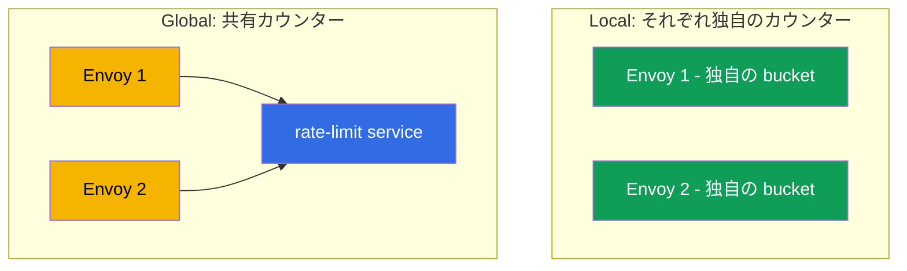
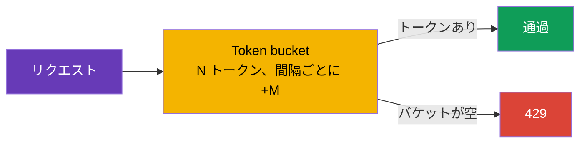

[Русская версия](ru.md) · [Eng version](en.md) · [Versión en español](es.md) · [Version française](fr.md) · [Deutsche Version](de.md) · [ქართული ვერსია](ge.md) · [繁體中文版](tw.md)

# 第20章。Rate limiting: リクエストのローカル制限

> **この次に。** 高度なシナリオを続けます。Rate limiting（リクエスト頻度の
> 制限）は、サービスを過負荷、悪用、DoS から保護します。この章では Istio の
> 2 つのアプローチ、ローカル（シンプルで、各 Envoy が自分で数える）とグローバル
> （外部サービスによる共有カウンター）を扱い、どちらをいつ選ぶべきかを理解します。

## 20.1. rate limiting が必要な理由

健全なサービスであっても、過剰な数のリクエストによって「落とされる」ことがあります。
攻撃的なクライアント、バグのあるリトライループ、パーサーボット、直接的な DoS 攻撃が原因です。
Rate limiting は単位時間あたりに許可するリクエスト数を制限し、余分なリクエストを
`429 Too Many Requests` コードで直ちに拒否します。

第8章の circuit breaking と混同しないことが重要です。

- **Circuit breaking**（`connectionPool`）は**同時に**存在する接続とリクエストを
  制限します。瞬間的な飽和から守るためです。
- **Rate limiting** は**頻度**、すなわち時間間隔あたりのリクエスト数
  （例: 毎分 100 リクエスト）を制限します。

これらは目的が異なる別のツールであり、しばしば併用されます。

## 20.2. 2 つのアプローチ: local と global

Istio には 2 種類の rate limiting があります。

- **Local rate limit** - 各 Envoy が独自のカウンターを保持して、リクエストを**自分で**数えます。
  シンプル、高速で、外部依存はありません。ただし、制限は各プロキシに個別に適用されます。
- **Global rate limit** - Envoy が共有カウンターを持つ**外部** rate-limit サービスに問い合わせます。
  レプリカ数にかかわらずサービス全体に単一の制限を設けられますが、依存関係と遅延が加わります。



## 20.3. Local rate limit

基礎となるのは **token bucket**（「トークンバケット」）アルゴリズムです。N 個のトークンを
入れられるバケットがあり、一定の間隔ごとに M 個のトークンが補充されます。各リクエストは
トークンを 1 個取り出します。トークンがあればリクエストは通過し、バケットが空ならリクエストは
`429` を受け取ります。



Istio には local rate limit 用の個別の便利な CRD はありません。Envoy の
`local_ratelimit` フィルターを接続する `EnvoyFilter` を通して有効にします。設定の重要な部分は
バケットのパラメーター（`token_bucket`）です。サービス `ping-pong` の完全なリソースは次のとおりです。

```yaml
apiVersion: networking.istio.io/v1alpha3
kind: EnvoyFilter
metadata:
  name: local-ratelimit
  namespace: app
spec:
  workloadSelector:
    labels:
      app: ping-pong                  # どの Pod に適用されるか
  configPatches:
  - applyTo: HTTP_FILTER
    match:
      context: SIDECAR_INBOUND        # サービスへの受信トラフィックを制限する
      listener:
        filterChain:
          filter:
            name: envoy.filters.network.http_connection_manager
    patch:
      operation: INSERT_BEFORE
      value:
        name: envoy.filters.http.local_ratelimit
        typed_config:
          "@type": type.googleapis.com/envoy.extensions.filters.http.local_ratelimit.v3.LocalRateLimit
          stat_prefix: http_local_rate_limiter
          token_bucket:
            max_tokens: 100           # バケットのサイズ (最大バースト)
            tokens_per_fill: 100      # 間隔ごとに追加する量
            fill_interval: 60s        # 補充間隔 (1 分あたり 100 リクエスト)
          filter_enabled:             # フィルタを有効にするトラフィックの割合
            default_value: { numerator: 100, denominator: HUNDRED }
          filter_enforced:            # 実際に拒否する割合 (カウントのみでなく)
            default_value: { numerator: 100, denominator: HUNDRED }
          response_headers_to_add:
          - append_action: OVERWRITE_IF_EXISTS_OR_ADD
            header: { key: x-local-rate-limited, value: "true" }
```

`filter_enabled` と `filter_enforced` に注目してください。これらはまさに「監視モード」の
制御（20.7）です。`filter_enforced` を 0% に設定すると、何もブロックせずに超過だけを**数え**
（メトリクス `http_local_rate_limiter.rate_limited`）、後から拒否を有効にできます。

平均速度と許容されるバーストの両方はこれらの値に依存するため、各パラメーターの物理的な意味を
見ていきます（マニフェストでは snake_case の `max_tokens`、`tokens_per_fill`、
`fill_interval` ですが、以下では簡潔に `maxTokens` などと表記します）。

- **`maxTokens` - バケットの容量、つまり最大バースト（burst）です。** トラフィックが長時間
  なかったとしても、これ以上のトークンがバケットに蓄積されることはありません。つまり、ある瞬間に
  「一斉に」通過させられるリクエスト数の最大値です。ここでは 100 なので、一度に通過できるのは
  最大 100 リクエストです。
- **`tokensPerFill` - 1 回の補充間隔に追加するトークン数です。**
- **`fillInterval` - 補充が発生する頻度です。**

`tokensPerFill` と `fillInterval` を合わせると、**平均的な定常速度**、すなわち
`tokensPerFill / fillInterval` が決まります。この例では 60 秒あたり 100 トークン、すなわち
平均で毎分約 100 リクエストです。`maxTokens` は、この平均の周辺でどの程度トラフィックを
「不均一」にできるかを決めます。

`maxTokens` と `tokensPerFill` の主な違いは次のとおりです。

- `maxTokens = tokensPerFill`（上記のように 100 と 100）の場合、バーストは 1 回の補充
  「分」に制限されます。1 期間に通過できるのは 100 以下で、一斉でも 100 以下です。
- `maxTokens > tokensPerFill` の場合、静かな期間には未使用のトークンが `maxTokens` まで
  蓄積され、その後、より大きなバーストを許可できます。たとえば `maxTokens: 300`、
  `tokensPerFill: 100`、`fillInterval: 60s` では、平均速度は依然として毎分約 100 ですが、
  静穏後には、蓄積されたトークンが尽きるまでクライアントは一度に最大 300 リクエストを
  「発射」できます。

たとえるなら、バケットには一定速度（`tokensPerFill`/`fillInterval`）で水（トークン）が注がれますが、
縁（`maxTokens`）を越えて満たされることはありません。各リクエストはコップ 1 杯を汲み出し、水が
なければ `429` を受け取ります。大きな一斉送信のない、より「均一な」トラフィックにしたいなら、
`fillInterval` を小さくしてください（たとえば 1 分に 120 個を一度に追加する代わりに、毎秒 2 個を
追加する）。また、`maxTokens` は `tokensPerFill` に近づけます。

重要な注意点として、カウンターは**各 Envoy ごとに独立**しています。サービスに 3 レプリカがあり、
それぞれが毎分 100 リクエストの制限なら、クライアントはレプリカ間に分散され、それぞれが独立して
数えるため、サービス全体では最大 300 を通過させます。これは単一インスタンスを大まかに保護するには
問題ありませんが、サービス全体に正確な制限を設けることはできません。

## 20.4. Global rate limit

レプリカ数にかかわらず**サービス全体に単一の制限**が必要な場合は、global rate limit を使います。
ここでは Envoy が各リクエストについて、外部の**rate-limit サービス**（通常は Envoy Rate Limit
Service のリファレンス実装と、共有カウンター用の Redis）に「まだ許可できるか」を問い合わせます。
このサービスが共有カウンターを維持し、許可または拒否を応答します。

利点は、サービス全体で正確な制限と、ユーザー、API キー、パス別などの柔軟なルールです。欠点は、
追加のサービス（およびカウンター用ストレージ）が必要かつ稼働していなければならず、各リクエストが
そこへの追加のネットワーク呼び出しを行うことです。これは依存関係であり、わずかな遅延でもあります。

## 20.5. 属性別の制限（per-IP、per-header）

Rate limit は必ずしも「サービス全体で 1 つのバケット」である必要はありません。**属性別に**
制限できます。たとえば、**1 つの IP から**毎秒 10 リクエスト以下、または API キー、パス、
ユーザーごとに独自の制限を設定できます。これを担うのが**ディスクリプター**（descriptors）です。
その値ごとに別々のカウンターを管理するキーです。

制限で典型的に使う属性は次のとおりです。

- **クライアント IP**（`remote_address`）- ボット対策としての、古典的な「1 IP あたり 10 rps」。
- **ヘッダー** - たとえば `x-api-key` または `x-user-id`（クライアント/テナントごとの制限）。
- **パスまたはメソッド** - 「重い」または高コストなエンドポイントに、より厳しい制限を設定します。

これが 2 つのアプローチにどう対応するかを見てみましょう。

- **Global rate limit** はまさにこのために作られています。ディスクリプターによるルールを記述し、
  外部 rate-limit サービスがキーの**値ごとに別個の共有カウンター**を維持します。サービス全体で
  「各 IP に 10 rps」はまさにこの用途です。各 IP はすべてのレプリカで共有される独自のカウンターを
  持ちます。
- **Local rate limit** もディスクリプター（キーごとの個別バケット）を扱えますが、カウンターは
  各 Envoy にローカルのままです。「インスタンスごとの per-IP」には適していますが、正確な
  「サービス全体の per-IP」には適しません。同じ IP が異なるレプリカに到達し、それぞれが個別に
  数える可能性があるためです。

### 重要な落とし穴: 実際のクライアント IP

IP によって制限する場合、Envoy がロードバランサーのアドレスではなく**実際の**クライアント IP を
認識していることを確認してください。クラウドの LB の背後では、すべてのトラフィックが同じアドレス
から来ているように見え、素朴な per-IP 制限は全員に対する共通制限になってしまいます。実際の
クライアント IP をゲートウェイへ伝える方法はロードバランサーの種類に依存します（第14章で詳しく
扱いました）。

- **ALB（L7）** の背後では、ALB 自身が `X-Forwarded-For` を設定するため、MeshConfig に
  `numTrustedProxies` を設定すれば十分です。
- **NLB（L4）** の背後では、`X-Forwarded-For` ヘッダーはまったくありません。実際の IP は
  **Proxy Protocol v2**（ゲートウェイの Service へのアノテーション + listener フィルター）を通じて
  伝えます。

クライアント IP が正しく伝わらなければ、IP 別の制限は機能しません。ロードバランサーのアドレスで
作用する（全員共通の制限となる）か、必要な値を見つけられないかのどちらかです。

## 20.6. 何を選ぶか

| | Local rate limit | Global rate limit |
|---|------------------|-------------------|
| カウンターの場所 | 各 Envoy 内 | 外部サービス内（共有） |
| 制限の正確さ | レプリカごと（合計 = 制限 × レプリカ） | サービス全体で単一 |
| 依存関係 | なし | rate-limit サービス + ストレージ（Redis） |
| 遅延 | 最小 | + 外部サービスへの呼び出し |
| 複雑さ | 低い | 高い |

実用上のルール:

- **Local** - 「サービス全体」の正確な数値が重要でない場合に、インスタンスを過負荷からシンプルに
  大まかに保護するためのものです。安価で依存関係がないため、まずはこちらから始めます。
- **Global** - 正確な共有制限（たとえば「サービス全体で 1 つの API キーから毎分 1000 リクエスト
  以下」）が必要で、rate-limit サービスを運用する用意がある場合に選びます。

よくある妥当なアプローチは、各プロキシで第一線として local を使い、ビジネスルールが正確な共有制限を
求める箇所で global を使うことです。

## 20.7. Rate limiting とオートスケーリング（HPA/KEDA）

Rate limiting と水平オートスケーリング（HPA または KEDA）は、一見すると反対の課題を解決します。
制限は余分なトラフィックを**切り捨て**、オートスケーリングはそれを処理するために**能力を追加**します。
実際には相互にうまく補完しますが、調整しなければ、「自ら増え続けて何も制限しない制限」や、
「負荷に反応しないオートスケーラー」を簡単に招きます。

**重要な事実: local 制限はレプリカとともにスケールします。** カウンターは各 Envoy ごとに独立して
いるため、合計スループット = `pod あたりの制限 × レプリカ数`（20.3）です。これは利点でもあり、
落とし穴でもあります。

- **利点。** per-pod 制限を**1 つの** pod の安全な容量と等しく設定すると、レプリカを追加した際に
  全体の上限が自動的に上がります。各インスタンスは保護され、サービス全体はスケールします。つまり、
  local rate limit + オートスケーリング = 「フリートとともに成長するインスタンス保護」です。
- **落とし穴。** **厳格な共有上限**（たとえば「サービス全体で 1000 rps 以下」）を望む場合、local
  では実現できません。オートスケーリングでレプリカが増え、合計制限も上がるためです。固定の共有制限
  には、レプリカ数に依存しない **global** rate limit が必要です。

**2 つ目の注意点は、どのシグナルでスケールするかです。** Envoy は拒否されたリクエスト（`429`）を
早期かつ低コストで返すため、アプリケーションの CPU にはほとんど負荷をかけません。したがって:

- オートスケーラーが **CPU/メモリ**を見ている場合、拒否された負荷を**認識せず**、レプリカを
  追加しません。意図的に上限を設定しているなら問題ありませんが、バーストを処理したい場合には
  不適切です。
- **流入する需要**、すなわち制限前の RPS またはキューの深さでスケールする方が適切です。ここでは
  **KEDA** が便利です。Prometheus のメトリクス（`istio_requests_total` を含む）またはキュー長
  （SQS/Kafka）によりスケールできます。

**実践例: Istio メトリクスによる KEDA + local rate limit。** `orders` サービスは ingress gateway の
背後にあります。KEDA は Istio メトリクスからの流入 RPS に基づいてそれをスケールし、各 pod の local
rate limit はレプリカが立ち上がる間にインスタンスを過負荷から守ります（KEDA/HPA の反応には数十秒
かかりますが、トークンバケットは即時に反応します）。

```yaml
apiVersion: keda.sh/v1alpha1
kind: ScaledObject
metadata:
  name: orders
  namespace: app
spec:
  scaleTargetRef:
    name: orders                       # スケールする Deployment
  minReplicaCount: 2
  maxReplicaCount: 20
  triggers:
  - type: prometheus
    metadata:
      serverAddress: http://prometheus.istio-system:9090
      # Istio のメトリクスによる orders への受信 RPS (第17章)
      query: sum(rate(istio_requests_total{destination_service_name="orders"}[1m]))
      threshold: "50"                  # 目標 ~50 rps/レプリカ -> KEDA が Pod を追加
```

この連携のロジック:

1. RPS が増加 → KEDA が `istio_requests_total` でそれを検知し、`orders` の**レプリカを追加**します。
2. 新しい pod が起動する間、各 pod の **local rate limit** が、すでに稼働しているインスタンスの
   過負荷を防ぎます（オートスケーラーが間に合わないバーストに対する即時保護です）。
3. レプリカが増加 → local 制限の合計上限が自動的に増加 → サービスがより多くのトラフィックを
   処理します。
4. 需要が低下 → KEDA がレプリカを減らし、上限も低下します。

調整に関する推奨事項:

- **「成功数」ではなく需要でスケールします。** KEDA のトリガーは流入 RPS/キューにします。さもないと
  拒否された負荷（`429`）がスケールアウトを引き起こしません。
- **per-pod local 制限 = 1 pod の安全な容量**であり、「共有上限 / レプリカ数」ではありません。
  これにより、制限がインスタンスを保護し、オートスケーラーが全体の成長を実現します。
- **厳格な共有上限は global RLS のみです。**（レプリカ数に対して不変です）。local はこれには
  適しません。
- **`429` をシグナルとして使います。** 拒否のバーストも KEDA のトリガー（「制限に達したら、
  レプリカを追加する」）にするか、少なくともアラートにします。
- **`maxReplicaCount` を考慮します。** これは最大の local 制限合計（`制限 × maxReplicas`）を暗黙に
  定めます。オートスケーリングが依存関係（DB など）の容量を「突破」しないよう、常に念頭に置きます。

## 20.8. 本番環境のベストプラクティス

- **まず測定してから制限します。** メトリクス（第17章）で実際のトラフィック、通常の RPS と
  ピークを確認します。制限は余裕を持たせてピークより上に設定します。「勘」による制限は、
  保護できないか、正当なユーザーを遮断するかのどちらかです。
- **監視モードから始めます。** 可能なら、最初はブロックせず超過だけをログに記録します。
  しきい値が正しいことを確かめてから、拒否を有効にします。
- **適切な応答を返します。** `429` に `Retry-After` ヘッダーを加え、クライアントがいつリトライ
  すべきかを分かるようにします。明確なレスポンス本文は統合担当者の助けになります。
- **クライアントごとに異なる制限を設けます。** ディスクリプターを通じて、API キーごとにティア
  （free と premium）を設定し、高コストなエンドポイント（ログイン、検索、エクスポート）はより
  厳格に保護します。
- **Global RLS は重要な依存関係です。** rate-limit サービス自体とそのストレージ（Redis）の HA を
  確保し、呼び出し遅延を監視します。RLS が利用不能なときの振る舞いを事前に決めます。RLS 障害が
  サービスを停止させないよう通過させる **fail-open** は通常より安全であり、**fail-closed** は
  可用性より保護が重要な場合に用います。
- **保護を層として構築します。** ingress gateway（境界）での大まかな per-IP 制限 + サービス上の
  ローカル制限 + circuit breaking（第8章）です。1 つの rate limit が他の要素に取って代わることは
  ありません。AWS では、最も外側の層をさらに外部、CloudFront/ALB 上の **AWS WAF rate-based rules**
  に置くのが便利です。これはクラスタに入る**前**にフラッドとボットを遮断して mesh の負荷を下げ、
  正確なビジネス制限（per-API-key、per-tenant）は mesh 内の global RLS に残します。
- **リトライと調整します。** クライアントによる攻撃的なリトライ（第8章）はそれ自体で負荷を作り、
  制限に達します。再試行の嵐を招かないよう、これらを一緒に設定します。
- **発動を監視します。** 拒否のメトリクス（`429`）は、攻撃と厳しすぎる制限の両方を示すシグナルです。
  バーストに対するアラートを設定します。
- **負荷下でテストします。** 本番の前に staging で、負荷テスト（fortio、k6）を使って制限を検証します。
- **EnvoyFilter には注意します。** Local rate limit は `EnvoyFilter` に存在し、Istio のアップグレードで
  壊れやすいため、更新後に固定・テストします。

## 20.9. 章のまとめ

- Rate limiting はリクエストの**頻度**を制限し、余分なリクエストを `429` コードで拒否します。
  過負荷、abuse、DoS から保護します。
- これは circuit breaking（`connectionPool`）とは異なります。後者は**同時に**存在する接続/
  リクエストを制限しますが、rate limiting は時間間隔あたりの数を制限します。
- **Local rate limit**: 各 Envoy 内の token bucket であり、`EnvoyFilter` を通して有効化され、
  外部依存はありません。各レプリカに独自のカウンターがあります。
- **Global rate limit**: 外部 rate-limit サービス内の共有カウンターです。サービス全体に正確な制限を
  設けられますが、依存関係と遅延が加わります。
- 選択: シンプルなインスタンス保護には local、正確な共有制限には global を使います。しばしば
  併用します。
- ディスクリプターを通して**属性別に**（per-IP、per-header、per-path）制限できます。正確な
  「サービス全体で 1 IP あたり 10 rps」には global rate limit が必要です。IP による制限には、
  Envoy が実際のクライアント IP を見る必要があります。**ALB** の背後では `numTrustedProxies` を、
  **NLB** の背後では Proxy Protocol を使います（第14章）。
- Local rate limit は完全な `EnvoyFilter`（`local_ratelimit`）で有効化します。`filter_enforced` により
  監視モード（数えるだけ）で開始でき、メトリクスは `http_local_rate_limiter.rate_limited` です。
- AWS では、最も外側の層（フラッド、ボット）を CloudFront/ALB の **AWS WAF rate-based rules** で
  守り、正確なビジネス制限は mesh 内の global RLS に置くのが便利です。
- オートスケーリング（HPA/KEDA）では、合計の **local** 制限 = `制限 × レプリカ`、すなわち
  フリートとともに増加します（per-pod 制限 = 1 pod の容量）。厳格な共有上限を得られるのは
  **global** だけです。拒否された（`429`）負荷は CPU ベースのスケールアウトを引き起こさないため、
  **流入する需要**（KEDA の `istio_requests_total`/キュー）に基づいてスケールする必要があります。
- 本番の実践: 実際のトラフィックのメトリクスに基づき（ピークより上に）制限を設定し、監視モードで
  始め、`429` + `Retry-After` を返し、global RLS の HA を確保して fail-open/fail-closed を決め、
  保護を層として構築し、発動を監視し、負荷下でテストします。

## 20.10. 自己確認のための質問

1. rate limiting は第8章の circuit breaking とどう異なりますか？
2. token bucket アルゴリズムはどのように動作しますか？
3. local rate limit では、なぜサービスの合計制限が制限にレプリカ数を掛けた値になるのですか？
4. global rate limit が必要なのはいつで、そのコストは何ですか？
5. シンプルなインスタンス保護にはどちらのアプローチを、正確な共有制限にはどちらを選びますか？
6. 「1 IP あたり 10 rps」をどう制限しますか？ このために global rate limit が必要な理由と、
   **ALB** の背後と **NLB** の背後で実際の IP を伝える方法を説明してください。
7. rate-limit サービスが利用不能な場合の fail-open と fail-closed とは何で、どちらを選びますか？
8. なぜ制限はメトリクスに基づいて選び、監視モードから始めるべきなのですか？
9. local rate limit を監視モード（数えるだけでブロックしない）で起動するにはどうしますか？
10. 層としての保護において、AWS WAF rate-based rules はどこに位置し、mesh 内の global RLS はどこに位置しますか？
11. local rate limit はオートスケーリング（HPA/KEDA）でどのように振る舞い、なぜ厳格な共有上限には
    global が必要なのですか？ どのシグナルでスケールするのが正しく、なぜ CPU ではないのですか？

## 演習

`EnvoyFilter`（token bucket）によるローカルのリクエスト制限を実践します:

🧪 ラボ 17: [tasks/ica/labs/17](../../labs/17/README_JP.MD)

---
[目次](../README_JP.md) · [第19章](../19/jp.md) · [第21章](../21/jp.md)
