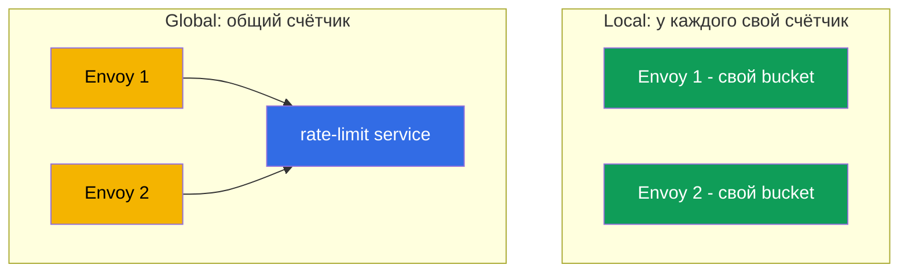
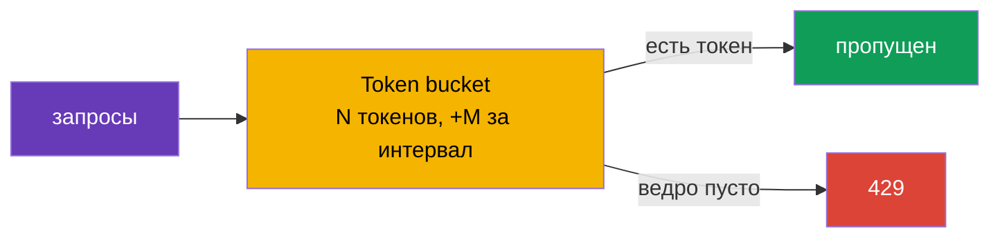

[Eng version](en.md) · [Versión en español](es.md) · [Version française](fr.md) · [Deutsche Version](de.md)

# Глава 20. Rate limiting: локальное ограничение запросов

> **Что дальше.** Продолжаем продвинутые сценарии. Rate limiting (ограничение частоты
> запросов) защищает сервисы от перегрузки, злоупотреблений и DoS. В этой главе
> разберём два подхода Istio: локальный (простой, каждый Envoy сам считает) и
> глобальный (общий счётчик через внешний сервис), и поймём, что когда выбирать.

## 20.1. Зачем нужен rate limiting

Даже здоровый сервис можно «завалить» слишком большим числом запросов: агрессивный
клиент, забагованный ретрай-цикл, парсер-бот или прямая DoS-атака. Rate limiting
ограничивает, сколько запросов разрешено за единицу времени, и лишние сразу отклоняет с
кодом `429 Too Many Requests`.

Важно не путать с circuit breaking из главы 8:

- **Circuit breaking** (`connectionPool`) ограничивает **одновременные** соединения и
  запросы - защита от насыщения в моменте.
- **Rate limiting** ограничивает **частоту** - число запросов за интервал времени
  (например, 100 запросов в минуту).

Это разные инструменты под разные задачи, часто их используют вместе.

## 20.2. Два подхода: local и global

В Istio есть два вида rate limiting.

- **Local rate limit** - каждый Envoy считает запросы **сам**, держа собственный счётчик.
  Просто, быстро, без внешних зависимостей. Но лимит действует на каждый прокси
  отдельно.
- **Global rate limit** - Envoy обращается к **внешнему** rate-limit-сервису с общим
  счётчиком. Даёт единый лимит на весь сервис независимо от числа реплик, но добавляет
  зависимость и задержку.



## 20.3. Local rate limit

В основе лежит алгоритм **token bucket** («ведро с токенами»): есть ведро на N токенов,
которое пополняется со скоростью M токенов за интервал. Каждый запрос забирает токен.
Есть токен - запрос проходит; ведро пусто - запрос получает `429`.



В Istio отдельного удобного CRD под local rate limit нет - его включают через
`EnvoyFilter`, подключая фильтр Envoy `local_ratelimit`. Ключевая часть конфигурации -
как раз параметры ведра (`token_bucket`). Полный ресурс для сервиса `ping-pong`:

```yaml
apiVersion: networking.istio.io/v1alpha3
kind: EnvoyFilter
metadata:
  name: local-ratelimit
  namespace: app
spec:
  workloadSelector:
    labels:
      app: ping-pong                  # к каким подам применяется
  configPatches:
  - applyTo: HTTP_FILTER
    match:
      context: SIDECAR_INBOUND        # ограничиваем входящий трафик к сервису
      listener:
        filterChain:
          filter:
            name: envoy.filters.network.http_connection_manager
    patch:
      operation: INSERT_BEFORE
      value:
        name: envoy.filters.http.local_ratelimit
        typed_config:
          "@type": type.googleapis.com/envoy.extensions.filters.http.local_ratelimit.v3.LocalRateLimit
          stat_prefix: http_local_rate_limiter
          token_bucket:
            max_tokens: 100           # размер ведра (максимальный всплеск)
            tokens_per_fill: 100      # сколько добавлять за интервал
            fill_interval: 60s        # интервал пополнения (100 запросов в минуту)
          filter_enabled:             # для какой доли трафика фильтр активен
            default_value: { numerator: 100, denominator: HUNDRED }
          filter_enforced:            # для какой доли реально отклонять (а не только считать)
            default_value: { numerator: 100, denominator: HUNDRED }
          response_headers_to_add:
          - append_action: OVERWRITE_IF_EXISTS_OR_ADD
            header: { key: x-local-rate-limited, value: "true" }
```

Обратите внимание на `filter_enabled` и `filter_enforced` - это те самые «ручки режима
наблюдения» (20.7): поставив `filter_enforced` в 0%, вы будете **только считать** превышения
(метрика `http_local_rate_limiter.rate_limited`), ничего не блокируя, а потом включите
отклонение.

Разберём физический смысл каждого параметра, потому что от них зависит и средняя
скорость, и допустимый всплеск (в манифесте они в snake_case - `max_tokens`,
`tokens_per_fill`, `fill_interval`; ниже для краткости пишем `maxTokens` и т.д.).

- **`maxTokens` - вместимость ведра, то есть максимальный всплеск (burst).** Больше этого
  числа токенов в ведре не накопится никогда, даже если трафика долго не было. Значит,
  это максимум запросов, которые можно пропустить «залпом» в один момент. Здесь 100 -
  за раз можно пропустить не больше 100 запросов.
- **`tokensPerFill` - сколько токенов добавляется за один интервал пополнения.**
- **`fillInterval` - как часто происходит пополнение.**

Вместе `tokensPerFill` и `fillInterval` задают **среднюю установившуюся скорость**:
`tokensPerFill / fillInterval`. В примере это 100 токенов за 60 секунд, то есть в
среднем ~100 запросов в минуту. `maxTokens` при этом отвечает за то, насколько
«рваным» может быть трафик вокруг этой средней.

Ключевое различие `maxTokens` и `tokensPerFill`:

- Если `maxTokens = tokensPerFill` (как выше, 100 и 100) - всплеск ограничен одной
  «порцией» пополнения. За период не пройдёт больше 100, и залпом тоже не больше 100.
- Если `maxTokens > tokensPerFill` - в тихие периоды неиспользованные токены копятся до
  `maxTokens`, и потом можно выдать больший всплеск. Например, `maxTokens: 300`,
  `tokensPerFill: 100`, `fillInterval: 60s`: средняя скорость всё те же ~100/мин, но
  после затишья клиент может «выстрелить» до 300 запросов разом, пока накопленные токены
  не кончатся.

Аналогия: ведро наполняется водой (токенами) с постоянной скоростью
(`tokensPerFill`/`fillInterval`), но не переполняется выше краёв (`maxTokens`). Каждый
запрос вычерпывает кружку; нет воды - запрос получает `429`. Хотите более «ровный»
трафик без больших залпов - делайте `fillInterval` маленьким (например, добавлять по 2
токена каждую секунду вместо 120 раз в минуту одним куском) и держите `maxTokens`
близким к `tokensPerFill`.

Важный нюанс: счётчик у **каждого Envoy свой**. Если у сервиса 3 реплики и на каждой
лимит 100 запросов в минуту, суммарно сервис пропустит до 300 - потому что клиенты
распределяются по репликам, и каждая считает независимо. Это нормально для грубой защиты
отдельного инстанса, но не даёт точного лимита на весь сервис.

## 20.4. Global rate limit

Когда нужен **единый лимит на весь сервис** независимо от числа реплик, используют
global rate limit. Здесь Envoy на каждый запрос спрашивает у внешнего
**rate-limit-сервиса** (обычно это эталонная реализация Envoy Rate Limit Service + Redis
для общего счётчика): «можно ещё?». Сервис ведёт общий счётчик и отвечает разрешить или
отклонить.

Плюсы: точный лимит на весь сервис, гибкие правила (по пользователю, по API-ключу, по
пути). Минусы: нужен и работает дополнительный сервис (и хранилище счётчиков), а каждый
запрос идёт лишний сетевой вызов к нему - это зависимость и небольшая задержка.

## 20.5. Ограничение по признаку (per-IP, per-header)

Rate limit не обязан быть «одним ведром на весь сервис». Можно ограничивать **по
признаку**: например, не больше 10 запросов в секунду **с одного IP**, или свой лимит на
каждый API-ключ, путь или пользователя. За это отвечают **дескрипторы** (descriptors) -
ключи, по значениям которых ведётся отдельный счётчик.

Типичные признаки для ограничения:

- **IP клиента** (`remote_address`) - классическое «10 rps с одного IP» против ботов;
- **заголовок** - например, `x-api-key` или `x-user-id` (лимит на клиента/тенанта);
- **путь или метод** - жёстче лимит на «тяжёлый» или дорогой эндпоинт.

Как это ложится на два подхода:

- **Global rate limit** создан ровно для этого. Вы описываете правила по дескрипторам, а
  внешний rate-limit-сервис ведёт **отдельный общий счётчик на каждое значение** ключа.
  «10 rps на каждый IP» на весь сервис - это именно сюда: у каждого IP свой счётчик,
  общий для всех реплик.
- **Local rate limit** тоже умеет дескрипторы (отдельные ведра под ключи), но счётчик
  остаётся локальным для каждого Envoy. Для «per-IP на инстанс» годится, а для точного
  «per-IP на весь сервис» - нет, потому что один и тот же IP может попадать на разные
  реплики, и каждая считает его отдельно.

### Важная ловушка: реальный IP клиента

Если ограничиваете по IP, убедитесь, что Envoy видит **настоящий** IP клиента, а не
адрес балансировщика. За облачным LB весь трафик приходит как бы с одного адреса, и
наивный per-IP лимит превратится в общий лимит на всех. Как донести реальный клиентский
IP до шлюза - зависит от типа балансировщика (подробно разбирали в главе 14):

- за **ALB (L7)** он сам ставит `X-Forwarded-For`, достаточно задать `numTrustedProxies`
  в MeshConfig;
- за **NLB (L4)** заголовка `X-Forwarded-For` нет вовсе - реальный IP доносят через
  **Proxy Protocol v2** (аннотация на Service шлюза + listener-фильтр).

Без корректно донесённого клиентского IP лимит по IP работать не будет - он либо сработает
по адресу балансировщика (общий лимит на всех), либо не найдёт нужного значения.

## 20.6. Что выбрать

| | Local rate limit | Global rate limit |
|---|------------------|-------------------|
| Где счётчик | в каждом Envoy | во внешнем сервисе (общий) |
| Точность лимита | на реплику (суммарно = лимит × реплики) | единый на весь сервис |
| Зависимости | нет | rate-limit-сервис + хранилище (Redis) |
| Задержка | минимальная | +вызов к внешнему сервису |
| Сложность | ниже | выше |

Практическое правило:

- **Local** - для простой грубой защиты инстанса от перегрузки, когда точное число «на
  весь сервис» не критично. Начинайте с него - это дёшево и без зависимостей.
- **Global** - когда нужен точный общий лимит (например, «не больше 1000 запросов в
  минуту от одного API-ключа на весь сервис») и вы готовы держать rate-limit-сервис.

Частый разумный подход: local как первая линия на каждом прокси, а global - там, где
бизнес-правила требуют точного общего лимита.

## 20.7. Rate limiting и автоскейлинг (HPA/KEDA)

Rate limiting и горизонтальный автоскейлинг (HPA или KEDA) решают, на первый взгляд,
противоположные задачи: лимит **режет** лишний трафик, автоскейлинг **добавляет мощности**,
чтобы его обслужить. На практике они хорошо дополняют друг друга, но их надо согласовать -
иначе легко получить либо «лимит, который сам растёт и ничего не ограничивает», либо
«автоскейлер, который не реагирует на нагрузку».

**Ключевой факт: local-лимит масштабируется вместе с репликами.** Счётчик у каждого Envoy
свой, поэтому суммарная пропускная способность = `лимит на под × число реплик` (20.3). Это и
плюс, и подвох:

- **Плюс.** Если выставить per-pod лимит равным безопасной ёмкости **одного** пода, то при
  добавлении реплик общий потолок растёт сам - каждый инстанс защищён, а сервис в целом
  масштабируется. То есть local rate limit + автоскейлинг = «защита инстанса, растущая вместе
  с флотом».
- **Подвох.** Если вы хотели **жёсткий общий потолок** (например, «не больше 1000 rps на весь
  сервис»), local его не даст: автоскейлинг поднимет реплики и общий лимит уедет вверх. Для
  фиксированного общего лимита нужен **global** rate limit - он не зависит от числа реплик.

**Второй нюанс - на какой сигнал скейлить.** Отклонённые запросы (`429`) Envoy отбивает рано и
дёшево, они почти не грузят CPU приложения. Поэтому:

- Если автоскейлер смотрит на **CPU/память**, он **не увидит** отклонённую нагрузку и не
  добавит реплик - хотя спрос реальный. Это ок, если вы намеренно ставите потолок, но плохо,
  если хотели обслужить всплеск.
- Правильнее скейлить на **входящий спрос**: RPS до лимита или глубину очереди. Тут удобен
  **KEDA** - он умеет скейлить по метрикам Prometheus (в т.ч. по `istio_requests_total`) или по
  длине очереди (SQS/Kafka).

**Практический кейс: KEDA по метрике Istio + local rate limit.** Сервис `orders` за ingress
gateway. KEDA скейлит его по входящему RPS из метрик Istio, а local rate limit на каждом поде
защищает инстанс от перегрузки, пока реплики поднимаются (KEDA/HPA реагируют десятки секунд, а
ведро токенов - мгновенно).

```yaml
apiVersion: keda.sh/v1alpha1
kind: ScaledObject
metadata:
  name: orders
  namespace: app
spec:
  scaleTargetRef:
    name: orders                       # Deployment, который масштабируем
  minReplicaCount: 2
  maxReplicaCount: 20
  triggers:
  - type: prometheus
    metadata:
      serverAddress: http://prometheus.istio-system:9090
      # входящий RPS к orders по метрике Istio (глава 17)
      query: sum(rate(istio_requests_total{destination_service_name="orders"}[1m]))
      threshold: "50"                  # цель ~50 rps на реплику -> KEDA добавит поды
```

Логика связки:

1. Растёт RPS → KEDA видит это по `istio_requests_total` и **добавляет реплики** `orders`.
2. Пока новые поды стартуют, **local rate limit** на каждом поде не даёт перегрузить уже
   работающие инстансы (мгновенная защита от всплеска, которую автоскейлер не успевает дать).
3. Реплик стало больше → суммарный потолок local-лимита автоматически вырос → сервис держит
   больше трафика.
4. Спрос упал → KEDA убирает реплики, потолок опускается.

Рекомендации по согласованию:

- **Скейлите по спросу, а не по «успешным».** Триггер KEDA - входящий RPS/очередь, иначе
  отклонённая нагрузка (`429`) не вызовет масштабирование.
- **Per-pod local-лимит = безопасная ёмкость одного пода**, а не «общий потолок / реплики».
  Тогда лимит защищает инстанс, а общий рост даёт автоскейлер.
- **Жёсткий общий потолок - только global RLS** (он инвариантен к числу реплик); local для
  этого не подходит.
- **`429` как сигнал.** Всплеск отклонённых можно тоже завести в KEDA как триггер («упёрлись в
  лимит - добавь реплик») или хотя бы в алерты.
- **Учитывайте `maxReplicaCount`.** Он неявно задаёт максимальный суммарный local-лимит
  (`лимит × maxReplicas`); держите его в голове, чтобы автоскейлинг не «пробил» ёмкость
  зависимостей (БД и т.п.).

## 20.8. Best practices для прода

- **Сначала измерьте, потом ограничивайте.** Посмотрите реальный трафик по метрикам
  (глава 17): нормальный RPS и пики. Лимит ставьте выше пика с запасом. Лимит «наугад»
  либо не защищает, либо режет легитимных пользователей.
- **Начинайте в режиме наблюдения.** По возможности сначала только логируйте
  превышения, не блокируя, убедитесь в правильности порога, и лишь потом включайте
  отклонение.
- **Возвращайте корректный ответ.** `429` плюс заголовок `Retry-After`, чтобы клиент
  знал, когда повторить. Понятное тело ответа помогает интеграторам.
- **Разные лимиты для разных клиентов.** Через дескрипторы задавайте тиры (free и
  premium по API-ключу), а дорогие эндпоинты (логин, поиск, экспорт) защищайте жёстче.
- **Global RLS - критичная зависимость.** Обеспечьте HA самого rate-limit-сервиса и его
  хранилища (Redis), следите за задержкой вызовов. Заранее решите поведение при
  недоступности RLS: **fail-open** (пропускать, чтобы сбой RLS не положил сервис) - по
  умолчанию безопаснее, **fail-closed** - когда защита важнее доступности.
- **Стройте защиту слоями.** Грубый per-IP лимит на ingress gateway (периметр) +
  локальные лимиты на сервисах + circuit breaking (глава 8). Один rate limit не заменяет
  остальное. На AWS самый внешний слой удобно вынести ещё дальше - **AWS WAF rate-based
  rules** на CloudFront/ALB: они режут флуд и ботов **до** входа в кластер, разгружая mesh; а
  точные бизнес-лимиты (per-API-key, per-tenant) оставляют global RLS внутри mesh.
- **Согласуйте с ретраями.** Агрессивные ретраи клиентов (глава 8) сами создают нагрузку
  и упираются в лимит; настраивайте их совместно, чтобы не получить шторм повторов.
- **Мониторьте сработки.** Метрика отклонённых (`429`) - это сигнал и об атаке, и о
  слишком строгом лимите. Настройте алерты на всплески.
- **Тестируйте под нагрузкой.** Прогоняйте лимиты нагрузочным тестом (fortio, k6) в
  staging до прода.
- **Осторожно с EnvoyFilter.** Local rate limit живёт в `EnvoyFilter`, а он хрупок при
  апгрейдах Istio - фиксируйте и тестируйте после обновлений.

## 20.9. Итоги главы

- Rate limiting ограничивает **частоту** запросов и отклоняет лишние с кодом `429`;
  защищает от перегрузки, abuse и DoS.
- Это не то же, что circuit breaking (`connectionPool`): тот ограничивает
  **одновременные** соединения/запросы, а rate limiting - число за интервал времени.
- **Local rate limit**: token bucket в каждом Envoy, включается через `EnvoyFilter`,
  без внешних зависимостей; счётчик у каждой реплики свой.
- **Global rate limit**: общий счётчик во внешнем rate-limit-сервисе; точный лимит на
  весь сервис, но добавляет зависимость и задержку.
- Выбор: local для простой защиты инстанса, global для точного общего лимита; часто
  используют вместе.
- Можно ограничивать **по признаку** через дескрипторы (per-IP, per-header, per-path).
  Точный «10 rps с одного IP на весь сервис» - это global rate limit; для лимита по IP
  нужно, чтобы Envoy видел реальный IP клиента: за **ALB** через `numTrustedProxies`, за
  **NLB** через Proxy Protocol (глава 14).
- Local rate limit включают полным `EnvoyFilter` (`local_ratelimit`); `filter_enforced`
  позволяет запустить в режиме наблюдения (только считать), метрика
  `http_local_rate_limiter.rate_limited`.
- На AWS самый внешний слой (флуд, боты) удобно закрыть **AWS WAF rate-based rules** на
  CloudFront/ALB, а точные бизнес-лимиты держать в global RLS внутри mesh.
- С автоскейлингом (HPA/KEDA): суммарный **local**-лимит = `лимит × реплики`, то есть растёт
  вместе с флотом (per-pod лимит = ёмкость одного пода); жёсткий общий потолок даёт только
  **global**. Скейлить надо по **входящему спросу** (KEDA по `istio_requests_total`/очереди), а
  не по CPU, иначе отклонённая (`429`) нагрузка не вызовет масштабирование.
- Прод-практики: ставить лимит по метрикам реального трафика (выше пика), начинать в
  режиме наблюдения, возвращать `429` + `Retry-After`, обеспечить HA global RLS и решить
  fail-open/fail-closed, строить защиту слоями, мониторить сработки, тестировать под
  нагрузкой.

## 20.10. Вопросы для самопроверки

1. Чем rate limiting отличается от circuit breaking из главы 8?
2. Как работает алгоритм token bucket?
3. Почему при local rate limit суммарный лимит сервиса равен лимиту, умноженному на
   число реплик?
4. Когда нужен global rate limit и какова его цена?
5. Какой подход выбрать для простой защиты инстанса, а какой - для точного общего лимита?
6. Как ограничить «10 rps с одного IP»? Почему для этого нужен global rate limit и как
   донести реальный IP клиента за **ALB** и за **NLB**?
7. Что такое fail-open и fail-closed при недоступности rate-limit-сервиса и что выбрать?
8. Почему лимит стоит подбирать по метрикам и начинать в режиме наблюдения?
9. Как запустить local rate limit в режиме наблюдения (только считать, не блокировать)?
10. Где в защите слоями место AWS WAF rate-based rules, а где - global RLS внутри mesh?
11. Как local rate limit ведёт себя при автоскейлинге (HPA/KEDA) и почему для жёсткого общего
    потолка нужен global? На какой сигнал правильно скейлить и почему не на CPU?

## Практика

Отработайте локальное ограничение запросов через `EnvoyFilter` (token bucket):

🧪 Лаба 17: [tasks/ica/labs/17](../../labs/17/README_RU.MD)

---
[Оглавление](../README.md) · [Глава 19](../19/ru.md) · [Глава 21](../21/ru.md)
