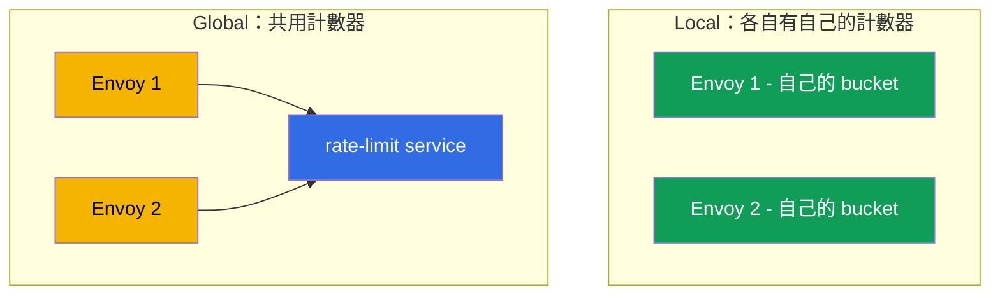
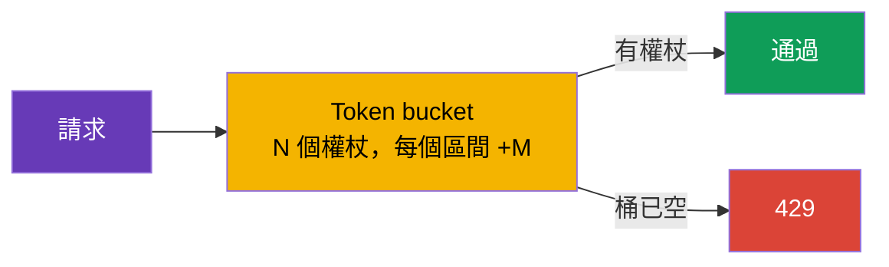

[Русская версия](ru.md) · [Eng version](en.md) · [Versión en español](es.md) · [Version française](fr.md) · [Deutsche Version](de.md) · [ქართული ვერსია](ge.md) · [日本語版](jp.md)

# 第 20 章。Rate limiting：本機請求限制

> **接下來。** 我們繼續進階情境。Rate limiting（請求頻率限制）可保護服務免於過載、濫用與 DoS。本章將探討 Istio 的兩種方法：本機（簡單，由每個 Envoy 自行計數）與全域（透過外部服務使用共用計數器），並了解該在何時選擇哪一種。

## 20.1. 為何需要 rate limiting

即使是健康的服務，也可能因請求數量過大而「被壓垮」：激進的用戶端、有 bug 的重試迴圈、解析機器人，或直接的 DoS 攻擊。Rate limiting 會限制每個時間單位可允許的請求數，並立即以 `429 Too Many Requests` 拒絕多餘請求。

請勿將它與第 8 章的 circuit breaking 混淆：

- **Circuit breaking** (`connectionPool`) 限制**同時進行的**連線與請求--即時防止飽和。
- **Rate limiting** 限制**頻率**--每個時間區間內的請求數（例如，每分鐘 100 個請求）。

這是針對不同問題的不同工具，經常會一起使用。

## 20.2. 兩種方法：local 與 global

Istio 有兩種類型的 rate limiting。

- **Local rate limit**--每個 Envoy 都會**自行**計算請求，並保有自己的計數器。簡單、快速、沒有外部相依性。但限制會個別套用到每個 proxy。
- **Global rate limit**--Envoy 會呼叫具有共用計數器的**外部** rate-limit 服務。無論副本數量為何，都能為整個服務提供單一限制，但會增加相依性與延遲。



## 20.3. Local rate limit

其核心是 **token bucket**（「權杖桶」）演算法：有一個可容納 N 個權杖的桶，並以每個區間 M 個權杖的速度補充。每個請求會取走一個權杖。有權杖--請求通過；桶空了--請求得到 `429`。



Istio 沒有專門易用的 local rate limit CRD--要透過 `EnvoyFilter` 啟用，並接入 Envoy 的 `local_ratelimit` 篩選器。設定的關鍵部分正是桶的參數（`token_bucket`）。以下是服務 `ping-pong` 的完整資源：

```yaml
apiVersion: networking.istio.io/v1alpha3
kind: EnvoyFilter
metadata:
  name: local-ratelimit
  namespace: app
spec:
  workloadSelector:
    labels:
      app: ping-pong                  # 套用至哪些 pod
  configPatches:
  - applyTo: HTTP_FILTER
    match:
      context: SIDECAR_INBOUND        # 限制流向服務的入站流量
      listener:
        filterChain:
          filter:
            name: envoy.filters.network.http_connection_manager
    patch:
      operation: INSERT_BEFORE
      value:
        name: envoy.filters.http.local_ratelimit
        typed_config:
          "@type": type.googleapis.com/envoy.extensions.filters.http.local_ratelimit.v3.LocalRateLimit
          stat_prefix: http_local_rate_limiter
          token_bucket:
            max_tokens: 100           # 桶的大小（最大突發量）
            tokens_per_fill: 100      # 每個間隔補充多少
            fill_interval: 60s        # 補充間隔（每分鐘 100 個請求）
          filter_enabled:             # filter 對多少比例的流量生效
            default_value: { numerator: 100, denominator: HUNDRED }
          filter_enforced:            # 對多少比例實際拒絕（而非僅計數）
            default_value: { numerator: 100, denominator: HUNDRED }
          response_headers_to_add:
          - append_action: OVERWRITE_IF_EXISTS_OR_ADD
            header: { key: x-local-rate-limited, value: "true" }
```

請注意 `filter_enabled` 與 `filter_enforced`--這正是「觀察模式的控制項」（20.7）：將 `filter_enforced` 設為 0%，您將**只會計算**超限情況（指標 `http_local_rate_limiter.rate_limited`），不會封鎖任何內容，之後再啟用拒絕。

讓我們分析每個參數的實際意義，因為平均速率與允許的突發量都取決於它們（manifest 中使用 snake_case--`max_tokens`、`tokens_per_fill`、`fill_interval`；以下為簡潔起見使用 `maxTokens` 等）。

- **`maxTokens`--桶的容量，也就是最大突發量（burst）。** 桶中的權杖數絕不會累積超過這個數字，即使長時間沒有流量也一樣。因此，這是單一時間點以「齊射」方式可放行請求的最大數量。此處為 100--一次最多可放行 100 個請求。
- **`tokensPerFill`--每次補充區間新增的權杖數。**
- **`fillInterval`--補充發生的頻率。**

`tokensPerFill` 與 `fillInterval` 共同決定**平均穩態速率**：`tokensPerFill / fillInterval`。在此範例中，是 60 秒內 100 個權杖，即平均每分鐘約 100 個請求。`maxTokens` 則決定該平均值周圍的流量可以有多「不均勻」。

`maxTokens` 與 `tokensPerFill` 的關鍵差異：

- 若 `maxTokens = tokensPerFill`（如上方，100 與 100），突發量會受限於一次補充的「份量」。每個週期不會通過超過 100 個請求，齊射時也不會超過 100 個。
- 若 `maxTokens > tokensPerFill`，未使用的權杖會在安靜期間累積到 `maxTokens`，之後便可釋出更大的突發量。例如，`maxTokens: 300`、`tokensPerFill: 100`、`fillInterval: 60s`：平均速率仍是約 100/分鐘，但在一段平靜期後，用戶端可一次「發射」多達 300 個請求，直到累積的權杖耗盡。

可以這樣類比：桶以固定速率填入水（權杖）（`tokensPerFill`/`fillInterval`），但不會溢過桶緣（`maxTokens`）。每個請求舀走一杯；沒有水時，請求便得到 `429`。若您需要沒有大規模齊射的更「平順」流量，請將 `fillInterval` 設小（例如，每秒補 2 個權杖，而非每分鐘一次補 120 個），並讓 `maxTokens` 接近 `tokensPerFill`。

一項重要細節：**每個 Envoy 都有自己的**計數器。如果服務有 3 個副本，每個的限制是每分鐘 100 個請求，則服務總計最多可通過 300 個請求--因為用戶端分散到各個副本，而每個副本獨立計數。這適合對個別執行個體做粗略保護，但無法為整個服務提供精確限制。

## 20.4. Global rate limit

當需要不受副本數量影響、**整個服務共用的單一限制**時，便使用 global rate limit。此時 Envoy 會針對每個請求詢問外部的 **rate-limit 服務**（通常是 Envoy Rate Limit Service 的參考實作加上 Redis 作為共用計數器）：「還可以嗎？」該服務維護共用計數器，並回覆允許或拒絕。

優點：整個服務的精確限制、彈性的規則（依使用者、API 金鑰、路徑）。缺點：需要且依賴額外的服務（以及計數器儲存區），並且每個請求都會多一次對它的網路呼叫--這帶來相依性與些微延遲。

## 20.5. 依特徵限制（per-IP、per-header）

Rate limit 不一定要是「整個服務共用的一個桶」。您可以**依特徵**限制：例如，**單一 IP** 每秒不超過 10 個請求，或為每個 API 金鑰、路徑或使用者設定各自的限制。這由 **descriptors**（描述元）負責--依其值維護獨立計數器的鍵。

常見的限制特徵：

- **用戶端 IP**（`remote_address`）--針對機器人的經典「單一 IP 10 rps」；
- **標頭**--例如 `x-api-key` 或 `x-user-id`（每個用戶端／租戶的限制）；
- **路徑或方法**--對「高負載」或昂貴端點設定更嚴格限制。

這如何對應到兩種方法：

- **Global rate limit** 正是為此設計。您依描述元定義規則，外部 rate-limit 服務會針對每個鍵的**每一個值維護獨立的共用計數器**。整個服務範圍內「每個 IP 10 rps」就應使用它：每個 IP 有自己的計數器，並由所有副本共用。
- **Local rate limit** 也支援描述元（依鍵設定獨立的桶），但計數器仍是每個 Envoy 的本機計數器。它適用於「每個執行個體的 per-IP」，但不適用精確的「整個服務的 per-IP」，因為相同 IP 可能被導向不同副本，而每個副本都會分別計數。

### 重要陷阱：真實用戶端 IP

若依 IP 限制，請確認 Envoy 看到的是用戶端的**真實** IP，而非負載平衡器的位址。在雲端 LB 後方，所有流量看起來都來自同一個位址，天真的 per-IP 限制就會變成所有人共用的限制。如何將真實用戶端 IP 傳至 gateway，取決於負載平衡器類型（第 14 章已有詳細說明）：

- 在 **ALB（L7）** 後方，它會自行設定 `X-Forwarded-For`，只要在 MeshConfig 中設定 `numTrustedProxies` 即可；
- 在 **NLB（L4）** 後方，完全沒有 `X-Forwarded-For` 標頭--真實 IP 透過 **Proxy Protocol v2** 傳遞（gateway 的 Service 上的 annotation + listener filter）。

若未正確傳遞用戶端 IP，基於 IP 的限制將無法運作--它要麼會依負載平衡器位址套用（所有人共用的限制），要麼找不到所需值。

## 20.6. 該選哪一個

| | Local rate limit | Global rate limit |
|---|------------------|-------------------|
| 計數器位置 | 每個 Envoy 中 | 外部服務中（共用） |
| 限制精確性 | 每個副本（總數 = 限制 × 副本） | 整個服務單一限制 |
| 相依性 | 無 | rate-limit 服務 + 儲存區（Redis） |
| 延遲 | 最低 | + 呼叫外部服務 |
| 複雜度 | 較低 | 較高 |

實務規則：

- **Local**--用於簡單、粗略地保護執行個體不受過載影響，且「整個服務」的精確數字不重要時。請從它開始--成本低且沒有相依性。
- **Global**--當需要精確的共用限制（例如，「整個服務中每個 API 金鑰每分鐘最多 1000 個請求」），且您願意維護 rate-limit 服務時。

常見且合理的方法是：每個 proxy 上用 local 作為第一道防線，而在商業規則需要精確共用限制的地方使用 global。

## 20.7. Rate limiting 與自動擴展（HPA/KEDA）

Rate limiting 與水平自動擴展（HPA 或 KEDA）看似解決相反的問題：限制會**切除**多餘流量，自動擴展則會**增加容量**以處理流量。實務上它們相輔相成，但必須協調--否則很容易得到「自行增長且不限制任何東西的限制」，或是「不會對負載反應的 autoscaler」。

**關鍵事實：local 限制會隨副本一起擴展。** 每個 Envoy 都有自己的計數器，因此總吞吐能力 = `每個 pod 的限制 × 副本數`（20.3）。這既是優點，也是陷阱：

- **優點。** 若將每個 pod 的限制設為**單一** pod 的安全容量，新增副本時整體上限會自行成長--每個執行個體受到保護，而整個服務會隨之擴展。也就是 local rate limit + 自動擴展 =「隨機群一同成長的執行個體保護」。
- **陷阱。** 若您需要**硬性的整體上限**（例如，「整個服務不超過 1000 rps」），local 無法提供：自動擴展會增加副本，整體限制便隨之提高。固定的整體限制需要 **global** rate limit--它不依賴副本數量。

**第二個細節：應依什麼訊號擴展。** Envoy 很早且低成本地拒絕請求（`429`），它們幾乎不會增加應用程式 CPU 負載。因此：

- 若 autoscaler 觀察 **CPU/記憶體**，它**看不見**被拒絕的負載，因此不會新增副本--即使需求是真實的。若您刻意設定上限，這沒有問題；但若您想處理突發流量，則不理想。
- 更正確的作法是依**進入的需求**擴展：限制前的 RPS 或佇列深度。**KEDA** 很適合此處--它可依 Prometheus 指標（包括 `istio_requests_total`）或佇列長度（SQS/Kafka）擴展。

**實務案例：依 Istio 指標的 KEDA + local rate limit。** 服務 `orders` 位於 ingress gateway 後方。KEDA 依 Istio 指標中的進入 RPS 對其進行擴展，而每個 pod 上的 local rate limit 可在副本啟動期間保護執行個體不致過載（KEDA/HPA 需數十秒反應，但權杖桶立即生效）。

```yaml
apiVersion: keda.sh/v1alpha1
kind: ScaledObject
metadata:
  name: orders
  namespace: app
spec:
  scaleTargetRef:
    name: orders                       # 要擴縮的 Deployment
  minReplicaCount: 2
  maxReplicaCount: 20
  triggers:
  - type: prometheus
    metadata:
      serverAddress: http://prometheus.istio-system:9090
      # 依 Istio metric 計算流向 orders 的入站 RPS（第 17 章）
      query: sum(rate(istio_requests_total{destination_service_name="orders"}[1m]))
      threshold: "50"                  # 目標每複本約 50 rps -> KEDA 會新增 pod
```

此組合的邏輯：

1. RPS 增加 → KEDA 透過 `istio_requests_total` 看見它，並**新增副本** `orders`。
2. 在新 pod 啟動時，每個 pod 上的 **local rate limit** 不會讓已在執行的執行個體過載（autoscaler 來不及提供的即時突發保護）。
3. 副本變多 → local 限制的總上限自動提高 → 服務可承受更多流量。
4. 需求下降 → KEDA 移除副本，上限下降。

協調建議：

- **依需求而非「成功請求」擴展。** KEDA trigger 應為進入 RPS／佇列，否則被拒絕的負載（`429`）不會觸發擴展。
- **每個 pod 的 local 限制 = 單一 pod 的安全容量**，而非「整體上限／副本數」。如此限制可保護執行個體，整體成長則交由 autoscaler。
- **硬性的整體上限只能使用 global RLS**（它不隨副本數變動）；local 不適合此目的。
- **`429` 作為訊號。** 被拒絕請求的突發也可作為 KEDA trigger（「已達限制--新增副本」），或至少設為 alert。
- **請考量 `maxReplicaCount`。** 它隱含決定 local 限制的最大總額（`限制 × maxReplicas`）；請牢記這一點，避免自動擴展「突破」相依系統（資料庫等）的容量。

## 20.8. 生產環境最佳實務

- **先量測，再限制。** 透過指標檢視實際流量（第 17 章）：正常 RPS 與尖峰。設定的限制應高於尖峰並留有餘裕。隨意設定的限制不是無法保護，就是會切掉合法使用者。
- **從觀察模式開始。** 盡可能先只記錄超限情況而不封鎖，確認閾值正確後才啟用拒絕。
- **回傳正確回應。** 使用 `429` 加上 `Retry-After` 標頭，讓用戶端知道何時重試。清楚的回應主體可協助整合者。
- **為不同用戶端設定不同限制。** 透過描述元依 API 金鑰設定 tier（free 與 premium），並更嚴格保護昂貴端點（登入、搜尋、匯出）。
- **Global RLS 是關鍵相依性。** 確保 rate-limit 服務本身及其儲存區（Redis）的 HA，並監控呼叫延遲。請事先決定 RLS 無法使用時的行為：**fail-open**（放行，以免 RLS 故障使服務停擺）--預設情況較安全；**fail-closed**--當保護比可用性更重要時。
- **分層建構防護。** 在 ingress gateway（邊界）設置粗略的 per-IP 限制 + 服務上的本機限制 + circuit breaking（第 8 章）。單一 rate limit 不能取代其他防護。在 AWS 上，最外層還可放得更遠--於 CloudFront/ALB 上使用 **AWS WAF rate-based rules**：它們在流量進入叢集**之前**便切除洪水流量與機器人，減輕 mesh 負擔；而精確的商業限制（per-API-key、per-tenant）則保留給 mesh 內的 global RLS。
- **與重試協調。** 用戶端的激進重試（第 8 章）本身會造成負載並觸及限制；請共同設定它們，避免產生重試風暴。
- **監控觸發情況。** 被拒絕的指標（`429`）同時是攻擊與限制過嚴的訊號。設定針對突發的 alert。
- **在負載下測試。** 上線前，先在 staging 以負載測試（fortio、k6）驗證限制。
- **謹慎使用 EnvoyFilter。** Local rate limit 位於 `EnvoyFilter` 中，而它在 Istio 升級時很脆弱--升級後請固定並測試。

## 20.9. 本章總結

- Rate limiting 限制請求的**頻率**，並以 `429` 拒絕多餘請求；可防護過載、濫用與 DoS。
- 它不同於 circuit breaking（`connectionPool`）：後者限制**同時進行的**連線／請求，而 rate limiting 限制每個時間區間內的數量。
- **Local rate limit**：每個 Envoy 中的 token bucket，透過 `EnvoyFilter` 啟用，沒有外部相依性；每個副本都有自己的計數器。
- **Global rate limit**：外部 rate-limit 服務中的共用計數器；整個服務有精確限制，但增加相依性與延遲。
- 選擇：local 用於簡單的執行個體保護，global 用於精確的共用限制；兩者經常搭配使用。
- 可透過描述元依**特徵**限制（per-IP、per-header、per-path）。精確的「整個服務中單一 IP 10 rps」應使用 global rate limit；若要依 IP 限制，Envoy 必須看見真實用戶端 IP：在 **ALB** 後方透過 `numTrustedProxies`，在 **NLB** 後方透過 Proxy Protocol（第 14 章）。
- Local rate limit 透過完整的 `EnvoyFilter`（`local_ratelimit`）啟用；`filter_enforced` 可用於觀察模式（只計數），指標為 `http_local_rate_limiter.rate_limited`。
- 在 AWS 上，最外層（洪水流量、機器人）可透過 CloudFront/ALB 上的 **AWS WAF rate-based rules** 防護，而精確的商業限制則保留在 mesh 內的 global RLS。
- 與自動擴展（HPA/KEDA）一起使用時：總 **local** 限制 = `限制 × 副本`，亦即隨機群一同成長（每個 pod 的限制 = 單一 pod 的容量）；只有 **global** 提供硬性的整體上限。應依**進入的需求**擴展（KEDA 依 `istio_requests_total`／佇列），而不是 CPU，否則被拒絕的（`429`）負載不會觸發擴展。
- 生產實務：依實際流量指標設定限制（高於尖峰）、從觀察模式開始、回傳 `429` + `Retry-After`、確保 global RLS 的 HA 並決定 fail-open/fail-closed、分層建構防護、監控觸發情況，以及在負載下測試。

## 20.10. 自我檢核問題

1. Rate limiting 與第 8 章的 circuit breaking 有何不同？
2. Token bucket 演算法如何運作？
3. 為何在 local rate limit 下，服務的總限制等於限制乘以副本數？
4. 何時需要 global rate limit，其代價為何？
5. 對簡單的執行個體保護該選哪種方法，而精確的共用限制又該選哪種？
6. 如何限制「單一 IP 10 rps」？為何需要 global rate limit，以及如何在 **ALB** 與 **NLB** 後方傳遞真實用戶端 IP？
7. Rate-limit 服務不可用時，fail-open 與 fail-closed 是什麼，該選哪一個？
8. 為何應依指標選擇限制，並從觀察模式開始？
9. 如何以觀察模式（只計數、不封鎖）執行 local rate limit？
10. 在分層防護中，AWS WAF rate-based rules 應位於何處，而 mesh 內的 global RLS 又應位於何處？
11. Local rate limit 在自動擴展（HPA/KEDA）時如何運作，為何硬性的整體上限需要 global？應依哪個訊號正確擴展，為何不是 CPU？

## 實作

透過 `EnvoyFilter`（token bucket）練習本機請求限制：

🧪 實驗 17：[tasks/ica/labs/17](../../labs/17/README_TW.MD)

---
[目錄](../README_TW.md) · [第 19 章](../19/tw.md) · [第 21 章](../21/tw.md)