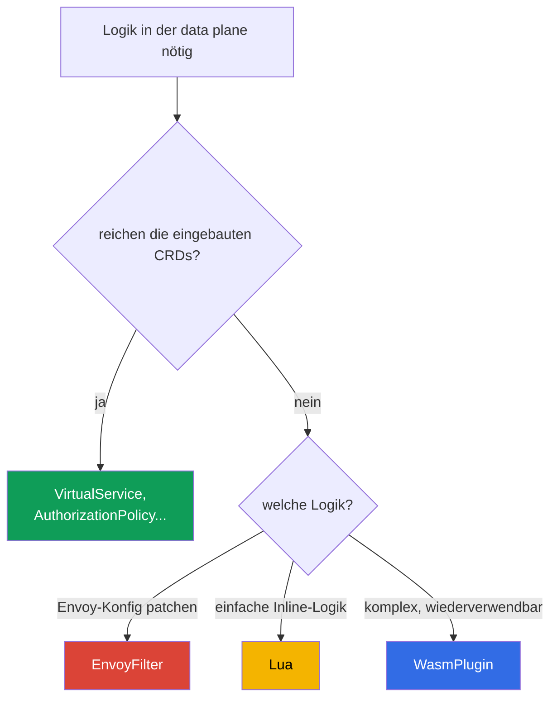

[RU version](ru.md) · [Eng version](en.md) · [Versión en español](es.md) · [Version française](fr.md)

# Kapitel 21. Erweiterung der data plane: EnvoyFilter, Lua und WasmPlugin

> **Was kommt als Nächstes.** Die eingebauten Istio-Ressourcen (VirtualService,
> AuthorizationPolicy, Telemetry usw.) reichen für die meisten Aufgaben aus. Aber manchmal
> braucht man eigene Logik direkt in der data plane - etwas, das es als CRD nicht gibt. In
> diesem Kapitel betrachten wir drei Wege, Envoy zu erweitern: EnvoyFilter (Konfigurations-Patch),
> Lua (Inline-Skript) und WasmPlugin (WebAssembly) - und verstehen, was wann anzuwenden ist.

## 21.1. Wann eine Erweiterung nötig ist

Zuerst ein ehrlicher Hinweis: **suchen Sie zuerst nach einer fertigen Lösung**. Die meisten
Aufgaben lassen sich mit Standardressourcen lösen - Routing, Sicherheit, Telemetrie, Rate
Limiting. Erweiterungen sind nötig, wenn das Standardangebot nicht ausreicht:

- Header nach nicht standardmäßiger Logik hinzufügen oder umschreiben;
- eine eigene Prüfung/Autorisierung umsetzen, die es in AuthorizationPolicy nicht gibt;
- ein Envoy-Feature aktivieren, für das Istio kein eigenes CRD hat;
- eigene Logik auf Proxy-Ebene einbetten (zum Beispiel eine besondere Verarbeitung von Anfragen).

## 21.2. Drei Wege der Erweiterung



- **EnvoyFilter** - patcht direkt die Envoy-Konfiguration. Maximale Macht und maximales Risiko.
- **Lua** - ein kleines Skript direkt in der Konfiguration (wird über EnvoyFilter eingebunden).
  Gut für einfache Logik.
- **WasmPlugin** - ein vollwertiges WebAssembly-Modul, das Envoy zur Laufzeit lädt. Für
  komplexe und wiederverwendbare Logik.

## 21.3. EnvoyFilter

`EnvoyFilter` erlaubt es, punktuelle Änderungen direkt an der Envoy-Konfiguration vorzunehmen,
die istiod generiert: Filter hinzufügen, listeners, routes, clusters ändern. Das ist der
„Schraubenzieher für Envoys Innenleben“ - fast alles ist möglich.

Genau über EnvoyFilter wird, wie wir in Kapitel 20 gesehen haben, das Local Rate Limit
aktiviert - ein eigenes CRD dafür gibt es nicht.

Der Hauptnachteil ist die **Fragilität**. EnvoyFilter verweist über Namen und Positionen auf
interne Strukturen der Envoy-Konfiguration. Bei einem Update von Istio oder Envoy können sich
diese Strukturen ändern, und Ihr EnvoyFilter hört still auf zu funktionieren oder zerstört die
Konfiguration. Deshalb gilt er als Werkzeug der letzten Hoffnung: Wenn sich eine Aufgabe mit
einem Standard-CRD lösen lässt - lösen Sie sie damit.

## 21.4. Lua

Wenn **einfache Logik** benötigt wird (einen Header ansehen/hinzufügen, eine Anfrage nach
Bedingung ablehnen), muss man nicht unbedingt ein eigenes Modul schreiben - man kann ein
**Lua**-Skript direkt über EnvoyFilter in die Konfiguration einfügen. Envoy führt es bei jeder
Anfrage aus.

Beispiel aus Lab 27: Lua fügt der Antwort einen Header hinzu und blockiert eine Anfrage mit
einem bestimmten Header.

```lua
-- Header zur Antwort hinzufügen
function envoy_on_response(handle)
  handle:headers():add("x-lua-lab", "hello-from-lua")
end

-- Anfrage mit Header x-block: yes blockieren
function envoy_on_request(handle)
  if handle:headers():get("x-block") == "yes" then
    handle:respond({[":status"] = "403"}, "blocked by lua")
  end
end
```

Der `.lua`-Code allein wird nirgendwo eingebunden - er wird von `EnvoyFilter` injiziert, indem
der Filter `envoy.filters.http.lua` in den passenden listener eingefügt wird. Die vollständige
Ressource, die das obige Skript auf den `ping-pong`-Pods aktiviert:

```yaml
apiVersion: networking.istio.io/v1alpha3
kind: EnvoyFilter
metadata:
  name: lua-headers
  namespace: app
spec:
  workloadSelector:
    labels:
      app: ping-pong
  configPatches:
  - applyTo: HTTP_FILTER
    match:
      context: SIDECAR_INBOUND
      listener:
        filterChain:
          filter:
            name: envoy.filters.network.http_connection_manager
    patch:
      operation: INSERT_BEFORE          # vor dem eigentlichen Routing
      value:
        name: envoy.filters.http.lua
        typed_config:
          "@type": type.googleapis.com/envoy.extensions.filters.http.lua.v3.Lua
          inlineCode: |
            function envoy_on_response(handle)
              handle:headers():add("x-lua-lab", "hello-from-lua")
            end
            function envoy_on_request(handle)
              if handle:headers():get("x-block") == "yes" then
                handle:respond({[":status"] = "403"}, "blocked by lua")
              end
            end
```

Lua eignet sich gut für schnelle Kleinigkeiten: Manipulationen an Headern, einfache Prüfungen.
Aber es wird ebenfalls über EnvoyFilter eingebunden (mit all seinen Risiken) und ist nicht für
schwere Logik oder externe Aufrufe gedacht - dafür gibt es Wasm.

## 21.5. WasmPlugin

Für echte benutzerdefinierte Logik gibt es **WebAssembly (Wasm)**. Sie schreiben ein Modul (in
Go, Rust, C++, AssemblyScript) oder nehmen ein fertiges, und Envoy **lädt es zur Laufzeit** -
ohne den Proxy neu zu bauen. Gesteuert wird das über die eigene Ressource `WasmPlugin`.

```yaml
apiVersion: extensions.istio.io/v1alpha1
kind: WasmPlugin
metadata:
  name: basic-auth
  namespace: istio-system
spec:
  selector:
    matchLabels:
      istio: ingressgateway
  url: oci://ghcr.io/my-org/basic-auth:1.0    # Modul aus der OCI-Registry
  phase: AUTHN                                # wann in der Kette ausführen (siehe unten)
  pluginConfig:                               # Konfig, die das Modul selbst erhält
    users:
      alice: "$2y$10$..."                     # Beispiel: Login -> bcrypt-Hash des Passworts
```

Zwei wichtige Felder:

- **`pluginConfig`** - eine beliebige Konfiguration, die Envoy beim Laden **in** das Modul
  übergibt. Ein und dasselbe Modul (zum Beispiel `basic_auth`) wird mit den Daten von hier
  konfiguriert - ohne Neubau. Ohne `pluginConfig` sind die meisten Module nutzlos.
- **`phase`** - zu welchem Zeitpunkt in der Filterkette das Modul ausgeführt wird: `AUTHN` (vor
  der Authentifizierung), `AUTHZ` (nach der Authentifizierung, vor der Autorisierung), `STATS`
  (ganz am Ende) oder der Standardwert. Die Reihenfolge mehrerer Plugins in derselben Phase wird
  über das Feld `priority` festgelegt.

Zentrale Vorteile von Wasm:

- **Jede Sprache und jede Komplexität.** Das Modul ist vollwertiger Code, kein Skript.
- **Dynamisches Laden.** Das Modul wird aus einer OCI-Registry gezogen (wie ein normales Image)
  und zur Laufzeit in Envoy geladen, ohne Neubau und ohne EnvoyFilter.
- **Isolation (Sandbox).** Wasm läuft in einer Sandbox: Ein Fehler im Modul legt nicht den
  ganzen Envoy lahm.
- **Stabile Schnittstelle (Proxy-Wasm ABI).** Das Modul kommuniziert mit Envoy über einen
  stabilen Vertrag, weshalb es gegenüber Upgrades weit robuster ist als EnvoyFilter.
- **Wiederverwendbarkeit.** Ein Modul in der Registry lässt sich in verschiedenen clustern und
  Projekten einbinden.

Nachteile: Ein Wasm-Modul zu schreiben und zu bauen ist aufwändiger als ein Lua-Skript; es gibt
einen kleinen Ausführungs-Overhead. Deshalb ist Wasm für „einen einzelnen Header hinzufügen“
überzogen - es ist für echte Logik gedacht.

In Lab 23 binden Sie ein fertiges Community-Modul `basic_auth` am ingress gateway ein - das ist
ein typisches Szenario: ein vorhandenes Wasm-Modul nehmen und es über `WasmPlugin` aktivieren.

## 21.6. Was wählen

| | EnvoyFilter | Lua | WasmPlugin |
|---|-------------|-----|------------|
| Was es ist | Patch der Envoy-Konfiguration | Inline-Skript | WebAssembly-Modul |
| Logik-Komplexität | Konfig, keine Logik | einfach | beliebig |
| Sprache | - | Lua | Go, Rust, C++, ... |
| Laden | Teil der Konfig | Teil der Konfig | aus OCI-Registry, zur Laufzeit |
| Robustheit gegenüber Upgrades | niedrig | mittel | hoch (stabiles ABI) |
| Wann | Envoy-Feature ohne CRD | schnelle Kleinigkeit mit Headern | komplexe, wiederverwendbare Logik |

Praktische Prioritätsregel:

1. **Zuerst Standard-CRDs** - lässt sich die Aufgabe damit lösen, sind keine Erweiterungen nötig.
2. **Lua** - für einfache Inline-Logik (Header, kleine Prüfungen).
3. **WasmPlugin** - für komplexe oder wiederverwendbare Logik.
4. **EnvoyFilter** - letzte Hoffnung: wenn ein Envoy-Feature gebraucht wird, das es weder als
   CRD noch anderweitig gibt. Denken Sie an die Fragilität bei Upgrades.

## 21.7. Betrieb: Overhead, Prüfung, troubleshooting

Erweiterungen laufen auf dem **heißen Pfad** jeder Anfrage, deshalb kann man sie nicht „einmal
aufsetzen und vergessen“. Wir betrachten, was sie an Ressourcen kosten, wie man sicherstellt,
dass alles in Ordnung ist, und wie man repariert, wenn nicht.

### Ressourcen-Overhead

- **Lua** wird bei **jeder Anfrage** innerhalb von Envoy ausgeführt. Eine einfache Operation
  (einen Header hinzufügen) - Bruchteile von Mikrosekunden, unmerklich. Aber schwere Logik oder
  Aufrufe in Lua fügen spürbare Latenz und CPU des Proxys hinzu - auf dem Hot Path ist das
  gefährlich.
- **Wasm** wird ebenfalls bei jeder Anfrage ausgeführt und belegt zusätzlich Speicher in jedem
  Envoy (das Modul wird in jeden Proxy geladen, in dem es aktiviert ist). Meist langsamer als
  native Filter, aber in einer Sandbox. Der Overhead hängt stark vom Modul ab.
- **EnvoyFilter** kostet, wenn er nur die Konfig ändert (zum Beispiel einen fertigen Filter wie
  Local Rate Limit aktiviert), an sich fast nichts - Sie zahlen für die Arbeit des Filters, den
  er hinzugefügt hat.

Die Hauptregel: **messen Sie davor und danach**. Beobachten Sie Latenz (p50/p99), CPU und
Speicher des Containers istio-proxy auf den Pods mit der Erweiterung. Verlassen Sie sich nicht
auf „scheint zu funktionieren“.

### Wie man prüft, dass alles in Ordnung ist

Nach dem Anwenden einer Erweiterung gehen Sie die Checkliste durch:

- **Konfig ist angekommen:** `istioctl proxy-status` - alle Proxys `SYNCED`, ohne Fehler.
- **Filter ist wirklich aufgetaucht:** `istioctl proxy-config listeners <pod>` (oder `routes`) -
  Ihr Filter/Ihre Logik ist in der Konfiguration des richtigen listener vorhanden.
- **Analyzer:** `istioctl analyze` - keine neuen Warnungen.
- **Funktional:** Anfrage geht durch, Header ist hinzugefügt, Blockade greift - genau das,
  wofür es gemacht wurde.
- **Metriken:** Latenz ist nicht gestiegen, kein Anstieg von `5xx`, CPU/Speicher des Proxys im
  Normbereich.

### Troubleshooting

Typische Probleme und wohin man schaut:

- **Nichts hat sich geändert (Filter wurde nicht angewendet).** Häufige Ursache - ein falscher
  `match` im EnvoyFilter (context, listener-Name oder `applyTo` passen nicht). Prüfen Sie
  `istioctl proxy-config` - ist Ihr Filter im Dump vorhanden; sehen Sie in den istiod-Logs nach
  Anwendungsfehlern.
- **Wasm-Modul wurde nicht geladen.** Prüfen Sie `url` (ist die OCI-Registry erreichbar), die
  istio-proxy-Logs auf Download-Fehler des Wasm, die Korrektheit von `phase`. Eine private
  Registry erfordert Pull-Zugriff.
- **Benachbarter Traffic ist kaputtgegangen.** Meist nach einem Upgrade von Istio/Envoy:
  EnvoyFilter verweist auf geänderte interne Strukturen. Gleichen Sie mit den Release Notes ab,
  aktualisieren Sie den Filter.
- **Tiefe Envoy-Fehlersuche.** Heben Sie das Log-Level des Proxys an
  (`istioctl proxy-config log <pod> --level debug`) und sehen Sie den Konfigurations-Dump über
  die admin API an (`pilot-agent request GET config_dump`).

### Best Practices für die Produktion

- **Rollen Sie eng aus.** Setzen Sie immer einen `selector` auf einen konkreten workload oder
  gateway, nicht auf das ganze mesh - so ist der Wirkungsradius kleiner und der Overhead nur
  dort, wo er gebraucht wird.
- **Versionieren und reviewen.** Erweiterungen sind Code auf dem heißen Pfad; halten Sie sie in
  Git und lassen Sie sie reviewen wie normalen Code.
- **Wasm aus der eigenen Registry mit Versions-Pinning.** Ziehen Sie Module nicht per `latest`
  aus fremden Registries: Nutzen Sie eine private OCI-Registry (auf AWS ist das **Amazon ECR** -
  Wasm liegt dort als normales OCI-Artefakt, Pull-Zugriff über IAM/IRSA), fixieren Sie die
  Version per Digest, prüfen Sie die Supply Chain (Scan, Signatur).
- **Legen Sie keine schwere Logik in Lua auf den Hot Path.** Für ernsthafte Logik - Wasm.
- **Regressionstest nach jedem Istio-Upgrade.** Besonders für EnvoyFilter - er geht still
  kaputt.
- **Halten Sie einen Rollback-Plan bereit.** Eine Erweiterung ist eine eigene Ressource;
  stellen Sie sicher, dass ihr Löschen das Verhalten sicher zurückführt, und beherrschen Sie das
  schnell.

## 21.8. Zusammenfassung des Kapitels

- Lösen Sie die Aufgabe zuerst mit Standard-CRDs; Erweiterungen - wenn diese nicht ausreichen.
- **EnvoyFilter** patcht die Envoy-Konfiguration direkt: sehr mächtig, aber fragil bei Upgrades
  von Istio/Envoy - Werkzeug der letzten Hoffnung.
- **Lua** - einfaches Inline-Skript (über EnvoyFilter) für kleine Logik mit Headern und einfache
  Prüfungen.
- **WasmPlugin** - vollwertiges WebAssembly-Modul: jede Sprache, dynamisches Laden aus einer
  OCI-Registry (auf AWS - ECR), Sandbox, stabiles ABI (robust gegenüber Upgrades),
  Wiederverwendbarkeit. Konfiguriert über `pluginConfig`, Reihenfolge über `phase`/`priority`.
- Lua und jeder andere Envoy-Filter werden über einen vollständigen `EnvoyFilter` eingebunden
  (`applyTo: HTTP_FILTER`, `envoy.filters.http.*`); das `.lua`-Skript allein funktioniert ohne
  Hülle nicht.
- Auswahlpriorität: Standard-CRDs -> Lua (Kleinigkeit) -> Wasm (Komplexes) -> EnvoyFilter
  (Extremfall).
- Erweiterungen laufen auf dem heißen Pfad: Lua und Wasm kosten CPU/Speicher bei jeder Anfrage -
  messen Sie Latenz und Ressourcen davor und danach.
- Prüfen Sie nach einer Änderung: `proxy-status` (SYNCED), `proxy-config` (Filter ist da),
  `analyze`, Funktionstests, Metriken. Rollen Sie eng aus (selector), versionieren Sie, halten
  Sie einen Rollback-Plan bereit, Regressionstest nach Upgrades.

## 21.9. Fragen zur Selbstüberprüfung

1. Warum sind Erweiterungen ein letztes Mittel und nicht das erste Werkzeug?
2. Worin ist EnvoyFilter mächtig und warum ist er fragil bei Upgrades?
3. Für welche Aufgaben eignet sich Lua und für welche nicht?
4. Nennen Sie die zentralen Vorteile von WasmPlugin gegenüber EnvoyFilter.
5. In welcher Prioritätsreihenfolge wählt man den Weg der Erweiterung?
6. Welchen Overhead fügen Lua und Wasm hinzu und wie schätzt man ihn ein?
7. Wie prüft man, dass eine Erweiterung angewendet wurde und nichts kaputtgemacht hat? Wohin
   schaut man beim troubleshooting, wenn der Filter nicht gegriffen hat oder Wasm nicht geladen
   wurde?
8. Wie gelangt ein Lua-Skript in Envoy (welche Ressource injiziert es)?
9. Wozu braucht man in WasmPlugin `pluginConfig` und `phase`? Woher nimmt man das Wasm-Modul auf
   AWS?

## Praxis

Üben Sie benutzerdefinierte Logik über EnvoyFilter + Lua (Header und Blockade einer Anfrage):

🧪 Lab 27: [tasks/ica/labs/27](../../labs/27/README_DE.MD)

Üben Sie das Einbinden eines Wasm-Moduls über WasmPlugin:

🧪 Lab 23: [tasks/ica/labs/23](../../labs/23/README_DE.MD)

---
[Inhaltsverzeichnis](../README_DE.md) · [Kapitel 20](../20/de.md) · [Kapitel 22](../22/de.md)
