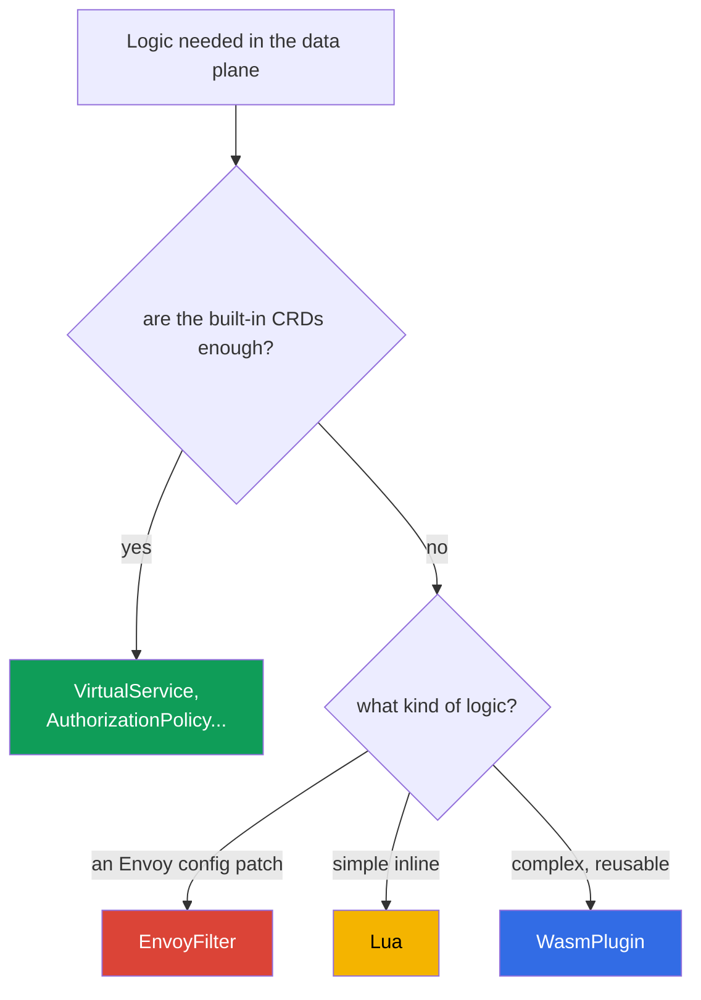

[RU version](ru.md)

# Chapter 21. Extending the data plane: EnvoyFilter, Lua and WasmPlugin

> **What's next.** Istio's built-in resources (VirtualService, AuthorizationPolicy, Telemetry,
> etc.) are enough for most tasks. But sometimes you need your own logic right in the data plane -
> something that is not in the CRDs. In this chapter we look at three ways to extend Envoy:
> EnvoyFilter (a config patch), Lua (an inline script) and WasmPlugin (WebAssembly) - and work out
> what to use when.

## 21.1. When an extension is needed

First an honest disclaimer: **look for something ready-made first**. Most tasks are solved by the
standard resources - routing, security, telemetry, rate limiting. Extensions are needed when the
standard is not enough:

- add or rewrite headers by non-standard logic;
- implement a custom check/authorization that is not in AuthorizationPolicy;
- enable an Envoy feature for which Istio has no dedicated CRD;
- embed your own logic at the proxy level (for example, special request handling).

## 21.2. Three ways to extend



- **EnvoyFilter** - directly patches Envoy's configuration. Maximum power and maximum risk.
- **Lua** - a small script right in the configuration (plugged in via EnvoyFilter). Good for simple
  logic.
- **WasmPlugin** - a full-fledged WebAssembly module that Envoy loads at runtime. For complex and
  reusable logic.

## 21.3. EnvoyFilter

`EnvoyFilter` lets you make pointed changes right in the Envoy configuration that istiod generates:
add filters, change listeners, routes, clusters. It is a "screwdriver for Envoy's internals" - you
can do almost anything.

It is precisely via EnvoyFilter that, as we saw in chapter 20, a local rate limit is enabled -
there is no dedicated CRD for it.

The main downside is **fragility**. EnvoyFilter references Envoy's internal configuration structures
by names and positions. On an Istio or Envoy upgrade these structures may change, and your
EnvoyFilter will silently stop working or break the config. So it is considered a tool of last
resort: if a task can be solved with a standard CRD - solve it with that.

## 21.4. Lua

If you need **simple logic** (inspect/add a header, reject a request by a condition), you do not
have to write a separate module - you can insert a **Lua** script right into the configuration via
EnvoyFilter. Envoy runs it on each request.

An example from lab 27: Lua adds a header to the response and blocks a request with a certain
header.

```lua
-- add a header to the response
function envoy_on_response(handle)
  handle:headers():add("x-lua-lab", "hello-from-lua")
end

-- block a request with the header x-block: yes
function envoy_on_request(handle)
  if handle:headers():get("x-block") == "yes" then
    handle:respond({[":status"] = "403"}, "blocked by lua")
  end
end
```

The `.lua` code by itself is not plugged in anywhere - it is injected by an `EnvoyFilter`, which
adds the `envoy.filters.http.lua` filter to the needed listener. The full resource that enables the
script above on the `ping-pong` pods:

```yaml
apiVersion: networking.istio.io/v1alpha3
kind: EnvoyFilter
metadata:
  name: lua-headers
  namespace: app
spec:
  workloadSelector:
    labels:
      app: ping-pong
  configPatches:
  - applyTo: HTTP_FILTER
    match:
      context: SIDECAR_INBOUND
      listener:
        filterChain:
          filter:
            name: envoy.filters.network.http_connection_manager
    patch:
      operation: INSERT_BEFORE          # before the main routing
      value:
        name: envoy.filters.http.lua
        typed_config:
          "@type": type.googleapis.com/envoy.extensions.filters.http.lua.v3.Lua
          inlineCode: |
            function envoy_on_response(handle)
              handle:headers():add("x-lua-lab", "hello-from-lua")
            end
            function envoy_on_request(handle)
              if handle:headers():get("x-block") == "yes" then
                handle:respond({[":status"] = "403"}, "blocked by lua")
              end
            end
```

Lua is good for quick trifles: header manipulation, simple checks. But it too is plugged in via
EnvoyFilter (with all its risks) and is not meant for heavy logic or external calls - Wasm is for
that.

## 21.5. WasmPlugin

For real custom logic there is **WebAssembly (Wasm)**. You write a module (in Go, Rust, C++,
AssemblyScript) or take a ready one, and Envoy **loads it at runtime** - without rebuilding the
proxy. This is managed by a separate `WasmPlugin` resource.

```yaml
apiVersion: extensions.istio.io/v1alpha1
kind: WasmPlugin
metadata:
  name: basic-auth
  namespace: istio-system
spec:
  selector:
    matchLabels:
      istio: ingressgateway
  url: oci://ghcr.io/my-org/basic-auth:1.0    # the module from an OCI registry
  phase: AUTHN                                # when in the chain to run (see below)
  pluginConfig:                               # the config the module itself receives
    users:
      alice: "$2y$10$..."                     # example: login -> the password's bcrypt hash
```

Two important fields:

- **`pluginConfig`** - arbitrary configuration that Envoy passes **into** the module on load. The
  same module (for example, `basic_auth`) is configured with the data from here - without
  rebuilding. Without `pluginConfig` most modules are useless.
- **`phase`** - at which moment of the filter chain to run the module: `AUTHN` (before
  authentication), `AUTHZ` (after authentication, before authorization), `STATS` (at the very end)
  or the default value. The order of several plugins in one phase is set by the `priority` field.

The key advantages of Wasm:

- **Any language and any complexity.** The module is full-fledged code, not a script.
- **Dynamic loading.** The module is pulled from an OCI registry (like an ordinary image) and loaded
  into Envoy on the fly, without a rebuild and without EnvoyFilter.
- **Isolation (sandbox).** Wasm runs in a sandbox: an error in the module does not take down the
  whole Envoy.
- **A stable interface (the Proxy-Wasm ABI).** The module talks to Envoy through a stable contract,
  so it is much more resilient to upgrades than EnvoyFilter.
- **Reusability.** One module in a registry can be plugged into different clusters and projects.

The downsides: writing and building a Wasm module is harder than a Lua script; there is a small
execution overhead. So for "add one header" Wasm is overkill - it is for real logic.

In lab 23 you will plug in the ready community module `basic_auth` on the ingress gateway - this is
a typical scenario: take an existing Wasm module and enable it via `WasmPlugin`.

## 21.6. What to choose

| | EnvoyFilter | Lua | WasmPlugin |
|---|-------------|-----|------------|
| What it is | an Envoy config patch | an inline script | a WebAssembly module |
| Logic complexity | config, not logic | simple | any |
| Language | - | Lua | Go, Rust, C++, ... |
| Loading | part of the config | part of the config | from an OCI registry, at runtime |
| Upgrade resilience | low | medium | high (a stable ABI) |
| When | an Envoy feature without a CRD | a quick trifle with headers | complex reusable logic |

The practical priority rule:

1. **The standard CRDs first** - if the task is solved with them, extensions are not needed.
2. **Lua** - for simple inline logic (headers, small checks).
3. **WasmPlugin** - for complex or reusable logic.
4. **EnvoyFilter** - the last resort: when you need an Envoy feature that is not in a CRD or
   otherwise available. Remember the fragility on upgrades.

## 21.7. Operations: overhead, verification, troubleshooting

Extensions work on the **hot path** of every request, so you cannot "set and forget" them. Let us go
through what they cost in resources, how to make sure everything is fine, and how to fix it if not.

### Resource overhead

- **Lua** runs on **every request** inside Envoy. A simple operation (adding a header) is fractions
  of a microsecond, unnoticeable. But heavy logic or calls in Lua add noticeable latency and proxy
  CPU - on the hot path this is dangerous.
- **Wasm** also runs on every request and additionally occupies memory in every Envoy (the module is
  loaded into each proxy where it is enabled). It is usually slower than native filters, but
  sandboxed. The overhead depends heavily on the module.
- **EnvoyFilter**, if it simply changes the config (for example, enables a ready filter like a local
  rate limit), costs almost nothing by itself - you pay for the work of the filter it added.

The main rule: **measure before and after**. Look at the latency (p50/p99), the CPU and memory of
the istio-proxy container on the pods with the extension. Do not rely on "seems to work".

### How to check that everything is fine

After applying the extension, go through a checklist:

- **The config arrived:** `istioctl proxy-status` - all proxies are `SYNCED`, no errors.
- **The filter actually appeared:** `istioctl proxy-config listeners <pod>` (or `routes`) - your
  filter/logic is present in the config of the needed listener.
- **The analyzer:** `istioctl analyze` - no new warnings.
- **Functionally:** the request passes, the header is added, the blocking works - what you did it
  for.
- **Metrics:** the latency did not grow, there is no `5xx` spike, the proxy's CPU/memory is normal.

### Troubleshooting

Typical problems and where to look:

- **Nothing changed (the filter did not apply).** A common cause is a wrong `match` in the
  EnvoyFilter (the context, the listener name or `applyTo` did not match). Check `istioctl
  proxy-config` - is your filter in the dump; look at istiod's logs for application errors.
- **The Wasm module did not load.** Check the `url` (is the OCI registry reachable), the istio-proxy
  logs for Wasm download errors, the correctness of `phase`. A private registry requires pull
  access.
- **Neighboring traffic broke.** Usually after an Istio/Envoy upgrade: the EnvoyFilter references
  changed internal structures. Check the release notes, update the filter.
- **Deep Envoy debugging.** Raise the proxy's log level (`istioctl proxy-config log <pod> --level
  debug`) and look at the config dump via the admin API (`pilot-agent request GET config_dump`).

### Best practices for production

- **Roll out narrowly.** Always put a `selector` on a specific workload or gateway, not on the whole
  mesh - the blast radius is smaller, and the overhead is only where it is needed.
- **Version and review.** Extensions are code on the hot path; keep them in Git and go through
  review, like ordinary code.
- **Wasm from your own registry with version pinning.** Do not pull modules by `latest` from foreign
  registries: use a private OCI registry (on AWS this is **Amazon ECR** - Wasm lives there as an
  ordinary OCI artifact, pull access via IAM/IRSA), pin the version by digest, check the supply
  chain (scan, signature).
- **Do not put heavy logic in Lua on the hot path.** For serious logic - Wasm.
- **A regression test after every Istio upgrade.** Especially for EnvoyFilter - it breaks silently.
- **Keep a rollback plan.** An extension is a separate resource; make sure that removing it safely
  returns the behavior back, and know how to do it quickly.

## 21.8. Chapter summary

- Solve the task with standard CRDs first; extensions are for when they are not enough.
- **EnvoyFilter** patches the Envoy configuration directly: very powerful, but fragile on
  Istio/Envoy upgrades - a tool of last resort.
- **Lua** - a simple inline script (via EnvoyFilter) for small header logic and simple checks.
- **WasmPlugin** - a full-fledged WebAssembly module: any language, dynamic loading from an OCI
  registry (on AWS - ECR), a sandbox, a stable ABI (resilient to upgrades), reusability. Configured
  via `pluginConfig`, the order via `phase`/`priority`.
- Lua and any other Envoy filter are plugged in with a full `EnvoyFilter` (`applyTo: HTTP_FILTER`,
  `envoy.filters.http.*`); the `.lua` script by itself does not work without the wrapper.
- The choice priority: standard CRDs -> Lua (a trifle) -> Wasm (something complex) -> EnvoyFilter (an
  extreme case).
- Extensions work on the hot path: Lua and Wasm cost CPU/memory on every request - measure the
  latency and resources before and after.
- After a change, verify: `proxy-status` (SYNCED), `proxy-config` (the filter is in place),
  `analyze`, functional tests, metrics. Roll out narrowly (selector), version, keep a rollback plan,
  a regression test after upgrades.

## 21.9. Self-check questions

1. Why are extensions a last resort, not the first tool?
2. What makes EnvoyFilter powerful and why is it fragile on upgrades?
3. What tasks is Lua suitable for, and for what is it not?
4. Name the key advantages of WasmPlugin over EnvoyFilter.
5. In what priority order do you choose the extension method?
6. What overhead do Lua and Wasm add and how do you assess it?
7. How do you check that an extension applied and did not break anything? Where do you look during
   troubleshooting if the filter did not trigger or Wasm did not load?
8. How does a Lua script get into Envoy (what resource injects it)?
9. Why are `pluginConfig` and `phase` needed in a WasmPlugin? Where is a Wasm module taken from on
   AWS?

## Practice

Practice custom logic via EnvoyFilter + Lua (a header and blocking a request):

🧪 Lab 27: [tasks/ica/labs/27](../../labs/27/README.MD)

Practice plugging in a Wasm module via WasmPlugin:

🧪 Lab 23: [tasks/ica/labs/23](../../labs/23/README.MD)

---
[Contents](../README.md) · [Chapter 20](../20/en.md) · [Chapter 22](../22/en.md)
