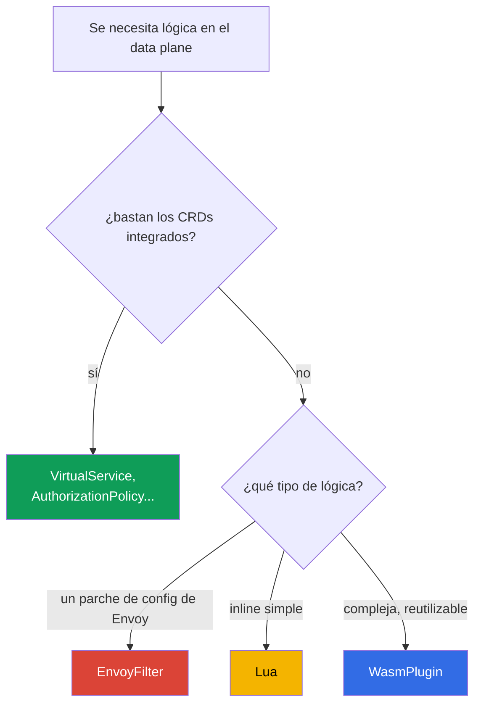

[RU version](ru.md) · [Eng version](en.md)

# Capítulo 21. Extender el data plane: EnvoyFilter, Lua y WasmPlugin

> **Qué sigue.** Los recursos integrados de Istio (VirtualService, AuthorizationPolicy, Telemetry,
> etc.) bastan para la mayoría de las tareas. Pero a veces necesitas tu propia lógica justo en el data
> plane, algo que no está en los CRDs. En este capítulo vemos tres formas de extender Envoy:
> EnvoyFilter (un parche de config), Lua (un script inline) y WasmPlugin (WebAssembly), y aclaramos
> qué usar en cada caso.

## 21.1. Cuándo se necesita una extensión

Primero un aviso honesto: **busca primero algo ya hecho**. La mayoría de las tareas se resuelven con
los recursos estándar: enrutamiento, seguridad, telemetría, rate limiting. Las extensiones se
necesitan cuando el estándar no basta:

- añadir o reescribir cabeceras con una lógica no estándar;
- implementar una comprobación/autorización personalizada que no está en AuthorizationPolicy;
- habilitar una función de Envoy para la que Istio no tiene un CRD dedicado;
- incrustar tu propia lógica a nivel del proxy (por ejemplo, un manejo especial de peticiones).

## 21.2. Tres formas de extender



- **EnvoyFilter**: parchea directamente la configuración de Envoy. Máximo poder y máximo riesgo.
- **Lua**: un pequeño script justo en la configuración (enchufado vía EnvoyFilter). Bueno para lógica
  simple.
- **WasmPlugin**: un módulo WebAssembly completo que Envoy carga en tiempo de ejecución. Para lógica
  compleja y reutilizable.

## 21.3. EnvoyFilter

`EnvoyFilter` permite hacer cambios puntuales justo en la configuración de Envoy que istiod genera:
añadir filtros, cambiar listeners, rutas, clusters. Es un "destornillador para las tripas de Envoy":
puedes hacer casi cualquier cosa.

Es precisamente vía EnvoyFilter que, como vimos en el capítulo 20, se habilita un local rate limit: no
hay un CRD dedicado para ello.

El principal inconveniente es la **fragilidad**. EnvoyFilter referencia las estructuras internas de
configuración de Envoy por nombres y posiciones. En una actualización de Istio o Envoy estas
estructuras pueden cambiar, y tu EnvoyFilter dejará de funcionar silenciosamente o romperá la config.
Por eso se considera una herramienta de último recurso: si una tarea se puede resolver con un CRD
estándar, resuélvela con eso.

## 21.4. Lua

Si necesitas **lógica simple** (inspeccionar/añadir una cabecera, rechazar una petición por una
condición), no tienes que escribir un módulo aparte: puedes insertar un script **Lua** justo en la
configuración vía EnvoyFilter. Envoy lo ejecuta en cada petición.

Un ejemplo del laboratorio 27: Lua añade una cabecera a la respuesta y bloquea una petición con una
cierta cabecera.

```lua
-- añadir una cabecera a la respuesta
function envoy_on_response(handle)
  handle:headers():add("x-lua-lab", "hello-from-lua")
end

-- bloquear una petición con la cabecera x-block: yes
function envoy_on_request(handle)
  if handle:headers():get("x-block") == "yes" then
    handle:respond({[":status"] = "403"}, "blocked by lua")
  end
end
```

El código `.lua` por sí solo no se enchufa en ningún sitio: lo inyecta un `EnvoyFilter`, que añade el
filtro `envoy.filters.http.lua` al listener necesario. El recurso completo que habilita el script de
arriba en los pods `ping-pong`:

```yaml
apiVersion: networking.istio.io/v1alpha3
kind: EnvoyFilter
metadata:
  name: lua-headers
  namespace: app
spec:
  workloadSelector:
    labels:
      app: ping-pong
  configPatches:
  - applyTo: HTTP_FILTER
    match:
      context: SIDECAR_INBOUND
      listener:
        filterChain:
          filter:
            name: envoy.filters.network.http_connection_manager
    patch:
      operation: INSERT_BEFORE          # antes del enrutamiento principal
      value:
        name: envoy.filters.http.lua
        typed_config:
          "@type": type.googleapis.com/envoy.extensions.filters.http.lua.v3.Lua
          inlineCode: |
            function envoy_on_response(handle)
              handle:headers():add("x-lua-lab", "hello-from-lua")
            end
            function envoy_on_request(handle)
              if handle:headers():get("x-block") == "yes" then
                handle:respond({[":status"] = "403"}, "blocked by lua")
              end
            end
```

Lua es bueno para pequeñeces rápidas: manipulación de cabeceras, comprobaciones simples. Pero también
se enchufa vía EnvoyFilter (con todos sus riesgos) y no está pensado para lógica pesada ni llamadas
externas: para eso está Wasm.

## 21.5. WasmPlugin

Para una lógica personalizada de verdad está **WebAssembly (Wasm)**. Escribes un módulo (en Go, Rust,
C++, AssemblyScript) o tomas uno ya hecho, y Envoy lo **carga en tiempo de ejecución**, sin
recompilar el proxy. Esto lo gestiona un recurso `WasmPlugin` aparte.

```yaml
apiVersion: extensions.istio.io/v1alpha1
kind: WasmPlugin
metadata:
  name: basic-auth
  namespace: istio-system
spec:
  selector:
    matchLabels:
      istio: ingressgateway
  url: oci://ghcr.io/my-org/basic-auth:1.0    # el módulo desde un registry OCI
  phase: AUTHN                                # cuándo ejecutar en la cadena (ver abajo)
  pluginConfig:                               # la config que recibe el propio módulo
    users:
      alice: "$2y$10$..."                     # ejemplo: login -> el hash bcrypt de la contraseña
```

Dos campos importantes:

- **`pluginConfig`**: configuración arbitraria que Envoy pasa **al** módulo al cargarlo. El mismo
  módulo (por ejemplo, `basic_auth`) se configura con los datos de aquí, sin recompilar. Sin
  `pluginConfig` la mayoría de los módulos son inútiles.
- **`phase`**: en qué momento de la cadena de filtros ejecutar el módulo: `AUTHN` (antes de la
  autenticación), `AUTHZ` (tras la autenticación, antes de la autorización), `STATS` (al final del
  todo) o el valor por defecto. El orden de varios plugins en una misma fase lo fija el campo
  `priority`.

Las ventajas clave de Wasm:

- **Cualquier lenguaje y cualquier complejidad.** El módulo es código completo, no un script.
- **Carga dinámica.** El módulo se descarga de un registry OCI (como una imagen ordinaria) y se carga
  en Envoy al vuelo, sin recompilar y sin EnvoyFilter.
- **Aislamiento (sandbox).** Wasm corre en un sandbox: un error en el módulo no tumba todo Envoy.
- **Una interfaz estable (el Proxy-Wasm ABI).** El módulo habla con Envoy a través de un contrato
  estable, así que es mucho más resistente a las actualizaciones que EnvoyFilter.
- **Reutilización.** Un módulo en un registry se puede enchufar en distintos clústeres y proyectos.

Los inconvenientes: escribir y compilar un módulo Wasm es más difícil que un script Lua; hay un
pequeño overhead de ejecución. Así que para "añadir una cabecera" Wasm es excesivo: es para lógica de
verdad.

En el laboratorio 23 enchufarás el módulo comunitario ya hecho `basic_auth` en el ingress gateway:
este es un escenario típico: tomar un módulo Wasm existente y habilitarlo vía `WasmPlugin`.

## 21.6. Qué elegir

| | EnvoyFilter | Lua | WasmPlugin |
|---|-------------|-----|------------|
| Qué es | un parche de config de Envoy | un script inline | un módulo WebAssembly |
| Complejidad de la lógica | config, no lógica | simple | cualquiera |
| Lenguaje | - | Lua | Go, Rust, C++, ... |
| Carga | parte de la config | parte de la config | desde un registry OCI, en tiempo de ejecución |
| Resistencia a actualizaciones | baja | media | alta (un ABI estable) |
| Cuándo | una función de Envoy sin CRD | una pequeñez rápida con cabeceras | lógica compleja reutilizable |

La regla práctica de prioridad:

1. **Los CRDs estándar primero**: si la tarea se resuelve con ellos, las extensiones no son
   necesarias.
2. **Lua**: para lógica inline simple (cabeceras, comprobaciones pequeñas).
3. **WasmPlugin**: para lógica compleja o reutilizable.
4. **EnvoyFilter**: el último recurso: cuando necesitas una función de Envoy que no está en un CRD ni
   disponible de otro modo. Recuerda la fragilidad en las actualizaciones.

## 21.7. Operación: overhead, verificación, troubleshooting

Las extensiones funcionan en el **camino caliente** de cada petición, así que no puedes "ponerlas y
olvidarlas". Repasemos qué cuestan en recursos, cómo asegurarse de que todo va bien, y cómo arreglarlo
si no.

### Overhead de recursos

- **Lua** corre en **cada petición** dentro de Envoy. Una operación simple (añadir una cabecera) son
  fracciones de microsegundo, imperceptible. Pero lógica pesada o llamadas en Lua añaden latencia y CPU
  del proxy notables: en el camino caliente esto es peligroso.
- **Wasm** también corre en cada petición y adicionalmente ocupa memoria en cada Envoy (el módulo se
  carga en cada proxy donde está habilitado). Suele ser más lento que los filtros nativos, pero está en
  sandbox. El overhead depende mucho del módulo.
- **EnvoyFilter**, si simplemente cambia la config (por ejemplo, habilita un filtro ya hecho como un
  local rate limit), casi no cuesta nada por sí mismo: pagas por el trabajo del filtro que añadió.

La regla principal: **mide antes y después**. Mira la latencia (p50/p99), la CPU y la memoria del
contenedor istio-proxy en los pods con la extensión. No te fíes de "parece que funciona".

### Cómo comprobar que todo va bien

Tras aplicar la extensión, sigue una checklist:

- **La config llegó:** `istioctl proxy-status`: todos los proxies están `SYNCED`, sin errores.
- **El filtro realmente apareció:** `istioctl proxy-config listeners <pod>` (o `routes`): tu
  filtro/lógica está presente en la config del listener necesario.
- **El analizador:** `istioctl analyze`: sin nuevas advertencias.
- **Funcionalmente:** la petición pasa, la cabecera se añade, el bloqueo funciona: aquello para lo que
  lo hiciste.
- **Métricas:** la latencia no creció, no hay pico de `5xx`, la CPU/memoria del proxy es normal.

### Troubleshooting

Problemas típicos y dónde mirar:

- **Nada cambió (el filtro no se aplicó).** Una causa común es un `match` erróneo en el EnvoyFilter (el
  contexto, el nombre del listener o `applyTo` no coincidieron). Comprueba `istioctl proxy-config`: ¿está
  tu filtro en el volcado?; mira los logs de istiod por errores de aplicación.
- **El módulo Wasm no se cargó.** Comprueba la `url` (¿es accesible el registry OCI?), los logs de
  istio-proxy por errores de descarga de Wasm, la corrección de `phase`. Un registry privado requiere
  acceso de pull.
- **El tráfico vecino se rompió.** Normalmente tras una actualización de Istio/Envoy: el EnvoyFilter
  referencia estructuras internas que cambiaron. Comprueba las release notes, actualiza el filtro.
- **Depuración profunda de Envoy.** Sube el nivel de log del proxy (`istioctl proxy-config log <pod>
  --level debug`) y mira el volcado de config vía la admin API (`pilot-agent request GET config_dump`).

### Buenas prácticas para producción

- **Despliega de forma estrecha.** Pon siempre un `selector` sobre una carga de trabajo o gateway
  concreto, no sobre toda la malla: el radio de impacto es menor, y el overhead solo está donde se
  necesita.
- **Versiona y revisa.** Las extensiones son código en el camino caliente; mantenlas en Git y pásalas
  por revisión, como código ordinario.
- **Wasm desde tu propio registry con la versión fijada.** No descargues módulos por `latest` desde
  registries ajenos: usa un registry OCI privado (en AWS este es **Amazon ECR**: Wasm vive ahí como un
  artefacto OCI ordinario, acceso de pull vía IAM/IRSA), fija la versión por digest, comprueba la cadena
  de suministro (escaneo, firma).
- **No pongas lógica pesada en Lua en el camino caliente.** Para lógica seria, Wasm.
- **Una prueba de regresión tras cada actualización de Istio.** Especialmente para EnvoyFilter: se rompe
  silenciosamente.
- **Ten un plan de rollback.** Una extensión es un recurso aparte; asegúrate de que quitarlo devuelve el
  comportamiento de forma segura, y sabe cómo hacerlo rápido.

## 21.8. Resumen del capítulo

- Resuelve la tarea con CRDs estándar primero; las extensiones son para cuando no bastan.
- **EnvoyFilter** parchea la configuración de Envoy directamente: muy potente, pero frágil en las
  actualizaciones de Istio/Envoy: una herramienta de último recurso.
- **Lua**: un script inline simple (vía EnvoyFilter) para lógica pequeña de cabeceras y comprobaciones
  simples.
- **WasmPlugin**: un módulo WebAssembly completo: cualquier lenguaje, carga dinámica desde un registry
  OCI (en AWS, ECR), un sandbox, un ABI estable (resistente a actualizaciones), reutilización. Se
  configura vía `pluginConfig`, el orden vía `phase`/`priority`.
- Lua y cualquier otro filtro de Envoy se enchufan con un `EnvoyFilter` completo (`applyTo:
  HTTP_FILTER`, `envoy.filters.http.*`); el script `.lua` por sí solo no funciona sin el envoltorio.
- La prioridad de elección: CRDs estándar -> Lua (una pequeñez) -> Wasm (algo complejo) -> EnvoyFilter
  (un caso extremo).
- Las extensiones funcionan en el camino caliente: Lua y Wasm cuestan CPU/memoria en cada petición: mide
  la latencia y los recursos antes y después.
- Tras un cambio, verifica: `proxy-status` (SYNCED), `proxy-config` (el filtro está en su sitio),
  `analyze`, pruebas funcionales, métricas. Despliega de forma estrecha (selector), versiona, ten un plan
  de rollback, una prueba de regresión tras las actualizaciones.

## 21.9. Preguntas de autoevaluación

1. ¿Por qué las extensiones son un último recurso, no la primera herramienta?
2. ¿Qué hace potente a EnvoyFilter y por qué es frágil en las actualizaciones?
3. ¿Para qué tareas sirve Lua, y para cuáles no?
4. Nombra las ventajas clave de WasmPlugin sobre EnvoyFilter.
5. ¿En qué orden de prioridad eliges el método de extensión?
6. ¿Qué overhead añaden Lua y Wasm y cómo lo evalúas?
7. ¿Cómo compruebas que una extensión se aplicó y no rompió nada? ¿Dónde miras durante el troubleshooting
   si el filtro no se disparó o Wasm no se cargó?
8. ¿Cómo llega un script Lua a Envoy (qué recurso lo inyecta)?
9. ¿Por qué se necesitan `pluginConfig` y `phase` en un WasmPlugin? ¿De dónde se toma un módulo Wasm en
   AWS?

## Práctica

Practica lógica personalizada vía EnvoyFilter + Lua (una cabecera y el bloqueo de una petición):

🧪 Laboratorio 27: [tasks/ica/labs/27](../../labs/27/README_ES.MD)

Practica enchufar un módulo Wasm vía WasmPlugin:

🧪 Laboratorio 23: [tasks/ica/labs/23](../../labs/23/README_ES.MD)

---
[Índice](../README_ES.md) · [Capítulo 20](../20/es.md) · [Capítulo 22](../22/es.md)
