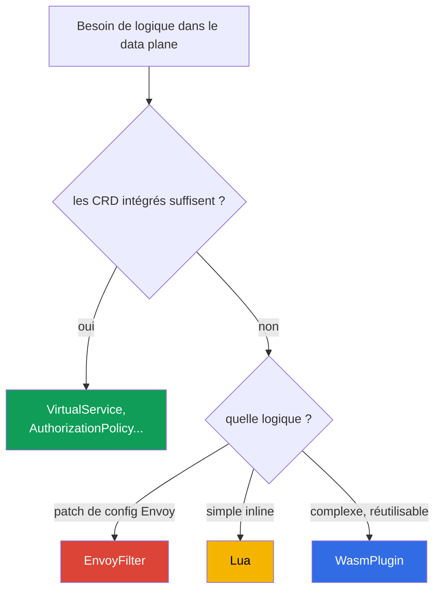

[RU version](ru.md) · [Eng version](en.md) · [Versión en español](es.md) · [Deutsche Version](de.md)

# Chapitre 21. Étendre le data plane : EnvoyFilter, Lua et WasmPlugin

> **La suite.** Les ressources intégrées d'Istio (VirtualService, AuthorizationPolicy,
> Telemetry, etc.) suffisent pour la plupart des besoins. Mais il arrive qu'on ait besoin de
> sa propre logique directement dans le data plane - ce que les CRD ne proposent pas. Dans ce
> chapitre, nous verrons trois façons d'étendre Envoy : EnvoyFilter (patch de configuration),
> Lua (script inline) et WasmPlugin (WebAssembly), et nous comprendrons quand employer
> laquelle.

## 21.1. Quand une extension est nécessaire

D'abord un avertissement honnête : **cherchez d'abord une solution toute faite**. La plupart
des besoins se règlent avec les ressources standard - routage, sécurité, télémétrie, rate
limiting. Les extensions sont nécessaires quand le standard ne suffit pas :

- ajouter ou réécrire des en-têtes selon une logique non standard ;
- implémenter une vérification/autorisation personnalisée absente d'AuthorizationPolicy ;
- activer une fonctionnalité d'Envoy pour laquelle Istio n'a pas de CRD dédié ;
- intégrer sa propre logique au niveau du proxy (par exemple, un traitement spécial des
  requêtes).

## 21.2. Trois façons d'étendre



- **EnvoyFilter** - patche directement la configuration d'Envoy. Puissance maximale et risque
  maximal.
- **Lua** - un petit script directement dans la configuration (connecté via EnvoyFilter). Bon
  pour la logique simple.
- **WasmPlugin** - un module WebAssembly complet qu'Envoy charge à l'exécution. Pour une
  logique complexe et réutilisable.

## 21.3. EnvoyFilter

`EnvoyFilter` permet d'apporter des modifications ponctuelles directement à la configuration
d'Envoy générée par istiod : ajouter des filtres, modifier les listeners, routes, clusters.
C'est le « tournevis pour les entrailles » d'Envoy - on peut presque tout faire.

C'est justement via EnvoyFilter, comme nous l'avons vu au chapitre 20, qu'on active le local
rate limit - il n'y a pas de CRD dédié pour cela.

Le principal inconvénient est la **fragilité**. EnvoyFilter référence les structures internes
de la configuration d'Envoy par leurs noms et positions. Lors d'une mise à jour d'Istio ou
d'Envoy, ces structures peuvent changer, et votre EnvoyFilter cesse silencieusement de
fonctionner ou casse la configuration. C'est pourquoi on le considère comme un outil de
dernier recours : si le besoin peut être couvert par un CRD standard - faites-le avec celui-ci.

## 21.4. Lua

Si vous avez besoin d'une **logique simple** (consulter/ajouter un en-tête, rejeter une requête
selon une condition), il n'est pas nécessaire d'écrire un module séparé - on peut insérer un
script **Lua** directement dans la configuration via EnvoyFilter. Envoy l'exécute à chaque
requête.

Exemple issu du lab 27 : Lua ajoute un en-tête à la réponse et bloque la requête portant un
en-tête donné.

```lua
-- ajouter un en-tête à la réponse
function envoy_on_response(handle)
  handle:headers():add("x-lua-lab", "hello-from-lua")
end

-- bloquer la requête portant l'en-tête x-block: yes
function envoy_on_request(handle)
  if handle:headers():get("x-block") == "yes" then
    handle:respond({[":status"] = "403"}, "blocked by lua")
  end
end
```

Le code `.lua` ne se connecte nulle part de lui-même - c'est `EnvoyFilter` qui l'injecte, en
ajoutant le filtre `envoy.filters.http.lua` dans le listener voulu. Ressource complète qui
active le script ci-dessus sur les pods `ping-pong` :

```yaml
apiVersion: networking.istio.io/v1alpha3
kind: EnvoyFilter
metadata:
  name: lua-headers
  namespace: app
spec:
  workloadSelector:
    labels:
      app: ping-pong
  configPatches:
  - applyTo: HTTP_FILTER
    match:
      context: SIDECAR_INBOUND
      listener:
        filterChain:
          filter:
            name: envoy.filters.network.http_connection_manager
    patch:
      operation: INSERT_BEFORE          # avant le routage principal
      value:
        name: envoy.filters.http.lua
        typed_config:
          "@type": type.googleapis.com/envoy.extensions.filters.http.lua.v3.Lua
          inlineCode: |
            function envoy_on_response(handle)
              handle:headers():add("x-lua-lab", "hello-from-lua")
            end
            function envoy_on_request(handle)
              if handle:headers():get("x-block") == "yes" then
                handle:respond({[":status"] = "403"}, "blocked by lua")
              end
            end
```

Lua est bon pour les petites choses rapides : manipulations d'en-têtes, vérifications simples.
Mais il se connecte lui aussi via EnvoyFilter (avec tous ses risques) et n'est pas destiné à
une logique lourde ou à des appels externes - pour cela, il y a Wasm.

## 21.5. WasmPlugin

Pour une véritable logique personnalisée, il y a **WebAssembly (Wasm)**. Vous écrivez un module
(en Go, Rust, C++, AssemblyScript) ou en prenez un tout fait, et Envoy **le charge à l'exécution**
- sans recompilation du proxy. Cela se pilote avec une ressource `WasmPlugin` dédiée.

```yaml
apiVersion: extensions.istio.io/v1alpha1
kind: WasmPlugin
metadata:
  name: basic-auth
  namespace: istio-system
spec:
  selector:
    matchLabels:
      istio: ingressgateway
  url: oci://ghcr.io/my-org/basic-auth:1.0    # module depuis un registre OCI
  phase: AUTHN                                # quand l'exécuter dans la chaîne (voir ci-dessous)
  pluginConfig:                               # config que recevra le module lui-même
    users:
      alice: "$2y$10$..."                     # exemple : login -> hash bcrypt du mot de passe
```

Deux champs importants :

- **`pluginConfig`** - configuration arbitraire qu'Envoy transmet **à l'intérieur** du module au
  chargement. Un même module (par exemple, `basic_auth`) se paramètre avec ces données - sans
  recompilation. Sans `pluginConfig`, la plupart des modules sont inutiles.
- **`phase`** - à quel moment de la chaîne de filtres exécuter le module : `AUTHN` (avant
  l'authentification), `AUTHZ` (après l'authentification, avant l'autorisation), `STATS` (tout à
  la fin) ou la valeur par défaut. L'ordre de plusieurs plugins dans une même phase se définit
  avec le champ `priority`.

Principaux avantages de Wasm :

- **N'importe quel langage et n'importe quelle complexité.** Le module est du code complet, pas
  un script.
- **Chargement dynamique.** Le module est tiré depuis un registre OCI (comme une image classique)
  et chargé dans Envoy à la volée, sans recompilation et sans EnvoyFilter.
- **Isolation (sandbox).** Wasm s'exécute dans un bac à sable : une erreur dans le module ne fait
  pas tomber tout Envoy.
- **Interface stable (ABI Proxy-Wasm).** Le module dialogue avec Envoy via un contrat stable, il
  est donc bien plus résistant aux montées de version qu'EnvoyFilter.
- **Réutilisabilité.** Un même module dans un registre peut être branché dans différents clusters
  et projets.

Inconvénients : écrire et compiler un module Wasm est plus difficile qu'un script Lua ; il y a un
léger surcoût à l'exécution. C'est pourquoi, pour « ajouter un seul en-tête », Wasm est excessif -
c'est fait pour de la vraie logique.

Dans le lab 23, vous brancherez un module communautaire tout fait `basic_auth` sur l'ingress
gateway - c'est un scénario typique : prendre un module Wasm existant et l'activer via
`WasmPlugin`.

## 21.6. Que choisir

| | EnvoyFilter | Lua | WasmPlugin |
|---|-------------|-----|------------|
| Ce que c'est | patch de la configuration Envoy | script inline | module WebAssembly |
| Complexité de la logique | config, pas de logique | simple | quelconque |
| Langage | - | Lua | Go, Rust, C++, ... |
| Chargement | partie de la config | partie de la config | depuis un registre OCI, à l'exécution |
| Résistance aux montées de version | faible | moyenne | élevée (ABI stable) |
| Quand | fonctionnalité Envoy sans CRD | petite chose rapide avec en-têtes | logique complexe réutilisable |

Règle pratique par ordre de priorité :

1. **D'abord les CRD standard** - si le besoin s'y règle, pas d'extension nécessaire.
2. **Lua** - pour la logique inline simple (en-têtes, petites vérifications).
3. **WasmPlugin** - pour la logique complexe ou réutilisable.
4. **EnvoyFilter** - dernier recours : quand il faut une fonctionnalité d'Envoy absente des CRD
   comme d'ailleurs. Souvenez-vous de sa fragilité lors des montées de version.

## 21.7. Exploitation : surcoût, vérification, troubleshooting

Les extensions travaillent sur le **chemin critique** de chaque requête, on ne peut donc pas les
« poser et oublier ». Voyons ce qu'elles coûtent en ressources, comment s'assurer que tout va
bien, et comment réparer si ce n'est pas le cas.

### Surcoût en ressources

- **Lua** s'exécute à **chaque requête** dans Envoy. Une opération simple (ajouter un en-tête) -
  des fractions de microseconde, imperceptible. Mais une logique lourde ou des appels dans Lua
  ajoutent une latence et un CPU proxy notables - sur le hot path, c'est dangereux.
- **Wasm** s'exécute lui aussi à chaque requête et occupe en plus de la mémoire dans chaque Envoy
  (le module est chargé dans chaque proxy où il est activé). Généralement plus lent que les
  filtres natifs, mais en bac à sable. Le surcoût dépend fortement du module.
- **EnvoyFilter**, s'il se contente de modifier la config (par exemple, activer un filtre tout
  prêt comme le local rate limit), ne coûte presque rien en soi - vous payez pour le travail du
  filtre qu'il a ajouté.

Règle principale : **mesurez avant et après**. Regardez la latence (p50/p99), le CPU et la
mémoire du conteneur istio-proxy sur les pods portant l'extension. Ne vous fiez pas à « ça a
l'air de marcher ».

### Comment vérifier que tout va bien

Après avoir appliqué une extension, parcourez la checklist :

- **La config est arrivée :** `istioctl proxy-status` - tous les proxys `SYNCED`, sans erreurs.
- **Le filtre est réellement apparu :** `istioctl proxy-config listeners <pod>` (ou `routes`) -
  votre filtre/logique est présent dans la config du listener voulu.
- **Analyseur :** `istioctl analyze` - pas de nouveaux avertissements.
- **Fonctionnellement :** la requête passe, l'en-tête est ajouté, le blocage se déclenche - ce
  pour quoi vous l'avez fait.
- **Métriques :** la latence n'a pas augmenté, pas de pic de `5xx`, CPU/mémoire du proxy dans les
  normes.

### Troubleshooting

Problèmes courants et où regarder :

- **Rien n'a changé (le filtre ne s'est pas appliqué).** Cause fréquente - un `match` incorrect
  dans EnvoyFilter (le context, le nom du listener ou `applyTo` ne correspondent pas). Vérifiez
  `istioctl proxy-config` - votre filtre figure-t-il dans le dump ; regardez les logs d'istiod à
  la recherche d'erreurs d'application.
- **Le module Wasm ne s'est pas chargé.** Vérifiez `url` (le registre OCI est-il accessible), les
  logs d'istio-proxy à la recherche d'erreurs de téléchargement du Wasm, la justesse de `phase`.
  Un registre privé nécessite un accès en pull.
- **Le trafic voisin est cassé.** Généralement après une montée de version d'Istio/Envoy :
  EnvoyFilter référence des structures internes qui ont changé. Vérifiez les release notes,
  mettez à jour le filtre.
- **Débogage approfondi d'Envoy.** Montez le niveau de logs du proxy
  (`istioctl proxy-config log <pod> --level debug`) et regardez le dump de configuration via
  l'admin API (`pilot-agent request GET config_dump`).

### Best practices pour la prod

- **Déployez de façon ciblée.** Mettez toujours un `selector` sur un workload ou un gateway
  précis, pas sur tout le maillage - le rayon d'impact est plus petit et le surcoût seulement
  là où c'est nécessaire.
- **Versionnez et faites relire.** Les extensions sont du code sur le chemin critique ; gardez-les
  dans Git et faites-les passer par une revue, comme du code ordinaire.
- **Wasm depuis votre propre registre avec pinning des versions.** Ne tirez pas les modules en
  `latest` depuis des registres tiers : utilisez un registre OCI privé (sur AWS c'est **Amazon
  ECR** - le Wasm y réside comme un artefact OCI classique, accès en pull via IAM/IRSA), figez la
  version par digest, vérifiez la supply chain (scan, signature).
- **Ne mettez pas de logique lourde dans Lua sur le hot path.** Pour une logique sérieuse - Wasm.
- **Test de régression après chaque montée de version d'Istio.** Surtout pour EnvoyFilter - il se
  casse silencieusement.
- **Gardez un plan de rollback.** L'extension est une ressource séparée ; assurez-vous que sa
  suppression restaure le comportement en toute sécurité, et sachez le faire vite.

## 21.8. Résumé du chapitre

- Réglez d'abord le besoin avec les CRD standard ; les extensions - quand ils ne suffisent pas.
- **EnvoyFilter** patche directement la configuration d'Envoy : très puissant, mais fragile lors
  des montées de version d'Istio/Envoy - outil de dernier recours.
- **Lua** - script inline simple (via EnvoyFilter) pour une petite logique avec en-têtes et des
  vérifications simples.
- **WasmPlugin** - module WebAssembly complet : n'importe quel langage, chargement dynamique
  depuis un registre OCI (sur AWS - ECR), bac à sable, ABI stable (résistant aux montées de
  version), réutilisabilité. Se paramètre via `pluginConfig`, l'ordre - via `phase`/`priority`.
- Lua et tout autre filtre Envoy se branchent avec un `EnvoyFilter` complet (`applyTo:
  HTTP_FILTER`, `envoy.filters.http.*`) ; le script `.lua` seul, sans enveloppe, ne fonctionne
  pas.
- Priorité de choix : CRD standard -> Lua (petit) -> Wasm (complexe) -> EnvoyFilter (cas
  extrême).
- Les extensions travaillent sur le chemin critique : Lua et Wasm coûtent du CPU/mémoire à chaque
  requête - mesurez la latence et les ressources avant et après.
- Après une modification, vérifiez : `proxy-status` (SYNCED), `proxy-config` (le filtre est en
  place), `analyze`, tests fonctionnels, métriques. Déployez de façon ciblée (selector),
  versionnez, gardez un plan de rollback, test de régression après les montées de version.

## 21.9. Questions d'auto-évaluation

1. Pourquoi les extensions sont-elles un dernier recours et non le premier outil ?
2. En quoi EnvoyFilter est-il puissant et pourquoi est-il fragile lors des montées de version ?
3. Pour quels besoins Lua convient-il, et pour lesquels ne convient-il pas ?
4. Citez les avantages clés de WasmPlugin par rapport à EnvoyFilter.
5. Dans quel ordre de priorité choisir la façon d'étendre ?
6. Quel surcoût ajoutent Lua et Wasm et comment l'évaluer ?
7. Comment vérifier qu'une extension s'est appliquée et n'a rien cassé ? Où regarder lors du
   troubleshooting si le filtre ne s'est pas déclenché ou si le Wasm ne s'est pas chargé ?
8. Comment un script Lua arrive-t-il dans Envoy (quelle ressource l'injecte) ?
9. À quoi servent `pluginConfig` et `phase` dans WasmPlugin ? D'où prend-on un module Wasm sur
   AWS ?

## Pratique

Entraînez-vous à la logique personnalisée via EnvoyFilter + Lua (en-tête et blocage de requête) :

🧪 Lab 27 : [tasks/ica/labs/27](../../labs/27/README_FR.MD)

Entraînez-vous à brancher un module Wasm via WasmPlugin :

🧪 Lab 23 : [tasks/ica/labs/23](../../labs/23/README_FR.MD)

---
[Table des matières](../README_FR.md) · [Chapitre 20](../20/fr.md) · [Chapitre 22](../22/fr.md)
