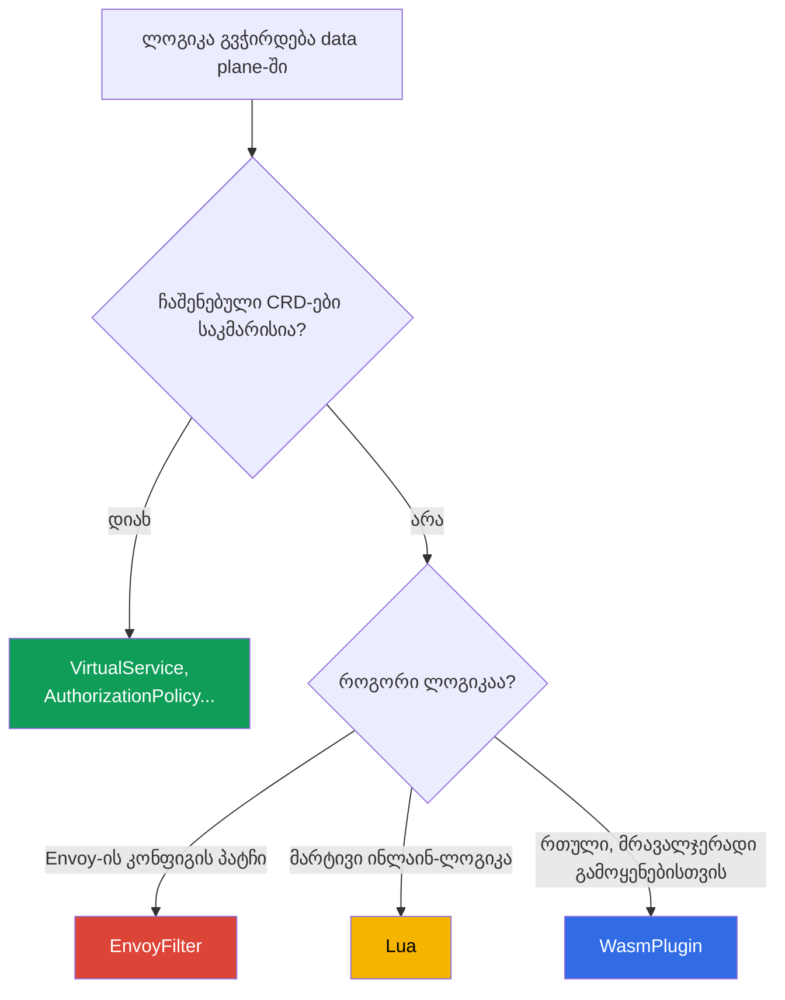

[Русская версия](ru.md) · [Eng version](en.md) · [Versión en español](es.md) · [Version française](fr.md) · [Deutsche Version](de.md) · [繁體中文版](tw.md) · [日本語版](jp.md)

# თავი 21. data plane-ის გაფართოება: EnvoyFilter, Lua და WasmPlugin

> **რა იქნება შემდეგ.** Istio-ს ჩაშენებული რესურსები (VirtualService, AuthorizationPolicy,
> Telemetry და ა.შ.) ამოცანების უმეტესობისთვის საკმარისია. თუმცა ზოგჯერ საკუთარი ლოგიკა
> უშუალოდ data plane-ში გვჭირდება - ისეთი რამ, რაც CRD-ში არ არის. ამ თავში Envoy-ის
> გაფართოების სამ გზას განვიხილავთ: EnvoyFilter (კონფიგურაციის პატჩი), Lua (ინლაინ-სკრიპტი)
> და WasmPlugin (WebAssembly), ასევე გავარკვევთ, როდის რომელი უნდა გამოვიყენოთ.

## 21.1. როდის არის გაფართოება საჭირო

თავიდანვე გულწრფელი გაფრთხილება: **ჯერ მზა საშუალება მოძებნეთ**. ამოცანების უმეტესობა
სტანდარტული რესურსებით წყდება - მარშრუტიზაცია, უსაფრთხოება, ტელემეტრია, rate limiting.
გაფართოებები მაშინ არის საჭირო, როდესაც სტანდარტული საშუალებები საკმარისი არ არის:

- არასტანდარტული ლოგიკის მიხედვით სათაურების დამატება ან გადაწერა;
- ისეთი მორგებული შემოწმების/ავტორიზაციის რეალიზება, რომელიც AuthorizationPolicy-ში არ არის;
- Envoy-ის იმ ფუნქციის ჩართვა, რომლისთვისაც Istio-ს ცალკე CRD არ აქვს;
- საკუთარი ლოგიკის პროქსის დონეზე ჩაშენება (მაგალითად, მოთხოვნების სპეციალური დამუშავება).

## 21.2. გაფართოების სამი გზა



- **EnvoyFilter** - უშუალოდ ცვლის Envoy-ის კონფიგურაციას პატჩით. მაქსიმალური შესაძლებლობა
  და მაქსიმალური რისკი.
- **Lua** - მცირე სკრიპტი უშუალოდ კონფიგურაციაში (ერთდება EnvoyFilter-ის მეშვეობით).
  კარგია მარტივი ლოგიკისთვის.
- **WasmPlugin** - სრულფასოვანი WebAssembly მოდული, რომელსაც Envoy runtime-ში ტვირთავს.
  განკუთვნილია რთული და მრავალჯერადი გამოყენების ლოგიკისთვის.

## 21.3. EnvoyFilter

`EnvoyFilter` საშუალებას გვაძლევს, უშუალოდ istiod-ის მიერ გენერირებულ Envoy-ის
კონფიგურაციაში წერტილოვანი ცვლილებები შევიტანოთ: დავამატოთ ფილტრები, შევცვალოთ listeners,
routes, clusters. ეს Envoy-ის „შიდა მექანიზმებისთვის განკუთვნილი სახრახნისია“ - თითქმის
ყველაფრის გაკეთება შეიძლება.

როგორც მე-20 თავში ვნახეთ, local rate limit სწორედ EnvoyFilter-ის მეშვეობით ირთვება -
მისთვის ცალკე CRD არ არსებობს.

მთავარი ნაკლი **სიმყიფეა**. EnvoyFilter სახელებისა და პოზიციების მიხედვით მიმართავს
Envoy-ის კონფიგურაციის შიდა სტრუქტურებს. Istio-ს ან Envoy-ის განახლებისას ეს სტრუქტურები
შეიძლება შეიცვალოს და თქვენმა EnvoyFilter-მა უხმაუროდ შეწყვიტოს მუშაობა ან კონფიგურაცია
დააზიანოს. ამიტომ ის უკანასკნელ საშუალებად ითვლება: თუ ამოცანა სტანდარტული CRD-ით
წყდება, სწორედ ის გამოიყენეთ.

## 21.4. Lua

თუ **მარტივი ლოგიკა** გჭირდებათ (სათაურის ნახვა/დამატება, პირობის მიხედვით მოთხოვნის
უარყოფა), ცალკე მოდულის დაწერა აუცილებელი არ არის - EnvoyFilter-ის მეშვეობით შეგიძლიათ
**Lua**-ს სკრიპტი პირდაპირ კონფიგურაციაში ჩასვათ. Envoy მას ყოველ მოთხოვნაზე ასრულებს.

მაგალითი 27-ე ლაბორატორიიდან: Lua პასუხს სათაურს უმატებს და გარკვეული სათაურის მქონე
მოთხოვნას ბლოკავს.

```lua
-- სათაურის დამატება პასუხს
function envoy_on_response(handle)
  handle:headers():add("x-lua-lab", "hello-from-lua")
end

-- მოთხოვნის დაბლოკვა სათაურით x-block: yes
function envoy_on_request(handle)
  if handle:headers():get("x-block") == "yes" then
    handle:respond({[":status"] = "403"}, "blocked by lua")
  end
end
```

თავისთავად `.lua`-კოდი არსად ერთდება - მის ინექციას `EnvoyFilter` ახორციელებს და საჭირო
listener-ში `envoy.filters.http.lua` ფილტრს ამატებს. სრული რესურსი, რომელიც ზემოთ მოცემულ
სკრიპტს `ping-pong` pod-ებზე რთავს:

```yaml
apiVersion: networking.istio.io/v1alpha3
kind: EnvoyFilter
metadata:
  name: lua-headers
  namespace: app
spec:
  workloadSelector:
    labels:
      app: ping-pong
  configPatches:
  - applyTo: HTTP_FILTER
    match:
      context: SIDECAR_INBOUND
      listener:
        filterChain:
          filter:
            name: envoy.filters.network.http_connection_manager
    patch:
      operation: INSERT_BEFORE          # ძირითად როუტინგამდე
      value:
        name: envoy.filters.http.lua
        typed_config:
          "@type": type.googleapis.com/envoy.extensions.filters.http.lua.v3.Lua
          inlineCode: |
            function envoy_on_response(handle)
              handle:headers():add("x-lua-lab", "hello-from-lua")
            end
            function envoy_on_request(handle)
              if handle:headers():get("x-block") == "yes" then
                handle:respond({[":status"] = "403"}, "blocked by lua")
              end
            end
```

Lua კარგია სწრაფი წვრილმანი ამოცანებისთვის: სათაურების მანიპულაცია, მარტივი შემოწმებები.
თუმცა ისიც EnvoyFilter-ის მეშვეობით ერთდება (ყველა თანმხლები რისკით) და მძიმე ლოგიკისთვის
ან გარე გამოძახებებისთვის განკუთვნილი არ არის - ამისთვის Wasm არსებობს.

## 21.5. WasmPlugin

ნამდვილი მორგებული ლოგიკისთვის არსებობს **WebAssembly (Wasm)**. თქვენ წერთ მოდულს (Go,
Rust, C++, AssemblyScript ენებზე) ან მზას იღებთ, Envoy კი მას **runtime-ში ტვირთავს** -
პროქსის თავიდან აწყობის გარეშე. ეს ცალკე `WasmPlugin` რესურსით იმართება.

```yaml
apiVersion: extensions.istio.io/v1alpha1
kind: WasmPlugin
metadata:
  name: basic-auth
  namespace: istio-system
spec:
  selector:
    matchLabels:
      istio: ingressgateway
  url: oci://ghcr.io/my-org/basic-auth:1.0    # მოდული OCI-რეესტრიდან
  phase: AUTHN                                # როდის შესრულდეს ჯაჭვში (იხ. ქვემოთ)
  pluginConfig:                               # კონფიგი, რომელსაც მიიღებს თავად მოდული
    users:
      alice: "$2y$10$..."                     # მაგალითი: ლოგინი -> პაროლის bcrypt-ჰეში
```

ორი მნიშვნელოვანი ველი:

- **`pluginConfig`** - ნებისმიერი კონფიგურაცია, რომელსაც Envoy ჩატვირთვისას მოდულის
  **შიგნით** გადასცემს. ერთი და იგივე მოდული (მაგალითად, `basic_auth`) აქ მოცემული
  მონაცემებით კონფიგურირდება - თავიდან აწყობის გარეშე. `pluginConfig`-ის გარეშე
  მოდულების უმეტესობა უსარგებლოა.
- **`phase`** - ფილტრების ჯაჭვის რომელ მომენტში უნდა შესრულდეს მოდული: `AUTHN`
  (ავთენტიფიკაციამდე), `AUTHZ` (ავთენტიფიკაციის შემდეგ, ავტორიზაციამდე), `STATS`
  (სულ ბოლოს) ან ნაგულისხმევი მნიშვნელობა. ერთ ფაზაში რამდენიმე პლაგინის მიმდევრობა
  `priority` ველით განისაზღვრება.

Wasm-ის მთავარი უპირატესობები:

- **ნებისმიერი ენა და ნებისმიერი სირთულე.** მოდული სრულფასოვანი კოდია და არა სკრიპტი.
- **დინამიკური ჩატვირთვა.** მოდული OCI-რეესტრიდან (ჩვეულებრივი image-ის მსგავსად)
  ჩამოიტვირთება და Envoy-ში მუშაობისას იტვირთება, თავიდან აწყობისა და EnvoyFilter-ის გარეშე.
- **იზოლაცია (sandbox).** Wasm იზოლირებულ გარემოში მუშაობს: მოდულის შეცდომა მთლიან Envoy-ს
  არ თიშავს.
- **სტაბილური ინტერფეისი (Proxy-Wasm ABI).** მოდული Envoy-ს სტაბილური კონტრაქტით
  უკავშირდება, ამიტომ განახლებების მიმართ EnvoyFilter-ზე გაცილებით მდგრადია.
- **მრავალჯერადი გამოყენება.** რეესტრში არსებული ერთი მოდული სხვადასხვა კლასტერსა და
  პროექტში შეიძლება ჩაირთოს.

ნაკლოვანებები: Wasm-მოდულის დაწერა და აწყობა Lua-ს სკრიპტზე რთულია; შესრულებას მცირე
ოვერჰედიც ახლავს. ამიტომ Wasm ზედმეტია მხოლოდ „ერთი სათაურის დასამატებლად“ - ის ნამდვილი
ლოგიკისთვის არის განკუთვნილი.

23-ე ლაბორატორიაში ingress gateway-ზე მზა community-მოდულს, `basic_auth`-ს, ჩართავთ - ეს
ტიპური სცენარია: არსებული Wasm-მოდული აიღოთ და `WasmPlugin`-ის მეშვეობით ჩართოთ.

## 21.6. რა ავირჩიოთ

| | EnvoyFilter | Lua | WasmPlugin |
|---|-------------|-----|------------|
| რა არის | Envoy-ის კონფიგურაციის პატჩი | ინლაინ-სკრიპტი | WebAssembly მოდული |
| ლოგიკის სირთულე | კონფიგი და არა ლოგიკა | მარტივი | ნებისმიერი |
| ენა | - | Lua | Go, Rust, C++, ... |
| ჩატვირთვა | კონფიგის ნაწილი | კონფიგის ნაწილი | OCI-რეესტრიდან, runtime-ში |
| განახლებების მიმართ მდგრადობა | დაბალი | საშუალო | მაღალი (სტაბილური ABI) |
| როდის | Envoy-ის ფუნქცია CRD-ის გარეშე | სწრაფი წვრილმანი სათაურებით | რთული, მრავალჯერადი გამოყენების ლოგიკა |

პრაქტიკული პრიორიტეტული წესი:

1. **ჯერ სტანდარტული CRD-ები** - თუ ამოცანა მათი მეშვეობით წყდება, გაფართოებები საჭირო არ არის.
2. **Lua** - მარტივი ინლაინ-ლოგიკისთვის (სათაურები, მცირე შემოწმებები).
3. **WasmPlugin** - რთული ან მრავალჯერადი გამოყენების ლოგიკისთვის.
4. **EnvoyFilter** - უკანასკნელი საშუალება: როდესაც Envoy-ის ისეთი ფუნქციაა საჭირო,
   რომელიც არც CRD-ში არსებობს და არც სხვაგვარად არის ხელმისაწვდომი. განახლებისას
   მისი სიმყიფე გაითვალისწინეთ.

## 21.7. ექსპლუატაცია: ოვერჰედი, შემოწმება, პრობლემების მოგვარება

გაფართოებები ყოველი მოთხოვნის **ცხელ გზაზე** მუშაობს, ამიტომ მათი „დაყენება და დავიწყება“
არ შეიძლება. განვიხილოთ, რა რესურსები სჭირდებათ, როგორ დავრწმუნდეთ, რომ ყველაფერი წესრიგშია
და როგორ გამოვასწოროთ პრობლემა.

### რესურსების ოვერჰედი

- **Lua** Envoy-ის შიგნით **ყოველ მოთხოვნაზე** სრულდება. მარტივი ოპერაცია (სათაურის
  დამატება) მიკროწამის მცირე ნაწილია და შეუმჩნეველია. მაგრამ მძიმე ლოგიკა ან Lua-დან
  გამოძახებები შესამჩნევ დაყოვნებასა და პროქსის CPU-ის დატვირთვას ამატებს - hot path-ზე
  ეს სახიფათოა.
- **Wasm**-იც ყოველ მოთხოვნაზე სრულდება და დამატებით ყოველ Envoy-ში მეხსიერებას იკავებს
  (მოდული ყველა იმ პროქსიში იტვირთება, სადაც ჩართულია). ჩვეულებრივ, ნატიურ ფილტრებზე
  ნელია, თუმცა იზოლირებულ გარემოში მუშაობს. ოვერჰედი დიდად არის დამოკიდებული მოდულზე.
- **EnvoyFilter**, თუ ის მხოლოდ კონფიგს ცვლის (მაგალითად, local rate limit-ის მსგავს მზა
  ფილტრს რთავს), თავისთავად თითქმის არაფერს მოიხმარს - საფასურს მის მიერ დამატებული
  ფილტრის მუშაობაში იხდით.

მთავარი წესი: **გაზომეთ ცვლილებამდე და მის შემდეგ**. გაფართოების მქონე pod-ებზე შეამოწმეთ
დაყოვნება (p50/p99), istio-proxy კონტეინერის CPU და მეხსიერება. ნუ დაეყრდნობით განცდას,
რომ „თითქოს მუშაობს“.

### როგორ შევამოწმოთ, რომ ყველაფერი წესრიგშია

გაფართოების გამოყენების შემდეგ შეამოწმეთ სია:

- **კონფიგი მივიდა:** `istioctl proxy-status` - ყველა პროქსი `SYNCED` მდგომარეობაშია,
  შეცდომების გარეშე.
- **ფილტრი ნამდვილად გამოჩნდა:** `istioctl proxy-config listeners <pod>` (ან `routes`) -
  თქვენი ფილტრი/ლოგიკა საჭირო listener-ის კონფიგშია.
- **ანალიზატორი:** `istioctl analyze` - ახალი გაფრთხილებები არ არის.
- **ფუნქციურად:** მოთხოვნა გადის, სათაური ემატება, ბლოკირება მუშაობს - ანუ ის, რისთვისაც
  ცვლილება გაკეთდა.
- **მეტრიკები:** დაყოვნება არ გაზრდილა, `5xx`-ის მკვეთრი ზრდა არ არის, პროქსის
  CPU/მეხსიერება ნორმაშია.

### პრობლემების მოგვარება

ტიპური პრობლემები და შესამოწმებელი ადგილები:

- **არაფერი შეცვლილა (ფილტრი არ გამოყენებულა).** ხშირი მიზეზია EnvoyFilter-ში არასწორი
  `match` (context, listener-ის სახელი ან `applyTo` არ დაემთხვა). `istioctl proxy-config`-ით
  შეამოწმეთ, არის თუ არა თქვენი ფილტრი dump-ში; გამოყენების შეცდომებისთვის istiod-ის
  ლოგები ნახეთ.
- **Wasm-მოდული არ ჩაიტვირთა.** შეამოწმეთ `url` (ხელმისაწვდომია თუ არა OCI-რეესტრი),
  Wasm-ის ჩამოტვირთვის შეცდომებისთვის istio-proxy-ს ლოგები და `phase`-ის სისწორე.
  კერძო რეესტრს pull-წვდომა სჭირდება.
- **მეზობელი ტრაფიკი დაზიანდა.** ეს, ჩვეულებრივ, Istio/Envoy-ის განახლების შემდეგ ხდება:
  EnvoyFilter შეცვლილ შიდა სტრუქტურებს მიმართავს. შეადარეთ release notes-ს და ფილტრი
  განაახლეთ.
- **Envoy-ის ღრმა გამართვა.** გაზარდეთ პროქსის ლოგების დონე
  (`istioctl proxy-config log <pod> --level debug`) და admin API-ის მეშვეობით
  (`pilot-agent request GET config_dump`) კონფიგურაციის dump შეამოწმეთ.

### საუკეთესო პრაქტიკები production-ისთვის

- **ვიწროდ გაავრცელეთ.** ყოველთვის მიუთითეთ `selector` კონკრეტულ workload-ზე ან gateway-ზე
  და არა მთელ mesh-ზე - დაზიანების რადიუსიც მცირე იქნება და ოვერჰედიც მხოლოდ იქ
  წარმოიქმნება, სადაც საჭიროა.
- **გამოიყენეთ ვერსიები და code review.** გაფართოებები ცხელ გზაზე გაშვებული კოდია; შეინახეთ
  ისინი Git-ში და ჩვეულებრივი კოდის მსგავსად გაატარეთ review.
- **Wasm საკუთარი რეესტრიდან, ვერსიების პინინგით.** ნუ ჩამოტვირთავთ მოდულებს უცხო
  რეესტრების `latest` ტეგით: გამოიყენეთ კერძო OCI-რეესტრი (AWS-ზე ეს **Amazon ECR**-ია -
  Wasm იქ ჩვეულებრივი OCI-არტეფაქტის სახით ინახება, pull-წვდომა IAM/IRSA-ს მეშვეობით
  ხორციელდება), ვერსია digest-ით დააფიქსირეთ და supply chain შეამოწმეთ (სკანირება, ხელმოწერა).
- **ნუ მოათავსებთ მძიმე ლოგიკას Lua-ში hot path-ზე.** სერიოზული ლოგიკისთვის Wasm გამოიყენეთ.
- **Istio-ს ყოველი განახლების შემდეგ regression-ტესტი ჩაატარეთ.** განსაკუთრებით
  EnvoyFilter-ისთვის - ის უხმაუროდ ტყდება.
- **გქონდეთ უკან დაბრუნების გეგმა.** გაფართოება ცალკე რესურსია; დარწმუნდით, რომ მისი წაშლა
  ქცევას უსაფრთხოდ აბრუნებს და ამის სწრაფად გაკეთება შეგიძლიათ.

## 21.8. თავის შეჯამება

- ჯერ ამოცანა სტანდარტული CRD-ებით გადაჭერით; გაფართოებები მაშინ გამოიყენეთ, როდესაც ისინი
  საკმარისი არ არის.
- **EnvoyFilter** Envoy-ის კონფიგურაციას პირდაპირ ცვლის პატჩით: ძალიან მძლავრია, მაგრამ
  Istio/Envoy-ის განახლებებისას მყიფეა - ეს უკანასკნელი საშუალებაა.
- **Lua** მარტივი ინლაინ-სკრიპტია (EnvoyFilter-ის მეშვეობით) სათაურებთან დაკავშირებული მცირე
  ლოგიკისა და მარტივი შემოწმებებისთვის.
- **WasmPlugin** სრულფასოვანი WebAssembly მოდულია: ნებისმიერი ენა, დინამიკური ჩატვირთვა
  OCI-რეესტრიდან (AWS-ზე - ECR), იზოლირებული გარემო, სტაბილური ABI (განახლებების მიმართ
  მდგრადი), მრავალჯერადი გამოყენება. კონფიგურირდება `pluginConfig`-ით, მიმდევრობა კი
  `phase`/`priority`-ით განისაზღვრება.
- Lua და Envoy-ის ნებისმიერი სხვა ფილტრი სრული `EnvoyFilter`-ით ერთდება (`applyTo: HTTP_FILTER`,
  `envoy.filters.http.*`); თავად `.lua`-სკრიპტი გარსის გარეშე არ მუშაობს.
- არჩევის პრიორიტეტი: სტანდარტული CRD -> Lua (წვრილმანი) -> Wasm (რთული) -> EnvoyFilter
  (უკიდურესი შემთხვევა).
- გაფართოებები ცხელ გზაზე მუშაობს: Lua და Wasm ყოველ მოთხოვნაზე CPU-ს/მეხსიერებას მოიხმარს -
  გაზომეთ დაყოვნება და რესურსები ცვლილებამდე და მის შემდეგ.
- ცვლილების შემდეგ შეამოწმეთ: `proxy-status` (SYNCED), `proxy-config` (ფილტრი ადგილზეა),
  `analyze`, ფუნქციური ტესტები, მეტრიკები. გაავრცელეთ ვიწროდ (selector), გამოიყენეთ ვერსიები,
  გქონდეთ უკან დაბრუნების გეგმა და განახლებების შემდეგ regression-ტესტი ჩაატარეთ.

## 21.9. თვითშემოწმების კითხვები

1. რატომ არის გაფართოებები უკიდურესი საშუალება და არა პირველი ინსტრუმენტი?
2. რა ანიჭებს EnvoyFilter-ს დიდ შესაძლებლობებს და რატომ არის ის მყიფე განახლებებისას?
3. რა ამოცანებისთვის გამოდგება Lua და რისთვის არ არის შესაფერისი?
4. დაასახელეთ WasmPlugin-ის მთავარი უპირატესობები EnvoyFilter-თან შედარებით.
5. რა პრიორიტეტული მიმდევრობით უნდა აირჩიოთ გაფართოების გზა?
6. რა ოვერჰედს ამატებს Lua და Wasm და როგორ უნდა შეაფასოთ ის?
7. როგორ შევამოწმოთ, რომ გაფართოება გამოყენებულია და არაფერი დაუზიანებია? სად უნდა
   ვეძებოთ პრობლემა, თუ ფილტრმა არ იმუშავა ან Wasm არ ჩაიტვირთა?
8. როგორ ხვდება Lua-სკრიპტი Envoy-ში (რომელი რესურსი ახორციელებს მის ინექციას)?
9. რისთვის არის საჭირო `pluginConfig` და `phase` WasmPlugin-ში? საიდან იღებენ Wasm-მოდულს AWS-ზე?

## პრაქტიკა

დაამუშავეთ მორგებული ლოგიკა EnvoyFilter + Lua-ს მეშვეობით (სათაური და მოთხოვნის ბლოკირება):

🧪 ლაბორატორია 27: [tasks/ica/labs/27](../../labs/27/README_GE.MD)

ივარჯიშეთ Wasm-მოდულის WasmPlugin-ის მეშვეობით ჩართვაში:

🧪 ლაბორატორია 23: [tasks/ica/labs/23](../../labs/23/README_GE.MD)

---
[სარჩევი](../README_GE.md) · [თავი 20](../20/ge.md) · [თავი 22](../22/ge.md)
