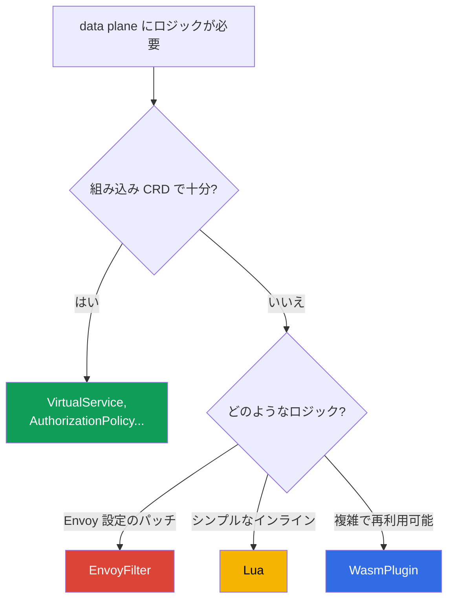

[Русская версия](ru.md) · [Eng version](en.md) · [Versión en español](es.md) · [Version française](fr.md) · [Deutsche Version](de.md) · [ქართული ვერსია](ge.md) · [繁體中文版](tw.md)

# 第21章. data plane の拡張: EnvoyFilter、Lua、WasmPlugin

> **次に進む前に。** Istio の組み込みリソース（VirtualService、AuthorizationPolicy、
> Telemetry など）で、ほとんどのタスクには対応できます。しかし、data plane 上で独自ロジックが
> 必要になることもあります。つまり、CRD にはないものです。この章では、Envoy を拡張する
> 3 つの方法、EnvoyFilter（設定パッチ）、Lua（インラインスクリプト）、WasmPlugin（WebAssembly）を取り上げ、
> どの場面で何を使うべきかを理解します。

## 21.1. 拡張が必要になるとき

まず正直な注意点です: **最初に既製のものを探してください**。ほとんどのタスクは、
標準リソース、すなわちルーティング、セキュリティ、テレメトリー、rate limiting で解決できます。拡張は、
標準機能だけでは足りない場合に必要です:

- 非標準のロジックに従ってヘッダーを追加または書き換える;
- AuthorizationPolicy にはないカスタムの検査・認可を実装する;
- Istio に専用 CRD がない Envoy の機能を有効にする;
- プロキシレベルで独自ロジックを組み込む（たとえば、リクエストの特別な処理）。

## 21.2. 3 つの拡張方法



- **EnvoyFilter** - Envoy の設定を直接パッチします。最大の強力さと最大の
  リスクを伴います。
- **Lua** - 設定内に直接記述する小さなスクリプトです（EnvoyFilter 経由で接続します）。
  シンプルなロジックに適しています。
- **WasmPlugin** - Envoy がランタイムにロードする完全な WebAssembly モジュールです。
  複雑で再利用可能なロジック向けです。

## 21.3. EnvoyFilter

`EnvoyFilter` を使うと、istiod が生成する Envoy 設定に直接ピンポイントの変更を加えられます:
フィルターの追加、listeners、routes、clusters の変更などです。これは Envoy の内部に対する「ドライバー」であり、
ほぼ何でもできます。

第20章で見たように、local rate limit は EnvoyFilter を通じて有効にします。
これ専用の CRD はありません。

主な欠点は **壊れやすさ** です。EnvoyFilter は、名前と位置で Envoy 設定の内部構造を
参照します。Istio または Envoy のアップグレード時にこれらの構造が変わることがあり、
EnvoyFilter が何の通知もなく機能しなくなったり、設定を壊したりする可能性があります。そのため、
これは最後の手段と見なされます。標準 CRD でタスクを解決できるなら、そちらで解決してください。

## 21.4. Lua

**シンプルなロジック**（ヘッダーを確認・追加する、条件に応じてリクエストを拒否する）が必要な場合、
別のモジュールを書く必要はありません。**Lua** のスクリプトを EnvoyFilter 経由で設定に直接
埋め込めます。Envoy はこれを各リクエストで実行します。

ラボ 27 の例です: Lua はレスポンスにヘッダーを追加し、特定の
ヘッダーを持つリクエストをブロックします。

```lua
-- 応答にヘッダーを追加する
function envoy_on_response(handle)
  handle:headers():add("x-lua-lab", "hello-from-lua")
end

-- x-block: yes ヘッダーを持つリクエストをブロックする
function envoy_on_request(handle)
  if handle:headers():get("x-block") == "yes" then
    handle:respond({[":status"] = "403"}, "blocked by lua")
  end
end
```

`.lua` コード自体はどこにも接続されません。必要な listener に
`envoy.filters.http.lua` フィルターを追加する `EnvoyFilter` がインジェクトします。上記のスクリプトを
`ping-pong` ポッドで有効にする完全なリソースは次のとおりです:

```yaml
apiVersion: networking.istio.io/v1alpha3
kind: EnvoyFilter
metadata:
  name: lua-headers
  namespace: app
spec:
  workloadSelector:
    labels:
      app: ping-pong
  configPatches:
  - applyTo: HTTP_FILTER
    match:
      context: SIDECAR_INBOUND
      listener:
        filterChain:
          filter:
            name: envoy.filters.network.http_connection_manager
    patch:
      operation: INSERT_BEFORE          # メインのルーティングより前に
      value:
        name: envoy.filters.http.lua
        typed_config:
          "@type": type.googleapis.com/envoy.extensions.filters.http.lua.v3.Lua
          inlineCode: |
            function envoy_on_response(handle)
              handle:headers():add("x-lua-lab", "hello-from-lua")
            end
            function envoy_on_request(handle)
              if handle:headers():get("x-block") == "yes" then
                handle:respond({[":status"] = "403"}, "blocked by lua")
              end
            end
```

Lua は、ヘッダー操作やシンプルな検査といった素早い小さな作業に適しています。しかし、これも
EnvoyFilter を通じて接続されるため（同じリスクを伴います）、重いロジックや外部呼び出しには
向いていません。そのためには Wasm があります。

## 21.5. WasmPlugin

本格的なカスタムロジックには **WebAssembly (Wasm)** があります。モジュールを（Go、
Rust、C++、AssemblyScript で）書くか既製のものを使い、Envoy がこれを **ランタイムにロード** します。つまり、
プロキシを再ビルドする必要はありません。これは専用リソース `WasmPlugin` で管理されます。

```yaml
apiVersion: extensions.istio.io/v1alpha1
kind: WasmPlugin
metadata:
  name: basic-auth
  namespace: istio-system
spec:
  selector:
    matchLabels:
      istio: ingressgateway
  url: oci://ghcr.io/my-org/basic-auth:1.0    # OCI レジストリのモジュール
  phase: AUTHN                                # チェーン内で実行するタイミング (下記参照)
  pluginConfig:                               # モジュール自身が受け取る設定
    users:
      alice: "$2y$10$..."                     # 例: ログイン -> パスワードの bcrypt ハッシュ
```

重要なフィールドは 2 つあります:

- **`pluginConfig`** - Envoy がロード時にモジュールの**内部へ**渡す任意の設定です。
  同じモジュール（たとえば `basic_auth`）を、再ビルドせずにここにあるデータで設定できます。
  `pluginConfig` がなければ、ほとんどのモジュールは役に立ちません。
- **`phase`** - フィルターチェーン内でモジュールを実行するタイミングです: `AUTHN`（認証前）、
  `AUTHZ`（認証後、認可前）、`STATS`（最後）、またはデフォルト値です。
  同じフェーズ内の複数プラグインの順序は `priority` フィールドで指定します。

Wasm の主な利点:

- **任意の言語、任意の複雑さ。** モジュールはスクリプトではなく完全なコードです。
- **動的ロード。** モジュールは OCI レジストリ（通常のイメージのように）から取得され、
  EnvoyFilter も再ビルドも不要で Envoy にその場でロードされます。
- **分離（sandbox）。** Wasm はサンドボックス内で動作します。モジュールのエラーで
  Envoy 全体が停止することはありません。
- **安定したインターフェース（Proxy-Wasm ABI）。** モジュールは安定したコントラクトを通じて Envoy と通信するため、
  EnvoyFilter よりもアップグレードに対してはるかに強固です。
- **再利用性。** レジストリ内の 1 つのモジュールを、異なるクラスターや
  プロジェクトで接続できます。

欠点は、Lua スクリプトよりも Wasm モジュールの作成とビルドが難しいこと、実行時にわずかなオーバーヘッドが
あることです。したがって、「ヘッダーを 1 つ追加する」ためだけに Wasm を使うのは過剰です。これは本格的な
ロジック向けです。

ラボ 23 では、ingress gateway で既製の community モジュール `basic_auth` を接続します。これは典型的な
シナリオです。既存の Wasm モジュールを取得し、`WasmPlugin` を通じて有効にします。

## 21.6. 何を選ぶか

| | EnvoyFilter | Lua | WasmPlugin |
|---|-------------|-----|------------|
| これは何か | Envoy 設定のパッチ | インラインスクリプト | WebAssembly モジュール |
| ロジックの複雑さ | 設定であり、ロジックではない | シンプル | 任意 |
| 言語 | - | Lua | Go、Rust、C++、... |
| ロード | 設定の一部 | 設定の一部 | OCI レジストリから、ランタイムに |
| アップグレードへの強さ | 低い | 中程度 | 高い（安定した ABI） |
| いつ使うか | CRD がない Envoy 機能 | ヘッダーを扱う素早い小さな作業 | 複雑で再利用可能なロジック |

優先順位に関する実践的なルール:

1. **最初に標準 CRD** - それでタスクが解決できるなら、拡張は不要です。
2. **Lua** - シンプルなインラインロジック（ヘッダー、小さな検査）向け。
3. **WasmPlugin** - 複雑または再利用可能なロジック向け。
4. **EnvoyFilter** - 最後の手段: CRD にも他の方法にもない Envoy 機能が必要な場合です。
   アップグレード時の壊れやすさを忘れないでください。

## 21.7. 運用: オーバーヘッド、検証、troubleshooting

拡張は各リクエストの**ホットパス**で動くため、「設定して忘れる」ことはできません。
リソースコスト、問題がないことの確認方法、問題がある場合の修正方法を見ていきます。

### リソースオーバーヘッド

- **Lua** は Envoy 内で**各リクエスト**に実行されます。単純な操作（ヘッダーを
  追加する）であれば数マイクロ秒未満で、目立ちません。しかし、重いロジックや Lua 内での呼び出しは
  プロキシの遅延と CPU を大幅に増やします。hot path では危険です。
- **Wasm** も各リクエストで実行され、さらに各 Envoy のメモリを使用します
  （有効になっているすべてのプロキシにモジュールがロードされます）。通常はネイティブフィルターより遅いですが、
  サンドボックス内で動作します。オーバーヘッドはモジュールに大きく依存します。
- **EnvoyFilter** は、単に設定を変更するだけなら（たとえば local rate limit のような既製フィルターを
  有効にする場合）、それ自体にはほとんどコストがありません。追加したフィルターの動作に対して
  コストを支払います。

最も重要なルールは: **前後で測定すること** です。拡張を適用したポッドで、istio-proxy コンテナの
レイテンシー（p50/p99）、CPU、メモリを確認してください。「動いているようだ」には頼らないでください。

### 問題がないことを確認する方法

拡張を適用後、次のチェックリストを確認してください:

- **設定が届いた:** `istioctl proxy-status` - すべてのプロキシが `SYNCED` であり、エラーがない。
- **フィルターが実際に追加された:** `istioctl proxy-config listeners <pod>`（または `routes`） -
  対象 listener の設定内にフィルター／ロジックが存在する。
- **アナライザー:** `istioctl analyze` - 新しい警告がない。
- **機能面:** リクエストが通る、ヘッダーが追加される、ブロックが機能する。つまり、
  そのために作成したものが機能する。
- **メトリクス:** レイテンシーが増加しておらず、`5xx` の急増がなく、プロキシの CPU／メモリが正常である。

### Troubleshooting

典型的な問題と確認先:

- **何も変わらない（フィルターが適用されていない）。** よくある原因は EnvoyFilter の `match` が
  誤っていることです（context、listener 名、または `applyTo` が一致しません）。
  `istioctl proxy-config` を確認してください。ダンプにフィルターが存在するか、istiod のログで
  適用エラーを確認します。
- **Wasm モジュールがロードされない。** `url`（OCI レジストリにアクセスできるか）、
  Wasm のダウンロードエラーに関する istio-proxy のログ、正しい `phase` を確認してください。プライベートレジストリには
  pull アクセスが必要です。
- **隣接するトラフィックが壊れた。** 通常は Istio／Envoy のアップグレード後です。EnvoyFilter が
  変更された内部構造を参照しています。リリースノートを確認し、フィルターを更新してください。
- **Envoy の詳細なデバッグ。** プロキシのログレベルを上げて
  （`istioctl proxy-config log <pod> --level debug`）、admin API による設定ダンプを確認します
  （`pilot-agent request GET config_dump`）。

### 本番向けのベストプラクティス

- **小さくロールアウトする。** mesh 全体ではなく、必ず特定の workload または gateway に
  `selector` を設定してください。影響範囲が小さくなり、必要な箇所だけにオーバーヘッドが発生します。
- **バージョン管理とレビューを行う。** 拡張はホットパス上のコードです。通常のコードと同様に Git で管理し、
  レビューを通してください。
- **自分のレジストリから Wasm を使い、バージョンをピン留めする。** 外部レジストリから `latest` で
  モジュールを取得しないでください。プライベート OCI レジストリ（AWS では **Amazon ECR**。Wasm は通常の
  OCI アーティファクトとして保存され、IAM/IRSA による pull アクセスを使用）を使い、digest でバージョンを固定し、
  supply chain（スキャン、署名）を検証してください。
- **hot path の Lua に重いロジックを置かない。** 本格的なロジックには Wasm を使います。
- **Istio のアップグレードごとに回帰テストを行う。** 特に EnvoyFilter は、静かに壊れます。
- **ロールバック計画を維持する。** 拡張は独立したリソースです。その削除が安全に動作を元に戻すことを確認し、
  迅速に実行できるようにしてください。

## 21.8. 章のまとめ

- まず標準 CRD でタスクを解決してください。拡張は、それだけでは足りない場合のものです。
- **EnvoyFilter** は Envoy 設定を直接パッチします。非常に強力ですが、Istio／Envoy の
  アップグレード時に壊れやすいため、最後の手段です。
- **Lua** は、ヘッダーを扱う小さなロジックやシンプルな検査のための、単純なインラインスクリプト
  （EnvoyFilter 経由）です。
- **WasmPlugin** は完全な WebAssembly モジュールです: 任意の言語、OCI レジストリ（AWS では ECR）からの
  動的ロード、サンドボックス、安定した ABI（アップグレードに強い）、再利用性を備えます。
  `pluginConfig` で設定し、順序は `phase`／`priority` で指定します。
- Lua やその他の Envoy フィルターは、完全な `EnvoyFilter`（`applyTo: HTTP_FILTER`、
  `envoy.filters.http.*`）で接続します。ラッパーのない `.lua` スクリプト単体では動作しません。
- 選択の優先順位: 標準 CRD -> Lua（小さな作業）-> Wasm（複雑なもの）-> EnvoyFilter（最後の
  手段）。
- 拡張はホットパスで動作します: Lua と Wasm は各リクエストで CPU／メモリを消費するため、
  前後でレイテンシーとリソースを測定してください。
- 変更後は次を確認します: `proxy-status`（SYNCED）、`proxy-config`（フィルターが存在すること）、
  `analyze`、機能テスト、メトリクス。狭い範囲にロールアウトし（selector）、バージョン管理し、
  ロールバック計画を維持し、アップグレード後に回帰テストを実施してください。

## 21.9. 自己確認のための質問

1. なぜ拡張は最初の手段ではなく、最後の手段なのですか？
2. EnvoyFilter はなぜ強力で、アップグレード時になぜ壊れやすいのですか？
3. Lua はどのようなタスクに適しており、どのようなタスクには不向きですか？
4. WasmPlugin が EnvoyFilter より優れている主な点を挙げてください。
5. 拡張方法はどの優先順位で選ぶべきですか？
6. Lua と Wasm はどのようなオーバーヘッドを加え、それをどう評価しますか？
7. 拡張が適用され、何も壊していないことをどう確認しますか？ フィルターが機能しない、または Wasm がロードされない場合、
   troubleshooting ではどこを確認しますか？
8. Lua スクリプトはどのように Envoy に入りますか（どのリソースがインジェクトしますか）？
9. WasmPlugin で `pluginConfig` と `phase` が必要なのはなぜですか？ AWS では Wasm モジュールをどこから取得しますか？

## 演習

EnvoyFilter + Lua によるカスタムロジック（ヘッダーとリクエストブロック）を練習してください:

🧪 ラボ 27: [tasks/ica/labs/27](../../labs/27/README_JP.MD)

WasmPlugin による Wasm モジュールの接続を練習してください:

🧪 ラボ 23: [tasks/ica/labs/23](../../labs/23/README_JP.MD)

---
[目次](../README_JP.md) · [第20章](../20/jp.md) · [第22章](../22/jp.md)
