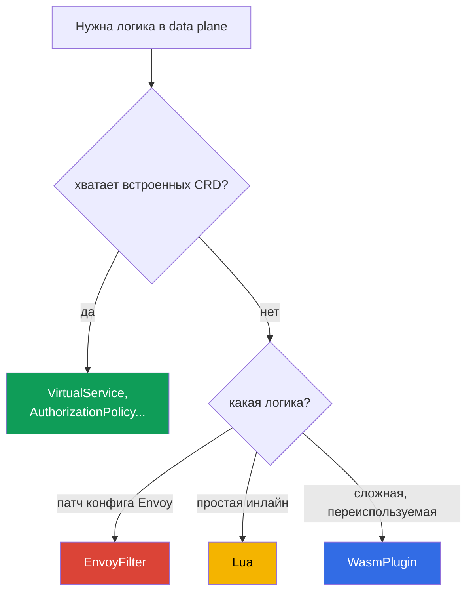

[Eng version](en.md) · [Versión en español](es.md)

# Глава 21. Расширение data plane: EnvoyFilter, Lua и WasmPlugin

> **Что дальше.** Встроенных ресурсов Istio (VirtualService, AuthorizationPolicy,
> Telemetry и т.д.) хватает для большинства задач. Но иногда нужна своя логика прямо в
> data plane - то, чего в CRD нет. В этой главе разберём три способа расширить Envoy:
> EnvoyFilter (патч конфигурации), Lua (инлайн-скрипт) и WasmPlugin (WebAssembly), - и
> поймём, что когда применять.

## 21.1. Когда нужно расширение

Сначала честный дисклеймер: **сначала ищите готовое**. Большинство задач решается
штатными ресурсами - маршрутизация, безопасность, телеметрия, rate limiting. Расширения
нужны, когда штатного не хватает:

- добавить или переписать заголовки по нестандартной логике;
- реализовать кастомную проверку/авторизацию, которой нет в AuthorizationPolicy;
- включить фичу Envoy, для которой у Istio нет отдельного CRD;
- встроить свою логику на уровне прокси (например, специальную обработку запросов).

## 21.2. Три способа расширения



- **EnvoyFilter** - напрямую патчит конфигурацию Envoy. Максимальная мощь и максимальный
  риск.
- **Lua** - небольшой скрипт прямо в конфигурации (подключается через EnvoyFilter).
  Хорош для простой логики.
- **WasmPlugin** - полноценный модуль WebAssembly, который Envoy загружает в рантайме.
  Для сложной и переиспользуемой логики.

## 21.3. EnvoyFilter

`EnvoyFilter` позволяет вносить точечные изменения прямо в конфигурацию Envoy, которую
генерирует istiod: добавлять фильтры, менять listeners, routes, clusters. Это «отвёртка
для внутренностей» Envoy - можно почти всё.

Именно через EnvoyFilter, как мы видели в главе 20, включают local rate limit -
отдельного CRD под него нет.

Главный минус - **хрупкость**. EnvoyFilter ссылается на внутренние структуры конфигурации
Envoy по именам и позициям. При обновлении Istio или Envoy эти структуры могут
поменяться, и ваш EnvoyFilter молча перестанет работать или сломает конфиг. Поэтому его
считают инструментом последней надежды: если задачу можно решить штатным CRD - решайте
им.

## 21.4. Lua

Если нужна **простая логика** (посмотреть/добавить заголовок, отклонить запрос по
условию), необязательно писать отдельный модуль - можно вставить скрипт на **Lua** прямо
в конфигурацию через EnvoyFilter. Envoy выполняет его на каждый запрос.

Пример из лабы 27: Lua добавляет заголовок к ответу и блокирует запрос с определённым
заголовком.

```lua
-- добавить заголовок к ответу
function envoy_on_response(handle)
  handle:headers():add("x-lua-lab", "hello-from-lua")
end

-- заблокировать запрос с заголовком x-block: yes
function envoy_on_request(handle)
  if handle:headers():get("x-block") == "yes" then
    handle:respond({[":status"] = "403"}, "blocked by lua")
  end
end
```

Сам по себе `.lua`-код никуда не подключается - его инжектит `EnvoyFilter`, добавляя фильтр
`envoy.filters.http.lua` в нужный listener. Полный ресурс, который включает скрипт выше на
подах `ping-pong`:

```yaml
apiVersion: networking.istio.io/v1alpha3
kind: EnvoyFilter
metadata:
  name: lua-headers
  namespace: app
spec:
  workloadSelector:
    labels:
      app: ping-pong
  configPatches:
  - applyTo: HTTP_FILTER
    match:
      context: SIDECAR_INBOUND
      listener:
        filterChain:
          filter:
            name: envoy.filters.network.http_connection_manager
    patch:
      operation: INSERT_BEFORE          # до основного роутинга
      value:
        name: envoy.filters.http.lua
        typed_config:
          "@type": type.googleapis.com/envoy.extensions.filters.http.lua.v3.Lua
          inlineCode: |
            function envoy_on_response(handle)
              handle:headers():add("x-lua-lab", "hello-from-lua")
            end
            function envoy_on_request(handle)
              if handle:headers():get("x-block") == "yes" then
                handle:respond({[":status"] = "403"}, "blocked by lua")
              end
            end
```

Lua хорош для быстрых мелочей: манипуляции с заголовками, простые проверки. Но он тоже
подключается через EnvoyFilter (со всеми его рисками) и не предназначен для тяжёлой
логики или внешних вызовов - для этого есть Wasm.

## 21.5. WasmPlugin

Для настоящей кастомной логики есть **WebAssembly (Wasm)**. Вы пишете модуль (на Go,
Rust, C++, AssemblyScript) или берёте готовый, и Envoy **загружает его в рантайме** - без
пересборки прокси. Управляется это отдельным ресурсом `WasmPlugin`.

```yaml
apiVersion: extensions.istio.io/v1alpha1
kind: WasmPlugin
metadata:
  name: basic-auth
  namespace: istio-system
spec:
  selector:
    matchLabels:
      istio: ingressgateway
  url: oci://ghcr.io/my-org/basic-auth:1.0    # модуль из OCI-реестра
  phase: AUTHN                                # когда в цепочке выполнять (см. ниже)
  pluginConfig:                               # конфиг, который получит сам модуль
    users:
      alice: "$2y$10$..."                     # пример: логин -> bcrypt-хэш пароля
```

Два важных поля:

- **`pluginConfig`** - произвольная конфигурация, которую Envoy передаёт **внутрь** модуля при
  загрузке. Один и тот же модуль (например, `basic_auth`) настраивается данными отсюда - без
  пересборки. Без `pluginConfig` большинство модулей бесполезны.
- **`phase`** - в какой момент цепочки фильтров выполнять модуль: `AUTHN` (до аутентификации),
  `AUTHZ` (после аутентификации, до авторизации), `STATS` (в самом конце) или значение по
  умолчанию. Порядок нескольких плагинов в одной фазе задаётся полем `priority`.

Ключевые плюсы Wasm:

- **Любой язык и любая сложность.** Модуль это полноценный код, а не скрипт.
- **Динамическая загрузка.** Модуль подтягивается из OCI-реестра (как обычный образ) и
  загружается в Envoy на лету, без пересборки и без EnvoyFilter.
- **Изоляция (sandbox).** Wasm работает в песочнице: ошибка в модуле не роняет весь
  Envoy.
- **Стабильный интерфейс (Proxy-Wasm ABI).** Модуль общается с Envoy через стабильный
  контракт, поэтому он гораздо устойчивее к апгрейдам, чем EnvoyFilter.
- **Переиспользуемость.** Один модуль в реестре можно подключать в разных кластерах и
  проектах.

Минусы: писать и собирать Wasm-модуль сложнее, чем скрипт на Lua; есть небольшой оверхед
на исполнение. Поэтому ради «добавить один заголовок» Wasm избыточен - это для настоящей
логики.

В лабе 23 вы подключите готовый community-модуль `basic_auth` на ingress gateway - это
типичный сценарий: взять существующий Wasm-модуль и включить его через `WasmPlugin`.

## 21.6. Что выбрать

| | EnvoyFilter | Lua | WasmPlugin |
|---|-------------|-----|------------|
| Что это | патч конфигурации Envoy | инлайн-скрипт | модуль WebAssembly |
| Сложность логики | конфиг, не логика | простая | любая |
| Язык | - | Lua | Go, Rust, C++, ... |
| Загрузка | часть конфига | часть конфига | из OCI-реестра, в рантайме |
| Устойчивость к апгрейдам | низкая | средняя | высокая (стабильный ABI) |
| Когда | фича Envoy без CRD | быстрая мелочь с заголовками | сложная переиспользуемая логика |

Практическое правило по приоритету:

1. **Сначала штатные CRD** - если задача решается ими, расширения не нужны.
2. **Lua** - для простой инлайн-логики (заголовки, мелкие проверки).
3. **WasmPlugin** - для сложной или переиспользуемой логики.
4. **EnvoyFilter** - последняя надежда: когда нужна фича Envoy, которой нет ни в CRD, ни
   иначе. Помните про хрупкость при апгрейдах.

## 21.7. Эксплуатация: оверхед, проверка, troubleshooting

Расширения работают на **горячем пути** каждого запроса, поэтому их нельзя «поставить и
забыть». Разберём, чего они стоят по ресурсам, как убедиться, что всё в порядке, и как
чинить, если нет.

### Оверхед по ресурсам

- **Lua** исполняется на **каждый запрос** внутри Envoy. Простая операция (добавить
  заголовок) - доли микросекунд, незаметно. Но тяжёлая логика или вызовы в Lua добавляют
  заметную задержку и CPU прокси - на hot path это опасно.
- **Wasm** тоже исполняется на каждый запрос и вдобавок занимает память в каждом Envoy
  (модуль загружается в каждый прокси, где включён). Обычно медленнее нативных фильтров,
  но в песочнице. Оверхед сильно зависит от модуля.
- **EnvoyFilter**, если он просто меняет конфиг (например, включает готовый фильтр вроде
  local rate limit), сам по себе почти ничего не стоит - платите за работу того фильтра,
  который он добавил.

Главное правило: **меряйте до и после**. Смотрите латентность (p50/p99), CPU и память
контейнера istio-proxy на подах с расширением. Не полагайтесь на «вроде работает».

### Как проверить, что всё в порядке

После применения расширения пройдитесь по чек-листу:

- **Конфиг доехал:** `istioctl proxy-status` - все прокси `SYNCED`, без ошибок.
- **Фильтр реально появился:** `istioctl proxy-config listeners <pod>` (или `routes`) -
  ваш фильтр/логика присутствует в конфиге нужного listener.
- **Анализатор:** `istioctl analyze` - нет новых предупреждений.
- **Функционально:** запрос проходит, заголовок добавлен, блокировка срабатывает - то,
  ради чего делали.
- **Метрики:** латентность не выросла, нет всплеска `5xx`, CPU/память прокси в норме.

### Troubleshooting

Типовые проблемы и куда смотреть:

- **Ничего не изменилось (фильтр не применился).** Частая причина - неверный `match` в
  EnvoyFilter (не совпал context, имя listener или `applyTo`). Проверьте
  `istioctl proxy-config` - есть ли ваш фильтр в дампе; посмотрите логи istiod на ошибки
  применения.
- **Wasm-модуль не загрузился.** Проверьте `url` (доступен ли OCI-реестр), логи
  istio-proxy на ошибки скачивания Wasm, правильность `phase`. Приватный реестр требует
  доступа на pull.
- **Сломался соседний трафик.** Обычно после апгрейда Istio/Envoy: EnvoyFilter
  ссылается на изменившиеся внутренние структуры. Сверьтесь с релиз-нотами, обновите
  фильтр.
- **Глубокая отладка Envoy.** Поднимите уровень логов прокси
  (`istioctl proxy-config log <pod> --level debug`) и смотрите дамп конфигурации через
  admin API (`pilot-agent request GET config_dump`).

### Best practices для прода

- **Раскатывайте узко.** Всегда ставьте `selector` на конкретный workload или gateway, а
  не на весь mesh - и радиус поражения меньше, и оверхед только там, где нужно.
- **Версионируйте и ревьюйте.** Расширения - это код на горячем пути; держите их в Git и
  проходите ревью, как обычный код.
- **Wasm из своего реестра с пиннингом версий.** Не тяните модули по `latest` из чужих
  реестров: используйте приватный OCI-реестр (на AWS это **Amazon ECR** - Wasm лежит там как
  обычный OCI-артефакт, pull-доступ через IAM/IRSA), фиксируйте версию по digest, проверяйте
  supply chain (скан, подпись).
- **Не кладите тяжёлую логику в Lua на hot path.** Для серьёзной логики - Wasm.
- **Регресс-тест после каждого апгрейда Istio.** Особенно для EnvoyFilter - он ломается
  тихо.
- **Держите план отката.** Расширение - отдельный ресурс; убедитесь, что его удаление
  безопасно возвращает поведение назад, и умейте это быстро сделать.

## 21.8. Итоги главы

- Сначала решайте задачу штатными CRD; расширения - когда их не хватает.
- **EnvoyFilter** патчит конфигурацию Envoy напрямую: очень мощно, но хрупко при
  апгрейдах Istio/Envoy - инструмент последней надежды.
- **Lua** - простой инлайн-скрипт (через EnvoyFilter) для мелкой логики с заголовками и
  простых проверок.
- **WasmPlugin** - полноценный модуль WebAssembly: любой язык, динамическая загрузка из
  OCI-реестра (на AWS - ECR), песочница, стабильный ABI (устойчив к апгрейдам),
  переиспользуемость. Настраивается через `pluginConfig`, порядок - через `phase`/`priority`.
- Lua и любой другой фильтр Envoy подключаются полным `EnvoyFilter` (`applyTo: HTTP_FILTER`,
  `envoy.filters.http.*`); сам `.lua`-скрипт без обёртки не работает.
- Приоритет выбора: штатные CRD -> Lua (мелочь) -> Wasm (сложное) -> EnvoyFilter (крайний
  случай).
- Расширения работают на горячем пути: Lua и Wasm стоят CPU/памяти на каждый запрос -
  меряйте латентность и ресурсы до и после.
- После изменения проверяйте: `proxy-status` (SYNCED), `proxy-config` (фильтр на месте),
  `analyze`, функциональные тесты, метрики. Раскатывайте узко (selector), версионируйте,
  держите план отката, регресс-тест после апгрейдов.

## 21.9. Вопросы для самопроверки

1. Почему расширения это крайняя мера, а не первый инструмент?
2. Чем EnvoyFilter мощен и почему он хрупок при апгрейдах?
3. Для каких задач подходит Lua, а для каких он не годится?
4. Назовите ключевые преимущества WasmPlugin перед EnvoyFilter.
5. В каком порядке приоритета выбирать способ расширения?
6. Какой оверхед добавляют Lua и Wasm и как его оценивать?
7. Как проверить, что расширение применилось и ничего не сломало? Куда смотреть при
   troubleshooting, если фильтр не сработал или Wasm не загрузился?
8. Как Lua-скрипт попадает в Envoy (что за ресурс его инжектит)?
9. Зачем в WasmPlugin нужны `pluginConfig` и `phase`? Откуда берут Wasm-модуль на AWS?

## Практика

Отработайте кастомную логику через EnvoyFilter + Lua (заголовок и блокировка запроса):

🧪 Лаба 27: [tasks/ica/labs/27](../../labs/27/README_RU.MD)

Отработайте подключение Wasm-модуля через WasmPlugin:

🧪 Лаба 23: [tasks/ica/labs/23](../../labs/23/README_RU.MD)

---
[Оглавление](../README.md) · [Глава 20](../20/ru.md) · [Глава 22](../22/ru.md)
