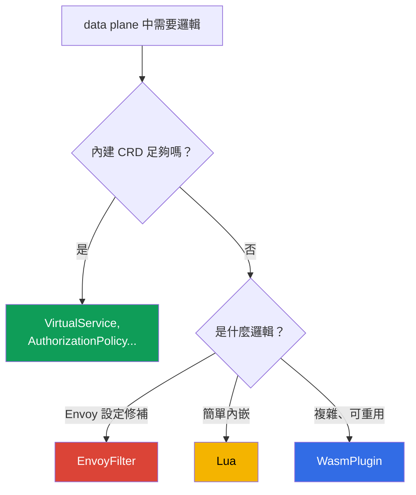

[Русская версия](ru.md) · [Eng version](en.md) · [Versión en español](es.md) · [Version française](fr.md) · [Deutsche Version](de.md) · [ქართული ვერსია](ge.md) · [日本語版](jp.md)

# 第 21 章。擴充 data plane：EnvoyFilter、Lua 與 WasmPlugin

> **接下來。** Istio 內建的資源（VirtualService、AuthorizationPolicy、
> Telemetry 等）足以處理大多數工作。但有時需要直接在 data plane 中加入自訂邏輯--亦即 CRD 所沒有的功能。本章將介紹三種擴充 Envoy 的方式：
> EnvoyFilter（設定修補）、Lua（內嵌指令碼）及 WasmPlugin（WebAssembly），並了解何時該使用哪一種。

## 21.1. 何時需要擴充

先說明一點：**先尋找現成方案**。大多數工作都能透過標準資源解決--路由、安全性、遙測、rate limiting。當標準功能不足時，才需要擴充：

- 依非標準邏輯新增或改寫標頭；
- 實作 AuthorizationPolicy 未提供的自訂檢查／授權；
- 啟用 Istio 沒有專屬 CRD 的 Envoy 功能；
- 在 Proxy 層級嵌入自訂邏輯（例如特殊的請求處理）。

## 21.2. 三種擴充方式



- **EnvoyFilter**--直接修補 Envoy 設定。功能最強，但風險也最高。
- **Lua**--直接放在設定中的小型指令碼（透過 EnvoyFilter 連接）。適合簡單邏輯。
- **WasmPlugin**--完整的 WebAssembly 模組，由 Envoy 在執行階段載入。適合複雜且可重用的邏輯。

## 21.3. EnvoyFilter

`EnvoyFilter` 可直接對 istiod 產生的 Envoy 設定進行精確修改：新增 filter、變更 listeners、routes、clusters。它就像 Envoy 內部的「螺絲起子」--幾乎無所不能。

正如我們在第 20 章所見，local rate limit 正是透過 EnvoyFilter 啟用--它沒有專屬的 CRD。

主要缺點是**脆弱性**。EnvoyFilter 會以名稱與位置參照 Envoy 設定的內部結構。升級 Istio 或 Envoy 時，這些結構可能改變，而您的 EnvoyFilter 可能會悄悄失效或破壞設定。因此，它被視為最後手段：若能以標準 CRD 解決工作，就應使用它。

## 21.4. Lua

若需要的是**簡單邏輯**（查看／新增標頭、依條件拒絕請求），不必編寫獨立模組--可透過 EnvoyFilter 將 **Lua** 指令碼直接插入設定。Envoy 會對每個請求執行它。

來自實驗 27 的範例：Lua 為回應新增標頭，並封鎖帶有特定標頭的請求。

```lua
-- 為回應加入標頭
function envoy_on_response(handle)
  handle:headers():add("x-lua-lab", "hello-from-lua")
end

-- 封鎖帶有標頭 x-block: yes 的請求
function envoy_on_request(handle)
  if handle:headers():get("x-block") == "yes" then
    handle:respond({[":status"] = "403"}, "blocked by lua")
  end
end
```

單獨的 `.lua` 程式碼不會自行接入任何地方--需要由 `EnvoyFilter` 注入，將 filter
`envoy.filters.http.lua` 新增到所需的 listener。以下完整資源會在 `ping-pong` Pod 上啟用上述指令碼：

```yaml
apiVersion: networking.istio.io/v1alpha3
kind: EnvoyFilter
metadata:
  name: lua-headers
  namespace: app
spec:
  workloadSelector:
    labels:
      app: ping-pong
  configPatches:
  - applyTo: HTTP_FILTER
    match:
      context: SIDECAR_INBOUND
      listener:
        filterChain:
          filter:
            name: envoy.filters.network.http_connection_manager
    patch:
      operation: INSERT_BEFORE          # 在主要路由之前
      value:
        name: envoy.filters.http.lua
        typed_config:
          "@type": type.googleapis.com/envoy.extensions.filters.http.lua.v3.Lua
          inlineCode: |
            function envoy_on_response(handle)
              handle:headers():add("x-lua-lab", "hello-from-lua")
            end
            function envoy_on_request(handle)
              if handle:headers():get("x-block") == "yes" then
                handle:respond({[":status"] = "403"}, "blocked by lua")
              end
            end
```

Lua 適合快速處理小事：標頭操作、簡單檢查。但它同樣透過 EnvoyFilter 接入（也承受其所有風險），且不適合繁重邏輯或外部呼叫--這些情況應使用 Wasm。

## 21.5. WasmPlugin

真正的自訂邏輯可使用 **WebAssembly (Wasm)**。您可編寫模組（使用 Go、Rust、C++、AssemblyScript），或採用現成模組，而 Envoy 會**在執行階段載入它**--無須重新建置 Proxy。這由獨立資源 `WasmPlugin` 管理。

```yaml
apiVersion: extensions.istio.io/v1alpha1
kind: WasmPlugin
metadata:
  name: basic-auth
  namespace: istio-system
spec:
  selector:
    matchLabels:
      istio: ingressgateway
  url: oci://ghcr.io/my-org/basic-auth:1.0    # 來自 OCI 登錄表的模組
  phase: AUTHN                                # 在鏈中的執行時機（見下文）
  pluginConfig:                               # 模組本身將取得的設定
    users:
      alice: "$2y$10$..."                     # 範例：登入帳號 -> 密碼的 bcrypt 雜湊
```

兩個重要欄位：

- **`pluginConfig`**--Envoy 載入時傳遞**至模組內部**的任意設定。同一模組（例如 `basic_auth`）從這裡以資料設定--無須重新建置。沒有 `pluginConfig`，大多數模組都沒有用處。
- **`phase`**--在 filter 鏈的哪個時機執行模組：`AUTHN`（驗證前）、`AUTHZ`（驗證後、授權前）、`STATS`（最末端）或預設值。同一 phase 中多個 plugin 的順序由 `priority` 欄位決定。

Wasm 的主要優點：

- **任何語言與任何複雜度。** 模組是完整程式碼，不是指令碼。
- **動態載入。** 模組從 OCI registry（如一般映像檔）拉取，並即時載入 Envoy，不必重新建置，也不需要 EnvoyFilter。
- **隔離（sandbox）。** Wasm 在沙箱中執行：模組的錯誤不會使整個 Envoy 當機。
- **穩定介面（Proxy-Wasm ABI）。** 模組透過穩定合約與 Envoy 通訊，因此相較於 EnvoyFilter，更能承受升級。
- **可重用性。** registry 中的一個模組可在不同叢集與專案中接入。

缺點是：編寫與建置 Wasm 模組比 Lua 指令碼困難；執行時也有少量額外負擔。因此，若只是「新增一個標頭」，Wasm 顯得過度--它是給真正的邏輯使用。

在實驗 23 中，您會在 ingress gateway 上接入現成的 community 模組 `basic_auth`--這是典型情境：取得既有 Wasm 模組，並透過 `WasmPlugin` 啟用它。

## 21.6. 如何選擇

| | EnvoyFilter | Lua | WasmPlugin |
|---|-------------|-----|------------|
| 這是什麼 | Envoy 設定修補 | 內嵌指令碼 | WebAssembly 模組 |
| 邏輯複雜度 | 設定，非邏輯 | 簡單 | 任意 |
| 語言 | - | Lua | Go、Rust、C++、... |
| 載入 | 設定的一部分 | 設定的一部分 | 從 OCI registry，在執行階段 |
| 對升級的穩定性 | 低 | 中 | 高（穩定 ABI） |
| 適用時機 | 沒有 CRD 的 Envoy 功能 | 快速處理標頭小事 | 複雜且可重用的邏輯 |

實務上的優先順序：

1. **先使用標準 CRD**--若工作能以它們解決，就不需要擴充。
2. **Lua**--用於簡單內嵌邏輯（標頭、小型檢查）。
3. **WasmPlugin**--用於複雜或可重用的邏輯。
4. **EnvoyFilter**--最後手段：當需要 CRD 與其他方式皆未提供的 Envoy 功能時。請記得升級時的脆弱性。

## 21.7. 營運：額外負擔、驗證、troubleshooting

擴充會在每個請求的**熱路徑**上運作，因此不能「設好就忘」。以下會說明它們耗用哪些資源、如何確認一切正常，以及出問題時如何修復。

### 資源額外負擔

- **Lua** 在 Envoy 內對**每個請求**執行。簡單操作（新增標頭）只需幾分之一微秒，幾乎無感。但繁重邏輯或 Lua 中的呼叫會增加顯著延遲與 Proxy CPU--這在 hot path 上很危險。
- **Wasm** 同樣在每個請求上執行，此外還會占用每個 Envoy 的記憶體（模組會載入每個已啟用的 Proxy）。它通常比原生 filter 慢，但在沙箱中運作。額外負擔高度取決於模組。
- 若 **EnvoyFilter** 僅變更設定（例如啟用 local rate limit 這類現成 filter），它本身幾乎不耗費資源--您支付的是它所新增 filter 的執行成本。

最重要的規則：**在前後進行量測**。查看延遲（p50/p99）、CPU，以及具有擴充功能的 Pod 上 istio-proxy container 的記憶體。不要依賴「看起來能運作」。

### 如何確認一切正常

套用擴充後，請依檢查清單逐項確認：

- **設定已送達：** `istioctl proxy-status`--所有 Proxy 都是 `SYNCED`，沒有錯誤。
- **filter 確實出現：** `istioctl proxy-config listeners <pod>`（或 `routes`）--您的 filter／邏輯存在於所需 listener 的設定中。
- **分析器：** `istioctl analyze`--沒有新的警告。
- **功能驗證：** 請求可通過、標頭已新增、封鎖能觸發--也就是實作的目的。
- **指標：** 延遲未升高、沒有 `5xx` 激增、Proxy CPU／記憶體正常。

### Troubleshooting

常見問題及查看方向：

- **完全沒有改變（filter 未套用）。** 常見原因是 EnvoyFilter 的 `match` 錯誤（context、listener 名稱或 `applyTo` 未相符）。請檢查 `istioctl proxy-config`--傾印中是否有您的 filter；並查看 istiod 日誌是否有套用錯誤。
- **Wasm 模組未載入。** 檢查 `url`（OCI registry 是否可存取）、istio-proxy 日誌中的 Wasm 下載錯誤，以及 `phase` 是否正確。私有 registry 需要 pull 存取權。
- **相鄰流量故障。** 通常發生在 Istio/Envoy 升級之後：EnvoyFilter 參照了已變更的內部結構。請對照 release notes 並更新 filter。
- **Envoy 深度除錯。** 調高 Proxy 日誌層級（`istioctl proxy-config log <pod> --level debug`），並透過 admin API（`pilot-agent request GET config_dump`）查看設定傾印。

### 正式環境的 Best practices

- **小範圍部署。** 請一律在特定 workload 或 gateway 上設定 `selector`，不要套用至整個 mesh--既縮小影響範圍，也只在需要處承擔額外負擔。
- **進行版本控制與審查。** 擴充是熱路徑上的程式碼；請將它們放入 Git，並像一般程式碼一樣進行審查。
- **從自己的 registry 取得 Wasm 並釘選版本。** 不要從外部 registry 依 `latest` 拉取模組：應使用私有 OCI registry（AWS 上即為 **Amazon ECR**--Wasm 在其中是一般 OCI artifact，透過 IAM/IRSA 取得 pull 存取權）、以 digest 固定版本，並檢查 supply chain（掃描、簽章）。
- **不要將繁重邏輯放在 hot path 上的 Lua 中。** 嚴肅的邏輯應使用 Wasm。
- **每次升級 Istio 後進行 regression test。** 尤其是 EnvoyFilter--它會悄悄失效。
- **保有 rollback 計畫。** 擴充是獨立資源；請確保刪除它能安全地將行為還原，並且能快速執行。

## 21.8. 本章總結

- 先以標準 CRD 解決工作；只有它們不足時才使用擴充。
- **EnvoyFilter** 直接修補 Envoy 設定：非常強大，但在 Istio/Envoy 升級時很脆弱--是最後手段。
- **Lua**--簡單的內嵌指令碼（透過 EnvoyFilter），用於標頭相關的小型邏輯與簡單檢查。
- **WasmPlugin**--完整的 WebAssembly 模組：任何語言、從 OCI registry 動態載入（AWS 上為 ECR）、沙箱、穩定 ABI（可承受升級）、可重用性。透過 `pluginConfig` 設定，並透過 `phase`/`priority` 決定順序。
- Lua 與其他任何 Envoy filter 都是透過完整的 `EnvoyFilter` 接入（`applyTo: HTTP_FILTER`、`envoy.filters.http.*`）；沒有包裝的 `.lua` 指令碼無法運作。
- 選擇優先順序：標準 CRD -> Lua（小事）-> Wasm（複雜）-> EnvoyFilter（極端情況）。
- 擴充在熱路徑上運作：Lua 與 Wasm 每個請求都會耗用 CPU／記憶體--請在前後量測延遲與資源。
- 變更後請檢查：`proxy-status`（`SYNCED`）、`proxy-config`（filter 已就位）、`analyze`、功能測試、指標。小範圍部署（selector）、進行版本控制、保有 rollback 計畫，並在升級後做 regression test。

## 21.9. 自我檢查問題

1. 為何擴充是最後手段，而非首選工具？
2. EnvoyFilter 為何強大，又為何在升級時脆弱？
3. Lua 適合哪些工作，又不適合哪些工作？
4. 請列出 WasmPlugin 相較於 EnvoyFilter 的主要優點。
5. 應以何種優先順序選擇擴充方式？
6. Lua 與 Wasm 增加何種額外負擔，如何評估？
7. 如何確認擴充已套用且未破壞任何功能？若 filter 未生效或 Wasm 未載入，troubleshooting 時應查看何處？
8. Lua 指令碼如何進入 Envoy（由哪個資源注入）？
9. WasmPlugin 中為何需要 `pluginConfig` 與 `phase`？在 AWS 上從何處取得 Wasm 模組？

## 實作練習

透過 EnvoyFilter + Lua 練習自訂邏輯（標頭與請求封鎖）：

🧪 實驗 27：[tasks/ica/labs/27](../../labs/27/README_TW.MD)

透過 WasmPlugin 練習接入 Wasm 模組：

🧪 實驗 23：[tasks/ica/labs/23](../../labs/23/README_TW.MD)

---
[目錄](../README_TW.md) · [第 20 章](../20/tw.md) · [第 22 章](../22/tw.md)
