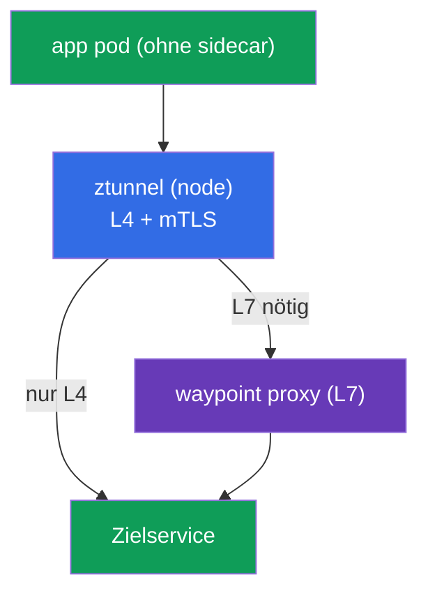
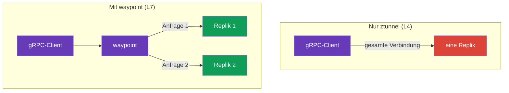
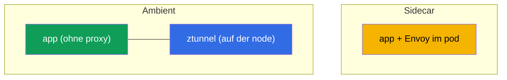
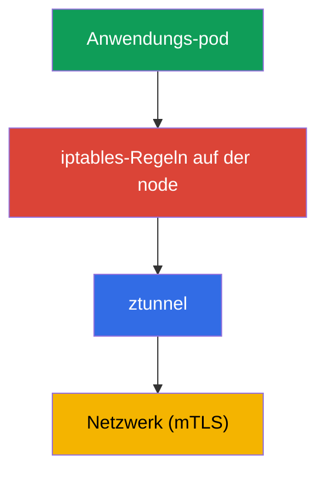
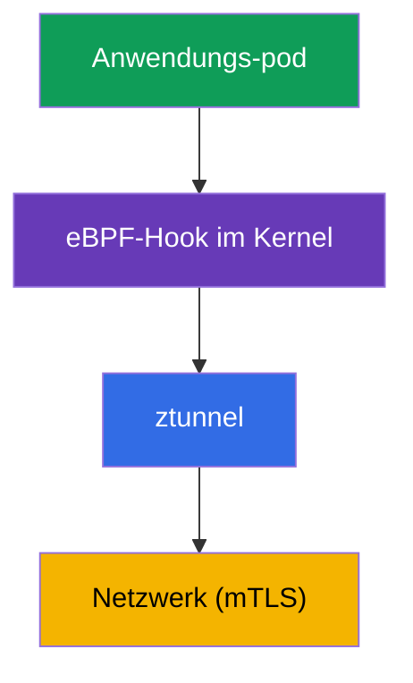

[RU version](ru.md) · [Eng version](en.md) · [Versión en español](es.md) · [Version française](fr.md)

# Kapitel 22. Ambient mode: ztunnel und waypoint proxy

> **Was kommt als Nächstes.** Den ganzen Kurs über haben wir mit dem klassischen sidecar-Modell
> gearbeitet: ein Envoy in jedem pod. Es ist mächtig, aber nicht kostenlos. Istio hat eine
> Alternative angeboten - **ambient mode**, einen Modus ohne sidecars. In diesem Kapitel
> betrachten wir, wie er aufgebaut ist: zwei Schichten (ztunnel für L4 und waypoint für L7),
> worin er sich vom sidecar unterscheidet und wann man was wählt.

## 22.1. Wozu ambient nötig ist

Das sidecar-Modell fügt jedem pod einen Envoy hinzu. Das hat einen Preis:

- **Ressourcen.** Ein proxy in jedem pod frisst CPU und Speicher - bei tausenden Pods ist das
  spürbar.
- **Updates.** Um die data plane zu aktualisieren, muss man alle Pods neu starten (sie mit dem
  neuen sidecar neu erstellen).
- **Eingriff in den pod.** Die Injektion verändert den pod, fügt einen init-Container und
  iptables hinzu - manchmal kollidiert das mit der Anwendung.

Ambient mode entfernt die sidecars aus den Pods und verlagert ihre Funktionen auf die Ebene der
node und separater proxys. Die Idee: für L7-Verarbeitung nur dort zu zahlen, wo sie wirklich
gebraucht wird, und den Basisschutz (mTLS, L4) allen günstig zu geben.

## 22.2. Zwei Schichten: ztunnel und waypoint

Die zentrale Idee von ambient ist die **Aufteilung in zwei Ebenen**:

- **ztunnel** (zero-trust tunnel) - eine leichtgewichtige Komponente, eine pro **node**
  (DaemonSet). Stellt L4 bereit: mTLS-Verschlüsselung, Identität, Basistelemetrie. Durch ihn
  läuft der Traffic aller ambient-Pods der node.
- **waypoint proxy** - ein vollwertiger Envoy für **L7** (Routing, L7-Autorisierung,
  HTTP-Manipulationen). Er ist **nicht** in jedem pod, sondern wird bei Bedarf ausgerollt - pro
  namespace oder Service, der L7 benötigt.



Der Sinn der Aufteilung: L4 (Verschlüsselung und Identität) brauchen alle und es ist günstig -
das liefert ztunnel auf der node. L7 (intelligentes Routing, Autorisierung nach HTTP) wird
dagegen nicht immer gebraucht, und dafür zahlen Sie mit einem separaten waypoint nur dort, wo er
wirklich erforderlich ist.

## 22.3. Schicht L4: ztunnel

`ztunnel` ist ein DaemonSet: ein pod pro node. Er fängt den Traffic der ambient-Pods seiner node
ab und stellt bereit:

- **mTLS** zwischen Services (Verschlüsselung und SPIFFE-Identität - wie in Kapitel 13, aber
  ohne sidecars);
- **L4-Telemetrie** (Verbindungen, Bytes, Basismetriken);
- **Transport** über ein gesichertes Overlay (Protokoll HBONE - Tunneling über HTTP).

Wichtig: ztunnel arbeitet nur auf **L4**. Er zerlegt kein HTTP, kann nicht nach Pfaden/Headern
routen und wendet keine L7-Autorisierung an. Für all das braucht man einen waypoint. Das heißt,
mit nur ztunnel aktiviert erhalten Sie bereits zero-trust mTLS für den gesamten Traffic -
kostenlos aus Sicht der Pods.

## 22.4. Schicht L7: waypoint proxy

Wenn L7-Fähigkeiten benötigt werden (Routing nach HTTP, Spiegelung, L7-Autorisierung), rollt man
einen **waypoint proxy** aus - das ist ein gewöhnlicher Envoy, aber nicht im pod der Anwendung,
sondern als separates Deployment pro namespace oder Service.

Ein waypoint wird über die Kubernetes Gateway API (erinnern Sie sich an Kapitel 11) oder mit dem
Befehl `istioctl waypoint apply` erstellt, und Services werden per Label an ihn angebunden:

```bash
# waypoint für namespace ausrollen
istioctl waypoint apply -n app

# dem Service vorgeben, über den waypoint zu gehen
kubectl label service ping-pong -n app istio.io/use-waypoint=waypoint
```

Unter der Haube erstellt `istioctl waypoint apply` eine Ressource **Gateway** des Standards
Gateway API (Kapitel 11) mit der speziellen Klasse `istio-waypoint` - man kann sie auch manuell
in GitOps beschreiben:

```yaml
apiVersion: gateway.networking.k8s.io/v1
kind: Gateway
metadata:
  name: waypoint
  namespace: app
  labels:
    istio.io/waypoint-for: service    # wofür der waypoint: service (Standard), workload, all
spec:
  gatewayClassName: istio-waypoint    # genau die waypoint-Klasse, nicht das gewöhnliche ingress
  listeners:
  - name: mesh
    port: 15008                        # HBONE-Port
    protocol: HBONE
```

Den Traffic an einen waypoint kann man auf verschiedenen Ebenen per Label
`istio.io/use-waypoint` binden:

- auf **namespace** - durch den waypoint läuft der gesamte L7-Traffic des namespace;
- auf **Service** (wie oben) - nur zu diesem Service;
- auf **pod/workload** - punktuell.

Jetzt läuft der L7-Traffic zu diesem Service durch den waypoint, und auf ihm greifen die
gewohnten `AuthorizationPolicy` der L7-Ebene, Routing und der Rest. Beispiel aus den Labs: der
waypoint erlaubt `GET`, blockiert aber `POST`/`DELETE` - genau dieselbe L7-Autorisierung wie in
Kapitel 14, nur wird sie im waypoint ausgeführt und nicht im sidecar.

## 22.5. Balancing in ambient (und der Fall gRPC)

Hier taucht ein wichtiges Detail auf, das direkt mit Kapitel 7 (Balancing) und Kapitel 10 (gRPC)
zusammenhängt. In ambient hängt das Balancing davon ab, welche Schicht den Traffic verarbeitet.

- **Nur ztunnel (L4).** ztunnel arbeitet auf Schicht 4, deshalb balanciert er **nach
  Verbindungen**: neue Verbindungen zu einem Service verteilt er auf dessen Endpoints. Für
  gewöhnliches HTTP/1.1 und kurze Verbindungen reicht das.
- **Mit waypoint (L7).** Wenn der Traffic zu einem Service über den waypoint läuft, terminiert
  dieser HTTP und balanciert **nach einzelnen Anfragen** (L7), so wie es der sidecar getan hat.

Und genau hier entsteht das aus Kapitel 10 bekannte Problem mit **gRPC**. gRPC ist HTTP/2: eine
langlebige Verbindung, in der viele Anfragen gemultiplext werden. Wenn solcher Traffic nur von
ztunnel (L4) balanciert wird, geht die ganze Verbindung auf **eine** Replik, und die Anfragen
werden nicht verteilt - genau dasselbe Übel wie mit kube-proxy.

Fazit: **für gRPC (und generell für ein faires per-request-Balancing) braucht man in ambient
einen waypoint.** Die L4-Schicht von ztunnel allein reicht nicht: sie verteilt die Verbindungen,
aber innerhalb einer einzelnen gRPC-Verbindung gibt es kein Balancing. Indem Sie einen waypoint
für den gRPC-Service ausrollen, holen Sie das per-request-Balancing zurück, das im
sidecar-Modus von Haus aus da war (dort arbeitete der Envoy im pod sofort auf L7).



## 22.6. Installation und Aktivierung von ambient

### Installation von Istio im ambient-Modus

Ambient ist ein separates **Installationsprofil**: es installiert istiod, **istio-cni** und
**ztunnel** (im sidecar-Profil gibt es sie nicht). Über istioctl:

```bash
istioctl install --set profile=ambient --skip-confirmation
```

Über Helm installiert man vier Charts: `base`, `istiod` (mit `--set profile=ambient`), `cni` und
`ztunnel`. Die waypoints (L7) sind nicht Teil der Installation - sie werden nach Bedarf
ausgerollt (Abschnitt 22.4). Auf EKS wird istio-cni über VPC CNI/Cilium (Kapitel 27) aktiviert.

### Aktivierung von ambient auf einem namespace

Ambient wird per Label auf dem namespace aktiviert (anstelle von `istio-injection=enabled` aus
der sidecar-Welt):

```bash
kubectl label namespace app istio.io/dataplane-mode=ambient
```

Was wichtig zu verstehen ist:

- Danach bekommen die Pods des namespace **keinen sidecar** - sie bleiben, wie sie sind (`1/1`,
  ohne istio-proxy). Ihren Traffic übernimmt ztunnel auf der node.
- Die Pods müssen **nicht** neu gestartet werden - anders als bei der sidecar-Injektion. Das ist
  einer der Hauptvorteile: die Aktivierung von ambient rührt laufende Pods nicht an.
- L4 mTLS beginnt sofort zu funktionieren. L7-Funktionen fügen Sie separat hinzu, indem Sie
  einen waypoint ausrollen (Abschnitt 22.4) - nur dort, wo er nötig ist.

Ambient erfordert ein installiertes **istio-cni** (Kapitel 27) - genau es richtet das Abfangen
des Traffics zu ztunnel ein. Auf EKS funktioniert das über dem regulären **VPC CNI** (istio-cni
reiht sich in die Kette ein) oder über **Cilium**; prüfen Sie bei der Wahl des CNI die
Kompatibilität mit der Istio-Version.

### Migration sidecar → ambient

Man kann schrittweise umziehen, namespace für namespace - sidecar und ambient sind in einem mesh
kompatibel (Abschnitt 22.9). Für einen namespace:

1. Sicherstellen, dass ambient installiert ist (istio-cni + ztunnel) - siehe oben.
2. Dem namespace das Label der sidecar-Injektion entfernen und ambient setzen:

   ```bash
   kubectl label namespace app istio-injection-               # sidecar-Injektion entfernen
   kubectl label namespace app istio.io/dataplane-mode=ambient
   ```

3. Die Pods neu starten, um den sidecar aus ihnen zu entfernen:

   ```bash
   kubectl rollout restart deployment -n app
   ```

   Nach dem Neustart werden die Pods `1/1` (ohne istio-proxy), und ihren Traffic übernimmt
   ztunnel.
4. Für Services, die L7 benötigen (Routing, L7-Autorisierung, per-request-Balancing von gRPC),
   einen **waypoint** ausrollen (Abschnitt 22.4) - im sidecar lebten diese Funktionen im pod, in
   ambient übernimmt sie der waypoint.

Zentrales Detail: der pod wird **einmal** neu gestartet (um den sidecar zu entfernen), während
die Aktivierung von ambient „von null“ keinen Neustart erfordert. mTLS und identity bleiben
erhalten (gemeinsamer trust, Kapitel 13), deshalb kommunizieren während der Migration sidecar-
und ambient-Workloads weiter ohne Unterbrechungen.

## 22.7. Bedrohungsmodell und Einschränkungen von ambient

Ambient dreht sich nicht nur um Einsparung; es hat seine eigenen Grenzen und sein eigenes
Sicherheitsprofil, die man vor der Wahl für die Produktion verstehen muss.

### Ztunnel und die Kompromittierung einer node

Erinnern Sie sich an das Bedrohungsmodell aus Kapitel 13 (§13.11): im sidecar-Modus liegt der
private Schlüssel eines workload in **dessen eigenem** Envoy, deshalb legt root auf einer node
nur die Identitäten der Pods offen, die auf dieser node laufen. In ambient verschiebt sich das
Bild: **ztunnel ist einer pro node und hält die mTLS-Identitäten aller ambient-Pods dieser
node**. Daraus ein wichtiger Trade-off:

- Die Kompromittierung einer node oder des **ztunnel** selbst legt potenziell die Identitäten
  **aller ambient-Workloads der node** auf einmal offen - der Wirkungsradius pro node ist breiter
  als bei einem einzelnen sidecar.
- Also ist ztunnel eine privilegierte Komponente, und ihr Schutz ist kritisch: minimaler Zugang
  zu den nodes, Isolation wertvoller Workloads auf separaten nodes (wie in 13.11),
  Runtime-Erkennung, aktuelle Patches.

Das heißt nicht „ambient ist weniger sicher“ - mTLS und Zero Trust liefert es genauso. Aber der
Konzentrationspunkt der Schlüssel verschiebt sich vom pod auf die node, und das muss man im
Bedrohungsmodell berücksichtigen (dieselbe Defense-in-Depth: nicht aus dem Container ausbrechen
und die node übernehmen lassen - Domäne CKS).

### Einschränkungen von ambient

Ambient entwickelt sich schnell, aber im Vergleich zum reifen sidecar gibt es Details:

- **Feature-Parität ist nicht vollständig.** Ein Teil feiner sidecar-Szenarien (manche
  `EnvoyFilter`, spezifische per-pod-Einstellungen) funktioniert in ambient anders oder ist noch
  nicht verfügbar - prüfen Sie es für Ihren Fall.
- **Multicluster ist neuer.** Multicluster-ambient ist weniger erprobt als
  sidecar-Multicluster (Kapitel 28); für komplexe Topologien berücksichtigt man das.
- **Zusätzlicher Hop auf L7.** Traffic über den waypoint ist ein zusätzlicher Netzwerksprung
  (pod → ztunnel → waypoint → Ziel); für L4-only gibt es ihn nicht, aber dort, wo L7 nötig ist,
  ist die Latenz etwas höher als bei „Envoy direkt im pod“.
- **Anderes troubleshooting.** Der Traffic-Pfad (ztunnel/HBONE/waypoint) und die Werkzeuge
  unterscheiden sich vom gewohnten sidecar - das Team muss umlernen.

## 22.8. Sidecar oder ambient



| | Sidecar | Ambient |
|---|---------|---------|
| Proxy | in jedem pod | ztunnel auf der node + waypoint bei Bedarf |
| Ressourcen | höher (proxy pro pod) | niedriger (besonders für L4-only) |
| Update der data plane | Neustart der Pods | ohne Neustart der Pods |
| L7-Funktionen | immer im sidecar verfügbar | waypoint nötig |
| Reife | viele Jahre in Produktion | neuer, entwickelt sich schnell |

Praktische Orientierung:

- **Sidecar** - die zeiterprobte Wahl, alle Möglichkeiten sofort; passt, wenn das Modell zu
  Ihnen passt und der Overhead akzeptabel ist.
- **Ambient** - wenn Ressourceneinsparung und Einfachheit der Updates wichtig sind, viele
  Services vorhanden sind und L7 nicht alle brauchen. Besonders interessant, wenn dem größten
  Teil der Services L4 mTLS reicht.

Im Kurs haben wir am sidecar gelernt, weil er anschaulicher und für den Einstieg vollständiger
ist. Aber ambient ist die Richtung, in die sich Istio bewegt, und man sollte es unbedingt kennen.

## 22.9. Kann man sidecar und ambient kombinieren

Ja, das geht. Istio unterstützt einen **gemischten Modus**: in einem mesh arbeitet ein Teil der
Workloads mit sidecars, ein Teil in ambient, und sie **kommunizieren normal miteinander**. Beide
Modi nutzen ein istiod und einen gemeinsamen trust (dieselbe SPIFFE-Identität und mTLS aus
Kapitel 13), deshalb kann ein sidecar-Service einen ambient-Service aufrufen und umgekehrt -
Istio übernimmt das Zusammenspiel.

Die Wahl des Modus erfolgt auf Ebene des namespace (oder eines einzelnen workload): einen
namespace markieren Sie mit `istio-injection=enabled` (sidecar), einen anderen mit
`istio.io/dataplane-mode=ambient`. Wichtige Einschränkung: **ein und derselbe pod kann nicht
gleichzeitig mit sidecar und in ambient sein** - hat ein pod einen sidecar, fängt ztunnel ihn
nicht ab.

**Vorteile des gemischten Modus:**

- **Sanfte Migration.** Man muss nicht den ganzen cluster auf einmal umstellen. Man kann
  namespace für namespace von sidecar auf ambient umziehen, ohne etwas zu zerbrechen.
- **Wahl nach Aufgabe.** Dort, wo Ressourceneinsparung wichtig ist und L4 reicht - ambient; dort,
  wo sidecar-spezifische Möglichkeiten nötig sind oder bereits alles eingespielt ist - sidecar
  belassen.
- **Kompatibilität bleibt erhalten.** Die Kommunikation zwischen den Modi funktioniert
  transparent, einheitliches mTLS.

**Nachteile:**

- **Betriebskomplexität.** Zwei data-plane-Modelle in einem cluster: beide muss man verstehen,
  debuggen und betreiben.
- **Schwierigeres troubleshooting.** Der Traffic-Pfad und die Diagnosewerkzeuge unterscheiden
  sich für sidecar und ambient - in einem gemischten cluster erzeugt das zusätzliche Verwirrung.
- **Unterschiede in den Möglichkeiten.** Der Feature-Satz von sidecar und ambient deckt sich
  nicht vollständig; man muss im Kopf behalten, was wo verfügbar ist.

**Praktisches Fazit:** der gemischte Modus ist vor allem als **Migrationsweg** und für punktuelle
Ausnahmen gut. Langfristig streben Sie Einheitlichkeit an - so ist der Betrieb einfacher. Und
denken Sie daran: sidecar und ambient gleichzeitig auf einem pod - das geht nicht.

## 22.10. eBPF in Istio

Das Gespräch über ambient führt fast immer zu **eBPF**, deshalb betrachten wir ausführlich, was
das ist, wie es die Arbeit des mesh verändert und worin die Vorteile und Fallstricke liegen.

**eBPF** (extended Berkeley Packet Filter) - eine Technologie, die es erlaubt, kleine sichere
Programme **direkt im Linux-Kernel** auszuführen, ohne dessen Code zu ändern und ohne Module zu
bauen. Der Kernel führt sie in einer Sandbox bei bestimmten Ereignissen aus: ein Netzwerkpaket
kam an, ein Systemaufruf wurde ausgeführt, eine Verbindung wurde geöffnet. eBPF wird breit für
Netzwerk, Observability und Sicherheit genutzt - es ist die Grundlage von Cilium.

### Wie der Traffic auf den proxy gelangt: iptables gegen eBPF

Um die Rolle von eBPF zu verstehen, sehen wir uns den **Abfangmechanismus** des Traffics an.
Sowohl im sidecar als auch in ambient muss der Traffic der Anwendung zum proxy (Envoy oder
ztunnel) „umgeleitet“ werden. Die Frage ist - wie genau der Kernel das tut.

**Der klassische Weg - iptables.** Beim Start des pod werden iptables-Regeln eingerichtet, die
den Traffic der Anwendung auf den proxy umleiten (Kapitel 4). In ambient wird dasselbe getan, um
auf ztunnel umzuleiten.



**Der Weg mit eBPF.** Anstelle von iptables-Ketten übernimmt die Umleitung ein eBPF-Programm,
das an die Netzwerk-Hooks des Kernels angebunden ist. Das Paket wird direkt im Kernel auf
ztunnel umgeleitet, ohne sperrige iptables-Regeln und unnötige Übergänge.



Der Unterschied liegt im Abfangglied: `iptables` gegen `eBPF-Hook`. Danach geht der Traffic
genauso zu ztunnel und wird verschlüsselt - eBPF ändert, **wie wir abfangen**, nicht wohin.

Wo das in Istio vorkommt:

- **istio-cni** (Kapitel 27) kann für die Umleitung den eBPF-Modus statt iptables nutzen.
- **Cilium als CNI** (Kapitel 1, 14) macht L3/L4 und das Abfangen per eBPF im Kernel, und Istio
  übernimmt L7. Eine beliebte Kombination, auch für ambient.

### Nutzen

- **Performance.** Weniger Übergänge zwischen user space und Kernel und kein Overhead für lange
  iptables-Ketten - niedrigere Latenz und Last auf der data plane.
- **Einfacherer pod.** Es sind keine iptables-Regeln und kein privilegierter init-Container in
  jedem pod nötig - das Abfangen wird auf Ebene der node/des Kernels eingerichtet. Das ist auch
  ein Plus für die Sicherheit (weniger Privilegien der Pods).
- **Skalierung.** iptables skaliert schlecht bei tausenden Regeln; eBPF-Mechanismen sind
  effizienter aufgebaut.

### Fallstricke

- **Schwierigeres troubleshooting.** Das ist der Hauptpunkt. Gewohnte Werkzeuge helfen nicht:
  `iptables -L` zeigt nichts, weil die Umleitung in eBPF-Programmen des Kernels lebt und nicht in
  iptables-Tabellen. Man braucht eBPF-bewusste Werkzeuge (`bpftool`, Cilium-Mittel, `pwru` zum
  Tracen von Paketen). Wissen über die Fehlersuche via iptables ist hier nicht anwendbar - das
  ist eine neue Fertigkeit.
- **Kernel-Anforderungen.** eBPF-Funktionen hängen von der Linux-Kernel-Version ab; auf alten
  Kerneln ist ein Teil der Möglichkeiten nicht verfügbar. Auf managed-Plattformen prüfen Sie die
  Kernel-Version der nodes.
- **Reife und Kompatibilität.** Die eBPF-data-plane für ambient entwickelt sich aktiv; Verhalten
  und Möglichkeiten hängen von den Versionen von Istio, CNI und Kernel ab. Die Kompatibilität mit
  einem konkreten CNI muss man prüfen.
- **Weniger vertraute Werkzeuge.** Das Fehlersuche-Ökosystem von iptables/tcpdump ist reich und
  vertraut; das eBPF-Werkzeug ist mächtig, erfordert aber eigene Einarbeitung.

### Wichtiger Vorbehalt: eBPF ersetzt Envoy nicht

**eBPF ersetzt den proxy für L7 nicht.** Intelligentes Routing, retries, L7-Autorisierung,
reiche Metriken - all das macht weiterhin Envoy im user space. eBPF optimiert die „Wasserleitung“
(Abfangen, L4-Verarbeitung), aber die L7-Funktionen des mesh bleiben Sache des proxy - sei es
sidecar, ztunnel+waypoint oder Cilium+Envoy. Ein vollständig „proxy-loses“ eBPF-mesh existiert
nur auf L4-Ebene.

Wohin es sich bewegt: weniger iptables, mehr eBPF in der data plane, günstigeres Abfangen - und
ambient ist einer der Hauptnutznießer. Aber für die Performance zahlen Sie mit schwierigerer
Fehlersuche, deshalb muss das Team die eBPF-Werkzeuge beherrschen, bevor es sich auf eine solche
data plane in der Produktion verlässt.

## 22.11. Zusammenfassung des Kapitels

- **Ambient mode** - ein Modus ohne sidecars: die Funktionen von Envoy werden aus den Pods auf
  die Ebene der node und separater proxys verlagert.
- **ztunnel** - ein DaemonSet pro node, liefert L4: mTLS, Identität, Basistelemetrie über ein
  Overlay (HBONE). Arbeitet für alle ambient-Pods und versteht kein HTTP.
- **waypoint proxy** - ein separater Envoy für L7 (Routing, L7-Autorisierung), wird bei Bedarf
  pro namespace/Service ausgerollt, nicht in jedem pod.
- Wird per Label `istio.io/dataplane-mode=ambient` aktiviert; die Pods werden **nicht** neu
  gestartet und bekommen keinen sidecar; L4 mTLS funktioniert sofort, L7 wird über einen waypoint
  hinzugefügt.
- Ambient ist ein separates **Installationsprofil** (`istioctl install --set profile=ambient`:
  istiod + istio-cni + ztunnel). Die Migration sidecar→ambient läuft pro namespace: das
  Injektions-Label entfernen, `dataplane-mode=ambient` setzen, die Pods neu starten (einmal), für
  L7 - einen waypoint ausrollen.
- Ambient spart Ressourcen und vereinfacht Updates; sidecar ist erprobt und sofort
  voll funktionsfähig. Die Wahl hängt vom Bedarf an L7 und den Anforderungen an Ressourcen ab.
- Balancing: ztunnel (L4) verteilt nach Verbindungen, waypoint (L7) - nach Anfragen. Für gRPC
  braucht man einen waypoint, sonst klebt die ganze Verbindung an einer Replik (wie mit
  kube-proxy).
- Sidecar und ambient lassen sich in einem mesh kombinieren (gemeinsamer trust und mTLS) -
  praktisch für die Migration und die Wahl nach Aufgabe; Nachteil ist der komplexere Betrieb. Ein
  pod kann nicht gleichzeitig mit sidecar und in ambient sein.
- Das Bedrohungsmodell verschiebt sich: **ztunnel ist einer pro node und hält die Schlüssel aller
  ambient-Pods der node**, deshalb legt die Übernahme der node/des ztunnel sie alle auf einmal
  offen (breiter als sidecar, §13.11) - ztunnel muss man besonders schützen.
- Einschränkungen von ambient: unvollständige Feature-Parität mit sidecar, neueres Multicluster,
  zusätzlicher Hop auf L7 (über den waypoint), anderes troubleshooting. Erfordert istio-cni (auf
  EKS über VPC CNI/Cilium).
- **eBPF** ändert den Abfangmechanismus des Traffics (eBPF-Hook im Kernel statt iptables):
  schneller, weniger Privilegien der Pods, bessere Skalierung. Aber L7 (Routing, authz, Metriken)
  macht weiterhin Envoy - eBPF optimiert die data plane, ersetzt aber nicht den proxy.
- Der Preis für eBPF ist **schwieriges troubleshooting**: `iptables -L` ist nutzlos, man braucht
  eBPF-Werkzeuge (bpftool, Cilium-Mittel), neue Anforderungen an die Kernel-Version.

## 22.12. Fragen zur Selbstüberprüfung

1. Welche Nachteile des sidecar-Modells löst ambient?
2. Wofür ist ztunnel zuständig und warum arbeitet er nur auf L4?
3. Wann und wozu braucht man einen waypoint proxy? Wodurch unterscheidet er sich vom sidecar?
4. Wie aktiviert man ambient und warum muss man die Pods dabei nicht neu starten?
5. In welchen Fällen wählt man ambient und in welchen bleibt man beim sidecar?
6. Wie wird der Traffic in ambient balanciert und warum braucht man für gRPC einen waypoint?
7. Kann man sidecar und ambient in einem mesh kombinieren? Welche Vorteile, Nachteile und welche
   Haupteinschränkung gibt es?
8. Was ist eBPF und wie wird es in Istio genutzt? Ersetzt eBPF Envoy für L7?
9. Wodurch unterscheidet sich das Abfangen des Traffics via eBPF von iptables? Welchen Nutzen und
   welche Fallstricke (insbesondere beim troubleshooting) bringt das mit sich?
10. Wie ändert sich das Bedrohungsmodell in ambient wegen ztunnel? Warum ist die Übernahme einer
    node gefährlicher als im sidecar, und was tut man dagegen?
11. Nennen Sie die Einschränkungen von ambient im Vergleich zum reifen sidecar.
12. Wie installiert man Istio im ambient-Modus (welches Profil, welche Komponenten) und wie
    migriert man einen namespace von sidecar auf ambient? Warum ist bei der Migration ein
    einmaliger Neustart der Pods nötig?

## Praxis

Üben Sie den ambient mode (data plane ohne sidecars) und L4 mTLS:

🧪 Lab 09: [tasks/ica/labs/09](../../labs/09/README_DE.MD)

Üben Sie den waypoint proxy und die L7-Autorisierung in ambient:

🧪 Lab 24: [tasks/ica/labs/24](../../labs/24/README_DE.MD)

---
[Inhaltsverzeichnis](../README_DE.md) · [Kapitel 21](../21/de.md) · [Kapitel 23](../23/de.md)
