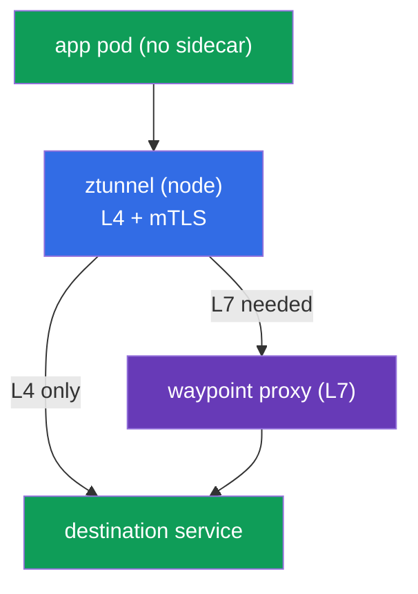
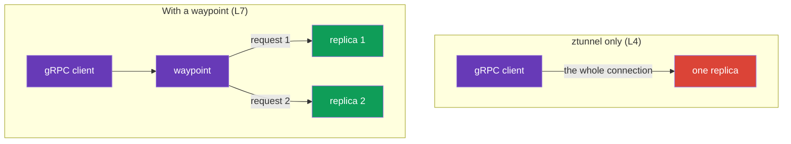
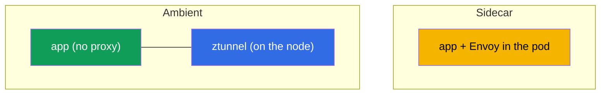
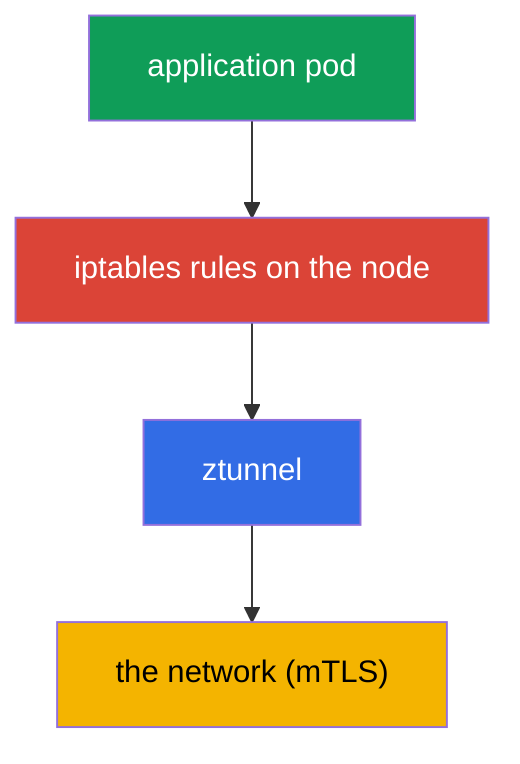
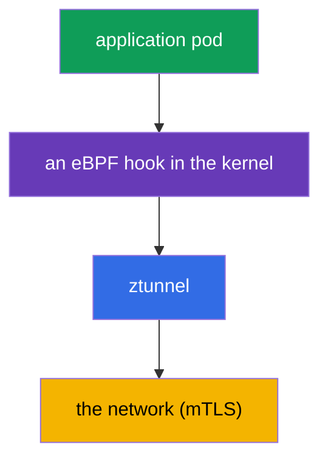

[RU version](ru.md) · [Versión en español](es.md) · [Version française](fr.md) · [Deutsche Version](de.md)

# Chapter 22. Ambient mode: ztunnel and the waypoint proxy

> **What's next.** Throughout the course we worked with the classic sidecar model: an Envoy in
> every pod. It is powerful but not free. Istio offered an alternative - **ambient mode**, a mode
> without sidecars. In this chapter we look at how it is built: two layers (ztunnel for L4 and
> waypoint for L7), how it differs from sidecar and when to choose what.

## 22.1. Why ambient is needed

The sidecar model adds an Envoy to every pod. This has a cost:

- **Resources.** A proxy in every pod eats CPU and memory - on thousands of pods this is
  noticeable.
- **Updates.** To update the data plane you have to restart all the pods (recreate them with the new
  sidecar).
- **Intrusion into the pod.** Injection changes the pod, adds an init container, iptables -
  sometimes this conflicts with the application.

Ambient mode removes the sidecars from the pods and moves their functions to the node level and to
separate proxies. The idea: pay for L7 processing only where it is actually needed, and give the
basic protection (mTLS, L4) to everyone cheaply.

## 22.2. Two layers: ztunnel and waypoint

The key idea of ambient is **the split into two levels**:

- **ztunnel** (zero-trust tunnel) - a lightweight component, one per **node** (a DaemonSet). It
  provides L4: mTLS encryption, identity, basic telemetry. The traffic of all the node's ambient
  pods goes through it.
- **waypoint proxy** - a full-fledged Envoy for **L7** (routing, L7 authorization, HTTP
  manipulations). It is **not** in every pod but is deployed on demand - per namespace or service
  that needs L7.



The point of the split: L4 (encryption and identity) is needed by everyone and is cheap - it is
provided by the ztunnel on the node. And L7 (smart routing, HTTP authorization) is not always
needed, and you pay for it with a separate waypoint only where it is actually required.

## 22.3. The L4 layer: ztunnel

`ztunnel` is a DaemonSet: one pod per node. It intercepts the traffic of its node's ambient pods and
provides:

- **mTLS** between services (encryption and SPIFFE identity - as in chapter 13, but without
  sidecars);
- **L4 telemetry** (connections, bytes, basic metrics);
- **transport** over a secure overlay (the HBONE protocol - tunneling over HTTP).

Important: ztunnel works only at **L4**. It does not parse HTTP, cannot route by paths/headers and
does not apply L7 authorization. For all this a waypoint is needed. That is, by enabling only
ztunnel you already get zero-trust mTLS for all traffic - free from the pods' point of view.

## 22.4. The L7 layer: the waypoint proxy

When L7 capabilities are needed (routing by HTTP, mirroring, L7 authorization), you deploy a
**waypoint proxy** - it is an ordinary Envoy, but not in the application's pod, rather a separate
deployment per namespace or service.

A waypoint is created via the Kubernetes Gateway API (remember chapter 11) or with the `istioctl
waypoint apply` command, and services attach to it with a label:

```bash
# deploy a waypoint for a namespace
istioctl waypoint apply -n app

# tell a service to go through the waypoint
kubectl label service ping-pong -n app istio.io/use-waypoint=waypoint
```

Under the hood `istioctl waypoint apply` creates a **Gateway** resource of the Gateway API standard
(chapter 11) with the special class `istio-waypoint` - it can also be described by hand in GitOps:

```yaml
apiVersion: gateway.networking.k8s.io/v1
kind: Gateway
metadata:
  name: waypoint
  namespace: app
  labels:
    istio.io/waypoint-for: service    # what the waypoint is for: service (default), workload, all
spec:
  gatewayClassName: istio-waypoint    # the waypoint class specifically, not the ordinary ingress
  listeners:
  - name: mesh
    port: 15008                        # the HBONE port
    protocol: HBONE
```

Traffic can be bound to a waypoint at different levels with the `istio.io/use-waypoint` label:

- on a **namespace** - all the namespace's L7 traffic goes through the waypoint;
- on a **service** (as above) - only to this service;
- on a **pod/workload** - surgically.

Now the L7 traffic to this service goes through the waypoint, and on it the familiar L7-level
`AuthorizationPolicy`, routing and so on work. An example from the labs: the waypoint allows `GET`
but blocks `POST`/`DELETE` - exactly the same L7 authorization as in chapter 14, only executed in
the waypoint rather than in the sidecar.

## 22.5. Balancing in ambient (and the gRPC case)

Here an important nuance surfaces that is directly linked to chapters 7 (balancing) and 10 (gRPC).
In ambient, balancing depends on which layer handles the traffic.

- **ztunnel only (L4).** ztunnel works at layer 4, so it balances **by connections**: it spreads new
  connections to a service across its endpoints. For ordinary HTTP/1.1 and short connections this is
  enough.
- **With a waypoint (L7).** When the traffic to a service goes through a waypoint, it terminates HTTP
  and balances **per individual request** (L7), as the sidecar did.

And here the problem familiar from chapter 10 arises with **gRPC**. gRPC is HTTP/2: a single
long-lived connection in which many requests are multiplexed. If such traffic is balanced only by
ztunnel (L4), the whole connection goes to **one** replica, and the requests are not distributed -
exactly the same trouble as with kube-proxy.

The conclusion: **for gRPC (and generally for fair per-request balancing) in ambient you need a
waypoint.** The ztunnel L4 layer alone is not enough: it will spread the connections, but within one
gRPC connection there will be no balancing. By deploying a waypoint for the gRPC service you restore
the per-request balancing that in the sidecar mode was out of the box (there the Envoy in the pod
worked at L7 right away).



## 22.6. Installing and enabling ambient

### Installing Istio in ambient mode

Ambient is a separate **installation profile**: it installs istiod, **istio-cni** and **ztunnel**
(the sidecar profile does not have them). Via istioctl:

```bash
istioctl install --set profile=ambient --skip-confirmation
```

Via Helm you install four charts: `base`, `istiod` (with `--set profile=ambient`), `cni` and
`ztunnel`. Waypoints (L7) are not part of the installation - they are deployed as needed (section
22.4). On EKS istio-cni is plugged in on top of the VPC CNI/Cilium (chapter 27).

### Enabling ambient on a namespace

Ambient is enabled with a label on the namespace (instead of `istio-injection=enabled` from the
sidecar world):

```bash
kubectl label namespace app istio.io/dataplane-mode=ambient
```

What is important to understand:

- After this the namespace's pods **do not get a sidecar** - they stay as they are (`1/1`, no
  istio-proxy). Their traffic is picked up by the ztunnel on the node.
- The pods **do not need to be restarted** - unlike sidecar injection. This is one of the main
  conveniences: enabling ambient does not touch the running pods.
- L4 mTLS starts working right away. L7 functions you add separately by deploying a waypoint
  (section 22.4) - only where it is needed.

Ambient requires **istio-cni** to be installed (chapter 27) - it is what sets up the traffic
interception to the ztunnel. On EKS this works on top of the standard **VPC CNI** (istio-cni is
plugged into the chain) or on top of **Cilium**; when choosing a CNI, check compatibility with the
Istio version.

### Migrating sidecar → ambient

You can move gradually, namespace by namespace - sidecar and ambient are compatible in one mesh
(section 22.9). For one namespace:

1. Make sure ambient is installed (istio-cni + ztunnel) - see above.
2. Remove the sidecar-injection label from the namespace and add the ambient one:

   ```bash
   kubectl label namespace app istio-injection-               # remove sidecar injection
   kubectl label namespace app istio.io/dataplane-mode=ambient
   ```

3. Restart the pods to remove the sidecar from them:

   ```bash
   kubectl rollout restart deployment -n app
   ```

   After the restart the pods become `1/1` (no istio-proxy), and their traffic is picked up by the
   ztunnel.
4. For services that need L7 (routing, L7 authorization, per-request gRPC balancing), deploy a
   **waypoint** (section 22.4) - in sidecar these functions lived in the pod, in ambient the
   waypoint performs them.

The key nuance: a pod is restarted **once** (to remove the sidecar), whereas enabling ambient "from
scratch" needs no restart. mTLS and identity are preserved (a common trust, chapter 13), so during
the migration the sidecar and ambient workloads keep communicating without interruption.

## 22.7. The threat model and limitations of ambient

Ambient is not only about savings; it has its own boundaries and its own security profile that you
must understand before choosing it for production.

### Ztunnel and node compromise

Recall the threat model from chapter 13 (§13.11): in the sidecar mode a workload's private key lives
in **its own** Envoy, so root on a node exposes the identities only of the pods that run on that
node. In ambient the picture shifts: **the ztunnel is one per node and holds the mTLS identities of
all the node's ambient pods**. Hence an important trade-off:

- Compromise of the node or of the **ztunnel** itself potentially exposes the identities of **all
  the node's ambient workloads** at once - the per-node blast radius is wider than that of a single
  sidecar.
- So the ztunnel is a privileged component, and protecting it is critical: minimal node access,
  isolation of valuable workloads onto separate nodes (as in 13.11), runtime detection, fresh
  patches.

This is not "ambient is less secure" - it provides mTLS and Zero Trust just the same. But the point
of key concentration shifts from the pod to the node, and this must be accounted for in the threat
model (the same defense-in-depth: prevent escaping the container and taking over the node - the CKS
domain).

### Limitations of ambient

Ambient is developing quickly, but compared with the mature sidecar there are nuances:

- **Feature parity is not complete.** Some subtle sidecar scenarios (certain `EnvoyFilter`s,
  specific per-pod settings) work differently or are not yet available in ambient - check for your
  case.
- **Multicluster is newer.** Multicluster ambient is less battle-tested than sidecar multicluster
  (chapter 28); this is taken into account for complex topologies.
- **An extra hop at L7.** Traffic through a waypoint is an additional network hop (pod → ztunnel →
  waypoint → destination); for L4-only there is none, but where L7 is needed the latency is a bit
  higher than with "Envoy right in the pod".
- **Different troubleshooting.** The traffic path (ztunnel/HBONE/waypoint) and the tools differ from
  the familiar sidecar - the team needs to relearn.

## 22.8. Sidecar or ambient



| | Sidecar | Ambient |
|---|---------|---------|
| Proxy | in every pod | ztunnel on the node + waypoint on demand |
| Resources | higher (a proxy per pod) | lower (especially for L4-only) |
| Data plane update | a pod restart | without a pod restart |
| L7 functions | always available in the sidecar | a waypoint is needed |
| Maturity | many years in production | newer, developing quickly |

The practical guideline:

- **Sidecar** - the time-tested choice, all capabilities right away; suitable if the model works for
  you and the overhead is acceptable.
- **Ambient** - when resource savings and simple updates matter, there are many services, and L7 is
  not needed by everyone. It is especially interesting if L4 mTLS is enough for most services.

In the course we learned on sidecar, because it is more illustrative and more complete for a start.
But ambient is the direction Istio is heading, and it is definitely worth knowing.

## 22.9. Can you combine sidecar and ambient

Yes, you can. Istio supports a **mixed mode**: in one mesh some workloads run with sidecars, some in
ambient, and they **communicate with each other normally**. Both modes use one istiod and a common
trust (the same SPIFFE identity and mTLS from chapter 13), so a sidecar service can call an ambient
service and vice versa - Istio takes on the interoperability.

The choice of mode is at the namespace level (or a separate workload): one namespace you mark
`istio-injection=enabled` (sidecar), another `istio.io/dataplane-mode=ambient`. An important
limitation: **the same pod cannot be both with a sidecar and in ambient at once** - if a pod has a
sidecar, ztunnel does not intercept it.

**Pros of the mixed mode:**

- **A smooth migration.** You do not need to move the whole cluster at once. You can migrate from
  sidecar to ambient namespace by namespace, without breaking anything.
- **Choice per task.** Where resource savings matter and L4 is enough - ambient; where
  sidecar-specific capabilities are needed or everything is already tuned - leave sidecar.
- **Compatibility is preserved.** Communication between the modes works transparently, a single
  mTLS.

**Cons:**

- **Operational complexity.** Two data plane models in one cluster: you must understand, debug and
  maintain both.
- **Harder troubleshooting.** The traffic path and the diagnostic tools differ for sidecar and
  ambient - in a mixed cluster this adds confusion.
- **Differences in capabilities.** The feature sets of sidecar and ambient do not fully coincide;
  you have to keep in mind what is available where.

**The practical conclusion:** the mixed mode is good primarily as a **migration path** and for
pointed exceptions. In the long run aim for uniformity - it is easier to operate. And remember:
sidecar and ambient on one pod at the same time - not allowed.

## 22.10. eBPF in Istio

A conversation about ambient almost always leads to **eBPF**, so let us go through in detail what it
is, how it changes the mesh's operation, and what the pros and pitfalls are.

**eBPF** (extended Berkeley Packet Filter) is a technology that allows running small safe programs
**right in the Linux kernel**, without changing its code and without building modules. The kernel
runs them in a sandbox on certain events: a network packet arrived, a system call was executed, a
connection was opened. eBPF is widely used for networking, observability and security - it is the
basis of Cilium.

### How traffic reaches the proxy: iptables vs eBPF

To understand eBPF's role, let us look at the **interception mechanism** of the traffic. Both in
sidecar and in ambient the application's traffic has to be "diverted" to the proxy (Envoy or
ztunnel). The question is exactly how the kernel does this.

**The classic way - iptables.** At pod startup iptables rules are set up that redirect the
application's traffic to the proxy (chapter 4). In ambient the same is done to redirect to the
ztunnel.



**The eBPF way.** Instead of iptables chains the redirection is done by an eBPF program hooked into
the kernel's network hooks. The packet is diverted to the ztunnel right in the kernel, without bulky
iptables rules and extra transitions.



The difference is in the interception link: `iptables` vs an `eBPF hook`. Further on the traffic
still goes to the ztunnel and is encrypted - eBPF changes **how we intercept**, not where.

Where this shows up in Istio:

- **istio-cni** (chapter 27) can use the eBPF mode for the redirect instead of iptables.
- **Cilium as the CNI** (chapters 1, 14) does L3/L4 and interception on eBPF in the kernel, while
  Istio takes L7. A popular pairing, including for ambient.

### The benefit

- **Performance.** Fewer transitions between user space and the kernel and no overhead from long
  iptables chains - lower latency and load on the data plane.
- **A simpler pod.** No iptables rules and no privileged init container are needed in every pod -
  the interception is set up at the node/kernel level. This is also a plus for security (fewer
  privileges for the pods).
- **Scale.** iptables scales poorly with thousands of rules; the eBPF mechanisms are built more
  efficiently.

### The pitfalls

- **Harder troubleshooting.** This is the main one. The familiar tools will not help: `iptables -L`
  will show nothing, because the redirection lives in the kernel's eBPF programs, not in the
  iptables tables. You need eBPF-aware tools (`bpftool`, Cilium's tools, `pwru` for packet tracing).
  Knowledge of debugging via iptables does not apply here - it is a new skill.
- **Kernel requirements.** The eBPF features depend on the Linux kernel version; on old kernels some
  capabilities are unavailable. On managed platforms check the nodes' kernel version.
- **Maturity and compatibility.** The eBPF data plane for ambient is developing actively; the
  behavior and capabilities depend on the versions of Istio, the CNI and the kernel. Compatibility
  with a specific CNI needs to be checked.
- **Fewer familiar tools.** The iptables/tcpdump debugging ecosystem is rich and familiar; the eBPF
  toolset is powerful but requires separate mastering.

### An important caveat: eBPF does not replace Envoy

**eBPF does not replace the proxy for L7.** Smart routing, retries, L7 authorization, rich metrics -
all this is still done by Envoy in user space. eBPF optimizes the "plumbing" (interception, L4
processing), but the mesh's L7 functions remain with the proxy - be it a sidecar, ztunnel+waypoint
or Cilium+Envoy. A fully "proxyless" eBPF mesh exists only at the L4 level.

Where this is heading: less iptables, more eBPF in the data plane, cheaper interception - and
ambient is one of the main beneficiaries. But for the performance you pay with more complex
debugging, so the team must master the eBPF tools before relying on such a data plane in production.

## 22.11. Chapter summary

- **Ambient mode** is a mode without sidecars: Envoy's functions are moved out of the pods to the
  node level and to separate proxies.
- **ztunnel** is a DaemonSet per node, provides L4: mTLS, identity, basic telemetry over an overlay
  (HBONE). It works for all ambient pods and does not understand HTTP.
- **The waypoint proxy** is a separate Envoy for L7 (routing, L7 authorization), deployed on demand
  per namespace/service rather than in every pod.
- It is enabled with the `istio.io/dataplane-mode=ambient` label; the pods **are not restarted** and
  do not get a sidecar; L4 mTLS works right away, L7 is added via a waypoint.
- Ambient is a separate **installation profile** (`istioctl install --set profile=ambient`: istiod +
  istio-cni + ztunnel). The sidecar→ambient migration goes namespace by namespace: remove the
  injection label, add `dataplane-mode=ambient`, restart the pods (once), and deploy a waypoint for
  L7.
- Ambient saves resources and simplifies updates; sidecar is proven and fully-featured right away.
  The choice depends on the need for L7 and the resource requirements.
- Balancing: ztunnel (L4) spreads by connections, the waypoint (L7) by requests. For gRPC a waypoint
  is needed, otherwise the whole connection sticks to one replica (as with kube-proxy).
- Sidecar and ambient can be combined in one mesh (a common trust and mTLS) - convenient for
  migration and choice per task; the downside is more complex operation. One pod cannot be both with
  a sidecar and in ambient at once.
- The threat model shifts: **one ztunnel per node holds the keys of all the node's ambient pods**,
  so taking over the node/ztunnel exposes them all at once (wider than sidecar, §13.11) - the ztunnel
  must be protected specially.
- Limitations of ambient: incomplete feature parity with sidecar, a newer multicluster, an extra hop
  at L7 (via the waypoint), different troubleshooting. It requires istio-cni (on EKS on top of VPC
  CNI/Cilium).
- **eBPF** changes the traffic interception mechanism (an eBPF hook in the kernel instead of
  iptables): faster, fewer privileges for the pods, better scaling. But L7 (routing, authz, metrics)
  is still done by Envoy - eBPF optimizes the data plane, it does not replace the proxy.
- The price of eBPF is **complex troubleshooting**: `iptables -L` is useless, you need eBPF tools
  (bpftool, Cilium's tools), new requirements for the kernel version.

## 22.12. Self-check questions

1. Which downsides of the sidecar model does ambient solve?
2. What is ztunnel responsible for and why does it work only at L4?
3. When and why is a waypoint proxy needed? How does it differ from a sidecar?
4. How do you enable ambient and why do you not need to restart the pods for this?
5. In which cases do you choose ambient, and in which do you stay on sidecar?
6. How is traffic balanced in ambient and why is a waypoint needed for gRPC?
7. Can you combine sidecar and ambient in one mesh? What are the pros, cons and the main limitation?
8. What is eBPF and how is it used in Istio? Does eBPF replace Envoy for L7?
9. How does traffic interception via eBPF differ from iptables? What benefit and what pitfalls (in
   particular, with troubleshooting) does this give?
10. How does the threat model change in ambient because of ztunnel? Why is taking over a node more
    dangerous than in sidecar, and what do you do about it?
11. Name the limitations of ambient compared with the mature sidecar.
12. How do you install Istio in ambient mode (which profile, which components) and how do you migrate
    a namespace from sidecar to ambient? Why is a one-time pod restart needed during the migration?

## Practice

Practice ambient mode (a data plane without sidecars) and L4 mTLS:

🧪 Lab 09: [tasks/ica/labs/09](../../labs/09/README.MD)

Practice the waypoint proxy and L7 authorization in ambient:

🧪 Lab 24: [tasks/ica/labs/24](../../labs/24/README.MD)

---
[Contents](../README.md) · [Chapter 21](../21/en.md) · [Chapter 23](../23/en.md)
