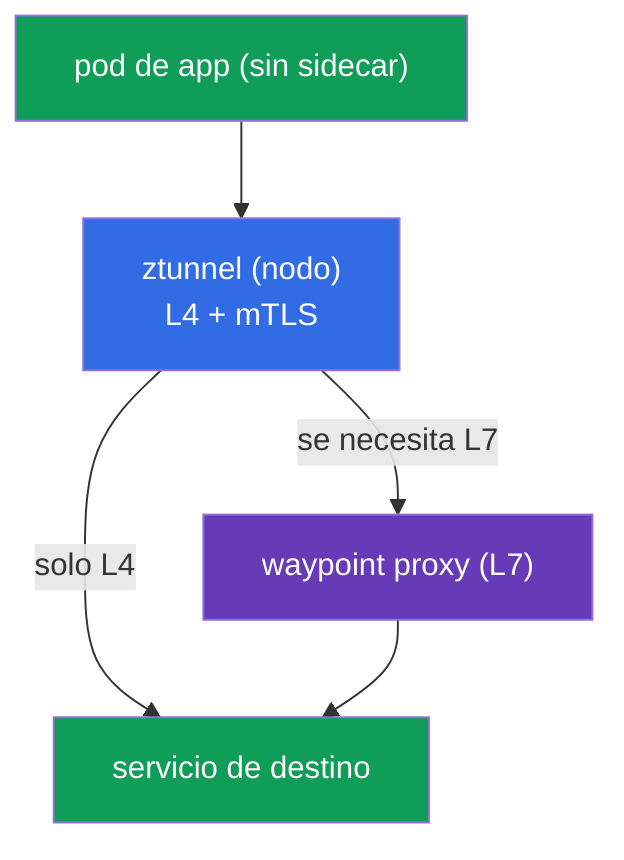
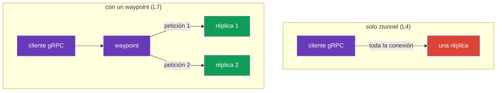
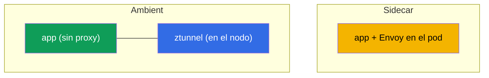
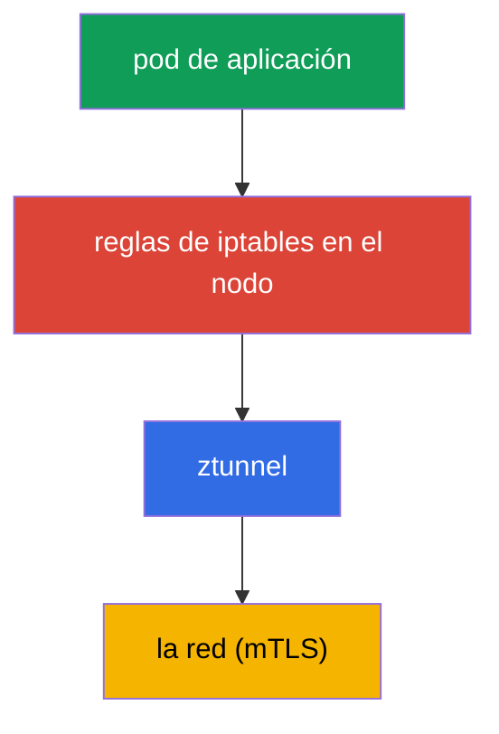
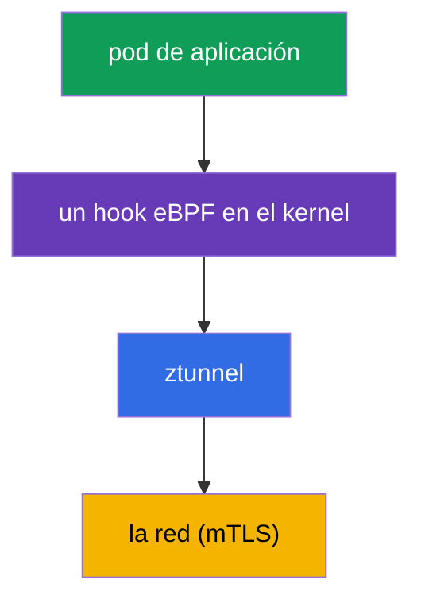

[RU version](ru.md) · [Eng version](en.md) · [Version française](fr.md) · [Deutsche Version](de.md)

# Capítulo 22. Modo ambient: ztunnel y el waypoint proxy

> **Qué sigue.** A lo largo del curso trabajamos con el modelo clásico de sidecar: un Envoy en
> cada pod. Es potente pero no es gratis. Istio ofreció una alternativa: el **modo ambient**, un modo
> sin sidecars. En este capítulo veremos cómo está construido: dos capas (ztunnel para L4 y
> waypoint para L7), en qué se diferencia del sidecar y cuándo elegir cada cosa.

## 22.1. Por qué se necesita ambient

El modelo de sidecar añade un Envoy a cada pod. Esto tiene un coste:

- **Recursos.** Un proxy en cada pod consume CPU y memoria; en miles de pods esto se nota.
- **Actualizaciones.** Para actualizar el data plane hay que reiniciar todos los pods (recrearlos con
  el nuevo sidecar).
- **Intrusión en el pod.** La inyección cambia el pod, añade un init container, iptables; a veces esto
  entra en conflicto con la aplicación.

El modo ambient quita los sidecars de los pods y traslada sus funciones al nivel del nodo y a proxies
aparte. La idea: pagar por el procesamiento L7 solo donde realmente hace falta, y dar la protección
básica (mTLS, L4) a todos de forma barata.

## 22.2. Dos capas: ztunnel y waypoint

La idea clave de ambient es **la división en dos niveles**:

- **ztunnel** (zero-trust tunnel): un componente ligero, uno por **nodo** (un DaemonSet). Proporciona
  L4: cifrado mTLS, identidad, telemetría básica. Por él pasa el tráfico de todos los pods ambient del
  nodo.
- **waypoint proxy**: un Envoy completo para **L7** (enrutamiento, autorización L7, manipulaciones
  HTTP). **No** está en cada pod, sino que se despliega bajo demanda, por namespace o servicio que
  necesite L7.



El sentido de la división: L4 (cifrado e identidad) lo necesitan todos y es barato; lo proporciona el
ztunnel en el nodo. Y L7 (enrutamiento inteligente, autorización HTTP) no siempre hace falta, y se
paga con un waypoint aparte solo donde de verdad se requiere.

## 22.3. La capa L4: ztunnel

`ztunnel` es un DaemonSet: un pod por nodo. Intercepta el tráfico de los pods ambient de su nodo y
proporciona:

- **mTLS** entre servicios (cifrado e identidad SPIFFE, como en el capítulo 13, pero sin sidecars);
- **telemetría L4** (conexiones, bytes, métricas básicas);
- **transporte** sobre un overlay seguro (el protocolo HBONE: tunneling sobre HTTP).

Importante: ztunnel trabaja solo en **L4**. No parsea HTTP, no puede enrutar por rutas/cabeceras ni
aplica autorización L7. Para todo esto se necesita un waypoint. Es decir, al habilitar solo ztunnel ya
obtienes mTLS zero-trust para todo el tráfico, gratis desde el punto de vista de los pods.

## 22.4. La capa L7: el waypoint proxy

Cuando se necesitan capacidades L7 (enrutamiento por HTTP, mirroring, autorización L7), despliegas un
**waypoint proxy**: es un Envoy corriente, pero no en el pod de la aplicación, sino un deployment
aparte por namespace o servicio.

Un waypoint se crea mediante la Kubernetes Gateway API (recuerda el capítulo 11) o con el comando
`istioctl waypoint apply`, y los servicios se le enganchan con una etiqueta:

```bash
# desplegar un waypoint para un namespace
istioctl waypoint apply -n app

# indicar a un servicio que pase por el waypoint
kubectl label service ping-pong -n app istio.io/use-waypoint=waypoint
```

Por debajo, `istioctl waypoint apply` crea un recurso **Gateway** del estándar Gateway API (capítulo
11) con la clase especial `istio-waypoint`; también se puede describir a mano en GitOps:

```yaml
apiVersion: gateway.networking.k8s.io/v1
kind: Gateway
metadata:
  name: waypoint
  namespace: app
  labels:
    istio.io/waypoint-for: service    # para qué es el waypoint: service (por defecto), workload, all
spec:
  gatewayClassName: istio-waypoint    # la clase waypoint concretamente, no el ingress corriente
  listeners:
  - name: mesh
    port: 15008                        # el puerto HBONE
    protocol: HBONE
```

El tráfico se puede vincular a un waypoint en distintos niveles con la etiqueta
`istio.io/use-waypoint`:

- en un **namespace**: todo el tráfico L7 del namespace pasa por el waypoint;
- en un **servicio** (como arriba): solo hacia este servicio;
- en un **pod/workload**: quirúrgicamente.

Ahora el tráfico L7 hacia este servicio pasa por el waypoint, y en él funcionan la familiar
`AuthorizationPolicy` de nivel L7, el enrutamiento, etc. Un ejemplo de los laboratorios: el waypoint
permite `GET` pero bloquea `POST`/`DELETE`, exactamente la misma autorización L7 que en el capítulo
14, solo que ejecutada en el waypoint y no en el sidecar.

## 22.5. Balanceo en ambient (y el caso de gRPC)

Aquí aflora un matiz importante ligado directamente a los capítulos 7 (balanceo) y 10 (gRPC). En
ambient, el balanceo depende de qué capa gestione el tráfico.

- **Solo ztunnel (L4).** ztunnel trabaja en la capa 4, así que balancea **por conexiones**: reparte
  las nuevas conexiones a un servicio entre sus endpoints. Para HTTP/1.1 corriente y conexiones cortas
  esto basta.
- **Con un waypoint (L7).** Cuando el tráfico hacia un servicio pasa por un waypoint, este termina
  HTTP y balancea **por petición individual** (L7), como hacía el sidecar.

Y aquí surge el problema conocido del capítulo 10 con **gRPC**. gRPC es HTTP/2: una única conexión
duradera en la que se multiplexan muchas peticiones. Si ese tráfico se balancea solo con ztunnel (L4),
toda la conexión va a **una** réplica y las peticiones no se distribuyen, exactamente el mismo problema
que con kube-proxy.

La conclusión: **para gRPC (y en general para un balanceo justo por petición) en ambient necesitas un
waypoint.** La capa L4 de ztunnel por sí sola no basta: repartirá las conexiones, pero dentro de una
conexión gRPC no habrá balanceo. Al desplegar un waypoint para el servicio gRPC restauras el balanceo
por petición que en el modo sidecar venía de fábrica (allí el Envoy del pod trabajaba en L7 de
inmediato).



## 22.6. Instalar y habilitar ambient

### Instalar Istio en modo ambient

Ambient es un **perfil de instalación** aparte: instala istiod, **istio-cni** y **ztunnel** (el perfil
sidecar no los tiene). Vía istioctl:

```bash
istioctl install --set profile=ambient --skip-confirmation
```

Vía Helm instalas cuatro charts: `base`, `istiod` (con `--set profile=ambient`), `cni` y `ztunnel`.
Los waypoints (L7) no forman parte de la instalación; se despliegan según haga falta (sección 22.4).
En EKS istio-cni se enchufa por encima del VPC CNI/Cilium (capítulo 27).

### Habilitar ambient en un namespace

Ambient se habilita con una etiqueta en el namespace (en lugar de `istio-injection=enabled` del mundo
sidecar):

```bash
kubectl label namespace app istio.io/dataplane-mode=ambient
```

Lo importante que hay que entender:

- Después de esto los pods del namespace **no obtienen un sidecar**: se quedan como están (`1/1`, sin
  istio-proxy). Su tráfico lo recoge el ztunnel del nodo.
- Los pods **no necesitan reiniciarse**, a diferencia de la inyección de sidecar. Esta es una de las
  principales comodidades: habilitar ambient no toca los pods en ejecución.
- El mTLS L4 empieza a funcionar de inmediato. Las funciones L7 las añades por separado desplegando un
  waypoint (sección 22.4), solo donde haga falta.

Ambient requiere que **istio-cni** esté instalado (capítulo 27): es lo que configura la interceptación
del tráfico hacia el ztunnel. En EKS esto funciona por encima del **VPC CNI** estándar (istio-cni se
enchufa en la cadena) o por encima de **Cilium**; al elegir un CNI, comprueba la compatibilidad con la
versión de Istio.

### Migrar de sidecar → ambient

Puedes migrar de forma gradual, namespace a namespace: sidecar y ambient son compatibles en una misma
malla (sección 22.9). Para un namespace:

1. Asegúrate de que ambient está instalado (istio-cni + ztunnel), ver arriba.
2. Quita la etiqueta de inyección de sidecar del namespace y añade la de ambient:

   ```bash
   kubectl label namespace app istio-injection-               # quitar la inyección de sidecar
   kubectl label namespace app istio.io/dataplane-mode=ambient
   ```

3. Reinicia los pods para quitarles el sidecar:

   ```bash
   kubectl rollout restart deployment -n app
   ```

   Tras el reinicio los pods pasan a `1/1` (sin istio-proxy), y su tráfico lo recoge el ztunnel.
4. Para los servicios que necesiten L7 (enrutamiento, autorización L7, balanceo de gRPC por petición),
   despliega un **waypoint** (sección 22.4): en sidecar estas funciones vivían en el pod, en ambient
   las realiza el waypoint.

El matiz clave: un pod se reinicia **una vez** (para quitar el sidecar), mientras que habilitar ambient
"desde cero" no necesita reinicio. El mTLS y la identidad se conservan (una confianza común, capítulo
13), así que durante la migración las cargas sidecar y ambient siguen comunicándose sin interrupción.

## 22.7. El modelo de amenazas y las limitaciones de ambient

Ambient no es solo ahorro; tiene sus propios límites y su propio perfil de seguridad que debes entender
antes de elegirlo para producción.

### Ztunnel y el compromiso del nodo

Recuerda el modelo de amenazas del capítulo 13 (§13.11): en el modo sidecar la clave privada de una
carga vive en **su propio** Envoy, así que root en un nodo expone únicamente las identidades de los
pods que se ejecutan en ese nodo. En ambient el panorama cambia: **el ztunnel es uno por nodo y guarda
las identidades mTLS de todos los pods ambient del nodo**. De ahí un trade-off importante:

- El compromiso del nodo o del propio **ztunnel** expone potencialmente las identidades de **todas las
  cargas ambient del nodo** a la vez: el radio de impacto por nodo es más amplio que el de un único
  sidecar.
- Así que el ztunnel es un componente privilegiado, y protegerlo es crítico: acceso mínimo al nodo,
  aislamiento de las cargas valiosas en nodos aparte (como en 13.11), detección en runtime, parches al
  día.

Esto no es "ambient es menos seguro": proporciona mTLS y Zero Trust igual. Pero el punto de
concentración de claves se desplaza del pod al nodo, y esto hay que tenerlo en cuenta en el modelo de
amenazas (la misma defensa en profundidad: evitar escapar del contenedor y tomar el nodo, el dominio de
CKS).

### Limitaciones de ambient

Ambient se desarrolla rápido, pero comparado con el sidecar maduro hay matices:

- **La paridad de funcionalidades no es completa.** Algunos escenarios sutiles del sidecar (ciertos
  `EnvoyFilter`, ajustes específicos por pod) funcionan de otra manera o aún no están disponibles en
  ambient; comprueba tu caso.
- **Multicluster es más reciente.** El ambient multicluster está menos probado en batalla que el
  multicluster con sidecar (capítulo 28); esto se tiene en cuenta para topologías complejas.
- **Un salto extra en L7.** El tráfico a través de un waypoint es un salto de red adicional (pod →
  ztunnel → waypoint → destino); para solo-L4 no lo hay, pero donde se necesita L7 la latencia es un
  poco mayor que con "Envoy directamente en el pod".
- **Troubleshooting distinto.** El camino del tráfico (ztunnel/HBONE/waypoint) y las herramientas
  difieren del sidecar familiar; el equipo tiene que reaprender.

## 22.8. Sidecar o ambient



| | Sidecar | Ambient |
|---|---------|---------|
| Proxy | en cada pod | ztunnel en el nodo + waypoint bajo demanda |
| Recursos | mayores (un proxy por pod) | menores (sobre todo para solo-L4) |
| Actualización del data plane | un reinicio del pod | sin reinicio del pod |
| Funciones L7 | siempre disponibles en el sidecar | se necesita un waypoint |
| Madurez | muchos años en producción | más reciente, en desarrollo rápido |

La guía práctica:

- **Sidecar**: la elección probada por el tiempo, todas las capacidades de inmediato; adecuada si el
  modelo te funciona y el overhead es aceptable.
- **Ambient**: cuando importan el ahorro de recursos y las actualizaciones sencillas, hay muchos
  servicios y no todos necesitan L7. Es especialmente interesante si el mTLS L4 basta para la mayoría
  de los servicios.

En el curso aprendimos con sidecar, porque es más ilustrativo y más completo para empezar. Pero ambient
es la dirección hacia la que va Istio, y sin duda vale la pena conocerlo.

## 22.9. ¿Se pueden combinar sidecar y ambient?

Sí, se puede. Istio admite un **modo mixto**: en una misma malla algunas cargas corren con sidecars,
otras en ambient, y **se comunican entre sí con normalidad**. Ambos modos usan un único istiod y una
confianza común (la misma identidad SPIFFE y el mTLS del capítulo 13), así que un servicio con sidecar
puede llamar a un servicio ambient y viceversa: Istio se encarga de la interoperabilidad.

La elección del modo es a nivel de namespace (o una carga concreta): un namespace lo marcas
`istio-injection=enabled` (sidecar), otro `istio.io/dataplane-mode=ambient`. Una limitación importante:
**el mismo pod no puede estar a la vez con sidecar y en ambient**; si un pod tiene sidecar, ztunnel no
lo intercepta.

**Ventajas del modo mixto:**

- **Una migración suave.** No necesitas mover todo el clúster de golpe. Puedes migrar de sidecar a
  ambient namespace a namespace, sin romper nada.
- **Elección por tarea.** Donde importe el ahorro de recursos y L4 baste, ambient; donde hagan falta
  capacidades específicas del sidecar o ya esté todo ajustado, dejas sidecar.
- **Se conserva la compatibilidad.** La comunicación entre los modos funciona de forma transparente, un
  único mTLS.

**Desventajas:**

- **Complejidad operativa.** Dos modelos de data plane en un clúster: hay que entender, depurar y
  mantener ambos.
- **Troubleshooting más difícil.** El camino del tráfico y las herramientas de diagnóstico difieren para
  sidecar y ambient; en un clúster mixto esto añade confusión.
- **Diferencias de capacidades.** Los conjuntos de funciones de sidecar y ambient no coinciden del todo;
  hay que tener en mente qué hay disponible en cada uno.

**La conclusión práctica:** el modo mixto es bueno sobre todo como **camino de migración** y para
excepciones puntuales. A largo plazo apunta a la uniformidad, es más fácil de operar. Y recuerda:
sidecar y ambient en un mismo pod al mismo tiempo, no está permitido.

## 22.10. eBPF en Istio

Una conversación sobre ambient casi siempre lleva a **eBPF**, así que repasemos en detalle qué es, cómo
cambia el funcionamiento de la malla y cuáles son las ventajas y los escollos.

**eBPF** (extended Berkeley Packet Filter) es una tecnología que permite ejecutar pequeños programas
seguros **directamente en el kernel de Linux**, sin cambiar su código y sin compilar módulos. El kernel
los ejecuta en un sandbox ante ciertos eventos: llegó un paquete de red, se ejecutó una llamada al
sistema, se abrió una conexión. eBPF se usa ampliamente para networking, observabilidad y seguridad; es
la base de Cilium.

### Cómo llega el tráfico al proxy: iptables vs eBPF

Para entender el papel de eBPF, veamos el **mecanismo de interceptación** del tráfico. Tanto en sidecar
como en ambient el tráfico de la aplicación hay que "desviarlo" al proxy (Envoy o ztunnel). La pregunta
es cómo lo hace exactamente el kernel.

**La forma clásica: iptables.** Al arrancar el pod se configuran reglas de iptables que redirigen el
tráfico de la aplicación al proxy (capítulo 4). En ambient se hace lo mismo para redirigir al ztunnel.



**La forma eBPF.** En lugar de las cadenas de iptables, la redirección la hace un programa eBPF
enganchado en los hooks de red del kernel. El paquete se desvía al ztunnel directamente en el kernel,
sin reglas de iptables voluminosas ni transiciones extra.



La diferencia está en el eslabón de interceptación: `iptables` vs un `hook eBPF`. Más allá de eso el
tráfico sigue yendo al ztunnel y se cifra; eBPF cambia **cómo interceptamos**, no dónde.

Dónde aparece esto en Istio:

- **istio-cni** (capítulo 27) puede usar el modo eBPF para el redirect en lugar de iptables.
- **Cilium como CNI** (capítulos 1, 14) hace L3/L4 y la interceptación con eBPF en el kernel, mientras
  Istio se encarga de L7. Una combinación popular, incluso para ambient.

### El beneficio

- **Rendimiento.** Menos transiciones entre el espacio de usuario y el kernel, y ningún overhead de las
  largas cadenas de iptables: menor latencia y carga en el data plane.
- **Un pod más sencillo.** No hacen falta reglas de iptables ni un init container privilegiado en cada
  pod; la interceptación se configura a nivel de nodo/kernel. Esto también es un plus para la seguridad
  (menos privilegios para los pods).
- **Escala.** iptables escala mal con miles de reglas; los mecanismos de eBPF están construidos de forma
  más eficiente.

### Los escollos

- **Troubleshooting más difícil.** Este es el principal. Las herramientas familiares no ayudarán:
  `iptables -L` no mostrará nada, porque la redirección vive en los programas eBPF del kernel, no en las
  tablas de iptables. Necesitas herramientas conscientes de eBPF (`bpftool`, las herramientas de Cilium,
  `pwru` para el tracing de paquetes). El conocimiento de depuración vía iptables no aplica aquí; es una
  habilidad nueva.
- **Requisitos del kernel.** Las funcionalidades de eBPF dependen de la versión del kernel de Linux; en
  kernels viejos algunas capacidades no están disponibles. En plataformas gestionadas comprueba la
  versión del kernel de los nodos.
- **Madurez y compatibilidad.** El data plane eBPF para ambient se desarrolla activamente; el
  comportamiento y las capacidades dependen de las versiones de Istio, del CNI y del kernel. La
  compatibilidad con un CNI concreto hay que comprobarla.
- **Menos herramientas familiares.** El ecosistema de depuración iptables/tcpdump es rico y familiar; el
  conjunto de herramientas de eBPF es potente pero requiere un dominio aparte.

### Una advertencia importante: eBPF no reemplaza a Envoy

**eBPF no reemplaza al proxy para L7.** El enrutamiento inteligente, los reintentos, la autorización L7,
las métricas ricas: todo esto lo sigue haciendo Envoy en el espacio de usuario. eBPF optimiza la
"fontanería" (interceptación, procesamiento L4), pero las funciones L7 de la malla siguen en el proxy,
sea un sidecar, ztunnel+waypoint o Cilium+Envoy. Una malla eBPF totalmente "proxyless" existe solo a
nivel L4.

Hacia dónde va esto: menos iptables, más eBPF en el data plane, interceptación más barata, y ambient es
uno de los principales beneficiados. Pero por el rendimiento pagas con una depuración más compleja, así
que el equipo debe dominar las herramientas de eBPF antes de confiar en un data plane así en producción.

## 22.11. Resumen del capítulo

- El **modo ambient** es un modo sin sidecars: las funciones de Envoy se sacan de los pods al nivel del
  nodo y a proxies aparte.
- **ztunnel** es un DaemonSet por nodo, proporciona L4: mTLS, identidad, telemetría básica sobre un
  overlay (HBONE). Trabaja para todos los pods ambient y no entiende HTTP.
- **El waypoint proxy** es un Envoy aparte para L7 (enrutamiento, autorización L7), desplegado bajo
  demanda por namespace/servicio y no en cada pod.
- Se habilita con la etiqueta `istio.io/dataplane-mode=ambient`; los pods **no se reinician** y no
  obtienen sidecar; el mTLS L4 funciona de inmediato, L7 se añade vía un waypoint.
- Ambient es un **perfil de instalación** aparte (`istioctl install --set profile=ambient`: istiod +
  istio-cni + ztunnel). La migración sidecar→ambient va namespace a namespace: quitar la etiqueta de
  inyección, añadir `dataplane-mode=ambient`, reiniciar los pods (una vez) y desplegar un waypoint para
  L7.
- Ambient ahorra recursos y simplifica las actualizaciones; sidecar está probado y viene con todas las
  funcionalidades de inmediato. La elección depende de la necesidad de L7 y de los requisitos de
  recursos.
- Balanceo: ztunnel (L4) reparte por conexiones, el waypoint (L7) por peticiones. Para gRPC se necesita
  un waypoint, de lo contrario toda la conexión se pega a una réplica (como con kube-proxy).
- Sidecar y ambient se pueden combinar en una malla (una confianza común y mTLS), cómodo para la
  migración y la elección por tarea; la contra es una operación más compleja. Un pod no puede estar a la
  vez con sidecar y en ambient.
- El modelo de amenazas se desplaza: **un ztunnel por nodo guarda las claves de todos los pods ambient
  del nodo**, así que tomar el nodo/ztunnel los expone a todos a la vez (más amplio que sidecar, §13.11);
  el ztunnel hay que protegerlo de forma especial.
- Limitaciones de ambient: paridad de funcionalidades incompleta con sidecar, un multicluster más
  reciente, un salto extra en L7 (vía el waypoint), troubleshooting distinto. Requiere istio-cni (en EKS
  por encima del VPC CNI/Cilium).
- **eBPF** cambia el mecanismo de interceptación del tráfico (un hook eBPF en el kernel en lugar de
  iptables): más rápido, menos privilegios para los pods, mejor escalado. Pero L7 (enrutamiento, authz,
  métricas) lo sigue haciendo Envoy; eBPF optimiza el data plane, no reemplaza al proxy.
- El precio de eBPF es un **troubleshooting complejo**: `iptables -L` es inútil, necesitas herramientas
  de eBPF (bpftool, las de Cilium), nuevos requisitos para la versión del kernel.

## 22.12. Preguntas de autoevaluación

1. ¿Qué inconvenientes del modelo de sidecar resuelve ambient?
2. ¿De qué se responsabiliza ztunnel y por qué trabaja solo en L4?
3. ¿Cuándo y por qué se necesita un waypoint proxy? ¿En qué se diferencia de un sidecar?
4. ¿Cómo habilitas ambient y por qué no necesitas reiniciar los pods para ello?
5. ¿En qué casos eliges ambient y en cuáles te quedas en sidecar?
6. ¿Cómo se balancea el tráfico en ambient y por qué se necesita un waypoint para gRPC?
7. ¿Se pueden combinar sidecar y ambient en una misma malla? ¿Cuáles son las ventajas, las desventajas
   y la principal limitación?
8. ¿Qué es eBPF y cómo se usa en Istio? ¿eBPF reemplaza a Envoy para L7?
9. ¿En qué se diferencia la interceptación del tráfico vía eBPF de iptables? ¿Qué beneficio y qué
   escollos (en particular, con el troubleshooting) da esto?
10. ¿Cómo cambia el modelo de amenazas en ambient a causa de ztunnel? ¿Por qué tomar un nodo es más
    peligroso que en sidecar, y qué haces al respecto?
11. Nombra las limitaciones de ambient comparado con el sidecar maduro.
12. ¿Cómo instalas Istio en modo ambient (qué perfil, qué componentes) y cómo migras un namespace de
    sidecar a ambient? ¿Por qué se necesita un reinicio único de los pods durante la migración?

## Práctica

Practica el modo ambient (un data plane sin sidecars) y el mTLS L4:

🧪 Laboratorio 09: [tasks/ica/labs/09](../../labs/09/README_ES.MD)

Practica el waypoint proxy y la autorización L7 en ambient:

🧪 Laboratorio 24: [tasks/ica/labs/24](../../labs/24/README_ES.MD)

---
[Índice](../README_ES.md) · [Capítulo 21](../21/es.md) · [Capítulo 23](../23/es.md)
