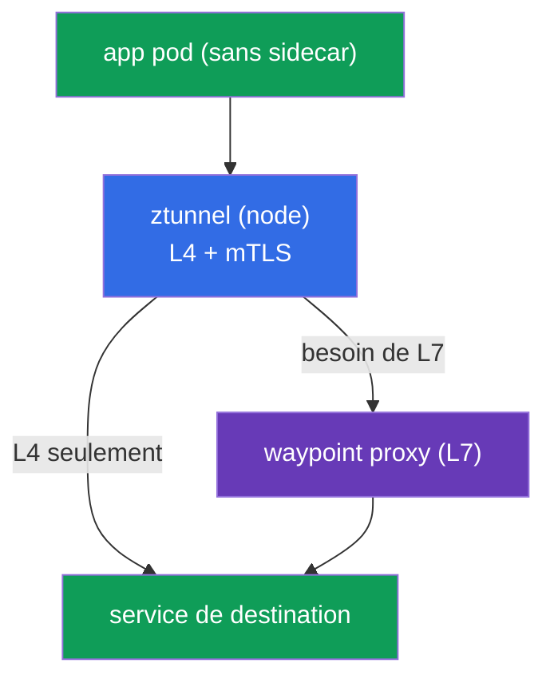
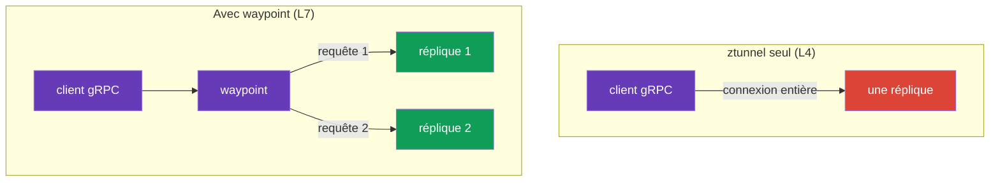
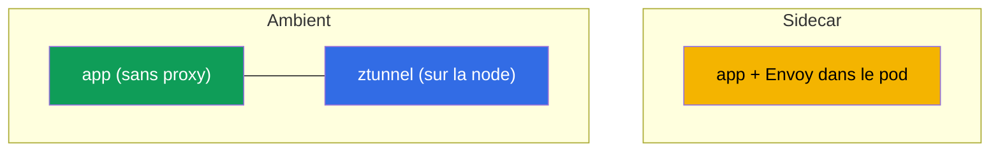
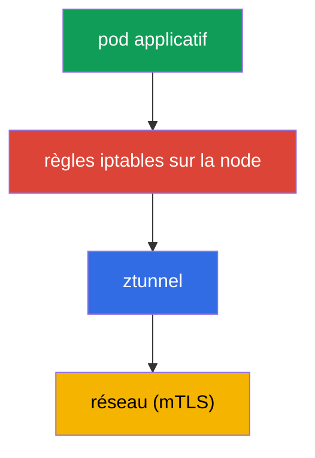
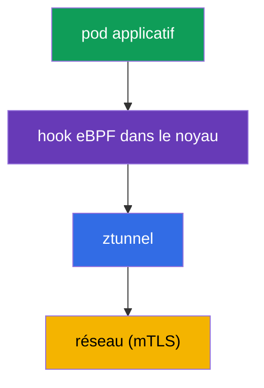

[RU version](ru.md) · [Eng version](en.md) · [Versión en español](es.md) · [Deutsche Version](de.md)

# Chapitre 22. Ambient mode : ztunnel et waypoint proxy

> **La suite.** Tout au long du cours, nous avons travaillé avec le modèle sidecar classique :
> Envoy dans chaque pod. Il est puissant, mais pas gratuit. Istio a proposé une alternative -
> le **ambient mode**, un mode sans sidecars. Dans ce chapitre, nous verrons comment il est
> construit : deux couches (ztunnel pour L4 et waypoint pour L7), en quoi il diffère du sidecar
> et quand choisir quoi.

## 22.1. À quoi sert le ambient

Le modèle sidecar ajoute un Envoy dans chaque pod. Cela a un prix :

- **Ressources.** Un proxy dans chaque pod consomme du CPU et de la mémoire - sur des milliers de
  pods, c'est notable.
- **Mises à jour.** Pour mettre à jour le data plane, il faut redémarrer tous les pods (les
  recréer avec le nouveau sidecar).
- **Intrusion dans le pod.** L'injection modifie le pod, ajoute un init-container, iptables -
  parfois cela entre en conflit avec l'application.

Le ambient mode retire les sidecars des pods et déporte leurs fonctions au niveau de la node et de
proxys dédiés. L'idée : ne payer le traitement L7 que là où il est réellement nécessaire, et
donner à tous une protection de base (mTLS, L4) à bas coût.

## 22.2. Deux couches : ztunnel et waypoint

L'idée clé du ambient est la **séparation en deux niveaux** :

- **ztunnel** (zero-trust tunnel) - composant léger, un par **node** (DaemonSet). Assure le L4 :
  chiffrement mTLS, identité, télémétrie de base. C'est par lui que passe le trafic de tous les
  pods ambient de la node.
- **waypoint proxy** - un Envoy complet pour le **L7** (routage, autorisation L7, manipulations
  HTTP). Il n'est **pas** dans chaque pod, mais déployé à la demande - sur un namespace ou un
  service qui a besoin de L7.



Le sens de la séparation : le L4 (chiffrement et identité) est nécessaire à tous et coûte peu -
c'est ztunnel qui le fournit sur la node. Le L7 (routage intelligent, autorisation HTTP) n'est
pas toujours nécessaire, et vous le payez avec un waypoint séparé uniquement là où il est
réellement requis.

## 22.3. La couche L4 : ztunnel

`ztunnel` est un DaemonSet : un pod par node. Il intercepte le trafic des pods ambient de sa node
et assure :

- **mTLS** entre les services (chiffrement et identité SPIFFE - comme au chapitre 13, mais sans
  sidecars) ;
- **télémétrie L4** (connexions, octets, métriques de base) ;
- **transport** via un overlay sécurisé (protocole HBONE - tunneling par-dessus HTTP).

Important : ztunnel travaille uniquement en **L4**. Il ne décode pas HTTP, ne sait pas router par
chemins/en-têtes et n'applique pas d'autorisation L7. Pour tout cela, il faut un waypoint.
Autrement dit, en activant seulement ztunnel, vous obtenez déjà un mTLS zero-trust pour tout le
trafic - gratuitement du point de vue des pods.

## 22.4. La couche L7 : waypoint proxy

Quand des capacités L7 sont nécessaires (routage par HTTP, mirroring, autorisation L7), on déploie
un **waypoint proxy** - c'est un Envoy ordinaire, mais pas dans le pod de l'application, plutôt un
deployment séparé sur un namespace ou un service.

Le waypoint se crée via la Kubernetes Gateway API (souvenez-vous du chapitre 11) ou avec la
commande `istioctl waypoint apply`, et les services s'y connectent par un label :

```bash
# déployer un waypoint pour le namespace
istioctl waypoint apply -n app

# indiquer au service de passer par le waypoint
kubectl label service ping-pong -n app istio.io/use-waypoint=waypoint
```

Sous le capot, `istioctl waypoint apply` crée une ressource **Gateway** de la norme Gateway API
(chapitre 11) avec une classe spéciale `istio-waypoint` - on peut aussi la décrire à la main en
GitOps :

```yaml
apiVersion: gateway.networking.k8s.io/v1
kind: Gateway
metadata:
  name: waypoint
  namespace: app
  labels:
    istio.io/waypoint-for: service    # cible du waypoint : service (par défaut), workload, all
spec:
  gatewayClassName: istio-waypoint    # bien la classe waypoint, pas un ingress ordinaire
  listeners:
  - name: mesh
    port: 15008                        # port HBONE
    protocol: HBONE
```

On peut rattacher le trafic au waypoint à différents niveaux avec le label
`istio.io/use-waypoint` :

- au niveau **namespace** - tout le trafic L7 du namespace passe par le waypoint ;
- au niveau **service** (comme ci-dessus) - uniquement vers ce service ;
- au niveau **pod/workload** - de façon ciblée.

Désormais, le trafic L7 vers ce service passe par le waypoint, et sur lui fonctionnent les
`AuthorizationPolicy` L7 habituelles, le routage et le reste. Exemple des labs : le waypoint
autorise `GET`, mais bloque `POST`/`DELETE` - exactement la même autorisation L7 qu'au chapitre
14, sauf qu'elle s'exécute dans le waypoint et non dans le sidecar.

## 22.5. Équilibrage en ambient (et le cas de gRPC)

Ici émerge une nuance importante, directement liée aux chapitres 7 (équilibrage) et 10 (gRPC). En
ambient, l'équilibrage dépend de la couche qui traite le trafic.

- **ztunnel seul (L4).** ztunnel travaille en couche 4, il équilibre donc **par connexions** : il
  répartit les nouvelles connexions vers un service sur ses endpoints. Pour du HTTP/1.1 ordinaire
  et des connexions courtes, cela suffit.
- **Avec waypoint (L7).** Quand le trafic vers un service passe par le waypoint, celui-ci termine
  le HTTP et équilibre **par requêtes individuelles** (L7), comme le faisait le sidecar.

Et c'est là qu'apparaît le problème avec **gRPC** déjà connu du chapitre 10. gRPC est du HTTP/2 :
une seule connexion longue durée dans laquelle sont multiplexées de nombreuses requêtes. Si ce
trafic n'est équilibré que par ztunnel (L4), toute la connexion part sur **une** réplique, et les
requêtes ne se répartissent pas - exactement le même souci qu'avec kube-proxy.

Conclusion : **pour gRPC (et de façon générale pour un vrai équilibrage per-request), un waypoint
est nécessaire en ambient.** La seule couche L4 de ztunnel ne suffit pas : elle répartit les
connexions, mais à l'intérieur d'une même connexion gRPC il n'y aura pas d'équilibrage. En
déployant un waypoint pour le service gRPC, vous restaurez l'équilibrage per-request qui était
fourni d'office en mode sidecar (là, l'Envoy dans le pod travaillait directement en L7).



## 22.6. Installation et activation du ambient

### Installation d'Istio en mode ambient

Ambient est un **profil d'installation** distinct : il installe istiod, **istio-cni** et
**ztunnel** (absents du profil sidecar). Via istioctl :

```bash
istioctl install --set profile=ambient --skip-confirmation
```

Avec Helm, on installe quatre charts : `base`, `istiod` (avec `--set profile=ambient`), `cni` et
`ztunnel`. Les waypoints (L7) ne font pas partie de l'installation - on les déploie au besoin
(section 22.4). Sur EKS, istio-cni s'active par-dessus VPC CNI/Cilium (chapitre 27).

### Activation du ambient sur un namespace

Ambient s'active par un label sur le namespace (à la place de `istio-injection=enabled` du monde
sidecar) :

```bash
kubectl label namespace app istio.io/dataplane-mode=ambient
```

Ce qu'il est important de comprendre :

- Après cela, les pods du namespace **ne reçoivent pas de sidecar** - ils restent tels quels
  (`1/1`, sans istio-proxy). Leur trafic est pris en charge par ztunnel sur la node.
- Il n'est **pas nécessaire** de redémarrer les pods - contrairement à l'injection sidecar. C'est
  l'un des principaux atouts : activer le ambient ne touche pas aux pods en cours d'exécution.
- Le mTLS L4 commence à fonctionner immédiatement. Les fonctions L7 s'ajoutent séparément, en
  déployant un waypoint (section 22.4) - uniquement là où c'est nécessaire.

Ambient nécessite **istio-cni** installé (chapitre 27) - c'est lui qui configure l'interception
du trafic vers ztunnel. Sur EKS, cela fonctionne par-dessus le **VPC CNI** standard (istio-cni
s'insère dans la chaîne) ou par-dessus **Cilium** ; au moment de choisir le CNI, vérifiez la
compatibilité avec la version d'Istio.

### Migration sidecar → ambient

On peut migrer progressivement, namespace par namespace - sidecar et ambient sont compatibles au
sein d'un même maillage (section 22.9). Pour un namespace :

1. S'assurer que ambient est installé (istio-cni + ztunnel) - voir ci-dessus.
2. Retirer du namespace le label d'injection sidecar et poser celui d'ambient :

   ```bash
   kubectl label namespace app istio-injection-               # retirer l'injection sidecar
   kubectl label namespace app istio.io/dataplane-mode=ambient
   ```

3. Redémarrer les pods pour en retirer le sidecar :

   ```bash
   kubectl rollout restart deployment -n app
   ```

   Après le redémarrage, les pods deviennent `1/1` (sans istio-proxy), et leur trafic est pris en
   charge par ztunnel.
4. Pour les services qui ont besoin de L7 (routage, autorisation L7, équilibrage per-request de
   gRPC), déployer un **waypoint** (section 22.4) - en sidecar, ces fonctions vivaient dans le pod,
   en ambient c'est le waypoint qui les exécute.

Nuance clé : le pod est redémarré **une seule fois** (pour retirer le sidecar), alors qu'activer
le ambient « à partir de zéro » ne nécessite pas de redémarrage. Le mTLS et l'identity sont
conservés (trust commun, chapitre 13), donc pendant la migration les charges sidecar et ambient
continuent de communiquer sans interruption.

## 22.7. Modèle de menaces et limites du ambient

Ambient ne concerne pas que l'économie ; il a ses propres frontières et son propre profil de
sécurité, qu'il faut comprendre avant de le choisir en prod.

### Ztunnel et compromission de la node

Souvenez-vous du modèle de menaces du chapitre 13 (§13.11) : en mode sidecar, la clé privée d'un
workload réside dans **son propre** Envoy, donc un root sur la node ne compromet l'identité que
des pods qui tournent sur cette node. En ambient, le tableau se déplace : **ztunnel est unique par
node et détient les identités mTLS de tous les pods ambient de cette node**. D'où un trade-off
important :

- La compromission de la node ou de **ztunnel** lui-même peut compromettre d'un coup les identités
  de **toutes les charges ambient de la node** - le rayon d'impact par node est plus large que
  pour un sidecar isolé.
- Donc, ztunnel est un composant privilégié, et sa protection est critique : accès minimal aux
  nodes, isolation des charges sensibles sur des nodes dédiées (comme en 13.11), détection runtime,
  patchs à jour.

Ce n'est pas « ambient est moins sûr » - il fournit le mTLS et le Zero Trust de la même manière.
Mais le point de concentration des clés se déplace du pod vers la node, et il faut en tenir compte
dans le modèle de menaces (même défense en profondeur : empêcher de s'échapper du conteneur et de
prendre la node - domaine CKS).

### Limites du ambient

Ambient évolue vite, mais par rapport au sidecar mature il y a des nuances :

- **Parité de fonctionnalités incomplète.** Une partie des scénarios sidecar fins (certains
  `EnvoyFilter`, des réglages per-pod spécifiques) fonctionne différemment en ambient ou n'est pas
  encore disponible - vérifiez pour votre cas.
- **Multicluster plus récent.** L'ambient multicluster est moins rodé que le multicluster sidecar
  (chapitre 28) ; pour des topologies complexes, on en tient compte.
- **Saut supplémentaire en L7.** Le trafic via le waypoint est un saut réseau supplémentaire
  (pod → ztunnel → waypoint → destination) ; pour le L4-only il n'existe pas, mais là où le L7 est
  nécessaire, la latence est un peu plus élevée qu'avec « Envoy directement dans le pod ».
- **Troubleshooting différent.** Le chemin du trafic (ztunnel/HBONE/waypoint) et les outils
  diffèrent du sidecar habituel - l'équipe doit se réapproprier.

## 22.8. Sidecar ou ambient



| | Sidecar | Ambient |
|---|---------|---------|
| Proxy | dans chaque pod | ztunnel sur la node + waypoint à la demande |
| Ressources | plus élevées (proxy par pod) | plus faibles (surtout pour le L4-only) |
| Mise à jour du data plane | redémarrage des pods | sans redémarrage des pods |
| Fonctions L7 | toujours disponibles dans le sidecar | waypoint nécessaire |
| Maturité | des années en prod | plus récent, évolue vite |

Repère pratique :

- **Sidecar** - choix éprouvé par le temps, toutes les capacités d'emblée ; convient si le modèle
  vous satisfait et que le surcoût est acceptable.
- **Ambient** - quand l'économie de ressources et la simplicité des mises à jour comptent, avec
  beaucoup de services, et que le L7 n'est pas nécessaire à tous. Particulièrement intéressant si
  le mTLS L4 suffit à la plupart des services.

Dans le cours, nous avons appris avec le sidecar, parce qu'il est plus parlant et plus complet
pour démarrer. Mais ambient est la direction vers laquelle se dirige Istio, et il vaut vraiment la
peine de le connaître.

## 22.9. Peut-on combiner sidecar et ambient

Oui, c'est possible. Istio prend en charge un **mode mixte** : dans un même maillage, une partie
des charges fonctionne avec des sidecars, l'autre en ambient, et elles **communiquent normalement
entre elles**. Les deux modes utilisent un même istiod et un trust commun (la même identité SPIFFE
et le même mTLS du chapitre 13), donc un service sidecar peut appeler un service ambient et
inversement - Istio prend en charge l'interopérabilité.

Le choix du mode se fait au niveau du namespace (ou d'une charge donnée) : un namespace marqué
`istio-injection=enabled` (sidecar), un autre `istio.io/dataplane-mode=ambient`. Limite
importante : **un même pod ne peut pas être à la fois avec un sidecar et en ambient** - si un pod
a un sidecar, ztunnel ne l'intercepte pas.

**Avantages du mode mixte :**

- **Migration en douceur.** Pas besoin de basculer tout le cluster d'un coup. On peut migrer
  namespace par namespace du sidecar vers l'ambient, sans rien casser.
- **Choix adapté au besoin.** Là où l'économie de ressources compte et où le L4 suffit - ambient ;
  là où des capacités spécifiques au sidecar sont nécessaires ou où tout est déjà rodé - garder le
  sidecar.
- **Compatibilité préservée.** La communication entre les modes fonctionne de façon transparente,
  mTLS unifié.

**Inconvénients :**

- **Complexité d'exploitation.** Deux modèles de data plane dans un même cluster : il faut
  comprendre, déboguer et maintenir les deux.
- **Troubleshooting plus difficile.** Le chemin du trafic et les outils de diagnostic diffèrent
  pour sidecar et ambient - dans un cluster mixte, cela ajoute de la confusion.
- **Différences de capacités.** L'ensemble des fonctionnalités de sidecar et d'ambient ne coïncide
  pas totalement ; il faut garder en tête ce qui est disponible où.

**Conclusion pratique :** le mode mixte est utile avant tout comme **voie de migration** et pour
des exceptions ponctuelles. À long terme, visez l'uniformité - c'est plus simple à exploiter. Et
souvenez-vous : sidecar et ambient sur un même pod en même temps - interdit.

## 22.10. eBPF dans Istio

Parler d'ambient mène presque toujours à **eBPF**, examinons donc en détail ce que c'est, comment
cela change le fonctionnement du maillage et quels sont les avantages et les écueils.

**eBPF** (extended Berkeley Packet Filter) est une technologie qui permet d'exécuter de petits
programmes sûrs **directement dans le noyau Linux**, sans modifier son code ni compiler de
modules. Le noyau les exécute dans un bac à sable sur certains événements : un paquet réseau
arrive, un appel système s'exécute, une connexion s'ouvre. eBPF est largement utilisé pour le
réseau, l'observabilité et la sécurité - c'est la base de Cilium.

### Comment le trafic arrive au proxy : iptables contre eBPF

Pour comprendre le rôle d'eBPF, regardons le **mécanisme d'interception** du trafic. En sidecar
comme en ambient, le trafic de l'application doit être « détourné » vers le proxy (Envoy ou
ztunnel). La question est : comment le noyau s'y prend exactement.

**Méthode classique - iptables.** Au démarrage du pod, des règles iptables sont configurées, qui
redirigent le trafic de l'application vers le proxy (chapitre 4). En ambient, c'est la même chose
pour rediriger vers ztunnel.



**Méthode avec eBPF.** À la place des chaînes iptables, la redirection est faite par un programme
eBPF branché sur les hooks réseau du noyau. Le paquet est détourné vers ztunnel directement dans
le noyau, sans règles iptables encombrantes ni transitions superflues.



La différence est dans le maillon d'interception : `iptables` contre `hook eBPF`. Ensuite, le
trafic va toujours vers ztunnel et est chiffré - eBPF change **comment on intercepte**, pas où.

Où cela se rencontre dans Istio :

- **istio-cni** (chapitre 27) peut utiliser un mode eBPF pour la redirection à la place d'iptables.
- **Cilium comme CNI** (chapitres 1, 14) fait le L3/L4 et l'interception en eBPF dans le noyau, et
  Istio prend le L7. Combinaison populaire, y compris pour l'ambient.

### Bénéfices

- **Performance.** Moins de transitions entre l'user space et le noyau et pas de surcoût des
  longues chaînes iptables - latence et charge du data plane plus faibles.
- **Pod plus simple.** Pas besoin de règles iptables ni d'un init-container privilégié dans chaque
  pod - l'interception se configure au niveau de la node/du noyau. C'est aussi un plus pour la
  sécurité (moins de privilèges pour les pods).
- **Échelle.** iptables passe mal à l'échelle sur des milliers de règles ; les mécanismes eBPF sont
  conçus plus efficacement.

### Écueils

- **Troubleshooting plus difficile.** C'est le principal. Les outils habituels n'aident pas :
  `iptables -L` ne montrera rien, parce que la redirection vit dans des programmes eBPF du noyau, et
  non dans les tables iptables. Il faut des outils conscients d'eBPF (`bpftool`, les moyens de
  Cilium, `pwru` pour le traçage de paquets). La connaissance du débogage via iptables ne
  s'applique pas ici - c'est une nouvelle compétence.
- **Exigences noyau.** Les fonctions eBPF dépendent de la version du noyau Linux ; sur les vieux
  noyaux, une partie des capacités est indisponible. Sur les plateformes managées, vérifiez la
  version du noyau des nodes.
- **Maturité et compatibilité.** Le data plane eBPF pour l'ambient évolue activement ; le
  comportement et les capacités dépendent des versions d'Istio, du CNI et du noyau. La
  compatibilité avec un CNI donné doit être vérifiée.
- **Moins d'outils familiers.** L'écosystème de débogage iptables/tcpdump est riche et familier ;
  l'outillage eBPF est puissant, mais demande un apprentissage à part.

### Réserve importante : eBPF ne remplace pas Envoy

**eBPF ne remplace pas le proxy pour le L7.** Le routage intelligent, les retries, l'autorisation
L7, les métriques riches - tout cela est toujours assuré par Envoy en user space. eBPF optimise la
« plomberie » (interception, traitement L4), mais les fonctions L7 du maillage restent au proxy -
qu'il s'agisse d'un sidecar, de ztunnel+waypoint ou de Cilium+Envoy. Un maillage eBPF entièrement
« sans proxy » n'existe qu'au niveau L4.

Vers où cela va : moins d'iptables, plus d'eBPF dans le data plane, une interception moins
coûteuse - et l'ambient est l'un des principaux bénéficiaires. Mais la performance se paie par un
débogage plus complexe, l'équipe doit donc maîtriser les outils eBPF avant de s'appuyer sur un tel
data plane en prod.

## 22.11. Résumé du chapitre

- **Ambient mode** - mode sans sidecars : les fonctions d'Envoy sont déportées des pods au niveau
  de la node et de proxys dédiés.
- **ztunnel** - DaemonSet par node, fournit le L4 : mTLS, identité, télémétrie de base via un
  overlay (HBONE). Fonctionne pour tous les pods ambient et ne comprend pas HTTP.
- **waypoint proxy** - Envoy dédié pour le L7 (routage, autorisation L7), déployé à la demande sur
  un namespace/service, pas dans chaque pod.
- S'active par le label `istio.io/dataplane-mode=ambient` ; les pods **ne sont pas redémarrés** et
  ne reçoivent pas de sidecar ; le mTLS L4 fonctionne immédiatement, le L7 s'ajoute via un
  waypoint.
- Ambient est un **profil d'installation** distinct (`istioctl install --set profile=ambient` :
  istiod + istio-cni + ztunnel). La migration sidecar→ambient se fait par namespace : retirer le
  label d'injection, poser `dataplane-mode=ambient`, redémarrer les pods (une fois), pour le L7 -
  déployer un waypoint.
- Ambient économise des ressources et simplifie les mises à jour ; sidecar est éprouvé et
  complet d'emblée. Le choix dépend du besoin en L7 et des exigences de ressources.
- Équilibrage : ztunnel (L4) répartit par connexions, waypoint (L7) - par requêtes. Pour gRPC, un
  waypoint est nécessaire, sinon toute la connexion colle à une réplique (comme avec kube-proxy).
- Sidecar et ambient peuvent se combiner dans un même maillage (trust et mTLS communs) - pratique
  pour la migration et le choix adapté au besoin ; inconvénient - exploitation plus complexe. Un
  pod ne peut pas être à la fois avec un sidecar et en ambient.
- Le modèle de menaces se déplace : **ztunnel, unique par node, détient les clés de tous les pods
  ambient de la node**, donc la prise de la node/de ztunnel les compromet tous d'un coup (plus
  large que sidecar, §13.11) - ztunnel doit être protégé particulièrement.
- Limites du ambient : parité de fonctionnalités incomplète avec sidecar, multicluster plus
  récent, saut supplémentaire en L7 (via waypoint), troubleshooting différent. Nécessite istio-cni
  (sur EKS par-dessus VPC CNI/Cilium).
- **eBPF** change le mécanisme d'interception du trafic (hook eBPF dans le noyau à la place
  d'iptables) : plus rapide, moins de privilèges pour les pods, meilleure mise à l'échelle. Mais
  le L7 (routage, authz, métriques) est toujours assuré par Envoy - eBPF optimise le data plane,
  il ne remplace pas le proxy.
- Le prix d'eBPF est un **troubleshooting complexe** : `iptables -L` est inutile, il faut des
  outils eBPF (bpftool, moyens de Cilium), de nouvelles exigences sur la version du noyau.

## 22.12. Questions d'auto-évaluation

1. Quels inconvénients du modèle sidecar l'ambient résout-il ?
2. De quoi ztunnel est-il responsable et pourquoi travaille-t-il uniquement en L4 ?
3. Quand et pourquoi un waypoint proxy est-il nécessaire ? En quoi diffère-t-il du sidecar ?
4. Comment activer l'ambient et pourquoi n'est-il alors pas nécessaire de redémarrer les pods ?
5. Dans quels cas choisir l'ambient, et dans lesquels rester en sidecar ?
6. Comment le trafic est-il équilibré en ambient et pourquoi un waypoint est-il nécessaire pour
   gRPC ?
7. Peut-on combiner sidecar et ambient dans un même maillage ? Quels sont les avantages, les
   inconvénients et la principale limite ?
8. Qu'est-ce qu'eBPF et comment est-il utilisé dans Istio ? eBPF remplace-t-il Envoy pour le L7 ?
9. En quoi l'interception du trafic via eBPF diffère-t-elle d'iptables ? Quels bénéfices et quels
   écueils (notamment pour le troubleshooting) cela apporte-t-il ?
10. Comment le modèle de menaces change-t-il en ambient à cause de ztunnel ? Pourquoi la prise de
    la node est-elle plus dangereuse qu'en sidecar, et que faire ?
11. Citez les limites de l'ambient par rapport au sidecar mature.
12. Comment installer Istio en mode ambient (quel profil, quels composants) et comment migrer un
    namespace de sidecar vers ambient ? Pourquoi un redémarrage unique des pods est-il nécessaire
    lors de la migration ?

## Pratique

Entraînez-vous au ambient mode (data plane sans sidecars) et au mTLS L4 :

🧪 Lab 09 : [tasks/ica/labs/09](../../labs/09/README_FR.MD)

Entraînez-vous au waypoint proxy et à l'autorisation L7 en ambient :

🧪 Lab 24 : [tasks/ica/labs/24](../../labs/24/README_FR.MD)

---
[Table des matières](../README_FR.md) · [Chapitre 21](../21/fr.md) · [Chapitre 23](../23/fr.md)
