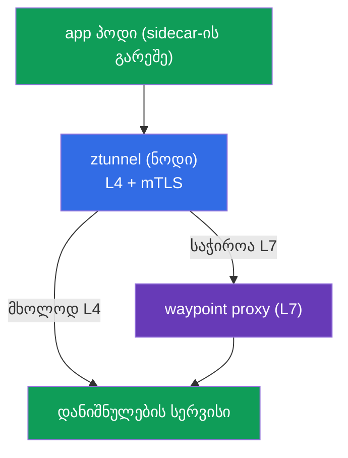
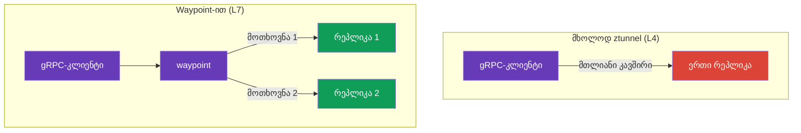
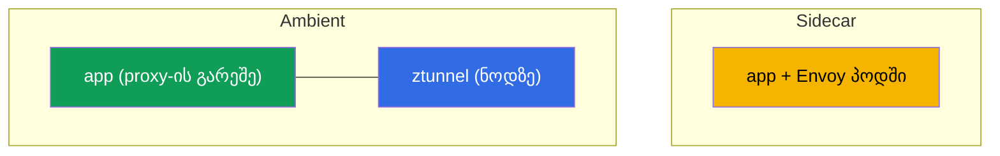
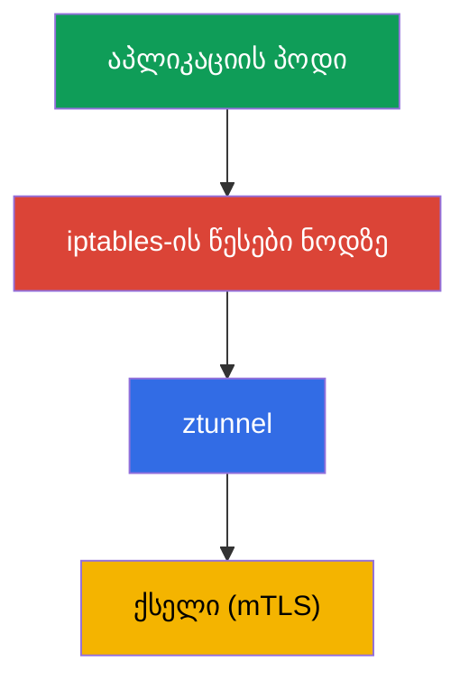
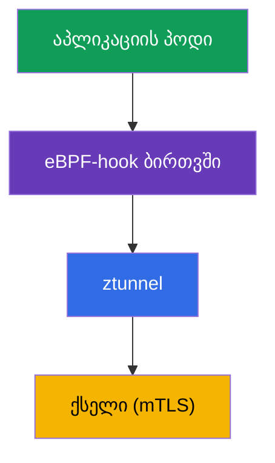

[Русская версия](ru.md) · [Eng version](en.md) · [Versión en español](es.md) · [Version française](fr.md) · [Deutsche Version](de.md) · [繁體中文版](tw.md) · [日本語版](jp.md)

# თავი 22. Ambient რეჟიმი: ztunnel და waypoint proxy

> **რა არის შემდეგ.** მთელი კურსის განმავლობაში კლასიკურ sidecar-მოდელთან ვმუშაობდით:
> Envoy თითოეულ პოდში. ის მძლავრია, მაგრამ უფასო არ არის. Istio-მ შემოგვთავაზა
> ალტერნატივა - **ambient რეჟიმი**, რეჟიმი sidecar-ების გარეშე. ამ თავში გავარჩევთ,
> როგორ არის ის მოწყობილი: ორი შრე (ztunnel L4-ისთვის და waypoint L7-ისთვის), რით
> განსხვავდება sidecar-ისგან და როდის რომელი უნდა ავირჩიოთ.

## 22.1. რატომ არის საჭირო ambient

Sidecar-მოდელი თითოეულ პოდში Envoy-ს ამატებს. ამას თავისი ფასი აქვს:

- **რესურსები.** თითოეულ პოდში არსებული proxy CPU-სა და მეხსიერებას მოიხმარს - ათასობით
  პოდის შემთხვევაში ეს შესამჩნევია.
- **განახლებები.** Data plane-ის გასაახლებლად ყველა პოდი უნდა გადაიტვირთოს (ხელახლა
  შეიქმნას ახალი sidecar-ით).
- **პოდში ჩარევა.** ინექცია ცვლის პოდს, ამატებს init-კონტეინერსა და iptables-ს - ზოგჯერ
  ეს აპლიკაციასთან კონფლიქტს იწვევს.

Ambient რეჟიმი პოდებიდან sidecar-ებს შლის და მათი ფუნქციები ნოდის დონეზე და ცალკეულ
proxy-ებში გადააქვს. იდეა ასეთია: L7-დამუშავების საფასური გადავიხადოთ მხოლოდ იქ, სადაც
ის ნამდვილად საჭიროა, ხოლო საბაზისო დაცვა (mTLS, L4) ყველას იაფად მივცეთ.

## 22.2. ორი შრე: ztunnel და waypoint

Ambient-ის მთავარი იდეაა **ორ დონედ დაყოფა**:

- **ztunnel** (zero-trust tunnel) - მსუბუქი კომპონენტი, თითო **ნოდზე** თითო ეგზემპლარი
  (DaemonSet). უზრუნველყოფს L4-ს: mTLS-დაშიფვრას, იდენტობასა და საბაზისო ტელემეტრიას.
  მასში გადის ნოდის ყველა ambient-პოდის ტრაფიკი.
- **waypoint proxy** - სრულფასოვანი Envoy **L7**-ისთვის (მარშრუტიზაცია, L7-ავტორიზაცია,
  HTTP-ით მანიპულაციები). ის **არ** არის თითოეულ პოდში და საჭიროებისამებრ იშლება - იმ
  namespace-ისთვის ან სერვისისთვის, რომელსაც L7 სჭირდება.



დაყოფის აზრი ასეთია: L4 (დაშიფვრა და იდენტობა) ყველას სჭირდება და იაფია - მას ნოდზე
არსებული ztunnel უზრუნველყოფს. L7 (გონივრული მარშრუტიზაცია, HTTP-ავტორიზაცია) კი
ყოველთვის საჭირო არ არის და მის საფასურს ცალკე waypoint-ით მხოლოდ იქ იხდით, სადაც ის
რეალურად საჭიროა.

## 22.3. L4 შრე: ztunnel

`ztunnel` არის DaemonSet: თითო პოდი თითოეულ ნოდზე. ის თავისი ნოდის ambient-პოდების
ტრაფიკს იჭერს და უზრუნველყოფს:

- **mTLS**-ს სერვისებს შორის (დაშიფვრა და SPIFFE-იდენტობა - როგორც მე-13 თავში, ოღონდ
  sidecar-ების გარეშე);
- **L4-ტელემეტრიას** (კავშირები, ბაიტები, საბაზისო მეტრიკები);
- **ტრანსპორტს** დაცული overlay-ის მეშვეობით (HBONE პროტოკოლი - ტუნელირება HTTP-ის
  ზედაპირზე).

მნიშვნელოვანია: ztunnel მხოლოდ **L4**-ზე მუშაობს. ის HTTP-ს არ აანალიზებს, ბილიკების/
სათაურების მიხედვით მარშრუტიზაცია არ შეუძლია და L7-ავტორიზაციას არ იყენებს. ამ
ყველაფრისთვის waypoint არის საჭირო. ანუ მხოლოდ ztunnel-ის ჩართვითაც კი მთელი
ტრაფიკისთვის zero-trust mTLS-ს იღებთ - პოდების თვალსაზრისით უფასოდ.

## 22.4. L7 შრე: waypoint proxy

როდესაც L7-ის შესაძლებლობებია საჭირო (HTTP-ის მიხედვით მარშრუტიზაცია, სარკისებური
ასახვა, L7-ავტორიზაცია), შლიან **waypoint proxy**-ს - ეს ჩვეულებრივი Envoy-ა, მაგრამ არა
აპლიკაციის პოდში, არამედ ცალკე deployment-ად namespace-ისთვის ან სერვისისთვის.

Waypoint იქმნება Kubernetes Gateway API-ის მეშვეობით (გაიხსენეთ თავი 11) ან ბრძანებით
`istioctl waypoint apply`, ხოლო სერვისები მას label-ით უკავშირდება:

```bash
# waypoint-ის გაშლა namespace-ისთვის
istioctl waypoint apply -n app

# სერვისს ვუთითებთ waypoint-ის გავლით სიარულს
kubectl label service ping-pong -n app istio.io/use-waypoint=waypoint
```

შიდა დონეზე `istioctl waypoint apply` ქმნის Gateway API სტანდარტის **Gateway** რესურსს
(თავი 11) სპეციალური `istio-waypoint` კლასით - მისი ხელით აღწერაც შეიძლება GitOps-ში:

```yaml
apiVersion: gateway.networking.k8s.io/v1
kind: Gateway
metadata:
  name: waypoint
  namespace: app
  labels:
    istio.io/waypoint-for: service    # რისთვის waypoint: service (ნაგულისხმევი), workload, all
spec:
  gatewayClassName: istio-waypoint    # სწორედ waypoint-კლასი, არა ჩვეულებრივი ingress
  listeners:
  - name: mesh
    port: 15008                        # HBONE პორტი
    protocol: HBONE
```

ტრაფიკის waypoint-თან მიბმა `istio.io/use-waypoint` label-ით სხვადასხვა დონეზე შეიძლება:

- **namespace**-ზე - waypoint-ში namespace-ის მთელი L7-ტრაფიკი გადის;
- **სერვისზე** (როგორც ზემოთ) - მხოლოდ ამ სერვისისკენ მიმართული ტრაფიკი;
- **პოდზე/workload-ზე** - მიზნობრივად.

ახლა ამ სერვისისკენ მიმართული L7-ტრაფიკი waypoint-ში გადის და მასზე ჩვეულებრივი L7 დონის
`AuthorizationPolicy`, მარშრუტიზაცია და სხვა ფუნქციები მუშაობს. მაგალითი ლაბორატორიიდან:
waypoint ნებას რთავს `GET`-ს, მაგრამ ბლოკავს `POST`/`DELETE`-ს - ზუსტად იგივე
L7-ავტორიზაციაა, რაც მე-14 თავში, ოღონდ ის waypoint-ში სრულდება და არა sidecar-ში.

## 22.5. დატვირთვის განაწილება ambient-ში (და gRPC-ის შემთხვევა)

აქ ჩნდება მნიშვნელოვანი ნიუანსი, რომელიც პირდაპირ უკავშირდება მე-7 (დატვირთვის
განაწილება) და მე-10 (gRPC) თავებს. Ambient-ში დატვირთვის განაწილება იმაზეა
დამოკიდებული, თუ რომელი შრე ამუშავებს ტრაფიკს.

- **მხოლოდ ztunnel (L4).** ztunnel მე-4 დონეზე მუშაობს, ამიტომ დატვირთვას **კავშირების
  მიხედვით** ანაწილებს: სერვისისკენ ახალ კავშირებს მის endpoint-ებს შორის ანაწილებს.
  ჩვეულებრივი HTTP/1.1-ისა და ხანმოკლე კავშირებისთვის ეს საკმარისია.
- **Waypoint-ით (L7).** როდესაც სერვისისკენ ტრაფიკი waypoint-ის გავლით მიდის, ის HTTP-ს
  წყვეტს და დატვირთვას **ცალკეული მოთხოვნების მიხედვით** (L7) ანაწილებს, როგორც ამას
  sidecar აკეთებდა.

სწორედ აქ ჩნდება მე-10 თავიდან ნაცნობი **gRPC**-ის პრობლემა. gRPC არის HTTP/2: ერთი
ხანგრძლივი კავშირი, რომელშიც მრავალი მოთხოვნა მულტიპლექსირდება. თუ ასეთ ტრაფიკს მხოლოდ
ztunnel (L4) ანაწილებს, მთელი კავშირი **ერთ** რეპლიკაზე მიდის და მოთხოვნები არ
ნაწილდება - ზუსტად იგივე პრობლემაა, რაც kube-proxy-ს შემთხვევაში.

დასკვნა: **gRPC-ისთვის (და ზოგადად მოთხოვნებზე რეალური per-request განაწილებისთვის)
ambient-ში waypoint არის საჭირო.** მხოლოდ ztunnel-ის L4-შრე საკმარისი არ არის: ის
კავშირებს გაანაწილებს, მაგრამ ერთი gRPC-კავშირის შიგნით განაწილება არ მოხდება. gRPC-
სერვისისთვის waypoint-ის გაშლით per-request განაწილებას აბრუნებთ, რომელიც sidecar-
რეჟიმში თავიდანვე ხელმისაწვდომი იყო (იქ პოდში არსებული Envoy მაშინვე L7-ზე მუშაობდა).



## 22.6. Ambient-ის დაყენება და ჩართვა

### Istio-ს დაყენება ambient-რეჟიმში

Ambient არის ცალკე **დაყენების პროფილი**: ის აყენებს istiod-ს, **istio-cni**-სა და
**ztunnel**-ს (sidecar-პროფილში ისინი არ არის). istioctl-ის მეშვეობით:

```bash
istioctl install --set profile=ambient --skip-confirmation
```

Helm-ის მეშვეობით ოთხ chart-ს აყენებენ: `base`, `istiod` (`--set profile=ambient`-ით),
`cni` და `ztunnel`. Waypoint-ები (L7) დაყენებაში არ შედის - მათ საჭიროებისამებრ შლიან
(განყოფილება 22.4). EKS-ზე istio-cni VPC CNI/Cilium-ის ზედაპირზე ირთვება (თავი 27).

### Ambient-ის ჩართვა namespace-ზე

Ambient namespace-ზე label-ით ირთვება (sidecar-სამყაროს `istio-injection=enabled`-ის
ნაცვლად):

```bash
kubectl label namespace app istio.io/dataplane-mode=ambient
```

რა არის მნიშვნელოვანი:

- ამის შემდეგ namespace-ის პოდები **არ იღებენ sidecar-ს** - ისინი უცვლელი რჩება (`1/1`,
  istio-proxy-ის გარეშე). მათ ტრაფიკს ნოდზე არსებული ztunnel იღებს.
- პოდების გადატვირთვა **საჭირო არ არის** - sidecar-ინექციისგან განსხვავებით. ეს ერთ-ერთი
  მთავარი მოხერხებულობაა: ambient-ის ჩართვა მოქმედ პოდებს არ ეხება.
- L4 mTLS მაშინვე იწყებს მუშაობას. L7-ფუნქციებს ცალკე ამატებთ waypoint-ის გაშლით
  (განყოფილება 22.4) - მხოლოდ იქ, სადაც საჭიროა.

Ambient-ს დაყენებული **istio-cni** სჭირდება (თავი 27) - სწორედ ის აწყობს ტრაფიკის
ztunnel-ზე გადამისამართებას. EKS-ზე ეს სტანდარტული **VPC CNI**-ის ზედაპირზე (istio-cni
ჯაჭვში ერთვება) ან **Cilium**-ის ზედაპირზე მუშაობს; CNI-ის არჩევისას Istio-ს ვერსიასთან
თავსებადობა შეამოწმეთ.

### მიგრაცია sidecar → ambient

გადასვლა შეიძლება ეტაპობრივად, namespace-იდან namespace-ზე - sidecar და ambient ერთ mesh-ში
თავსებადია (განყოფილება 22.9). ერთი namespace-ისთვის:

1. დარწმუნდით, რომ ambient დაყენებულია (istio-cni + ztunnel) - იხილეთ ზემოთ.
2. namespace-ს sidecar-ინექციის label მოაშორეთ და ambient-ის label დაუყენეთ:

   ```bash
   kubectl label namespace app istio-injection-               # sidecar-ინექციის მოცილება
   kubectl label namespace app istio.io/dataplane-mode=ambient
   ```

3. პოდები გადატვირთეთ, რათა მათგან sidecar წაიშალოს:

   ```bash
   kubectl rollout restart deployment -n app
   ```

   გადატვირთვის შემდეგ პოდები ხდება `1/1` (istio-proxy-ის გარეშე), ხოლო მათ ტრაფიკს ztunnel
   იღებს.
4. იმ სერვისებისთვის, რომლებსაც L7 სჭირდება (მარშრუტიზაცია, L7-ავტორიზაცია, gRPC-ის
   per-request განაწილება), **waypoint** გაშალეთ (განყოფილება 22.4) - sidecar-ში ეს
   ფუნქციები პოდში იყო, ambient-ში კი მათ waypoint ასრულებს.

მთავარი ნიუანსი: პოდი **ერთხელ** გადაიტვირთება (sidecar-ის მოსაშორებლად), მაშინ როცა
ambient-ის „ნულიდან“ ჩართვას გადატვირთვა არ სჭირდება. mTLS და identity შენარჩუნებულია
(საერთო trust, თავი 13), ამიტომ მიგრაციისას sidecar- და ambient-workload-ები ერთმანეთთან
შეფერხების გარეშე აგრძელებს ურთიერთობას.

## 22.7. Ambient-ის საფრთხეების მოდელი და შეზღუდვები

Ambient მხოლოდ ეკონომიას არ ეხება; მას თავისი საზღვრები და უსაფრთხოების პროფილი აქვს,
რომლებიც production-ში არჩევამდე უნდა გესმოდეთ.

### Ztunnel და ნოდის კომპრომეტირება

გაიხსენეთ საფრთხეების მოდელი მე-13 თავიდან (§13.11): sidecar-რეჟიმში workload-ის პირადი
გასაღები **მის საკუთარ** Envoy-ში ინახება, ამიტომ ნოდზე root-წვდომა მხოლოდ იმ პოდების
იდენტობებს ხსნის, რომლებიც ამ ნოდზე მუშაობს. Ambient-ში სურათი იცვლება: **ztunnel ერთია
ნოდზე და ამ ნოდის ყველა ambient-პოდის mTLS-იდენტობას ინახავს**. აქედან მნიშვნელოვანი
trade-off გამომდინარეობს:

- ნოდის ან თავად **ztunnel**-ის კომპრომეტირებამ შესაძლოა ნოდის **ყველა ambient-workload-ის**
  იდენტობა ერთდროულად გამოააშკარაოს - ნოდის დონეზე ზიანის რადიუსი ერთი sidecar-ისაზე
  ფართოა.
- შესაბამისად, ztunnel პრივილეგირებული კომპონენტია და მისი დაცვა კრიტიკულია: ნოდებზე
  მინიმალური წვდომა, მნიშვნელოვანი workload-ების ცალკე ნოდებზე იზოლაცია (როგორც 13.11-ში),
  runtime-დეტექტირება და ახალი patch-ები.

ეს არ ნიშნავს, რომ „ambient ნაკლებად უსაფრთხოა“ - mTLS-სა და Zero Trust-ს ის ასევე
უზრუნველყოფს. თუმცა გასაღებების კონცენტრაციის წერტილი პოდიდან ნოდზე ინაცვლებს და ეს
საფრთხეების მოდელში უნდა გაითვალისწინოთ (იგივე defense-in-depth: არ დაუშვათ კონტეინერიდან
გაღწევა და ნოდის ხელში ჩაგდება - CKS-ის სფერო).

### Ambient-ის შეზღუდვები

Ambient სწრაფად ვითარდება, მაგრამ მომწიფებულ sidecar-თან შედარებით ნიუანსები აქვს:

- **ფუნქციების პარიტეტი სრული არ არის.** ზოგიერთი სპეციფიკური sidecar-სცენარი (ზოგი
  `EnvoyFilter`, კონკრეტული per-pod პარამეტრები) ambient-ში სხვაგვარად მუშაობს ან ჯერ
  ხელმისაწვდომი არ არის - თქვენი შემთხვევისთვის შეამოწმეთ.
- **Multicluster უფრო ახალია.** Multicluster ambient ნაკლებად გამოცდილია, ვიდრე sidecar-
  multicluster (თავი 28); რთული ტოპოლოგიებისთვის ეს უნდა გაითვალისწინოთ.
- **დამატებითი hop L7-ზე.** Waypoint-ის გავლით ტრაფიკს დამატებითი ქსელური გადასვლა აქვს
  (პოდი → ztunnel → waypoint → დანიშნულება); L4-only რეჟიმში ის არ არის, მაგრამ იქ, სადაც
  L7 საჭიროა, დაყოვნება ოდნავ მეტია, ვიდრე „Envoy პირდაპირ პოდში“ შემთხვევაში.
- **განსხვავებული troubleshooting.** ტრაფიკის გზა (ztunnel/HBONE/waypoint) და ინსტრუმენტები
  ჩვეული sidecar-ისგან განსხვავდება - გუნდს თავიდან სწავლა სჭირდება.

## 22.8. Sidecar თუ ambient



| | Sidecar | Ambient |
|---|---------|---------|
| Proxy | თითოეულ პოდში | ztunnel ნოდზე + waypoint საჭიროებისამებრ |
| რესურსები | მეტი (proxy თითო პოდზე) | ნაკლები (განსაკუთრებით L4-only-სთვის) |
| Data plane-ის განახლება | პოდების გადატვირთვა | პოდების გადატვირთვის გარეშე |
| L7-ფუნქციები | ყოველთვის ხელმისაწვდომია sidecar-ში | საჭიროა waypoint |
| სიმწიფე | მრავალი წელია production-ში | უფრო ახალია, სწრაფად ვითარდება |

პრაქტიკული ორიენტირი:

- **Sidecar** - დროით გამოცდილი არჩევანი, ყველა შესაძლებლობა თავიდანვე; გამოგადგებათ, თუ
  მოდელი გაკმაყოფილებთ და overhead მისაღებია.
- **Ambient** - როცა მნიშვნელოვანია რესურსების ეკონომია და განახლებების სიმარტივე,
  სერვისი ბევრია, ხოლო L7 ყველას არ სჭირდება. განსაკუთრებით საინტერესოა, თუ სერვისების
  უმეტესობისთვის L4 mTLS საკმარისია.

კურსში sidecar-ზე ვსწავლობდით, რადგან დასაწყებად ის უფრო თვალსაჩინო და სრულყოფილია.
მაგრამ ambient არის მიმართულება, საითაც Istio მიდის, და მისი ცოდნა ნამდვილად ღირს.

## 22.9. შეიძლება თუ არა sidecar-ისა და ambient-ის შეთავსება

დიახ, შეიძლება. Istio მხარს უჭერს **შერეულ რეჟიმს**: ერთ mesh-ში workload-ების ნაწილი
sidecar-ებით მუშაობს, ნაწილი კი ambient-ში, და ისინი **ერთმანეთთან ნორმალურად
ურთიერთობენ**. ორივე რეჟიმი ერთ istiod-სა და საერთო trust-ს იყენებს (იგივე SPIFFE-
იდენტობა და mTLS მე-13 თავიდან), ამიტომ sidecar-სერვისს შეუძლია ambient-სერვისი
გამოიძახოს და პირიქით - Istio მათ ურთიერთქმედებას თავად უზრუნველყოფს.

რეჟიმი namespace-ის (ან ცალკეული workload-ის) დონეზე ირჩევა: ერთ namespace-ს
`istio-injection=enabled`-ით (sidecar) მონიშნავთ, მეორეს კი -
`istio.io/dataplane-mode=ambient`-ით. მნიშვნელოვანი შეზღუდვა: **ერთი და იგივე პოდი
ერთდროულად sidecar-ითაც და ambient-შიც ვერ იქნება** - თუ პოდს sidecar აქვს, ztunnel მის
ტრაფიკს არ იჭერს.

**შერეული რეჟიმის უპირატესობები:**

- **თანდათანობითი მიგრაცია.** მთელი კლასტერის ერთდროულად გადაყვანა საჭირო არ არის.
  შეგიძლიათ namespace-იდან namespace-ზე გადახვიდეთ sidecar-იდან ambient-ზე ისე, რომ
  არაფერი დააზიანოთ.
- **ამოცანის მიხედვით არჩევა.** სადაც რესურსების ეკონომია მნიშვნელოვანია და L4
  საკმარისია - ambient; სადაც sidecar-ის სპეციფიკური შესაძლებლობებია საჭირო ან ყველაფერი
  უკვე გამართულია - დატოვეთ sidecar.
- **თავსებადობა ნარჩუნდება.** რეჟიმებს შორის ურთიერთობა გამჭვირვალედ მუშაობს, mTLS
  ერთიანია.

**ნაკლოვანებები:**

- **ექსპლუატაციის სირთულე.** ერთ კლასტერში data plane-ის ორი მოდელია: ორივე უნდა
  გესმოდეთ, გამართოთ და მოემსახუროთ.
- **Troubleshooting უფრო რთულია.** ტრაფიკის გზა და დიაგნოსტიკის ინსტრუმენტები sidecar-
  ისა და ambient-ისთვის განსხვავდება - შერეულ კლასტერში ეს მეტ დაბნეულობას იწვევს.
- **შესაძლებლობების განსხვავებები.** Sidecar-ისა და ambient-ის ფუნქციების ნაკრები
  სრულად არ ემთხვევა; უნდა გახსოვდეთ, სად რა არის ხელმისაწვდომი.

**პრაქტიკული დასკვნა:** შერეული რეჟიმი უპირველესად კარგია, როგორც **მიგრაციის გზა** და
ცალკეული გამონაკლისებისთვის. გრძელვადიან პერსპექტივაში ერთგვაროვნებისკენ ისწრაფეთ - ასე
ექსპლუატაცია უფრო მარტივია. და გახსოვდეთ: sidecar და ambient ერთსა და იმავე პოდზე
ერთდროულად შეუძლებელია.

## 22.10. eBPF Istio-ში

Ambient-ზე საუბარი თითქმის ყოველთვის **eBPF**-თან მიგვიყვანს, ამიტომ დაწვრილებით
განვიხილოთ, რა არის ის, როგორ ცვლის mesh-ის მუშაობას და რა უპირატესობები და სირთულეები
აქვს.

**eBPF** (extended Berkeley Packet Filter) არის ტექნოლოგია, რომელიც მცირე უსაფრთხო
პროგრამების **პირდაპირ Linux-ის ბირთვში** გაშვების საშუალებას იძლევა, მისი კოდის შეცვლისა
და მოდულების აგების გარეშე. ბირთვი მათ sandbox-ში კონკრეტულ მოვლენებზე ასრულებს: ქსელური
პაკეტი მოვიდა, სისტემური გამოძახება შესრულდა, კავშირი გაიხსნა. eBPF ფართოდ გამოიყენება
ქსელებისთვის, observability-სა და უსაფრთხოებისთვის - ის Cilium-ის საფუძველია.

### როგორ ხვდება ტრაფიკი proxy-ზე: iptables eBPF-ის წინააღმდეგ

eBPF-ის როლის გასაგებად ტრაფიკის **დაჭერის მექანიზმს** შევხედოთ. როგორც sidecar-ში, ისე
ambient-ში, აპლიკაციის ტრაფიკი proxy-ზე (Envoy ან ztunnel) უნდა „გადაიხვიოს“. საკითხავი
ისაა, ზუსტად როგორ აკეთებს ამას ბირთვი.

**კლასიკური გზა - iptables.** პოდის გაშვებისას ეწყობა iptables-ის წესები, რომლებიც
აპლიკაციის ტრაფიკს proxy-ზე გადაამისამართებს (თავი 4). Ambient-ში იგივე ხდება ztunnel-ზე
გადასამისამართებლად.



**გზა eBPF-ით.** iptables-ის ჯაჭვების ნაცვლად გადამისამართებას ბირთვის ქსელურ hook-ებთან
მიერთებული eBPF-პროგრამა აკეთებს. პაკეტი პირდაპირ ბირთვში გადაიხვევა ztunnel-ზე,
მოცულობითი iptables-წესებისა და ზედმეტი გადასვლების გარეშე.



განსხვავება დაჭერის რგოლშია: `iptables` `eBPF-hook`-ის წინააღმდეგ. შემდეგ ტრაფიკი კვლავ
ztunnel-ზე მიდის და იშიფრება - eBPF ცვლის **როგორ ვიჭერთ**, და არა სად ვაგზავნით.

სად გვხვდება ეს Istio-ში:

- **istio-cni**-ს (თავი 27) გადამისამართებისთვის iptables-ის ნაცვლად eBPF-რეჟიმის
  გამოყენება შეუძლია.
- **Cilium როგორც CNI** (თავები 1, 14) L3/L4-სა და დაჭერას ბირთვში eBPF-ით ასრულებს,
  Istio კი L7-ს იღებს. ეს პოპულარული კომბინაციაა, მათ შორის ambient-ისთვისაც.

### სარგებელი

- **წარმადობა.** User space-სა და ბირთვს შორის ნაკლები გადასვლა და iptables-ის გრძელი
  ჯაჭვების overhead-ის არარსებობა - data plane-ზე ნაკლები დაყოვნება და დატვირთვა.
- **უფრო მარტივი პოდი.** თითოეულ პოდში iptables-ის წესები და პრივილეგირებული init-
  კონტეინერი საჭირო არ არის - დაჭერა ნოდის/ბირთვის დონეზე ეწყობა. ეს უსაფრთხოების
  უპირატესობაცაა (პოდებს ნაკლები პრივილეგია აქვს).
- **მასშტაბი.** iptables ათასობით წესზე ცუდად მასშტაბირდება; eBPF-მექანიზმები უფრო
  ეფექტურად არის მოწყობილი.

### სირთულეები

- **Troubleshooting უფრო რთულია.** ეს მთავარია. ჩვეული ინსტრუმენტები ვერ დაგეხმარებათ:
  `iptables -L` ვერაფერს გაჩვენებთ, რადგან გადამისამართება ბირთვის eBPF-პროგრამებშია და
  არა iptables-ის ცხრილებში. საჭიროა eBPF-ის მცოდნე ინსტრუმენტები (`bpftool`, Cilium-ის
  საშუალებები, `pwru` პაკეტების ტრასირებისთვის). iptables-ის მეშვეობით გამართვის ცოდნა
  აქ გამოუსადეგარია - ეს ახალი უნარია.
- **ბირთვის მოთხოვნები.** eBPF-ფუნქციები Linux-ის ბირთვის ვერსიაზეა დამოკიდებული; ძველ
  ბირთვებზე შესაძლებლობების ნაწილი ხელმისაწვდომი არ არის. Managed-პლატფორმებზე ნოდების
  ბირთვის ვერსია შეამოწმეთ.
- **სიმწიფე და თავსებადობა.** Ambient-ის eBPF-dataplane აქტიურად ვითარდება; ქცევა და
  შესაძლებლობები Istio-ს, CNI-ისა და ბირთვის ვერსიებზეა დამოკიდებული. კონკრეტულ CNI-
  სთან თავსებადობა უნდა შეამოწმოთ.
- **ნაკლები ნაცნობი ინსტრუმენტი.** iptables/tcpdump-ის გამართვის ეკოსისტემა მდიდარი და
  ნაცნობია; eBPF-ის ინსტრუმენტები მძლავრია, მაგრამ ცალკე შესწავლას მოითხოვს.

### მნიშვნელოვანი შენიშვნა: eBPF Envoy-ს არ ცვლის

**eBPF L7-ის proxy-ს არ ცვლის.** გონივრულ მარშრუტიზაციას, retries-ს, L7-ავტორიზაციასა და
მდიდარ მეტრიკებს კვლავ Envoy ასრულებს user space-ში. eBPF „მილსადენს“ (დაჭერას, L4-
დამუშავებას) აუმჯობესებს, მაგრამ mesh-ის L7-ფუნქციები proxy-ს რჩება - იქნება ეს sidecar,
ztunnel+waypoint თუ Cilium+Envoy. სრულიად „proxy-ის გარეშე“ eBPF-mesh მხოლოდ L4 დონეზე
არსებობს.

მიმართულება ასეთია: ნაკლები iptables, მეტი eBPF data plane-ში, უფრო იაფი დაჭერა - და
ambient ამის ერთ-ერთი მთავარი ბენეფიციარია. თუმცა წარმადობის საფასური უფრო რთული
გამართვაა, ამიტომ ასეთ dataplane-ზე production-ში დაყრდნობამდე გუნდმა eBPF-
ინსტრუმენტები უნდა აითვისოს.

## 22.11. თავის შეჯამება

- **Ambient რეჟიმი** - რეჟიმი sidecar-ების გარეშე: Envoy-ს ფუნქციები პოდებიდან ნოდის
  დონეზე და ცალკეულ proxy-ებში გადადის.
- **ztunnel** - DaemonSet თითო ნოდზე, უზრუნველყოფს L4-ს: mTLS-ს, იდენტობასა და საბაზისო
  ტელემეტრიას overlay-ის (HBONE) მეშვეობით. მუშაობს ყველა ambient-პოდისთვის და HTTP არ
  ესმის.
- **waypoint proxy** - ცალკე Envoy L7-ისთვის (მარშრუტიზაცია, L7-ავტორიზაცია),
  საჭიროებისამებრ იშლება namespace-ზე/სერვისზე და არა თითოეულ პოდში.
- ირთვება `istio.io/dataplane-mode=ambient` label-ით; პოდები **არ იტვირთება ხელახლა** და
  sidecar-ს არ იღებს; L4 mTLS მაშინვე მუშაობს, L7 კი waypoint-ით ემატება.
- Ambient ცალკე **დაყენების პროფილია** (`istioctl install --set profile=ambient`:
  istiod + istio-cni + ztunnel). Sidecar→ambient მიგრაცია namespace-ების მიხედვით ხდება:
  მოხსენით ინექციის label, დააყენეთ `dataplane-mode=ambient`, გადატვირთეთ პოდები (ერთხელ),
  L7-ისთვის კი waypoint გაშალეთ.
- Ambient რესურსებს ზოგავს და განახლებებს ამარტივებს; sidecar გამოცდილია და თავიდანვე
  სრულფუნქციურია. არჩევანი L7-ის საჭიროებასა და რესურსების მოთხოვნებზეა დამოკიდებული.
- დატვირთვის განაწილება: ztunnel (L4) კავშირების მიხედვით ანაწილებს, waypoint (L7) -
  მოთხოვნების მიხედვით. gRPC-ისთვის waypoint არის საჭირო, წინააღმდეგ შემთხვევაში მთელი
  კავშირი ერთ რეპლიკას მიეკრობა (როგორც kube-proxy-სთან).
- Sidecar და ambient შეიძლება ერთ mesh-ში შეთავსდეს (საერთო trust და mTLS) - მოსახერხებელია
  მიგრაციისა და ამოცანის მიხედვით არჩევისთვის; ნაკლოვანება უფრო რთული ექსპლუატაციაა. ერთი
  პოდი ერთდროულად sidecar-ითაც და ambient-შიც ვერ იქნება.
- საფრთხეების მოდელი იცვლება: **თითო ნოდზე ერთი ztunnel ნოდის ყველა ambient-პოდის გასაღებს
  ინახავს**, ამიტომ ნოდის/ztunnel-ის ხელში ჩაგდება მათ ყველას ერთდროულად ამხელს (უფრო
  ფართოდ, ვიდრე sidecar, §13.11) - ztunnel განსაკუთრებით უნდა დაიცვათ.
- Ambient-ის შეზღუდვები: sidecar-თან ფუნქციების არასრული პარიტეტი, უფრო ახალი multicluster,
  დამატებითი hop L7-ზე (waypoint-ის გავლით), განსხვავებული troubleshooting. მოითხოვს
  istio-cni-ს (EKS-ზე VPC CNI/Cilium-ის ზედაპირზე).
- **eBPF** ტრაფიკის დაჭერის მექანიზმს ცვლის (ბირთვში eBPF-hook iptables-ის ნაცვლად): უფრო
  სწრაფია, პოდებს ნაკლები პრივილეგია სჭირდება და უკეთ მასშტაბირდება. მაგრამ L7-ს
  (მარშრუტიზაცია, authz, მეტრიკები) კვლავ Envoy ასრულებს - eBPF data plane-ს აუმჯობესებს
  და proxy-ს არ ცვლის.
- eBPF-ის საფასურია **რთული troubleshooting**: `iptables -L` გამოუსადეგარია, საჭიროა
  eBPF-ინსტრუმენტები (bpftool, Cilium-ის საშუალებები) და ბირთვის ვერსიის ახალი მოთხოვნები.

## 22.12. თვითშემოწმების კითხვები

1. Sidecar-მოდელის რომელ ნაკლოვანებებს აგვარებს ambient?
2. რაზეა პასუხისმგებელი ztunnel და რატომ მუშაობს ის მხოლოდ L4-ზე?
3. როდის და რატომ არის საჭირო waypoint proxy? რით განსხვავდება ის sidecar-ისგან?
4. როგორ ჩავრთოთ ambient და რატომ არ არის ამ დროს პოდების გადატვირთვა საჭირო?
5. რა შემთხვევებში უნდა ავირჩიოთ ambient და როდის დავრჩეთ sidecar-ზე?
6. როგორ ნაწილდება ტრაფიკი ambient-ში და რატომ სჭირდება gRPC-ს waypoint?
7. შეიძლება თუ არა sidecar-ისა და ambient-ის ერთ mesh-ში შეთავსება? რა არის უპირატესობები,
   ნაკლოვანებები და მთავარი შეზღუდვა?
8. რა არის eBPF და როგორ გამოიყენება ის Istio-ში? ცვლის თუ არა eBPF Envoy-ს L7-ისთვის?
9. რით განსხვავდება eBPF-ის მეშვეობით ტრაფიკის დაჭერა iptables-ისგან? რა სარგებელს და რა
   სირთულეებს (კერძოდ, troubleshooting-ის მხრივ) იძლევა ეს?
10. როგორ იცვლება საფრთხეების მოდელი ambient-ში ztunnel-ის გამო? რატომ არის ნოდის ხელში
    ჩაგდება უფრო საშიში, ვიდრე sidecar-ის შემთხვევაში, და რა უნდა გავაკეთოთ ამისთვის?
11. დაასახელეთ ambient-ის შეზღუდვები მომწიფებულ sidecar-თან შედარებით.
12. როგორ დავაყენოთ Istio ambient-რეჟიმში (რომელი პროფილი, რომელი კომპონენტები) და როგორ
    გადავიყვანოთ namespace sidecar-იდან ambient-ზე? რატომ არის მიგრაციისას საჭირო პოდების
    ერთჯერადი გადატვირთვა?

## პრაქტიკა

ივარჯიშეთ ambient რეჟიმში (data plane sidecar-ების გარეშე) და L4 mTLS-ში:

🧪 ლაბორატორია 09: [tasks/ica/labs/09](../../labs/09/README_GE.MD)

ივარჯიშეთ waypoint proxy-სა და L7-ავტორიზაციაში ambient-ში:

🧪 ლაბორატორია 24: [tasks/ica/labs/24](../../labs/24/README_GE.MD)

---
[სარჩევი](../README_GE.md) · [თავი 21](../21/ge.md) · [თავი 23](../23/ge.md)
