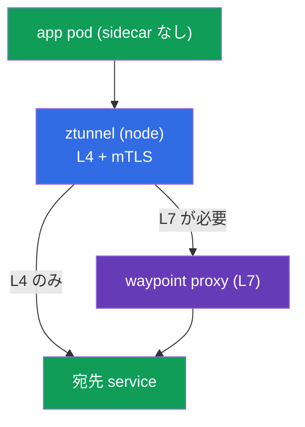
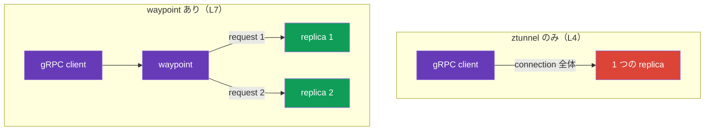
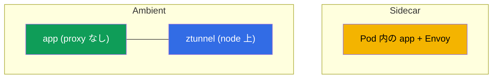
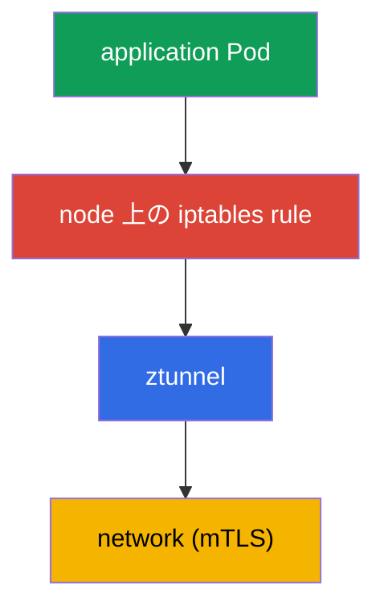
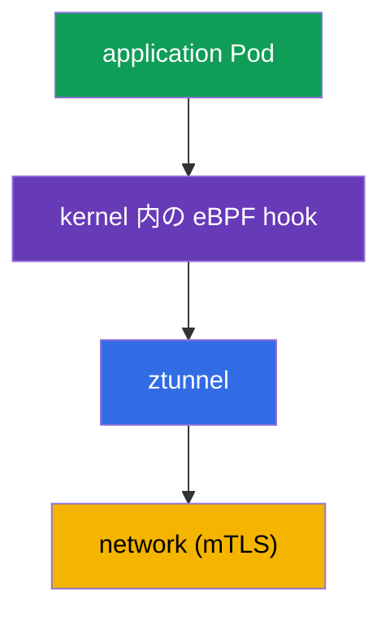

[Русская версия](ru.md) · [Eng version](en.md) · [Versión en español](es.md) · [Version française](fr.md) · [Deutsche Version](de.md) · [ქართული ვერსია](ge.md) · [繁體中文版](tw.md)

# 第22章. Ambient mode: ztunnel と waypoint proxy

> **この先。** これまでのコースでは、各 Pod に Envoy を置く従来の sidecar モデルを扱ってきました。強力ですが、コストがゼロではありません。Istio は代替として、sidecar を使わない **ambient mode** を提供します。この章では、その仕組み、2 層（L4 の ztunnel と L7 の waypoint）、sidecar との違い、使い分けを説明します。

## 22.1. ambient が必要な理由

Sidecar モデルでは、各 Pod に Envoy が追加されます。これにはコストがあります。

- **リソース。** 各 Pod の proxy が CPU とメモリを消費するため、数千 Pod では無視できません。
- **更新。** data plane を更新するには、全 Pod を再起動（新しい sidecar で再作成）する必要があります。
- **Pod への介入。** injection は Pod を変更し、init-container と iptables を追加するため、アプリケーションと衝突する場合があります。

Ambient mode は Pod から sidecar を取り除き、その機能を node と個別 proxy のレベルへ移します。考え方は、実際に必要な場所でのみ L7 処理のコストを負担し、基本的な保護（mTLS、L4）は低コストで全体に提供することです。

## 22.2. 2 層: ztunnel と waypoint

Ambient の中核は **2 つのレベルへの分離** です。

- **ztunnel** (zero-trust tunnel) - **node** ごとに 1 つの軽量コンポーネント（DaemonSet）。mTLS 暗号化、identity、基本的な telemetry という L4 を提供します。node 上のすべての ambient Pod の traffic がここを通ります。
- **waypoint proxy** - **L7** 用のフル機能 Envoy（routing、L7 authorization、HTTP 操作）です。各 Pod に置くのではなく、L7 が必要な namespace または service に必要に応じてデプロイします。



この分離の意味は次のとおりです。L4（暗号化と identity）は全員に必要で安価なため、node 上の ztunnel が提供します。一方、L7（高度な routing、HTTP による authorization）は常に必要とは限らないため、実際に必要な場所でのみ別の waypoint にコストを払います。

## 22.3. L4 層: ztunnel

`ztunnel` は DaemonSet です。各 node に 1 つの Pod を配置し、その node の ambient Pod の traffic を intercept して、次を提供します。

- service 間の **mTLS**（第13章と同様の暗号化と SPIFFE identity。ただし sidecar なし）。
- **L4 telemetry**（connection、byte、基本 metric）。
- セキュアな overlay を通じた**転送**（HBONE protocol - HTTP 上の tunnel）。

重要: ztunnel は **L4** でのみ動作します。HTTP を解析せず、path/header による routing も L7 authorization もできません。これらすべてには waypoint が必要です。つまり、ztunnel だけを有効にしても、Pod の観点では無料で全 traffic に zero-trust mTLS が得られます。

## 22.4. L7 層: waypoint proxy

L7 機能（HTTP による routing、mirroring、L7 authorization）が必要な場合、**waypoint proxy** をデプロイします。これは通常の Envoy ですが、アプリケーション Pod 内ではなく、namespace または service 用の別 deployment として配置されます。

Waypoint は Kubernetes Gateway API（第11章）または `istioctl waypoint apply` コマンドで作成し、service は label で接続します。

```bash
# namespace 用に waypoint をデプロイする
istioctl waypoint apply -n app

# サービスに waypoint 経由で通信するよう指定する
kubectl label service ping-pong -n app istio.io/use-waypoint=waypoint
```

内部では、`istioctl waypoint apply` は特殊な `istio-waypoint` class を持つ Gateway API 標準の **Gateway** resource（第11章）を作成します。GitOps では手作業でも記述できます。

```yaml
apiVersion: gateway.networking.k8s.io/v1
kind: Gateway
metadata:
  name: waypoint
  namespace: app
  labels:
    istio.io/waypoint-for: service    # waypoint の対象: service (デフォルト)、workload、all
spec:
  gatewayClassName: istio-waypoint    # 通常の ingress ではなく waypoint クラス
  listeners:
  - name: mesh
    port: 15008                        # HBONE ポート
    protocol: HBONE
```

`istio.io/use-waypoint` label により、異なるレベルで traffic を waypoint に関連付けられます。

- **namespace** - namespace の全 L7 traffic が waypoint を通過します。
- **service**（上記のとおり）- この service 宛てのみです。
- **Pod/workload** - 個別に指定できます。

この service 宛ての L7 traffic は waypoint を通過するようになり、通常の L7 `AuthorizationPolicy`、routing などがそこで動作します。lab の例では、waypoint が `GET` を許可し、`POST`/`DELETE` を block します。第14章と同じ L7 authorization ですが、sidecar ではなく waypoint で実行されます。

## 22.5. ambient における load balancing（および gRPC のケース）

ここで、第7章（load balancing）と第10章（gRPC）に直接関係する重要な注意点があります。ambient の load balancing は、traffic を処理する層に依存します。

- **ztunnel のみ（L4）。** ztunnel は layer 4 で動作するため、**connection 単位**で load balance します。service への新しい connection を endpoint に振り分けます。通常の HTTP/1.1 と短い connection にはこれで十分です。
- **waypoint あり（L7）。** service 宛ての traffic が waypoint を通ると、waypoint が HTTP を terminate し、sidecar と同様に**個々の request 単位**（L7）で load balance します。

ここで第10章で扱った **gRPC** の問題が生じます。gRPC は HTTP/2 です。1 本の長期間維持される connection に多数の request が multiplex されます。この traffic を ztunnel（L4）だけで load balance すると、connection 全体が**1 つの** replica に送られ、request は分散されません。これは kube-proxy とまったく同じ問題です。

結論: **gRPC（および真の per-request load balancing 全般）には ambient で waypoint が必要です。** L4 の ztunnel 層だけでは不十分です。connection は振り分けられますが、1 本の gRPC connection 内では load balancing されません。gRPC service 用の waypoint をデプロイすると、sidecar mode で標準提供されていた per-request load balancing（Pod 内の Envoy が直ちに L7 で動作）を取り戻せます。



## 22.6. ambient の install と有効化

### Ambient mode での Istio install

Ambient は独立した **installation profile** です。istiod、**istio-cni**、**ztunnel** を install します（sidecar profile には後者 2 つはありません）。istioctl では次のとおりです。

```bash
istioctl install --set profile=ambient --skip-confirmation
```

Helm では、`base`、`istiod`（`--set profile=ambient` 付き）、`cni`、`ztunnel` の 4 chart を install します。waypoint（L7）は install に含まれず、必要に応じてデプロイします（22.4節）。EKS では istio-cni を VPC CNI/Cilium（第27章）の上で有効にします。

### namespace で ambient を有効にする

Ambient は namespace の label で有効にします（sidecar の世界の `istio-injection=enabled` の代わりです）。

```bash
kubectl label namespace app istio.io/dataplane-mode=ambient
```

理解すべき重要点:

- この後、namespace の Pod は **sidecar を取得しません**。Pod はそのまま（istio-proxy なしの `1/1`）で、traffic は node 上の ztunnel が捕捉します。
- sidecar injection と異なり、Pod を**再起動する必要はありません**。これは大きな利点の一つです。ambient の有効化は稼働中 Pod に触れません。
- L4 mTLS は直ちに動作します。L7 機能は必要な場所だけ waypoint をデプロイして別途追加します（22.4節）。

Ambient には install 済みの **istio-cni**（第27章）が必要です。これが ztunnel への traffic interception を設定します。EKS では標準の **VPC CNI**（istio-cni が chain に追加される）または **Cilium** 上で動作します。CNI を選ぶ際には Istio version との compatibility を確認してください。

### sidecar → ambient の migration

migration は namespace ごとに段階的に行えます。sidecar と ambient は同一 mesh 内で互換です（22.9節）。1 つの namespace では次を行います。

1. ambient が install 済み（istio-cni + ztunnel）であることを確認します。上記を参照してください。
2. namespace から sidecar injection label を外し、ambient を付与します。

   ```bash
   kubectl label namespace app istio-injection-               # sidecar injection を削除する
   kubectl label namespace app istio.io/dataplane-mode=ambient
   ```

3. Pod を再起動して sidecar を取り除きます。

   ```bash
   kubectl rollout restart deployment -n app
   ```

   restart 後、Pod は istio-proxy なしの `1/1` になり、traffic は ztunnel が捕捉します。
4. L7（routing、L7 authorization、gRPC の per-request load balancing）が必要な service には、**waypoint** をデプロイします（22.4節）。sidecar ではこの機能は Pod 内にありましたが、ambient では waypoint が実行します。

重要な注意点: Pod を再起動するのは**1 回だけ**（sidecar を外すため）ですが、ambient を「ゼロから」有効にする場合は restart 不要です。mTLS と identity は共通 trust（第13章）により維持されるため、migration 中も sidecar と ambient の workload は中断なく通信を続けます。

## 22.7. ambient の threat model と制限

Ambient は節約だけのものではありません。production で選ぶ前に理解すべき独自の境界と security profile があります。

### ztunnel と node compromise

第13章（§13.11）の threat model を思い出してください。sidecar mode では workload の private key は**自身の** Envoy にあるため、node の root を奪取しても、その node で動く Pod の identity しか侵害されません。ambient では状況が変わります。**ztunnel は node ごとに 1 つで、その node の全 ambient Pod の mTLS identity を保持します**。ここには重要な trade-off があります。

- node または **ztunnel** の compromise は、その node の**全 ambient workload** の identity を一度に侵害する可能性があります。node 単位の blast radius は単一 sidecar より広くなります。
- したがって ztunnel は privileged component であり、その protection が極めて重要です。node への access を最小化し、価値の高い workload を専用 node に隔離し（13.11節と同様）、runtime detection と最新 patch を適用してください。

これは「ambient は安全性が低い」という意味ではありません。mTLS と Zero Trust は同様に提供します。しかし key の集中点は Pod から node へ移るため、threat model で考慮する必要があります（同じ defense-in-depth: container escape と node takeover を防ぐこと - CKS の領域です）。

### ambient の制限

Ambient は急速に発展していますが、成熟した sidecar と比べて注意点があります。

- **feature parity は完全ではありません。** 一部の細かな sidecar scenario（特定の `EnvoyFilter`、per-pod 固有設定）は ambient では異なる動作をするか、まだ利用できません。use case に合わせて確認してください。
- **multi-cluster はより新しい。** Multi-cluster ambient は sidecar multi-cluster（第28章）ほど実績がありません。複雑な topology では考慮が必要です。
- **L7 では追加 hop がある。** waypoint 経由の traffic は network hop が 1 つ増えます（Pod → ztunnel → waypoint → destination）。L4-only にはありませんが、L7 が必要な場合は「Pod 内の Envoy」より latency がわずかに高くなります。
- **troubleshooting が異なる。** traffic path（ztunnel/HBONE/waypoint）と tool が通常の sidecar と異なるため、team は学び直す必要があります。

## 22.8. Sidecar と ambient



| | Sidecar | Ambient |
|---|---------|---------|
| Proxy | 各 Pod 内 | node 上の ztunnel + 必要に応じた waypoint |
| Resources | 高い（Pod ごとの proxy） | 低い（特に L4-only） |
| Data plane の更新 | Pod restart | Pod restart なし |
| L7 機能 | 常に sidecar で利用可能 | waypoint が必要 |
| 成熟度 | 長年 production で実績あり | より新しく急速に発展中 |

実践的な指針:

- **Sidecar** - 実績ある選択肢で、すべての機能をすぐに使えます。モデルに納得でき、overhead が許容範囲なら適します。
- **Ambient** - resource 節約と update の容易さが重要で、service が多く、全 service に L7 が必要でない場合です。大部分の service に L4 mTLS で十分なら、特に有力です。

本コースでは、始めるにはより分かりやすく完全な sidecar で学びました。しかし ambient は Istio が向かう方向であり、知っておく価値があります。

## 22.9. sidecar と ambient を併用できるか

はい、できます。Istio は**mixed mode**をサポートします。同一 mesh 内で workload の一部は sidecar、別の一部は ambient で動作し、**相互に問題なく通信します**。両 mode は 1 つの istiod と共通 trust（第13章と同じ SPIFFE identity と mTLS）を使うため、sidecar service は ambient service を呼び出せ、その逆も可能です。相互運用は Istio が処理します。

mode の選択は namespace（または個別 workload）レベルです。ある namespace を `istio-injection=enabled`（sidecar）、別の namespace を `istio.io/dataplane-mode=ambient` とします。重要な制限: **同じ Pod を sidecar と ambient に同時にすることはできません**。Pod に sidecar があれば、ztunnel はそれを捕捉しません。

**mixed mode の利点:**

- **円滑な migration。** cluster 全体を一度に移行する必要はありません。何も壊さず、namespace ごとに sidecar から ambient へ移行できます。
- **用途に応じた選択。** resource 節約が重要で L4 で足りる場所では ambient、sidecar 固有機能が必要または既に十分に検証済みの場所では sidecar を維持できます。
- **compatibility が維持される。** mode 間の通信は透過的に動作し、mTLS は共通です。

**欠点:**

- **運用の複雑さ。** 同一 cluster に 2 つの data plane model があり、両方を理解、debug、運用する必要があります。
- **troubleshooting が難しい。** traffic path と diagnostic tool は sidecar と ambient で異なり、mixed cluster では混乱が増します。
- **機能の違い。** sidecar と ambient の feature set は完全には一致しないため、どこで何が使えるかを把握する必要があります。

**実践的な結論:** mixed mode は主に **migration path** と限定的な例外に適します。長期的には、運用を簡単にするため一貫性を目指してください。また、同じ Pod 上で sidecar と ambient を同時に使うことはできません。

## 22.10. Istio の eBPF

Ambient の話はほぼ常に **eBPF** につながります。そのため、これが何で、mesh の動作をどう変え、どのような利点と落とし穴があるかを詳しく説明します。

**eBPF** (extended Berkeley Packet Filter) は、Linux kernel の code を変更したり module を build したりせずに、小さく安全な program を**Linux kernel 内で直接**実行できる技術です。kernel は network packet の到着、system call の実行、connection の開始といった特定 event で sandbox 内の program を実行します。eBPF は network、observability、security に広く使われ、Cilium の基盤です。

### traffic が proxy に到達する方法: iptables と eBPF

traffic interception の**仕組み**を見ることで eBPF の役割を理解できます。sidecar と ambient のいずれでも、application traffic を proxy（Envoy または ztunnel）に「曲げる」必要があります。問題は kernel がそれをどう行うかです。

**従来の方法 - iptables。** Pod の起動時に iptables rule を設定し、application traffic を proxy に redirect します（第4章）。ambient では ztunnel への redirect に同じことを行います。



**eBPF を使う方法。** iptables chain の代わりに、kernel の network hook に接続した eBPF program が redirect を実行します。packet は大規模な iptables rule や余分な遷移なしに、kernel 内で直接 ztunnel へ曲げられます。



違いは interception の部分です: `iptables` 対 `eBPF hook`。その後も traffic は ztunnel に送られて暗号化されます。eBPF が変えるのは**どう intercept するか**であり、送信先ではありません。

Istio での使用箇所:

- **istio-cni**（第27章）は iptables ではなく redirect に eBPF mode を使用できます。
- **CNI としての Cilium**（第1、14章）は kernel 内の eBPF で L3/L4 と interception を実行し、Istio は L7 を担当します。ambient を含め人気の組み合わせです。

### 利点

- **performance。** user space と kernel 間の遷移が減り、長い iptables chain の overhead もないため、latency と data plane load が低減します。
- **Pod が単純になる。** 各 Pod に iptables rule や privileged init-container は不要です。interception は node/kernel レベルで設定されます。Pod の privilege が減るため security 上の利点でもあります。
- **scale。** iptables は数千 rule で scale しにくい一方、eBPF mechanism はより効率的です。

### 落とし穴

- **troubleshooting が難しい。** これが最大の問題です。慣れた tool は役に立ちません。redirect は iptables table ではなく kernel の eBPF program にあるため、`iptables -L` は何も表示しません。eBPF を認識する tool（`bpftool`、Cilium の tool、packet tracing 用の `pwru`）が必要です。iptables による debug の知識はここでは適用できず、新しい skill です。
- **kernel 要件。** eBPF function は Linux kernel version に依存します。古い kernel では一部機能が利用できません。managed platform では node の kernel version を確認してください。
- **成熟度と compatibility。** ambient 向け eBPF data plane は活発に開発されています。動作と機能は Istio、CNI、kernel の version に依存します。特定 CNI との compatibility を確認する必要があります。
- **慣れた tool が少ない。** iptables/tcpdump の debug ecosystem は豊富でよく知られています。eBPF toolchain は強力ですが、別途習得が必要です。

### 重要な注意: eBPF は Envoy を置き換えない

**eBPF は L7 の proxy を置き換えません。** 高度な routing、retries、L7 authorization、豊富な metric は、依然として user space の Envoy が実行します。eBPF は「配管」（interception、L4 処理）を最適化しますが、mesh の L7 機能は sidecar、ztunnel+waypoint、Cilium+Envoy のいずれでも proxy が担います。完全な「proxy なし」の eBPF mesh が存在するのは L4 レベルだけです。

今後の方向性は、data plane で iptables を減らし eBPF を増やし、interception を安価にすることです。ambient は主な beneficiary の一つです。しかし performance の代償はより複雑な debug であるため、production でこの data plane に依存する前に team は eBPF tool を習得する必要があります。

## 22.11. 章のまとめ

- **Ambient mode** - sidecar を使わない mode。Envoy の機能を Pod から node と個別 proxy のレベルへ移します。
- **ztunnel** - node ごとの DaemonSet で、overlay（HBONE）を介して mTLS、identity、基本 telemetry の L4 を提供します。全 ambient Pod に機能し、HTTP は理解しません。
- **waypoint proxy** - L7（routing、L7 authorization）用の別 Envoy。各 Pod ではなく、必要に応じて namespace/service にデプロイします。
- `istio.io/dataplane-mode=ambient` label で有効化します。Pod は**再起動されず** sidecar も取得しません。L4 mTLS は直ちに動作し、L7 は waypoint で追加します。
- Ambient は独立した **installation profile** です（`istioctl install --set profile=ambient`: istiod + istio-cni + ztunnel）。sidecar→ambient migration は namespace ごとに行います。injection label を外し、`dataplane-mode=ambient` を設定し、Pod を（一度だけ）restart し、L7 用に waypoint をデプロイします。
- Ambient は resource を節約し update を容易にします。sidecar は実績があり、すぐにフル機能です。選択は L7 の必要性と resource 要件によります。
- Load balancing: ztunnel（L4）は connection 単位、waypoint（L7）は request 単位で振り分けます。gRPC には waypoint が必要で、なければ connection 全体が 1 replica に固定されます（kube-proxy と同様）。
- Sidecar と ambient は同一 mesh 内で併用できます（共通 trust と mTLS）。migration や用途に応じた選択に便利ですが、運用は複雑になります。同じ Pod は sidecar と ambient を同時に使用できません。
- Threat model は変化します。**node ごとの ztunnel がその node の全 ambient Pod の key を保持する**ため、node/ztunnel の takeover は全 key を一度に侵害します（sidecar より広く、§13.11）。ztunnel には特別な保護が必要です。
- Ambient の制限: sidecar との feature parity が不完全、より新しい multi-cluster、L7 の追加 hop（waypoint 経由）、異なる troubleshooting。istio-cni が必要です（EKS では VPC CNI/Cilium 上）。
- **eBPF** は traffic interception の仕組みを変えます（iptables ではなく kernel 内の eBPF hook）。高速で、Pod の privilege が少なく、より良く scale します。しかし L7（routing、authz、metric）は依然 Envoy が実行します。eBPF は data plane を最適化するのであって proxy を置き換えるものではありません。
- eBPF の代償は**難しい troubleshooting**です。`iptables -L` は役に立たず、eBPF tool（bpftool、Cilium の tool）、新しい kernel version 要件が必要になります。

## 22.12. 自己確認の質問

1. Ambient は sidecar model のどの欠点を解決しますか？
2. ztunnel は何を担い、なぜ L4 でしか動作しないのですか？
3. waypoint proxy はいつ、なぜ必要ですか？ sidecar とはどう異なりますか？
4. Ambient を有効にするにはどうし、なぜ Pod の restart は不要ですか？
5. どのケースで ambient を選び、どのケースで sidecar に留まりますか？
6. Ambient では traffic はどう load balance され、なぜ gRPC に waypoint が必要ですか？
7. 同一 mesh 内で sidecar と ambient を併用できますか？ 利点、欠点、主な制限は何ですか？
8. eBPF とは何で、Istio ではどう使われますか？ eBPF は L7 の Envoy を置き換えますか？
9. eBPF による traffic interception は iptables とどう異なりますか？ どのような利点と落とし穴（特に troubleshooting）がありますか？
10. ztunnel により ambient の threat model はどう変化しますか？ node takeover はなぜ sidecar より危険で、何をすべきですか？
11. 成熟した sidecar と比較した ambient の制限を挙げてください。
12. Ambient mode で Istio を install するにはどうしますか（profile と component は何ですか）。また、namespace を sidecar から ambient へどう migration しますか？ migration に一度の Pod restart が必要な理由は何ですか？

## 演習

Ambient mode（sidecar なしの data plane）と L4 mTLS を練習します。

🧪 Lab 09: [tasks/ica/labs/09](../../labs/09/README_JP.MD)

Ambient の waypoint proxy と L7 authorization を練習します。

🧪 Lab 24: [tasks/ica/labs/24](../../labs/24/README_JP.MD)

---
[目次](../README_JP.md) · [第21章](../21/jp.md) · [第23章](../23/jp.md)
