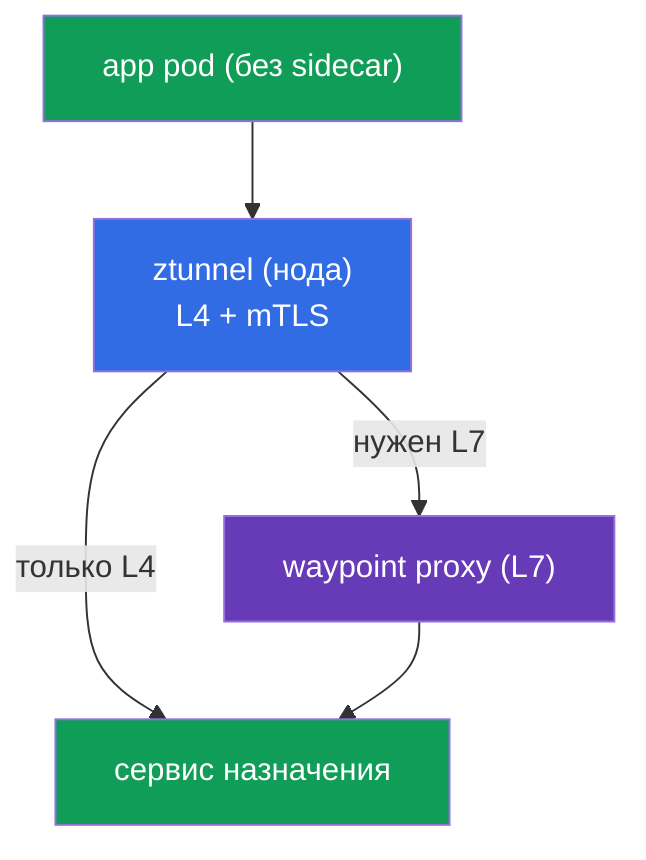
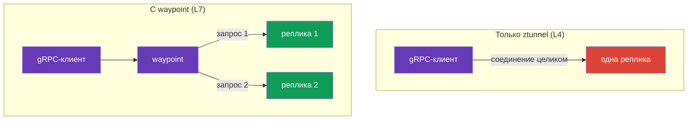
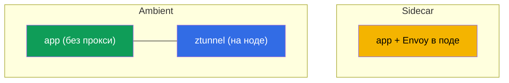
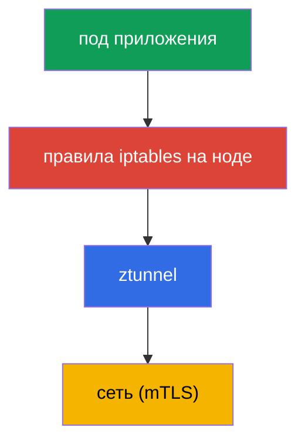
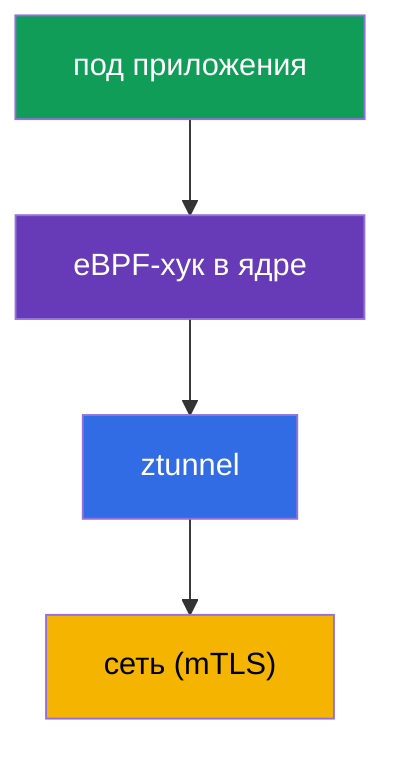

[Eng version](en.md)

# Глава 22. Ambient mode: ztunnel и waypoint proxy

> **Что дальше.** Весь курс мы работали с классической sidecar-моделью: Envoy в каждом
> поде. Она мощная, но не бесплатная. Istio предложил альтернативу - **ambient mode**,
> режим без сайдкаров. В этой главе разберём, как он устроен: два слоя (ztunnel для L4 и
> waypoint для L7), чем отличается от sidecar и когда что выбирать.

## 22.1. Зачем нужен ambient

Sidecar-модель добавляет Envoy в каждый под. У этого есть цена:

- **Ресурсы.** Прокси в каждом поде ест CPU и память - на тысячах подов это заметно.
- **Обновления.** Чтобы обновить data plane, нужно перезапустить все поды (пересоздать
  их с новым sidecar).
- **Вторжение в под.** Инъекция меняет под, добавляет init-контейнер, iptables - иногда
  это конфликтует с приложением.

Ambient mode убирает сайдкары из подов и выносит их функции на уровень ноды и отдельных
прокси. Идея: платить за L7-обработку только там, где она реально нужна, а базовую
защиту (mTLS, L4) дать всем дёшево.

## 22.2. Два слоя: ztunnel и waypoint

Ключевая идея ambient - **разделение на два уровня**:

- **ztunnel** (zero-trust tunnel) - лёгкий компонент, по одному на **ноду** (DaemonSet).
  Обеспечивает L4: mTLS-шифрование, идентичность, базовую телеметрию. Через него идёт
  трафик всех ambient-подов ноды.
- **waypoint proxy** - полноценный Envoy для **L7** (маршрутизация, L7-авторизация,
  манипуляции с HTTP). Он **не** в каждом поде, а разворачивается по требованию - на
  namespace или сервис, которым нужен L7.



Смысл разделения: L4 (шифрование и идентичность) нужен всем и стоит дёшево - его даёт
ztunnel на ноде. А L7 (умная маршрутизация, авторизация по HTTP) нужен не всегда, и за
него платите отдельным waypoint только там, где он реально требуется.

## 22.3. Слой L4: ztunnel

`ztunnel` - это DaemonSet: по одному поду на каждую ноду. Он перехватывает трафик
ambient-подов своей ноды и обеспечивает:

- **mTLS** между сервисами (шифрование и идентичность SPIFFE - как в главе 13, но без
  сайдкаров);
- **L4-телеметрию** (соединения, байты, базовые метрики);
- **транспорт** через защищённый overlay (протокол HBONE - туннелирование поверх HTTP).

Важно: ztunnel работает только на **L4**. Он не разбирает HTTP, не умеет
маршрутизировать по путям/заголовкам и не применяет L7-авторизацию. Для всего этого
нужен waypoint. То есть включив только ztunnel, вы уже получаете zero-trust mTLS для
всего трафика - бесплатно с точки зрения подов.

## 22.4. Слой L7: waypoint proxy

Когда нужны L7-возможности (маршрутизация по HTTP, зеркалирование, L7-авторизация),
разворачивают **waypoint proxy** - это обычный Envoy, но не в поде приложения, а
отдельным деплойментом на namespace или сервис.

Waypoint создаётся через Kubernetes Gateway API (помните главу 11) или командой
`istioctl waypoint apply`, а сервисы подключаются к нему меткой:

```bash
# развернуть waypoint для namespace
istioctl waypoint apply -n app

# указать сервису ходить через waypoint
kubectl label service ping-pong -n app istio.io/use-waypoint=waypoint
```

Под капотом `istioctl waypoint apply` создаёт ресурс **Gateway** стандарта Gateway API
(глава 11) со специальным классом `istio-waypoint` - его можно описать и вручную в GitOps:

```yaml
apiVersion: gateway.networking.k8s.io/v1
kind: Gateway
metadata:
  name: waypoint
  namespace: app
  labels:
    istio.io/waypoint-for: service    # для чего waypoint: service (по умолчанию), workload, all
spec:
  gatewayClassName: istio-waypoint    # именно waypoint-класс, не обычный ingress
  listeners:
  - name: mesh
    port: 15008                        # порт HBONE
    protocol: HBONE
```

Привязать трафик к waypoint можно на разных уровнях меткой `istio.io/use-waypoint`:

- на **namespace** - через waypoint проходит весь L7-трафик namespace;
- на **сервис** (как выше) - только к этому сервису;
- на **под/workload** - точечно.

Теперь L7-трафик к этому сервису проходит через waypoint, и на нём работают привычные
`AuthorizationPolicy` уровня L7, маршрутизация и прочее. Пример из лаб: waypoint
разрешает `GET`, но блокирует `POST`/`DELETE` - ровно та же L7-авторизация, что в главе
14, только исполняется в waypoint, а не в сайдкаре.

## 22.5. Балансировка в ambient (и случай gRPC)

Здесь всплывает важный нюанс, который прямо связан с главами 7 (балансировка) и 10
(gRPC). В ambient балансировка зависит от того, какой слой обрабатывает трафик.

- **Только ztunnel (L4).** ztunnel работает на уровне 4, поэтому балансирует **по
  соединениям**: новые соединения к сервису он раскидывает по его эндпоинтам. Для
  обычного HTTP/1.1 и коротких соединений этого достаточно.
- **С waypoint (L7).** Когда трафик к сервису идёт через waypoint, тот терминирует HTTP и
  балансирует **по отдельным запросам** (L7), как это делал sidecar.

И вот тут возникает знакомая по главе 10 проблема с **gRPC**. gRPC это HTTP/2: одно
долгоживущее соединение, в котором мультиплексируется много запросов. Если такой трафик
балансирует только ztunnel (L4), всё соединение уходит на **одну** реплику, и запросы не
распределяются - ровно та же беда, что с kube-proxy.

Вывод: **для gRPC (и вообще для честной per-request балансировки) в ambient нужен
waypoint.** Только L4-слоя ztunnel недостаточно: он раскидает соединения, но внутри
одного gRPC-соединения балансировки не будет. Развернув waypoint для gRPC-сервиса, вы
возвращаете per-request балансировку, которая в sidecar-режиме была из коробки (там
Envoy в поде сразу работал на L7).



## 22.6. Установка и включение ambient

### Установка Istio в ambient-режиме

Ambient - это отдельный **профиль установки**: он ставит istiod, **istio-cni** и **ztunnel**
(в sidecar-профиле их нет). Через istioctl:

```bash
istioctl install --set profile=ambient --skip-confirmation
```

Через Helm ставят четыре чарта: `base`, `istiod` (с `--set profile=ambient`), `cni` и
`ztunnel`. Waypoint'ы (L7) в установку не входят - их разворачивают по мере надобности
(раздел 22.4). На EKS istio-cni включается поверх VPC CNI/Cilium (глава 27).

### Включение ambient на namespace

Ambient включается меткой на namespace (вместо `istio-injection=enabled` из sidecar-мира):

```bash
kubectl label namespace app istio.io/dataplane-mode=ambient
```

Что важно понять:

- После этого поды namespace **не получают sidecar** - они остаются как есть (`1/1`, без
  istio-proxy). Их трафик подхватывает ztunnel на ноде.
- Перезапускать поды **не нужно** - в отличие от sidecar-инъекции. Это одно из главных
  удобств: включение ambient не трогает работающие поды.
- L4 mTLS начинает работать сразу. L7-функции добавляете отдельно, развернув waypoint
  (раздел 22.4) - только там, где нужно.

Ambient требует установленного **istio-cni** (глава 27) - именно он настраивает перехват
трафика на ztunnel. На EKS это работает поверх штатного **VPC CNI** (istio-cni включается в
цепочку) или поверх **Cilium**; при выборе CNI проверяйте совместимость с версией Istio.

### Миграция sidecar → ambient

Переезжать можно постепенно, namespace за namespace - sidecar и ambient совместимы в одном
mesh (раздел 22.9). Для одного namespace:

1. Убедиться, что ambient установлен (istio-cni + ztunnel) - см. выше.
2. Снять с namespace метку sidecar-инъекции и поставить ambient:

   ```bash
   kubectl label namespace app istio-injection-               # убрать sidecar-инъекцию
   kubectl label namespace app istio.io/dataplane-mode=ambient
   ```

3. Перезапустить поды, чтобы убрать из них sidecar:

   ```bash
   kubectl rollout restart deployment -n app
   ```

   После рестарта поды становятся `1/1` (без istio-proxy), а их трафик подхватывает ztunnel.
4. Для сервисов, которым нужен L7 (маршрутизация, L7-авторизация, per-request балансировка
   gRPC), развернуть **waypoint** (раздел 22.4) - в sidecar эти функции жили в поде, в ambient
   их выполняет waypoint.

Ключевой нюанс: под перезапускается **один раз** (чтобы снять sidecar), тогда как включение
ambient «с нуля» рестарта не требует. mTLS и identity сохраняются (общий trust, глава 13),
поэтому во время миграции sidecar- и ambient-нагрузки продолжают общаться без перебоев.

## 22.7. Модель угроз и ограничения ambient

Ambient - не только про экономию; у него свои границы и свой профиль безопасности, которые
надо понимать до выбора в прод.

### Ztunnel и компрометация ноды

Вспомните модель угроз из главы 13 (§13.11): в sidecar-режиме приватный ключ workload лежит в
**его собственном** Envoy, поэтому рут на ноде вскрывает личности только тех подов, что
крутятся на этой ноде. В ambient картина смещается: **ztunnel один на ноду и держит
mTLS-идентичности всех ambient-подов этой ноды**. Отсюда важный trade-off:

- Компрометация ноды или самого **ztunnel** потенциально вскрывает личности **всех
  ambient-нагрузок ноды** сразу - радиус поражения на ноду шире, чем у одиночного сайдкара.
- Значит, ztunnel - привилегированный компонент, и его защита критична: минимум доступа к
  нодам, изоляция ценных нагрузок на отдельные ноды (как в 13.11), runtime-детект, свежие
  патчи.

Это не «ambient менее безопасен» - mTLS и Zero Trust он даёт так же. Но точка концентрации
ключей смещается с пода на ноду, и это надо учитывать в модели угроз (та же defense-in-depth:
не дать сбежать из контейнера и захватить ноду - домен CKS).

### Ограничения ambient

Ambient быстро развивается, но по сравнению со зрелым sidecar есть нюансы:

- **Паритет фич не полный.** Часть тонких sidecar-сценариев (некоторые `EnvoyFilter`,
  специфичные per-pod настройки) в ambient работает иначе или пока недоступна - проверяйте под
  свой кейс.
- **Мультикластер новее.** Мультикластерный ambient менее обкатан, чем sidecar-мультикластер
  (глава 28); для сложных топологий это учитывают.
- **Лишний хоп на L7.** Трафик через waypoint - это дополнительный сетевой прыжок
  (под → ztunnel → waypoint → назначение); для L4-only его нет, но там, где нужен L7, латентность
  чуть выше, чем у «Envoy прямо в поде».
- **Другой troubleshooting.** Путь трафика (ztunnel/HBONE/waypoint) и инструменты отличаются от
  привычного sidecar - команде нужно переучиться.

## 22.8. Sidecar или ambient



| | Sidecar | Ambient |
|---|---------|---------|
| Прокси | в каждом поде | ztunnel на ноде + waypoint по требованию |
| Ресурсы | выше (прокси на под) | ниже (особенно для L4-only) |
| Обновление data plane | рестарт подов | без рестарта подов |
| L7-функции | всегда доступны в сайдкаре | нужен waypoint |
| Зрелость | много лет в проде | новее, быстро развивается |

Практический ориентир:

- **Sidecar** - проверенный временем выбор, все возможности сразу; подходит, если модель
  вас устраивает и оверхед приемлем.
- **Ambient** - когда важна экономия ресурсов и простота обновлений, много сервисов, а
  L7 нужен не всем. Особенно интересен, если большей части сервисов достаточно L4 mTLS.

В курсе мы учились на sidecar, потому что он нагляднее и полнее для старта. Но ambient -
это направление, куда движется Istio, и его точно стоит знать.

## 22.9. Можно ли совмещать sidecar и ambient

Да, можно. Istio поддерживает **смешанный режим**: в одном mesh часть нагрузок работает
с сайдкарами, часть - в ambient, и они **нормально общаются между собой**. Оба режима
используют один istiod и общий trust (та же SPIFFE-идентичность и mTLS из главы 13),
поэтому sidecar-сервис может вызывать ambient-сервис и наоборот - Istio берёт взаимную
работу на себя.

Выбор режима - на уровне namespace (или отдельной нагрузки): один namespace помечаете
`istio-injection=enabled` (sidecar), другой - `istio.io/dataplane-mode=ambient`. Важное
ограничение: **один и тот же под не может быть одновременно и с сайдкаром, и в ambient**
- если у пода есть sidecar, ztunnel его не перехватывает.

**Плюсы смешанного режима:**

- **Плавная миграция.** Не нужно переводить весь кластер разом. Можно namespace за
  namespace переезжать с sidecar на ambient, ничего не ломая.
- **Выбор под задачу.** Там, где важна экономия ресурсов и хватает L4 - ambient; там, где
  нужны специфичные для сайдкара возможности или уже всё отлажено - оставить sidecar.
- **Совместимость сохраняется.** Общение между режимами работает прозрачно, единый mTLS.

**Минусы:**

- **Сложность эксплуатации.** Две модели data plane в одном кластере: их обе надо
  понимать, отлаживать и обслуживать.
- **Тяжелее troubleshooting.** Путь трафика и инструменты диагностики различаются для
  sidecar и ambient - в смешанном кластере это добавляет путаницы.
- **Различия в возможностях.** Набор фич sidecar и ambient не полностью совпадает; надо
  держать в голове, что где доступно.

**Практический вывод:** смешанный режим хорош прежде всего как **путь миграции** и для
точечных исключений. В долгую стремитесь к единообразию - так проще эксплуатировать. И
помните: sidecar и ambient на одном поде одновременно - нельзя.

## 22.10. eBPF в Istio

Разговор про ambient почти всегда приводит к **eBPF**, поэтому разберём подробно, что
это, как меняет работу mesh и в чём плюсы и подводные камни.

**eBPF** (extended Berkeley Packet Filter) - технология, которая позволяет запускать
небольшие безопасные программы **прямо в ядре Linux**, не меняя его код и не собирая
модули. Ядро исполняет их в песочнице на определённых событиях: пришёл сетевой пакет,
выполнился системный вызов, открылось соединение. eBPF широко используют для сети,
наблюдаемости и безопасности - это основа Cilium.

### Как трафик попадает на прокси: iptables против eBPF

Чтобы понять роль eBPF, посмотрим на **механизм перехвата** трафика. И в sidecar, и в
ambient трафик приложения надо «завернуть» на прокси (Envoy или ztunnel). Вопрос - как
именно ядро это делает.

**Классический способ - iptables.** При старте пода настраиваются правила iptables,
которые перенаправляют трафик приложения на прокси (глава 4). В ambient то же самое
делается для перенаправления на ztunnel.



**Способ с eBPF.** Вместо цепочек iptables перенаправление делает eBPF-программа,
подключённая к сетевым хукам ядра. Пакет заворачивается на ztunnel прямо в ядре, без
громоздких iptables-правил и лишних переходов.



Разница в звене перехвата: `iptables` против `eBPF-хук`. Дальше трафик всё так же идёт на
ztunnel и шифруется - eBPF меняет **как перехватываем**, а не куда.

Где это встречается в Istio:

- **istio-cni** (глава 27) может использовать eBPF-режим для редиректа вместо iptables.
- **Cilium как CNI** (главы 1, 14) делает L3/L4 и перехват на eBPF в ядре, а Istio берёт
  L7. Популярная связка, в том числе для ambient.

### Польза

- **Производительность.** Меньше переходов между user space и ядром и нет накладных
  расходов на длинные цепочки iptables - ниже задержка и нагрузка на плоскости данных.
- **Проще под.** Не нужны правила iptables и привилегированный init-контейнер в каждом
  поде - перехват настраивается на уровне ноды/ядра. Это ещё и плюс к безопасности
  (меньше привилегий у подов).
- **Масштаб.** iptables плохо масштабируется на тысячах правил; eBPF-механизмы устроены
  эффективнее.

### Подводные камни

- **Сложнее troubleshooting.** Это главное. Привычные инструменты не помогут: `iptables
  -L` ничего не покажет, потому что перенаправление живёт в eBPF-программах ядра, а не в
  таблицах iptables. Нужны eBPF-осознанные инструменты (`bpftool`, средства Cilium,
  `pwru` для трассировки пакетов). Знание отладки через iptables здесь не применимо -
  это новый навык.
- **Требования к ядру.** eBPF-функции зависят от версии ядра Linux; на старых ядрах часть
  возможностей недоступна. На managed-платформах проверяйте версию ядра нод.
- **Зрелость и совместимость.** eBPF-датаплейн для ambient активно развивается; поведение
  и возможности зависят от версий Istio, CNI и ядра. Совместимость с конкретным CNI нужно
  проверять.
- **Меньше знакомых инструментов.** Экосистема отладки iptables/tcpdump богата и привычна;
  eBPF-инструментарий мощный, но требует отдельного освоения.

### Важная оговорка: eBPF не заменяет Envoy

**eBPF не заменяет прокси для L7.** Умная маршрутизация, retries, L7-авторизация, богатые
метрики - всё это по-прежнему делает Envoy в user space. eBPF оптимизирует «водопровод»
(перехват, L4-обработку), но L7-функции mesh остаются за прокси - будь то sidecar,
ztunnel+waypoint или Cilium+Envoy. Полностью «беспрокси» eBPF-mesh существует только на
уровне L4.

Куда это движется: меньше iptables, больше eBPF в плоскости данных, дешевле перехват - и
ambient один из главных бенефициаров. Но за производительность вы платите более сложной
отладкой, поэтому команда должна освоить eBPF-инструменты, прежде чем полагаться на такой
датаплейн в проде.

## 22.11. Итоги главы

- **Ambient mode** - режим без сайдкаров: функции Envoy выносятся из подов на уровень
  ноды и отдельных прокси.
- **ztunnel** - DaemonSet на ноду, даёт L4: mTLS, идентичность, базовую телеметрию через
  overlay (HBONE). Работает для всех ambient-подов и не понимает HTTP.
- **waypoint proxy** - отдельный Envoy для L7 (маршрутизация, L7-авторизация),
  разворачивается по требованию на namespace/сервис, а не в каждом поде.
- Включается меткой `istio.io/dataplane-mode=ambient`; поды **не перезапускаются** и не
  получают sidecar; L4 mTLS работает сразу, L7 добавляется через waypoint.
- Ambient - отдельный **профиль установки** (`istioctl install --set profile=ambient`:
  istiod + istio-cni + ztunnel). Миграция sidecar→ambient идёт по namespace: снять метку
  инъекции, поставить `dataplane-mode=ambient`, перезапустить поды (один раз), для L7 -
  развернуть waypoint.
- Ambient экономит ресурсы и упрощает обновления; sidecar - проверенный и полнофункциональный
  сразу. Выбор зависит от потребности в L7 и требований к ресурсам.
- Балансировка: ztunnel (L4) раскидывает по соединениям, waypoint (L7) - по запросам.
  Для gRPC нужен waypoint, иначе всё соединение липнет к одной реплике (как с kube-proxy).
- Sidecar и ambient можно совмещать в одном mesh (общий trust и mTLS) - удобно для
  миграции и выбора под задачу; минус - сложнее эксплуатация. Один под не может быть и с
  сайдкаром, и в ambient одновременно.
- Модель угроз смещается: **ztunnel один на ноду держит ключи всех ambient-подов ноды**,
  поэтому захват ноды/ztunnel вскрывает их все разом (шире, чем sidecar, §13.11) - ztunnel
  надо защищать особо.
- Ограничения ambient: неполный паритет фич с sidecar, более новый мультикластер, лишний хоп
  на L7 (через waypoint), другой troubleshooting. Требует istio-cni (на EKS поверх VPC CNI/Cilium).
- **eBPF** меняет механизм перехвата трафика (eBPF-хук в ядре вместо iptables): быстрее,
  меньше привилегий у подов, лучше масштабируется. Но L7 (маршрутизация, authz, метрики)
  по-прежнему делает Envoy - eBPF оптимизирует плоскость данных, а не заменяет прокси.
- Плата за eBPF - **сложный troubleshooting**: `iptables -L` бесполезен, нужны
  eBPF-инструменты (bpftool, средства Cilium), новые требования к версии ядра.

## 22.12. Вопросы для самопроверки

1. Какие минусы sidecar-модели решает ambient?
2. За что отвечает ztunnel и почему он работает только на L4?
3. Когда и зачем нужен waypoint proxy? Чем он отличается от сайдкара?
4. Как включить ambient и почему при этом не нужно перезапускать поды?
5. В каких случаях выбрать ambient, а в каких остаться на sidecar?
6. Как балансируется трафик в ambient и почему для gRPC нужен waypoint?
7. Можно ли совмещать sidecar и ambient в одном mesh? Каковы плюсы, минусы и главное
   ограничение?
8. Что такое eBPF и как он используется в Istio? Заменяет ли eBPF Envoy для L7?
9. Чем перехват трафика через eBPF отличается от iptables? Какая польза и какие подводные
   камни (в частности, с troubleshooting) это даёт?
10. Как меняется модель угроз в ambient из-за ztunnel? Почему захват ноды опаснее, чем в
    sidecar, и что с этим делать?
11. Назовите ограничения ambient по сравнению со зрелым sidecar.
12. Как установить Istio в ambient-режиме (какой профиль, какие компоненты) и как мигрировать
    namespace с sidecar на ambient? Почему при миграции нужен разовый рестарт подов?

## Практика

Отработайте ambient mode (data plane без сайдкаров) и L4 mTLS:

🧪 Лаба 09: [tasks/ica/labs/09](../../labs/09/README_RU.MD)

Отработайте waypoint proxy и L7-авторизацию в ambient:

🧪 Лаба 24: [tasks/ica/labs/24](../../labs/24/README_RU.MD)

---
[Оглавление](../README.md) · [Глава 21](../21/ru.md) · [Глава 23](../23/ru.md)
