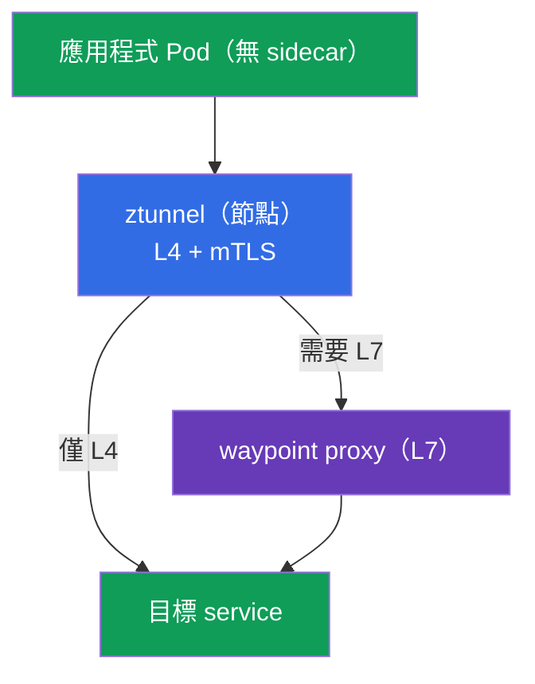
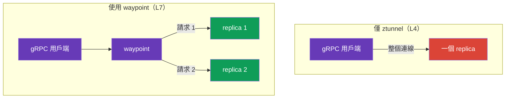
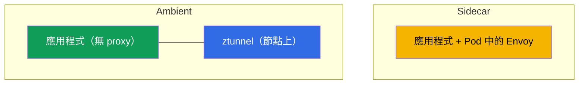
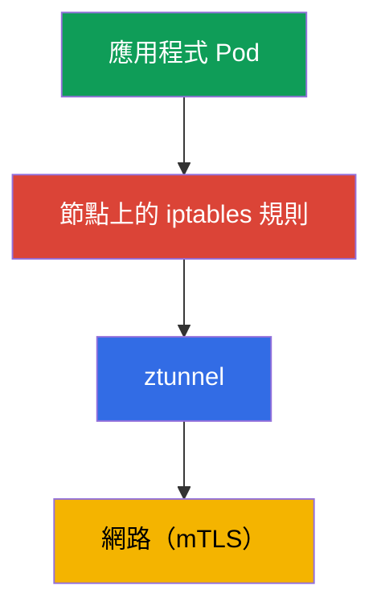
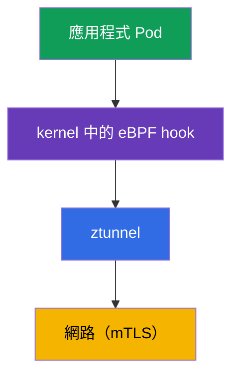

[Русская версия](ru.md) · [Eng version](en.md) · [Versión en español](es.md) · [Version française](fr.md) · [Deutsche Version](de.md) · [ქართული ვერსია](ge.md) · [日本語版](jp.md)

# 第 22 章：Ambient 模式：ztunnel 與 waypoint proxy

> **接下來。** 整個課程中，我們使用的是經典的 sidecar 模型：每個 Pod 中都有 Envoy。它功能強大，但並非沒有成本。Istio 提出了另一種選擇--**ambient mode**，也就是無 sidecar 模式。本章將了解其運作方式：兩個層次（L4 的 ztunnel 與 L7 的 waypoint）、與 sidecar 的差異，以及各自適用的情境。

## 22.1. 為何需要 ambient

Sidecar 模型會在每個 Pod 中加入 Envoy，這會帶來成本：

- **資源。** 每個 Pod 中的 proxy 都會消耗 CPU 與記憶體--在數千個 Pod 上尤其明顯。
- **更新。** 若要更新 data plane，必須重新啟動所有 Pod（以新的 sidecar 重建）。
- **侵入 Pod。** 注入會修改 Pod，加入 init container、iptables--有時會與應用程式衝突。

Ambient mode 將 sidecar 從 Pod 中移除，並將其功能移至節點層級與獨立 proxy。核心想法是：只在真正需要 L7 處理的地方付出成本，而以低成本為所有工作負載提供基礎保護（mTLS、L4）。

## 22.2. 兩個層次：ztunnel 與 waypoint

Ambient 的核心概念是**分為兩個層次**：

- **ztunnel**（zero-trust tunnel）--輕量元件，每個**節點**一個（DaemonSet）。提供 L4：mTLS 加密、身分識別、基本遙測。該節點所有 ambient Pod 的流量都會經過它。
- **waypoint proxy**--完整的 Envoy，負責 **L7**（路由、L7 授權、HTTP 操作）。它**不會**存在於每個 Pod 中，而是按需部署--部署於需要 L7 的 namespace 或 service。



這種劃分的意義是：L4（加密與身分識別）是所有人都需要且成本低廉的功能--由節點上的 ztunnel 提供。而 L7（智慧路由、基於 HTTP 的授權）並非總是需要，因此只在真正需要的地方透過獨立 waypoint 付費。

## 22.3. L4 層：ztunnel

`ztunnel` 是一個 DaemonSet：每個節點一個 Pod。它攔截其節點上 ambient Pod 的流量，並提供：

- service 之間的 **mTLS**（加密與 SPIFFE 身分識別--如第 13 章所述，但沒有 sidecar）；
- **L4 遙測**（連線、位元組、基本指標）；
- 透過安全 overlay 的**傳輸**（HBONE 協定--在 HTTP 上進行 tunnel）。

重要的是：ztunnel 僅在 **L4** 運作。它不解析 HTTP、不會依路徑／header 路由，也不套用 L7 授權。所有這些功能都需要 waypoint。也就是說，只啟用 ztunnel，就能為所有流量取得 zero-trust mTLS--從 Pod 的角度來說無需額外成本。

## 22.4. L7 層：waypoint proxy

當需要 L7 功能（基於 HTTP 的路由、mirroring、L7 授權）時，會部署 **waypoint proxy**--它是一般的 Envoy，但不在應用程式 Pod 中，而是作為 namespace 或 service 的獨立 deployment。

Waypoint 可透過 Kubernetes Gateway API（還記得第 11 章嗎）或 `istioctl waypoint apply` 指令建立，service 則透過 label 連接至它：

```bash
# 為 namespace 部署 waypoint
istioctl waypoint apply -n app

# 指示服務透過 waypoint 通訊
kubectl label service ping-pong -n app istio.io/use-waypoint=waypoint
```

在底層，`istioctl waypoint apply` 會建立 Gateway API 標準的 **Gateway** 資源（第 11 章），並使用特殊的 `istio-waypoint` class--也可以在 GitOps 中手動描述：

```yaml
apiVersion: gateway.networking.k8s.io/v1
kind: Gateway
metadata:
  name: waypoint
  namespace: app
  labels:
    istio.io/waypoint-for: service    # waypoint 的用途：service（預設）、workload、all
spec:
  gatewayClassName: istio-waypoint    # 就是 waypoint class，而非一般 ingress
  listeners:
  - name: mesh
    port: 15008                        # HBONE 連接埠
    protocol: HBONE
```

可透過 `istio.io/use-waypoint` label 在不同層級將流量綁定至 waypoint：

- **namespace** 層級--該 namespace 的所有 L7 流量都會經過 waypoint；
- **service** 層級（如上）--僅前往該 service 的流量；
- **Pod/workload** 層級--精確指定。

現在，前往此 service 的 L7 流量會經過 waypoint，熟悉的 L7 層級 `AuthorizationPolicy`、路由等功能都在其上運作。實驗範例中，waypoint 允許 `GET`，但封鎖 `POST`/`DELETE`--與第 14 章完全相同的 L7 授權，只是執行於 waypoint 而非 sidecar。

## 22.5. Ambient 中的負載平衡（以及 gRPC 情況）

此處有個重要細節，與第 7 章（負載平衡）及第 10 章（gRPC）直接相關。在 ambient 中，負載平衡取決於由哪個層次處理流量。

- **僅 ztunnel（L4）。** ztunnel 在第 4 層運作，因此依**連線**進行負載平衡：它將指向 service 的新連線分配到其 endpoint。對一般 HTTP/1.1 與短連線而言，這已足夠。
- **使用 waypoint（L7）。** 當前往 service 的流量經過 waypoint 時，它會終止 HTTP，並如同 sidecar 一樣依**個別請求**（L7）進行負載平衡。

此時便會出現第 10 章熟悉的 **gRPC** 問題。gRPC 使用 HTTP/2：一條長連線中多工許多請求。如果這類流量僅由 ztunnel（L4）負載平衡，整個連線都會前往**一個** replica，請求不會被分配--與 kube-proxy 的問題完全相同。

結論：**在 ambient 中，gRPC（以及所有真正按請求負載平衡的情境）都需要 waypoint。** 僅有 ztunnel 的 L4 層並不足夠：它會分配連線，但在單一 gRPC 連線內不會進行負載平衡。為 gRPC service 部署 waypoint 後，即可恢復 sidecar 模式原本即具備的按請求負載平衡（該模式中 Pod 內的 Envoy 一開始就在 L7 運作）。



## 22.6. 安裝與啟用 ambient

### 以 ambient 模式安裝 Istio

Ambient 是獨立的**安裝 profile**：它會安裝 istiod、**istio-cni** 與 **ztunnel**（sidecar profile 中沒有後兩者）。透過 istioctl：

```bash
istioctl install --set profile=ambient --skip-confirmation
```

透過 Helm 則安裝四個 chart：`base`、`istiod`（使用 `--set profile=ambient`）、`cni` 與 `ztunnel`。Waypoint（L7）不包含在安裝中--會按需要部署（第 22.4 節）。在 EKS 上，istio-cni 啟用於 VPC CNI/Cilium 之上（第 27 章）。

### 在 namespace 啟用 ambient

Ambient 是透過 namespace 的 label 啟用（取代 sidecar 世界中的 `istio-injection=enabled`）：

```bash
kubectl label namespace app istio.io/dataplane-mode=ambient
```

需理解以下重點：

- 此後，namespace 中的 Pod **不會取得 sidecar**--它們維持原樣（`1/1`，沒有 istio-proxy）。其流量由節點上的 ztunnel 接管。
- **不需要**重新啟動 Pod--這與 sidecar 注入不同。這是主要便利之一：啟用 ambient 不會碰觸正在運行的 Pod。
- L4 mTLS 立即開始運作。L7 功能則另行加入，部署 waypoint（第 22.4 節）--只在需要的地方部署。

Ambient 需要安裝 **istio-cni**（第 27 章）--正是它設定流量攔截至 ztunnel。在 EKS 上，這可運作於標準 **VPC CNI**（istio-cni 加入其鏈結）或 **Cilium** 之上；選擇 CNI 時，請檢查其與 Istio 版本的相容性。

### Sidecar → ambient 遷移

可逐步遷移，一次一個 namespace--sidecar 與 ambient 可在同一 mesh 中相容共存（第 22.9 節）。針對一個 namespace：

1. 確認 ambient 已安裝（istio-cni + ztunnel）--見上文。
2. 移除 namespace 的 sidecar 注入 label，並設定 ambient：

   ```bash
   kubectl label namespace app istio-injection-               # 移除 sidecar 注入
   kubectl label namespace app istio.io/dataplane-mode=ambient
   ```

3. 重新啟動 Pod，以移除其中的 sidecar：

   ```bash
   kubectl rollout restart deployment -n app
   ```

   重啟後，Pod 變為 `1/1`（沒有 istio-proxy），其流量由 ztunnel 接管。
4. 對需要 L7 的 service（路由、L7 授權、gRPC 的按請求負載平衡），部署 **waypoint**（第 22.4 節）--在 sidecar 模式中這些功能存在於 Pod 中，在 ambient 模式中則由 waypoint 執行。

關鍵細節：Pod 僅需重新啟動**一次**（以移除 sidecar），而從零啟用 ambient 則不需要重啟。mTLS 與 identity 會保留（共用 trust，第 13 章），因此在遷移期間，sidecar 與 ambient 工作負載會持續無中斷地通訊。

## 22.7. Ambient 的威脅模型與限制

Ambient 不僅關乎節省成本；它有自身的界限與安全設定檔，必須在 production 中做出選擇前理解。

### Ztunnel 與節點遭入侵

回想第 13 章（§13.11）的威脅模型：在 sidecar 模式中，workload 的私密金鑰位於**其自身的** Envoy 中，因此取得節點 root 權限只會洩露運行在該節點上的 Pod 身分。在 ambient 中，情況有所改變：**每個節點僅一個 ztunnel，並持有該節點所有 ambient Pod 的 mTLS 身分識別**。這帶來重要的權衡：

- 節點或 **ztunnel** 本身遭入侵，可能一次洩露**該節點所有 ambient 工作負載**的身分--每個節點的影響範圍比單一 sidecar 更廣。
- 因此 ztunnel 是特權元件，其保護至關重要：盡量減少節點存取、將高價值工作負載隔離在專用節點（如 13.11 所述）、runtime 偵測、及時修補。

這並不是「ambient 較不安全」--它同樣提供 mTLS 與 Zero Trust。但金鑰的集中點從 Pod 移至節點，威脅模型必須考量此事（相同的 defense-in-depth：避免逃離 container 並接管節點--CKS 的範疇）。

### Ambient 的限制

Ambient 正快速發展，但與成熟的 sidecar 相比仍有細節需要注意：

- **功能 parity 尚未完整。** 部分精細的 sidecar 情境（某些 `EnvoyFilter`、特定 per-pod 設定）在 ambient 中運作方式不同或暫時不可用--請依自身案例確認。
- **Multicluster 較新。** Ambient multicluster 的成熟度低於 sidecar multicluster（第 28 章）；複雜拓撲須考量此點。
- **L7 額外一跳。** 經由 waypoint 的流量需額外一次網路跳轉（Pod → ztunnel → waypoint → 目的地）；L4-only 沒有此問題，但在需要 L7 的地方，延遲會略高於「Envoy 直接在 Pod 中」。
- **不同的 troubleshooting。** 流量路徑（ztunnel/HBONE/waypoint）與工具皆不同於熟悉的 sidecar--團隊必須重新學習。

## 22.8. Sidecar 還是 ambient



| | Sidecar | Ambient |
|---|---------|---------|
| Proxy | 每個 Pod 中 | 節點上的 ztunnel + 按需 waypoint |
| 資源 | 較高（每個 Pod 一個 proxy） | 較低（尤其是 L4-only） |
| 更新 data plane | 重啟 Pod | 不必重啟 Pod |
| L7 功能 | sidecar 中始終可用 | 需要 waypoint |
| 成熟度 | 已在 production 運行多年 | 較新，快速發展中 |

實務指引：

- **Sidecar**--久經驗證的選擇，立即具備所有功能；若此模型適合您且 overhead 可接受，便很合適。
- **Ambient**--當資源節省與更新簡易性很重要、service 很多而並非所有服務都需要 L7 時適用。若大多數 service 僅需 L4 mTLS，尤其值得考慮。

課程中我們以 sidecar 學習，因為它對入門而言更直觀且完整。但 ambient 是 Istio 正在前進的方向，絕對值得了解。

## 22.9. 可以混用 sidecar 與 ambient 嗎

可以。Istio 支援**混合模式**：在同一 mesh 中，部分工作負載使用 sidecar，部分使用 ambient，且它們**可以正常彼此通訊**。兩種模式使用同一 istiod 與共用 trust（與第 13 章相同的 SPIFFE identity 與 mTLS），因此 sidecar service 可呼叫 ambient service，反之亦然--Istio 會處理相互操作。

模式的選擇在 namespace（或個別工作負載）層級進行：將一個 namespace 標記為 `istio-injection=enabled`（sidecar），另一個標記為 `istio.io/dataplane-mode=ambient`。重要限制是：**同一 Pod 無法同時具有 sidecar 與處於 ambient 中**--如果 Pod 有 sidecar，ztunnel 就不會攔截它。

**混合模式的優點：**

- **平順遷移。** 無需一次轉換整個 cluster。可以逐個 namespace 從 sidecar 遷移至 ambient，而不會破壞任何項目。
- **依任務選擇。** 在重視資源節省且 L4 足夠之處使用 ambient；在需要 sidecar 特有功能或一切已調校妥當的地方保留 sidecar。
- **相容性得以維持。** 模式間的通訊透明運作，使用統一的 mTLS。

**缺點：**

- **營運複雜性。** 一個 cluster 中有兩種 data plane 模型：兩者都必須理解、除錯及維護。
- **Troubleshooting 更困難。** 流量路徑與診斷工具對 sidecar 和 ambient 不同--在混合 cluster 中，這會增加混亂。
- **功能差異。** Sidecar 與 ambient 的功能集合並不完全相同；必須記住各項功能在哪裡可用。

**實務結論：**混合模式最適合作為**遷移路徑**及針對性例外。在長期而言，應追求一致性--這樣更易於營運。並請記住：同一 Pod 不能同時使用 sidecar 與 ambient。

## 22.10. Istio 中的 eBPF

關於 ambient 的討論幾乎總會引至 **eBPF**，因此讓我們詳細了解它是什麼、如何改變 mesh 的運作，以及其優勢與陷阱。

**eBPF**（extended Berkeley Packet Filter）是一項技術，可在**Linux kernel 內直接**執行小型安全程式，無需修改其程式碼或編譯 module。kernel 在特定事件中於 sandbox 執行它們：網路封包到達、執行 system call、開啟連線。eBPF 廣泛用於網路、observability 與安全性--它是 Cilium 的基礎。

### 流量如何到達 proxy：iptables 與 eBPF

要理解 eBPF 的角色，先看看流量**攔截機制**。無論在 sidecar 還是 ambient 中，應用程式流量都必須被「導向」proxy（Envoy 或 ztunnel）。問題在於 kernel 究竟如何實現。

**經典方法是 iptables。** Pod 啟動時會設定 iptables 規則，將應用程式流量重新導向至 proxy（第 4 章）。Ambient 也以相同方式重新導向至 ztunnel。



**eBPF 方法。** eBPF 程式會取代 iptables chain 進行重新導向，並附加至 kernel 的網路 hook。封包直接在 kernel 中導向 ztunnel，無需龐大的 iptables 規則或額外轉換。



差異在於攔截環節：`iptables` 對上 `eBPF-hook`。後續流量仍會前往 ztunnel 並加密--eBPF 改變的是**如何攔截**，而不是導向何處。

在 Istio 中可見於：

- **istio-cni**（第 27 章）可使用 eBPF 模式進行 redirect，而非 iptables。
- **Cilium 作為 CNI**（第 1、14 章）在 kernel 中透過 eBPF 處理 L3/L4 與攔截，而 Istio 處理 L7。這是常見組合，也包含 ambient。

### 優點

- **效能。** 在 user space 與 kernel 間的轉換較少，也沒有冗長 iptables chain 的 overhead--data plane 的延遲與負載更低。
- **Pod 更簡單。** 每個 Pod 不需要 iptables 規則與特權 init container--攔截在節點／kernel 層級設定。這也是安全性的優點（Pod 的特權更少）。
- **規模。** iptables 難以隨數千條規則擴展；eBPF 機制的設計更有效率。

### 陷阱

- **Troubleshooting 更困難。** 這是主要問題。慣用工具不會有幫助：`iptables
  -L` 不會顯示任何內容，因為重新導向存在於 kernel eBPF 程式中，而非 iptables table。需要具 eBPF 意識的工具（`bpftool`、Cilium 工具、用於封包追蹤的 `pwru`）。此處無法套用透過 iptables 除錯的知識--這是一項新技能。
- **Kernel 要求。** eBPF 功能取決於 Linux kernel 版本；在舊 kernel 上部分功能無法使用。在 managed platform 上，請檢查節點 kernel 版本。
- **成熟度與相容性。** Ambient 的 eBPF data plane 正積極發展；行為與功能取決於 Istio、CNI 與 kernel 版本。必須確認與特定 CNI 的相容性。
- **熟悉工具較少。** iptables/tcpdump 的除錯生態豐富且熟悉；eBPF 工具強大，但需要額外學習。

### 重要保留：eBPF 不會取代 Envoy

**eBPF 不會取代 L7 的 proxy。** 智慧路由、retries、L7 授權、豐富 metrics--所有這些仍由 user space 的 Envoy 處理。eBPF 最佳化的是「管線」（攔截、L4 處理），但 mesh 的 L7 功能仍由 proxy 負責--無論是 sidecar、ztunnel+waypoint 或 Cilium+Envoy。完全「無 proxy」的 eBPF mesh 僅存在於 L4 層級。

發展方向是：data plane 中更少 iptables、更多 eBPF、攔截成本更低--ambient 是主要受益者之一。但更高效能的代價是較複雜的除錯，因此團隊必須先掌握 eBPF 工具，再依賴此類 data plane 用於 production。

## 22.11. 本章總結

- **Ambient mode**--無 sidecar 模式：Envoy 的功能從 Pod 移至節點層級與獨立 proxy。
- **ztunnel**--每個節點的 DaemonSet，提供 L4：透過 overlay（HBONE）提供 mTLS、identity 與基本 telemetry。它為所有 ambient Pod 運作，且不理解 HTTP。
- **waypoint proxy**--用於 L7（路由、L7 授權）的獨立 Envoy，按需部署於 namespace/service，而非每個 Pod 中。
- 透過 `istio.io/dataplane-mode=ambient` label 啟用；Pod **不會重新啟動**且不會獲得 sidecar；L4 mTLS 立即運作，L7 則透過 waypoint 加入。
- Ambient 是獨立的**安裝 profile**（`istioctl install --set profile=ambient`：istiod + istio-cni + ztunnel）。Sidecar→ambient 遷移以 namespace 進行：移除注入 label、設定 `dataplane-mode=ambient`、重新啟動 Pod（一次），並為 L7 部署 waypoint。
- Ambient 節省資源並簡化更新；sidecar 是久經驗證且立即具備完整功能的選擇。選擇取決於 L7 需求與資源要求。
- 負載平衡：ztunnel（L4）依連線分配，waypoint（L7）依請求分配。gRPC 需要 waypoint，否則整個連線會黏在一個 replica 上（如同 kube-proxy）。
- Sidecar 與 ambient 可在同一 mesh 中混用（共用 trust 與 mTLS）--便於遷移及依任務選擇；缺點是營運更複雜。同一 Pod 不得同時使用 sidecar 和 ambient。
- 威脅模型發生改變：**每個節點的一個 ztunnel 持有該節點所有 ambient Pod 的金鑰**，因此接管節點/ztunnel 會一次洩露全部金鑰（比 sidecar 更廣，§13.11）--必須特別保護 ztunnel。
- Ambient 的限制：與 sidecar 的功能 parity 不完整、multicluster 較新、L7 額外一跳（經 waypoint）、不同的 troubleshooting。需要 istio-cni（在 EKS 上位於 VPC CNI/Cilium 之上）。
- **eBPF** 改變流量攔截機制（kernel 中的 eBPF hook 取代 iptables）：更快、Pod 特權更少、可更佳擴展。但 L7（路由、authz、metrics）仍由 Envoy 處理--eBPF 最佳化 data plane，而非取代 proxy。
- eBPF 的代價是**複雜的 troubleshooting**：`iptables -L` 無用，需要 eBPF 工具（bpftool、Cilium 工具）、並有新的 kernel 版本要求。

## 22.12. 自我檢查問題

1. Ambient 解決了 sidecar 模型的哪些缺點？
2. Ztunnel 負責什麼？為何它僅在 L4 運作？
3. 何時、為何需要 waypoint proxy？它與 sidecar 有何不同？
4. 如何啟用 ambient？為何不需要重新啟動 Pod？
5. 哪些情況該選擇 ambient，哪些情況該保留 sidecar？
6. Ambient 中的流量如何負載平衡？為何 gRPC 需要 waypoint？
7. 能否在同一 mesh 中混用 sidecar 與 ambient？其優點、缺點及主要限制為何？
8. 什麼是 eBPF？它如何用於 Istio？eBPF 會取代 L7 的 Envoy 嗎？
9. 透過 eBPF 攔截流量與 iptables 有何不同？帶來哪些優點與陷阱（特別是 troubleshooting）？
10. 由於 ztunnel，ambient 中的威脅模型如何改變？為何接管節點比在 sidecar 中更危險？該如何應對？
11. 相較於成熟的 sidecar，ambient 有哪些限制？
12. 如何以 ambient 模式安裝 Istio（哪個 profile、哪些元件）？如何將 namespace 從 sidecar 遷移至 ambient？為何遷移時需要一次性重啟 Pod？

## 實作

練習 ambient mode（無 sidecar 的 data plane）與 L4 mTLS：

🧪 實驗 09：[tasks/ica/labs/09](../../labs/09/README_TW.MD)

練習 ambient 中的 waypoint proxy 與 L7 授權：

🧪 實驗 24：[tasks/ica/labs/24](../../labs/24/README_TW.MD)

---
[目錄](../README_TW.md) · [第 21 章](../21/tw.md) · [第 23 章](../23/tw.md)
