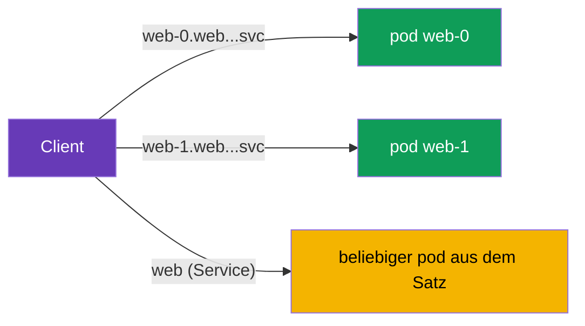

[RU version](ru.md) · [Eng version](en.md) · [Versión en español](es.md) · [Version française](fr.md)

# Kapitel 23. StatefulSet und headless-Services im mesh

> **Was kommt als Nächstes.** Die meisten Beispiele im Kurs drehten sich um stateless-Services
> hinter einem gewöhnlichen Service. Aber im cluster gibt es auch stateful-Workloads:
> Datenbanken, Kafka, Zookeeper - sie werden über StatefulSet und headless-Services gestartet.
> Sie haben ihre eigene Adressierungsspezifik, die im mesh wichtig zu berücksichtigen ist. In
> diesem Kapitel betrachten wir, wie Istio mit ihnen arbeitet.

## 23.1. Erinnerung: StatefulSet und headless-Services

Frischen wir kurz auf, was Sie aus CKA kennen.

- **StatefulSet** startet Pods mit **stabiler Identität**: jeder hat seinen beständigen Namen
  (`web-0`, `web-1`, ...), seine persistente Platte und seinen stabilen DNS-Namen. Genau das
  brauchen Datenbanken und cluster-Systeme, in denen die Knoten nicht austauschbar sind.
- **Headless-Service** (`clusterIP: None`) - ein Service ohne einzelne virtuelle IP. Statt die
  Pods hinter einer ClusterIP zu verstecken, gibt er in DNS die **Adressen konkreter Pods**
  zurück. Ein StatefulSet nutzt einen headless-Service, um jedem pod einen stabilen DNS-Namen
  der Form `web-0.web.app.svc.cluster.local` zu geben.

Das heißt, stateful-Workloads haben zwei Arten der Adressierung: zum Service als Ganzes und zum
**konkreten pod nach Namen**. Genau das ist der Hauptunterschied zu den gewohnten
stateless-Services.

## 23.2. Ansprechen eines konkreten pod

Mit einem headless-Service kann ein Client nicht „den Service“ ansprechen (und einen zufälligen
pod erhalten), sondern einen streng bestimmten pod über seinen stabilen Namen:



```bash
# an einen konkreten pod
curl http://web-0.web.app.svc.cluster.local:8080/   # Server Name: web-0
curl http://web-1.web.app.svc.cluster.local:8080/   # Server Name: web-1
```

Das ist kritisch für stateful-Systeme: zum Beispiel sind in einem DB-cluster die Repliken nicht
gleichwertig, und der Client muss genau auf den richtigen Knoten treffen (Leader, konkreter
Shard). Balancing „auf einen beliebigen pod“ passt hier nicht.

## 23.3. Besonderheiten im mesh

Istio unterstützt headless-Services und StatefulSet, aber es gibt Details, die man kennen muss.

- **Benennung der Ports - Pflicht.** Wie überall in Istio (Kapitel 2 und 10) muss der Port im
  Service nach Protokoll benannt werden (`http`, `grpc`, `tcp` usw.) oder `appProtocol` gesetzt
  werden. Für headless ist das besonders wichtig: ohne korrekten Namen versteht Istio das
  Protokoll nicht und kann den Traffic falsch verarbeiten. Ist das Protokoll nicht HTTP - lautet
  der Portname `tcp`.
- **Zwei Traffic-Pfade.** Das Ansprechen eines konkreten pod (`web-0...`) und des Service als
  Ganzes verarbeitet Istio unterschiedlich. Bei der Adressierung an einen pod geht der Traffic
  genau dorthin und umgeht das übliche Balancing über den Satz - das ist erwartet und für
  stateful nötig. Technisch baut Istio unter der Haube für headless einen cluster vom Typ
  **`ORIGINAL_DST`** (passthrough auf die reale Ziel-IP) und kein EDS-Balancing über die
  Endpoint-Liste wie für gewöhnliches ClusterIP. Deshalb geht eine Anfrage an `web-0...` genau
  auf diesen pod, und die Balancing-/subsets-Einstellungen in `DestinationRule` funktionieren bei
  direkter Adressierung faktisch nicht - es gibt nichts zu balancieren.
- **mTLS funktioniert.** Die Pods eines StatefulSet erhalten dieselbe SPIFFE-Identität und
  dasselbe mTLS wie gewöhnliche (Kapitel 13). PeerAuthentication und AuthorizationPolicy greifen
  wie immer. Denken Sie nur daran: die identity ist an den ServiceAccount gebunden und nicht an
  einen konkreten pod, deshalb haben alle Repliken des StatefulSet dieselbe Identität.
- **DestinationRule und subsets.** Für headless kann man Policies über DestinationRule setzen,
  aber bei direkter Adressierung an einen pod verliert ein Teil der Balancing-Einstellungen den
  Sinn (es gibt nichts zu balancieren - es gibt nur eine Adresse).

In der Praxis bricht am häufigsten ein **falscher Portname** stateful im mesh. Wenn eine DB oder
ein Broker nach dem Aktivieren der Injektion plötzlich nicht mehr funktioniert, prüfen Sie
zuallererst die Portnamen im Service.

### Bootstrap eines cluster und publishNotReadyAddresses

Eine gesonderte Falle für **cluster**-stateful-Systeme (Kafka, Zookeeper, Cassandra,
Elasticsearch). Um sich zu einem cluster zusammenzufinden, müssen sich die Knoten **beim Start -
noch bevor sie Ready sind** - gegenseitig finden (peer discovery, Leader-Wahl, bootstrap). Dafür
deklariert man ihren headless-Service meist mit `publishNotReadyAddresses: true`, damit DNS die
Adressen der Pods auch dann ausgibt, solange sie noch nicht bereit sind:

```yaml
apiVersion: v1
kind: Service
metadata:
  name: kafka
  namespace: data
spec:
  clusterIP: None
  publishNotReadyAddresses: true    # peers vor der Bereitschaft sehen - nötig für bootstrap
  selector:
    app: kafka
  ports:
  - name: tcp-kafka                  # Port unbedingt benennen (Protokoll nicht HTTP -> tcp-)
    port: 9092
```

Im mesh kommt hier eine Feinheit hinzu: die Bereitschaft des pod **wird mit der Bereitschaft des
sidecar verklebt** (Kapitel 4/13), und beim Start muss zwischen den peers bereits mTLS
funktionieren. Wenn sich die Knoten in der frühen Phase nicht einigen können, kommt der cluster
nicht zustande. Was hilft:

- `holdApplicationUntilProxyStarts` - die Anwendung beginnt peer discovery nicht vor dem
  bereiten proxy (sonst gehen frühe Verbindungen verloren);
- ein abgestimmter mTLS-Modus auf dem clustering-Port (siehe `PERMISSIVE`/port-level unten) -
  damit der Traffic zwischen den Knoten beim Start nicht abgewiesen wird;
- bei Bedarf - den Betriebsport aus dem Abfangen herausnehmen (siehe best practices).

## 23.4. Best Practices für die Produktion

- **Entscheiden Sie zuerst, ob die DB überhaupt ins mesh muss.** Der sidecar fügt jeder Anfrage
  Latenz hinzu, und eine hoch belastete DB ist latenzempfindlich. Oft führt man externe oder
  managed DBs (auf AWS - **RDS/Aurora**, **ElastiCache**, **MSK**) als `ServiceEntry` (Kapitel
  12) ein, statt das StatefulSet selbst ins mesh zu ziehen. Nehmen Sie einen datastore bewusst
  ins mesh auf, um eines konkreten Vorteils willen (mTLS, Policies, Observability).
- **Benennen Sie Ports immer korrekt.** Für nicht-HTTP-DBs nutzen Sie das Protokoll-Präfix
  (`mysql-`, `mongo-`, `redis-`) oder `tcp` / `appProtocol`. Ein falscher Portname ist Ursache
  Nummer eins für Ausfälle von stateful nach dem Aktivieren der Injektion.
- **Vorsicht mit STRICT mTLS.** Stateful hat oft Clients außerhalb des mesh:
  Administrationswerkzeuge, Backup-Systeme, Migrationen. Bei `STRICT` fallen sie (plaintext) aus.
  Entweder nehmen Sie sie ins mesh auf oder belassen `PERMISSIVE` (bei Bedarf - punktuell auf dem
  Port über port-level `PeerAuthentication`).
- **Denken Sie an die gemeinsame Identität der Repliken.** Alle Pods eines StatefulSet haben eine
  SPIFFE-Identität (nach ServiceAccount). `AuthorizationPolicy` unterscheidet `web-0` nicht von
  `web-1` nach persönlichem principal - autorisieren Sie auf Ebene des Service und machen Sie die
  Unterscheidung der Knoten in der Anwendung.
- **Steuern Sie die Reihenfolge von Start und Stopp.** Für Workloads, die beim Start sofort übers
  Netz gehen, aktivieren Sie `holdApplicationUntilProxyStarts`, damit die Anwendung nicht vor dem
  bereiten sidecar startet (sonst gehen frühe Verbindungen verloren). Für einen korrekten
  Abschluss richten Sie graceful shutdown ein, damit der sidecar nicht vor der Anwendung mit
  offenen Verbindungen getötet wird.
- **Hängen Sie keine überflüssigen L7-Policies an.** Bei direkter Adressierung an einen pod sind
  Balancing und ein Teil der L7-Einstellungen sinnlos. Für eine DB braucht man häufiger einfach
  L4 (mTLS + passthrough) und kein komplexes Routing.
- **Betriebsports kann man aus dem Abfangen herausnehmen.** Wenn das System den Traffic zwischen
  den Knoten (Replikation/clustering) selbst verschlüsselt oder der sidecar auf diesem Port
  stört, schließen Sie den Port mit den Annotationen
  `traffic.sidecar.istio.io/excludeInboundPorts` / `excludeOutboundPorts` aus - dann fängt Istio
  ihn nicht ab. Das ist eine punktuelle Alternative zum Zurücknehmen des ganzen pod aus dem mesh.
- **Testen Sie Failover und Neustarts unter Last.** Prüfen Sie, dass das Ansprechen über stabile
  Namen und das Umschalten der Knoten des cluster-Systems im mesh genauso funktioniert wie ohne
  es.

## 23.5. Zusammenfassung des Kapitels

- Stateful-Workloads (DB, Kafka usw.) werden über ein **StatefulSet** mit stabiler Identität und
  einen **headless-Service** (`clusterIP: None`) gestartet, der in DNS die Adressen konkreter
  Pods ausgibt.
- Stateful hat zwei Arten der Adressierung: zum Service als Ganzes (beliebiger pod) und zum
  **konkreten pod** über den stabilen Namen (`web-0.web.ns.svc.cluster.local`) - Letzteres ist
  kritisch, wenn die Knoten nicht austauschbar sind.
- Istio unterstützt headless und StatefulSet, erfordert aber die **korrekte Benennung der Ports**
  nach Protokoll - das ist die häufigste Ausfallursache.
- Das Ansprechen eines konkreten pod geht direkt und umgeht das Balancing über den Satz - das ist
  das erwartete Verhalten für stateful (headless ist in Istio ein cluster `ORIGINAL_DST`,
  passthrough auf die reale IP, und kein EDS-Balancing).
- Cluster-Systeme (Kafka/Zookeeper/Cassandra) benötigen `publishNotReadyAddresses` für den
  bootstrap; im mesh stimmen Sie das mit der Bereitschaft des sidecar
  (`holdApplicationUntilProxyStarts`) und dem mTLS-Modus auf dem clustering-Port ab.
- Betriebsports kann man über `traffic.sidecar.istio.io/excludeInboundPorts`/`excludeOutboundPorts`
  aus dem sidecar herausnehmen; managed-DBs (RDS/MSK/ElastiCache) führt man häufiger als
  `ServiceEntry` ein statt ins mesh.
- mTLS und Policies funktionieren wie üblich; die Identität ist an den ServiceAccount gebunden,
  deshalb haben alle Repliken eines StatefulSet dieselbe Identität.
- Prod-Praktiken: entscheiden, ob die DB ins mesh muss (oder als ServiceEntry ausgelagert wird),
  Ports korrekt benennen, Vorsicht mit STRICT mTLS (Clients außerhalb des mesh), die gemeinsame
  identity der Repliken berücksichtigen, die Reihenfolge von Start/Stopp einrichten
  (`holdApplicationUntilProxyStarts`), Failover testen.

## 23.6. Fragen zur Selbstüberprüfung

1. Wodurch unterscheidet sich ein headless-Service von einem gewöhnlichen und wozu braucht ihn
   ein StatefulSet?
2. Wie spricht man einen konkreten pod eines StatefulSet an und wozu ist das manchmal nötig?
3. Warum ist es für headless besonders wichtig, die Ports korrekt zu benennen?
4. Wodurch unterscheidet sich das Ansprechen eines konkreten pod vom Ansprechen des Service als
   Ganzes?
5. Haben die Repliken eines StatefulSet gleiche oder unterschiedliche SPIFFE-Identität? Warum?
6. Welche Prod-Praktiken sind für stateful im mesh wichtig: wann nimmt man die DB besser nicht
   ins mesh, was ist mit STRICT mTLS für externe Clients, wozu `holdApplicationUntilProxyStarts`?
7. Was ist ein cluster `ORIGINAL_DST` und warum funktionieren bei direkter Adressierung an einen
   pod die Balancing-/subsets-Einstellungen nicht?
8. Wozu brauchen cluster-Systeme `publishNotReadyAddresses` und was kann ihren bootstrap im mesh
   behindern?
9. Wie nimmt man einen Betriebsport einer DB aus dem Abfangen des sidecar heraus und wann ist das
   nötig?

## Praxis

Üben Sie die Arbeit von StatefulSet und headless-Services im mesh: das Ansprechen konkreter Pods
über stabile Namen:

🧪 Lab 30: [tasks/ica/labs/30](../../labs/30/README_DE.MD)

---
[Inhaltsverzeichnis](../README_DE.md) · [Kapitel 22](../22/de.md) · [Kapitel 24](../24/de.md)
