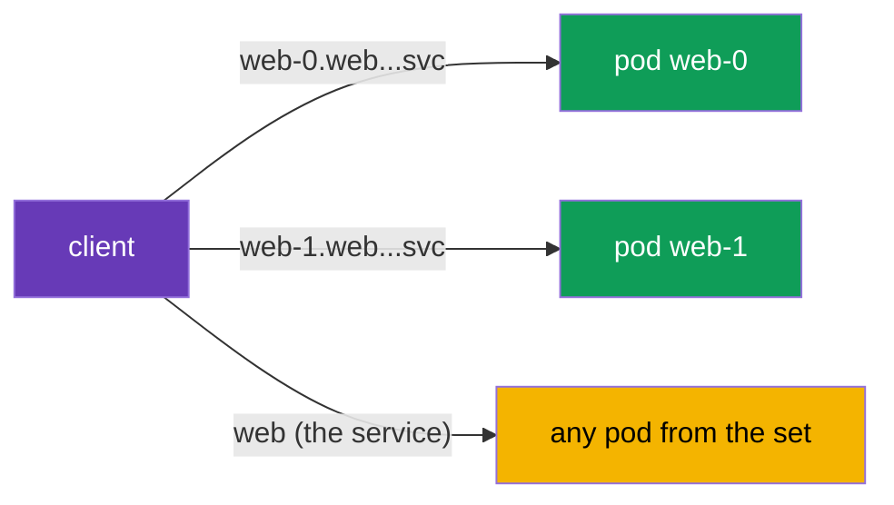

[RU version](ru.md) · [Versión en español](es.md) · [Version française](fr.md) · [Deutsche Version](de.md)

# Chapter 23. StatefulSets and headless services in the mesh

> **What's next.** Most examples in the course were about stateless services behind an ordinary
> Service. But the cluster also has stateful workloads: databases, Kafka, Zookeeper - they are run
> via StatefulSets and headless services. They have their own addressing specifics that are
> important to account for in the mesh. In this chapter we look at how Istio works with them.

## 23.1. A reminder: StatefulSets and headless services

Let us briefly refresh what you know from CKA.

- **A StatefulSet** runs pods with a **stable identity**: each has its own stable name (`web-0`,
  `web-1`, ...), its own persistent disk and a stable DNS name. This is exactly what databases and
  clustered systems need, where the nodes are not interchangeable.
- **A headless service** (`clusterIP: None`) is a service without a single virtual IP. Instead of
  hiding the pods behind one ClusterIP, it returns in DNS the **addresses of the specific pods**. A
  StatefulSet uses a headless service to give each pod a stable DNS name of the form
  `web-0.web.app.svc.cluster.local`.

That is, stateful workloads have two addressing methods: to the service as a whole and to a
**specific pod by name**. This is the main difference from the familiar stateless services.

## 23.2. Reaching a specific pod

With a headless service the client can reach not "the service" (and get a random pod) but a
strictly defined pod by its stable name:



```bash
# to a specific pod
curl http://web-0.web.app.svc.cluster.local:8080/   # Server Name: web-0
curl http://web-1.web.app.svc.cluster.local:8080/   # Server Name: web-1
```

This is critical for stateful systems: for example, in a DB cluster the replicas are not equal, and
the client must land on exactly the needed node (the leader, a specific shard). Balancing "to any
pod" is not suitable here.

## 23.3. Specifics in the mesh

Istio supports headless services and StatefulSets, but there are nuances you need to know.

- **Naming the ports is mandatory.** As everywhere in Istio (chapters 2 and 10), the port in the
  Service must be named by protocol (`http`, `grpc`, `tcp`, etc.) or given `appProtocol`. For
  headless this is especially important: without the correct name Istio will not understand the
  protocol and may handle the traffic incorrectly. If the protocol is not HTTP - the port name is
  `tcp`.
- **Two traffic paths.** Reaching a specific pod (`web-0...`) and the service as a whole are handled
  differently by Istio. When addressing a pod, the traffic goes exactly there, bypassing the usual
  balancing across the set - this is expected and needed for stateful. Technically, under the hood
  for headless Istio builds a cluster of type **`ORIGINAL_DST`** (passthrough to the destination's
  real IP), not EDS balancing over a list of endpoints as for an ordinary ClusterIP. So a request to
  `web-0...` goes to exactly that pod, and the balancing/subsets settings in a `DestinationRule` do
  not effectively work with direct addressing - there is nothing to balance between.
- **mTLS works.** StatefulSet pods get the same SPIFFE identity and mTLS as ordinary ones (chapter
  13). PeerAuthentication and AuthorizationPolicy apply as always. Just remember: the identity is
  tied to the ServiceAccount, not to a specific pod, so all the StatefulSet replicas have the same
  identity.
- **DestinationRule and subsets.** For headless you can set policies via a DestinationRule, but with
  direct addressing to a pod part of the balancing settings loses meaning (there is nothing to
  balance between - there is a single address).

In practice the most common thing that breaks stateful in the mesh is **an incorrect port name**. If
a database or broker suddenly stopped working after enabling injection, first check the port names
in the Service.

### Cluster bootstrap and publishNotReadyAddresses

A separate trap for **clustered** stateful systems (Kafka, Zookeeper, Cassandra, Elasticsearch). To
form a cluster, the nodes must find each other **at startup - before they become Ready** (peer
discovery, leader election, bootstrap). For this their headless service is usually declared with
`publishNotReadyAddresses: true`, so that DNS returns the pods' addresses even while they are not
ready:

```yaml
apiVersion: v1
kind: Service
metadata:
  name: kafka
  namespace: data
spec:
  clusterIP: None
  publishNotReadyAddresses: true    # see the peers before readiness - needed for bootstrap
  selector:
    app: kafka
  ports:
  - name: tcp-kafka                  # name the port (the protocol is not HTTP -> tcp-)
    port: 9092
```

In the mesh a subtlety is added here: a pod's readiness is **merged with the sidecar's readiness**
(chapter 4/13), and at startup mTLS must already work between the peers. If the nodes cannot agree
early on, the cluster does not form. What helps:

- `holdApplicationUntilProxyStarts` - the application will not start peer discovery before the proxy
  is ready (otherwise early connections are lost);
- a consistent mTLS mode on the clustering port (see `PERMISSIVE`/port-level below) - so that the
  inter-node traffic at startup is not rejected;
- if needed - taking the service port out of interception (see best practices).

## 23.4. Best practices for production

- **First decide whether the DB needs to be in the mesh at all.** A sidecar adds latency on every
  request, and a heavily-loaded DB is latency-sensitive. Often external or managed DBs (on AWS -
  **RDS/Aurora**, **ElastiCache**, **MSK**) are registered as a `ServiceEntry` (chapter 12) rather
  than pulling the StatefulSet itself into the mesh. Bring a datastore into the mesh deliberately,
  for a concrete benefit (mTLS, policies, observability).
- **Always name ports correctly.** For non-HTTP DBs use a protocol prefix (`mysql-`, `mongo-`,
  `redis-`) or `tcp` / `appProtocol`. An incorrect port name is the number-one cause of stateful
  breakage after enabling injection.
- **Be careful with STRICT mTLS.** Stateful often has clients outside the mesh: administration
  tools, backup systems, migrations. Under `STRICT` they (plaintext) will fall off. Either bring
  them into the mesh, or leave `PERMISSIVE` (if needed - surgically on a port via a port-level
  `PeerAuthentication`).
- **Remember the shared identity of the replicas.** All StatefulSet pods have one SPIFFE identity
  (by the ServiceAccount). `AuthorizationPolicy` will not tell `web-0` from `web-1` by a personal
  principal - authorize at the service level, and do the node differentiation in the application.
- **Manage the startup and shutdown order.** For workloads that go over the network right at
  startup, enable `holdApplicationUntilProxyStarts` so the application does not start before the
  sidecar is ready (otherwise early connections are lost). For a correct shutdown set up a graceful
  shutdown so the sidecar is not killed before the application with open connections.
- **Do not attach unnecessary L7 policies.** With direct addressing to a pod, balancing and part of
  the L7 settings are meaningless. For a DB you more often just need L4 (mTLS + passthrough), not
  complex routing.
- **Service ports can be taken out of interception.** If the system encrypts inter-node traffic
  itself (replication/clustering) or the sidecar on that port gets in the way, exclude the port with
  the `traffic.sidecar.istio.io/excludeInboundPorts` / `excludeOutboundPorts` annotations - then
  Istio does not intercept it. This is a surgical alternative to rolling the whole pod back out of
  the mesh.
- **Test failover and restarts under load.** Verify that addressing by stable names and the
  switchover of a clustered system's nodes works in the mesh the same as without it.

## 23.5. Chapter summary

- Stateful workloads (DBs, Kafka, etc.) are run via a **StatefulSet** with a stable identity and a
  **headless service** (`clusterIP: None`), which returns the addresses of specific pods in DNS.
- Stateful has two addressing methods: to the service as a whole (any pod) and to a **specific pod**
  by its stable name (`web-0.web.ns.svc.cluster.local`) - the latter is critical when the nodes are
  not interchangeable.
- Istio supports headless and StatefulSets, but requires **correct port naming** by protocol - this
  is the most common cause of breakage.
- Addressing a specific pod goes directly, bypassing balancing across the set - this is the expected
  behavior for stateful (headless in Istio is an `ORIGINAL_DST` cluster, passthrough to the real IP,
  not EDS balancing).
- Clustered systems (Kafka/Zookeeper/Cassandra) require `publishNotReadyAddresses` for bootstrap; in
  the mesh reconcile this with the sidecar's readiness (`holdApplicationUntilProxyStarts`) and the
  mTLS mode on the clustering port.
- Service ports can be taken out of the sidecar via
  `traffic.sidecar.istio.io/excludeInboundPorts`/`excludeOutboundPorts`; managed DBs
  (RDS/MSK/ElastiCache) are more often registered as a `ServiceEntry` rather than in the mesh.
- mTLS and policies work as usual; the identity is tied to the ServiceAccount, so all StatefulSet
  replicas have the same identity.
- Production practices: decide whether the DB needs to be in the mesh (or exposed as a
  ServiceEntry), name ports correctly, be careful with STRICT mTLS (clients outside the mesh),
  account for the replicas' shared identity, set up the startup/shutdown order
  (`holdApplicationUntilProxyStarts`), test failover.

## 23.6. Self-check questions

1. How does a headless service differ from an ordinary one and why does a StatefulSet need it?
2. How do you reach a specific StatefulSet pod and why is this sometimes needed?
3. Why is correct port naming especially important for headless?
4. How does addressing a specific pod differ from addressing the service as a whole?
5. Is the SPIFFE identity of one StatefulSet's replicas the same or different? Why?
6. Which production practices matter for stateful in the mesh: when is it better not to bring the DB
   into the mesh, what about STRICT mTLS for external clients, why `holdApplicationUntilProxyStarts`?
7. What is an `ORIGINAL_DST` cluster and why, with direct addressing to a pod, do the
   balancing/subsets settings not work?
8. Why do clustered systems need `publishNotReadyAddresses` and what can prevent their bootstrap in
   the mesh?
9. How do you take a DB's service port out of sidecar interception and when is this needed?

## Practice

Practice how StatefulSets and headless services work in the mesh: addressing specific pods by their
stable names:

🧪 Lab 30: [tasks/ica/labs/30](../../labs/30/README.MD)

---
[Contents](../README.md) · [Chapter 22](../22/en.md) · [Chapter 24](../24/en.md)
