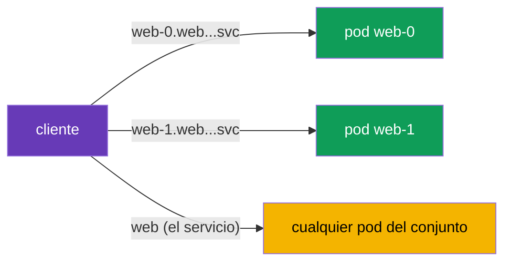

[RU version](ru.md) · [Eng version](en.md)

# Capítulo 23. StatefulSets y servicios headless en la malla

> **Qué sigue.** La mayoría de los ejemplos del curso trataban de servicios stateless detrás de un
> Service corriente. Pero en el clúster también hay cargas con estado: bases de datos, Kafka,
> Zookeeper; se ejecutan mediante StatefulSets y servicios headless. Tienen sus propias
> particularidades de direccionamiento que es importante tener en cuenta en la malla. En este capítulo
> veremos cómo trabaja Istio con ellas.

## 23.1. Un recordatorio: StatefulSets y servicios headless

Refresquemos brevemente lo que ya sabes del CKA.

- **Un StatefulSet** ejecuta pods con una **identidad estable**: cada uno tiene su propio nombre
  estable (`web-0`, `web-1`, ...), su propio disco persistente y un nombre DNS estable. Esto es
  exactamente lo que necesitan las bases de datos y los sistemas en clúster, donde los nodos no son
  intercambiables.
- **Un servicio headless** (`clusterIP: None`) es un servicio sin una única IP virtual. En lugar de
  ocultar los pods tras un solo ClusterIP, devuelve en DNS las **direcciones de los pods concretos**.
  Un StatefulSet usa un servicio headless para darle a cada pod un nombre DNS estable de la forma
  `web-0.web.app.svc.cluster.local`.

Es decir, las cargas con estado tienen dos métodos de direccionamiento: al servicio en su conjunto y a
un **pod concreto por su nombre**. Esta es la principal diferencia respecto a los familiares servicios
stateless.

## 23.2. Llegar a un pod concreto

Con un servicio headless el cliente puede llegar no "al servicio" (y obtener un pod aleatorio) sino a
un pod estrictamente definido por su nombre estable:



```bash
# a un pod concreto
curl http://web-0.web.app.svc.cluster.local:8080/   # Server Name: web-0
curl http://web-1.web.app.svc.cluster.local:8080/   # Server Name: web-1
```

Esto es crítico para los sistemas con estado: por ejemplo, en un clúster de BD las réplicas no son
iguales, y el cliente debe aterrizar exactamente en el nodo necesario (el líder, un shard concreto). El
balanceo "a cualquier pod" no sirve aquí.

## 23.3. Particularidades en la malla

Istio admite servicios headless y StatefulSets, pero hay matices que necesitas conocer.

- **Nombrar los puertos es obligatorio.** Como en todas partes en Istio (capítulos 2 y 10), el puerto
  del Service debe nombrarse por protocolo (`http`, `grpc`, `tcp`, etc.) o llevar `appProtocol`. Para
  headless esto es especialmente importante: sin el nombre correcto Istio no entenderá el protocolo y
  puede manejar el tráfico de forma incorrecta. Si el protocolo no es HTTP, el nombre del puerto es
  `tcp`.
- **Dos caminos de tráfico.** Llegar a un pod concreto (`web-0...`) y al servicio en su conjunto los
  maneja Istio de forma distinta. Al direccionar a un pod, el tráfico va exactamente ahí, saltándose el
  balanceo habitual entre el conjunto; esto es lo esperado y necesario para stateful. Técnicamente, por
  debajo, para headless Istio construye un cluster de tipo **`ORIGINAL_DST`** (passthrough a la IP real
  del destino), no balanceo EDS sobre una lista de endpoints como para un ClusterIP corriente. Así que
  una petición a `web-0...` va a exactamente ese pod, y los ajustes de balanceo/subsets en una
  `DestinationRule` no funcionan de forma efectiva con el direccionamiento directo: no hay nada entre lo
  que balancear.
- **mTLS funciona.** Los pods de un StatefulSet obtienen la misma identidad SPIFFE y el mismo mTLS que
  los corrientes (capítulo 13). PeerAuthentication y AuthorizationPolicy se aplican como siempre. Solo
  recuerda: la identidad está ligada al ServiceAccount, no a un pod concreto, así que todas las réplicas
  del StatefulSet tienen la misma identidad.
- **DestinationRule y subsets.** Para headless puedes fijar políticas vía una DestinationRule, pero con
  el direccionamiento directo a un pod parte de los ajustes de balanceo pierde sentido (no hay nada
  entre lo que balancear: hay una única dirección).

En la práctica, lo que más a menudo rompe stateful en la malla es **un nombre de puerto incorrecto**.
Si una base de datos o un broker de repente dejaron de funcionar tras habilitar la inyección, comprueba
primero los nombres de los puertos en el Service.

### Bootstrap del clúster y publishNotReadyAddresses

Una trampa aparte para los sistemas con estado **en clúster** (Kafka, Zookeeper, Cassandra,
Elasticsearch). Para formar un clúster, los nodos deben encontrarse entre sí **al arrancar, antes de
volverse Ready** (peer discovery, elección de líder, bootstrap). Para esto su servicio headless suele
declararse con `publishNotReadyAddresses: true`, de modo que DNS devuelva las direcciones de los pods
incluso mientras no están listos:

```yaml
apiVersion: v1
kind: Service
metadata:
  name: kafka
  namespace: data
spec:
  clusterIP: None
  publishNotReadyAddresses: true    # ver los peers antes de estar listos - necesario para el bootstrap
  selector:
    app: kafka
  ports:
  - name: tcp-kafka                  # nombra el puerto (el protocolo no es HTTP -> tcp-)
    port: 9092
```

En la malla se añade aquí una sutileza: la readiness de un pod se **fusiona con la readiness del
sidecar** (capítulo 4/13), y al arrancar el mTLS ya debe funcionar entre los peers. Si los nodos no
pueden ponerse de acuerdo pronto, el clúster no se forma. Lo que ayuda:

- `holdApplicationUntilProxyStarts`: la aplicación no iniciará el peer discovery antes de que el proxy
  esté listo (de lo contrario las conexiones tempranas se pierden);
- un modo mTLS consistente en el puerto de clustering (ver `PERMISSIVE`/nivel de puerto más abajo), para
  que el tráfico entre nodos al arrancar no sea rechazado;
- si hace falta, sacar el puerto del servicio de la interceptación (ver buenas prácticas).

## 23.4. Buenas prácticas para producción

- **Primero decide si la BD necesita estar en la malla siquiera.** Un sidecar añade latencia en cada
  petición, y una BD muy cargada es sensible a la latencia. A menudo las BD externas o gestionadas (en
  AWS: **RDS/Aurora**, **ElastiCache**, **MSK**) se registran como un `ServiceEntry` (capítulo 12) en
  lugar de meter el propio StatefulSet en la malla. Mete un datastore en la malla de forma deliberada,
  por un beneficio concreto (mTLS, políticas, observabilidad).
- **Nombra siempre los puertos correctamente.** Para BD no HTTP usa un prefijo de protocolo (`mysql-`,
  `mongo-`, `redis-`) o `tcp` / `appProtocol`. Un nombre de puerto incorrecto es la causa número uno de
  la rotura de stateful tras habilitar la inyección.
- **Ten cuidado con el mTLS STRICT.** Stateful a menudo tiene clientes fuera de la malla: herramientas
  de administración, sistemas de backup, migraciones. Bajo `STRICT` estos (en texto plano) se caerán. O
  bien los metes en la malla, o dejas `PERMISSIVE` (si hace falta, quirúrgicamente en un puerto vía una
  `PeerAuthentication` a nivel de puerto).
- **Recuerda la identidad compartida de las réplicas.** Todos los pods del StatefulSet tienen una
  identidad SPIFFE (por el ServiceAccount). `AuthorizationPolicy` no distinguirá `web-0` de `web-1` por
  un principal personal; autoriza a nivel de servicio y haz la diferenciación de nodos en la aplicación.
- **Gestiona el orden de arranque y apagado.** Para cargas que salen a la red justo al arrancar,
  habilita `holdApplicationUntilProxyStarts` para que la aplicación no arranque antes de que el sidecar
  esté listo (de lo contrario las conexiones tempranas se pierden). Para un apagado correcto configura un
  graceful shutdown para que el sidecar no se mate antes que la aplicación con conexiones abiertas.
- **No adjuntes políticas L7 innecesarias.** Con el direccionamiento directo a un pod, el balanceo y
  parte de los ajustes L7 carecen de sentido. Para una BD lo más frecuente es que solo necesites L4
  (mTLS + passthrough), no enrutamiento complejo.
- **Los puertos del servicio se pueden sacar de la interceptación.** Si el sistema cifra el tráfico
  entre nodos por sí mismo (replicación/clustering) o el sidecar en ese puerto estorba, excluye el
  puerto con las anotaciones `traffic.sidecar.istio.io/excludeInboundPorts` / `excludeOutboundPorts`;
  entonces Istio no lo intercepta. Esta es una alternativa quirúrgica a sacar el pod entero de la malla.
- **Prueba el failover y los reinicios bajo carga.** Verifica que el direccionamiento por nombres
  estables y el switchover de los nodos de un sistema en clúster funcionan en la malla igual que sin
  ella.

## 23.5. Resumen del capítulo

- Las cargas con estado (BD, Kafka, etc.) se ejecutan mediante un **StatefulSet** con una identidad
  estable y un **servicio headless** (`clusterIP: None`), que devuelve las direcciones de los pods
  concretos en DNS.
- Stateful tiene dos métodos de direccionamiento: al servicio en su conjunto (cualquier pod) y a un
  **pod concreto** por su nombre estable (`web-0.web.ns.svc.cluster.local`); lo último es crítico
  cuando los nodos no son intercambiables.
- Istio admite headless y StatefulSets, pero requiere un **nombrado de puertos correcto** por
  protocolo; esta es la causa más frecuente de roturas.
- El direccionamiento a un pod concreto va directo, saltándose el balanceo entre el conjunto; este es el
  comportamiento esperado para stateful (headless en Istio es un cluster `ORIGINAL_DST`, passthrough a
  la IP real, no balanceo EDS).
- Los sistemas en clúster (Kafka/Zookeeper/Cassandra) requieren `publishNotReadyAddresses` para el
  bootstrap; en la malla concilia esto con la readiness del sidecar (`holdApplicationUntilProxyStarts`)
  y el modo mTLS en el puerto de clustering.
- Los puertos del servicio se pueden sacar del sidecar vía
  `traffic.sidecar.istio.io/excludeInboundPorts`/`excludeOutboundPorts`; las BD gestionadas
  (RDS/MSK/ElastiCache) se registran más a menudo como un `ServiceEntry` en lugar de en la malla.
- El mTLS y las políticas funcionan como de costumbre; la identidad está ligada al ServiceAccount, así
  que todas las réplicas del StatefulSet tienen la misma identidad.
- Prácticas de producción: decide si la BD necesita estar en la malla (o exponerse como un
  ServiceEntry), nombra los puertos correctamente, ten cuidado con el mTLS STRICT (clientes fuera de la
  malla), ten en cuenta la identidad compartida de las réplicas, configura el orden de arranque/apagado
  (`holdApplicationUntilProxyStarts`), prueba el failover.

## 23.6. Preguntas de autoevaluación

1. ¿En qué se diferencia un servicio headless de uno corriente y por qué lo necesita un StatefulSet?
2. ¿Cómo llegas a un pod concreto de un StatefulSet y por qué a veces hace falta?
3. ¿Por qué el nombrado correcto de puertos es especialmente importante para headless?
4. ¿En qué se diferencia el direccionamiento a un pod concreto del direccionamiento al servicio en su
   conjunto?
5. ¿La identidad SPIFFE de las réplicas de un mismo StatefulSet es la misma o distinta? ¿Por qué?
6. ¿Qué prácticas de producción importan para stateful en la malla: cuándo es mejor no meter la BD en
   la malla, qué pasa con el mTLS STRICT para clientes externos, por qué
   `holdApplicationUntilProxyStarts`?
7. ¿Qué es un cluster `ORIGINAL_DST` y por qué, con el direccionamiento directo a un pod, no funcionan
   los ajustes de balanceo/subsets?
8. ¿Por qué los sistemas en clúster necesitan `publishNotReadyAddresses` y qué puede impedir su
   bootstrap en la malla?
9. ¿Cómo sacas el puerto del servicio de una BD de la interceptación del sidecar y cuándo hace falta?

## Práctica

Practica cómo funcionan los StatefulSets y los servicios headless en la malla: direccionar pods
concretos por sus nombres estables:

🧪 Laboratorio 30: [tasks/ica/labs/30](../../labs/30/README_ES.MD)

---
[Índice](../README_ES.md) · [Capítulo 22](../22/es.md) · [Capítulo 24](../24/es.md)
