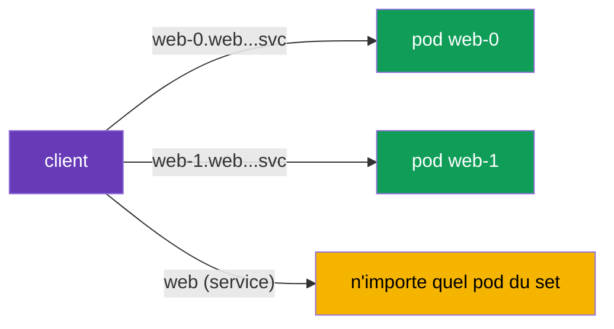

[RU version](ru.md) · [Eng version](en.md) · [Versión en español](es.md) · [Deutsche Version](de.md)

# Chapitre 23. StatefulSet et services headless dans le maillage

> **La suite.** La plupart des exemples du cours portaient sur des services stateless derrière
> un Service ordinaire. Mais le cluster comporte aussi des charges stateful : bases de données,
> Kafka, Zookeeper - on les lance via des StatefulSet et des services headless. Ils ont leur
> propre spécificité d'adressage, qu'il est important de prendre en compte dans le maillage.
> Dans ce chapitre, nous verrons comment Istio travaille avec eux.

## 23.1. Rappel : StatefulSet et services headless

Rafraîchissons brièvement ce que vous savez du CKA.

- **StatefulSet** lance des pods avec une **identité stable** : chacun a son nom durable
  (`web-0`, `web-1`, ...), son disque permanent et un nom DNS stable. C'est exactement ce dont ont
  besoin les bases de données et les systèmes en cluster, où les nœuds ne sont pas
  interchangeables.
- **Service headless** (`clusterIP: None`) - un service sans IP virtuelle unique. Au lieu de
  cacher les pods derrière un seul ClusterIP, il retourne dans le DNS les **adresses de pods
  précis**. Un StatefulSet utilise un service headless pour donner à chaque pod un nom DNS stable
  de la forme `web-0.web.app.svc.cluster.local`.

Autrement dit, les charges stateful ont deux façons d'adresser : au service dans son ensemble et à
un **pod précis par son nom**. C'est justement la principale différence avec les services stateless
habituels.

## 23.2. Adressage d'un pod précis

Avec un service headless, le client peut s'adresser non pas « au service » (et obtenir un pod
aléatoire), mais à un pod strictement défini par son nom stable :



```bash
# vers un pod précis
curl http://web-0.web.app.svc.cluster.local:8080/   # Server Name: web-0
curl http://web-1.web.app.svc.cluster.local:8080/   # Server Name: web-1
```

C'est critique pour les systèmes stateful : par exemple, dans un cluster de BD les réplicas ne
sont pas équivalents, et le client doit atteindre précisément le nœud voulu (le leader, un shard
précis). Un équilibrage « vers n'importe quel pod » ne convient pas ici.

## 23.3. Particularités dans le maillage

Istio prend en charge les services headless et les StatefulSet, mais il y a des nuances à
connaître.

- **Nommage des ports - obligatoire.** Comme partout dans Istio (chapitres 2 et 10), le port du
  Service doit être nommé selon le protocole (`http`, `grpc`, `tcp`, etc.) ou définir
  `appProtocol`. Pour le headless, c'est particulièrement important : sans le bon nom, Istio ne
  comprendra pas le protocole et pourra mal traiter le trafic. Si le protocole n'est pas HTTP - le
  nom du port est `tcp`.
- **Deux chemins de trafic.** L'adressage à un pod précis (`web-0...`) et au service dans son
  ensemble est traité différemment par Istio. Lors de l'adressage à un pod, le trafic va
  précisément là, en contournant l'équilibrage habituel sur le set - c'est attendu et nécessaire
  pour le stateful. Techniquement, sous le capot, pour le headless Istio construit un cluster de
  type **`ORIGINAL_DST`** (passthrough vers l'IP réelle de destination), et non un équilibrage EDS
  sur la liste d'endpoints, comme pour un ClusterIP ordinaire. C'est pourquoi une requête vers
  `web-0...` part exactement vers ce pod, et les réglages d'équilibrage/subsets d'une
  `DestinationRule` ne fonctionnent en fait pas lors d'un adressage direct - il n'y a rien à
  équilibrer.
- **Le mTLS fonctionne.** Les pods d'un StatefulSet reçoivent la même identité SPIFFE et le même
  mTLS que les pods ordinaires (chapitre 13). PeerAuthentication et AuthorizationPolicy
  s'appliquent comme toujours. Souvenez-vous simplement : l'identity est liée au ServiceAccount et
  non à un pod précis, donc tous les réplicas d'un StatefulSet ont la même identité.
- **DestinationRule et subsets.** Pour le headless, on peut définir des politiques via
  DestinationRule, mais lors d'un adressage direct à un pod une partie des réglages d'équilibrage
  perd son sens (il n'y a rien à équilibrer - l'adresse est unique).

En pratique, ce qui casse le plus souvent le stateful dans le maillage, c'est un **nom de port
incorrect**. Si une BD ou un broker a soudain cessé de fonctionner après l'activation de
l'injection, vérifiez d'abord les noms des ports dans le Service.

### Bootstrap du cluster et publishNotReadyAddresses

Un piège à part pour les systèmes stateful **en cluster** (Kafka, Zookeeper, Cassandra,
Elasticsearch). Pour se rassembler en cluster, les nœuds doivent se trouver **au démarrage -
avant même d'être Ready** (peer discovery, élection du leader, bootstrap). Pour cela, leur service
headless est généralement déclaré avec `publishNotReadyAddresses: true`, afin que le DNS retourne
les adresses des pods même tant qu'ils ne sont pas prêts :

```yaml
apiVersion: v1
kind: Service
metadata:
  name: kafka
  namespace: data
spec:
  clusterIP: None
  publishNotReadyAddresses: true    # voir les pairs avant readiness - nécessaire pour le bootstrap
  selector:
    app: kafka
  ports:
  - name: tcp-kafka                  # nommer le port obligatoirement (protocole non HTTP -> tcp-)
    port: 9092
```

Dans le maillage, une subtilité s'ajoute : la readiness du pod **est liée à la readiness du
sidecar** (chapitre 4/13), et au démarrage le mTLS doit déjà fonctionner entre les pairs. Si les
nœuds ne peuvent pas s'accorder à un stade précoce, le cluster ne se forme pas. Ce qui aide :

- `holdApplicationUntilProxyStarts` - l'application ne commence pas le peer discovery avant que le
  proxy soit prêt (sinon les connexions précoces sont perdues) ;
- un mode mTLS cohérent sur le port de clustering (voir `PERMISSIVE`/port-level ci-dessous) - pour
  que le trafic inter-nœuds au démarrage ne soit pas rejeté ;
- si nécessaire - sortir le port de service de l'interception (voir best practices).

## 23.4. Best practices pour la prod

- **Décidez d'abord si la BD doit être dans le maillage.** Le sidecar ajoute de la latence à
  chaque requête, et une BD fortement sollicitée est sensible à la latence. Souvent, les BD
  externes ou managées (sur AWS - **RDS/Aurora**, **ElastiCache**, **MSK**) sont déclarées comme
  `ServiceEntry` (chapitre 12), plutôt que de tirer le StatefulSet lui-même dans le maillage.
  Intégrez un datastore dans le maillage de façon consciente, pour un bénéfice concret (mTLS,
  politiques, observabilité).
- **Nommez toujours correctement les ports.** Pour une BD non-HTTP, utilisez un préfixe de
  protocole (`mysql-`, `mongo-`, `redis-`) ou `tcp` / `appProtocol`. Un nom de port incorrect est
  la cause numéro un des pannes stateful après l'activation de l'injection.
- **Prudence avec le mTLS STRICT.** Le stateful a souvent des clients hors maillage : outils
  d'administration, systèmes de sauvegarde, migrations. En `STRICT`, ceux-ci (en plaintext)
  tomberont. Soit intégrez-les au maillage, soit laissez `PERMISSIVE` (au besoin - de façon ciblée
  sur le port via un `PeerAuthentication` port-level).
- **Souvenez-vous de l'identité commune des réplicas.** Tous les pods d'un StatefulSet ont une
  seule identité SPIFFE (par ServiceAccount). Une `AuthorizationPolicy` ne distinguera pas `web-0`
  de `web-1` par principal - autorisez au niveau du service, et faites la distinction des nœuds
  dans l'application.
- **Gérez l'ordre de démarrage et d'arrêt.** Pour les charges qui font du réseau dès le démarrage,
  activez `holdApplicationUntilProxyStarts`, afin que l'application ne démarre pas avant que le
  sidecar soit prêt (sinon les connexions précoces sont perdues). Pour un arrêt correct,
  configurez un graceful shutdown, afin que le sidecar ne soit pas tué avant l'application qui a
  des connexions ouvertes.
- **N'ajoutez pas de politiques L7 superflues.** Lors d'un adressage direct à un pod, l'équilibrage
  et une partie des réglages L7 n'ont pas de sens. Pour une BD, on a plus souvent besoin
  simplement de L4 (mTLS + passthrough), et non d'un routage complexe.
- **Les ports de service peuvent être sortis de l'interception.** Si le système chiffre lui-même
  le trafic inter-nœuds (réplication/clustering) ou si le sidecar sur ce port gêne, excluez le
  port avec les annotations `traffic.sidecar.istio.io/excludeInboundPorts` / `excludeOutboundPorts`
  - Istio ne l'intercepte alors pas. C'est une alternative ciblée au retrait de tout le pod du
  maillage.
- **Testez le failover et les redémarrages sous charge.** Vérifiez que l'adressage par les noms
  stables et le basculement des nœuds du système en cluster fonctionnent dans le maillage comme
  sans lui.

## 23.5. Résumé du chapitre

- Les charges stateful (BD, Kafka, etc.) se lancent via un **StatefulSet** à identité stable et un
  **service headless** (`clusterIP: None`) qui retourne dans le DNS les adresses de pods précis.
- Le stateful a deux façons d'adresser : au service dans son ensemble (n'importe quel pod) et à un
  **pod précis** par son nom stable (`web-0.web.ns.svc.cluster.local`) - cette dernière est
  critique quand les nœuds ne sont pas interchangeables.
- Istio prend en charge le headless et les StatefulSet, mais exige un **nommage correct des ports**
  selon le protocole - c'est la cause de panne la plus fréquente.
- L'adressage à un pod précis se fait directement, en contournant l'équilibrage sur le set - c'est
  un comportement attendu pour le stateful (le headless dans Istio est un cluster `ORIGINAL_DST`,
  passthrough vers l'IP réelle, et non un équilibrage EDS).
- Les systèmes en cluster (Kafka/Zookeeper/Cassandra) nécessitent `publishNotReadyAddresses` pour
  le bootstrap ; dans le maillage, accordez cela avec la readiness du sidecar
  (`holdApplicationUntilProxyStarts`) et le mode mTLS sur le port de clustering.
- Les ports de service peuvent être sortis du sidecar via
  `traffic.sidecar.istio.io/excludeInboundPorts`/`excludeOutboundPorts` ; les BD managées
  (RDS/MSK/ElastiCache) sont plus souvent déclarées comme `ServiceEntry`, plutôt que dans le
  maillage.
- Le mTLS et les politiques fonctionnent comme d'habitude ; l'identité est liée au ServiceAccount,
  donc tous les réplicas d'un StatefulSet ont la même identité.
- Pratiques de prod : décider si la BD doit être dans le maillage (ou la sortir comme
  ServiceEntry), nommer correctement les ports, être prudent avec le mTLS STRICT (clients hors
  maillage), tenir compte de l'identity commune des réplicas, configurer l'ordre de
  démarrage/d'arrêt (`holdApplicationUntilProxyStarts`), tester le failover.

## 23.6. Questions d'auto-évaluation

1. En quoi un service headless diffère-t-il d'un service ordinaire et pourquoi est-il nécessaire à
   un StatefulSet ?
2. Comment s'adresser à un pod précis d'un StatefulSet et pourquoi cela peut-il être nécessaire ?
3. Pourquoi est-il particulièrement important de bien nommer les ports pour le headless ?
4. En quoi l'adressage à un pod précis diffère-t-il de l'adressage au service dans son ensemble ?
5. L'identité SPIFFE des réplicas d'un même StatefulSet est-elle identique ou différente ?
   Pourquoi ?
6. Quelles pratiques de prod sont importantes pour le stateful dans le maillage : quand vaut-il
   mieux ne pas mettre la BD dans le maillage, qu'en est-il du mTLS STRICT pour les clients
   externes, à quoi sert `holdApplicationUntilProxyStarts` ?
7. Qu'est-ce qu'un cluster `ORIGINAL_DST` et pourquoi, lors d'un adressage direct à un pod, les
   réglages d'équilibrage/subsets ne fonctionnent-ils pas ?
8. À quoi sert `publishNotReadyAddresses` aux systèmes en cluster et qu'est-ce qui peut gêner leur
   bootstrap dans le maillage ?
9. Comment sortir un port de service d'une BD de l'interception du sidecar et quand est-ce
   nécessaire ?

## Pratique

Entraînez-vous au fonctionnement des StatefulSet et des services headless dans le maillage :
l'adressage de pods précis par leurs noms stables :

🧪 Lab 30 : [tasks/ica/labs/30](../../labs/30/README_FR.MD)

---
[Table des matières](../README_FR.md) · [Chapitre 22](../22/fr.md) · [Chapitre 24](../24/fr.md)
