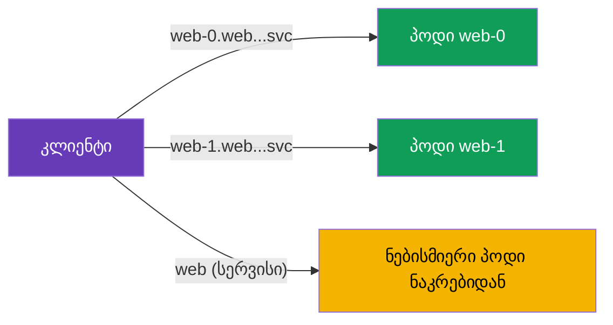

[Русская версия](ru.md) · [Eng version](en.md) · [Versión en español](es.md) · [Version française](fr.md) · [Deutsche Version](de.md) · [繁體中文版](tw.md) · [日本語版](jp.md)

# თავი 23. StatefulSet და headless-სერვისები mesh-ში

> **რა არის შემდეგ.** კურსის მაგალითების უმეტესობა ეხებოდა ჩვეულებრივი Service-ის უკან
> განთავსებულ stateless-სერვისებს. თუმცა კლასტერში stateful-დატვირთვებიცაა: მონაცემთა ბაზები,
> Kafka, Zookeeper - მათ StatefulSet-ისა და headless-სერვისების მეშვეობით უშვებენ. მათ
> მისამართაციის საკუთარი სპეციფიკა აქვთ, რომლის გათვალისწინებაც mesh-ში მნიშვნელოვანია.
> ამ თავში განვიხილავთ, როგორ მუშაობს Istio მათთან.

## 23.1. შეხსენება: StatefulSet და headless-სერვისები

მოკლედ გავიხსენოთ ის, რაც CKA-დან იცით.

- **StatefulSet** პოდებს **სტაბილური იდენტობით** უშვებს: თითოეულს აქვს საკუთარი
  მუდმივი სახელი (`web-0`, `web-1`, ...), საკუთარი მუდმივი დისკი და სტაბილური DNS-სახელი.
  სწორედ ეს სჭირდებათ მონაცემთა ბაზებსა და კლასტერულ სისტემებს, სადაც კვანძები
  ურთიერთჩანაცვლებადი არ არის.
- **Headless-სერვისი** (`clusterIP: None`) არის სერვისი ერთიანი ვირტუალური IP-ის გარეშე.
  იმის ნაცვლად, რომ პოდები ერთი ClusterIP-ის უკან დამალოს, ის DNS-ში **კონკრეტული
  პოდების მისამართებს** აბრუნებს. StatefulSet headless-სერვისს იყენებს, რათა თითოეულ
  პოდს `web-0.web.app.svc.cluster.local` სახის სტაბილური DNS-სახელი მიანიჭოს.

ამრიგად, stateful-დატვირთვებს მისამართაციის ორი გზა აქვთ: მთლიანად სერვისთან და
**კონკრეტულ პოდთან სახელით**. სწორედ ესაა მთავარი განსხვავება ჩვეულებრივი
stateless-სერვისებისგან.

## 23.2. კონკრეტულ პოდთან მიმართვა

headless-სერვისის გამოყენებისას კლიენტს შეუძლია მიმართოს არა „სერვისს“ (და შემთხვევითი
პოდი მიიღოს), არამედ მისი სტაბილური სახელით ზუსტად განსაზღვრულ პოდს:



```bash
# კონკრეტულ pod-თან
curl http://web-0.web.app.svc.cluster.local:8080/   # Server Name: web-0
curl http://web-1.web.app.svc.cluster.local:8080/   # Server Name: web-1
```

ეს კრიტიკულად მნიშვნელოვანია stateful-სისტემებისთვის: მაგალითად, მონაცემთა ბაზის
კლასტერში რეპლიკები თანაბარმნიშვნელოვანი არ არის და კლიენტი სწორედ საჭირო კვანძზე
(ლიდერზე, კონკრეტულ shard-ზე) უნდა მოხვდეს. „ნებისმიერ პოდზე“ დატვირთვის დაბალანსება
აქ არ გამოდგება.

## 23.3. თავისებურებები mesh-ში

Istio მხარს უჭერს headless-სერვისებსა და StatefulSet-ს, თუმცა არის ნიუანსები, რომლებიც
უნდა იცოდეთ.

- **პორტების სახელდება სავალდებულოა.** როგორც ყველგან Istio-ში (თავები 2 და 10),
  Service-ში პორტს პროტოკოლის შესაბამისი სახელი (`http`, `grpc`, `tcp` და ა.შ.) უნდა
  მიენიჭოს ან `appProtocol` განისაზღვროს. headless-ისთვის ეს განსაკუთრებით მნიშვნელოვანია:
  სწორი სახელის გარეშე Istio ვერ ამოიცნობს პროტოკოლს და შესაძლოა ტრაფიკი არასწორად
  დაამუშაოს. თუ პროტოკოლი HTTP არ არის, პორტის სახელია `tcp`.
- **ტრაფიკის ორი გზა.** კონკრეტულ პოდთან (`web-0...`) და მთლიანად სერვისთან მიმართვას
  Istio სხვადასხვაგვარად ამუშავებს. პოდის მისამართის გამოყენებისას ტრაფიკი ზუსტად იქ
  მიდის და ნაკრებზე ჩვეულებრივ დაბალანსებას გვერდს უვლის - ეს მოსალოდნელია და
  stateful-სისტემებისთვის აუცილებელია. ტექნიკურად, headless-ისთვის Istio შიდა დონეზე
  **`ORIGINAL_DST`** ტიპის კლასტერს აგებს (passthrough დანიშნულების რეალურ IP-ზე), და არა
  endpoint-ების სიაზე EDS-დაბალანსებას, როგორც ჩვეულებრივი ClusterIP-ის შემთხვევაში.
  ამიტომ `web-0...`-ზე მოთხოვნა ზუსტად ამ პოდზე მიდის, ხოლო პირდაპირი მისამართაციისას
  `DestinationRule`-ის დაბალანსების/subsets-ის პარამეტრები ფაქტობრივად არ მუშაობს -
  დასაბალანსებელი არაფერია.
- **mTLS მუშაობს.** StatefulSet-ის პოდები იღებენ იმავე SPIFFE-იდენტობასა და mTLS-ს,
  რასაც ჩვეულებრივი პოდები (თავი 13). PeerAuthentication და AuthorizationPolicy
  ჩვეულებრივად გამოიყენება. უბრალოდ გახსოვდეთ: identity მიბმულია ServiceAccount-ზე
  და არა კონკრეტულ პოდზე, ამიტომ StatefulSet-ის ყველა რეპლიკას ერთნაირი იდენტობა აქვს.
- **DestinationRule და subsets.** headless-ისთვის პოლიტიკების განსაზღვრა
  DestinationRule-ის მეშვეობით შეიძლება, მაგრამ პოდის პირდაპირი მისამართაციისას
  დაბალანსების პარამეტრების ნაწილი აზრს კარგავს (დასაბალანსებელი არაფერია - მისამართი ერთია).

პრაქტიკაში mesh-ში stateful-სისტემების გაუმართაობის ყველაზე ხშირი მიზეზი **პორტის
არასწორი სახელია**. თუ მონაცემთა ბაზამ ან broker-მა ინექციის ჩართვის შემდეგ მოულოდნელად
შეწყვიტა მუშაობა, პირველ რიგში Service-ში პორტების სახელები შეამოწმეთ.

### კლასტერის bootstrap და publishNotReadyAddresses

ცალკე ხაფანგია **კლასტერული** stateful-სისტემებისთვის (Kafka, Zookeeper, Cassandra,
Elasticsearch). კლასტერად გასაერთიანებლად კვანძებმა ერთმანეთი **გაშვებისას - ჯერ კიდევ
Ready მდგომარეობის მიღწევამდე** უნდა იპოვონ (peer discovery, ლიდერის არჩევა, bootstrap).
ამისთვის მათ headless-სერვისს ჩვეულებრივ `publishNotReadyAddresses: true` პარამეტრით
აცხადებენ, რათა DNS-მა პოდების მისამართები მათ მზადყოფნამდეც დააბრუნოს:

```yaml
apiVersion: v1
kind: Service
metadata:
  name: kafka
  namespace: data
spec:
  clusterIP: None
  publishNotReadyAddresses: true    # პირების დანახვა მზადყოფნამდე - საჭიროა bootstrap-ისთვის
  selector:
    app: kafka
  ports:
  - name: tcp-kafka                  # აუცილებლად ვასახელებთ პორტს (პროტოკოლი არა HTTP -> tcp-)
    port: 9092
```

mesh-ში ამას კიდევ ერთი ნიუანსი ემატება: პოდის მზადყოფნა **sidecar-ის მზადყოფნასთანაა
გაერთიანებული** (თავი 4/13), ხოლო გაშვებისას peer-ებს შორის mTLS უკვე უნდა მუშაობდეს.
თუ კვანძები ადრეულ ეტაპზე ვერ შეთანხმდებიან, კლასტერი ვერ შეიკრიბება. ამაში გეხმარებათ:

- `holdApplicationUntilProxyStarts` - აპლიკაცია peer discovery-ს proxy-ის მზადყოფნამდე
  არ დაიწყებს (წინააღმდეგ შემთხვევაში ადრეული კავშირები იკარგება);
- კლასტერიზაციის პორტზე შეთანხმებული mTLS-რეჟიმი (იხ. `PERMISSIVE`/port-level ქვემოთ) -
  რათა კვანძთაშორისი ტრაფიკი გაშვებისას არ დაიბლოკოს;
- საჭიროების შემთხვევაში - სამსახურებრივი პორტის interception-იდან გამორიცხვა
  (იხ. საუკეთესო პრაქტიკები).

## 23.4. საუკეთესო პრაქტიკები production-ისთვის

- **ჯერ გადაწყვიტეთ, საერთოდ საჭიროა თუ არა მონაცემთა ბაზა mesh-ში.** Sidecar თითოეულ
  მოთხოვნას დაყოვნებას უმატებს, მაღალი დატვირთვის მქონე მონაცემთა ბაზა კი latency-ის
  მიმართ მგრძნობიარეა. ხშირად გარე ან managed მონაცემთა ბაზები (AWS-ზე - **RDS/Aurora**,
  **ElastiCache**, **MSK**) `ServiceEntry`-ს სახით ერთვება (თავი 12), ნაცვლად იმისა, რომ
  თავად StatefulSet მოექცეს mesh-ში. datastore mesh-ში გააზრებულად, კონკრეტული სარგებლის
  (mTLS, პოლიტიკები, დაკვირვებადობა) მისაღებად შეიყვანეთ.
- **პორტებს ყოველთვის სწორი სახელები მიანიჭეთ.** არა-HTTP მონაცემთა ბაზებისთვის
  გამოიყენეთ პროტოკოლის პრეფიქსი (`mysql-`, `mongo-`, `redis-`) ან `tcp` / `appProtocol`.
  პორტის არასწორი სახელი ინექციის ჩართვის შემდეგ stateful-სისტემების გაუმართაობის
  მთავარი მიზეზია.
- **ფრთხილად იყავით STRICT mTLS-თან.** stateful-სისტემებს ხშირად ჰყავთ mesh-ის გარე
  კლიენტები: ადმინისტრირების ხელსაწყოები, backup-ის სისტემები, მიგრაციები. `STRICT`-ის
  შემთხვევაში ისინი (plaintext) კავშირს დაკარგავენ. ან ისინიც mesh-ში შეიყვანეთ, ან
  დატოვეთ `PERMISSIVE` (საჭიროების შემთხვევაში - კონკრეტული port-level
  `PeerAuthentication`-ით).
- **გახსოვდეთ რეპლიკების საერთო იდენტობა.** StatefulSet-ის ყველა პოდს ერთი
  SPIFFE-იდენტობა აქვს (ServiceAccount-ის მიხედვით). `AuthorizationPolicy` principal-ის
  მიხედვით `web-0`-ს `web-1`-ისგან ვერ განასხვავებს - ავტორიზაცია სერვისის დონეზე
  შეასრულეთ, კვანძები კი აპლიკაციაში განასხვავეთ.
- **მართეთ გაშვებისა და გაჩერების თანმიმდევრობა.** დატვირთვებისთვის, რომლებიც გაშვებისთანავე
  იწყებენ ქსელურ მიმართვებს, ჩართეთ `holdApplicationUntilProxyStarts`, რათა აპლიკაცია
  მზადმყოფ sidecar-ზე ადრე არ გაეშვას (წინააღმდეგ შემთხვევაში ადრეული კავშირები იკარგება).
  სწორი დასრულებისთვის graceful shutdown გამართეთ, რათა ღია კავშირების მქონე აპლიკაციაზე
  ადრე sidecar არ დასრულდეს.
- **ზედმეტ L7-პოლიტიკებს ნუ დაამატებთ.** პოდის პირდაპირი მისამართაციისას დაბალანსება და
  L7-პარამეტრების ნაწილი აზრს მოკლებულია. მონაცემთა ბაზისთვის ხშირად საკმარისია უბრალოდ
  L4 (mTLS + passthrough) და არა რთული მარშრუტიზაცია.
- **სამსახურებრივი პორტები შეგიძლიათ interception-იდან გამორიცხოთ.** თუ სისტემა
  კვანძთაშორის ტრაფიკს (რეპლიკაცია/კლასტერიზაცია) თავად შიფრავს ან sidecar ამ პორტზე
  ხელს უშლის, გამორიცხეთ პორტი ანოტაციებით
  `traffic.sidecar.istio.io/excludeInboundPorts` / `excludeOutboundPorts` - მაშინ Istio
  მას აღარ გადაიჭერს. ეს მთელი პოდის mesh-იდან ამოღების წერტილოვანი ალტერნატივაა.
- **failover და restart-ები დატვირთვის ქვეშ გამოსცადეთ.** შეამოწმეთ, სტაბილური სახელებით
  მიმართვა და კლასტერული სისტემის კვანძების გადართვა mesh-ში ისევე მუშაობს თუ არა,
  როგორც მის გარეშე.

## 23.5. თავის შეჯამება

- Stateful-დატვირთვები (მონაცემთა ბაზები, Kafka და სხვ.) ეშვება **StatefulSet**-ის
  მეშვეობით, სტაბილური იდენტობითა და **headless-სერვისით** (`clusterIP: None`), რომელიც
  DNS-ში კონკრეტული პოდების მისამართებს აბრუნებს.
- stateful-სისტემებს მისამართაციის ორი გზა აქვთ: მთლიანად სერვისთან (ნებისმიერი პოდი)
  და სტაბილური სახელით **კონკრეტულ პოდთან** (`web-0.web.ns.svc.cluster.local`) - ეს
  უკანასკნელი კრიტიკულად მნიშვნელოვანია, როცა კვანძები ურთიერთჩანაცვლებადი არ არის.
- Istio მხარს უჭერს headless-სერვისებსა და StatefulSet-ს, მაგრამ მოითხოვს პროტოკოლის
  მიხედვით **პორტების სწორ სახელდებას** - ეს გაუმართაობის ყველაზე ხშირი მიზეზია.
- კონკრეტულ პოდთან მიმართვა პირდაპირ, ნაკრებზე დაბალანსების გვერდის ავლით მიდის -
  stateful-სისტემებისთვის ეს მოსალოდნელი ქცევაა (Istio-ში headless არის კლასტერი
  `ORIGINAL_DST`, passthrough რეალურ IP-ზე და არა EDS-დაბალანსება).
- კლასტერულ სისტემებს (Kafka/Zookeeper/Cassandra) bootstrap-ისთვის
  `publishNotReadyAddresses` სჭირდებათ; mesh-ში ეს sidecar-ის მზადყოფნას
  (`holdApplicationUntilProxyStarts`) და კლასტერიზაციის პორტის mTLS-რეჟიმს შეუთანხმეთ.
- სამსახურებრივი პორტები sidecar-იდან შეგიძლიათ
  `traffic.sidecar.istio.io/excludeInboundPorts`/`excludeOutboundPorts`-ის მეშვეობით
  გამორიცხოთ; managed-მონაცემთა ბაზები (RDS/MSK/ElastiCache) უფრო ხშირად
  `ServiceEntry`-ს სახით ერთვება და არა mesh-ში.
- mTLS და პოლიტიკები ჩვეულებრივად მუშაობს; იდენტობა ServiceAccount-ზეა მიბმული,
  ამიტომ StatefulSet-ის ყველა რეპლიკას ერთნაირი იდენტობა აქვს.
- production-ის პრაქტიკები: გადაწყვიტეთ, საჭიროა თუ არა მონაცემთა ბაზა mesh-ში (ან
  ServiceEntry-ს სახით გაიტანეთ), პორტებს სწორი სახელები მიანიჭეთ, ფრთხილად იყავით
  STRICT mTLS-თან (mesh-ის გარე კლიენტები), გაითვალისწინეთ რეპლიკების საერთო identity,
  გამართეთ გაშვების/გაჩერების თანმიმდევრობა (`holdApplicationUntilProxyStarts`) და
  გამოსცადეთ failover.

## 23.6. თვითშემოწმების კითხვები

1. რით განსხვავდება headless-სერვისი ჩვეულებრივისგან და რისთვის სჭირდება ის StatefulSet-ს?
2. როგორ მივმართოთ StatefulSet-ის კონკრეტულ პოდს და რატომ შეიძლება ეს დაგვჭირდეს?
3. რატომ არის headless-ისთვის პორტების სწორად დასახელება განსაკუთრებით მნიშვნელოვანი?
4. რით განსხვავდება კონკრეტულ პოდთან მიმართვა მთლიანად სერვისთან მიმართვისგან?
5. ერთი StatefulSet-ის რეპლიკებს ერთნაირი თუ განსხვავებული SPIFFE-იდენტობა აქვთ? რატომ?
6. production-ის რომელი პრაქტიკებია მნიშვნელოვანი stateful-სისტემებისთვის mesh-ში:
   როდის ჯობს მონაცემთა ბაზა mesh-ში არ შევიყვანოთ, რა უნდა გავითვალისწინოთ გარე
   კლიენტებისთვის STRICT mTLS-ის შემთხვევაში და რისთვისაა საჭირო
   `holdApplicationUntilProxyStarts`?
7. რა არის კლასტერი `ORIGINAL_DST` და რატომ არ მუშაობს პოდის პირდაპირი მისამართაციისას
   დაბალანსების/subsets-ის პარამეტრები?
8. რისთვის სჭირდებათ კლასტერულ სისტემებს `publishNotReadyAddresses` და რამ შეიძლება
   შეუშალოს ხელი მათ bootstrap-ს mesh-ში?
9. როგორ გამოვრიცხოთ მონაცემთა ბაზის სამსახურებრივი პორტი sidecar-ის interception-იდან
   და როდის არის ეს საჭირო?

## პრაქტიკა

ივარჯიშეთ mesh-ში StatefulSet-ისა და headless-სერვისების გამოყენებაში: მიმართეთ კონკრეტულ
პოდებს მათი სტაბილური სახელებით:

🧪 ლაბორატორია 30: [tasks/ica/labs/30](../../labs/30/README_GE.MD)

---
[სარჩევი](../README_GE.md) · [თავი 22](../22/ge.md) · [თავი 24](../24/ge.md)
