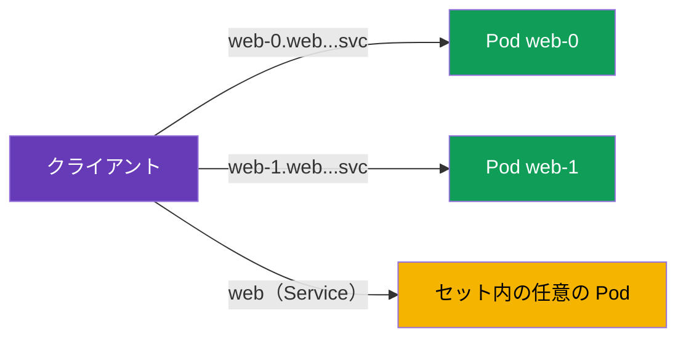

[Русская версия](ru.md) · [Eng version](en.md) · [Versión en español](es.md) · [Version française](fr.md) · [Deutsche Version](de.md) · [ქართული ვერსია](ge.md) · [繁體中文版](tw.md)

# 第23章：mesh における StatefulSet と headless Service

> **次へ進む前に。** このコースの大半の例は、通常の Service の背後にある stateless
> Service を対象としていました。しかし、クラスターにはデータベース、Kafka、Zookeeper などの
> stateful ワークロードもあり、これらは StatefulSet と headless Service で実行されます。これらには独自のアドレス指定の
> 特性があり、mesh ではそれを考慮することが重要です。この章では、Istio がこれらをどのように扱うかを説明します。

## 23.1. 復習：StatefulSet と headless Service

CKA で学んだ内容を簡単に振り返りましょう。

- **StatefulSet** は、**安定した ID** を持つ Pod を起動します。各 Pod には固有の
  永続名（`web-0`、`web-1`、...）、独自の永続ディスク、安定した DNS 名があります。
  これは、ノードを互換的に入れ替えられないデータベースやクラスターシステムで必要となります。
- **Headless Service**（`clusterIP: None`）は、単一の仮想 IP を持たない Service です。Pod を
  1 つの ClusterIP の背後に隠す代わりに、DNS で**個別の Pod のアドレス**を返します。StatefulSet は
  headless Service を使用して、各 Pod に `web-0.web.app.svc.cluster.local` のような安定した
  DNS 名を与えます。

つまり、stateful ワークロードには、Service 全体と**名前で指定した特定の
Pod**という 2 つのアドレス指定方法があります。これが一般的な stateless Service との主な違いです。

## 23.2. 特定の Pod へのアクセス

headless Service では、クライアントは「Service」にアクセスして（ランダムな Pod を取得するのではなく）、
安定した名前で厳密に指定した Pod にアクセスできます。



```bash
# 特定の Pod に対して
curl http://web-0.web.app.svc.cluster.local:8080/   # Server Name: web-0
curl http://web-1.web.app.svc.cluster.local:8080/   # Server Name: web-1
```

これは stateful システムにとって重要です。たとえば DB クラスターではレプリカは同等ではなく、
クライアントは必要なノード（リーダー、特定のシャード）に確実に到達する必要があります。ここでは「任意の
Pod」への負荷分散は適しません。

## 23.3. mesh での特性

Istio は headless Service と StatefulSet をサポートしますが、知っておくべき注意点があります。

- **ポート名の指定は必須です。** Istio の他の箇所（第 2 章と第 10 章）と同様に、Service のポートには
  プロトコルに従った名前（`http`、`grpc`、`tcp` など）を付けるか、`appProtocol` を設定する
  必要があります。headless では特に重要です。正しい名前がなければ Istio はプロトコルを判別できず、
  トラフィックを誤って処理する可能性があります。プロトコルが HTTP でない場合は、ポート名を `tcp` にします。
- **2 つのトラフィック経路。** 特定の Pod（`web-0...`）と Service 全体へのアクセスは、
  Istio によって異なる方法で処理されます。Pod をアドレス指定した場合、トラフィックは通常のセット内負荷分散を経ず、
  その Pod に直接送られます。これは想定どおりであり、stateful では必要です。技術的には、headless に対して
  Istio は通常の ClusterIP のようなエンドポイント一覧による EDS 負荷分散ではなく、**`ORIGINAL_DST`** 型のクラスター
  （実際の宛先 IP への passthrough）を内部で構築します。そのため `web-0...` へのリクエストは正確にその Pod に送られ、
  直接アドレス指定では `DestinationRule` の負荷分散/subsets 設定は事実上機能しません。分散する対象がないためです。
- **mTLS は動作します。** StatefulSet の Pod は通常の Pod と同じ SPIFFE ID と mTLS を取得します
  （第 13 章）。PeerAuthentication と AuthorizationPolicy は通常どおり適用されます。ただし、identity は
  特定の Pod ではなく ServiceAccount に結び付くため、StatefulSet のすべてのレプリカは同じ ID を持つことを覚えておいてください。
- **DestinationRule と subsets。** headless に対して DestinationRule でポリシーを設定できますが、
  Pod への直接アドレス指定では、負荷分散設定の一部は意味を失います（宛先アドレスが 1 つだけで、分散先がないためです）。

実際には、mesh 内で stateful を壊す最もよくある原因は、**誤ったポート名**です。
DB やブローカーが injection の有効化後に突然動作しなくなった場合は、まず Service のポート名を
確認してください。

### クラスターの bootstrap と publishNotReadyAddresses

クラスター型の stateful システム（Kafka、Zookeeper、Cassandra、
Elasticsearch）には別の落とし穴があります。クラスターを構成するため、ノードは**起動時、Ready
になる前から**互いを検出する必要があります（peer discovery、リーダー選出、bootstrap）。そのため、通常は headless Service を
`publishNotReadyAddresses: true` として公開し、Pod がまだ Ready でない間も DNS が Pod のアドレスを返すようにします。

```yaml
apiVersion: v1
kind: Service
metadata:
  name: kafka
  namespace: data
spec:
  clusterIP: None
  publishNotReadyAddresses: true    # 準備完了前のピアを見る - bootstrap に必要
  selector:
    app: kafka
  ports:
  - name: tcp-kafka                  # ポート名は必須 (HTTP 以外のプロトコル -> tcp-)
    port: 9092
```

mesh ではさらに微妙な点があります。Pod の readiness は **sidecar の readiness と一体化**され（第
4/13 章）、起動時には peer 間で mTLS がすでに機能している必要があります。初期段階でノード間の合意が取れないと、
クラスターは構成されません。役立つものは次のとおりです。

- `holdApplicationUntilProxyStarts`：プロキシの準備前にアプリケーションが peer discovery を開始しないようにします
  （そうしないと初期接続が失われます）。
- クラスタリングポートで一貫した mTLS モード（下記の `PERMISSIVE`/port-level を参照）：起動時に
  ノード間トラフィックが拒否されないようにします。
- 必要に応じて、補助ポートをインターセプトの対象外にします（best practices を参照）。

## 23.4. 本番環境の best practices

- **まず、DB を本当に mesh に入れる必要があるか判断してください。** Sidecar は各リクエストに遅延を追加し、
  高負荷の DB はレイテンシーに敏感です。外部または managed の DB（AWS では **RDS/Aurora**、**ElastiCache**、**MSK**）は、
  StatefulSet 自体を mesh に入れるのではなく、`ServiceEntry`（第 12 章）として導入することがよくあります。
  mTLS、ポリシー、可観測性といった具体的な利点のために、意図して datastore を mesh に導入してください。
- **ポートには常に適切な名前を付けてください。** HTTP 以外の DB ではプロトコル接頭辞
  （`mysql-`、`mongo-`、`redis-`）または `tcp` / `appProtocol` を使用します。誤ったポート名は、
  injection 有効化後に stateful が壊れる最大の原因です。
- **STRICT mTLS には注意してください。** stateful には、管理ツール、バックアップシステム、
  マイグレーションなど、mesh 外のクライアントが存在することがよくあります。`STRICT` では、これら（plaintext）は切断されます。
  それらを mesh に導入するか、`PERMISSIVE` を維持してください（必要に応じて port-level `PeerAuthentication` で
  ポート単位に設定します）。
- **レプリカで共有される ID を忘れないでください。** StatefulSet のすべての Pod は、1 つの
  SPIFFE ID（ServiceAccount に基づく）を持ちます。`AuthorizationPolicy` は personal principal によって
  `web-0` と `web-1` を区別できません。Service レベルで認可し、ノードの区別はアプリケーションで行ってください。
- **起動と停止の順序を管理してください。** 起動直後にネットワーク通信を行うワークロードでは、
  `holdApplicationUntilProxyStarts` を有効にして、sidecar の準備前にアプリケーションが起動しないようにします
  （そうしないと初期接続が失われます）。適切に終了するため、オープンな接続を持つアプリケーションより先に sidecar が停止されないよう、
  graceful shutdown を設定してください。
- **不要な L7 ポリシーを適用しないでください。** Pod への直接アドレス指定では、負荷分散と
  一部の L7 設定は無意味です。DB には複雑なルーティングではなく、通常は単純な L4（mTLS + passthrough）が必要です。
- **補助ポートはインターセプトの対象外にできます。** システム自身がノード間トラフィック
  （replication/clustering）を暗号化している場合、またはそのポートで sidecar が妨げになる場合は、
  `traffic.sidecar.istio.io/excludeInboundPorts` / `excludeOutboundPorts` アノテーションでポートを除外します。
  その場合、Istio はそのポートをインターセプトしません。これは Pod 全体を mesh から外す代わりとなる、限定的な方法です。
- **負荷下で failover と Pod 再起動をテストしてください。** 安定した名前でのアクセスとクラスターシステムの
  ノード切り替えが、mesh 内でも mesh なしの場合と同様に動作することを確認してください。

## 23.5. この章のまとめ

- stateful ワークロード（DB、Kafka など）は、安定した ID を持つ **StatefulSet** と、DNS で
  個別の Pod のアドレスを返す **headless Service**（`clusterIP: None`）で実行します。
- stateful には、Service 全体（任意の Pod）と安定した名前での**特定の
  Pod**（`web-0.web.ns.svc.cluster.local`）という 2 つのアドレス指定方法があります。後者はノードを互換的に入れ替えられない場合に重要です。
- Istio は headless と StatefulSet をサポートしますが、プロトコルに従った**適切なポート名の指定**を
  必要とします。これが最もよくある障害の原因です。
- 特定の Pod へのアクセスは、セット内負荷分散を経ず直接行われます。これは stateful で想定される動作です
  （Istio における headless は `ORIGINAL_DST` クラスター、実際の IP への passthrough であり、EDS 負荷分散ではありません）。
- クラスターシステム（Kafka/Zookeeper/Cassandra）は bootstrap のために `publishNotReadyAddresses` を必要とします。
  mesh では、これを sidecar の readiness（`holdApplicationUntilProxyStarts`）およびクラスタリングポートの
  mTLS モードと整合させてください。
- 補助ポートは `traffic.sidecar.istio.io/excludeInboundPorts`/`excludeOutboundPorts` により sidecar の対象外にできます。
  managed DB（RDS/MSK/ElastiCache）は、mesh に入れるのではなく `ServiceEntry` として導入することがよくあります。
- mTLS とポリシーは通常どおり機能します。identity は ServiceAccount に結び付くため、
  StatefulSet のすべてのレプリカは同じ ID を持ちます。
- 本番の実践事項：DB を mesh に入れる必要があるか判断する（または ServiceEntry として外出しする）、ポート名を適切に
  付ける、STRICT mTLS での注意点（mesh 外のクライアント）を理解する、レプリカで共有される identity を考慮する、
  起動/停止順序（`holdApplicationUntilProxyStarts`）を設定する、failover をテストする。

## 23.6. 理解度チェック

1. headless Service は通常の Service と何が異なり、StatefulSet にはなぜ必要ですか？
2. StatefulSet の特定の Pod にはどのようにアクセスし、なぜそれが必要になることがありますか？
3. headless ではポートに適切な名前を付けることが特に重要なのはなぜですか？
4. 特定の Pod へのアクセスと Service 全体へのアクセスは何が異なりますか？
5. 1 つの StatefulSet のレプリカは同じ SPIFFE ID を持ちますか、それとも異なりますか？ なぜですか？
6. mesh 内の stateful で重要な本番の実践事項は何ですか：DB を mesh に入れない方がよいのはいつか、外部クライアントに対する STRICT mTLS はどうするか、`holdApplicationUntilProxyStarts` はなぜ必要か？
7. `ORIGINAL_DST` クラスターとは何ですか？また、Pod への直接アドレス指定では負荷分散/subsets 設定が機能しないのはなぜですか？
8. クラスターシステムに `publishNotReadyAddresses` が必要なのはなぜですか？また、mesh で bootstrap を妨げうるものは何ですか？
9. DB の補助ポートを sidecar のインターセプト対象外にするにはどうし、いつ必要ですか？

## 演習

mesh で StatefulSet と headless Service を扱う練習をしましょう。安定した名前で
特定の Pod にアクセスします。

🧪 ラボ 30：[tasks/ica/labs/30](../../labs/30/README_JP.MD)

---
[目次](../README_JP.md) · [第22章](../22/jp.md) · [第24章](../24/jp.md)
