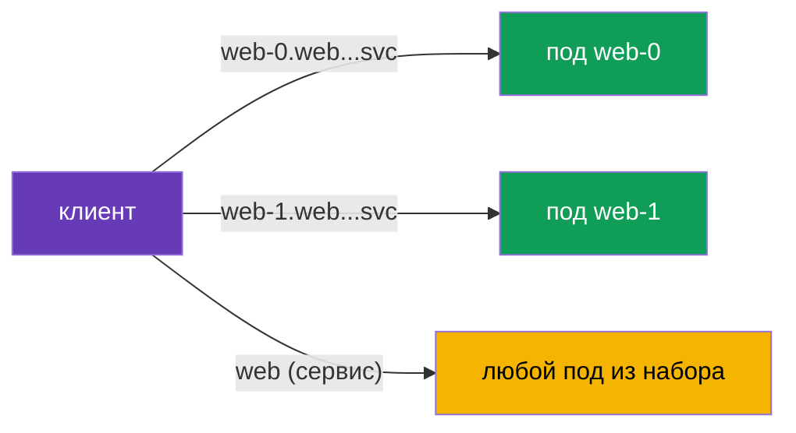

[Eng version](en.md) · [Versión en español](es.md)

# Глава 23. StatefulSet и headless-сервисы в mesh

> **Что дальше.** Большинство примеров в курсе были про stateless-сервисы за обычным
> Service. Но в кластере есть и stateful-нагрузки: базы данных, Kafka, Zookeeper - их
> запускают через StatefulSet и headless-сервисы. У них своя специфика адресации,
> которую важно учитывать в mesh. В этой главе разберём, как Istio с ними работает.

## 23.1. Напоминание: StatefulSet и headless-сервисы

Коротко освежим то, что вы знаете из CKA.

- **StatefulSet** запускает поды со **стабильной идентичностью**: у каждого своё
  устойчивое имя (`web-0`, `web-1`, ...), свой постоянный диск и стабильное DNS-имя.
  Именно это нужно базам и кластерным системам, где узлы не взаимозаменяемы.
- **Headless-сервис** (`clusterIP: None`) - сервис без единого виртуального IP. Вместо
  того чтобы прятать поды за одним ClusterIP, он в DNS возвращает **адреса конкретных
  подов**. StatefulSet использует headless-сервис, чтобы дать каждому поду стабильное
  DNS-имя вида `web-0.web.app.svc.cluster.local`.

То есть у stateful-нагрузок два способа адресации: к сервису в целом и к **конкретному
поду по имени**. Это и есть главное отличие от привычных stateless-сервисов.

## 23.2. Обращение к конкретному поду

С headless-сервисом клиент может обратиться не «к сервису» (и получить случайный под), а
к строго определённому поду по его стабильному имени:



```bash
# к конкретному поду
curl http://web-0.web.app.svc.cluster.local:8080/   # Server Name: web-0
curl http://web-1.web.app.svc.cluster.local:8080/   # Server Name: web-1
```

Это критично для stateful-систем: например, в кластере БД реплики не равнозначны, и
клиент должен попасть именно на нужный узел (лидер, конкретный шард). Балансировка «на
любой под» тут не подходит.

## 23.3. Особенности в mesh

Istio поддерживает headless-сервисы и StatefulSet, но есть нюансы, о которых надо знать.

- **Именование портов - обязательно.** Как и везде в Istio (главы 2 и 10), порт в Service
  надо назвать по протоколу (`http`, `grpc`, `tcp` и т.д.) или задать `appProtocol`.
  Для headless это особенно важно: без правильного имени Istio не поймёт протокол и
  может неверно обработать трафик. Если протокол не HTTP - имя порта `tcp`.
- **Два пути трафика.** Обращение к конкретному поду (`web-0...`) и к сервису в целом
  Istio обрабатывает по-разному. При адресации к поду трафик идёт именно туда, минуя
  обычную балансировку по набору - это ожидаемо и нужно для stateful. Технически под
  капотом для headless Istio строит кластер типа **`ORIGINAL_DST`** (passthrough на реальный
  IP назначения), а не EDS-балансировку по списку эндпоинтов, как для обычного ClusterIP.
  Поэтому запрос на `web-0...` уходит ровно на этот под, а настройки балансировки/subsets в
  `DestinationRule` при прямой адресации фактически не работают - балансировать не между чем.
- **mTLS работает.** Поды StatefulSet получают ту же SPIFFE-идентичность и mTLS, что и
  обычные (глава 13). PeerAuthentication и AuthorizationPolicy применяются как всегда.
  Просто помните: identity привязана к ServiceAccount, а не к конкретному поду, поэтому
  все реплики StatefulSet имеют одинаковую личность.
- **DestinationRule и subsets.** Для headless можно задавать политики через
  DestinationRule, но при прямой адресации к поду часть настроек балансировки теряет
  смысл (балансировать не между чем - адрес один).

На практике самое частое, что ломает stateful в mesh, - это **неправильное имя порта**.
Если БД или брокер вдруг перестали работать после включения инъекции, первым делом
проверьте имена портов в Service.

### Bootstrap кластера и publishNotReadyAddresses

Отдельная ловушка для **кластерных** stateful-систем (Kafka, Zookeeper, Cassandra,
Elasticsearch). Чтобы собраться в кластер, узлы должны найти друг друга **на старте - ещё до
того, как стали Ready** (peer discovery, выбор лидера, bootstrap). Для этого их headless-сервис
обычно объявляют с `publishNotReadyAddresses: true`, чтобы DNS отдавал адреса подов, даже пока
они не готовы:

```yaml
apiVersion: v1
kind: Service
metadata:
  name: kafka
  namespace: data
spec:
  clusterIP: None
  publishNotReadyAddresses: true    # видеть пиров до готовности - нужно для bootstrap
  selector:
    app: kafka
  ports:
  - name: tcp-kafka                  # обязательно именуем порт (протокол не HTTP -> tcp-)
    port: 9092
```

В mesh тут добавляется тонкость: готовность пода **склеивается с готовностью sidecar** (глава
4/13), и на старте между пирами уже должен работать mTLS. Если узлы не могут договориться на
раннем этапе, кластер не собирается. Что помогает:

- `holdApplicationUntilProxyStarts` - приложение не начнёт peer discovery раньше готового
  прокси (иначе ранние соединения теряются);
- согласованный режим mTLS на порту кластеринга (см. `PERMISSIVE`/port-level ниже) - чтобы
  межузловой трафик на старте не отбивался;
- при необходимости - вывод служебного порта из-под перехвата (см. best practices).

## 23.4. Best practices для прода

- **Сначала решите, нужен ли БД в mesh вообще.** Sidecar добавляет задержку на каждый
  запрос, а высоконагруженная БД чувствительна к латентности. Часто внешние или managed
  БД (на AWS - **RDS/Aurora**, **ElastiCache**, **MSK**) заводят как `ServiceEntry` (глава 12),
  а не тянут сам StatefulSet в mesh. Заводите datastore в mesh осознанно, ради конкретной
  выгоды (mTLS, политики, наблюдаемость).
- **Всегда правильно называйте порты.** Для не-HTTP БД используйте префикс протокола
  (`mysql-`, `mongo-`, `redis-`) или `tcp` / `appProtocol`. Неверное имя порта - причина
  номер один поломок stateful после включения инъекции.
- **Осторожно со STRICT mTLS.** У stateful часто есть клиенты вне mesh: инструменты
  администрирования, системы бэкапа, миграции. При `STRICT` они (plaintext) отвалятся.
  Либо заведите их в mesh, либо оставьте `PERMISSIVE` (при необходимости - точечно на
  порт через port-level `PeerAuthentication`).
- **Помните про общую идентичность реплик.** Все поды StatefulSet имеют одну
  SPIFFE-личность (по ServiceAccount). `AuthorizationPolicy` не отличит `web-0` от
  `web-1` по personalному principal - авторизуйте на уровне сервиса, а различение узлов
  делайте в приложении.
- **Управляйте порядком старта и остановки.** Для нагрузок, которые ходят по сети сразу
  при запуске, включайте `holdApplicationUntilProxyStarts`, чтобы приложение не
  стартовало раньше готового sidecar (иначе ранние соединения теряются). Для корректного
  завершения настройте graceful shutdown, чтобы sidecar не убивался раньше приложения с
  открытыми соединениями.
- **Не навешивайте лишние L7-политики.** При прямой адресации к поду балансировка и
  часть L7-настроек бессмысленны. Для БД чаще нужен просто L4 (mTLS + passthrough), а не
  сложная маршрутизация.
- **Служебные порты можно вывести из-под перехвата.** Если система сама шифрует межузловой
  трафик (репликация/кластеринг) или sidecar на этом порту мешает, исключите порт аннотациями
  `traffic.sidecar.istio.io/excludeInboundPorts` / `excludeOutboundPorts` - тогда Istio его не
  перехватывает. Это точечная альтернатива откату всего пода из mesh.
- **Тестируйте failover и рестарты под нагрузкой.** Проверьте, что обращение по
  стабильным именам и переключение узлов кластерной системы работает в mesh так же, как
  без него.

## 23.5. Итоги главы

- Stateful-нагрузки (БД, Kafka и т.п.) запускают через **StatefulSet** со стабильной
  идентичностью и **headless-сервис** (`clusterIP: None`), который в DNS отдаёт адреса
  конкретных подов.
- У stateful два способа адресации: к сервису в целом (любой под) и к **конкретному
  поду** по стабильному имени (`web-0.web.ns.svc.cluster.local`) - последнее критично,
  когда узлы не взаимозаменяемы.
- Istio поддерживает headless и StatefulSet, но требует **правильного именования портов**
  по протоколу - это самая частая причина поломок.
- Обращение к конкретному поду идёт напрямую, минуя балансировку по набору - это
  ожидаемое поведение для stateful (headless в Istio - это кластер `ORIGINAL_DST`,
  passthrough на реальный IP, а не EDS-балансировка).
- Кластерные системы (Kafka/Zookeeper/Cassandra) требуют `publishNotReadyAddresses` для
  bootstrap; в mesh согласуйте это с готовностью sidecar (`holdApplicationUntilProxyStarts`) и
  режимом mTLS на порту кластеринга.
- Служебные порты можно вывести из-под sidecar через
  `traffic.sidecar.istio.io/excludeInboundPorts`/`excludeOutboundPorts`; managed-БД (RDS/MSK/
  ElastiCache) чаще заводят как `ServiceEntry`, а не в mesh.
- mTLS и политики работают как обычно; идентичность привязана к ServiceAccount, поэтому
  все реплики StatefulSet имеют одинаковую личность.
- Прод-практики: решить, нужен ли БД в mesh (или вынести как ServiceEntry), правильно
  именовать порты, осторожно со STRICT mTLS (клиенты вне mesh), учитывать общую identity
  реплик, настроить порядок старта/остановки (`holdApplicationUntilProxyStarts`),
  тестировать failover.

## 23.6. Вопросы для самопроверки

1. Чем headless-сервис отличается от обычного и зачем он нужен StatefulSet?
2. Как обратиться к конкретному поду StatefulSet и зачем это бывает нужно?
3. Почему для headless особенно важно правильно называть порты?
4. Чем отличается обращение к конкретному поду от обращения к сервису в целом?
5. Одинаковая или разная SPIFFE-идентичность у реплик одного StatefulSet? Почему?
6. Какие прод-практики важны для stateful в mesh: когда БД лучше не заводить в mesh, что
   со STRICT mTLS для внешних клиентов, зачем `holdApplicationUntilProxyStarts`?
7. Что такое кластер `ORIGINAL_DST` и почему при прямой адресации к поду настройки
   балансировки/subsets не работают?
8. Зачем кластерным системам `publishNotReadyAddresses` и что может помешать их bootstrap в
   mesh?
9. Как вывести служебный порт БД из-под перехвата sidecar и когда это нужно?

## Практика

Отработайте работу StatefulSet и headless-сервисов в mesh: обращение к конкретным подам
по стабильным именам:

🧪 Лаба 30: [tasks/ica/labs/30](../../labs/30/README_RU.MD)

---
[Оглавление](../README.md) · [Глава 22](../22/ru.md) · [Глава 24](../24/ru.md)
