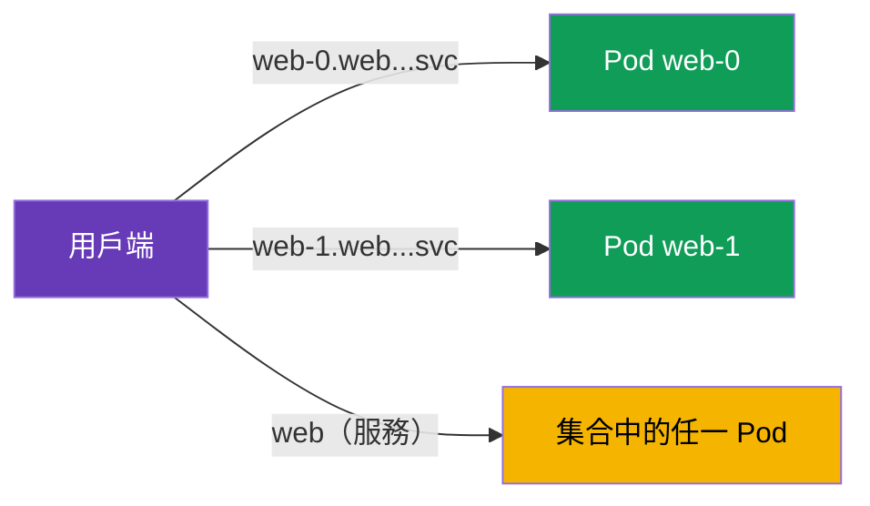

[Русская версия](ru.md) · [Eng version](en.md) · [Versión en español](es.md) · [Version française](fr.md) · [Deutsche Version](de.md) · [ქართული ვერსია](ge.md) · [日本語版](jp.md)

# 第 23 章。mesh 中的 StatefulSet 與 headless 服務

> **接下來。** 課程中的大多數範例都是一般 Service 背後的 stateless 服務。但叢集中也有 stateful 工作負載：資料庫、Kafka、Zookeeper--它們透過 StatefulSet 和 headless 服務執行。它們有自己的定址特性，在 mesh 中必須納入考量。本章將說明 Istio 如何與它們搭配運作。

## 23.1. 回顧：StatefulSet 與 headless 服務

簡要回顧您在 CKA 已知的內容。

- **StatefulSet** 會啟動具有**穩定身分**的 Pod：每個 Pod 都有自己的持久名稱（`web-0`、`web-1`、...）、自己的持久磁碟，以及穩定的 DNS 名稱。這正是資料庫與叢集系統所需，因為其中的節點不可互換。
- **Headless 服務**（`clusterIP: None`）是沒有單一虛擬 IP 的服務。它不會將 Pod 隱藏在單一 ClusterIP 後方，而是在 DNS 中回傳**特定 Pod 的位址**。StatefulSet 使用 headless 服務，為每個 Pod 提供如 `web-0.web.app.svc.cluster.local` 的穩定 DNS 名稱。

也就是說，stateful 工作負載有兩種定址方式：對整個服務，以及依名稱對**特定 Pod**定址。這正是它與慣用 stateless 服務的主要差異。

## 23.2. 存取特定 Pod

使用 headless 服務時，用戶端可以不「存取服務」（而取得隨機 Pod），而是依其穩定名稱存取嚴格指定的 Pod：



```bash
# 針對特定 pod
curl http://web-0.web.app.svc.cluster.local:8080/   # Server Name: web-0
curl http://web-1.web.app.svc.cluster.local:8080/   # Server Name: web-1
```

這對 stateful 系統至關重要：例如，在資料庫叢集中副本並不等價，用戶端必須正確連至所需節點（leader、特定 shard）。這裡不適合「導向任意 Pod」的負載平衡。

## 23.3. mesh 中的特性

Istio 支援 headless 服務與 StatefulSet，但有一些必須瞭解的細節。

- **必須命名連接埠。** 如同 Istio 的其他地方（第 2 與第 10 章），Service 中的連接埠必須依通訊協定命名（`http`、`grpc`、`tcp` 等），或設定 `appProtocol`。這對 headless 尤其重要：若名稱不正確，Istio 無法辨識通訊協定，可能錯誤處理流量。若通訊協定不是 HTTP，連接埠名稱應為 `tcp`。
- **兩種流量路徑。** 存取特定 Pod（`web-0...`）與存取整個服務，Istio 的處理方式不同。定址至 Pod 時，流量會直接前往該 Pod，略過一般的集合負載平衡--這正是 stateful 預期且必要的行為。技術上，Istio 在 headless 的底層建立的是 **`ORIGINAL_DST`** 類型叢集（passthrough 到真正目的 IP），而非如一般 ClusterIP 對 endpoint 清單的 EDS 負載平衡。因此，對 `web-0...` 的請求會精確前往該 Pod，而 `DestinationRule` 中的負載平衡/subsets 設定，在直接定址時實際上不會作用--沒有可供平衡的對象。
- **mTLS 可運作。** StatefulSet Pod 與一般 Pod（第 13 章）同樣取得 SPIFFE 身分與 mTLS。PeerAuthentication 和 AuthorizationPolicy 也會照常套用。請記住：identity 綁定於 ServiceAccount，而非特定 Pod，因此 StatefulSet 的所有副本具有相同身分。
- **DestinationRule 與 subsets。** 可透過 DestinationRule 為 headless 設定策略，但直接定址至 Pod 時，部分負載平衡設定會失去意義（沒有可供平衡的對象--位址只有一個）。

實務上，最常讓 mesh 中的 stateful 系統故障的是**錯誤的連接埠名稱**。若資料庫或 broker 在啟用 injection 後突然無法運作，首先檢查 Service 中的連接埠名稱。

### 叢集 bootstrap 與 publishNotReadyAddresses

另一個針對**叢集式** stateful 系統（Kafka、Zookeeper、Cassandra、Elasticsearch）的陷阱。若要組成叢集，節點必須在**啟動時--尚未 Ready 之前**就找到彼此（peer discovery、leader 選舉、bootstrap）。為此，它們的 headless 服務通常會宣告 `publishNotReadyAddresses: true`，讓 DNS 即使 Pod 尚未就緒也會回傳其位址：

```yaml
apiVersion: v1
kind: Service
metadata:
  name: kafka
  namespace: data
spec:
  clusterIP: None
  publishNotReadyAddresses: true    # 在就緒前即可見到 peer - bootstrap 需要
  selector:
    app: kafka
  ports:
  - name: tcp-kafka                  # 務必為連接埠命名（協定非 HTTP -> tcp-）
    port: 9092
```

在 mesh 中，這裡還有一項細節：Pod 的就緒狀態**會與 sidecar 的就緒狀態合併**（第 4/13 章），而啟動時 peer 之間就必須有可運作的 mTLS。若節點在早期階段無法協商，叢集就無法組成。以下做法有幫助：

- `holdApplicationUntilProxyStarts`--應用程式不會在 Proxy 就緒前開始 peer discovery（否則早期連線會遺失）；
- 叢集連接埠上協調一致的 mTLS 模式（請見下方 `PERMISSIVE`/port-level）--避免啟動時拒絕節點間流量；
- 必要時--將服務連接埠排除在攔截之外（請見 best practices）。

## 23.4. 正式環境的 Best practices

- **先決定資料庫是否真的需要在 mesh 中。** Sidecar 會為每個請求增加延遲，而高負載資料庫對延遲很敏感。外部或 managed 資料庫（AWS 上為 **RDS/Aurora**、**ElastiCache**、**MSK**）通常會設定為 `ServiceEntry`（第 12 章），而非將 StatefulSet 本身放入 mesh。請有意識地將 datastore 納入 mesh，以獲得明確效益（mTLS、策略、可觀測性）。
- **務必正確命名連接埠。** 非 HTTP 資料庫請使用通訊協定前綴（`mysql-`、`mongo-`、`redis-`）或 `tcp` / `appProtocol`。錯誤的連接埠名稱是啟用 injection 後 stateful 系統故障的首要原因。
- **謹慎使用 STRICT mTLS。** Stateful 系統通常有 mesh 外部的用戶端：管理工具、備份系統、遷移程序。在 `STRICT` 下，它們（plaintext）會失去連線。請將它們納入 mesh，或保留 `PERMISSIVE`（必要時可透過 port-level `PeerAuthentication` 僅針對連接埠設定）。
- **記住副本共用身分。** StatefulSet 的所有 Pod 都有一個 SPIFFE 身分（依 ServiceAccount）。`AuthorizationPolicy` 無法依 personal principal 區分 `web-0` 與 `web-1`--請在服務層級進行授權，並在應用程式中區分節點。
- **管理啟動與停止順序。** 對於啟動後立即進行網路連線的工作負載，請啟用 `holdApplicationUntilProxyStarts`，避免應用程式在 sidecar 就緒前啟動（否則早期連線會遺失）。為正確終止，請設定 graceful shutdown，避免 sidecar 早於仍有開放連線的應用程式終止。
- **不要套用不必要的 L7 策略。** 直接定址至 Pod 時，負載平衡與部分 L7 設定沒有意義。資料庫通常只需要 L4（mTLS + passthrough），而非複雜路由。
- **可將服務連接埠排除於攔截外。** 若系統自行加密節點間流量（replication/clustering），或 sidecar 干擾該連接埠，可透過註解 `traffic.sidecar.istio.io/excludeInboundPorts` / `excludeOutboundPorts` 排除連接埠--如此 Istio 不會攔截它。這是將整個 Pod 移出 mesh 的局部替代方案。
- **在負載下測試 failover 與重啟。** 請確認依穩定名稱的存取，以及叢集系統的節點切換，在 mesh 中與未使用 mesh 時同樣正常運作。

## 23.5. 本章總結

- Stateful 工作負載（資料庫、Kafka 等）透過具有穩定身分的 **StatefulSet** 與 **headless 服務**（`clusterIP: None`）執行，後者在 DNS 中回傳特定 Pod 的位址。
- Stateful 有兩種定址方式：對整個服務（任一 Pod）與依穩定名稱對**特定 Pod**定址（`web-0.web.ns.svc.cluster.local`）--當節點不可互換時，後者至關重要。
- Istio 支援 headless 與 StatefulSet，但要求依通訊協定**正確命名連接埠**--這是最常見的故障原因。
- 存取特定 Pod 時會直接連線，略過集合負載平衡--這是 stateful 預期行為（Istio 中的 headless 是 `ORIGINAL_DST` 叢集，passthrough 到真正 IP，而非 EDS 負載平衡）。
- 叢集系統（Kafka/Zookeeper/Cassandra）需要 `publishNotReadyAddresses` 進行 bootstrap；在 mesh 中，請與 sidecar 就緒狀態（`holdApplicationUntilProxyStarts`）及叢集連接埠上的 mTLS 模式協調。
- 可透過 `traffic.sidecar.istio.io/excludeInboundPorts`/`excludeOutboundPorts` 將服務連接埠排除於 sidecar 外；managed 資料庫（RDS/MSK/ElastiCache）通常設定為 `ServiceEntry`，而非放入 mesh。
- mTLS 與策略照常運作；identity 綁定於 ServiceAccount，因此 StatefulSet 的所有副本有相同身分。
- 正式環境實務：決定資料庫是否需要在 mesh 中（或作為 ServiceEntry 移出）、正確命名連接埠、謹慎使用 STRICT mTLS（mesh 外部用戶端）、考量副本的共用 identity、設定啟動/停止順序（`holdApplicationUntilProxyStarts`）、測試 failover。

## 23.6. 自我檢查問題

1. Headless 服務與一般服務有何不同，為何 StatefulSet 需要它？
2. 如何存取 StatefulSet 的特定 Pod，為何有時需要這樣做？
3. 為何對 headless 而言，正確命名連接埠尤其重要？
4. 存取特定 Pod 與存取整個服務有何不同？
5. 同一 StatefulSet 的副本，其 SPIFFE 身分相同還是不同？為什麼？
6. mesh 中 stateful 系統的重要正式環境實務有哪些：何時資料庫最好不要放入 mesh、外部用戶端的 STRICT mTLS 如何處理、`holdApplicationUntilProxyStarts` 的用途是什麼？
7. `ORIGINAL_DST` 叢集是什麼，為何在直接定址至 Pod 時負載平衡/subsets 設定不會作用？
8. 叢集系統為何需要 `publishNotReadyAddresses`，又是什麼可能妨礙它們在 mesh 中的 bootstrap？
9. 如何將資料庫服務連接埠排除在 sidecar 攔截之外，何時需要這樣做？

## 實作練習

練習在 mesh 中使用 StatefulSet 與 headless 服務：透過穩定名稱存取特定 Pod：

🧪 實驗 30：[tasks/ica/labs/30](../../labs/30/README_TW.MD)

---
[目錄](../README_TW.md) · [第 22 章](../22/tw.md) · [第 24 章](../24/tw.md)
