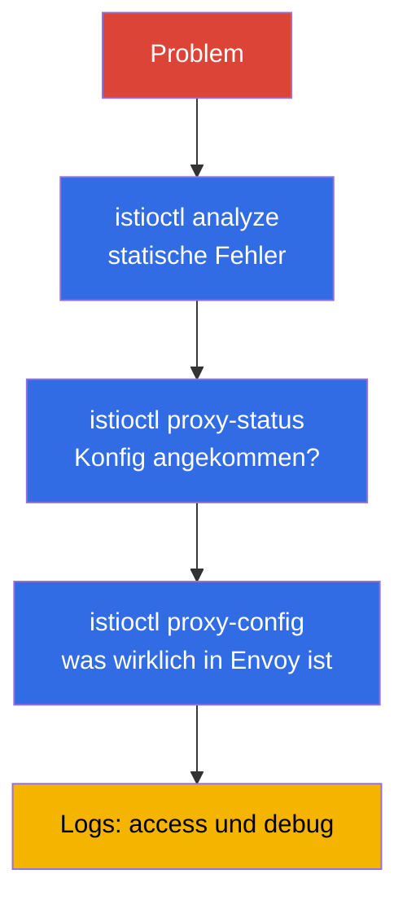

[RU version](ru.md) · [Eng version](en.md) · [Versión en español](es.md) · [Version française](fr.md)

# Kapitel 24. Troubleshooting Istio

> **Was kommt als Nächstes.** Das ist das abschließende Kapitel von Teil 1 und eine eigene Domäne
> der ICA-Prüfung. Wenn etwas im mesh nicht funktioniert - der Traffic geht nicht durch, es hagelt
> 503, die Anwendung ist nicht erreichbar - muss man schnell die Ursache finden. In diesem Kapitel
> sammeln wir die Werkzeuge und einen systematischen Ansatz zur Diagnose von Istio:
> `istioctl analyze`, `proxy-status`, `proxy-config`, Logs.

## 24.1. Das Hauptprinzip: fast immer ist die Konfiguration schuld

Die überwiegende Mehrheit der Probleme in Istio ist eine **falsche Konfiguration der data
plane**: ein Tippfehler im Namen eines subset, ein nicht passender selector beim Gateway, eine
vergessene Injektion, ein Konflikt von Policies. Seltener - Probleme der Anwendung selbst oder
der Infrastruktur.

Daraus ergibt sich der systematische Ansatz: vom Allgemeinen zum Speziellen entlang der Schichten
gehen.



Betrachten wir jedes Werkzeug.

## 24.2. istioctl analyze: statische Analyse

`istioctl analyze` - das Erste, was man ausführen sollte. Es prüft die Konfiguration **vor** und
**ohne** das Senden von Traffic: es findet typische Probleme - fehlende Injektion, kaputte
Verweise auf subset/gateway, Konflikte von Policies, falsche Hosts.

```bash
istioctl analyze -n app
```

Es gibt Warnungen und Fehler mit verständlicher Beschreibung aus und weist oft direkt auf die
Ursache hin. Das ist eine günstige Prüfung, mit der man beginnen sollte - sie fängt den Löwenanteil
der Konfigurationsfehler noch vor der tiefen Diagnose ab.

## 24.3. istioctl proxy-status: ist die Konfig angekommen

Die nächste Frage: ist Ihre Konfiguration auf den Proxys angewendet worden? istiod verteilt sie
über xDS (Kapitel 4), und das ist nicht augenblicklich. `istioctl proxy-status` zeigt den Stand
der Synchronisierung aller Envoys mit istiod:

```bash
istioctl proxy-status
```

Jeder proxy sollte im Zustand `SYNCED` sein. Wenn Sie `STALE` sehen - die Konfig ist nicht
angekommen: möglicherweise ist istiod überlastet, es gibt einen Fehler in der Konfiguration oder
Verbindungsprobleme. Solange ein proxy nicht `SYNCED` ist, ist es sinnlos, die Ursache in den
Regeln zu suchen - sie sind noch nicht angewendet.

## 24.4. istioctl proxy-config: was wirklich in Envoy ist

Wenn analyze sauber ist und die Proxys SYNCED sind, der Traffic aber trotzdem falsch läuft -
sehen wir uns an, was **wirklich** in der Konfiguration eines konkreten Envoy liegt. Hier greift
die Verknüpfung der Begriffe aus Kapitel 4: listeners, routes, clusters, endpoints.

```bash
istioctl proxy-config listeners <pod> -n app   # welche Ports er lauscht
istioctl proxy-config routes    <pod> -n app   # Routing-Regeln
istioctl proxy-config clusters  <pod> -n app   # Zielservices und subsets
istioctl proxy-config endpoints <pod> -n app   # reale IPs der Pods
```

Typisches Szenario: ein `VirtualService` verweist auf `subset: v2`, aber in `clusters` gibt es
dieses subset nicht - das heißt, die `DestinationRule` beschreibt es nicht oder die Namen passen
nicht. Oder in `endpoints` gibt es keine einzige Adresse - das heißt, hinter dem Service stehen
keine gesunden Pods.

Ein weiterer nützlicher Befehl - `istioctl x describe pod <pod>`: er erklärt in menschlicher
Sprache, welche Policies und routes einen konkreten pod beeinflussen.

## 24.5. Logs: access und debug

Wenn die Konfiguration korrekt ist, die Anfragen aber trotzdem scheitern, helfen die Logs.

**Access-Logs von Envoy** zeigen jede Anfrage: den Antwortcode, die Dauer und, das Wichtigste, die
**response flags** — einen kurzen Code, der sofort sagt, in welcher Phase alles kaputtgegangen ist.
Access-Logs werden über die Telemetry API (Kapitel 18) aktiviert — hier die vollständige Ressource,
die sie für die ganze mesh-Zelle aktiviert:

```yaml
apiVersion: telemetry.istio.io/v1
kind: Telemetry
metadata:
  name: mesh-access-logs
  namespace: istio-system        # namespace istiod -> wirkt auf das ganze mesh
spec:
  accessLogging:
    - providers:
        - name: envoy             # eingebauter Provider der stdout-Logs von Envoy
```

Danach liest man die Logs eines konkreten pod direkt über `kubectl` aus dem Container
`istio-proxy`:

```bash
kubectl logs <pod> -n app -c istio-proxy
```

Die response flags — das, wofür man sich überhaupt die Access-Logs ansieht. Die häufigsten:

| Flag  | Bedeutung                                            | Wo suchen                                    |
|-------|------------------------------------------------------|----------------------------------------------|
| `UH`  | no healthy upstream — keine gesunden Zielpods        | `proxy-config endpoints`, Bereitschaft der Pods |
| `NR`  | no route — keine route gefunden                      | Host in `VirtualService`, `selector` des Gateway |
| `UF`  | upstream connection failure — Verbindung fehlgeschlagen | mTLS mismatch, Netzwerk, `PeerAuthentication` |
| `UC`  | upstream connection termination — upstream hat die Verbindung abgebrochen | Anwendung stürzt ab, keep-alive, Timeout |
| `UO`  | upstream overflow — circuit breaker hat ausgelöst    | Pool-Limits in `DestinationRule` (Kapitel 10)   |
| `URX` | Retry-Limit erreicht                                 | Policy `retries`, Robustheit des upstream    |
| `UT`  | upstream request timeout                             | `timeout` in `VirtualService`, langsames Backend |
| `DC`  | downstream connection termination — Client hat sich getrennt | Client-Timeouts, LB vor dem mesh      |

**Debug-Logs des proxy** — für die tiefe Fehlersuche kann man das Log-Level von Envoy anheben:

```bash
istioctl proxy-config log <pod> -n app --level debug
```

Sehen Sie sich auch die Logs von istiod an - dort sind Fehler beim Anwenden der Konfiguration
sichtbar (zum Beispiel ein abgelehnter EnvoyFilter).

## 24.6. Direkter Zugriff auf Envoy: config_dump und Admin-Oberfläche

Manchmal reichen die Übersichten von `proxy-config` nicht und man muss die rohe Envoy-Konfig
komplett sehen. Jeden `proxy-config`-Befehl kann man bitten, JSON auszugeben — das ist dasselbe
Format, das Envoy über xDS verteilt:

```bash
istioctl proxy-config all <pod> -n app -o json > dump.json
```

Noch näher an der „Hardware“ — das Admin-Interface von Envoy auf Port `15000`. Wir leiten es
weiter und gehen die Endpoints direkt durch:

```bash
kubectl port-forward <pod> -n app 15000:15000
# dann in einem anderen Fenster:
curl localhost:15000/config_dump   # vollständiger Dump der xDS-Konfiguration
curl localhost:15000/clusters      # Zustand der clusters und Gesundheit der endpoints
curl localhost:15000/stats         # Zähler von Envoy (Anfragen, Fehler, retries)
curl localhost:15000/certs         # geladene TLS-Zertifikate
```

Besonders nützlich ist die Prüfung der mTLS-Zertifikate: wenn Sie zweifeln, dass der proxy
überhaupt ein funktionierendes Leaf-Zertifikat von istiod erhalten hat (Kapitel 4 und 16), fragen
Sie ihn direkt:

```bash
istioctl proxy-config secret <pod> -n app
```

Der Befehl zeigt, ob es `default` (das Leaf-Zertifikat des workload) und `ROOTCA` gibt und bis zu
welchem Datum sie gültig sind. Ein leeres oder abgelaufenes secret ist eine direkte Ursache für
Fehler beim Aufbau von mTLS.

## 24.7. Typische Probleme

Ein kleines Nachschlagewerk „Symptom - wahrscheinliche Ursache“.

- **Pod `1/1` statt `2/2`.** Die Injektion hat nicht gegriffen: es fehlt das Label am namespace
  oder der pod wurde davor erstellt (Kapitel 2, 4). Wird mit Label + `rollout restart` behoben.
- **503, Flag `UH` (no healthy upstream).** Keine gesunden Pods hinter dem Service, oder der
  `VirtualService` schickt auf ein nicht existierendes subset, oder der circuit breaker hat
  ausgelöst. Sehen Sie sich `proxy-config endpoints` und `clusters` an.
- **503 beim Start des pod oder während des Rollouts.** Ein Wettlauf der Startreihenfolge: der
  Anwendungscontainer hat es geschafft, Traffic zu senden/empfangen, bevor Envoy hochgekommen ist -
  oder umgekehrt, beim Beenden hat der pod die Anwendung getötet, während der proxy noch
  Verbindungen hielt. Wird mit zwei Einstellungen behoben: `holdApplicationUntilProxyStarts` (die
  Anwendung startet nicht, bis der proxy bereit ist) und graceful-shutdown des proxy
  (`EXIT_ON_ZERO_ACTIVE_CONNECTIONS` + ein angemessenes `preStop`/`terminationGracePeriodSeconds`).
  Die klassische Ursache eines Anstiegs von 503 gerade während eines `rolling update`.
- **503 mit Flag `UC`/`UO`.** `UC` — der upstream hat die Verbindung abgebrochen (die Anwendung
  stürzt ab, die keep-alive-Timeouts von mesh und Backend gehen auseinander). `UO` — der circuit
  breaker hat ausgelöst: die Limits des Verbindungs-/Anfrage-Pools aus `DestinationRule` (Kapitel
  10) sind überschritten. Das sind unterschiedliche Ursachen, und das Flag trennt sie sofort.
- **503 sofort nach dem Aktivieren von STRICT mTLS.** Ein Klassiker: eine Seite sendet plaintext
  (kein sidecar), die andere fordert mTLS. Prüfen Sie PeerAuthentication und das Vorhandensein
  eines sidecar beim Client (Kapitel 13).
- **Pods im CrashLoop nach dem Aktivieren des mesh.** Häufige Ursache - die HTTP-Probes
  (liveness/readiness) fallen bei STRICT mTLS aus, weil `rewriteAppHTTPProbers` deaktiviert ist.
  Prüfen Sie die Probes und die Annotation `sidecar.istio.io/rewriteAppHTTPProbers` (Kapitel 13).
- **404, Flag `NR` (no route).** Es gibt keine passende route: ein nicht passender Host im
  `VirtualService`, ein falscher `selector` beim Gateway, vergessenes `mesh` in `gateways` für
  internen Traffic (Kapitel 5).
- **Proxy `STALE`.** Die Konfig wurde nicht synchronisiert - sehen Sie sich die Last und die Logs
  von istiod an.
- **Änderungen werden nicht angewendet.** Möglicherweise kollidiert eine engere Policy, oder die
  Ressource ist im falschen namespace. Führen Sie `analyze` und `x describe` aus.

## 24.8. Troubleshooting auf EKS/AWS

Ein Teil der Probleme entsteht nicht innerhalb des mesh, sondern an der Nahtstelle zwischen Istio
und der AWS-Infrastruktur. Diese Fälle werden von `analyze` und `proxy-config` nicht erfasst - sie
muss man gesondert kennen.

- **Health-Checks von ALB/NLB fallen nach dem Aktivieren des mesh aus.** Der AWS Load Balancer
  Controller registriert die Pods als Targets und schickt den Health-Check direkt in den pod. Wenn
  STRICT mTLS aktiviert ist, der Check aber als gewöhnliches plaintext-HTTP läuft, lehnt der proxy
  ihn ab → die Targets werden `unhealthy` → der Balancer gibt 503 zurück, obwohl innerhalb des mesh
  alles „grün“ ist. Lösungen: `rewriteAppHTTPProbers` aktivieren (Istio schreibt die HTTP-Probes
  auf den pilot-agent-Port 15021 um), oder den Health-Check auf einen aus dem Abfangen
  ausgeschlossenen Port richten, oder vor die Anwendung ein ingress gateway stellen und dieses
  prüfen. Die Gesundheit des ingress-Gateways sieht man an dessen `/healthz/ready` (Port 15021).

- **Die Injektion greift „still“ nicht — der webhook ist blockiert.** istiod nimmt Aufrufe des
  mutating webhook auf Port `15017` an. Auf EKS geht der Traffic von der control plane zu den
  istiod-Pods über die security group der nodes; wenn Port `15017` geschlossen ist, kann der
  API-Server den webhook nicht auslösen — die Pods werden **ohne** sidecar erstellt (oder bleiben
  hängen, wenn failurePolicy=Fail). Beim Symptom „Pods `1/1`, das Label am namespace ist da“ —
  prüfen Sie die security groups und die Erreichbarkeit des Service `istiod` auf 15017.

- **IRSA / Metadata geht durch das Abfangen kaputt.** Standardmäßig fängt der sidecar den
  gesamten ausgehenden Traffic ab, einschließlich der Zugriffe auf den Metadata-Endpoint
  `169.254.169.254`. Pods, die AWS-Credentials über IMDS beziehen, bricht das den Bezug der Rollen.
  Schließen Sie die Adresse mit einer Annotation am pod vom Abfangen aus:

  ```yaml
  metadata:
    annotations:
      traffic.sidecar.istio.io/excludeOutboundIPRanges: "169.254.169.254/32"
  ```

  IRSA über ein projected-Token geht an den regionalen STS-Endpoint (gewöhnliches externes HTTPS,
  das per passthrough durchläuft), aber SDKs versuchen dennoch oft IMDS — deshalb prüfen Sie bei
  „unerklärlichen“ Fehlern beim Zugriff auf AWS zuallererst das Abfangen der Metadata.

- **istio-cni und die Reihenfolge mit VPC CNI.** Auf EKS ist der Netzwerkstack bereits vom Amazon
  VPC CNI belegt. Bei der Installation von istio-cni ist die Reihenfolge der init-Plugins wichtig,
  sonst kann der pod starten, bevor die Abfangregeln gesetzt sind, und der Traffic läuft am proxy
  vorbei. Mehr dazu - in Kapitel 27.

## 24.9. Diagnose sammeln: istioctl bug-report

Wenn man ein Problem an einen Kollegen oder an den Support weitergeben muss — oder einfach alles
auf einmal zur Analyse sammeln — gibt es `istioctl bug-report`:

```bash
istioctl bug-report
```

Der Befehl sammelt ein Archiv mit der gesamten mesh-Diagnose: Versionen, Konfiguration,
Synchronisierungsstatus, Logs von istiod und der Proxys, Dumps der Envoy-Konfigs. Das ist ein
bequemer „Ein-Knopf“ statt des manuellen Sammelns eines Dutzends Befehle, besonders beim Kontakt
mit dem Support oder beim nachträglichen Aufarbeiten eines Incidents.

> **KI-Assistenten und MCP.** Es sind experimentelle MCP-Server (Model Context Protocol)
> aufgetaucht, die einem KI-Assistenten Zugriff auf die mesh-Diagnose geben: `istio-mcp-server`
> (eine read-only-Hülle über `proxy-config`/`proxy-status`/Istio-Ressourcen), universelle Hüllen
> über `kubectl`/`istioctl` und MCP als Teil von Kiali. Die Idee — Fragen zum Zustand des mesh in
> natürlicher Sprache zu stellen, und das Sammeln der Fakten macht der Assistent selbst über
> dieselben Befehle aus diesem Kapitel. Das sind community-Projekte, nicht Teil von Istio, und von
> unterschiedlichem Reifegrad — **auf eigene Gefahr nutzen** (sie verbinden sich mit einem
> lebenden cluster), aber als Beschleuniger beim Aufarbeiten von Incidents einen Blick wert.

## 24.10. Systematischer Ansatz

Um nicht zu raten, gehen Sie die Checkliste vom Allgemeinen zum Speziellen durch:

1. **`istioctl analyze`** - gibt es statische Konfigurationsfehler?
2. **Pods `2/2`?** Hat die Injektion gegriffen?
3. **`istioctl proxy-status`** - sind alle Proxys `SYNCED`?
4. **`istioctl proxy-config`** - was ist wirklich in Envoy (routes, clusters, endpoints)?
5. **`istioctl x describe pod`** - welche Policies beeinflussen den pod?
6. **Access-Logs** - welcher Code und welches response flag?
7. **Debug-Logs** - wenn alles oben sauber ist, graben wir tiefer.

Diese Reihenfolge spart Zeit: die meisten Probleme werden in den ersten drei Schritten abgefangen,
ohne bis zum Lesen der Debug-Logs zu kommen.

## 24.11. Troubleshooting in ambient

Alles oben ist für den sidecar-Modus beschrieben. In ambient (Kapitel 22) gibt es keine sidecars,
deshalb funktioniert ein Teil der Werkzeuge anders - das muss man berücksichtigen.

Der Hauptunterschied: der Anwendungs-pod hat **keinen eigenen Envoy**, deshalb ist
`istioctl proxy-config <app-pod>` für ihn nutzlos. Die Diagnose läuft über zwei andere
Komponenten - ztunnel (L4) und waypoint (L7).

- **Prüfen, dass der pod überhaupt in ambient ist.** Der namespace muss mit
  `istio.io/dataplane-mode=ambient` markiert sein und der pod darf keinen sidecar haben. Sehen,
  welche Workloads ztunnel sieht:

  ```bash
  istioctl ztunnel-config workloads
  istioctl ztunnel-config services
  ```

- **Logs von ztunnel.** ztunnel ist ein DaemonSet in `istio-system`. Die Diagnose des
  L4-Traffics und von mTLS läuft über die Logs von ztunnel auf **der node**, wo der pod lebt:

  ```bash
  kubectl logs -n istio-system ds/ztunnel
  ```

- **Waypoint ist ein Envoy.** Wenn das Problem in L7 liegt (Routing, L7-Autorisierung),
  diagnostiziert man es am waypoint wie an einem gewöhnlichen proxy - über das gewohnte
  `proxy-config`:

  ```bash
  istioctl proxy-config all <waypoint-pod> -n app
  ```

- **`istioctl proxy-status`** funktioniert auch in ambient und zeigt ztunnel und waypoint - ob sie
  synchronisiert sind.

Der häufigste ambient-spezifische Fehler: **eine L7-Policy greift nicht, weil es keinen waypoint
gibt**. Denken Sie an Kapitel 22 - ztunnel arbeitet nur auf L4. Wenn Ihre `AuthorizationPolicy`
mit HTTP-Regeln (Methoden, Pfade) „nicht wirkt“, prüfen Sie, dass für den Service ein waypoint
ausgerollt ist und das Label `istio.io/use-waypoint` gesetzt ist. Ohne waypoint gibt es einfach
niemanden, der die L7-Regeln anwendet.

## 24.12. Best Practices

- **`istioctl analyze` in der CI.** Lassen Sie es in der Pipeline auf den Manifesten vor dem
  Anwenden laufen — die meisten Konfigurationsfehler werden noch vor dem Eintreffen im cluster
  abgefangen.
- **Access-Logs mit flags standardmäßig aktiviert.** Eine `Telemetry`-Ressource für das ganze
  mesh (siehe 24.5) kostet wenig, und im Moment eines Incidents spart das response flag Stunden
  des Ratens.
- **`istioctl x precheck` vor dem Upgrade.** Prüft die Bereitschaft des cluster für die
  Installation oder das Update von Istio und warnt frühzeitig vor Inkompatibilitäten.
- **Kiali als schnelle Triage.** Der Service-Graph hebt hervor, wo genau der Traffic reißt und
  welche Ressourcen kollidieren, — oft ist das schneller, als die Logs manuell zu lesen.
- **Gehen Sie streng entlang der Schichten.** Springen Sie nicht sofort in die Debug-Logs:
  `analyze` → `proxy-status` → `proxy-config` → Access-Logs grenzen das Problem im günstigsten
  Schritt ein.
- **Sammeln Sie `bug-report` für schwierige Fälle** — ein einziges Archiv statt eines Dutzends
  verstreuter Befehle, praktisch sowohl für den Support als auch für die nachträgliche
  Aufarbeitung.

## 24.13. Zusammenfassung des Kapitels

- Fast alle Istio-Probleme sind eine falsche Konfiguration der data plane; die Diagnose führt man
  vom Allgemeinen zum Speziellen.
- **`istioctl analyze`** - statische Analyse der Konfiguration, fängt typische Fehler vor dem
  Traffic ab; damit beginnt man.
- **`istioctl proxy-status`** - Synchronisierung der Proxys mit istiod (`SYNCED`/`STALE`); solange
  nicht `SYNCED`, ist die Konfiguration nicht angewendet.
- **`istioctl proxy-config`** (listeners/routes/clusters/endpoints) - was wirklich in Envoy liegt;
  hier findet man nicht passende subset, fehlende endpoints usw.
- **`istioctl x describe pod`** erklärt, welche Policies einen pod beeinflussen.
- **Access-Logs** (Codes und flags wie `UH`, `NR`, `UC`, `UO`) und **Debug-Logs** des proxy - für
  die Fälle, in denen die Konfiguration korrekt ist, die Anfragen aber scheitern; das response
  flag weist sofort auf die Phase des Ausfalls hin.
- Für die tiefe Aufarbeitung gibt es den direkten Zugriff auf Envoy: `proxy-config ... -o json`,
  die Admin-Oberfläche auf Port `15000` (`/config_dump`, `/clusters`, `/stats`, `/certs`) und
  `proxy-config secret` zur Prüfung der mTLS-Zertifikate.
- Nützlich, die typischen Verknüpfungen zu kennen: `1/1` (Injektion), `503 UH` (kein
  upstream/subset), `503` nach STRICT (mTLS mismatch), `503` beim Rollout (Wettlauf des
  proxy-Starts → `holdApplicationUntilProxyStarts`), `404 NR` (keine route/selector/mesh).
- Auf EKS/AWS gibt es eine eigene Klasse von Problemen: Health-Checks von ALB/NLB gegen STRICT
  mTLS, geschlossener webhook-Port `15017` (Injektion greift nicht), Abfangen der Metadata
  `169.254.169.254` (bricht IRSA/IMDS), Reihenfolge von istio-cni mit VPC CNI.
- `istioctl bug-report` sammelt die gesamte mesh-Diagnose in einem Archiv.
- In ambient ist die Diagnose anders: der pod hat keinen eigenen Envoy - man sieht sich ztunnel an
  (`istioctl ztunnel-config`, Logs des DaemonSet) für L4 und den waypoint (`proxy-config`) für L7.
  Häufiger Fehler - eine L7-Policy funktioniert nicht, weil kein waypoint ausgerollt ist.

## 24.14. Fragen zur Selbstüberprüfung

1. Warum beginnt man die Diagnose von Istio mit der Annahme eines Konfigurationsfehlers?
2. Was prüft `istioctl analyze` und warum sollte man damit beginnen?
3. Was bedeutet der Status `STALE` in `proxy-status` und worüber gibt er Auskunft?
4. Wie findet man mithilfe von `proxy-config` einen Verweis auf ein nicht existierendes subset?
5. Worüber geben `503` mit Flag `UH` und `503` sofort nach dem Aktivieren von STRICT mTLS
   Auskunft? Wodurch unterscheiden sich davon die flags `UC` und `UO`?
6. Warum tauchen 503 oft gerade während eines `rolling update` auf und welche Einstellungen
   beheben das?
7. Wie sieht man sich die rohe Envoy-Konfig an und prüft, dass der proxy ein mTLS-Zertifikat
   erhalten hat?
8. Warum können nach dem Aktivieren von STRICT mTLS die Targets von ALB/NLB `unhealthy` werden und
   wie behebt man das?
9. Was kann den Bezug der AWS-Rollen (IRSA/IMDS) in einem pod mit sidecar kaputtmachen?
10. Beschreiben Sie die systematische Reihenfolge der Diagnose vom Allgemeinen zum Speziellen.
11. Wodurch unterscheidet sich die Diagnose in ambient vom sidecar? Wohin schaut man bei L4- und
    L7-Problemen und warum kann eine L7-Policy nicht greifen?

## Praxis

Man gibt Ihnen eine kaputte Umgebung - finden und beheben Sie die Konfigurationsfehler mithilfe von
`istioctl analyze`, `proxy-status` und `proxy-config`:

🧪 Lab 12: [tasks/ica/labs/12](../../labs/12/README_DE.MD)

---
[Inhaltsverzeichnis](../README_DE.md) · [Kapitel 23](../23/de.md) · [Kapitel 25](../25/de.md)
