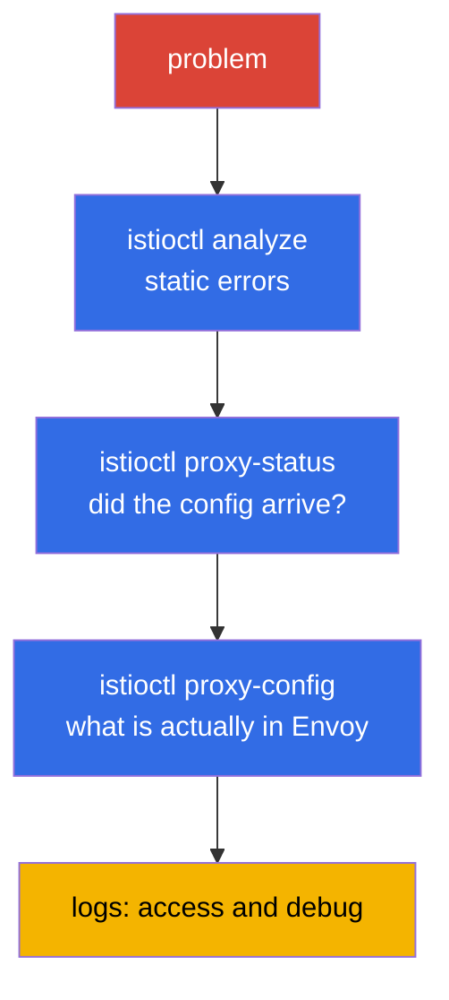

[RU version](ru.md)

# Chapter 24. Troubleshooting Istio

> **What's next.** This is the closing chapter of Part 1 and a separate ICA exam domain. When
> something in the mesh does not work - traffic does not flow, it throws 503s, the application is
> unreachable - you need to find the cause quickly. In this chapter we gather the tools and a
> systematic approach to diagnosing Istio: `istioctl analyze`, `proxy-status`, `proxy-config`, logs.

## 24.1. The main principle: it is almost always the configuration

The vast majority of problems in Istio are a **misconfigured data plane**: a typo in a subset name,
a Gateway selector mismatch, forgotten injection, a policy conflict. Less often - problems of the
application itself or the infrastructure.

Hence the systematic approach: go from the general to the specific, layer by layer.



Let us go through each tool.

## 24.2. istioctl analyze: static analysis

`istioctl analyze` is the first thing worth running. It checks the configuration **before** and
**without** sending traffic: it finds typical problems - missing injection, broken references to a
subset/gateway, policy conflicts, incorrect hosts.

```bash
istioctl analyze -n app
```

It emits warnings and errors with a clear description and often points straight at the cause. This
is a cheap check to start with - it catches the lion's share of configuration errors even before
deep diagnostics.

## 24.3. istioctl proxy-status: did the config arrive

The next question: has your configuration actually been applied on the proxy? istiod distributes it
over xDS (chapter 4), and that is not instant. `istioctl proxy-status` shows the sync state of every
Envoy with istiod:

```bash
istioctl proxy-status
```

Each proxy should be in the `SYNCED` state. If you see `STALE` - the config did not arrive: istiod
may be overloaded, there may be a configuration error or connectivity problems. Until a proxy is
`SYNCED`, it is pointless to look for the cause in the rules - they have not been applied yet.

## 24.4. istioctl proxy-config: what is actually in Envoy

If analyze is clean and the proxy is SYNCED, yet the traffic still goes the wrong way - look at what
is **actually** in a specific Envoy's configuration. Here the concepts from chapter 4 come into
play: listeners, routes, clusters, endpoints.

```bash
istioctl proxy-config listeners <pod> -n app   # which ports it listens on
istioctl proxy-config routes    <pod> -n app   # routing rules
istioctl proxy-config clusters  <pod> -n app   # destination services and subsets
istioctl proxy-config endpoints <pod> -n app   # the real pod IPs
```

A typical scenario: a `VirtualService` references `subset: v2`, but that subset is not in
`clusters` - which means the `DestinationRule` does not describe it or the names do not match. Or
`endpoints` has no addresses at all - which means there are no healthy pods behind the service.

Another useful command is `istioctl x describe pod <pod>`: it explains in plain language which
policies and routes affect a specific pod.

## 24.5. Logs: access and debug

When the configuration is correct but requests still fail, logs help.

**Envoy access logs** show every request: the response code, duration and, most importantly, the
**response flags** - a short code that tells you at once at which stage everything broke. Access
logs are enabled via the Telemetry API (chapter 18) - here is the full resource that enables them
for the whole mesh:

```yaml
apiVersion: telemetry.istio.io/v1
kind: Telemetry
metadata:
  name: mesh-access-logs
  namespace: istio-system        # the istiod namespace -> applies to the whole mesh
spec:
  accessLogging:
    - providers:
        - name: envoy             # the built-in Envoy stdout log provider
```

After that a specific pod's logs are read straight through `kubectl` from the `istio-proxy`
container:

```bash
kubectl logs <pod> -n app -c istio-proxy
```

The response flags are the whole point of looking at access logs. The most common ones:

| Flag  | Meaning                                                       | Where to dig                                   |
|-------|---------------------------------------------------------------|------------------------------------------------|
| `UH`  | no healthy upstream - no healthy destination pods             | `proxy-config endpoints`, pod readiness        |
| `NR`  | no route - no matching route was found                        | host in `VirtualService`, Gateway `selector`   |
| `UF`  | upstream connection failure - could not connect               | mTLS mismatch, network, `PeerAuthentication`   |
| `UC`  | upstream connection termination - upstream dropped the connection | app crashing, keep-alive, timeout          |
| `UO`  | upstream overflow - the circuit breaker tripped               | pool limits in the `DestinationRule` (chapter 10) |
| `URX` | the retry limit was reached                                   | the `retries` policy, upstream resilience      |
| `UT`  | upstream request timeout                                      | `timeout` in the `VirtualService`, slow backend |
| `DC`  | downstream connection termination - the client dropped off    | client timeouts, the LB in front of the mesh   |

**Proxy debug logs** - for deep debugging you can raise Envoy's log level:

```bash
istioctl proxy-config log <pod> -n app --level debug
```

Also look at the istiod logs - they show configuration-application errors (for example, a rejected
EnvoyFilter).

## 24.6. Direct access to Envoy: config_dump and the admin interface

Sometimes the `proxy-config` summaries are not enough and you need to see Envoy's raw config in
full. Any `proxy-config` command can be asked to return JSON - the same format Envoy receives over
xDS:

```bash
istioctl proxy-config all <pod> -n app -o json > dump.json
```

Even closer to the metal is Envoy's admin interface on port `15000`. Forward it and hit the
endpoints directly:

```bash
kubectl port-forward <pod> -n app 15000:15000
# then in another window:
curl localhost:15000/config_dump   # the full dump of the xDS configuration
curl localhost:15000/clusters      # the state of clusters and endpoint health
curl localhost:15000/stats         # Envoy counters (requests, errors, retries)
curl localhost:15000/certs         # the loaded TLS certificates
```

Separately useful is checking the mTLS certificates: if you doubt whether the proxy received a
working leaf cert from istiod at all (chapters 4 and 16), ask it directly:

```bash
istioctl proxy-config secret <pod> -n app
```

The command shows whether there is a `default` (the workload's leaf cert) and a `ROOTCA`, and until
when they are valid. An empty or expired secret is a direct cause of mTLS establishment errors.

## 24.7. Typical problems

A small "symptom - likely cause" reference.

- **Pod `1/1` instead of `2/2`.** Injection did not happen: no label on the namespace or the pod was
  created before it (chapters 2, 4). Fixed with a label + `rollout restart`.
- **503, flag `UH` (no healthy upstream).** There are no healthy pods behind the service, or the
  `VirtualService` sends to a non-existent subset, or the circuit breaker tripped. Look at
  `proxy-config endpoints` and `clusters`.
- **503 at pod startup or during a rollout.** A startup-ordering race: the application container
  managed to start sending/accepting traffic before Envoy came up - or, conversely, on termination
  the pod killed the application while the proxy was still holding connections. Fixed with two
  settings: `holdApplicationUntilProxyStarts` (the application does not start until the proxy is
  ready) and a proxy graceful shutdown (`EXIT_ON_ZERO_ACTIVE_CONNECTIONS` + an adequate
  `preStop`/`terminationGracePeriodSeconds`). This is the classic cause of a 503 spike specifically
  during a `rolling update`.
- **503 with the `UC`/`UO` flag.** `UC` - the upstream dropped the connection (the app is crashing,
  the keep-alive timeouts of the mesh and the backend have diverged). `UO` - the circuit breaker
  tripped: the connection/request pool limits from the `DestinationRule` (chapter 10) were exceeded.
  These are different causes, and the flag separates them at once.
- **503 right after enabling STRICT mTLS.** A classic: one side sends plaintext (no sidecar), the
  other requires mTLS. Check the PeerAuthentication and whether the client has a sidecar (chapter
  13).
- **Pods in CrashLoop after enabling the mesh.** A common cause - the HTTP probes
  (liveness/readiness) fail under STRICT mTLS because `rewriteAppHTTPProbers` is disabled. Check the
  probes and the `sidecar.istio.io/rewriteAppHTTPProbers` annotation (chapter 13).
- **404, flag `NR` (no route).** There is no matching route: a host mismatch in the `VirtualService`,
  a wrong Gateway `selector`, `mesh` forgotten in `gateways` for internal traffic (chapter 5).
- **Proxy `STALE`.** The config did not sync - look at the load and the istiod logs.
- **Changes are not applied.** A narrower policy may be conflicting, or the resource is in the wrong
  namespace. Run `analyze` and `x describe`.

## 24.8. Troubleshooting on EKS/AWS

Some problems arise not inside the mesh but at the boundary between Istio and the AWS
infrastructure. These cases are not caught by `analyze` and `proxy-config` - you need to know them
separately.

- **ALB/NLB health checks fail after enabling the mesh.** The AWS Load Balancer Controller registers
  pods as targets and sends the health check directly to the pod. If STRICT mTLS is on while the
  check goes as plain plaintext HTTP, the proxy rejects it → the targets become `unhealthy` → the
  load balancer returns 503, even though everything inside the mesh is "green". Solutions: enable
  `rewriteAppHTTPProbers` (Istio rewrites HTTP probes onto the pilot-agent port 15021), or point the
  health check at a port excluded from interception, or put an ingress gateway in front of the
  application and check it. The ingress gateway's health is visible at its `/healthz/ready` (port
  15021).

- **Injection "silently" does not happen - the webhook is blocked.** istiod accepts mutating webhook
  calls on port `15017`. On EKS the traffic from the control plane to the istiod pods goes through
  the nodes' security group; if port `15017` is closed, the API server cannot invoke the webhook -
  pods are created **without** a sidecar (or get stuck, if failurePolicy=Fail). The symptom "pods
  `1/1`, the namespace label is present" - check the security groups and the reachability of the
  `istiod` service on 15017.

- **IRSA / metadata breaks because of interception.** By default the sidecar intercepts all outbound
  traffic, including calls to the metadata endpoint `169.254.169.254`. For pods that take AWS
  credentials via IMDS this breaks role retrieval. Exclude the address from interception with a pod
  annotation:

  ```yaml
  metadata:
    annotations:
      traffic.sidecar.istio.io/excludeOutboundIPRanges: "169.254.169.254/32"
  ```

  IRSA via a projected token goes to the regional STS endpoint (an ordinary external HTTPS call that
  passes through passthrough), but SDKs often still probe IMDS - so with "inexplicable" AWS access
  errors, check metadata interception first.

- **istio-cni and the ordering with the VPC CNI.** On EKS the network stack is already taken by the
  Amazon VPC CNI. When installing istio-cni the order of the init plugins matters, otherwise a pod
  may start before the interception rules are in place, and traffic will bypass the proxy. More in
  chapter 27.

## 24.9. Collecting diagnostics: istioctl bug-report

When you need to hand a problem to a colleague or to support - or just gather everything at once for
analysis - there is `istioctl bug-report`:

```bash
istioctl bug-report
```

The command collects an archive with all mesh diagnostics: versions, configuration, sync statuses,
istiod and proxy logs, Envoy config dumps. It is a convenient "one button" instead of manually
running a dozen commands, especially when contacting support or investigating an incident after the
fact.

> **AI assistants and MCP.** Experimental MCP (Model Context Protocol) servers have appeared that
> give an AI assistant access to mesh diagnostics: `istio-mcp-server` (a read-only wrapper over
> `proxy-config`/`proxy-status`/Istio resources), universal wrappers over `kubectl`/`istioctl`, and
> the MCP inside Kiali. The idea is to ask questions about the mesh state in natural language, while
> the assistant gathers the facts itself using the same commands from this chapter. These are
> community projects, not part of Istio, and of varying maturity - **use at your own risk** (they
> connect to a live cluster), but as an incident-investigation accelerator they are worth a look.

## 24.10. A systematic approach

To avoid guessing, follow a checklist from the general to the specific:

1. **`istioctl analyze`** - are there static configuration errors?
2. **Pods `2/2`?** Did injection happen?
3. **`istioctl proxy-status`** - are all proxies `SYNCED`?
4. **`istioctl proxy-config`** - what is actually in Envoy (routes, clusters, endpoints)?
5. **`istioctl x describe pod`** - which policies affect the pod?
6. **Access logs** - which response code and flag?
7. **Debug logs** - if everything above is clean, we dig deeper.

Such an order saves time: most problems are cut off in the first three steps, without getting as far
as reading debug logs.

## 24.11. Troubleshooting in ambient

Everything above is described for sidecar mode. In ambient (chapter 22) there are no sidecars, so
some of the tools work differently - you need to account for that.

The main difference: the application pod **has no Envoy of its own**, so `istioctl proxy-config
<app-pod>` is useless for it. Diagnostics go through two other components - ztunnel (L4) and waypoint
(L7).

- **Check that the pod is in ambient at all.** The namespace must be labeled
  `istio.io/dataplane-mode=ambient`, and the pod must not have a sidecar. To see which workloads
  ztunnel sees:

  ```bash
  istioctl ztunnel-config workloads
  istioctl ztunnel-config services
  ```

- **ztunnel logs.** ztunnel is a DaemonSet in `istio-system`. L4-traffic and mTLS diagnostics go
  through the ztunnel logs on **the node** where the pod lives:

  ```bash
  kubectl logs -n istio-system ds/ztunnel
  ```

- **A waypoint is an Envoy.** If the problem is in L7 (routing, L7 authorization), it is diagnosed on
  the waypoint like on an ordinary proxy - via the familiar `proxy-config`:

  ```bash
  istioctl proxy-config all <waypoint-pod> -n app
  ```

- **`istioctl proxy-status`** works in ambient too and shows ztunnel and waypoint - whether they are
  synced.

The most common ambient-specific error: **an L7 policy does not take effect because there is no
waypoint**. Remember from chapter 22 - ztunnel works only at L4. If your `AuthorizationPolicy` with
HTTP rules (methods, paths) "does nothing", check that a waypoint is deployed for the service and
the `istio.io/use-waypoint` label is set. Without a waypoint there is simply no one to enforce the
L7 rules.

## 24.12. Best practices

- **`istioctl analyze` in CI.** Run it on the manifests in the pipeline before applying - most
  configuration errors are caught even before they reach the cluster.
- **Access logs with flags enabled by default.** One `Telemetry` resource for the whole mesh (see
  24.5) is cheap, and at the moment of an incident a response flag saves hours of guessing.
- **`istioctl x precheck` before an upgrade.** It checks the cluster's readiness for installing or
  upgrading Istio and warns about incompatibilities in advance.
- **Kiali as a quick triage.** The service graph highlights exactly where the traffic breaks and
  which resources conflict - often faster than reading logs by hand.
- **Go strictly by layers.** Do not jump straight into debug logs: `analyze` → `proxy-status` →
  `proxy-config` → access logs cut the problem off at the cheapest step.
- **Collect a `bug-report` for hard cases** - a single archive instead of a dozen scattered
  commands, handy both for support and for a post-mortem investigation.

## 24.13. Chapter summary

- Almost all Istio problems are a misconfigured data plane; diagnostics are done from the general to
  the specific.
- **`istioctl analyze`** - static configuration analysis, catches typical errors before traffic;
  start with it.
- **`istioctl proxy-status`** - the proxies' sync with istiod (`SYNCED`/`STALE`); until it is
  `SYNCED`, the configuration has not been applied.
- **`istioctl proxy-config`** (listeners/routes/clusters/endpoints) - what is actually in Envoy;
  here you find subset mismatches, missing endpoints, and so on.
- **`istioctl x describe pod`** explains which policies affect a pod.
- **Access logs** (codes and flags such as `UH`, `NR`, `UC`, `UO`) and proxy **debug logs** - for
  cases when the configuration is correct but requests fail; the response flag points at the failure
  stage at once.
- For deep analysis there is direct access to Envoy: `proxy-config ... -o json`, the admin interface
  on port `15000` (`/config_dump`, `/clusters`, `/stats`, `/certs`) and `proxy-config secret` to
  check the mTLS certificates.
- It helps to know the typical combinations: `1/1` (injection), `503 UH` (no upstream/subset), `503`
  after STRICT (mTLS mismatch), `503` during a rollout (a proxy-startup race →
  `holdApplicationUntilProxyStarts`), `404 NR` (no route/selector/mesh).
- On EKS/AWS there is a separate class of problems: ALB/NLB health checks against STRICT mTLS, the
  closed webhook port `15017` (injection does not happen), interception of the metadata
  `169.254.169.254` (breaks IRSA/IMDS), the istio-cni ordering with the VPC CNI.
- `istioctl bug-report` collects all mesh diagnostics into a single archive.
- In ambient diagnostics are different: a pod has no Envoy of its own - you look at ztunnel
  (`istioctl ztunnel-config`, the DaemonSet logs) for L4 and the waypoint (`proxy-config`) for L7. A
  common error - an L7 policy does not work because no waypoint is deployed.

## 24.14. Self-check questions

1. Why does Istio diagnostics start from the assumption of a configuration error?
2. What does `istioctl analyze` check and why is it worth starting with?
3. What does the `STALE` status in `proxy-status` mean and what does it tell you?
4. How do you use `proxy-config` to find a reference to a non-existent subset?
5. What do a `503` with the `UH` flag and a `503` right after enabling STRICT mTLS indicate? How do
   the `UC` and `UO` flags differ from them?
6. Why do 503s often spike specifically during a `rolling update` and which settings fix it?
7. How do you see Envoy's raw config and check that the proxy received an mTLS certificate?
8. Why can ALB/NLB targets become `unhealthy` after enabling STRICT mTLS and how do you fix it?
9. What can break AWS role retrieval (IRSA/IMDS) in a pod with a sidecar?
10. Describe the systematic order of diagnostics from the general to the specific.
11. How do diagnostics in ambient differ from sidecar? Where do you look for L4 and L7 problems and
    why might an L7 policy fail to take effect?

## Practice

You will be given a broken environment - find and fix the configuration errors using `istioctl
analyze`, `proxy-status` and `proxy-config`:

🧪 Lab 12: [tasks/ica/labs/12](../../labs/12/README.MD)

---
[Contents](../README.md) · [Chapter 23](../23/en.md) · [Chapter 25](../25/en.md)
