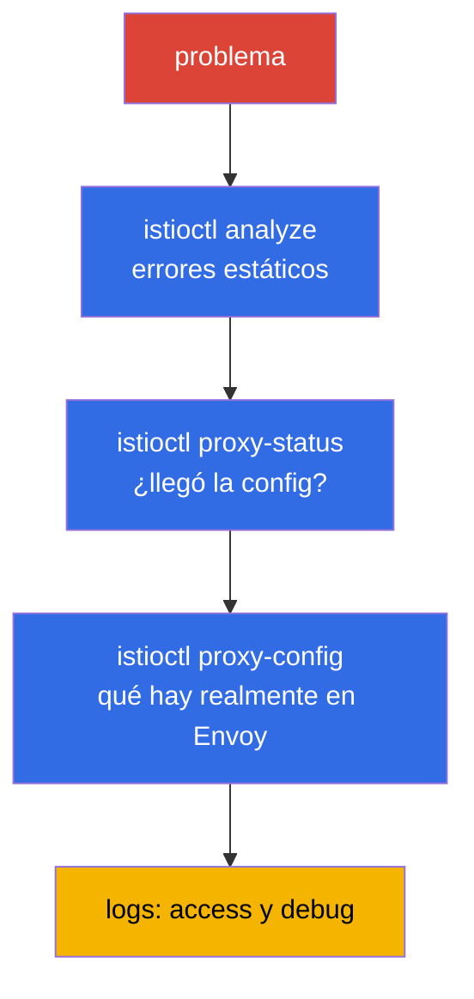

[RU version](ru.md) · [Eng version](en.md) · [Version française](fr.md) · [Deutsche Version](de.md)

# Capítulo 24. Troubleshooting de Istio

> **Qué sigue.** Este es el capítulo de cierre de la Parte 1 y un dominio aparte del examen ICA. Cuando
> algo en la malla no funciona (el tráfico no fluye, devuelve 503, la aplicación es inalcanzable),
> necesitas encontrar la causa rápido. En este capítulo reunimos las herramientas y un enfoque
> sistemático para diagnosticar Istio: `istioctl analyze`, `proxy-status`, `proxy-config`, logs.

## 24.1. El principio principal: casi siempre es la configuración

La inmensa mayoría de los problemas en Istio son un **data plane mal configurado**: una errata en el
nombre de un subset, un desajuste de selector de un Gateway, inyección olvidada, un conflicto de
políticas. Con menos frecuencia, problemas de la propia aplicación o de la infraestructura.

De ahí el enfoque sistemático: ir de lo general a lo específico, capa por capa.



Repasemos cada herramienta.

## 24.2. istioctl analyze: análisis estático

`istioctl analyze` es lo primero que vale la pena ejecutar. Comprueba la configuración **antes** y
**sin** enviar tráfico: encuentra problemas típicos (inyección faltante, referencias rotas a un
subset/gateway, conflictos de políticas, hosts incorrectos).

```bash
istioctl analyze -n app
```

Emite avisos y errores con una descripción clara y a menudo apunta directamente a la causa. Es una
comprobación barata para empezar: atrapa la mayor parte de los errores de configuración incluso antes
del diagnóstico profundo.

## 24.3. istioctl proxy-status: ¿llegó la config?

La siguiente pregunta: ¿tu configuración se ha aplicado realmente en el proxy? istiod la distribuye por
xDS (capítulo 4), y eso no es instantáneo. `istioctl proxy-status` muestra el estado de sincronización
de cada Envoy con istiod:

```bash
istioctl proxy-status
```

Cada proxy debería estar en el estado `SYNCED`. Si ves `STALE`, la config no llegó: istiod puede estar
sobrecargado, puede haber un error de configuración o problemas de conectividad. Hasta que un proxy esté
`SYNCED`, no tiene sentido buscar la causa en las reglas: aún no se han aplicado.

## 24.4. istioctl proxy-config: qué hay realmente en Envoy

Si analyze está limpio y el proxy está SYNCED, pero el tráfico aún va por donde no debe, mira qué hay
**realmente** en la configuración de un Envoy concreto. Aquí entran en juego los conceptos del capítulo
4: listeners, routes, clusters, endpoints.

```bash
istioctl proxy-config listeners <pod> -n app   # en qué puertos escucha
istioctl proxy-config routes    <pod> -n app   # reglas de enrutamiento
istioctl proxy-config clusters  <pod> -n app   # servicios de destino y subsets
istioctl proxy-config endpoints <pod> -n app   # las IPs reales de los pods
```

Un escenario típico: un `VirtualService` referencia `subset: v2`, pero ese subset no está en
`clusters`, lo que significa que la `DestinationRule` no lo describe o los nombres no coinciden. O
`endpoints` no tiene ninguna dirección, lo que significa que no hay pods sanos detrás del servicio.

Otro comando útil es `istioctl x describe pod <pod>`: explica en lenguaje llano qué políticas y rutas
afectan a un pod concreto.

## 24.5. Logs: access y debug

Cuando la configuración es correcta pero las peticiones aún fallan, ayudan los logs.

**Los access logs de Envoy** muestran cada petición: el código de respuesta, la duración y, lo más
importante, los **response flags**: un código corto que te dice de inmediato en qué etapa se rompió
todo. Los access logs se habilitan vía la Telemetry API (capítulo 18); aquí está el recurso completo que
los habilita para toda la malla:

```yaml
apiVersion: telemetry.istio.io/v1
kind: Telemetry
metadata:
  name: mesh-access-logs
  namespace: istio-system        # el namespace de istiod -> aplica a toda la malla
spec:
  accessLogging:
    - providers:
        - name: envoy             # el proveedor de logs a stdout integrado de Envoy
```

Después, los logs de un pod concreto se leen directamente con `kubectl` desde el contenedor
`istio-proxy`:

```bash
kubectl logs <pod> -n app -c istio-proxy
```

Los response flags son la razón entera de mirar los access logs. Los más comunes:

| Flag  | Significado                                                    | Dónde escarbar                                 |
|-------|---------------------------------------------------------------|------------------------------------------------|
| `UH`  | no healthy upstream - no hay pods de destino sanos            | `proxy-config endpoints`, readiness del pod    |
| `NR`  | no route - no se encontró ninguna ruta que coincidiera        | host en `VirtualService`, `selector` del Gateway |
| `UF`  | upstream connection failure - no se pudo conectar             | desajuste de mTLS, red, `PeerAuthentication`   |
| `UC`  | upstream connection termination - el upstream cortó la conexión | app cayendo, keep-alive, timeout             |
| `UO`  | upstream overflow - saltó el circuit breaker                  | límites del pool en la `DestinationRule` (capítulo 10) |
| `URX` | se alcanzó el límite de reintentos                            | la política de `retries`, resiliencia del upstream |
| `UT`  | upstream request timeout                                      | `timeout` en el `VirtualService`, backend lento |
| `DC`  | downstream connection termination - el cliente se cayó        | timeouts del cliente, el LB delante de la malla |

**Los debug logs del proxy**: para una depuración profunda puedes subir el nivel de log de Envoy:

```bash
istioctl proxy-config log <pod> -n app --level debug
```

Mira también los logs de istiod: muestran errores de aplicación de configuración (por ejemplo, un
EnvoyFilter rechazado).

## 24.6. Acceso directo a Envoy: config_dump y la interfaz admin

A veces los resúmenes de `proxy-config` no bastan y necesitas ver la config cruda de Envoy al completo.
A cualquier comando `proxy-config` se le puede pedir que devuelva JSON, el mismo formato que Envoy
recibe por xDS:

```bash
istioctl proxy-config all <pod> -n app -o json > dump.json
```

Aún más cerca del metal está la interfaz admin de Envoy en el puerto `15000`. Reenvíala y pega a los
endpoints directamente:

```bash
kubectl port-forward <pod> -n app 15000:15000
# luego en otra ventana:
curl localhost:15000/config_dump   # el dump completo de la configuración xDS
curl localhost:15000/clusters      # el estado de los clusters y la salud de los endpoints
curl localhost:15000/stats         # los contadores de Envoy (peticiones, errores, reintentos)
curl localhost:15000/certs         # los certificados TLS cargados
```

Por separado, es útil comprobar los certificados mTLS: si dudas de si el proxy recibió siquiera un leaf
cert funcional de istiod (capítulos 4 y 16), pregúntaselo directamente:

```bash
istioctl proxy-config secret <pod> -n app
```

El comando muestra si hay un `default` (el leaf cert de la carga) y un `ROOTCA`, y hasta cuándo son
válidos. Un secret vacío o caducado es una causa directa de errores de establecimiento de mTLS.

## 24.7. Problemas típicos

Una pequeña referencia "síntoma - causa probable".

- **Pod `1/1` en lugar de `2/2`.** La inyección no ocurrió: no hay etiqueta en el namespace o el pod se
  creó antes de ella (capítulos 2, 4). Se arregla con una etiqueta + `rollout restart`.
- **503, flag `UH` (no healthy upstream).** No hay pods sanos detrás del servicio, o el
  `VirtualService` envía a un subset inexistente, o saltó el circuit breaker. Mira `proxy-config
  endpoints` y `clusters`.
- **503 al arrancar el pod o durante un rollout.** Una carrera en el orden de arranque: el contenedor
  de la aplicación logró empezar a enviar/aceptar tráfico antes de que Envoy levantara, o, al revés, en
  la terminación el pod mató la aplicación mientras el proxy aún sostenía conexiones. Se arregla con dos
  ajustes: `holdApplicationUntilProxyStarts` (la aplicación no arranca hasta que el proxy esté listo) y
  un graceful shutdown del proxy (`EXIT_ON_ZERO_ACTIVE_CONNECTIONS` + un `preStop`/
  `terminationGracePeriodSeconds` adecuado). Esta es la causa clásica de un pico de 503 específicamente
  durante un `rolling update`.
- **503 con el flag `UC`/`UO`.** `UC`: el upstream cortó la conexión (la app está cayendo, los timeouts
  de keep-alive de la malla y del backend divergieron). `UO`: saltó el circuit breaker: se superaron los
  límites del pool de conexiones/peticiones de la `DestinationRule` (capítulo 10). Son causas distintas,
  y el flag las separa de inmediato.
- **503 justo después de habilitar el mTLS STRICT.** Un clásico: un lado envía texto plano (sin
  sidecar), el otro exige mTLS. Comprueba la PeerAuthentication y si el cliente tiene un sidecar
  (capítulo 13).
- **Pods en CrashLoop tras habilitar la malla.** Una causa común: los probes HTTP
  (liveness/readiness) fallan bajo mTLS STRICT porque `rewriteAppHTTPProbers` está deshabilitado.
  Comprueba los probes y la anotación `sidecar.istio.io/rewriteAppHTTPProbers` (capítulo 13).
- **404, flag `NR` (no route).** No hay ruta que coincida: un desajuste de host en el `VirtualService`,
  un `selector` de Gateway erróneo, `mesh` olvidado en `gateways` para el tráfico interno (capítulo 5).
- **Proxy `STALE`.** La config no se sincronizó; mira la carga y los logs de istiod.
- **Los cambios no se aplican.** Puede que una política más restrictiva esté en conflicto, o que el
  recurso esté en el namespace equivocado. Ejecuta `analyze` y `x describe`.

## 24.8. Troubleshooting en EKS/AWS

Algunos problemas surgen no dentro de la malla sino en la frontera entre Istio y la infraestructura de
AWS. Estos casos no los atrapan `analyze` ni `proxy-config`; hay que conocerlos por separado.

- **Los health checks del ALB/NLB fallan tras habilitar la malla.** El AWS Load Balancer Controller
  registra pods como targets y envía el health check directamente al pod. Si el mTLS STRICT está
  activado mientras el check va como HTTP en texto plano, el proxy lo rechaza → los targets se vuelven
  `unhealthy` → el balanceador devuelve 503, aunque dentro de la malla todo esté "verde". Soluciones:
  habilitar `rewriteAppHTTPProbers` (Istio reescribe los probes HTTP al puerto 15021 del pilot-agent), o
  apuntar el health check a un puerto excluido de la interceptación, o poner un ingress gateway delante
  de la aplicación y comprobarlo a él. La salud del ingress gateway es visible en su `/healthz/ready`
  (puerto 15021).

- **La inyección "silenciosamente" no ocurre: el webhook está bloqueado.** istiod acepta llamadas del
  mutating webhook en el puerto `15017`. En EKS el tráfico del control plane hacia los pods de istiod va
  a través del security group de los nodos; si el puerto `15017` está cerrado, el API server no puede
  invocar el webhook: los pods se crean **sin** un sidecar (o se quedan atascados, si
  failurePolicy=Fail). El síntoma "pods `1/1`, la etiqueta del namespace está presente": comprueba los
  security groups y la alcanzabilidad del servicio `istiod` en 15017.

- **IRSA / metadata se rompe por la interceptación.** Por defecto el sidecar intercepta todo el tráfico
  saliente, incluidas las llamadas al endpoint de metadata `169.254.169.254`. Para los pods que toman
  credenciales de AWS vía IMDS esto rompe la obtención de rol. Excluye la dirección de la interceptación
  con una anotación en el pod:

  ```yaml
  metadata:
    annotations:
      traffic.sidecar.istio.io/excludeOutboundIPRanges: "169.254.169.254/32"
  ```

  IRSA vía un projected token va al endpoint regional de STS (una llamada HTTPS externa corriente que
  pasa por passthrough), pero los SDK a menudo aún sondean IMDS, así que ante errores "inexplicables" de
  acceso a AWS, comprueba primero la interceptación de metadata.

- **istio-cni y el orden con el VPC CNI.** En EKS el stack de red ya lo ocupa el Amazon VPC CNI. Al
  instalar istio-cni el orden de los init plugins importa, de lo contrario un pod puede arrancar antes de
  que las reglas de interceptación estén en su sitio, y el tráfico se saltará el proxy. Más en el
  capítulo 27.

## 24.9. Recopilar diagnósticos: istioctl bug-report

Cuando necesitas pasarle un problema a un colega o al soporte, o simplemente reunir todo de golpe para
el análisis, existe `istioctl bug-report`:

```bash
istioctl bug-report
```

El comando recopila un archivo con todos los diagnósticos de la malla: versiones, configuración, estados
de sincronización, logs de istiod y de los proxies, dumps de configuración de Envoy. Es un cómodo "un
botón" en lugar de ejecutar a mano una docena de comandos, especialmente al contactar con el soporte o
al investigar un incidente a posteriori.

> **Asistentes de IA y MCP.** Han aparecido servidores MCP (Model Context Protocol) experimentales que
> dan a un asistente de IA acceso a los diagnósticos de la malla: `istio-mcp-server` (un envoltorio de
> solo lectura sobre `proxy-config`/`proxy-status`/recursos de Istio), envoltorios universales sobre
> `kubectl`/`istioctl`, y el MCP dentro de Kiali. La idea es hacer preguntas sobre el estado de la malla
> en lenguaje natural, mientras el asistente reúne los hechos por sí mismo usando los mismos comandos de
> este capítulo. Son proyectos de la comunidad, no parte de Istio, y de madurez variable: **úsalos bajo
> tu propio riesgo** (se conectan a un clúster en vivo), pero como acelerador de la investigación de
> incidentes merecen un vistazo.

## 24.10. Un enfoque sistemático

Para no adivinar, sigue una checklist de lo general a lo específico:

1. **`istioctl analyze`**: ¿hay errores estáticos de configuración?
2. **¿Pods `2/2`?** ¿Ocurrió la inyección?
3. **`istioctl proxy-status`**: ¿están todos los proxies `SYNCED`?
4. **`istioctl proxy-config`**: qué hay realmente en Envoy (routes, clusters, endpoints).
5. **`istioctl x describe pod`**: qué políticas afectan al pod.
6. **Access logs**: ¿qué código de respuesta y qué flag?
7. **Debug logs**: si todo lo anterior está limpio, escarbamos más hondo.

Ese orden ahorra tiempo: la mayoría de los problemas se cortan en los tres primeros pasos, sin llegar a
leer los debug logs.

## 24.11. Troubleshooting en ambient

Todo lo anterior está descrito para el modo sidecar. En ambient (capítulo 22) no hay sidecars, así que
algunas de las herramientas funcionan de forma distinta; hay que tenerlo en cuenta.

La diferencia principal: el pod de la aplicación **no tiene su propio Envoy**, así que `istioctl
proxy-config <app-pod>` es inútil para él. Los diagnósticos van a través de otros dos componentes:
ztunnel (L4) y waypoint (L7).

- **Comprueba que el pod está en ambient siquiera.** El namespace debe estar etiquetado
  `istio.io/dataplane-mode=ambient`, y el pod no debe tener un sidecar. Para ver qué cargas ve ztunnel:

  ```bash
  istioctl ztunnel-config workloads
  istioctl ztunnel-config services
  ```

- **Logs de ztunnel.** ztunnel es un DaemonSet en `istio-system`. Los diagnósticos de tráfico L4 y mTLS
  van a través de los logs de ztunnel en **el nodo** donde vive el pod:

  ```bash
  kubectl logs -n istio-system ds/ztunnel
  ```

- **Un waypoint es un Envoy.** Si el problema está en L7 (enrutamiento, autorización L7), se diagnostica
  en el waypoint como en un proxy corriente, vía el familiar `proxy-config`:

  ```bash
  istioctl proxy-config all <waypoint-pod> -n app
  ```

- **`istioctl proxy-status`** también funciona en ambient y muestra ztunnel y waypoint: si están
  sincronizados.

El error específico de ambient más común: **una política L7 no surte efecto porque no hay waypoint.**
Recuerda del capítulo 22 que ztunnel trabaja solo en L4. Si tu `AuthorizationPolicy` con reglas HTTP
(métodos, rutas) "no hace nada", comprueba que hay un waypoint desplegado para el servicio y que la
etiqueta `istio.io/use-waypoint` está puesta. Sin un waypoint sencillamente no hay nadie que aplique las
reglas L7.

## 24.12. Buenas prácticas

- **`istioctl analyze` en CI.** Ejecútalo sobre los manifiestos en el pipeline antes de aplicar; la
  mayoría de los errores de configuración se atrapan incluso antes de que lleguen al clúster.
- **Access logs con flags habilitados por defecto.** Un recurso `Telemetry` para toda la malla (ver
  24.5) es barato, y en el momento de un incidente un response flag ahorra horas de adivinanzas.
- **`istioctl x precheck` antes de una actualización.** Comprueba la preparación del clúster para
  instalar o actualizar Istio y avisa de incompatibilidades por adelantado.
- **Kiali como triage rápido.** El grafo de servicios resalta exactamente dónde se rompe el tráfico y
  qué recursos entran en conflicto, a menudo más rápido que leer logs a mano.
- **Ve estrictamente por capas.** No saltes directamente a los debug logs: `analyze` → `proxy-status` →
  `proxy-config` → access logs cortan el problema en el paso más barato.
- **Recopila un `bug-report` para los casos difíciles**: un único archivo en lugar de una docena de
  comandos dispersos, útil tanto para el soporte como para una investigación post-mortem.

## 24.13. Resumen del capítulo

- Casi todos los problemas de Istio son un data plane mal configurado; el diagnóstico se hace de lo
  general a lo específico.
- **`istioctl analyze`**: análisis estático de la configuración, atrapa errores típicos antes del
  tráfico; empieza por él.
- **`istioctl proxy-status`**: la sincronización de los proxies con istiod (`SYNCED`/`STALE`); hasta que
  esté `SYNCED`, la configuración no se ha aplicado.
- **`istioctl proxy-config`** (listeners/routes/clusters/endpoints): qué hay realmente en Envoy; aquí
  encuentras desajustes de subset, endpoints faltantes, etc.
- **`istioctl x describe pod`** explica qué políticas afectan a un pod.
- **Access logs** (códigos y flags como `UH`, `NR`, `UC`, `UO`) y **debug logs** del proxy: para los
  casos en que la configuración es correcta pero las peticiones fallan; el response flag apunta a la
  etapa del fallo de inmediato.
- Para un análisis profundo hay acceso directo a Envoy: `proxy-config ... -o json`, la interfaz admin en
  el puerto `15000` (`/config_dump`, `/clusters`, `/stats`, `/certs`) y `proxy-config secret` para
  comprobar los certificados mTLS.
- Ayuda conocer las combinaciones típicas: `1/1` (inyección), `503 UH` (sin upstream/subset), `503`
  tras STRICT (desajuste de mTLS), `503` durante un rollout (una carrera de arranque del proxy →
  `holdApplicationUntilProxyStarts`), `404 NR` (sin route/selector/mesh).
- En EKS/AWS hay una clase aparte de problemas: los health checks del ALB/NLB contra el mTLS STRICT, el
  puerto de webhook `15017` cerrado (la inyección no ocurre), la interceptación de la metadata
  `169.254.169.254` (rompe IRSA/IMDS), el orden de istio-cni con el VPC CNI.
- `istioctl bug-report` recopila todos los diagnósticos de la malla en un único archivo.
- En ambient los diagnósticos son distintos: un pod no tiene su propio Envoy; miras ztunnel (`istioctl
  ztunnel-config`, los logs del DaemonSet) para L4 y el waypoint (`proxy-config`) para L7. Un error
  común: una política L7 no funciona porque no hay un waypoint desplegado.

## 24.14. Preguntas de autoevaluación

1. ¿Por qué el diagnóstico de Istio parte de la suposición de un error de configuración?
2. ¿Qué comprueba `istioctl analyze` y por qué vale la pena empezar por él?
3. ¿Qué significa el estado `STALE` en `proxy-status` y qué te dice?
4. ¿Cómo usas `proxy-config` para encontrar una referencia a un subset inexistente?
5. ¿Qué indican un `503` con el flag `UH` y un `503` justo después de habilitar el mTLS STRICT? ¿En qué
   se diferencian de ellos los flags `UC` y `UO`?
6. ¿Por qué los 503 a menudo se disparan específicamente durante un `rolling update` y qué ajustes lo
   arreglan?
7. ¿Cómo ves la config cruda de Envoy y compruebas que el proxy recibió un certificado mTLS?
8. ¿Por qué los targets del ALB/NLB pueden volverse `unhealthy` tras habilitar el mTLS STRICT y cómo lo
   arreglas?
9. ¿Qué puede romper la obtención de rol de AWS (IRSA/IMDS) en un pod con un sidecar?
10. Describe el orden sistemático del diagnóstico de lo general a lo específico.
11. ¿En qué se diferencian los diagnósticos en ambient de los de sidecar? ¿Dónde buscas los problemas L4
    y L7 y por qué una política L7 podría no surtir efecto?

## Práctica

Se te dará un entorno roto; encuentra y arregla los errores de configuración usando `istioctl analyze`,
`proxy-status` y `proxy-config`:

🧪 Laboratorio 12: [tasks/ica/labs/12](../../labs/12/README_ES.MD)

---
[Índice](../README_ES.md) · [Capítulo 23](../23/es.md) · [Capítulo 25](../25/es.md)
