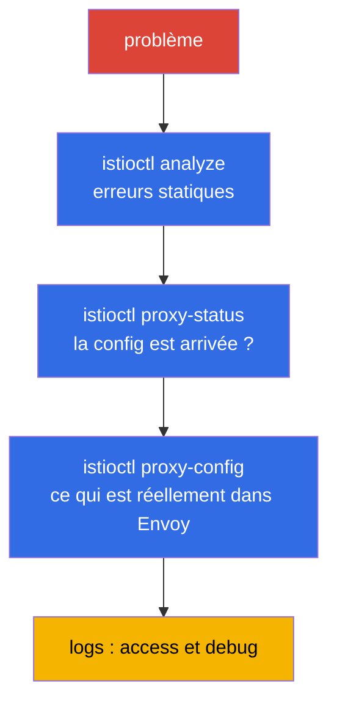

[RU version](ru.md) · [Eng version](en.md) · [Versión en español](es.md) · [Deutsche Version](de.md)

# Chapitre 24. Troubleshooting d'Istio

> **La suite.** C'est le chapitre de clôture de la Partie 1 et un domaine à part entière de
> l'examen ICA. Quand quelque chose dans le maillage ne fonctionne pas - le trafic ne passe
> pas, ça crache des 503, l'application est inaccessible - il faut trouver la cause vite. Dans
> ce chapitre, nous rassemblerons les outils et une approche systématique du diagnostic
> d'Istio : `istioctl analyze`, `proxy-status`, `proxy-config`, les logs.

## 24.1. Principe premier : c'est presque toujours la configuration qui est en cause

La grande majorité des problèmes dans Istio sont une **mauvaise configuration du data plane** :
une faute de frappe dans le nom d'un subset, un selector de Gateway qui ne correspond pas, une
injection oubliée, un conflit de politiques. Plus rarement - des problèmes de l'application
elle-même ou de l'infrastructure.

D'où une approche systématique : aller du général au particulier, par couches.



Examinons chaque outil.

## 24.2. istioctl analyze : analyse statique

`istioctl analyze` est la première chose à lancer. Il vérifie la configuration **avant** et
**sans** envoyer de trafic : il trouve les problèmes typiques - absence d'injection, références
cassées vers un subset/gateway, conflits de politiques, hôtes incorrects.

```bash
istioctl analyze -n app
```

Il produit des avertissements et des erreurs avec une description claire et pointe souvent
directement la cause. C'est une vérification bon marché par laquelle il faut commencer - elle
attrape la part du lion des erreurs de configuration avant même le diagnostic approfondi.

## 24.3. istioctl proxy-status : la config est-elle arrivée

Question suivante : votre configuration s'est-elle appliquée sur les proxys ? istiod la diffuse
par xDS (chapitre 4), et ce n'est pas instantané. `istioctl proxy-status` montre l'état de
synchronisation de tous les Envoy avec istiod :

```bash
istioctl proxy-status
```

Chaque proxy doit être dans l'état `SYNCED`. Si vous voyez `STALE` - la config n'est pas arrivée :
istiod est peut-être surchargé, il y a une erreur dans la configuration ou des problèmes de
communication. Tant qu'un proxy n'est pas `SYNCED`, il est inutile de chercher la cause dans les
règles - elles ne se sont pas encore appliquées.

## 24.4. istioctl proxy-config : ce qui est réellement dans Envoy

Si analyze est propre et que les proxys sont SYNCED, mais que le trafic va quand même au mauvais
endroit - regardons ce qui est **réellement** dans la configuration d'un Envoy précis. Ici entre
en jeu l'ensemble de notions du chapitre 4 : listeners, routes, clusters, endpoints.

```bash
istioctl proxy-config listeners <pod> -n app   # quels ports il écoute
istioctl proxy-config routes    <pod> -n app   # règles de routage
istioctl proxy-config clusters  <pod> -n app   # services de destination et subsets
istioctl proxy-config endpoints <pod> -n app   # IP réelles des pods
```

Scénario typique : un `VirtualService` référence `subset: v2`, mais dans `clusters` ce subset est
absent - donc la `DestinationRule` ne le décrit pas ou les noms ne correspondent pas. Ou bien dans
`endpoints` il n'y a aucune adresse - donc il n'y a pas de pods sains derrière le service.

Autre commande utile - `istioctl x describe pod <pod>` : elle explique en langage humain quelles
politiques et quels routes influencent un pod précis.

## 24.5. Logs : access et debug

Quand la configuration est correcte, mais que les requêtes échouent quand même, les logs aident.

**Les access-logs d'Envoy** montrent chaque requête : le code de réponse, la durée et, surtout,
les **response flags** — un code court qui dit tout de suite à quelle étape tout a cassé. Les
access-logs s'activent via la Telemetry API (chapitre 18) — voici la ressource complète qui les
active pour toute la cellule du maillage :

```yaml
apiVersion: telemetry.istio.io/v1
kind: Telemetry
metadata:
  name: mesh-access-logs
  namespace: istio-system        # namespace d'istiod -> agit sur tout le mesh
spec:
  accessLogging:
    - providers:
        - name: envoy             # fournisseur intégré de logs stdout d'Envoy
```

Ensuite, les logs d'un pod précis se lisent directement via `kubectl` depuis le conteneur
`istio-proxy` :

```bash
kubectl logs <pod> -n app -c istio-proxy
```

Les response flags — voilà pourquoi on regarde les access-logs. Les plus fréquents :

| Flag  | Signification                                             | Où creuser                                  |
|-------|-----------------------------------------------------------|---------------------------------------------|
| `UH`  | no healthy upstream — pas de pods de destination sains    | `proxy-config endpoints`, readiness des pods |
| `NR`  | no route — aucun route trouvé                             | l'hôte dans `VirtualService`, `selector` du Gateway |
| `UF`  | upstream connection failure — échec de connexion          | mTLS mismatch, réseau, `PeerAuthentication`  |
| `UC`  | upstream connection termination — l'upstream a coupé la connexion | l'application tombe, keep-alive, timeout |
| `UO`  | upstream overflow — circuit breaker déclenché             | limites du pool dans `DestinationRule` (chapitre 10) |
| `URX` | limite de retries atteinte                                | politique `retries`, résilience de l'upstream |
| `UT`  | upstream request timeout                                  | `timeout` dans `VirtualService`, backend lent |
| `DC`  | downstream connection termination — le client a décroché  | timeouts du client, LB devant le maillage    |

**Les debug-logs du proxy** — pour un débogage approfondi, on peut monter le niveau de
journalisation d'Envoy :

```bash
istioctl proxy-config log <pod> -n app --level debug
```

Regardez aussi les logs d'istiod - on y voit les erreurs d'application de la configuration (par
exemple, un EnvoyFilter rejeté).

## 24.6. Accès direct à Envoy : config_dump et l'admin

Parfois les résumés de `proxy-config` ne suffisent pas et il faut voir la config brute d'Envoy en
entier. On peut demander à n'importe quelle commande `proxy-config` de renvoyer du JSON — c'est le
même format qu'Envoy diffuse par xDS :

```bash
istioctl proxy-config all <pod> -n app -o json > dump.json
```

Encore plus près du « métal » — l'interface d'administration d'Envoy sur le port `15000`. On la
forwarde et on interroge les endpoints directement :

```bash
kubectl port-forward <pod> -n app 15000:15000
# puis dans une autre fenêtre :
curl localhost:15000/config_dump   # dump complet de la configuration xDS
curl localhost:15000/clusters      # état des clusters et santé des endpoints
curl localhost:15000/stats         # compteurs Envoy (requêtes, erreurs, retries)
curl localhost:15000/certs         # certificats TLS chargés
```

La vérification des certificats mTLS est particulièrement utile : si vous doutez que le proxy ait
bien reçu un certificat feuille fonctionnel d'istiod (chapitres 4 et 16), demandez-le-lui
directement :

```bash
istioctl proxy-config secret <pod> -n app
```

La commande montrera s'il y a un `default` (certificat feuille du workload) et un `ROOTCA`, et
jusqu'à quelle date ils sont valides. Un secret vide ou expiré est une cause directe des erreurs
d'établissement du mTLS.

## 24.7. Problèmes typiques

Un petit répertoire « symptôme - cause probable ».

- **Pod `1/1` au lieu de `2/2`.** L'injection n'a pas fonctionné : pas de label sur le namespace
  ou pod créé avant lui (chapitres 2, 4). Se soigne avec le label + `rollout restart`.
- **503, flag `UH` (no healthy upstream).** Pas de pods sains derrière le service, ou le
  `VirtualService` envoie vers un subset inexistant, ou le circuit breaker s'est déclenché.
  Regardez `proxy-config endpoints` et `clusters`.
- **503 au démarrage du pod ou pendant un déploiement.** Course dans l'ordre de démarrage : le
  conteneur de l'application a commencé à envoyer/recevoir du trafic avant qu'Envoy ne soit monté,
  — ou l'inverse, à l'arrêt le pod a tué l'application alors que le proxy tenait encore des
  connexions. Se soigne avec deux réglages : `holdApplicationUntilProxyStarts` (l'application ne
  démarre pas tant que le proxy n'est pas prêt) et le graceful-shutdown du proxy
  (`EXIT_ON_ZERO_ACTIVE_CONNECTIONS` + un `preStop`/`terminationGracePeriodSeconds` adéquat). Cause
  classique du pic de 503 justement pendant un `rolling update`.
- **503 avec le flag `UC`/`UO`.** `UC` — l'upstream a coupé la connexion (l'application tombe, les
  timeouts keep-alive du maillage et du backend ont divergé). `UO` — le circuit breaker s'est
  déclenché : les limites du pool de connexions/requêtes de la `DestinationRule` (chapitre 10) sont
  dépassées. Ce sont des causes différentes, et le flag les distingue immédiatement.
- **503 juste après l'activation du mTLS STRICT.** Classique : un côté envoie du plaintext (pas de
  sidecar), l'autre exige du mTLS. Vérifiez PeerAuthentication et la présence d'un sidecar chez le
  client (chapitre 13).
- **Pods en CrashLoop après l'activation du maillage.** Cause fréquente - les probes HTTP
  (liveness/readiness) échouent en mTLS STRICT, parce que `rewriteAppHTTPProbers` est désactivé.
  Vérifiez les probes et l'annotation `sidecar.istio.io/rewriteAppHTTPProbers` (chapitre 13).
- **404, flag `NR` (no route).** Pas de route adéquat : hôte qui ne correspond pas dans le
  `VirtualService`, `selector` incorrect du Gateway, `mesh` oublié dans `gateways` pour le trafic
  interne (chapitre 5).
- **Proxy `STALE`.** La config ne s'est pas synchronisée - regardez la charge et les logs
  d'istiod.
- **Les changements ne s'appliquent pas.** Peut-être qu'une politique plus étroite entre en
  conflit, ou que la ressource est dans le mauvais namespace. Lancez `analyze` et `x describe`.

## 24.8. Troubleshooting sur EKS/AWS

Une partie des problèmes ne survient pas à l'intérieur du maillage, mais à la jonction d'Istio et
de l'infrastructure AWS. Ces cas ne sont pas attrapés par `analyze` et `proxy-config` — il faut
les connaître à part.

- **Les health-checks ALB/NLB échouent après l'activation du maillage.** L'AWS Load Balancer
  Controller enregistre les pods comme targets et envoie une vérification de santé directement dans
  le pod. Si le mTLS STRICT est activé et que la vérification arrive en HTTP plaintext ordinaire, le
  proxy la rejette → les targets deviennent `unhealthy` → le balancer renvoie des 503, alors qu'à
  l'intérieur du maillage tout est « vert ». Solutions : activer `rewriteAppHTTPProbers` (Istio
  réécrit les probes HTTP vers le port pilot-agent 15021), ou diriger le health-check vers un port
  exclu de l'interception, ou placer un ingress gateway devant l'application et le vérifier. La
  santé de l'ingress gateway est visible sur son `/healthz/ready` (port 15021).

- **L'injection ne se déclenche « silencieusement » pas — le webhook est bloqué.** istiod accepte
  les appels du mutating webhook sur le port `15017`. Sur EKS, le trafic du control plane vers les
  pods istiod passe par les security groups des nodes ; si le port `15017` est fermé, l'API server
  ne peut pas appeler le webhook — les pods sont créés **sans** sidecar (ou restent bloqués si
  failurePolicy=Fail). Symptôme « pods `1/1`, label présent sur le namespace » — vérifiez les
  security groups et l'accessibilité du service `istiod` sur 15017.

- **IRSA / metadata cassés par l'interception.** Par défaut, le sidecar intercepte tout le trafic
  sortant, y compris les appels à l'endpoint metadata `169.254.169.254`. Pour les pods qui
  récupèrent les credentials AWS via IMDS, cela casse l'obtention des rôles. Excluez l'adresse de
  l'interception avec une annotation sur le pod :

  ```yaml
  metadata:
    annotations:
      traffic.sidecar.istio.io/excludeOutboundIPRanges: "169.254.169.254/32"
  ```

  L'IRSA via projected-token va vers un endpoint STS régional (un HTTPS externe ordinaire qui passe
  en passthrough), mais les SDK tentent souvent quand même l'IMDS — donc, en cas d'erreurs
  « inexplicables » d'accès à AWS, vérifiez l'interception de la metadata en premier lieu.

- **istio-cni et l'ordre avec VPC CNI.** Sur EKS, la pile réseau est déjà occupée par Amazon VPC
  CNI. Lors de l'installation d'istio-cni, l'ordre des init-plugins est important, sinon le pod peut
  démarrer avant que les règles d'interception soient posées, et le trafic passera à côté du proxy.
  Plus de détails - au chapitre 27.

## 24.9. Collecte du diagnostic : istioctl bug-report

Quand il faut transmettre le problème à un collègue ou au support — ou simplement tout rassembler
d'un coup pour l'analyse — il y a `istioctl bug-report` :

```bash
istioctl bug-report
```

La commande collecte une archive avec tout le diagnostic du maillage : versions, configuration,
statuts de synchronisation, logs d'istiod et des proxys, dumps de configs Envoy. C'est un
pratique « bouton unique » à la place de la collecte manuelle d'une dizaine de commandes, surtout
lors d'une demande au support ou de l'analyse d'un incident a posteriori.

> **Assistants IA et MCP.** Sont apparus des serveurs MCP expérimentaux (Model Context Protocol)
> qui donnent à un assistant IA l'accès au diagnostic du maillage : `istio-mcp-server` (enveloppe
> read-only autour de `proxy-config`/`proxy-status`/des ressources Istio), des enveloppes
> universelles autour de `kubectl`/`istioctl` et le MCP intégré à Kiali. L'idée — poser des
> questions sur l'état du maillage en langage naturel, l'assistant collectant les faits lui-même
> via les mêmes commandes de ce chapitre. Ce sont des projets communautaires, pas une partie
> d'Istio, et de maturité variable — **à utiliser à vos risques et périls** (ils se connectent à
> un cluster vivant), mais comme accélérateur d'analyse d'incidents, cela vaut le coup d'œil.

## 24.10. Approche systématique

Pour ne pas deviner, suivez la checklist du général au particulier :

1. **`istioctl analyze`** - y a-t-il des erreurs statiques de configuration ?
2. **Pods `2/2` ?** L'injection a-t-elle fonctionné ?
3. **`istioctl proxy-status`** - tous les proxys sont-ils `SYNCED` ?
4. **`istioctl proxy-config`** - ce qui est réellement dans Envoy (routes, clusters, endpoints) ?
5. **`istioctl x describe pod`** - quelles politiques influencent le pod ?
6. **Access-logs** - quel code et quel response flag ?
7. **Debug-logs** - si tout ce qui précède est propre, on creuse plus profond.

Cet ordre fait gagner du temps : la plupart des problèmes sont écartés aux trois premières étapes,
sans aller jusqu'à la lecture des debug-logs.

## 24.11. Troubleshooting en ambient

Tout ce qui précède est décrit pour le mode sidecar. En ambient (chapitre 22), il n'y a pas de
sidecars, donc une partie des outils fonctionne différemment - il faut en tenir compte.

Différence principale : le pod de l'application **n'a pas son propre Envoy**, donc `istioctl
proxy-config <app-pod>` est inutile pour lui. Le diagnostic passe par deux autres composants -
ztunnel (L4) et waypoint (L7).

- **Vérifier que le pod est bien en ambient.** Le namespace doit être marqué
  `istio.io/dataplane-mode=ambient`, et le pod ne doit pas avoir de sidecar. Voir quelles charges
  ztunnel voit :

  ```bash
  istioctl ztunnel-config workloads
  istioctl ztunnel-config services
  ```

- **Logs de ztunnel.** ztunnel est un DaemonSet dans `istio-system`. Le diagnostic du trafic L4 et
  du mTLS passe par les logs de ztunnel sur **la node** où vit le pod :

  ```bash
  kubectl logs -n istio-system ds/ztunnel
  ```

- **Le waypoint est un Envoy.** Si le problème est en L7 (routage, autorisation L7), on le
  diagnostique sur le waypoint comme sur un proxy ordinaire - via le `proxy-config` habituel :

  ```bash
  istioctl proxy-config all <waypoint-pod> -n app
  ```

- **`istioctl proxy-status`** fonctionne aussi en ambient et montre ztunnel et waypoint - sont-ils
  synchronisés.

L'erreur la plus fréquente spécifique à l'ambient : **une politique L7 ne se déclenche pas parce
qu'il n'y a pas de waypoint**. Souvenez-vous du chapitre 22 - ztunnel travaille uniquement en L4.
Si votre `AuthorizationPolicy` avec des règles HTTP (méthodes, chemins) « n'agit pas », vérifiez
qu'un waypoint est déployé pour le service et que le label `istio.io/use-waypoint` est présent.
Sans waypoint, il n'y a tout simplement personne pour appliquer les règles L7.

## 24.12. Best practices

- **`istioctl analyze` en CI.** Lancez-le sur les manifests dans le pipeline avant application —
  la plupart des erreurs de configuration s'attrapent avant même l'arrivée dans le cluster.
- **Access-logs avec flags activés par défaut.** Une ressource `Telemetry` unique pour tout le
  maillage (voir 24.5) coûte peu, et au moment d'un incident le response flag fait gagner des
  heures de conjectures.
- **`istioctl x precheck` avant une montée de version.** Vérifie la préparation du cluster à
  l'installation ou la mise à jour d'Istio et prévient à l'avance des incompatibilités.
- **Kiali pour un triage rapide.** Le graphe des services met en évidence où exactement le trafic
  se rompt et quelles ressources entrent en conflit — c'est souvent plus rapide que de lire les
  logs à la main.
- **Allez strictement par couches.** Ne sautez pas directement dans les debug-logs : `analyze` →
  `proxy-status` → `proxy-config` → access-logs écartent le problème à l'étape la moins coûteuse.
- **Collectez un `bug-report` pour les cas complexes** — une archive unique à la place d'une
  dizaine de commandes éparses, pratique à la fois pour le support et pour l'analyse a posteriori.

## 24.13. Résumé du chapitre

- Presque tous les problèmes d'Istio sont une mauvaise configuration du data plane ; on mène le
  diagnostic du général au particulier.
- **`istioctl analyze`** - analyse statique de la configuration, attrape les erreurs typiques
  avant le trafic ; on commence par elle.
- **`istioctl proxy-status`** - synchronisation des proxys avec istiod (`SYNCED`/`STALE`) ; tant
  que ce n'est pas `SYNCED`, la configuration ne s'est pas appliquée.
- **`istioctl proxy-config`** (listeners/routes/clusters/endpoints) - ce qui est réellement dans
  Envoy ; c'est là qu'on trouve les non-correspondances de subset, l'absence d'endpoints, etc.
- **`istioctl x describe pod`** explique quelles politiques influencent le pod.
- **Les access-logs** (codes et flags comme `UH`, `NR`, `UC`, `UO`) et les **debug-logs** du proxy
  - pour les cas où la configuration est correcte, mais les requêtes échouent ; le response flag
  indique tout de suite l'étape de la panne.
- Pour une analyse approfondie, il y a l'accès direct à Envoy : `proxy-config ... -o json`,
  l'admin sur le port `15000` (`/config_dump`, `/clusters`, `/stats`, `/certs`) et
  `proxy-config secret` pour vérifier les certificats mTLS.
- Il est utile de connaître les associations typiques : `1/1` (injection), `503 UH` (pas
  d'upstream/subset), `503` après STRICT (mTLS mismatch), `503` au déploiement (course au démarrage
  du proxy → `holdApplicationUntilProxyStarts`), `404 NR` (pas de route/selector/mesh).
- Sur EKS/AWS, une classe de problèmes à part : health-checks ALB/NLB contre le mTLS STRICT, port
  webhook `15017` fermé (l'injection ne se déclenche pas), interception de la metadata
  `169.254.169.254` (casse IRSA/IMDS), ordre d'istio-cni avec VPC CNI.
- `istioctl bug-report` rassemble tout le diagnostic du maillage dans une seule archive.
- En ambient, le diagnostic est différent : le pod n'a pas son propre Envoy - on regarde ztunnel
  (`istioctl ztunnel-config`, logs du DaemonSet) pour le L4 et le waypoint (`proxy-config`) pour le
  L7. Erreur fréquente - une politique L7 ne fonctionne pas parce qu'aucun waypoint n'est déployé.

## 24.14. Questions d'auto-évaluation

1. Pourquoi commence-t-on le diagnostic d'Istio par l'hypothèse d'une erreur de configuration ?
2. Que vérifie `istioctl analyze` et pourquoi vaut-il la peine de commencer par lui ?
3. Que signifie le statut `STALE` dans `proxy-status` et de quoi témoigne-t-il ?
4. Comment, à l'aide de `proxy-config`, trouver une référence vers un subset inexistant ?
5. De quoi témoignent un `503` avec le flag `UH` et un `503` juste après l'activation du mTLS
   STRICT ? En quoi les flags `UC` et `UO` en diffèrent-ils ?
6. Pourquoi les 503 surgissent-ils souvent justement pendant un `rolling update` et quels réglages
   soignent cela ?
7. Comment voir la config brute d'Envoy et vérifier que le proxy a reçu un certificat mTLS ?
8. Pourquoi, après l'activation du mTLS STRICT, les targets ALB/NLB peuvent-elles devenir
   `unhealthy` et comment corriger cela ?
9. Qu'est-ce qui peut casser l'obtention des rôles AWS (IRSA/IMDS) dans un pod avec sidecar ?
10. Décrivez l'ordre systématique du diagnostic du général au particulier.
11. En quoi le diagnostic en ambient diffère-t-il du sidecar ? Où regarder pour les problèmes L4
    et L7 et pourquoi une politique L7 peut-elle ne pas se déclencher ?

## Pratique

On vous donnera un environnement cassé - trouvez et corrigez les erreurs de configuration à l'aide
d'`istioctl analyze`, `proxy-status` et `proxy-config` :

🧪 Lab 12 : [tasks/ica/labs/12](../../labs/12/README_FR.MD)

---
[Table des matières](../README_FR.md) · [Chapitre 23](../23/fr.md) · [Chapitre 25](../25/fr.md)
