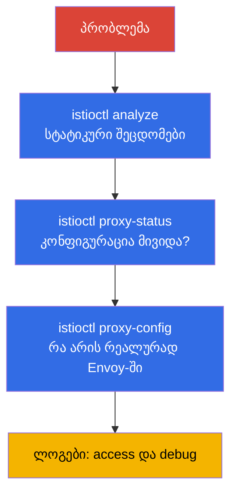

[Русская версия](ru.md) · [Eng version](en.md) · [Versión en español](es.md) · [Version française](fr.md) · [Deutsche Version](de.md) · [繁體中文版](tw.md) · [日本語版](jp.md)

# თავი 24. Istio-ს პრობლემების დიაგნოსტიკა

> **რა არის შემდეგ.** ეს არის ნაწილი 1-ის დასკვნითი თავი და ICA გამოცდის ცალკე დომენი. როდესაც
> mesh-ში რაღაც არ მუშაობს - ტრაფიკი არ გადის, 503 შეცდომები მოდის, აპლიკაცია მიუწვდომელია -
> მიზეზი სწრაფად უნდა იპოვოთ. ამ თავში გავაერთიანებთ Istio-ს დიაგნოსტიკის ინსტრუმენტებსა და
> სისტემურ მიდგომას: `istioctl analyze`, `proxy-status`, `proxy-config`, ლოგები.

## 24.1. მთავარი პრინციპი: თითქმის ყოველთვის კონფიგურაციაა დამნაშავე

Istio-ში პრობლემების აბსოლუტური უმრავლესობა **data plane-ის არასწორი კონფიგურაციაა**:
შეცდომა subset-ის სახელში, Gateway-ის selector-ის შეუსაბამობა, დავიწყებული ინექცია,
პოლიტიკების კონფლიქტი. უფრო იშვიათად პრობლემა თავად აპლიკაციაში ან ინფრასტრუქტურაშია.

აქედან გამომდინარეობს სისტემური მიდგომა: ფენების მიხედვით ზოგადიდან კონკრეტულისკენ წასვლა.



განვიხილოთ თითოეული ინსტრუმენტი.

## 24.2. istioctl analyze: სტატიკური ანალიზი

`istioctl analyze` - პირველი რამაა, რაც უნდა გაუშვათ. ის კონფიგურაციას ამოწმებს ტრაფიკის
გაგზავნამდე და **მის გარეშე**: პოულობს ტიპურ პრობლემებს - ინექციის არარსებობას, subset/gateway-ზე
გაფუჭებულ ბმულებს, პოლიტიკების კონფლიქტებსა და არასწორ ჰოსტებს.

```bash
istioctl analyze -n app
```

ის გასცემს გაფრთხილებებსა და შეცდომებს გასაგები აღწერით და ხშირად პირდაპირ მიუთითებს
მიზეზზე. ეს იაფი შემოწმებაა, რომლითაც დაწყებაა საჭირო - ის კონფიგურაციის შეცდომების უდიდეს
ნაწილს ღრმა დიაგნოსტიკამდე პოულობს.

## 24.3. istioctl proxy-status: მივიდა თუ არა კონფიგურაცია

შემდეგი კითხვა: გავრცელდა თუ არა თქვენი კონფიგურაცია პროქსიზე? istiod მას xDS-ის საშუალებით
ავრცელებს (თავი 4) და ეს მყისიერად არ ხდება. `istioctl proxy-status` აჩვენებს ყველა Envoy-ის
istiod-თან სინქრონიზაციის მდგომარეობას:

```bash
istioctl proxy-status
```

თითოეული პროქსი `SYNCED` მდგომარეობაში უნდა იყოს. თუ ხედავთ `STALE`-ს - კონფიგურაცია არ
მისულა: შესაძლოა, istiod გადატვირთულია, კონფიგურაციაში შეცდომაა ან კავშირის პრობლემებია.
სანამ პროქსი `SYNCED` არ არის, წესებში მიზეზის ძებნას აზრი არ აქვს - ისინი ჯერ არ გამოყენებულა.

## 24.4. istioctl proxy-config: რა არის რეალურად Envoy-ში

თუ analyze სუფთაა და პროქსი SYNCED-ია, მაგრამ ტრაფიკი მაინც არასწორი მიმართულებით მიდის -
ვნახოთ, რა არის **რეალურად** კონკრეტული Envoy-ის კონფიგურაციაში. აქ გამოიყენება მე-4 თავის
ცნებების ერთობლიობა: listeners, routes, clusters, endpoints.

```bash
istioctl proxy-config listeners <pod> -n app   # რომელ პორტებს უსმენს
istioctl proxy-config routes    <pod> -n app   # მარშრუტიზაციის წესები
istioctl proxy-config clusters  <pod> -n app   # დანიშნულების სერვისები და subsets
istioctl proxy-config endpoints <pod> -n app   # pod-ების რეალური IP-ები
```

ტიპური სცენარი: `VirtualService` მიუთითებს `subset: v2`-ზე, მაგრამ `clusters`-ში ასეთი
subset არ არის - ესე იგი, `DestinationRule` მას არ აღწერს ან სახელები არ ემთხვევა. ან
`endpoints`-ში არც ერთი მისამართი არ არის - ესე იგი, სერვისის უკან ჯანსაღი პოდები არ არის.

კიდევ ერთი სასარგებლო ბრძანებაა `istioctl x describe pod <pod>`: ის ადამიანისთვის გასაგებ
ენაზე განმარტავს, რომელი პოლიტიკები და მარშრუტები ახდენს გავლენას კონკრეტულ პოდზე.

## 24.5. ლოგები: access და debug

როდესაც კონფიგურაცია სწორია, მაგრამ მოთხოვნები მაინც წარუმატებელია, ლოგები დაგეხმარებათ.

**Envoy-ის Access-ლოგები** აჩვენებს თითოეულ მოთხოვნას: პასუხის კოდს, ხანგრძლივობას და,
რაც მთავარია, **პასუხის ალმებს** - მოკლე კოდს, რომელიც მაშინვე გეუბნებათ, რომელ ეტაპზე
გაფუჭდა ყველაფერი. Access-ლოგები Telemetry API-ის მეშვეობით ირთვება (თავი 18) - ქვემოთ
მოცემულია სრული რესურსი, რომელიც მათ მთელი mesh უჯრედისთვის რთავს:

```yaml
apiVersion: telemetry.istio.io/v1
kind: Telemetry
metadata:
  name: mesh-access-logs
  namespace: istio-system        # istiod-ის namespace -> მოქმედებს მთელ mesh-ზე
spec:
  accessLogging:
    - providers:
        - name: envoy             # Envoy-ს stdout-ლოგების ჩაშენებული პროვაიდერი
```

ამის შემდეგ კონკრეტული პოდის ლოგები პირდაპირ `kubectl`-ით, `istio-proxy` კონტეინერიდან
იკითხება:

```bash
kubectl logs <pod> -n app -c istio-proxy
```

პასუხის ალმები სწორედ ისაა, რის გამოც access-ლოგებს საერთოდ ათვალიერებენ. ყველაზე ხშირია:

| ალამი | მნიშვნელობა                                             | სად ვეძებოთ                                  |
|-------|------------------------------------------------------|----------------------------------------------|
| `UH`  | no healthy upstream - დანიშნულების ჯანსაღი პოდები არ არის | `proxy-config endpoints`, პოდების მზადყოფნა   |
| `NR`  | no route - მარშრუტი ვერ მოიძებნა                         | ჰოსტი `VirtualService`-ში, Gateway-ის `selector` |
| `UF`  | upstream connection failure - დაკავშირება ვერ მოხერხდა | mTLS mismatch, ქსელი, `PeerAuthentication`    |
| `UC`  | upstream connection termination - upstream-მა კავშირი გაწყვიტა | აპლიკაცია ითიშება, keep-alive, timeout |
| `UO`  | upstream overflow - circuit breaker ამოქმედდა         | პულის ლიმიტები `DestinationRule`-ში (თავი 10)   |
| `URX` | retry-ების ლიმიტი ამოიწურა                               | `retries` პოლიტიკა, upstream-ის მდგრადობა    |
| `UT`  | upstream request timeout                             | `timeout` `VirtualService`-ში, ნელი backend |
| `DC`  | downstream connection termination - კლიენტი გაითიშა  | კლიენტის timeout-ები, LB mesh-ის წინ              |

**პროქსის Debug-ლოგები** - ღრმა გამართვისთვის შეგიძლიათ Envoy-ის ლოგირების დონე გაზარდოთ:

```bash
istioctl proxy-config log <pod> -n app --level debug
```

ასევე ნახეთ istiod-ის ლოგები - იქ ჩანს კონფიგურაციის გამოყენების შეცდომები (მაგალითად,
უარყოფილი EnvoyFilter).

## 24.6. პირდაპირი წვდომა Envoy-ზე: config_dump და ადმინისტრაციული ინტერფეისი

ზოგჯერ `proxy-config`-ის შეჯამება საკმარისი არ არის და საჭიროა Envoy-ის სრული ნედლი
კონფიგურაციის ნახვა. ნებისმიერ `proxy-config` ბრძანებას შეიძლება JSON-ის დაბრუნება სთხოვოთ -
ეს იგივე ფორმატია, რომელსაც Envoy xDS-ის საშუალებით ავრცელებს:

```bash
istioctl proxy-config all <pod> -n app -o json > dump.json
```

კიდევ უფრო დაბალ დონეზეა Envoy-ის ადმინისტრაციული ინტერფეისი `15000` პორტზე. გადავამისამართოთ
პორტი და endpoint-ებს პირდაპირ მივმართოთ:

```bash
kubectl port-forward <pod> -n app 15000:15000
# შემდეგ სხვა ფანჯარაში:
curl localhost:15000/config_dump   # xDS-კონფიგურაციის სრული dump
curl localhost:15000/clusters      # კლასტერების მდგომარეობა და endpoints-ის ჯანმრთელობა
curl localhost:15000/stats         # Envoy-ს მთვლელები (მოთხოვნები, შეცდომები, რითრაები)
curl localhost:15000/certs         # ჩატვირთული TLS-სერტიფიკატები
```

ცალკე სასარგებლოა mTLS სერტიფიკატების შემოწმება: თუ ეჭვი გაქვთ, რომ პროქსიმ საერთოდ მიიღო
თუ არა istiod-ისგან მოქმედი leaf სერტიფიკატი (თავები 4 და 16), პირდაპირ ჰკითხეთ:

```bash
istioctl proxy-config secret <pod> -n app
```

ბრძანება აჩვენებს, არსებობს თუ არა `default` (workload-ის leaf სერტიფიკატი) და `ROOTCA`,
და რა ვადამდეა ისინი მოქმედი. ცარიელი ან ვადაგასული საიდუმლო mTLS კავშირის დამყარების
შეცდომების პირდაპირი მიზეზია.

## 24.7. ტიპური პრობლემები

მოკლე ცნობარი „სიმპტომი - სავარაუდო მიზეზი“.

- **პოდი `1/1`-ია `2/2`-ის ნაცვლად.** ინექცია არ შესრულდა: namespace-ზე label არ არის ან
  პოდი მის დამატებამდე შეიქმნა (თავები 2, 4). სწორდება label-ით + `rollout restart`.
- **503, ალამი `UH` (no healthy upstream).** სერვისის უკან ჯანსაღი პოდები არ არის,
  `VirtualService` არარსებულ subset-ზე აგზავნის, ან circuit breaker ამოქმედდა. ნახეთ
  `proxy-config endpoints` და `clusters`.
- **503 პოდის გაშვებისას ან rollout-ის დროს.** გაშვების თანმიმდევრობის რბოლა: აპლიკაციის
  კონტეინერმა ტრაფიკის გაგზავნა/მიღება Envoy-ის ამუშავებამდე დაიწყო - ან, პირიქით,
  პოდის დასრულებისას აპლიკაცია გაითიშა, სანამ პროქსის ჯერ კიდევ ჰქონდა აქტიური კავშირები.
  სწორდება ორი პარამეტრით: `holdApplicationUntilProxyStarts` (აპლიკაცია არ გაეშვება,
  სანამ პროქსი მზად არ იქნება) და პროქსის graceful-shutdown (`EXIT_ON_ZERO_ACTIVE_CONNECTIONS` +
  ადეკვატური `preStop`/`terminationGracePeriodSeconds`). ეს სწორედ `rolling update`-ის დროს
  503-ების მკვეთრი მატების კლასიკური მიზეზია.
- **503 `UC`/`UO` ალმით.** `UC` - upstream-მა კავშირი გაწყვიტა (აპლიკაცია ითიშება,
  mesh-ისა და backend-ის keep-alive timeout-ები აცდენილია). `UO` - circuit breaker ამოქმედდა:
  გადაჭარბებულია `DestinationRule`-ის კავშირების/მოთხოვნების პულის ლიმიტები (თავი 10). ეს
  სხვადასხვა მიზეზებია და ალამი მათ მაშინვე განასხვავებს.
- **503 STRICT mTLS-ის ჩართვისთანავე.** კლასიკური შემთხვევა: ერთი მხარე plaintext-ს აგზავნის
  (sidecar არ არის), მეორე კი mTLS-ს მოითხოვს. შეამოწმეთ PeerAuthentication და კლიენტთან
  sidecar-ის არსებობა (თავი 13).
- **mesh-ის ჩართვის შემდეგ პოდები CrashLoop-შია.** ხშირი მიზეზია STRICT mTLS-ის დროს
  HTTP-შემოწმებების (liveness/readiness) ჩავარდნა, რადგან `rewriteAppHTTPProbers` გამორთულია.
  შეამოწმეთ შემოწმებები და `sidecar.istio.io/rewriteAppHTTPProbers` ანოტაცია (თავი 13).
- **404, ალამი `NR` (no route).** შესაბამისი მარშრუტი არ არის: `VirtualService`-ში ჰოსტი
  არ ემთხვევა, Gateway-ს არასწორი `selector` აქვს, ან შიდა ტრაფიკისთვის `gateways`-ში
  `mesh` დაგავიწყდათ (თავი 5).
- **პროქსი `STALE`-ია.** კონფიგურაცია არ დასინქრონდა - ნახეთ istiod-ის დატვირთვა და ლოგები.
- **ცვლილებები არ გამოიყენება.** შესაძლოა, უფრო ვიწრო პოლიტიკა ქმნის კონფლიქტს ან რესურსი
  არასწორ namespace-შია. გაუშვით `analyze` და `x describe`.

## 24.8. Troubleshooting EKS/AWS-ზე

პრობლემების ნაწილი mesh-ის შიგნით კი არა, Istio-სა და AWS ინფრასტრუქტურის გადაკვეთაზე
წარმოიქმნება. ამ შემთხვევებს `analyze` და `proxy-config` ვერ პოულობს - ისინი ცალკე უნდა იცოდეთ.

- **mesh-ის ჩართვის შემდეგ ALB/NLB-ის Health-check-ები წარუმატებელია.** AWS Load Balancer Controller
  პოდებს target-ებად არეგისტრირებს და ჯანმრთელობის შემოწმებას პირდაპირ პოდში აგზავნის. თუ
  STRICT mTLS ჩართულია, შემოწმება კი ჩვეულებრივი plaintext-HTTP-ით მიდის, პროქსი მას უარყოფს →
  target-ები `unhealthy` ხდება → load balancer 503-ს აბრუნებს, მიუხედავად იმისა, რომ mesh-ის
  შიგნით ყველაფერი „მწვანეა“. გამოსავალი: ჩართეთ `rewriteAppHTTPProbers` (Istio HTTP-შემოწმებებს
  pilot-agent-ის 15021 პორტზე გადაწერს), ან health-check გადამისამართეთ პორტზე, რომელიც
  ჩაჭერისგან გამორიცხულია, ან აპლიკაციის წინ ingress gateway განათავსეთ და ის შეამოწმეთ.
  ingress gateway-ის ჯანმრთელობა ჩანს მის `/healthz/ready`-ზე (პორტი 15021).

- **ინექცია „ჩუმად“ არ მუშაობს - webhook დაბლოკილია.** istiod mutating webhook-ის გამოძახებებს
  `15017` პორტზე იღებს. EKS-ზე control plane-იდან istiod-ის პოდებისკენ ტრაფიკი ნოდების
  security group-ის გავლით მიდის; თუ `15017` პორტი დახურულია, API-server webhook-ს ვერ
  გამოიძახებს - პოდები **sidecar-ის გარეშე** იქმნება (ან ჩერდება, თუ failurePolicy=Fail).
  სიმპტომის „პოდები `1/1`-ია, namespace-ზე label არის“ დროს შეამოწმეთ security groups და
  `istiod` სერვისის ხელმისაწვდომობა 15017 პორტზე.

- **IRSA / metadata ჩაჭერის გამო ფუჭდება.** ნაგულისხმევად sidecar მთელ გამავალ ტრაფიკს
  იჭერს, მათ შორის metadata endpoint-ის `169.254.169.254` მიმართვებს. პოდებისთვის, რომლებიც
  AWS-ის credentials-ს IMDS-ის საშუალებით იღებენ, ეს როლების მიღებას არღვევს. მისამართი
  ჩაჭერისგან პოდის ანოტაციით გამორიცხეთ:

  ```yaml
  metadata:
    annotations:
      traffic.sidecar.istio.io/excludeOutboundIPRanges: "169.254.169.254/32"
  ```

  IRSA projected-token-ის საშუალებით რეგიონულ STS endpoint-ს მიმართავს (ჩვეულებრივი გარე HTTPS,
  რომელიც passthrough-ს გადის), მაგრამ SDK-ები ხშირად მაინც ცდილობენ IMDS-ს - ამიტომ AWS-ზე
  წვდომის „გაუგებარი“ შეცდომებისას პირველ რიგში metadata-ს ჩაჭერა შეამოწმეთ.

- **istio-cni და VPC CNI-სთან თანმიმდევრობა.** EKS-ზე ქსელური stack უკვე დაკავებულია Amazon VPC CNI-ით.
  istio-cni-ს დაყენებისას init-plugin-ების თანმიმდევრობა მნიშვნელოვანია, წინააღმდეგ შემთხვევაში
  პოდი შეიძლება ჩაჭერის წესების დაყენებამდე გაეშვას და ტრაფიკმა პროქსის გვერდი აუაროს.
  დაწვრილებით - 27-ე თავში.

## 24.9. დიაგნოსტიკის შეგროვება: istioctl bug-report

როდესაც პრობლემა კოლეგას ან მხარდაჭერის გუნდს უნდა გადასცეთ - ან უბრალოდ ანალიზისთვის
ყველაფერი ერთად შეაგროვოთ - არსებობს `istioctl bug-report`:

```bash
istioctl bug-report
```

ბრძანება mesh-ის მთელ დიაგნოსტიკას არქივში აგროვებს: ვერსიებს, კონფიგურაციას,
სინქრონიზაციის სტატუსებს, istiod-ისა და პროქსის ლოგებს, Envoy-ის კონფიგურაციის dump-ებს.
ეს მოსახერხებელი „ერთი ღილაკია“ ათობით ბრძანების ხელით შეგროვების ნაცვლად, განსაკუთრებით
მხარდაჭერისთვის მიმართვისას ან ინციდენტის შემდგომი ანალიზისას.

> **AI-ასისტენტები და MCP.** გაჩნდა ექსპერიმენტული MCP-server-ები (Model Context
> Protocol), რომლებიც AI-ასისტენტს mesh-ის დიაგნოსტიკაზე წვდომას აძლევს: `istio-mcp-server`
> (read-only გარსი `proxy-config`/`proxy-status`/Istio-ს რესურსებისთვის), უნივერსალური
> გარსები `kubectl`/`istioctl`-ისთვის და MCP Kiali-ს შემადგენლობაში. იდეაა, mesh-ის
> მდგომარეობის შესახებ კითხვები ბუნებრივ ენაზე დასვათ, ფაქტებს კი ასისტენტი თავად აგროვებს
> ამ თავის იმავე ბრძანებებით. ეს community-პროექტებია, Istio-ს ნაწილი არ არის და სიმწიფის
> სხვადასხვა დონე აქვს - **გამოიყენეთ საკუთარი რისკით** (ისინი ცოცხალ კლასტერს უკავშირდება),
> თუმცა ინციდენტების ანალიზის დასაჩქარებლად მათი ნახვა ღირს.

## 24.10. სისტემური მიდგომა

გამოცნობის ნაცვლად მიჰყევით checklist-ს ზოგადიდან კონკრეტულისკენ:

1. **`istioctl analyze`** - არის კონფიგურაციის სტატიკური შეცდომები?
2. **პოდები `2/2`-ია?** ინექცია შესრულდა?
3. **`istioctl proxy-status`** - ყველა პროქსი `SYNCED`-ია?
4. **`istioctl proxy-config`** - რა არის რეალურად Envoy-ში (routes, clusters, endpoints)?
5. **`istioctl x describe pod`** - რომელი პოლიტიკები ახდენს გავლენას პოდზე?
6. **Access-ლოგები** - რა არის პასუხის კოდი და ალამი?
7. **Debug-ლოგები** - თუ ზემოთ ყველაფერი სუფთაა, ჩავუღრმავდეთ.

ასეთი თანმიმდევრობა დროს ზოგავს: პრობლემების უმეტესობა პირველ სამ ნაბიჯზე გამოირიცხება
და debug-ლოგების წაკითხვამდე საქმე არ მიდის.

## 24.11. Troubleshooting ambient-ში

ზემოთ ყველაფერი sidecar-რეჟიმისთვისაა აღწერილი. ambient-ში (თავი 22) sidecar-ები არ არის,
ამიტომ ინსტრუმენტების ნაწილი სხვაგვარად მუშაობს - ეს უნდა გაითვალისწინოთ.

მთავარი განსხვავება: აპლიკაციის პოდს **საკუთარი Envoy არ აქვს**, ამიტომ მისთვის
`istioctl proxy-config <app-pod>` უსარგებლოა. დიაგნოსტიკა ორი სხვა კომპონენტის მიხედვით
ტარდება - ztunnel (L4) და waypoint (L7).

- **შეამოწმეთ, საერთოდ არის თუ არა პოდი ambient-ში.** Namespace მონიშნული უნდა იყოს
  `istio.io/dataplane-mode=ambient`-ით, პოდს კი sidecar არ უნდა ჰქონდეს. სანახავად, თუ რომელ
  workload-ებს ხედავს ztunnel:

  ```bash
  istioctl ztunnel-config workloads
  istioctl ztunnel-config services
  ```

- **ztunnel-ის ლოგები.** ztunnel არის DaemonSet `istio-system`-ში. L4-ტრაფიკისა და mTLS-ის
  დიაგნოსტიკა ztunnel-ის ლოგებით ტარდება **იმ ნოდზე**, სადაც პოდი მუშაობს:

  ```bash
  kubectl logs -n istio-system ds/ztunnel
  ```

- **Waypoint არის Envoy.** თუ პრობლემა L7-შია (მარშრუტიზაცია, L7-ავტორიზაცია), მისი
  დიაგნოსტიკა waypoint-ზე, როგორც ჩვეულებრივ პროქსიზე, ნაცნობი `proxy-config`-ით ხდება:

  ```bash
  istioctl proxy-config all <waypoint-pod> -n app
  ```

- **`istioctl proxy-status`** ambient-შიც მუშაობს და აჩვენებს, დასინქრონებულია თუ არა
  ztunnel და waypoint.

ყველაზე ხშირი ambient-სპეციფიკური შეცდომაა: **L7-პოლიტიკა არ მუშაობს, რადგან waypoint არ არის**.
გახსოვდეთ 22-ე თავიდან - ztunnel მხოლოდ L4-ზე მუშაობს. თუ თქვენი `AuthorizationPolicy`
HTTP-წესებით (მეთოდები, გზები) „არ მოქმედებს“, შეამოწმეთ, რომ სერვისისთვის waypoint
განთავსებულია და `istio.io/use-waypoint` label დაყენებულია. waypoint-ის გარეშე L7-წესებს
უბრალოდ ვერავინ გამოიყენებს.

## 24.12. საუკეთესო პრაქტიკები

- **`istioctl analyze` CI-ში.** გაუშვით ის manifest-ებზე pipeline-ში გამოყენებამდე -
  კონფიგურაციის შეცდომების უმეტესობა კლასტერში მოხვედრამდე გამოვლინდება.
- **Access-ლოგები ალმებით ნაგულისხმევად ჩართულია.** ერთი `Telemetry` რესურსი მთელი mesh-ისთვის
  (იხ. 24.5) იაფია, ინციდენტის დროს კი პასუხის ალამი გამოცნობაზე დახარჯულ საათებს ზოგავს.
- **`istioctl x precheck` upgrade-მდე.** ამოწმებს კლასტერის მზადყოფნას Istio-ს დაყენებისა
  ან განახლებისთვის და შეუთავსებლობების შესახებ წინასწარ გაფრთხილებთ.
- **Kiali სწრაფი triage-ისთვის.** სერვისების graph ხაზს უსვამს, კონკრეტულად სად წყდება
  ტრაფიკი და რომელი რესურსები ქმნის კონფლიქტს - ხშირად ეს ლოგების ხელით კითხვაზე სწრაფია.
- **მკაცრად მიჰყევით ფენებს.** პირდაპირ debug-ლოგებზე ნუ გადახტებით: `analyze` → `proxy-status`
  → `proxy-config` → access-ლოგები პრობლემას ყველაზე იაფ ნაბიჯზე გამორიცხავს.
- **რთული შემთხვევებისთვის შეაგროვეთ `bug-report`** - ერთი არქივი ათობით განცალკევებული
  ბრძანების ნაცვლად, მოსახერხებელია როგორც მხარდაჭერისთვის, ისე შემდგომი ანალიზისთვის.

## 24.13. თავის შეჯამება

- Istio-ს თითქმის ყველა პრობლემა data plane-ის არასწორი კონფიგურაციაა; დიაგნოსტიკა
  ზოგადიდან კონკრეტულისკენ ტარდება.
- **`istioctl analyze`** - კონფიგურაციის სტატიკური ანალიზი, რომელიც ტიპურ შეცდომებს
  ტრაფიკამდე პოულობს; დიაგნოსტიკა მისით იწყება.
- **`istioctl proxy-status`** - პროქსის სინქრონიზაცია istiod-თან (`SYNCED`/`STALE`);
  სანამ `SYNCED` არ არის, კონფიგურაცია არ გამოყენებულა.
- **`istioctl proxy-config`** (listeners/routes/clusters/endpoints) - რა არის რეალურად
  Envoy-ში; აქ პოულობენ subset-ის შეუსაბამობას, endpoints-ის არარსებობას და ა.შ.
- **`istioctl x describe pod`** განმარტავს, რომელი პოლიტიკები ახდენს გავლენას პოდზე.
- **Access-ლოგები** (კოდები და ისეთი ალმები, როგორიცაა `UH`, `NR`, `UC`, `UO`) და პროქსის
  **debug-ლოგები** - იმ შემთხვევებისთვის, როდესაც კონფიგურაცია სწორია, მოთხოვნები კი
  წარუმატებელია; პასუხის ალამი მაშინვე მიუთითებს მარცხის ეტაპზე.
- ღრმა ანალიზისთვის არსებობს Envoy-ზე პირდაპირი წვდომა: `proxy-config ... -o json`,
  ადმინისტრაციული ინტერფეისი `15000` პორტზე (`/config_dump`, `/clusters`, `/stats`, `/certs`)
  და `proxy-config secret` mTLS სერტიფიკატების შესამოწმებლად.
- სასარგებლოა ტიპური კავშირების ცოდნა: `1/1` (ინექცია), `503 UH` (upstream/subset არ არის),
  `503` STRICT-ის შემდეგ (mTLS mismatch), `503` rollout-ის დროს (პროქსის გაშვების რბოლა →
  `holdApplicationUntilProxyStarts`), `404 NR` (route/selector/mesh არ არის).
- EKS/AWS-ზე პრობლემების ცალკე კლასი არსებობს: ALB/NLB-ის health-check-ები STRICT mTLS-ის
  წინააღმდეგ, webhook-ის დახურული `15017` პორტი (ინექცია არ მუშაობს), metadata-ს
  `169.254.169.254` ჩაჭერა (IRSA/IMDS-ს არღვევს), istio-cni-ს თანმიმდევრობა VPC CNI-სთან.
- `istioctl bug-report` mesh-ის მთელ დიაგნოსტიკას ერთ არქივში აგროვებს.
- ambient-ში დიაგნოსტიკა განსხვავებულია: პოდს საკუთარი Envoy არ აქვს - L4-ისთვის უყურებენ
  ztunnel-ს (`istioctl ztunnel-config`, DaemonSet-ის ლოგები), L7-ისთვის კი waypoint-ს
  (`proxy-config`). ხშირი შეცდომაა L7-პოლიტიკის უმოქმედობა, რადგან waypoint განთავსებული არ არის.

## 24.14. თვითშემოწმების კითხვები

1. რატომ იწყება Istio-ს დიაგნოსტიკა კონფიგურაციის შეცდომის ვარაუდით?
2. რას ამოწმებს `istioctl analyze` და რატომ ღირს მისით დაწყება?
3. რას ნიშნავს `STALE` სტატუსი `proxy-status`-ში და რაზე მიუთითებს ის?
4. როგორ ვიპოვოთ `proxy-config`-ის საშუალებით არარსებულ subset-ზე ბმული?
5. რაზე მიუთითებს `503` `UH` ალმით და `503` STRICT mTLS-ის ჩართვისთანავე? რით განსხვავდება
   მათგან `UC` და `UO` ალმები?
6. რატომ ჩნდება 503 ხშირად სწორედ `rolling update`-ის დროს და რომელი პარამეტრები ასწორებს ამას?
7. როგორ ვნახოთ Envoy-ის ნედლი კონფიგურაცია და შევამოწმოთ, მიიღო თუ არა პროქსიმ mTLS სერტიფიკატი?
8. რატომ შეიძლება STRICT mTLS-ის ჩართვის შემდეგ ALB/NLB-ის target-ები `unhealthy` გახდეს და
   როგორ გამოვასწოროთ ეს?
9. რამ შეიძლება დაარღვიოს AWS როლების (IRSA/IMDS) მიღება sidecar-იან პოდში?
10. აღწერეთ დიაგნოსტიკის სისტემური თანმიმდევრობა ზოგადიდან კონკრეტულისკენ.
11. რით განსხვავდება ambient-ში დიაგნოსტიკა sidecar-ისგან? სად უნდა ვეძებოთ L4- და L7-პრობლემები
    და რატომ შეიძლება L7-პოლიტიკა არ მუშაობდეს?

## პრაქტიკა

მოგეცემათ გაფუჭებული გარემო - იპოვეთ და აღმოფხვერით კონფიგურაციის შეცდომები
`istioctl analyze`, `proxy-status` და `proxy-config`-ის საშუალებით:

🧪 ლაბორატორია 12: [tasks/ica/labs/12](../../labs/12/README_GE.MD)

---
[სარჩევი](../README_GE.md) · [თავი 23](../23/ge.md) · [თავი 25](../25/ge.md)
