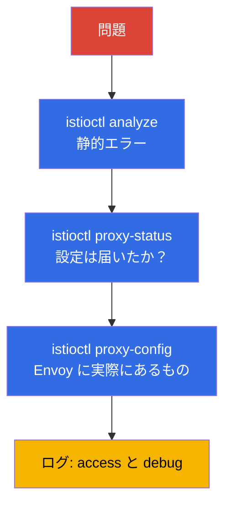

[Русская версия](ru.md) · [Eng version](en.md) · [Versión en español](es.md) · [Version française](fr.md) · [Deutsche Version](de.md) · [ქართული ვერსია](ge.md) · [繁體中文版](tw.md)

# 第24章 Istio のトラブルシューティング

> **次へ。** これは第1部の最終章であり、ICA 試験の独立したドメインでもあります。mesh で何かが動作しない場合、つまりトラフィックが流れない、503 が多発する、アプリケーションに到達できないといったときは、原因を迅速に特定する必要があります。この章では、Istio 診断のためのツールと体系的なアプローチ、すなわち `istioctl analyze`、`proxy-status`、`proxy-config`、ログを取り上げます。

## 24.1. 基本原則: ほとんどの場合、設定が原因

Istio の問題の圧倒的大多数は、**data plane の不正な設定**です。subset 名のタイプミス、Gateway の selector の不一致、インジェクションの忘れ、ポリシーの競合などです。まれに、アプリケーション自体またはインフラストラクチャの問題であることもあります。

したがって、体系的には、層をまたいで大局から詳細へと進みます。



それぞれのツールを見ていきましょう。

## 24.2. istioctl analyze: 静的解析

`istioctl analyze` は、最初に実行すべきものです。トラフィックを送る**前**かつトラフィックを送らずに設定を検査します。インジェクションの欠如、壊れた subset/gateway 参照、ポリシー競合、不正なホストといった典型的な問題を見つけます。

```bash
istioctl analyze -n app
```

分かりやすい説明を伴う警告とエラーを出力し、多くの場合は原因もすぐに示します。これは深い診断の前に設定ミスの大部分を捉えられるため、最初に実施すべき低コストな検査です。

## 24.3. istioctl proxy-status: 設定は届いたか

次の疑問は、設定がプロキシに適用されたかどうかです。istiod は xDS（第4章）経由で設定を配信しますが、これは即時ではありません。`istioctl proxy-status` は、すべての Envoy と istiod の同期状態を表示します。

```bash
istioctl proxy-status
```

各プロキシは `SYNCED` 状態である必要があります。`STALE` が表示される場合、設定は届いていません。istiod の過負荷、設定エラー、または接続上の問題が考えられます。プロキシが `SYNCED` になるまで、ルールに原因を探しても意味がありません。まだ適用されていないためです。

## 24.4. istioctl proxy-config: Envoy に実際にあるもの

analyze が問題なしでプロキシが SYNCED なのに、トラフィックが依然として誤った場所へ向かう場合は、特定の Envoy の設定に**実際に**何が入っているかを確認します。ここでは第4章の概念、listeners、routes、clusters、endpoints の組み合わせが役立ちます。

```bash
istioctl proxy-config listeners <pod> -n app   # どのポートをリッスンしているか
istioctl proxy-config routes    <pod> -n app   # ルーティングルール
istioctl proxy-config clusters  <pod> -n app   # 宛先サービスと subsets
istioctl proxy-config endpoints <pod> -n app   # 実際の Pod IP
```

典型的なシナリオとして、`VirtualService` が `subset: v2` を参照しているのに `clusters` にその subset がない場合があります。これは、`DestinationRule` がそれを定義していないか、名前が一致していないことを意味します。または、`endpoints` にアドレスが一つもないなら、サービスの背後に正常な Pod が存在しません。

もう一つ便利なコマンドが `istioctl x describe pod <pod>` です。これは、特定の Pod にどのポリシーとルートが影響するかを人間が理解しやすい言葉で説明します。

## 24.5. ログ: access と debug

設定が正しいにもかかわらずリクエストが失敗する場合は、ログが役立ちます。

**Envoy の access ログ**は、応答コード、所要時間、そして最も重要な**応答フラグ**、つまりどの段階で問題が起きたかをすぐに示す短いコードとともに、すべてのリクエストを表示します。access ログは Telemetry API（第18章）で有効にします。以下は mesh 全体でこれを有効にする完全なリソースです。

```yaml
apiVersion: telemetry.istio.io/v1
kind: Telemetry
metadata:
  name: mesh-access-logs
  namespace: istio-system        # istiod の namespace -> mesh 全体に作用する
spec:
  accessLogging:
    - providers:
        - name: envoy             # 組み込みの Envoy stdout ログプロバイダー
```

その後、特定の Pod のログは `istio-proxy` コンテナから `kubectl` を通じて直接読み取れます。

```bash
kubectl logs <pod> -n app -c istio-proxy
```

応答フラグこそが access ログを見る主な理由です。最もよくあるものは次のとおりです。

| フラグ  | 意味                                             | 調査箇所                                  |
|-------|------------------------------------------------------|----------------------------------------------|
| `UH`  | no healthy upstream - 正常な宛先 Pod がない  | `proxy-config endpoints`、Pod の readiness   |
| `NR`  | no route - ルートが見つからない                         | `VirtualService` のホスト、Gateway の `selector`  |
| `UF`  | upstream connection failure - 接続できなかった | mTLS mismatch、ネットワーク、`PeerAuthentication`    |
| `UC`  | upstream connection termination - upstream が接続を切断した | アプリケーションの障害、keep-alive、タイムアウト |
| `UO`  | upstream overflow - circuit breaker が作動した         | `DestinationRule` のプール制限（第10章）   |
| `URX` | リトライ上限に達した                               | `retries` ポリシー、upstream の耐性    |
| `UT`  | upstream request timeout                             | `VirtualService` の `timeout`、遅い backend |
| `DC`  | downstream connection termination - クライアントが切断した  | クライアントのタイムアウト、mesh 前の LB              |

**プロキシの debug ログ**では、詳細なデバッグのために Envoy のログレベルを上げられます。

```bash
istioctl proxy-config log <pod> -n app --level debug
```

istiod のログも確認してください。そこには設定適用のエラー（たとえば拒否された EnvoyFilter）が表示されます。

## 24.6. Envoy への直接アクセス: config_dump と管理画面

`proxy-config` の要約だけでは足りず、Envoy の生設定全体を見る必要がある場合があります。任意の `proxy-config` コマンドに JSON を出力させられます。これは Envoy が xDS で配信するものと同じ形式です。

```bash
istioctl proxy-config all <pod> -n app -o json > dump.json
```

さらに低レベルなのが、ポート `15000` 上の Envoy 管理インターフェイスです。ポートフォワードし、エンドポイントへ直接アクセスします。

```bash
kubectl port-forward <pod> -n app 15000:15000
# 次に別のウィンドウで:
curl localhost:15000/config_dump   # xDS 設定の完全ダンプ
curl localhost:15000/clusters      # クラスターの状態と endpoints の健全性
curl localhost:15000/stats         # Envoy のカウンター (リクエスト、エラー、リトライ)
curl localhost:15000/certs         # ロードされた TLS 証明書
```

mTLS 証明書の検査も特に有用です。プロキシが istiod から動作する leaf 証明書を取得したかどうか（第4章と第16章）に疑いがある場合は、直接確認してください。

```bash
istioctl proxy-config secret <pod> -n app
```

このコマンドは、`default`（workload の leaf 証明書）と `ROOTCA` があるかどうか、およびその有効期限を表示します。空または期限切れのシークレットは、mTLS 接続確立エラーの直接的な原因です。

## 24.7. 典型的な問題

「症状 - 考えられる原因」の短いリファレンスです。

- **`2/2` ではなく Pod が `1/1`。** インジェクションが機能していません。namespace にラベルがないか、Pod がラベル付与前に作成されています（第2章、第4章）。ラベルを付けて `rollout restart` で解決します。
- **503、フラグ `UH`（no healthy upstream）。** サービスの背後に正常な Pod がない、`VirtualService` が存在しない subset へ送っている、または circuit breaker が作動しています。`proxy-config endpoints` と `clusters` を確認してください。
- **Pod 起動時またはロールアウト中の 503。** 起動順序の競合です。アプリケーションコンテナが Envoy の起動前にトラフィックの送受信を開始した、または終了時にプロキシがまだ接続を保持している間に Pod がアプリケーションを停止しました。これには二つの設定で対応します。`holdApplicationUntilProxyStarts`（プロキシの準備が完了するまでアプリケーションを起動しない）とプロキシの graceful shutdown（`EXIT_ON_ZERO_ACTIVE_CONNECTIONS` + 適切な `preStop`/`terminationGracePeriodSeconds`）です。特に `rolling update` 中に 503 が急増する古典的な原因です。
- **フラグ `UC`/`UO` の 503。** `UC` は upstream が接続を切断したこと（アプリケーションの障害、mesh と backend の keep-alive タイムアウトの不一致）を示します。`UO` は circuit breaker が作動したこと、すなわち `DestinationRule`（第10章）の接続/リクエストプール制限を超えたことを示します。原因は異なり、フラグによってすぐに区別できます。
- **STRICT mTLS を有効にした直後の 503。** 典型例です。一方が plaintext を送信し（sidecar がない）、もう一方が mTLS を要求しています。PeerAuthentication とクライアント側の sidecar の有無を確認してください（第13章）。
- **mesh 有効化後に Pod が CrashLoop。** よくある原因は、`rewriteAppHTTPProbers` が無効なため、STRICT mTLS で HTTP probe（liveness/readiness）が失敗することです。probe と `sidecar.istio.io/rewriteAppHTTPProbers` アノテーションを確認してください（第13章）。
- **404、フラグ `NR`（no route）。** 適合するルートがありません。`VirtualService` のホスト不一致、Gateway の `selector` 不正、内部トラフィック用に `gateways` の `mesh` を忘れたことが原因です（第5章）。
- **プロキシが `STALE`。** 設定が同期していません。istiod の負荷とログを確認してください。
- **変更が適用されない。** より限定的なポリシーと競合している、またはリソースが誤った namespace にある可能性があります。`analyze` と `x describe` を実行してください。

## 24.8. EKS/AWS のトラブルシューティング

一部の問題は mesh 内部ではなく、Istio と AWS インフラストラクチャの境界で発生します。これらのケースは `analyze` と `proxy-config` では検出されないため、別途知っておく必要があります。

- **mesh 有効化後に ALB/NLB の health check が失敗する。** AWS Load Balancer Controller は Pod をターゲットとして登録し、Pod に直接 health check を送ります。STRICT mTLS が有効で、チェックが通常の plaintext HTTP で送られる場合、プロキシはこれを拒否します → ターゲットは `unhealthy` になります → mesh 内がすべて正常でもロードバランサーは 503 を返します。解決策は、`rewriteAppHTTPProbers` を有効にする（Istio が HTTP probe を pilot-agent ポート 15021 に書き換える）、health check をインターセプトから除外したポートへ向ける、またはアプリケーションの前に ingress gateway を置いてそれをチェックすることです。ingress gateway の健全性は `/healthz/ready`（ポート 15021）で確認できます。

- **インジェクションが「無言で」失敗する - webhook がブロックされている。** istiod はポート `15017` で mutating webhook 呼び出しを受けます。EKS では、control plane から istiod Pod へのトラフィックはノードの security group を経由します。ポート `15017` が閉じていると、API サーバーは webhook を呼び出せません。すると Pod は**sidecar なしで**作成されます（failurePolicy=Fail の場合は作成が停止します）。「Pod が `1/1` で、namespace にはラベルがある」という症状なら、security groups と 15017 上の `istiod` サービスへの到達可能性を確認してください。

- **IRSA / メタデータがインターセプトにより壊れる。** デフォルトでは sidecar が、メタデータエンドポイント `169.254.169.254` へのアクセスを含むすべての送信トラフィックをインターセプトします。IMDS を通じて AWS credentials を取得する Pod では、これによりロールの取得が壊れます。Pod のアノテーションでアドレスをインターセプトから除外してください。

  ```yaml
  metadata:
    annotations:
      traffic.sidecar.istio.io/excludeOutboundIPRanges: "169.254.169.254/32"
  ```

  projected token を使う IRSA はリージョン STS エンドポイント（passthrough される通常の外部 HTTPS）にアクセスしますが、SDK は依然として IMDS を試すことが多いため、「原因不明」の AWS アクセスエラーではまずメタデータのインターセプトを確認してください。

- **istio-cni と VPC CNI の順序。** EKS ではネットワークスタックがすでに Amazon VPC CNI によって使用されています。istio-cni のインストールでは init プラグインの順序が重要です。そうでないと、インターセプトルールが設定される前に Pod が起動し、トラフィックがプロキシを迂回する可能性があります。詳細は第27章を参照してください。

## 24.9. 診断情報の収集: istioctl bug-report

問題を同僚やサポートへ引き継ぐ必要があるとき、または分析のためにすべてを一度に収集したいときは、`istioctl bug-report` があります。

```bash
istioctl bug-report
```

このコマンドは、バージョン、設定、同期状態、istiod とプロキシのログ、Envoy 設定ダンプを含む、mesh のすべての診断情報をアーカイブに収集します。特にサポートへの問い合わせや事後のインシデント分析では、十数個のコマンドを手作業で収集する代わりになる便利な「ワンボタン」です。

> **AI アシスタントと MCP。** mesh 診断へのアクセスを AI アシスタントに提供する、実験的な MCP サーバー（Model Context Protocol）が登場しています。`istio-mcp-server`（`proxy-config`/`proxy-status`/Istio リソースの read-only ラッパー）、`kubectl`/`istioctl` の汎用ラッパー、Kiali に含まれる MCP などです。mesh の状態を自然言語で質問すると、この章と同じコマンドを通じてアシスタントが自ら事実を収集する、という考え方です。これらは Istio の一部ではない community プロジェクトであり、成熟度もさまざまです。**自己責任で使用してください**（稼働中のクラスターに接続します）。ただし、インシデント調査の加速手段としては検討に値します。

## 24.10. 体系的なアプローチ

推測しないために、大局から詳細へ次のチェックリストに従ってください。

1. **`istioctl analyze`** - 静的な設定エラーはあるか？
2. **Pod は `2/2` か？** インジェクションは機能したか？
3. **`istioctl proxy-status`** - すべてのプロキシは `SYNCED` か？
4. **`istioctl proxy-config`** - Envoy に実際にあるもの（routes、clusters、endpoints）は何か？
5. **`istioctl x describe pod`** - Pod に影響しているポリシーは何か？
6. **Access ログ** - 応答コードとフラグは何か？
7. **Debug ログ** - 上記すべてが問題なければ、さらに深く調査する。

この順序は時間を節約します。ほとんどの問題は、debug ログを読む前の最初の三つの手順で切り分けられます。

## 24.11. ambient のトラブルシューティング

上記はすべて sidecar モードについて説明しています。ambient（第22章）には sidecar がないため、一部のツールは異なる動作をします。この点を考慮する必要があります。

主な違いは、アプリケーション Pod に**独自の Envoy がない**ことです。そのため、`istioctl proxy-config <app-pod>` は役に立ちません。診断は、ztunnel（L4）と waypoint（L7）という二つの別のコンポーネントに対して行います。

- **Pod が ambient に含まれていることを確認する。** Namespace には `istio.io/dataplane-mode=ambient` のラベルが付き、Pod には sidecar があってはなりません。ztunnel が認識している workload を確認します。

  ```bash
  istioctl ztunnel-config workloads
  istioctl ztunnel-config services
  ```

- **ztunnel のログ。** ztunnel は `istio-system` 内の DaemonSet です。L4 トラフィックと mTLS の診断は、Pod が存在する**そのノード**の ztunnel ログで行います。

  ```bash
  kubectl logs -n istio-system ds/ztunnel
  ```

- **waypoint は Envoy である。** 問題が L7（ルーティング、L7 認可）にある場合は、通常のプロキシと同じように、使い慣れた `proxy-config` で waypoint を診断します。

  ```bash
  istioctl proxy-config all <waypoint-pod> -n app
  ```

- **`istioctl proxy-status`** は ambient でも動作し、ztunnel と waypoint が同期済みかどうかを表示します。

ambient 固有で最もよくあるエラーは、**waypoint がないため L7 ポリシーが機能しない**ことです。第22章のとおり、ztunnel は L4 でのみ動作します。HTTP ルール（メソッド、パス）を持つ `AuthorizationPolicy` が「効かない」場合は、サービス用の waypoint がデプロイされ、`istio.io/use-waypoint` ラベルがあることを確認してください。waypoint がなければ、L7 ルールを適用するものがいません。

## 24.12. Best practices

- **CI での `istioctl analyze`。** パイプラインでマニフェストを適用する前に実行してください。大半の設定エラーはクラスターに入る前に検出されます。
- **応答フラグを含む access ログをデフォルトで有効にする。** mesh 全体の単一の `Telemetry` リソース（24.5 を参照）は低コストであり、インシデント発生時には応答フラグが何時間もの推測を節約します。
- **アップグレード前の `istioctl x precheck`。** Istio のインストールまたは更新に対するクラスターの準備状況を確認し、非互換性を事前に警告します。
- **迅速なトリアージとしての Kiali。** サービスグラフは、トラフィックがどこで途切れているか、どのリソースが競合しているかを可視化します。手作業でログを読むより速いことがよくあります。
- **層に沿って厳密に進む。** すぐに debug ログへ飛ばないでください。`analyze` → `proxy-status` → `proxy-config` → access ログによって、最も低コストな段階で問題を切り分けられます。
- **複雑なケースでは `bug-report` を収集する。** 十数個の断片的なコマンドの代わりに一つのアーカイブとなり、サポートにも事後分析にも便利です。

## 24.13. 章のまとめ

- Istio の問題のほとんどは data plane の不正な設定です。診断は大局から詳細へ進めます。
- **`istioctl analyze`** は設定の静的解析であり、トラフィック前に典型的なエラーを検出します。ここから始めます。
- **`istioctl proxy-status`** はプロキシと istiod の同期（`SYNCED`/`STALE`）を示します。`SYNCED` でない限り、設定は適用されていません。
- **`istioctl proxy-config`**（listeners/routes/clusters/endpoints）は Envoy に実際に存在するものを示します。ここで subset の不一致、endpoints の欠如などを見つけます。
- **`istioctl x describe pod`** は、どのポリシーが Pod に影響するかを説明します。
- **Access ログ**（`UH`、`NR`、`UC`、`UO` などのコードとフラグ）とプロキシの **debug ログ**は、設定が正しいのにリクエストが失敗するケースで使用します。応答フラグは失敗の段階をすぐに示します。
- 詳細な調査には、Envoy への直接アクセスがあります。`proxy-config ... -o json`、ポート `15000` の管理画面（`/config_dump`、`/clusters`、`/stats`、`/certs`）、および mTLS 証明書を確認する `proxy-config secret` です。
- 典型的な組み合わせを知っておくと有用です。`1/1`（インジェクション）、`503 UH`（upstream/subset がない）、STRICT 後の `503`（mTLS mismatch）、ロールアウト中の `503`（プロキシ起動の競合 → `holdApplicationUntilProxyStarts`）、`404 NR`（ルート/selector/mesh がない）。
- EKS/AWS には別の問題群があります。STRICT mTLS に対する ALB/NLB health check、閉じた webhook ポート `15017`（インジェクションが失敗）、メタデータ `169.254.169.254` のインターセプト（IRSA/IMDS を壊す）、VPC CNI に対する istio-cni の順序です。
- `istioctl bug-report` はすべての mesh 診断情報を一つのアーカイブに収集します。
- ambient では診断が異なります。Pod 自身の Envoy がないため、L4 では ztunnel（`istioctl ztunnel-config`、DaemonSet のログ）、L7 では waypoint（`proxy-config`）を確認します。よくあるエラーは、waypoint がデプロイされていないため L7 ポリシーが動作しないことです。

## 24.14. 自己確認の質問

1. Istio の診断を設定エラーの想定から始めるのはなぜですか？
2. `istioctl analyze` は何を確認し、なぜ最初に実行すべきですか？
3. `proxy-status` の `STALE` ステータスは何を意味し、何を示していますか？
4. `proxy-config` を使って、存在しない subset への参照をどのように見つけますか？
5. フラグ `UH` の `503` と、STRICT mTLS を有効にした直後の `503` は何を示していますか？それらと `UC` および `UO` のフラグはどう異なりますか？
6. なぜ 503 は `rolling update` 中に発生しやすく、どの設定で解決できますか？
7. Envoy の生設定を表示し、プロキシが mTLS 証明書を受け取ったことを確認するにはどうしますか？
8. STRICT mTLS を有効にした後、ALB/NLB ターゲットが `unhealthy` になる理由と修正方法は何ですか？
9. sidecar を持つ Pod で AWS ロール（IRSA/IMDS）の取得を壊す可能性があるものは何ですか？
10. 大局から詳細へ進む体系的な診断順序を説明してください。
11. ambient での診断は sidecar とどう異なりますか？L4 と L7 の問題ではどこを確認し、なぜ L7 ポリシーが機能しないことがありますか？

## 演習

壊れた環境が与えられます。`istioctl analyze`、`proxy-status`、`proxy-config` を使って設定エラーを見つけ、解決してください。

🧪 ラボ 12: [tasks/ica/labs/12](../../labs/12/README_JP.MD)

---
[目次](../README_JP.md) · [第23章](../23/jp.md) · [第25章](../25/jp.md)