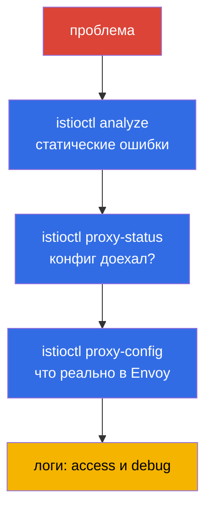

# Глава 24. Troubleshooting Istio

> **Что дальше.** Это завершающая глава Части 1 и отдельный домен экзамена ICA. Когда
> что-то в mesh не работает - трафик не ходит, сыпет 503, приложение недоступно - нужно
> быстро найти причину. В этой главе соберём инструменты и системный подход к
> диагностике Istio: `istioctl analyze`, `proxy-status`, `proxy-config`, логи.

## 24.1. Главный принцип: почти всегда виновата конфигурация

Подавляющее большинство проблем в Istio - это **неправильная конфигурация data plane**:
опечатка в имени subset, несовпадение selector у Gateway, забытая инъекция, конфликт
политик. Реже - проблемы самого приложения или инфраструктуры.

Отсюда системный подход: идти от общего к частному по слоям.



Разберём каждый инструмент.

## 24.2. istioctl analyze: статический анализ

`istioctl analyze` - первое, что стоит запустить. Он проверяет конфигурацию **до** и
**без** отправки трафика: находит типовые проблемы - отсутствие инъекции, битые ссылки
на subset/gateway, конфликты политик, неверные хосты.

```bash
istioctl analyze -n app
```

Он выдаёт предупреждения и ошибки с понятным описанием и часто сразу указывает на
причину. Это дешёвая проверка, с которой нужно начинать - она ловит львиную долю
конфигурационных ошибок ещё до глубокой диагностики.

## 24.3. istioctl proxy-status: доехал ли конфиг

Следующий вопрос: а applied ли ваша конфигурация на прокси? istiod рассылает её по xDS
(глава 4), и это не мгновенно. `istioctl proxy-status` показывает состояние синхронизации
всех Envoy с istiod:

```bash
istioctl proxy-status
```

Каждый прокси должен быть в состоянии `SYNCED`. Если видите `STALE` - конфиг не доехал:
возможно, istiod перегружен, есть ошибка в конфигурации или проблемы связи. Пока прокси
не `SYNCED`, бессмысленно искать причину в правилах - они ещё не применились.

## 24.4. istioctl proxy-config: что реально в Envoy

Если analyze чист и прокси SYNCED, а трафик всё равно идёт не туда - смотрим, что
**реально** лежит в конфигурации конкретного Envoy. Здесь работает связка понятий из
главы 4: listeners, routes, clusters, endpoints.

```bash
istioctl proxy-config listeners <pod> -n app   # какие порты слушает
istioctl proxy-config routes    <pod> -n app   # правила маршрутизации
istioctl proxy-config clusters  <pod> -n app   # сервисы назначения и subsets
istioctl proxy-config endpoints <pod> -n app   # реальные IP подов
```

Типичный сценарий: `VirtualService` ссылается на `subset: v2`, а в `clusters` этого
subset нет - значит, `DestinationRule` его не описывает или имена не совпадают. Или в
`endpoints` нет ни одного адреса - значит, за сервисом нет здоровых подов.

Ещё полезная команда - `istioctl x describe pod <pod>`: она человеческим языком
объясняет, какие политики и маршруты влияют на конкретный под.

## 24.5. Логи: access и debug

Когда конфигурация верна, а запросы всё равно падают, помогают логи.

- **Access-логи Envoy** показывают каждый запрос: код ответа, длительность, флаги
  ответа. Флаги особенно полезны: например, `UH` (no healthy upstream), `NR` (no route),
  `UF` (upstream connection failure). Включаются через Telemetry API (глава 18).
- **Debug-логи прокси** - для глубокой отладки можно поднять уровень логирования Envoy:

```bash
istioctl proxy-config log <pod> -n app --level debug
```

Также смотрите логи istiod - там видны ошибки применения конфигурации (например,
отклонённый EnvoyFilter).

## 24.6. Типовые проблемы

Небольшой справочник «симптом - вероятная причина».

- **Под `1/1` вместо `2/2`.** Не сработала инъекция: нет метки на namespace или под создан
  до неё (главы 2, 4). Лечится меткой + `rollout restart`.
- **503, флаг `UH` (no healthy upstream).** Нет здоровых подов за сервисом, или
  `VirtualService` шлёт на несуществующий subset, или сработал circuit breaker. Смотрите
  `proxy-config endpoints` и `clusters`.
- **503 сразу после включения STRICT mTLS.** Классика: одна сторона шлёт plaintext (нет
  sidecar), другая требует mTLS. Проверьте PeerAuthentication и наличие sidecar у клиента
  (глава 13).
- **Поды в CrashLoop после включения mesh.** Частая причина - падают HTTP-пробы
  (liveness/readiness) при STRICT mTLS, потому что отключён `rewriteAppHTTPProbers`.
  Проверьте пробы и аннотацию `sidecar.istio.io/rewriteAppHTTPProbers` (глава 13).
- **404, флаг `NR` (no route).** Нет подходящего маршрута: несовпадение хоста в
  `VirtualService`, неверный `selector` у Gateway, забыт `mesh` в `gateways` для
  внутреннего трафика (глава 5).
- **Прокси `STALE`.** Конфиг не синхронизировался - смотрите нагрузку и логи istiod.
- **Изменения не применяются.** Возможно, конфликтует более узкая политика, или ресурс в
  не том namespace. Запустите `analyze` и `x describe`.

## 24.7. Систематический подход

Чтобы не гадать, идите по чек-листу от общего к частному:

1. **`istioctl analyze`** - есть ли статические ошибки конфигурации?
2. **Поды `2/2`?** Инъекция сработала?
3. **`istioctl proxy-status`** - все прокси `SYNCED`?
4. **`istioctl proxy-config`** - что реально в Envoy (routes, clusters, endpoints)?
5. **`istioctl x describe pod`** - какие политики влияют на под?
6. **Access-логи** - какой код и флаг ответа?
7. **Debug-логи** - если всё выше чисто, копаем глубже.

Такой порядок экономит время: большинство проблем отсекается на первых трёх шагах, не
доходя до чтения дебаг-логов.

## 24.8. Troubleshooting в ambient

Всё выше описано для sidecar-режима. В ambient (глава 22) сайдкаров нет, поэтому часть
инструментов работает иначе - это надо учитывать.

Главное отличие: у пода приложения **нет своего Envoy**, поэтому `istioctl proxy-config
<app-pod>` для него бесполезен. Диагностика идёт по двум другим компонентам - ztunnel
(L4) и waypoint (L7).

- **Проверить, что под вообще в ambient.** Namespace должен быть помечен
  `istio.io/dataplane-mode=ambient`, а под не должен иметь sidecar. Посмотреть, какие
  нагрузки видит ztunnel:

  ```bash
  istioctl ztunnel-config workloads
  istioctl ztunnel-config services
  ```

- **Логи ztunnel.** ztunnel это DaemonSet в `istio-system`. Диагностика L4-трафика и
  mTLS идёт по логам ztunnel на **той ноде**, где живёт под:

  ```bash
  kubectl logs -n istio-system ds/ztunnel
  ```

- **Waypoint - это Envoy.** Если проблема в L7 (маршрутизация, L7-авторизация), её
  диагностируют на waypoint как на обычном прокси - через привычный `proxy-config`:

  ```bash
  istioctl proxy-config all <waypoint-pod> -n app
  ```

- **`istioctl proxy-status`** в ambient тоже работает и показывает ztunnel и waypoint -
  синхронизированы ли они.

Самая частая ambient-специфичная ошибка: **L7-политика не срабатывает, потому что нет
waypoint**. Помните из главы 22 - ztunnel работает только на L4. Если ваша
`AuthorizationPolicy` с HTTP-правилами (методы, пути) «не действует», проверьте, что для
сервиса развёрнут waypoint и стоит метка `istio.io/use-waypoint`. Без waypoint L7-правил
просто некому применять.

## 24.9. Итоги главы

- Почти все проблемы Istio - это неправильная конфигурация data plane; диагностику ведут
  от общего к частному.
- **`istioctl analyze`** - статический анализ конфигурации, ловит типовые ошибки до
  трафика; с него начинают.
- **`istioctl proxy-status`** - синхронизация прокси с istiod (`SYNCED`/`STALE`); пока не
  `SYNCED`, конфигурация не применилась.
- **`istioctl proxy-config`** (listeners/routes/clusters/endpoints) - что реально лежит в
  Envoy; здесь находят несовпадения subset, отсутствие endpoints и т.п.
- **`istioctl x describe pod`** объясняет, какие политики влияют на под.
- **Access-логи** (коды и флаги вроде `UH`, `NR`) и **debug-логи** прокси - для случаев,
  когда конфигурация верна, а запросы падают.
- Полезно знать типовые связки: `1/1` (инъекция), `503 UH` (нет upstream/subset), `503`
  после STRICT (mTLS mismatch), `404 NR` (нет маршрута/selector/mesh).
- В ambient диагностика иная: у пода нет своего Envoy - смотрят ztunnel
  (`istioctl ztunnel-config`, логи DaemonSet) для L4 и waypoint (`proxy-config`) для L7.
  Частая ошибка - L7-политика не работает, потому что не развёрнут waypoint.

## 24.10. Вопросы для самопроверки

1. Почему диагностику Istio начинают с предположения об ошибке конфигурации?
2. Что проверяет `istioctl analyze` и почему с него стоит начинать?
3. Что означает статус `STALE` в `proxy-status` и о чём он говорит?
4. Как с помощью `proxy-config` найти ссылку на несуществующий subset?
5. О чём говорят `503` с флагом `UH` и `503` сразу после включения STRICT mTLS?
6. Опишите системный порядок диагностики от общего к частному.
7. Чем диагностика в ambient отличается от sidecar? Куда смотреть при L4- и L7-проблемах
   и почему L7-политика может не срабатывать?

## Практика

Вам дадут сломанное окружение - найдите и устраните ошибки конфигурации с помощью
`istioctl analyze`, `proxy-status` и `proxy-config`:

🧪 Лаба 12: [tasks/ica/labs/12](../../labs/12/README_RU.MD)

---
[Оглавление](../README.md) · [Глава 23](../23/ru.md) · [Глава 25](../25/ru.md)
