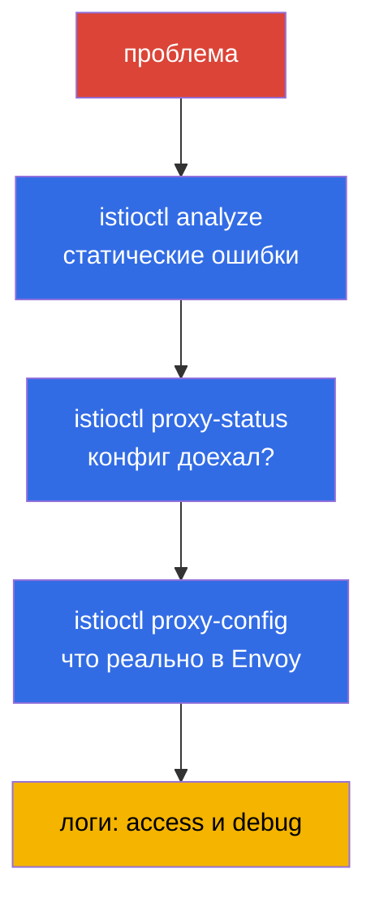

[Eng version](en.md) · [Versión en español](es.md) · [Version française](fr.md) · [Deutsche Version](de.md)

# Глава 24. Troubleshooting Istio

> **Что дальше.** Это завершающая глава Части 1 и отдельный домен экзамена ICA. Когда
> что-то в mesh не работает - трафик не ходит, сыпет 503, приложение недоступно - нужно
> быстро найти причину. В этой главе соберём инструменты и системный подход к
> диагностике Istio: `istioctl analyze`, `proxy-status`, `proxy-config`, логи.

## 24.1. Главный принцип: почти всегда виновата конфигурация

Подавляющее большинство проблем в Istio - это **неправильная конфигурация data plane**:
опечатка в имени subset, несовпадение selector у Gateway, забытая инъекция, конфликт
политик. Реже - проблемы самого приложения или инфраструктуры.

Отсюда системный подход: идти от общего к частному по слоям.



Разберём каждый инструмент.

## 24.2. istioctl analyze: статический анализ

`istioctl analyze` - первое, что стоит запустить. Он проверяет конфигурацию **до** и
**без** отправки трафика: находит типовые проблемы - отсутствие инъекции, битые ссылки
на subset/gateway, конфликты политик, неверные хосты.

```bash
istioctl analyze -n app
```

Он выдаёт предупреждения и ошибки с понятным описанием и часто сразу указывает на
причину. Это дешёвая проверка, с которой нужно начинать - она ловит львиную долю
конфигурационных ошибок ещё до глубокой диагностики.

## 24.3. istioctl proxy-status: доехал ли конфиг

Следующий вопрос: а применилась ли ваша конфигурация на прокси? istiod рассылает её по xDS
(глава 4), и это не мгновенно. `istioctl proxy-status` показывает состояние синхронизации
всех Envoy с istiod:

```bash
istioctl proxy-status
```

Каждый прокси должен быть в состоянии `SYNCED`. Если видите `STALE` - конфиг не доехал:
возможно, istiod перегружен, есть ошибка в конфигурации или проблемы связи. Пока прокси
не `SYNCED`, бессмысленно искать причину в правилах - они ещё не применились.

## 24.4. istioctl proxy-config: что реально в Envoy

Если analyze чист и прокси SYNCED, а трафик всё равно идёт не туда - смотрим, что
**реально** лежит в конфигурации конкретного Envoy. Здесь работает связка понятий из
главы 4: listeners, routes, clusters, endpoints.

```bash
istioctl proxy-config listeners <pod> -n app   # какие порты слушает
istioctl proxy-config routes    <pod> -n app   # правила маршрутизации
istioctl proxy-config clusters  <pod> -n app   # сервисы назначения и subsets
istioctl proxy-config endpoints <pod> -n app   # реальные IP подов
```

Типичный сценарий: `VirtualService` ссылается на `subset: v2`, а в `clusters` этого
subset нет - значит, `DestinationRule` его не описывает или имена не совпадают. Или в
`endpoints` нет ни одного адреса - значит, за сервисом нет здоровых подов.

Ещё полезная команда - `istioctl x describe pod <pod>`: она человеческим языком
объясняет, какие политики и маршруты влияют на конкретный под.

## 24.5. Логи: access и debug

Когда конфигурация верна, а запросы всё равно падают, помогают логи.

**Access-логи Envoy** показывают каждый запрос: код ответа, длительность и, главное,
**флаги ответа** — короткий код, который сразу говорит, на каком этапе всё сломалось.
Access-логи включаются через Telemetry API (глава 18) — вот полный ресурс, который
включает их для всей ячейки mesh:

```yaml
apiVersion: telemetry.istio.io/v1
kind: Telemetry
metadata:
  name: mesh-access-logs
  namespace: istio-system        # namespace istiod -> действует на весь mesh
spec:
  accessLogging:
    - providers:
        - name: envoy             # встроенный провайдер stdout-логов Envoy
```

После этого логи конкретного пода читаются прямо через `kubectl` из контейнера
`istio-proxy`:

```bash
kubectl logs <pod> -n app -c istio-proxy
```

Флаги ответа — то, ради чего вообще смотрят access-логи. Самые частые:

| Флаг  | Значение                                             | Куда копать                                  |
|-------|------------------------------------------------------|----------------------------------------------|
| `UH`  | no healthy upstream — нет здоровых подов назначения  | `proxy-config endpoints`, готовность подов   |
| `NR`  | no route — не нашёлся маршрут                         | хост в `VirtualService`, `selector` Gateway  |
| `UF`  | upstream connection failure — не удалось подключиться | mTLS mismatch, сеть, `PeerAuthentication`    |
| `UC`  | upstream connection termination — upstream оборвал соединение | падает приложение, keep-alive, таймаут |
| `UO`  | upstream overflow — сработал circuit breaker         | лимиты пула в `DestinationRule` (глава 10)   |
| `URX` | достигнут лимит ретраев                               | политика `retries`, устойчивость upstream    |
| `UT`  | upstream request timeout                             | `timeout` в `VirtualService`, медленный backend |
| `DC`  | downstream connection termination — клиент отвалился  | таймауты клиента, LB перед mesh              |

**Debug-логи прокси** — для глубокой отладки можно поднять уровень логирования Envoy:

```bash
istioctl proxy-config log <pod> -n app --level debug
```

Также смотрите логи istiod - там видны ошибки применения конфигурации (например,
отклонённый EnvoyFilter).

## 24.6. Прямой доступ к Envoy: config_dump и админка

Иногда сводки `proxy-config` мало и нужно увидеть сырой конфиг Envoy целиком. Любую
команду `proxy-config` можно попросить отдать JSON — это тот же формат, что Envoy
рассылает по xDS:

```bash
istioctl proxy-config all <pod> -n app -o json > dump.json
```

Ещё ближе к «железу» — админ-интерфейс Envoy на порту `15000`. Пробрасываем его и ходим
по эндпоинтам напрямую:

```bash
kubectl port-forward <pod> -n app 15000:15000
# затем в другом окне:
curl localhost:15000/config_dump   # полный дамп xDS-конфигурации
curl localhost:15000/clusters      # состояние кластеров и здоровье endpoints
curl localhost:15000/stats         # счётчики Envoy (запросы, ошибки, ретраи)
curl localhost:15000/certs         # загруженные TLS-сертификаты
```

Отдельно полезна проверка mTLS-сертификатов: если сомневаетесь, что прокси вообще получил
рабочий листовой серт от istiod (главы 4 и 16), спросите его напрямую:

```bash
istioctl proxy-config secret <pod> -n app
```

Команда покажет, есть ли `default` (листовой серт workload'а) и `ROOTCA`, и до какого
срока они валидны. Пустой или просроченный секрет — прямая причина ошибок установления
mTLS.

## 24.7. Типовые проблемы

Небольшой справочник «симптом - вероятная причина».

- **Под `1/1` вместо `2/2`.** Не сработала инъекция: нет метки на namespace или под создан
  до неё (главы 2, 4). Лечится меткой + `rollout restart`.
- **503, флаг `UH` (no healthy upstream).** Нет здоровых подов за сервисом, или
  `VirtualService` шлёт на несуществующий subset, или сработал circuit breaker. Смотрите
  `proxy-config endpoints` и `clusters`.
- **503 при старте пода или во время выкатки.** Гонка порядка запуска: контейнер
  приложения успел начать слать/принимать трафик раньше, чем поднялся Envoy, — или
  наоборот, при завершении под убил приложение, пока прокси ещё держал соединения.
  Лечится двумя настройками: `holdApplicationUntilProxyStarts` (приложение не стартует,
  пока прокси не готов) и graceful-shutdown прокси (`EXIT_ON_ZERO_ACTIVE_CONNECTIONS` +
  адекватный `preStop`/`terminationGracePeriodSeconds`). Классическая причина всплеска
  503 именно во время `rolling update`.
- **503 с флагом `UC`/`UO`.** `UC` — upstream оборвал соединение (падает приложение,
  разошлись keep-alive-таймауты mesh и backend). `UO` — сработал circuit breaker:
  превышены лимиты пула соединений/запросов из `DestinationRule` (глава 10). Это разные
  причины, и флаг сразу их разводит.
- **503 сразу после включения STRICT mTLS.** Классика: одна сторона шлёт plaintext (нет
  sidecar), другая требует mTLS. Проверьте PeerAuthentication и наличие sidecar у клиента
  (глава 13).
- **Поды в CrashLoop после включения mesh.** Частая причина - падают HTTP-пробы
  (liveness/readiness) при STRICT mTLS, потому что отключён `rewriteAppHTTPProbers`.
  Проверьте пробы и аннотацию `sidecar.istio.io/rewriteAppHTTPProbers` (глава 13).
- **404, флаг `NR` (no route).** Нет подходящего маршрута: несовпадение хоста в
  `VirtualService`, неверный `selector` у Gateway, забыт `mesh` в `gateways` для
  внутреннего трафика (глава 5).
- **Прокси `STALE`.** Конфиг не синхронизировался - смотрите нагрузку и логи istiod.
- **Изменения не применяются.** Возможно, конфликтует более узкая политика, или ресурс в
  не том namespace. Запустите `analyze` и `x describe`.

## 24.8. Troubleshooting на EKS/AWS

Часть проблем возникает не внутри mesh, а на стыке Istio и инфраструктуры AWS. Эти кейсы
не ловятся `analyze` и `proxy-config` — знать их надо отдельно.

- **Health-чеки ALB/NLB падают после включения mesh.** AWS Load Balancer Controller
  регистрирует поды как таргеты и шлёт проверку здоровья напрямую в под. Если включён
  STRICT mTLS, а проверка идёт обычным plaintext-HTTP, прокси её отклоняет → таргеты
  становятся `unhealthy` → балансировщик отдаёт 503, хотя внутри mesh всё «зелёное».
  Решения: включить `rewriteAppHTTPProbers` (Istio переписывает HTTP-пробы на порт
  pilot-agent 15021), либо направлять health-чек на порт, исключённый из перехвата, либо
  ставить перед приложением ingress gateway и проверять его. Здоровье ingress-шлюза видно
  на его `/healthz/ready` (порт 15021).

- **Инъекция «молча» не срабатывает — блокирован webhook.** istiod принимает вызовы
  mutating webhook на порту `15017`. На EKS трафик от control plane к подам istiod идёт
  через security group нод; если порт `15017` закрыт, API-сервер не может дёрнуть
  webhook — поды создаются **без** сайдкара (или залипают, если failurePolicy=Fail).
  Симптом «поды `1/1`, метка на namespace есть» — проверьте security groups и доступность
  сервиса `istiod` на 15017.

- **IRSA / метадата ломается из-за перехвата.** По умолчанию сайдкар перехватывает весь
  исходящий трафик, включая обращения к метадата-эндпоинту `169.254.169.254`. Подам,
  которые берут AWS-креды через IMDS, это ломает получение ролей. Исключите адрес из
  перехвата аннотацией на поде:

  ```yaml
  metadata:
    annotations:
      traffic.sidecar.istio.io/excludeOutboundIPRanges: "169.254.169.254/32"
  ```

  IRSA через projected-токен ходит на региональный STS-эндпоинт (обычный внешний HTTPS,
  который проходит passthrough), но SDK нередко всё равно пробуют IMDS — поэтому при
  «непонятных» ошибках доступа к AWS проверяйте перехват метадаты первым делом.

- **istio-cni и порядок с VPC CNI.** На EKS сетевой стек уже занят Amazon VPC CNI. При
  установке istio-cni важен порядок init-плагинов, иначе под может стартовать до того, как
  проставлены правила перехвата, и трафик пойдёт мимо прокси. Подробнее — в главе 27.

## 24.9. Сбор диагностики: istioctl bug-report

Когда проблему нужно передать коллеге или в поддержку — или просто собрать всё разом для
анализа — есть `istioctl bug-report`:

```bash
istioctl bug-report
```

Команда собирает архив со всей диагностикой mesh: версии, конфигурацию, статусы
синхронизации, логи istiod и прокси, дампы конфигов Envoy. Это удобная «одна кнопка»
вместо ручного сбора десятка команд, особенно при обращении в поддержку или разборе
инцидента постфактум.

> **AI-ассистенты и MCP.** Появились экспериментальные MCP-серверы (Model Context
> Protocol), которые дают ИИ-ассистенту доступ к диагностике mesh: `istio-mcp-server`
> (read-only обёртка над `proxy-config`/`proxy-status`/ресурсами Istio), универсальные
> обёртки над `kubectl`/`istioctl` и MCP в составе Kiali. Идея — задавать вопросы о
> состоянии mesh на естественном языке, а сбор фактов ассистент делает сам через те же
> команды из этой главы. Это community-проекты, не часть Istio, и разной степени
> зрелости — **использовать на свой страх и риск** (они подключаются к живому кластеру),
> но как ускоритель разбора инцидентов посмотреть стоит.

## 24.10. Систематический подход

Чтобы не гадать, идите по чек-листу от общего к частному:

1. **`istioctl analyze`** - есть ли статические ошибки конфигурации?
2. **Поды `2/2`?** Инъекция сработала?
3. **`istioctl proxy-status`** - все прокси `SYNCED`?
4. **`istioctl proxy-config`** - что реально в Envoy (routes, clusters, endpoints)?
5. **`istioctl x describe pod`** - какие политики влияют на под?
6. **Access-логи** - какой код и флаг ответа?
7. **Debug-логи** - если всё выше чисто, копаем глубже.

Такой порядок экономит время: большинство проблем отсекается на первых трёх шагах, не
доходя до чтения дебаг-логов.

## 24.11. Troubleshooting в ambient

Всё выше описано для sidecar-режима. В ambient (глава 22) сайдкаров нет, поэтому часть
инструментов работает иначе - это надо учитывать.

Главное отличие: у пода приложения **нет своего Envoy**, поэтому `istioctl proxy-config
<app-pod>` для него бесполезен. Диагностика идёт по двум другим компонентам - ztunnel
(L4) и waypoint (L7).

- **Проверить, что под вообще в ambient.** Namespace должен быть помечен
  `istio.io/dataplane-mode=ambient`, а под не должен иметь sidecar. Посмотреть, какие
  нагрузки видит ztunnel:

  ```bash
  istioctl ztunnel-config workloads
  istioctl ztunnel-config services
  ```

- **Логи ztunnel.** ztunnel это DaemonSet в `istio-system`. Диагностика L4-трафика и
  mTLS идёт по логам ztunnel на **той ноде**, где живёт под:

  ```bash
  kubectl logs -n istio-system ds/ztunnel
  ```

- **Waypoint - это Envoy.** Если проблема в L7 (маршрутизация, L7-авторизация), её
  диагностируют на waypoint как на обычном прокси - через привычный `proxy-config`:

  ```bash
  istioctl proxy-config all <waypoint-pod> -n app
  ```

- **`istioctl proxy-status`** в ambient тоже работает и показывает ztunnel и waypoint -
  синхронизированы ли они.

Самая частая ambient-специфичная ошибка: **L7-политика не срабатывает, потому что нет
waypoint**. Помните из главы 22 - ztunnel работает только на L4. Если ваша
`AuthorizationPolicy` с HTTP-правилами (методы, пути) «не действует», проверьте, что для
сервиса развёрнут waypoint и стоит метка `istio.io/use-waypoint`. Без waypoint L7-правил
просто некому применять.

## 24.12. Best practices

- **`istioctl analyze` в CI.** Гоняйте его на манифестах в пайплайне до применения —
  большинство конфигурационных ошибок ловится ещё до попадания в кластер.
- **Access-логи с флагами включены по умолчанию.** Один `Telemetry`-ресурс на весь mesh
  (см. 24.5) стоит дёшево, а в момент инцидента флаг ответа экономит часы догадок.
- **`istioctl x precheck` перед апгрейдом.** Проверяет готовность кластера к установке или
  обновлению Istio и предупреждает о несовместимостях заранее.
- **Kiali как быстрый триаж.** Граф сервисов подсвечивает, где именно рвётся трафик и
  какие ресурсы конфликтуют, — часто это быстрее, чем читать логи вручную.
- **Идите строго по слоям.** Не прыгайте сразу в debug-логи: `analyze` → `proxy-status`
  → `proxy-config` → access-логи отсекают проблему на самом дешёвом шаге.
- **Собирайте `bug-report` для сложных случаев** — единый архив вместо десятка
  разрозненных команд, удобно и для поддержки, и для разбора постфактум.

## 24.13. Итоги главы

- Почти все проблемы Istio - это неправильная конфигурация data plane; диагностику ведут
  от общего к частному.
- **`istioctl analyze`** - статический анализ конфигурации, ловит типовые ошибки до
  трафика; с него начинают.
- **`istioctl proxy-status`** - синхронизация прокси с istiod (`SYNCED`/`STALE`); пока не
  `SYNCED`, конфигурация не применилась.
- **`istioctl proxy-config`** (listeners/routes/clusters/endpoints) - что реально лежит в
  Envoy; здесь находят несовпадения subset, отсутствие endpoints и т.п.
- **`istioctl x describe pod`** объясняет, какие политики влияют на под.
- **Access-логи** (коды и флаги вроде `UH`, `NR`, `UC`, `UO`) и **debug-логи** прокси -
  для случаев, когда конфигурация верна, а запросы падают; флаг ответа сразу указывает
  этап сбоя.
- Для глубокого разбора есть прямой доступ к Envoy: `proxy-config ... -o json`,
  админка на порту `15000` (`/config_dump`, `/clusters`, `/stats`, `/certs`) и
  `proxy-config secret` для проверки mTLS-сертификатов.
- Полезно знать типовые связки: `1/1` (инъекция), `503 UH` (нет upstream/subset), `503`
  после STRICT (mTLS mismatch), `503` при выкатке (гонка старта прокси →
  `holdApplicationUntilProxyStarts`), `404 NR` (нет маршрута/selector/mesh).
- На EKS/AWS отдельный класс проблем: health-чеки ALB/NLB против STRICT mTLS,
  закрытый порт webhook `15017` (инъекция не срабатывает), перехват метадаты
  `169.254.169.254` (ломает IRSA/IMDS), порядок istio-cni с VPC CNI.
- `istioctl bug-report` собирает всю диагностику mesh в один архив.
- В ambient диагностика иная: у пода нет своего Envoy - смотрят ztunnel
  (`istioctl ztunnel-config`, логи DaemonSet) для L4 и waypoint (`proxy-config`) для L7.
  Частая ошибка - L7-политика не работает, потому что не развёрнут waypoint.

## 24.14. Вопросы для самопроверки

1. Почему диагностику Istio начинают с предположения об ошибке конфигурации?
2. Что проверяет `istioctl analyze` и почему с него стоит начинать?
3. Что означает статус `STALE` в `proxy-status` и о чём он говорит?
4. Как с помощью `proxy-config` найти ссылку на несуществующий subset?
5. О чём говорят `503` с флагом `UH` и `503` сразу после включения STRICT mTLS? Чем от них
   отличаются флаги `UC` и `UO`?
6. Почему 503 часто всплывают именно во время `rolling update` и какие настройки это
   лечат?
7. Как посмотреть сырой конфиг Envoy и проверить, что прокси получил mTLS-сертификат?
8. Почему после включения STRICT mTLS таргеты ALB/NLB могут стать `unhealthy` и как это
   исправить?
9. Что может сломать получение AWS-ролей (IRSA/IMDS) в поде с сайдкаром?
10. Опишите системный порядок диагностики от общего к частному.
11. Чем диагностика в ambient отличается от sidecar? Куда смотреть при L4- и L7-проблемах
    и почему L7-политика может не срабатывать?

## Практика

Вам дадут сломанное окружение - найдите и устраните ошибки конфигурации с помощью
`istioctl analyze`, `proxy-status` и `proxy-config`:

🧪 Лаба 12: [tasks/ica/labs/12](../../labs/12/README_RU.MD)

---
[Оглавление](../README.md) · [Глава 23](../23/ru.md) · [Глава 25](../25/ru.md)
