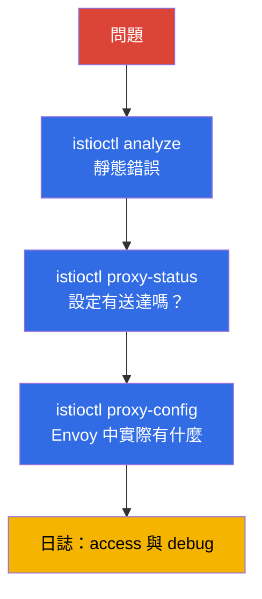

[Русская версия](ru.md) · [Eng version](en.md) · [Versión en español](es.md) · [Version française](fr.md) · [Deutsche Version](de.md) · [ქართული ვერსია](ge.md) · [日本語版](jp.md)

# 第 24 章：Istio 疑難排解

> **接下來。** 這是第 1 部分的最後一章，也是 ICA 考試的獨立領域。當 mesh 中出現問題--流量無法通行、不斷出現 503、應用程式無法存取--就必須快速找出原因。本章將整理 Istio 診斷的工具與系統化方法：`istioctl analyze`、`proxy-status`、`proxy-config`、日誌。

## 24.1. 核心原則：幾乎總是設定有問題

Istio 的絕大多數問題都是 **data plane 設定錯誤**：subset 名稱拼寫錯誤、Gateway 的 selector 不匹配、遺漏注入、策略衝突。較少見的原因才是應用程式本身或基礎設施的問題。

因此應採取系統化方法：按層次從整體到細節逐步排查。



以下逐一說明各項工具。

## 24.2. istioctl analyze：靜態分析

`istioctl analyze` 是第一個應該執行的工具。它會在**不**傳送流量的情況下檢查設定：找出常見問題，例如未注入、指向 subset/gateway 的失效參照、策略衝突及錯誤的主機。

```bash
istioctl analyze -n app
```

它會輸出具有明確說明的警告與錯誤，並且通常會立即指出原因。這是一項低成本檢查，應當作為起點--在深入診斷之前，它已能捕捉大部分設定錯誤。

## 24.3. istioctl proxy-status：設定是否已送達

下一個問題是：您的設定是否已套用到 proxy？istiod 透過 xDS（第 4 章）散發設定，這並非即時完成。`istioctl proxy-status` 顯示所有 Envoy 與 istiod 的同步狀態：

```bash
istioctl proxy-status
```

每個 proxy 都應處於 `SYNCED` 狀態。若看到 `STALE`，代表設定尚未送達：可能是 istiod 過載、設定存在錯誤，或有連線問題。在 proxy 尚未 `SYNCED` 前，追查規則的原因毫無意義--它們還沒有套用。

## 24.4. istioctl proxy-config：Envoy 中實際有什麼

若 analyze 沒有問題、proxy 也已 SYNCED，但流量仍然走錯地方，就要查看特定 Envoy 的設定中**實際**存在什麼。此處會用到第 4 章的概念組合：listeners、routes、clusters、endpoints。

```bash
istioctl proxy-config listeners <pod> -n app   # 監聽哪些連接埠
istioctl proxy-config routes    <pod> -n app   # 路由規則
istioctl proxy-config clusters  <pod> -n app   # 目的地服務與 subsets
istioctl proxy-config endpoints <pod> -n app   # pod 的實際 IP
```

典型情境：`VirtualService` 參照 `subset: v2`，但 `clusters` 中沒有這個 subset--表示 `DestinationRule` 未定義它，或名稱不相符。或者 `endpoints` 中一個位址也沒有--表示服務後方沒有健康的 Pod。

另一個實用命令是 `istioctl x describe pod <pod>`：它會以人類可讀的方式說明哪些策略與路由影響特定 Pod。

## 24.5. 日誌：access 與 debug

當設定正確但請求仍然失敗時，日誌會提供協助。

**Envoy access 日誌**會顯示每個請求：回應碼、持續時間，以及最重要的**回應旗標**--一個可立即指出故障發生階段的簡短代碼。access 日誌透過 Telemetry API（第 18 章）啟用--以下是為整個 mesh 啟用它們的完整資源：

```yaml
apiVersion: telemetry.istio.io/v1
kind: Telemetry
metadata:
  name: mesh-access-logs
  namespace: istio-system        # istiod 的 namespace -> 套用於整個 mesh
spec:
  accessLogging:
    - providers:
        - name: envoy             # Envoy stdout 日誌的內建 provider
```

之後可直接透過 `kubectl` 從 `istio-proxy` 容器讀取特定 Pod 的日誌：

```bash
kubectl logs <pod> -n app -c istio-proxy
```

回應旗標正是查看 access 日誌的主要原因。最常見的旗標如下：

| 旗標  | 含義                                             | 排查方向                                  |
|-------|--------------------------------------------------|-------------------------------------------|
| `UH`  | no healthy upstream - 沒有健康的目的 Pod         | `proxy-config endpoints`、Pod 就緒狀態    |
| `NR`  | no route - 找不到路由                            | `VirtualService` 中的主機、Gateway `selector` |
| `UF`  | upstream connection failure - 無法建立連線        | mTLS mismatch、網路、`PeerAuthentication` |
| `UC`  | upstream connection termination - upstream 中斷連線 | 應用程式崩潰、keep-alive、逾時          |
| `UO`  | upstream overflow - circuit breaker 已觸發       | `DestinationRule` 中的 pool 限制（第 10 章） |
| `URX` | 已達重試上限                                     | `retries` 策略、upstream 穩定性           |
| `UT`  | upstream request timeout                         | `VirtualService` 中的 `timeout`、緩慢的 backend |
| `DC`  | downstream connection termination - 用戶端中斷連線 | 用戶端逾時、mesh 前方的 LB               |

**Proxy debug 日誌**--若需深入偵錯，可以提高 Envoy 的日誌層級：

```bash
istioctl proxy-config log <pod> -n app --level debug
```

也請查看 istiod 日誌--其中可見設定套用錯誤（例如被拒絕的 EnvoyFilter）。

## 24.6. 直接存取 Envoy：config_dump 與管理介面

有時 `proxy-config` 的摘要不夠，需要查看完整的原始 Envoy 設定。任何 `proxy-config` 命令都可以要求輸出 JSON--這正是 Envoy 透過 xDS 散發的格式：

```bash
istioctl proxy-config all <pod> -n app -o json > dump.json
```

更接近底層的是 Envoy 在 `15000` 連接埠上的管理介面。將其轉送後可直接呼叫 endpoint：

```bash
kubectl port-forward <pod> -n app 15000:15000
# 接著在另一個視窗中：
curl localhost:15000/config_dump   # 完整的 xDS 設定傾印
curl localhost:15000/clusters      # cluster 狀態與 endpoint 健康度
curl localhost:15000/stats         # Envoy 計數器（請求、錯誤、重試）
curl localhost:15000/certs         # 已載入的 TLS 憑證
```

單獨檢查 mTLS 憑證也很有用：若您懷疑 proxy 是否確實從 istiod 取得可用的 leaf 憑證（第 4 與 16 章），可以直接詢問它：

```bash
istioctl proxy-config secret <pod> -n app
```

此命令會顯示是否有 `default`（workload 的 leaf 憑證）與 `ROOTCA`，以及它們的有效期限。空白或已過期的 secret 是建立 mTLS 時發生錯誤的直接原因。

## 24.7. 常見問題

「症狀-可能原因」的簡短參考。

- **Pod 為 `1/1` 而非 `2/2`。** 注入未生效：namespace 沒有標籤，或 Pod 在標籤之前建立（第 2、4 章）。以標籤加上 `rollout restart` 修復。
- **503，旗標 `UH`（no healthy upstream）。** 服務後方沒有健康 Pod，或 `VirtualService` 送往不存在的 subset，或 circuit breaker 已觸發。查看 `proxy-config endpoints` 與 `clusters`。
- **Pod 啟動或部署期間出現 503。** 啟動順序競態：應用程式容器在 Envoy 就緒前就開始傳送／接收流量--或反過來，終止時 Pod 在 proxy 仍維持連線時就殺掉應用程式。可透過兩項設定修復：`holdApplicationUntilProxyStarts`（proxy 就緒前不啟動應用程式）及 proxy 的 graceful shutdown（`EXIT_ON_ZERO_ACTIVE_CONNECTIONS` + 合理的 `preStop`/`terminationGracePeriodSeconds`）。這正是 `rolling update` 期間 503 激增的經典原因。
- **帶有旗標 `UC`/`UO` 的 503。** `UC`--upstream 中斷連線（應用程式崩潰，或 mesh 與 backend 的 keep-alive 逾時不一致）。`UO`--circuit breaker 已觸發：超出 `DestinationRule` 中的連線／請求 pool 限制（第 10 章）。這是不同原因，而旗標會立即區分它們。
- **啟用 STRICT mTLS 後立即出現 503。** 經典情況：一端傳送 plaintext（沒有 sidecar），另一端要求 mTLS。檢查 PeerAuthentication 與用戶端是否存在 sidecar（第 13 章）。
- **啟用 mesh 後 Pod 進入 CrashLoop。** 常見原因是 HTTP probes（liveness/readiness）在 STRICT mTLS 下失敗，因為 `rewriteAppHTTPProbers` 被停用。檢查 probes 與 `sidecar.istio.io/rewriteAppHTTPProbers` 註解（第 13 章）。
- **404，旗標 `NR`（no route）。** 沒有匹配的路由：`VirtualService` 的主機不匹配、Gateway 的 `selector` 錯誤，或內部流量的 `gateways` 中遺漏 `mesh`（第 5 章）。
- **Proxy 為 `STALE`。** 設定未同步--查看 istiod 的負載與日誌。
- **變更未套用。** 可能有更精細的策略衝突，或資源位於錯誤的 namespace。執行 `analyze` 與 `x describe`。

## 24.8. EKS/AWS 上的疑難排解

部分問題不發生於 mesh 內部，而是發生在 Istio 與 AWS 基礎設施的交界。`analyze` 和 `proxy-config` 不會捕捉這些案例--必須另行瞭解。

- **啟用 mesh 後 ALB/NLB health check 失敗。** AWS Load Balancer Controller 將 Pod 註冊為 target，並直接向 Pod 傳送健康檢查。若啟用 STRICT mTLS，而檢查使用一般 plaintext HTTP，proxy 會拒絕它 → target 變為 `unhealthy` → 即使 mesh 內一切「綠燈」，負載平衡器仍會回傳 503。解決方式：啟用 `rewriteAppHTTPProbers`（Istio 將 HTTP probes 改寫至 pilot-agent 15021 連接埠）、將 health check 指向排除攔截的連接埠，或在應用程式前方部署 ingress gateway 並檢查它。ingress gateway 的健康狀態可在其 `/healthz/ready`（連接埠 15021）查看。

- **注入「悄無聲息」地未生效--webhook 被封鎖。** istiod 在 `15017` 連接埠接收 mutating webhook 呼叫。在 EKS 上，從 control plane 到 istiod Pod 的流量會經過 node security group；若 `15017` 連接埠關閉，API server 無法呼叫 webhook--Pod 會在**沒有** sidecar 的情況下建立（若 failurePolicy=Fail，則會卡住）。若症狀為「Pod `1/1`、namespace 有標籤」，請檢查 security groups 以及 `istiod` 服務在 15017 上的可達性。

- **IRSA／中繼資料因攔截而失效。** 預設情況下，sidecar 會攔截所有輸出流量，包括對中繼資料 endpoint `169.254.169.254` 的呼叫。透過 IMDS 取得 AWS credentials 的 Pod 因此無法取得角色。請用 Pod 註解將此位址排除在攔截之外：

  ```yaml
  metadata:
    annotations:
      traffic.sidecar.istio.io/excludeOutboundIPRanges: "169.254.169.254/32"
  ```

  使用 projected token 的 IRSA 會連線至區域 STS endpoint（一般可 passthrough 的外部 HTTPS），但 SDK 經常仍會嘗試 IMDS--因此遇到「難以解釋」的 AWS 存取錯誤時，首先檢查中繼資料攔截。

- **istio-cni 與 VPC CNI 的順序。** 在 EKS 上，網路堆疊已由 Amazon VPC CNI 使用。安裝 istio-cni 時，init plugin 的順序至關重要；否則 Pod 可能在設定攔截規則前啟動，流量將繞過 proxy。詳見第 27 章。

## 24.9. 收集診斷資訊：istioctl bug-report

當問題需要交接給同事或支援團隊--或只是要一次收集所有資料以供分析--可以使用 `istioctl bug-report`：

```bash
istioctl bug-report
```

此命令會收集包含所有 mesh 診斷資訊的封存檔：版本、設定、同步狀態、istiod 與 proxy 日誌、Envoy 設定傾印。相較於手動收集十幾個命令，這是一個便利的「一鍵式」作法，特別適合聯繫支援或事後分析事故。

> **AI 助手與 MCP。** 已出現實驗性的 MCP server（Model Context Protocol），讓 AI 助手能存取 mesh 診斷：`istio-mcp-server`（對 `proxy-config`/`proxy-status`/Istio 資源的 read-only 封裝）、針對 `kubectl`/`istioctl` 的通用封裝，以及 Kiali 內建的 MCP。概念是以自然語言詢問 mesh 狀態，而助手會自行透過本章相同命令收集事實。這些是 community 專案，不屬於 Istio，成熟度各異--**請自行承擔風險使用**（它們會連線到執行中的 cluster），但值得作為加速事故分析的工具了解一下。

## 24.10. 系統化方法

為避免猜測，請依照由整體到細節的檢查清單：

1. **`istioctl analyze`**--是否有靜態設定錯誤？
2. **Pod 為 `2/2`？** 注入是否生效？
3. **`istioctl proxy-status`**--所有 proxy 都是 `SYNCED`？
4. **`istioctl proxy-config`**--Envoy 中實際有什麼（routes、clusters、endpoints）？
5. **`istioctl x describe pod`**--哪些策略影響該 Pod？
6. **Access 日誌**--回應碼與回應旗標為何？
7. **Debug 日誌**--若以上皆正常，則進一步深入排查。

此順序能節省時間：大部分問題會在前三個步驟被排除，不必讀取 debug 日誌。

## 24.11. ambient 中的疑難排解

以上內容描述的是 sidecar 模式。在 ambient（第 22 章）中沒有 sidecar，因此部分工具的運作方式不同--必須納入考量。

主要差異：應用程式 Pod **沒有自己的 Envoy**，因此 `istioctl proxy-config
<app-pod>` 對它沒有用。診斷應透過另外兩個元件進行：ztunnel（L4）與 waypoint（L7）。

- **確認 Pod 是否確實位於 ambient。** Namespace 應標記為 `istio.io/dataplane-mode=ambient`，而 Pod 不應有 sidecar。查看 ztunnel 看見哪些 workloads：

  ```bash
  istioctl ztunnel-config workloads
  istioctl ztunnel-config services
  ```

- **ztunnel 日誌。** ztunnel 是 `istio-system` 中的 DaemonSet。L4 流量與 mTLS 的診斷應查看**Pod 所在 node**上的 ztunnel 日誌：

  ```bash
  kubectl logs -n istio-system ds/ztunnel
  ```

- **Waypoint 是 Envoy。** 若問題位於 L7（路由、L7 授權），便要將 waypoint 視為一般 proxy，以熟悉的 `proxy-config` 進行診斷：

  ```bash
  istioctl proxy-config all <waypoint-pod> -n app
  ```

- **`istioctl proxy-status`** 在 ambient 中同樣可用，並會顯示 ztunnel 和 waypoint 是否已同步。

最常見的 ambient 特有錯誤是：**L7 策略未生效，因為沒有 waypoint**。請記得第 22 章所述：ztunnel 只能處理 L4。若您的 `AuthorizationPolicy` 包含 HTTP 規則（方法、路徑）而「沒有作用」，請確認服務已部署 waypoint 且設定 `istio.io/use-waypoint` 標籤。沒有 waypoint，就沒有元件可套用 L7 規則。

## 24.12. 最佳實務

- **在 CI 中執行 `istioctl analyze`。** 在 pipeline 中套用前針對 manifest 執行它--大部分設定錯誤會在進入 cluster 前被捕捉。
- **預設啟用含旗標的 access 日誌。** 全 mesh 使用一個 `Telemetry` 資源（見 24.5）成本很低，而事故發生時，回應旗標可節省數小時的猜測。
- **升級前執行 `istioctl x precheck`。** 它檢查 cluster 是否準備好安裝或升級 Istio，並預先警告不相容情況。
- **將 Kiali 用於快速分流。** 服務圖會突顯流量究竟在哪裡中斷，以及哪些資源衝突--這通常比手動讀取日誌更快。
- **嚴格逐層排查。** 不要直接跳到 debug 日誌：`analyze` → `proxy-status` → `proxy-config` → access 日誌會在成本最低的步驟排除問題。
- **針對複雜案例收集 `bug-report`**--一個整合封存檔取代十幾條零散命令，對支援與事後分析都很方便。

## 24.13. 本章總結

- 幾乎所有 Istio 問題都是 data plane 設定錯誤；診斷應從整體到細節進行。
- **`istioctl analyze`**--設定的靜態分析，在傳送流量前捕捉典型錯誤；應從它開始。
- **`istioctl proxy-status`**--proxy 與 istiod 的同步（`SYNCED`/`STALE`）；未 `SYNCED` 前，設定尚未套用。
- **`istioctl proxy-config`**（listeners/routes/clusters/endpoints）--Envoy 中實際存在什麼；可在此找出 subset 不匹配、缺少 endpoints 等問題。
- **`istioctl x describe pod`** 會說明哪些策略影響 Pod。
- **Access 日誌**（`UH`、`NR`、`UC`、`UO` 等代碼與旗標）及 proxy **debug 日誌**--適用於設定正確但請求仍失敗的情況；回應旗標會立即指出故障階段。
- 深入分析可直接存取 Envoy：`proxy-config ... -o json`、`15000` 連接埠上的管理介面（`/config_dump`、`/clusters`、`/stats`、`/certs`），以及用於檢查 mTLS 憑證的 `proxy-config secret`。
- 有用的典型對應：`1/1`（注入）、`503 UH`（沒有 upstream/subset）、STRICT 後 `503`（mTLS mismatch）、部署期間 `503`（proxy 啟動競態 → `holdApplicationUntilProxyStarts`）、`404 NR`（沒有路由/selector/mesh）。
- 在 EKS/AWS 上另有一類問題：ALB/NLB health check 對抗 STRICT mTLS、webhook 連接埠 `15017` 關閉（注入未生效）、中繼資料 `169.254.169.254` 遭攔截（破壞 IRSA/IMDS），以及 istio-cni 與 VPC CNI 的順序。
- `istioctl bug-report` 將所有 mesh 診斷收集至單一封存檔。
- ambient 的診斷不同：Pod 沒有自己的 Envoy--L4 要查看 ztunnel（`istioctl ztunnel-config`、DaemonSet 日誌），L7 要查看 waypoint（`proxy-config`）。常見錯誤是未部署 waypoint，導致 L7 策略無法運作。

## 24.14. 自我檢查問題

1. 為何 Istio 診斷要先假設是設定錯誤？
2. `istioctl analyze` 檢查什麼，為何應從它開始？
3. `proxy-status` 中的 `STALE` 狀態代表什麼？它說明了什麼？
4. 如何使用 `proxy-config` 找出指向不存在 subset 的參照？
5. 帶有旗標 `UH` 的 `503`，以及啟用 STRICT mTLS 後立即出現的 `503`，各代表什麼？它們與 `UC`、`UO` 旗標有何差異？
6. 為何 503 常在 `rolling update` 期間出現？哪些設定可以修復？
7. 如何查看原始 Envoy 設定，並確認 proxy 已取得 mTLS 憑證？
8. 為何啟用 STRICT mTLS 後，ALB/NLB target 可能變為 `unhealthy`？如何修復？
9. 有 sidecar 的 Pod 中，什麼可能會破壞 AWS 角色（IRSA/IMDS）的取得？
10. 說明由整體到細節的系統化診斷順序。
11. ambient 的診斷與 sidecar 有何不同？遇到 L4 與 L7 問題時應查看何處，為何 L7 策略可能未生效？

## 實作練習

您將取得一個損壞的環境--請使用 `istioctl analyze`、`proxy-status` 與 `proxy-config` 找出並修正設定錯誤：

🧪 實驗 12：[tasks/ica/labs/12](../../labs/12/README_TW.MD)

---
[目錄](../README_TW.md) · [第 23 章](../23/tw.md) · [第 25 章](../25/tw.md)
