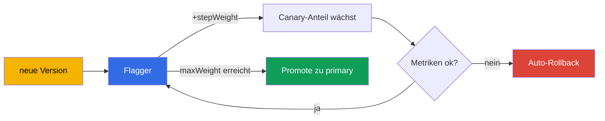

[RU version](ru.md) · [Eng version](en.md) · [Versión en español](es.md) · [Version française](fr.md)

# Kapitel 25. Progressive Delivery mit Flagger

> **Hier beginnt Teil 2** - Best Practices für den realen Betrieb. Hier geht es um Themen,
> die in der Prüfung nicht (oder kaum) vorkommen, aber in der Produktion nötig sind. Das
> erste ist Progressive Delivery. In Kapitel 6 haben wir Canary manuell gemacht, indem wir
> die Gewichte im VirtualService geändert haben. Das funktioniert, erfordert aber einen
> Menschen am Steuer. Flagger automatisiert den gesamten Prozess mit Metrikanalyse und
> automatischem Rollback.

## 25.1. Das Problem des manuellen Canary

Erinnern Sie sich an Canary aus Kapitel 6: Sie ändern die Gewichte auf 90/10, dann 70/30,
schauen auf die Dashboards und entscheiden, ob Sie weitergehen oder zurückrollen. Die
Nachteile liegen auf der Hand:

- **Ein Mensch ist nötig.** Jemand muss dasitzen und die Gewichte manuell ändern, die
  Metriken beobachten.
- **Langsam und nachts.** Rollouts werden oft zu ungünstigen Zeiten und unter Aufsicht
  durchgeführt.
- **Menschlicher Faktor.** Es ist leicht, einen Anstieg von Fehlern oder Latenz zu
  übersehen und eine schlechte Version auszurollen.

Progressive Delivery beseitigt die manuelle Arbeit: Das System leitet den Traffic selbst
schrittweise um, prüft bei jedem Schritt die Metriken und fährt entweder fort oder rollt
zurück - ohne Menschen.

## 25.2. Was ist Flagger

**Flagger** ist ein Operator für Progressive Delivery, der auf Istio (und anderen Meshes)
aufsetzt. Sie beschreiben mit der Ressource `Canary`, wie der Rollout ablaufen soll, und
Flagger übernimmt selbst:

- bemerkt eine neue Version des Deployments;
- verlagert den Traffic schrittweise darauf, indem es die Gewichte in VirtualService/
  DestinationRule ändert;
- analysiert bei jedem Schritt die Metriken (Erfolgsrate, Latenz);
- erhöht bei guten Metriken den Anteil, bei schlechten - rollt es zurück;
- „befördert" bei Erreichen des Ziels die neue Version zur Hauptversion (Promote).



Die Kernidee: Sie definieren die **Regeln** des Rollouts einmal, und danach läuft jedes
Release automatisch und sicher nach ihnen ab.

## 25.3. Wie Flagger mit Istio arbeitet

Flagger erfindet kein eigenes Routing - es nutzt die Istio-Ressourcen, die wir in den
Kapiteln 5 und 6 behandelt haben. Wenn Sie eine `Canary` für das Deployment `podinfo`
erstellen, baut Flagger die gesamte Infrastruktur darum herum auf:

- eine Kopie des Deployments `podinfo-primary` (die stabile Version, zu der der Traffic
  aktuell geht);
- die Services `podinfo`, `podinfo-canary`, `podinfo-primary`;
- `DestinationRule` und `VirtualService`, über die es die Gewichte steuert.

Danach verschiebt Flagger bei jedem Update des ursprünglichen Deployments selbst die
Gewichte in diesem VirtualService - macht also genau das, was Sie in Kapitel 6 von Hand
gemacht haben, nur automatisch und mit Metrikprüfung.

## 25.4. Installation von Flagger

Flagger ist nicht Teil von Istio - es wird separat installiert, üblicherweise über Helm.
Es braucht zwei Dinge: die Angabe, dass das Mesh Istio ist, und die Adresse von Prometheus
(die Metriken aus Kapitel 17 sind die Grundlage der Analyse).

```bash
helm repo add flagger https://flagger.app
helm repo update

helm install flagger flagger/flagger \
  -n istio-system \
  --set meshProvider=istio \
  --set metricsServer=http://prometheus.istio-system:9090
```

- **`meshProvider=istio`** - Flagger steuert die Gewichte über VirtualService/
  DestinationRule von Istio.
- **`metricsServer`** - woher die Metriken für die Analyse bezogen werden (Ihr Prometheus).

Für Prüfungen und Lasterzeugung (Webhooks aus der `Canary`) wird zusätzlich ein
Load-Tester im Namespace der Anwendung installiert:

```bash
helm install flagger-loadtester flagger/loadtester -n test
```

Voraussetzungen: installiertes Istio (Kapitel 2-3) und ein funktionierendes Prometheus
(Kapitel 17). Ohne Metriken kann Flagger den Rollout nicht analysieren.

## 25.5. Die Ressource Canary

Die gesamte Rollout-Konfiguration wird in einer einzigen Ressource beschrieben. Betrachten
wir die wichtigsten Felder:

```yaml
apiVersion: flagger.app/v1beta1
kind: Canary
metadata:
  name: podinfo
  namespace: test
spec:
  targetRef:
    apiVersion: apps/v1
    kind: Deployment
    name: podinfo            # welches Deployment wir ausrollen
  service:
    port: 9898
  analysis:
    interval: 30s            # wie oft geprüft wird
    threshold: 5             # wie viele Fehlschläge in Folge bis zum Rollback
    maxWeight: 50            # bis zu welchem Anteil Canary gebracht wird
    stepWeight: 10           # Schrittweite der Gewichtserhöhung
    metrics:
    - name: request-success-rate
      thresholdRange:
        min: 99              # Erfolgsrate nicht unter 99 %
      interval: 1m
    - name: request-duration
      thresholdRange:
        max: 500             # Latenz nicht über 500 ms
      interval: 1m
    webhooks:
    - name: load-test
      url: http://flagger-loadtester.test/   # Lasterzeugung für die Prüfung
```

- **`targetRef`** - welches Deployment wir ausrollen.
- **`analysis.interval` / `stepWeight` / `maxWeight`** - Rhythmus und Schritte des Rollouts
  (alle 30 s 10 % Traffic hinzufügen, maximal bis 50 %, dann Promote).
- **`threshold`** - wie viele fehlgeschlagene Prüfungen in Folge bis zum Auto-Rollback
  zulässig sind.
- **`metrics`** - was als Erfolg gilt: Erfolgsrate der Anfragen und Latenz (bezogen aus
  den Istio-Metriken, Kapitel 17). Das ist das automatische Kriterium „gut/schlecht".
- **`webhooks`** - externe Prüfungen: Lasterzeugung, Abnahmetests. Ohne Traffic kommen
  keine Metriken zustande, deshalb ist der Load-Test in der Regel Pflicht.

## 25.6. Wie der Rollout abläuft: Promote und Rollback

Wenn Sie das Image im Deployment `podinfo` aktualisieren, startet Flagger einen Zyklus:

1. Leitet `stepWeight` Prozent des Traffics auf die neue Version (z. B. 10 %).
2. Wartet `interval` und prüft die Metriken (Erfolgsrate, Latenz).
3. Wenn die Metriken innerhalb der Schwellen liegen - erhöht es das Gewicht um einen
   weiteren Schritt (20 %, 30 %, ...).
4. Wenn die Metriken `threshold` Mal in Folge schlecht sind - **rollt es zurück**: leitet
   den gesamten Traffic auf primary zurück, Canary wird verworfen.
5. Bei Erreichen von `maxWeight` mit guten Metriken - **Promote**: die neue Version wird
   in primary kopiert und wird zur Hauptversion, der Traffic geht vollständig darauf.

Das alles ohne menschliches Zutun. In den Canary-Logs sieht man den Fortschritt: `Advance
podinfo.test canary weight 20/40/50` und am Ende `Promotion completed!` - oder ein
Rollback, wenn etwas schiefgelaufen ist.

Fazit: Eine schlechte Version erreicht nicht alle Nutzer - sie wird automatisch bei einem
kleinen Traffic-Anteil anhand objektiver Metriken abgeschnitten.

## 25.7. Weitere Rollout-Strategien

Das gewichtete Canary aus Abschnitt 25.5 ist nur eine von mehreren Strategien. Mit
derselben Ressource `Canary` (und derselben Istio-Infrastruktur) beherrscht Flagger noch
drei weitere, es ändert sich nur der Block `analysis`.

**Blue/Green** - kein schrittweises Gewicht: die neue Version durchläuft zunächst N
Prüfungen „abseits", und erst danach wird der Traffic vollständig darauf umgeschaltet.
Wird über `iterations` ohne `stepWeight` definiert:

```yaml
  analysis:
    interval: 30s
    threshold: 5
    iterations: 10          # 10 erfolgreiche Prüfungen in Folge - dann 100 % auf einmal umschalten
    metrics:
    - name: request-success-rate
      thresholdRange: {min: 99}
      interval: 1m
```

**A/B-Testing** - der Traffic wird nicht nach Gewicht, sondern nach einem Merkmal der
Anfrage aufgeteilt: nach Header oder Cookie. Nützlich, wenn die neue Version einem
bestimmten Segment gezeigt werden soll (Beta-Nutzer, interne Mitarbeiter). Das Routing über
`match` - dieselbe Syntax wie im `VirtualService` (Kapitel 6 und 15):

```yaml
  analysis:
    interval: 30s
    threshold: 5
    iterations: 10
    match:                  # nur Anfragen mit diesem Header gehen zu Canary
    - headers:
        x-canary:
          exact: "insider"
    metrics:
    - name: request-success-rate
      thresholdRange: {min: 99}
      interval: 1m
```

**Traffic Mirroring (Shadowing)** - eine Kopie der Anfragen wird auf Canary gespiegelt,
aber die Antwort von Canary wird dem Nutzer **nicht ausgeliefert** (Kapitel 11). So wird
die neue Version an echtem Traffic geprüft, ganz ohne Risiko für die Nutzer:

```yaml
  analysis:
    interval: 30s
    threshold: 5
    iterations: 10
    mirror: true            # Traffic auf Canary duplizieren, Antwort verwerfen
    metrics:
    - name: request-success-rate
      thresholdRange: {min: 99}
      interval: 1m
```

Die Wahl der Strategie hängt von Risiko und Aufgabe ab: Canary ist der universelle
Standard, Blue/Green - wenn man nicht zwei Versionen gleichzeitig unter Last halten kann,
A/B - für eine gezielte Prüfung, Mirroring - für eine „scharfe" Prüfung ohne Auswirkung auf
die Nutzer.

## 25.8. Benutzerdefinierte Metriken: MetricTemplate

Die eingebauten `request-success-rate` und `request-duration` reichen nicht immer:
Manchmal ist das Erfolgskriterium eine Geschäftsmetrik (Conversion, Fehleranteil eines
bestimmten Endpunkts) oder eine Metrik aus einem externen System. Dafür gibt es ein eigenes
CRD `MetricTemplate`: darin beschreiben Sie einen Provider und eine beliebige Abfrage, die
eine Zahl zurückgibt, und verweisen dann aus der `Canary` auf das Template.

```yaml
apiVersion: flagger.app/v1beta1
kind: MetricTemplate
metadata:
  name: not-found-percentage
  namespace: test
spec:
  provider:
    type: prometheus
    address: http://prometheus.istio-system:9090
  query: |                                   # Anteil der 404 an der Gesamtzahl der Anfragen an canary
    100 - sum(
        rate(istio_requests_total{
          destination_workload="podinfo",
          response_code!="404"
        }[{{ interval }}])
    )
    /
    sum(
        rate(istio_requests_total{
          destination_workload="podinfo"
        }[{{ interval }}])
    ) * 100
```

Nun wird dieses Template in der `Canary` gleichberechtigt mit den eingebauten Metriken über
`templateRef` eingebunden:

```yaml
  analysis:
    metrics:
    - name: "404s percentage"
      templateRef:
        name: not-found-percentage          # Verweis auf das MetricTemplate oben
        namespace: test
      thresholdRange:
        max: 5                               # nicht mehr als 5 % 404-Antworten
      interval: 1m
```

Der Provider kann nicht nur Prometheus sein: Flagger unterstützt unter anderem CloudWatch,
Datadog, New Relic und weitere - das Rollback-Kriterium kann also sogar auf AWS-Metriken
aufgebaut werden (siehe die folgenden Abschnitte). Die Templates `{{ interval }}` und
andere Variablen setzt Flagger bei jedem Analyseschritt selbst ein.

## 25.9. Hooks (Webhooks): Prüfungen und manuelle Gates

In Abschnitt 25.5 haben wir einen Webhook gesehen - den Lastgenerator. Tatsächlich ruft
Flagger Hooks in verschiedenen Phasen des Rollouts auf, und das ist ein mächtiges
Steuerungsinstrument. Die wichtigsten Typen:

- **`confirm-rollout`** - Gate **vor** dem Start des Rollouts: solange der Hook nicht 200
  zurückgibt, beginnt der Rollout nicht (z. B. warten auf eine Freigabe oder ein
  Release-Fenster).
- **`pre-rollout`** - Abnahmetests der neuen Version **vor** der Traffic-Erhöhung; ein
  Fehlschlag beendet den Rollout.
- **`rollout`** - Lasterzeugung während der Analyse (eben jener Load-Test).
- **`confirm-promotion`** - manuelles Gate **vor** dem Promote: praktisch, wenn ein Mensch
  die endgültige Umschaltung bestätigen soll.
- **`post-rollout`** - Aktionen nach erfolgreichem Promote (Aufräumen, Benachrichtigungen).
- **`rollback`** - wird beim Rollback aufgerufen.
- **`event`** - Flagger schickt hierher alle Rollout-Ereignisse (für externe
  Systeme/Alerts).

Beispiel: Abnahmetest vor dem Traffic plus manuelles Gate beim Promote.

```yaml
  analysis:
    webhooks:
    - name: acceptance-test
      type: pre-rollout                       # Test VOR der Traffic-Erhöhung
      url: http://flagger-loadtester.test/
      timeout: 30s
      metadata:
        type: bash
        cmd: "curl -sd 'test' http://podinfo-canary.test:9898/token | grep token"
    - name: load-test
      type: rollout                           # Last während der Analyse
      url: http://flagger-loadtester.test/
      metadata:
        cmd: "hey -z 1m -q 10 -c 2 http://podinfo-canary.test:9898/"
    - name: manual-gate
      type: confirm-promotion                 # Mensch bestätigt den Promote
      url: http://flagger-loadtester.test/gate/halt
```

Das manuelle Gate `confirm-promotion` hält den Rollout bei `maxWeight`, bis das
Weitergehen freigegeben wird (über die API des Load-Testers: `gate/open`). So verbinden
sich automatische Analyse und menschliche Kontrolle: die Maschine prüft die Metriken, das
letzte Wort hat der Mensch, wenn das Release es erfordert.

## 25.10. Beispiel: schrittweise Einführung und Kontrolle

Betrachten wir ein konkretes Beispiel: Wir haben ein gewöhnliches Deployment `podinfo` und
möchten, dass seine Releases über Flagger laufen. Gehen wir den gesamten Weg Schritt für
Schritt durch.

### Erstmalige Einrichtung

**Schritt 1. Voraussetzungen.** Istio ist installiert (Kapitel 2-3), Prometheus läuft
(Kapitel 17), Flagger und Load-Tester sind installiert (Abschnitt 25.4), der Namespace ist
für die Injektion markiert:

```bash
kubectl create namespace test
kubectl label namespace test istio-injection=enabled
```

**Schritt 2. Anwendung ausrollen.** Ein gewöhnliches Deployment und Service - nichts
Besonderes:

```bash
kubectl apply -n test -f podinfo-deployment.yaml   # Deployment + Service :9898
kubectl get pods -n test          # Kontrolle: Pods 2/2 (sidecar an Ort und Stelle)
```

**Schritt 3. Ressource Canary erstellen** (aus Abschnitt 25.5) und Initialisierung
abwarten:

```bash
kubectl apply -n test -f podinfo-canary.yaml
kubectl -n test get canary podinfo -w
```

**Kontrolle in diesem Schritt.** Warten Sie auf den Status `Initialized`. Vergewissern Sie
sich, dass Flagger die gesamte Infrastruktur erstellt hat:

```bash
kubectl -n test get canary podinfo     # STATUS: Initialized
kubectl -n test get deploy             # podinfo-primary ist erschienen
kubectl -n test get svc                # podinfo, podinfo-canary, podinfo-primary
kubectl -n test get vs,dr              # VirtualService und DestinationRule erstellt
```

Wenn es nicht bei `Initialized` hängenbleibt - schauen Sie in die Flagger-Logs:
`kubectl logs -n istio-system deploy/flagger`.

### Täglicher Gebrauch

Danach ist das Leben einfach: **Sie aktualisieren einfach das Image des Deployments, und
Flagger erledigt den Rest.**

**Schritt 4. Release starten** - Image-Version ändern:

```bash
kubectl -n test set image deployment/podinfo podinfod=stefanprodan/podinfo:6.1.0
```

**Schritt 5. Rollout beobachten.** Flagger beginnt selbst, den Traffic zu verschieben und
die Metriken zu prüfen:

```bash
kubectl -n test get canary podinfo -w
```

**Kontrolle während des Prozesses.** Der Status durchläuft `Progressing` und endet mit
`Succeeded` (oder `Failed` bei einem Rollback). Details sieht man in den Ereignissen:

```bash
kubectl -n test describe canary podinfo
# ... Advance podinfo.test canary weight 10
# ... Advance podinfo.test canary weight 20
# ... Promotion completed!
```

**Schritt 6. Was bei einem Problem sichtbar ist.** Wenn die neue Version die Metriken
verschlechtert hat, rollt Flagger den Traffic selbst zurück, der Status wird `Failed`, und
in den Ereignissen steht der Grund (z. B. überschrittene Latenz). Die Nutzer leiden dabei
kaum - die schlechte Version hat nur einen kleinen Traffic-Anteil erhalten.

### Wie man im Alltag kontrolliert

- **Der Canary-Status** ist der wichtigste Indikator: `kubectl get canary -A` zeigt alle
  Rollouts und ihren Zustand (`Progressing`/`Succeeded`/`Failed`).
- **Das Flagger-Dashboard in Grafana** zeigt visuell den Verlauf des Rollouts und die
  Metriken.
- **Alerts auf `Failed`** - richten Sie Benachrichtigungen ein (Flagger kann an
  Slack/Webhook senden), damit das Team sofort von Rollbacks erfährt.
- **Ereignisse und Logs** - `describe canary` und die Flagger-Logs, um zu analysieren,
  warum ein Rollout schiefgegangen ist.

Der Sinn ist, dass sich nach der erstmaligen Einrichtung das tägliche Release auf das
Aktualisieren des Images reduziert - die gesamte Sicherheitskontrolle übernimmt Flagger,
und Ihnen bleibt, den Status zu überwachen und auf Alerts zu reagieren.

### Beispiel für Prometheus-Alerts

Um „zu verstehen, dass etwas schiefgelaufen ist" nicht manuell, sondern automatisch,
richten Sie Alerts auf die Istio-Metriken ein (Kapitel 17). Sie werden als
`PrometheusRule` gestaltet (für den Prometheus Operator). Hier drei grundlegende Regeln.

```yaml
apiVersion: monitoring.coreos.com/v1
kind: PrometheusRule
metadata:
  name: istio-app-alerts
  namespace: monitoring
spec:
  groups:
  - name: istio.rules
    rules:
    # 1. Hoher Anteil an 5xx-Fehlern (> 5 % über 5 Minuten)
    - alert: HighErrorRate
      expr: |
        sum(rate(istio_requests_total{destination_workload="podinfo", response_code=~"5.."}[5m]))
        / sum(rate(istio_requests_total{destination_workload="podinfo"}[5m])) > 0.05
      for: 2m
      labels: {severity: critical}
      annotations:
        summary: "Viele 5xx bei podinfo (>5%)"

    # 2. Hohe Latenz p99 (> 500 ms)
    - alert: HighLatencyP99
      expr: |
        histogram_quantile(0.99,
          sum(rate(istio_request_duration_milliseconds_bucket{destination_workload="podinfo"}[5m])) by (le)
        ) > 500
      for: 5m
      labels: {severity: warning}
      annotations:
        summary: "p99-Latenz von podinfo über 500 ms"

    # 3. Flagger hat den Rollout zurückgerollt
    - alert: CanaryFailed
      expr: flagger_canary_status{name="podinfo"} == 2
      for: 1m
      labels: {severity: critical}
      annotations:
        summary: "Flagger hat den Canary-Rollout von podinfo zurückgerollt"
```

Im Einzelnen:

- **HighErrorRate** - berechnet den Anteil der `5xx`-Antworten an der Gesamtzahl der
  Anfragen an den Service über die Metrik `istio_requests_total`. Die Schwelle von 5 %
  über 5 Minuten ist dasselbe Signal, an dem sich auch Flagger selbst orientiert.
- **HighLatencyP99** - nimmt das 99. Perzentil der Latenz aus dem Histogramm
  `istio_request_duration_milliseconds_bucket`. Ein Anstieg von p99 ist oft das erste
  Anzeichen von Problemen.
- **CanaryFailed** - überwacht die Metrik von Flagger selbst: der Wert `2` bedeutet einen
  Fehlschlag des Rollouts (die genaue Zuordnung der Statuswerte prüfen Sie in der
  Flagger-Dokumentation - sie kann zwischen Versionen abweichen).

Diese Alerts ergänzen den Canary-Status: Flagger rollt die schlechte Version selbst zurück,
und Prometheus benachrichtigt das Team, dass ein Rollback stattgefunden hat und warum
(Fehler oder Latenz).

## 25.11. Flagger auf EKS/AWS

Die Grundlage der Analyse von Flagger sind Metriken (Kapitel 17), und auf EKS ist ihre
Quelle oft nicht ein In-Cluster-Prometheus, sondern managed AWS-Services. Die wichtigsten
Punkte.

**Metriken aus Amazon Managed Prometheus (AMP).** Statt eines eigenen Prometheus können die
Istio-Metriken in AMP geschrieben und von dort auch Flagger gefüttert werden. Der
Unterschied zum gewöhnlichen `metricsServer` - Anfragen an AMP müssen mit SigV4 signiert
werden (Zugriff über IAM). Üblicherweise stellt man zwischen Flagger und AMP einen
Proxy-Sidecar (z. B. `aws-sigv4-proxy`), der die Anfragen über IRSA signiert, und Flagger
spricht ihn wie ein gewöhnliches Prometheus an:

```yaml
# MetricTemplate, das auf den SigV4-Proxy vor AMP verweist
apiVersion: flagger.app/v1beta1
kind: MetricTemplate
metadata:
  name: success-rate-amp
  namespace: test
spec:
  provider:
    type: prometheus
    address: http://localhost:8005            # sigv4-proxy -> AMP workspace
  query: |
    100 - sum(
        rate(istio_requests_total{
          destination_workload="podinfo",
          response_code=~"5.."
        }[{{ interval }}])
    )
    /
    sum(rate(istio_requests_total{destination_workload="podinfo"}[{{ interval }}])) * 100
```

Das Schema „Canary + Rollback auf AMP-Metriken + Flagger" ist im
[offiziellen AWS-Blog](https://aws.amazon.com/blogs/opensource/performing-canary-deployments-and-metrics-driven-rollback-with-amazon-managed-service-for-prometheus-and-flagger)
beschrieben.

**Benachrichtigungen über Rollbacks in Slack/SNS.** Flagger kann Ereignisse über einen
`event`-Webhook oder eingebaute Alerts senden. Auf AWS ist es praktisch, Rollbacks in SNS
zu leiten (und weiter - in Chatbot/Slack, E-Mail, PagerDuty), damit das Team sofort von
`Failed` erfährt.

**Gateway-API-Provider.** Wenn Sie statt der klassischen Gateway/VirtualService die
Gateway API (Kapitel 11) verwenden, kann Flagger die Gewichte auch darüber steuern -
`meshProvider=gatewayapi`. Nützlich auf EKS mit Ingress-Controllern, die die Gateway API
implementieren. Die Logik von Analyse und Rollback bleibt dabei dieselbe.

## 25.12. Best Practices für die Produktion

- **Richtige Metriken und Schwellen sind die Grundlage von allem.** Flagger ist genau so
  gut, wie die Kriterien präzise sind. Beginnen Sie mit der Erfolgsrate der Anfragen und
  der Latenz (p99), fügen Sie bei Bedarf benutzerdefinierte Metriken hinzu (auch
  Geschäftsmetriken, Kapitel 18).
- **Schwellen aus einer realen Baseline.** Setzen Sie die Schwellen nicht aufs Geratewohl.
  Nehmen Sie die normalen Metrikwerte des Service und setzen Sie die Schwellen mit Reserve,
  sonst bekommen Sie falsche Rollbacks.
- **Erzeugen Sie unbedingt Last.** Ohne Traffic kommen keine Metriken zustande, und die
  Analyse funktioniert nicht. Richten Sie einen Load-Test-Webhook ein oder verlassen Sie
  sich auf echten Traffic.
- **Konservative Schritte für kritische Services.** Ein kleines `stepWeight` und ein
  sinnvolles `interval` geben den Metriken Zeit, sich anzusammeln. Ein zu schneller Rollout
  fängt das Problem nicht rechtzeitig ein.
- **Abnahmetests über Webhooks.** Fahren Sie vor der Traffic-Erhöhung Abnahmetests der
  neuen Version - das fängt funktionale Regressionen ab, die in den Erfolgsraten-Metriken
  nicht sichtbar sind.
- **Alerts auf Rollbacks.** Ein Auto-Rollback ist ein Signal, dass die Version schlecht
  ist. Richten Sie Benachrichtigungen ein, damit das Team sofort davon erfährt.
- **Testen Sie den Prozess selbst in Staging.** Vergewissern Sie sich, dass Rollout,
  Promote und Rollback funktionieren, bevor Sie Flagger die Produktion anvertrauen.

## 25.13. Zusammenfassung des Kapitels

- Progressive Delivery automatisiert Canary: das System verschiebt den Traffic selbst,
  prüft die Metriken und rollt zurück, ohne manuelle Arbeit.
- **Flagger** ist ein Operator auf Istio; es steuert die Gewichte in VirtualService/
  DestinationRule nach den Regeln aus der Ressource `Canary`. Wird separat über Helm mit
  `meshProvider=istio` und der Prometheus-Adresse installiert; für die Last - der
  Load-Tester.
- Flagger baut die Infrastruktur auf (primary-Deployment, Services, DR, VS) und verschiebt
  bei jedem Update die Gewichte automatisch.
- In der `Canary` werden Rhythmus (`interval`, `stepWeight`, `maxWeight`), Kriterien
  (`metrics` + `thresholdRange`), Fehlertoleranz (`threshold`) und Prüfungen (`webhooks`)
  festgelegt.
- Mit derselben Ressource werden auch andere Strategien umgesetzt: **Blue/Green**
  (`iterations` ohne `stepWeight`), **A/B** (`match` nach Headern/Cookies), **Mirroring**
  (`mirror: true`).
- Eigene Kriterien werden über `MetricTemplate` festgelegt - eine beliebige Abfrage an
  Prometheus, CloudWatch, Datadog u. a. (auch Geschäftsmetriken), eingebunden in die
  `Canary` über `templateRef`.
- **Webhooks** werden in verschiedenen Phasen aufgerufen: `confirm-rollout`/
  `confirm-promotion` (manuelle Gates), `pre-rollout` (Abnahmetests), `rollout` (Last),
  `rollback`, `event`.
- Eine gute Version wird schrittweise zu primary befördert, eine schlechte - wird bei einem
  kleinen Traffic-Anteil automatisch zurückgerollt.
- Auf EKS/AWS werden die Metriken oft aus **Amazon Managed Prometheus** bezogen (Anfragen
  über SigV4-Proxy/IRSA), Rollbacks werden an **SNS/Slack** gesendet; bei Gateway API -
  `meshProvider=gatewayapi`.
- Nach der Ersteinrichtung (Deployment -> Canary -> `Initialized` mit Infrastruktur)
  bedeutet das tägliche Release = Image aktualisieren; die Kontrolle erfolgt über den
  Canary-Status (`Progressing`/`Succeeded`/`Failed`), das Grafana-Dashboard und Alerts auf
  Rollbacks.
- Best Practices: präzise Metriken und Schwellen aus der Baseline, Lasterzeugung,
  konservative Schritte, Abnahmetests, Alerts auf Rollbacks, Einfahren in Staging.

## 25.14. Fragen zur Selbstüberprüfung

1. Welche Nachteile des manuellen Canary löst Progressive Delivery?
2. Was macht Flagger und wie hängt es mit den Istio-Ressourcen zusammen?
3. Wofür sind `stepWeight`, `maxWeight`, `interval` und `threshold` in der `Canary`
   zuständig?
4. Warum braucht Flagger für seine Arbeit zwingend Traffic (Last)?
5. Warum sollte man die Metrik-Schwellen aus einer realen Baseline nehmen und nicht aufs
   Geratewohl?
6. Wodurch unterscheiden sich die Strategien Canary, Blue/Green, A/B und Mirroring und wann
   wählt man welche?
7. Wozu dient `MetricTemplate` und wie bindet man eine eigene Metrik in die `Canary` ein?
8. Wofür dienen die Hooks `confirm-promotion` und `pre-rollout`?
9. Wie ist die Analyse von Flagger auf EKS mit Amazon Managed Prometheus aufgebaut und
   wodurch unterscheidet sie sich vom In-Cluster-Prometheus?
10. Beschreiben Sie den Weg vom gewöhnlichen Deployment bis zu automatischen Releases über
    Flagger. Wie kontrolliert man die Ersteinrichtung und wie die täglichen Rollouts?

## Praxis

Üben Sie automatisches Canary mit Flagger: Versions-Update, Metrikanalyse, Auto-Promote und
Auto-Rollback:

🧪 Lab 25: [tasks/ica/labs/25](../../labs/25/README_DE.MD)

---
[Inhaltsverzeichnis](../README_DE.md) · [Kapitel 24](../24/de.md) · [Kapitel 26](../26/de.md)
