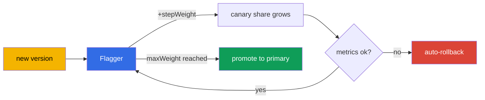

[RU version](ru.md) · [Versión en español](es.md)

# Chapter 25. Progressive delivery with Flagger

> **Part 2 begins** - best practices for real-world operation. Here are topics that are not (or
> almost not) on the exam, but that you need in production. The first is progressive delivery. In
> chapter 6 we did canary by hand, changing the weights in a VirtualService. That works, but it
> requires a human at the wheel. Flagger automates the whole process with metric analysis and
> auto-rollback.

## 25.1. The problem with manual canary

Recall the canary from chapter 6: you change the weights 90/10, then 70/30, look at the dashboards,
and decide whether to move on or roll back. The downsides are obvious:

- **A human is needed.** Someone has to sit there and change weights by hand, watching the metrics.
- **Slow and at night.** Rollouts are often done at an inconvenient time, under supervision.
- **The human factor.** It is easy to miss a rise in errors or latency and ship a bad version.

Progressive delivery removes the manual work: the system itself gradually shifts the traffic, checks
metrics at every step, and either continues or rolls back - without a human.

## 25.2. What Flagger is

**Flagger** is a progressive delivery operator that works on top of Istio (and other meshes). You
describe how the rollout should go with a `Canary` resource, and Flagger itself:

- notices a new version of the deployment;
- gradually shifts traffic to it by changing the weights in the VirtualService/DestinationRule;
- analyzes metrics at each step (success rate, latency);
- with good metrics increases the share, with bad ones - rolls back;
- once the target is reached, "promotes" the new version to the main one (promote).



The key idea: you set the rollout **rules** once, and after that every release follows them
automatically and safely.

## 25.3. How Flagger works with Istio

Flagger does not invent its own routing - it uses the Istio resources we covered in chapters 5 and
6. When you create a `Canary` for the `podinfo` deployment, Flagger deploys all the scaffolding
around it:

- a copy of the deployment, `podinfo-primary` (the stable version that traffic currently goes to);
- the services `podinfo`, `podinfo-canary`, `podinfo-primary`;
- a `DestinationRule` and a `VirtualService` whose weights it manages.

Then, on every update of the source deployment, Flagger itself moves the weights in that
VirtualService - that is, it does exactly what you did by hand in chapter 6, only automatically and
with metric checks.

## 25.4. Installing Flagger

Flagger is not part of Istio - it is installed separately, usually via Helm. It needs two things: to
be told that the mesh is Istio, and to be given the Prometheus address (the metrics from chapter 17
are the basis of the analysis).

```bash
helm repo add flagger https://flagger.app
helm repo update

helm install flagger flagger/flagger \
  -n istio-system \
  --set meshProvider=istio \
  --set metricsServer=http://prometheus.istio-system:9090
```

- **`meshProvider=istio`** - Flagger will manage the weights via Istio's VirtualService/
  DestinationRule.
- **`metricsServer`** - where to take the metrics for analysis (your Prometheus).

For checks and load generation (the webhooks from the `Canary`) you also install the load-tester in
the application's namespace:

```bash
helm install flagger-loadtester flagger/loadtester -n test
```

Prerequisites: an installed Istio (chapters 2-3) and a working Prometheus (chapter 17). Without
metrics Flagger cannot analyze the rollout.

## 25.5. The Canary resource

The whole rollout setup is described in a single resource. Let us go through the key fields:

```yaml
apiVersion: flagger.app/v1beta1
kind: Canary
metadata:
  name: podinfo
  namespace: test
spec:
  targetRef:
    apiVersion: apps/v1
    kind: Deployment
    name: podinfo            # which deployment we are rolling out
  service:
    port: 9898
  analysis:
    interval: 30s            # how often to check
    threshold: 5             # how many failures in a row before a rollback
    maxWeight: 50            # up to which share to drive the canary
    stepWeight: 10           # the weight increase step
    metrics:
    - name: request-success-rate
      thresholdRange:
        min: 99              # success rate no lower than 99%
      interval: 1m
    - name: request-duration
      thresholdRange:
        max: 500             # latency no higher than 500 ms
      interval: 1m
    webhooks:
    - name: load-test
      url: http://flagger-loadtester.test/   # load generation for the check
```

- **`targetRef`** - which deployment we are rolling out.
- **`analysis.interval` / `stepWeight` / `maxWeight`** - the rhythm and steps of the rollout (every
  30s add 10% of traffic, up to 50% max, then promote).
- **`threshold`** - how many failed checks in a row are allowed before an auto-rollback.
- **`metrics`** - what counts as success: request success rate and latency (taken from Istio's
  metrics, chapter 17). This is the automatic "good/bad" criterion.
- **`webhooks`** - external checks: load generation, acceptance tests. Without traffic the metrics
  do not accumulate, so a load test is usually mandatory.

## 25.6. How the rollout goes: promotion and rollback

When you update the image in the `podinfo` deployment, Flagger starts a loop:

1. Directs `stepWeight` percent of traffic to the new version (for example, 10%).
2. Waits `interval` and checks the metrics (success rate, latency).
3. If the metrics are within thresholds - it increases the weight by another step (20%, 30%, ...).
4. If the metrics are bad `threshold` times in a row - it **rolls back**: returns all traffic to
   primary, the canary is discarded.
5. On reaching `maxWeight` with good metrics - a **promotion**: the new version is copied into
   primary and becomes the main one, all traffic on it.

All of this without human involvement. In the Canary logs you can see the progress: `Advance
podinfo.test canary weight 20/40/50` and at the end `Promotion completed!` - or a rollback, if
something went wrong.

The upshot: a bad version will not reach all users - it is cut off automatically at a small share of
traffic, based on objective metrics.

## 25.7. Other rollout strategies

The weighted canary from section 25.5 is only one of the strategies. With the same `Canary` resource
(and the same Istio scaffolding) Flagger can do three more; only the `analysis` block changes.

**Blue/Green** - no gradual weight: the new version first passes N checks "on the side", and only
then is the traffic switched to it entirely. Set via `iterations` without `stepWeight`:

```yaml
  analysis:
    interval: 30s
    threshold: 5
    iterations: 10          # 10 successful checks in a row - and switch 100% at once
    metrics:
    - name: request-success-rate
      thresholdRange: {min: 99}
      interval: 1m
```

**A/B testing** - traffic is split not by weight but by a request attribute: a header or a cookie.
Useful when a new version needs to be shown to a specific segment (beta users, internal staff).
Routing via `match` - the same syntax as in a `VirtualService` (chapters 6 and 15):

```yaml
  analysis:
    interval: 30s
    threshold: 5
    iterations: 10
    match:                  # only requests with this header go to the canary
    - headers:
        x-canary:
          exact: "insider"
    metrics:
    - name: request-success-rate
      thresholdRange: {min: 99}
      interval: 1m
```

**Traffic mirroring (shadowing)** - a copy of the requests is mirrored to the canary, but the
canary's response is **not returned** to the user (chapter 11). This way a new version is checked on
real traffic with no risk to users at all:

```yaml
  analysis:
    interval: 30s
    threshold: 5
    iterations: 10
    mirror: true            # duplicate the traffic to the canary, discard the response
    metrics:
    - name: request-success-rate
      thresholdRange: {min: 99}
      interval: 1m
```

The choice of strategy depends on the risk and the task: canary is the universal default, Blue/Green
is for when you cannot keep two versions under load at once, A/B is for a targeted check, mirroring
is for a "live" check without affecting users.

## 25.8. Custom metrics: MetricTemplate

The built-in `request-success-rate` and `request-duration` are not always enough: sometimes the
success criterion is a business metric (conversion, the error rate of a specific endpoint) or a
metric from an external system. For this there is a separate CRD, `MetricTemplate`: in it you
describe a provider and an arbitrary query returning a number, and then reference the template from
the `Canary`.

```yaml
apiVersion: flagger.app/v1beta1
kind: MetricTemplate
metadata:
  name: not-found-percentage
  namespace: test
spec:
  provider:
    type: prometheus
    address: http://prometheus.istio-system:9090
  query: |                                   # the share of 404s in the total requests to the canary
    100 - sum(
        rate(istio_requests_total{
          destination_workload="podinfo",
          response_code!="404"
        }[{{ interval }}])
    )
    /
    sum(
        rate(istio_requests_total{
          destination_workload="podinfo"
        }[{{ interval }}])
    ) * 100
```

Now this template is plugged into the `Canary` on par with the built-in metrics via `templateRef`:

```yaml
  analysis:
    metrics:
    - name: "404s percentage"
      templateRef:
        name: not-found-percentage          # a reference to the MetricTemplate above
        namespace: test
      thresholdRange:
        max: 5                               # no more than 5% of 404 responses
      interval: 1m
```

The provider can be more than just Prometheus: Flagger supports, among others, CloudWatch, Datadog,
New Relic and others - that is, the rollback criterion can be built even on AWS metrics (see the next
sections). Flagger substitutes the `{{ interval }}` template and other variables itself at each
analysis step.

## 25.9. Webhooks: checks and manual gates

In section 25.5 we saw one webhook - the load generator. In fact Flagger calls hooks at various
phases of the rollout, and this is a powerful control tool. The main types:

- **`confirm-rollout`** - a gate **before** the rollout starts: until the hook returns 200, the
  rollout does not begin (for example, we wait for approval or a release window).
- **`pre-rollout`** - acceptance tests of the new version **before** ramping up traffic; a failure
  stops the rollout.
- **`rollout`** - load generation during the analysis (that same load test).
- **`confirm-promotion`** - a manual gate **before** the promotion: handy when the final switch must
  be confirmed by a human.
- **`post-rollout`** - actions after a successful promotion (cleanup, notifications).
- **`rollback`** - called on a rollback.
- **`event`** - Flagger sends all rollout events here (for external systems/alerts).

Example: an acceptance test before traffic, plus a manual gate on the promotion.

```yaml
  analysis:
    webhooks:
    - name: acceptance-test
      type: pre-rollout                       # a test BEFORE ramping up traffic
      url: http://flagger-loadtester.test/
      timeout: 30s
      metadata:
        type: bash
        cmd: "curl -sd 'test' http://podinfo-canary.test:9898/token | grep token"
    - name: load-test
      type: rollout                           # load during the analysis
      url: http://flagger-loadtester.test/
      metadata:
        cmd: "hey -z 1m -q 10 -c 2 http://podinfo-canary.test:9898/"
    - name: manual-gate
      type: confirm-promotion                 # a human confirms the promotion
      url: http://flagger-loadtester.test/gate/halt
```

The manual gate `confirm-promotion` holds the rollout at `maxWeight` until it is allowed to move on
(via the load-tester's API: `gate/open`). This combines automatic analysis and human control: the
machine checks the metrics, and the final word is a human's, if the release calls for it.

## 25.10. Example: step-by-step adoption and control

Let us go through a concrete example: we have an ordinary `podinfo` deployment, and we want its
releases to go through Flagger. We will walk the whole path step by step.

### Initial setup

**Step 1. Prerequisites.** Istio is installed (chapters 2-3), Prometheus works (chapter 17), Flagger
and the load-tester are installed (section 25.4), the namespace is labeled for injection:

```bash
kubectl create namespace test
kubectl label namespace test istio-injection=enabled
```

**Step 2. Deploy the application.** An ordinary Deployment and Service - nothing special:

```bash
kubectl apply -n test -f podinfo-deployment.yaml   # Deployment + Service :9898
kubectl get pods -n test          # check: pods 2/2 (the sidecar is in place)
```

**Step 3. Create the Canary resource** (from section 25.5) and wait for initialization:

```bash
kubectl apply -n test -f podinfo-canary.yaml
kubectl -n test get canary podinfo -w
```

**Control at this step.** Wait for the `Initialized` status. Make sure Flagger created all the
scaffolding:

```bash
kubectl -n test get canary podinfo     # STATUS: Initialized
kubectl -n test get deploy             # podinfo-primary appeared
kubectl -n test get svc                # podinfo, podinfo-canary, podinfo-primary
kubectl -n test get vs,dr              # VirtualService and DestinationRule created
```

If it got stuck at something other than `Initialized` - look at the Flagger logs:
`kubectl logs -n istio-system deploy/flagger`.

### Everyday use

After that life is simple: **you just update the deployment's image, and Flagger does everything
else.**

**Step 4. Start a release** - change the image version:

```bash
kubectl -n test set image deployment/podinfo podinfod=stefanprodan/podinfo:6.1.0
```

**Step 5. Watch the rollout.** Flagger itself starts moving traffic and checking metrics:

```bash
kubectl -n test get canary podinfo -w
```

**Control in progress.** The status goes through `Progressing` and ends at `Succeeded` (or `Failed`
on a rollback). The details are visible in the events:

```bash
kubectl -n test describe canary podinfo
# ... Advance podinfo.test canary weight 10
# ... Advance podinfo.test canary weight 20
# ... Promotion completed!
```

**Step 6. What you see on a problem.** If the new version worsened the metrics, Flagger rolls the
traffic back itself, the status becomes `Failed`, and the events show the reason (for example, the
latency was exceeded). Users are barely affected - the bad version got only a small share of
traffic.

### How to control it day to day

- **The Canary status** is the main indicator: `kubectl get canary -A` shows all rollouts and their
  state (`Progressing`/`Succeeded`/`Failed`).
- **The Flagger dashboard in Grafana** visually shows the rollout progress and metrics.
- **Alerts on `Failed`** - set up notifications (Flagger can send to Slack/webhook) so the team
  knows about rollbacks immediately.
- **Events and logs** - `describe canary` and the Flagger logs to investigate why a rollout went
  wrong.

The point is that after the initial setup, a daily release comes down to updating the image - Flagger
takes on all the safety control, and it is left to you to watch the status and react to alerts.

### An example of Prometheus alerts

So that "understanding that something went wrong" is not manual but automatic, set up alerts on
Istio metrics (chapter 17). They are declared as a `PrometheusRule` (for the Prometheus Operator).
Here are three basic rules.

```yaml
apiVersion: monitoring.coreos.com/v1
kind: PrometheusRule
metadata:
  name: istio-app-alerts
  namespace: monitoring
spec:
  groups:
  - name: istio.rules
    rules:
    # 1. High 5xx error rate (> 5% over 5 minutes)
    - alert: HighErrorRate
      expr: |
        sum(rate(istio_requests_total{destination_workload="podinfo", response_code=~"5.."}[5m]))
        / sum(rate(istio_requests_total{destination_workload="podinfo"}[5m])) > 0.05
      for: 2m
      labels: {severity: critical}
      annotations:
        summary: "Many 5xx on podinfo (>5%)"

    # 2. High p99 latency (> 500 ms)
    - alert: HighLatencyP99
      expr: |
        histogram_quantile(0.99,
          sum(rate(istio_request_duration_milliseconds_bucket{destination_workload="podinfo"}[5m])) by (le)
        ) > 500
      for: 5m
      labels: {severity: warning}
      annotations:
        summary: "podinfo p99 latency above 500 ms"

    # 3. Flagger rolled the rollout back
    - alert: CanaryFailed
      expr: flagger_canary_status{name="podinfo"} == 2
      for: 1m
      labels: {severity: critical}
      annotations:
        summary: "Flagger rolled back the podinfo canary rollout"
```

Let us break it down:

- **HighErrorRate** - computes the share of `5xx` responses out of the total requests to the service
  using the `istio_requests_total` metric. The 5%-over-5-minutes threshold is the same signal that
  Flagger itself goes by.
- **HighLatencyP99** - takes the 99th percentile of latency from the
  `istio_request_duration_milliseconds_bucket` histogram. A rise in p99 is often the first sign of
  problems.
- **CanaryFailed** - watches Flagger's own metric: a value of `2` means the rollout failed (verify
  the exact status values against the Flagger documentation - they may differ between versions).

These alerts complement the Canary status: Flagger itself rolls the bad version back, and Prometheus
notifies the team that the rollback happened and why (errors or latency).

## 25.11. Flagger on EKS/AWS

The basis of Flagger's analysis is metrics (chapter 17), and on EKS their source is often not an
in-cluster Prometheus but AWS managed services. The key points.

**Metrics from Amazon Managed Prometheus (AMP).** Instead of a self-hosted Prometheus, Istio's
metrics can be written into AMP and fed to Flagger from there too. The difference from an ordinary
`metricsServer` is that queries to AMP must be signed with SigV4 (IAM-based access). Usually a proxy
sidecar (for example, `aws-sigv4-proxy`) is placed between Flagger and AMP, which signs the requests
via IRSA, and Flagger talks to it like an ordinary Prometheus:

```yaml
# A MetricTemplate pointing at the SigV4 proxy in front of AMP
apiVersion: flagger.app/v1beta1
kind: MetricTemplate
metadata:
  name: success-rate-amp
  namespace: test
spec:
  provider:
    type: prometheus
    address: http://localhost:8005            # sigv4-proxy -> AMP workspace
  query: |
    100 - sum(
        rate(istio_requests_total{
          destination_workload="podinfo",
          response_code=~"5.."
        }[{{ interval }}])
    )
    /
    sum(rate(istio_requests_total{destination_workload="podinfo"}[{{ interval }}])) * 100
```

The "canary + rollback on AMP metrics + Flagger" scheme is described in the
[official AWS blog](https://aws.amazon.com/blogs/opensource/performing-canary-deployments-and-metrics-driven-rollback-with-amazon-managed-service-for-prometheus-and-flagger).

**Rollback notifications to Slack/SNS.** Flagger can send events via the `event` webhook or built-in
alerts. On AWS it is convenient to route rollbacks into SNS (and from there - to Chatbot/Slack,
email, PagerDuty) so the team learns about a `Failed` at once.

**The Gateway API provider.** If instead of the classic Gateway/VirtualService you use the Gateway
API (chapter 11), Flagger can manage the weights through it too - `meshProvider=gatewayapi`. Useful
on EKS with ingress controllers that implement the Gateway API. The analysis and rollback logic is
the same.

## 25.12. Best practices for production

- **The right metrics and thresholds are the foundation of everything.** Flagger is only as good as
  the criteria are accurate. Start with request success rate and latency (p99), and if needed add
  custom metrics (including business metrics, chapter 18).
- **Thresholds from a real baseline.** Do not set thresholds at random. Take the service's normal
  metric values and set thresholds with a margin, otherwise you will get false rollbacks.
- **Always generate load.** Without traffic the metrics do not accumulate and the analysis will not
  work. Set up a load-test webhook or rely on real traffic.
- **Conservative steps for critical services.** A small `stepWeight` and a reasonable `interval`
  give the metrics time to accumulate. Too fast a rollout will not catch the problem in time.
- **Acceptance tests via webhooks.** Before ramping up traffic, run acceptance tests of the new
  version - this catches functional regressions that are not visible in success-rate metrics.
- **Alerts on rollbacks.** An auto-rollback is a signal that the version is bad. Set up
  notifications so the team learns about them immediately.
- **Test the process itself in staging.** Make sure the rollout, promotion and rollback work before
  trusting Flagger with production.

## 25.13. Chapter summary

- Progressive delivery automates canary: the system moves the traffic itself, checks metrics and
  rolls back, with no manual work.
- **Flagger** is an operator on top of Istio; it manages the weights in the
  VirtualService/DestinationRule by the rules from the `Canary` resource. It is installed separately
  via Helm with `meshProvider=istio` and the Prometheus address; for load - the load-tester.
- Flagger deploys the scaffolding (a primary deployment, services, DR, VS) and moves the weights
  automatically on each update.
- In the `Canary` you set the rhythm (`interval`, `stepWeight`, `maxWeight`), the criteria
  (`metrics` + `thresholdRange`), the error tolerance (`threshold`) and the checks (`webhooks`).
- The same resource does the other strategies too: **Blue/Green** (`iterations` without
  `stepWeight`), **A/B** (`match` on headers/cookies), **mirroring** (`mirror: true`).
- Your own criteria are set via a `MetricTemplate` - an arbitrary query to Prometheus, CloudWatch,
  Datadog, etc. (including business metrics), plugged into the `Canary` by `templateRef`.
- **Webhooks** are called at various phases: `confirm-rollout`/`confirm-promotion` (manual gates),
  `pre-rollout` (acceptance tests), `rollout` (load), `rollback`, `event`.
- A good version is gradually promoted into primary, a bad one is automatically rolled back at a
  small share of traffic.
- On EKS/AWS metrics are often taken from **Amazon Managed Prometheus** (queries via a SigV4
  proxy/IRSA), rollbacks are sent to **SNS/Slack**; with the Gateway API - `meshProvider=gatewayapi`.
- After the initial setup (deployment -> Canary -> `Initialized` with scaffolding) a daily release =
  update the image; control is done by the Canary status
  (`Progressing`/`Succeeded`/`Failed`), the Grafana dashboard and rollback alerts.
- Best practices: accurate metrics and thresholds from a baseline, load generation, conservative
  steps, acceptance tests, rollback alerts, a trial run in staging.

## 25.14. Self-check questions

1. Which downsides of manual canary does progressive delivery solve?
2. What does Flagger do and how is it related to Istio resources?
3. What are `stepWeight`, `maxWeight`, `interval` and `threshold` responsible for in a `Canary`?
4. Why is traffic (load) mandatory for Flagger to work?
5. Why should metric thresholds be taken from a real baseline and not at random?
6. How do the canary, Blue/Green, A/B and mirroring strategies differ, and when do you pick which?
7. What is a `MetricTemplate` for and how do you plug your own metric into a `Canary`?
8. What are the `confirm-promotion` and `pre-rollout` hooks for?
9. How does Flagger's analysis work on EKS with Amazon Managed Prometheus and how does it differ
   from an in-cluster Prometheus?
10. Describe the path from an ordinary deployment to automatic releases through Flagger. How do you
    control the initial setup and how - the daily rollouts?

## Practice

Practice automatic canary with Flagger: updating the version, analyzing metrics, auto-promotion and
auto-rollback:

🧪 Lab 25: [tasks/ica/labs/25](../../labs/25/README.MD)

---
[Contents](../README.md) · [Chapter 24](../24/en.md) · [Chapter 26](../26/en.md)
