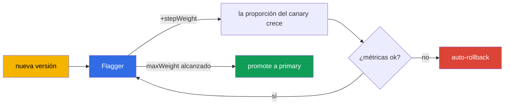

[RU version](ru.md) · [Eng version](en.md) · [Version française](fr.md) · [Deutsche Version](de.md)

# Capítulo 25. Progressive delivery con Flagger

> **Empieza la Parte 2**: buenas prácticas para la operación en el mundo real. Aquí hay temas que no
> están (o casi no están) en el examen, pero que necesitas en producción. El primero es el progressive
> delivery. En el capítulo 6 hicimos canary a mano, cambiando los pesos en un VirtualService. Eso
> funciona, pero requiere un humano al volante. Flagger automatiza todo el proceso con análisis de
> métricas y auto-rollback.

## 25.1. El problema del canary manual

Recuerda el canary del capítulo 6: cambias los pesos 90/10, luego 70/30, miras los dashboards y decides
si seguir o retroceder. Los inconvenientes son evidentes:

- **Hace falta un humano.** Alguien tiene que estar ahí cambiando pesos a mano, vigilando las métricas.
- **Lento y de noche.** Los rollouts a menudo se hacen a una hora incómoda, bajo supervisión.
- **El factor humano.** Es fácil pasar por alto un aumento de errores o de latencia y publicar una mala
  versión.

El progressive delivery elimina el trabajo manual: el sistema mismo desplaza el tráfico de forma
gradual, comprueba las métricas en cada paso y o bien continúa o retrocede, sin un humano.

## 25.2. Qué es Flagger

**Flagger** es un operador de progressive delivery que trabaja sobre Istio (y otras mallas). Describes
cómo debe ir el rollout con un recurso `Canary`, y Flagger mismo:

- detecta una nueva versión del deployment;
- desplaza el tráfico hacia ella de forma gradual cambiando los pesos en el VirtualService/
  DestinationRule;
- analiza las métricas en cada paso (success rate, latencia);
- con buenas métricas aumenta la proporción, con malas retrocede;
- una vez alcanzado el objetivo, "promociona" la nueva versión a la principal (promote).



La idea clave: fijas las **reglas** del rollout una vez, y a partir de ahí cada release las sigue de
forma automática y segura.

## 25.3. Cómo trabaja Flagger con Istio

Flagger no inventa su propio enrutamiento: usa los recursos de Istio que cubrimos en los capítulos 5 y
6. Cuando creas un `Canary` para el deployment `podinfo`, Flagger despliega todo el andamiaje a su
alrededor:

- una copia del deployment, `podinfo-primary` (la versión estable a la que va el tráfico ahora mismo);
- los servicios `podinfo`, `podinfo-canary`, `podinfo-primary`;
- una `DestinationRule` y un `VirtualService` cuyos pesos gestiona.

Luego, en cada actualización del deployment de origen, Flagger mismo mueve los pesos en ese
VirtualService, es decir, hace exactamente lo que hacías a mano en el capítulo 6, solo que de forma
automática y con comprobaciones de métricas.

## 25.4. Instalar Flagger

Flagger no forma parte de Istio; se instala por separado, normalmente vía Helm. Necesita dos cosas: que
le digas que la malla es Istio, y que le des la dirección de Prometheus (las métricas del capítulo 17
son la base del análisis).

```bash
helm repo add flagger https://flagger.app
helm repo update

helm install flagger flagger/flagger \
  -n istio-system \
  --set meshProvider=istio \
  --set metricsServer=http://prometheus.istio-system:9090
```

- **`meshProvider=istio`**: Flagger gestionará los pesos vía el VirtualService/DestinationRule de Istio.
- **`metricsServer`**: de dónde tomar las métricas para el análisis (tu Prometheus).

Para las comprobaciones y la generación de carga (los webhooks del `Canary`) también instalas el
load-tester en el namespace de la aplicación:

```bash
helm install flagger-loadtester flagger/loadtester -n test
```

Prerrequisitos: un Istio instalado (capítulos 2-3) y un Prometheus funcional (capítulo 17). Sin métricas
Flagger no puede analizar el rollout.

## 25.5. El recurso Canary

Toda la configuración del rollout se describe en un único recurso. Repasemos los campos clave:

```yaml
apiVersion: flagger.app/v1beta1
kind: Canary
metadata:
  name: podinfo
  namespace: test
spec:
  targetRef:
    apiVersion: apps/v1
    kind: Deployment
    name: podinfo            # qué deployment estamos desplegando
  service:
    port: 9898
  analysis:
    interval: 30s            # cada cuánto comprobar
    threshold: 5             # cuántos fallos seguidos antes de un rollback
    maxWeight: 50            # hasta qué proporción llevar el canary
    stepWeight: 10           # el paso de aumento del peso
    metrics:
    - name: request-success-rate
      thresholdRange:
        min: 99              # success rate no inferior al 99%
      interval: 1m
    - name: request-duration
      thresholdRange:
        max: 500             # latencia no superior a 500 ms
      interval: 1m
    webhooks:
    - name: load-test
      url: http://flagger-loadtester.test/   # generación de carga para la comprobación
```

- **`targetRef`**: qué deployment estamos desplegando.
- **`analysis.interval` / `stepWeight` / `maxWeight`**: el ritmo y los pasos del rollout (cada 30s
  añadir un 10% de tráfico, hasta un 50% máximo, luego promote).
- **`threshold`**: cuántas comprobaciones fallidas seguidas se permiten antes de un auto-rollback.
- **`metrics`**: qué cuenta como éxito: la success rate de las peticiones y la latencia (tomadas de las
  métricas de Istio, capítulo 17). Este es el criterio automático de "bueno/malo".
- **`webhooks`**: comprobaciones externas: generación de carga, tests de aceptación. Sin tráfico las
  métricas no se acumulan, así que un load test suele ser obligatorio.

## 25.6. Cómo va el rollout: promoción y rollback

Cuando actualizas la imagen en el deployment `podinfo`, Flagger inicia un bucle:

1. Dirige `stepWeight` por ciento del tráfico a la nueva versión (por ejemplo, un 10%).
2. Espera `interval` y comprueba las métricas (success rate, latencia).
3. Si las métricas están dentro de los umbrales, aumenta el peso otro paso (20%, 30%, ...).
4. Si las métricas son malas `threshold` veces seguidas, **retrocede**: devuelve todo el tráfico a
   primary, el canary se descarta.
5. Al alcanzar `maxWeight` con buenas métricas, una **promoción**: la nueva versión se copia en primary
   y se convierte en la principal, todo el tráfico sobre ella.

Todo esto sin intervención humana. En los logs del Canary puedes ver el progreso: `Advance podinfo.test
canary weight 20/40/50` y al final `Promotion completed!`, o un rollback, si algo salió mal.

La conclusión: una mala versión no llegará a todos los usuarios; se corta automáticamente en una
proporción pequeña de tráfico, basándose en métricas objetivas.

## 25.7. Otras estrategias de rollout

El canary por pesos de la sección 25.5 es solo una de las estrategias. Con el mismo recurso `Canary` (y
el mismo andamiaje de Istio) Flagger puede hacer tres más; solo cambia el bloque `analysis`.

**Blue/Green**: sin pesos graduales: la nueva versión primero pasa N comprobaciones "aparte", y solo
entonces se conmuta el tráfico entero hacia ella. Se fija vía `iterations` sin `stepWeight`:

```yaml
  analysis:
    interval: 30s
    threshold: 5
    iterations: 10          # 10 comprobaciones exitosas seguidas - y conmuta el 100% de golpe
    metrics:
    - name: request-success-rate
      thresholdRange: {min: 99}
      interval: 1m
```

**A/B testing**: el tráfico se divide no por peso sino por un atributo de la petición: una cabecera o
una cookie. Útil cuando hay que mostrar una nueva versión a un segmento concreto (usuarios beta,
personal interno). El enrutamiento vía `match`, la misma sintaxis que en un `VirtualService` (capítulos
6 y 15):

```yaml
  analysis:
    interval: 30s
    threshold: 5
    iterations: 10
    match:                  # solo las peticiones con esta cabecera van al canary
    - headers:
        x-canary:
          exact: "insider"
    metrics:
    - name: request-success-rate
      thresholdRange: {min: 99}
      interval: 1m
```

**Traffic mirroring (shadowing)**: una copia de las peticiones se refleja hacia el canary, pero la
respuesta del canary **no se devuelve** al usuario (capítulo 11). Así una nueva versión se comprueba con
tráfico real sin ningún riesgo para los usuarios:

```yaml
  analysis:
    interval: 30s
    threshold: 5
    iterations: 10
    mirror: true            # duplicar el tráfico hacia el canary, descartar la respuesta
    metrics:
    - name: request-success-rate
      thresholdRange: {min: 99}
      interval: 1m
```

La elección de la estrategia depende del riesgo y de la tarea: canary es el valor por defecto universal,
Blue/Green es para cuando no puedes mantener dos versiones bajo carga a la vez, A/B es para una
comprobación dirigida, mirroring es para una comprobación "en vivo" sin afectar a los usuarios.

## 25.8. Métricas personalizadas: MetricTemplate

Los `request-success-rate` y `request-duration` integrados no siempre bastan: a veces el criterio de
éxito es una métrica de negocio (conversión, la tasa de error de un endpoint concreto) o una métrica de
un sistema externo. Para esto existe un CRD aparte, `MetricTemplate`: en él describes un proveedor y una
query arbitraria que devuelve un número, y luego referencias la plantilla desde el `Canary`.

```yaml
apiVersion: flagger.app/v1beta1
kind: MetricTemplate
metadata:
  name: not-found-percentage
  namespace: test
spec:
  provider:
    type: prometheus
    address: http://prometheus.istio-system:9090
  query: |                                   # la proporción de 404 sobre el total de peticiones al canary
    100 - sum(
        rate(istio_requests_total{
          destination_workload="podinfo",
          response_code!="404"
        }[{{ interval }}])
    )
    /
    sum(
        rate(istio_requests_total{
          destination_workload="podinfo"
        }[{{ interval }}])
    ) * 100
```

Ahora esta plantilla se enchufa en el `Canary` a la par que las métricas integradas vía `templateRef`:

```yaml
  analysis:
    metrics:
    - name: "404s percentage"
      templateRef:
        name: not-found-percentage          # una referencia al MetricTemplate de arriba
        namespace: test
      thresholdRange:
        max: 5                               # no más de un 5% de respuestas 404
      interval: 1m
```

El proveedor puede ser algo más que Prometheus: Flagger admite, entre otros, CloudWatch, Datadog, New
Relic y otros, es decir, el criterio de rollback se puede construir incluso sobre métricas de AWS (ver
las siguientes secciones). Flagger sustituye la plantilla `{{ interval }}` y otras variables por sí
mismo en cada paso del análisis.

## 25.9. Webhooks: comprobaciones y gates manuales

En la sección 25.5 vimos un webhook: el generador de carga. En realidad Flagger llama a hooks en varias
fases del rollout, y esto es una potente herramienta de control. Los tipos principales:

- **`confirm-rollout`**: un gate **antes** de que arranque el rollout: hasta que el hook devuelva 200, el
  rollout no comienza (por ejemplo, esperamos una aprobación o una ventana de release).
- **`pre-rollout`**: tests de aceptación de la nueva versión **antes** de subir el tráfico; un fallo
  detiene el rollout.
- **`rollout`**: generación de carga durante el análisis (ese mismo load test).
- **`confirm-promotion`**: un gate manual **antes** de la promoción: útil cuando la conmutación final
  debe confirmarla un humano.
- **`post-rollout`**: acciones tras una promoción exitosa (limpieza, notificaciones).
- **`rollback`**: se llama en un rollback.
- **`event`**: Flagger envía aquí todos los eventos del rollout (para sistemas externos/alertas).

Ejemplo: un test de aceptación antes del tráfico, más un gate manual en la promoción.

```yaml
  analysis:
    webhooks:
    - name: acceptance-test
      type: pre-rollout                       # un test ANTES de subir el tráfico
      url: http://flagger-loadtester.test/
      timeout: 30s
      metadata:
        type: bash
        cmd: "curl -sd 'test' http://podinfo-canary.test:9898/token | grep token"
    - name: load-test
      type: rollout                           # carga durante el análisis
      url: http://flagger-loadtester.test/
      metadata:
        cmd: "hey -z 1m -q 10 -c 2 http://podinfo-canary.test:9898/"
    - name: manual-gate
      type: confirm-promotion                 # un humano confirma la promoción
      url: http://flagger-loadtester.test/gate/halt
```

El gate manual `confirm-promotion` retiene el rollout en `maxWeight` hasta que se permite seguir (vía la
API del load-tester: `gate/open`). Esto combina el análisis automático y el control humano: la máquina
comprueba las métricas, y la última palabra es de un humano, si el release lo exige.

## 25.10. Ejemplo: adopción y control paso a paso

Repasemos un ejemplo concreto: tenemos un deployment `podinfo` corriente, y queremos que sus releases
pasen por Flagger. Recorreremos todo el camino paso a paso.

### Configuración inicial

**Paso 1. Prerrequisitos.** Istio está instalado (capítulos 2-3), Prometheus funciona (capítulo 17),
Flagger y el load-tester están instalados (sección 25.4), el namespace está etiquetado para la
inyección:

```bash
kubectl create namespace test
kubectl label namespace test istio-injection=enabled
```

**Paso 2. Despliega la aplicación.** Un Deployment y un Service corrientes, nada especial:

```bash
kubectl apply -n test -f podinfo-deployment.yaml   # Deployment + Service :9898
kubectl get pods -n test          # comprueba: pods 2/2 (el sidecar está en su sitio)
```

**Paso 3. Crea el recurso Canary** (de la sección 25.5) y espera la inicialización:

```bash
kubectl apply -n test -f podinfo-canary.yaml
kubectl -n test get canary podinfo -w
```

**Control en este paso.** Espera el estado `Initialized`. Asegúrate de que Flagger creó todo el
andamiaje:

```bash
kubectl -n test get canary podinfo     # STATUS: Initialized
kubectl -n test get deploy             # apareció podinfo-primary
kubectl -n test get svc                # podinfo, podinfo-canary, podinfo-primary
kubectl -n test get vs,dr              # VirtualService y DestinationRule creados
```

Si se atascó en algo distinto de `Initialized`, mira los logs de Flagger: `kubectl logs -n istio-system
deploy/flagger`.

### Uso cotidiano

Después de eso la vida es sencilla: **simplemente actualizas la imagen del deployment, y Flagger hace
todo lo demás.**

**Paso 4. Inicia un release**: cambia la versión de la imagen:

```bash
kubectl -n test set image deployment/podinfo podinfod=stefanprodan/podinfo:6.1.0
```

**Paso 5. Observa el rollout.** Flagger mismo empieza a mover el tráfico y a comprobar las métricas:

```bash
kubectl -n test get canary podinfo -w
```

**Control en progreso.** El estado pasa por `Progressing` y termina en `Succeeded` (o `Failed` en un
rollback). Los detalles son visibles en los events:

```bash
kubectl -n test describe canary podinfo
# ... Advance podinfo.test canary weight 10
# ... Advance podinfo.test canary weight 20
# ... Promotion completed!
```

**Paso 6. Qué ves ante un problema.** Si la nueva versión empeoró las métricas, Flagger devuelve el
tráfico por sí mismo, el estado pasa a `Failed`, y los events muestran la razón (por ejemplo, se superó
la latencia). Los usuarios apenas se ven afectados: la mala versión recibió solo una pequeña proporción
de tráfico.

### Cómo controlarlo en el día a día

- **El estado del Canary** es el indicador principal: `kubectl get canary -A` muestra todos los rollouts
  y su estado (`Progressing`/`Succeeded`/`Failed`).
- **El dashboard de Flagger en Grafana** muestra visualmente el progreso del rollout y las métricas.
- **Alertas sobre `Failed`**: configura notificaciones (Flagger puede enviar a Slack/webhook) para que
  el equipo se entere de los rollbacks de inmediato.
- **Events y logs**: `describe canary` y los logs de Flagger para investigar por qué un rollout salió
  mal.

La idea es que, tras la configuración inicial, un release diario se reduce a actualizar la imagen;
Flagger asume todo el control de seguridad, y a ti te queda vigilar el estado y reaccionar a las alertas.

### Un ejemplo de alertas de Prometheus

Para que "entender que algo salió mal" no sea manual sino automático, configura alertas sobre las
métricas de Istio (capítulo 17). Se declaran como un `PrometheusRule` (para el Prometheus Operator).
Aquí van tres reglas básicas.

```yaml
apiVersion: monitoring.coreos.com/v1
kind: PrometheusRule
metadata:
  name: istio-app-alerts
  namespace: monitoring
spec:
  groups:
  - name: istio.rules
    rules:
    # 1. Alta tasa de errores 5xx (> 5% en 5 minutos)
    - alert: HighErrorRate
      expr: |
        sum(rate(istio_requests_total{destination_workload="podinfo", response_code=~"5.."}[5m]))
        / sum(rate(istio_requests_total{destination_workload="podinfo"}[5m])) > 0.05
      for: 2m
      labels: {severity: critical}
      annotations:
        summary: "Muchos 5xx en podinfo (>5%)"

    # 2. Alta latencia p99 (> 500 ms)
    - alert: HighLatencyP99
      expr: |
        histogram_quantile(0.99,
          sum(rate(istio_request_duration_milliseconds_bucket{destination_workload="podinfo"}[5m])) by (le)
        ) > 500
      for: 5m
      labels: {severity: warning}
      annotations:
        summary: "latencia p99 de podinfo por encima de 500 ms"

    # 3. Flagger hizo rollback del rollout
    - alert: CanaryFailed
      expr: flagger_canary_status{name="podinfo"} == 2
      for: 1m
      labels: {severity: critical}
      annotations:
        summary: "Flagger hizo rollback del rollout canary de podinfo"
```

Desglosémoslo:

- **HighErrorRate**: calcula la proporción de respuestas `5xx` sobre el total de peticiones al servicio
  usando la métrica `istio_requests_total`. El umbral del 5% en 5 minutos es la misma señal por la que se
  guía el propio Flagger.
- **HighLatencyP99**: toma el percentil 99 de la latencia del histograma
  `istio_request_duration_milliseconds_bucket`. Un aumento del p99 suele ser la primera señal de
  problemas.
- **CanaryFailed**: vigila la propia métrica de Flagger: un valor de `2` significa que el rollout falló
  (verifica los valores exactos del estado contra la documentación de Flagger; pueden diferir entre
  versiones).

Estas alertas complementan el estado del Canary: Flagger mismo hace rollback de la mala versión, y
Prometheus notifica al equipo que el rollback ocurrió y por qué (errores o latencia).

## 25.11. Flagger en EKS/AWS

La base del análisis de Flagger son las métricas (capítulo 17), y en EKS su fuente a menudo no es un
Prometheus dentro del clúster sino servicios gestionados de AWS. Los puntos clave.

**Métricas de Amazon Managed Prometheus (AMP).** En lugar de un Prometheus autoalojado, las métricas de
Istio se pueden escribir en AMP y alimentárselas a Flagger desde ahí también. La diferencia respecto a
un `metricsServer` corriente es que las queries a AMP deben firmarse con SigV4 (acceso basado en IAM).
Normalmente se coloca un proxy sidecar (por ejemplo, `aws-sigv4-proxy`) entre Flagger y AMP, que firma
las peticiones vía IRSA, y Flagger habla con él como con un Prometheus corriente:

```yaml
# Un MetricTemplate apuntando al proxy SigV4 delante de AMP
apiVersion: flagger.app/v1beta1
kind: MetricTemplate
metadata:
  name: success-rate-amp
  namespace: test
spec:
  provider:
    type: prometheus
    address: http://localhost:8005            # sigv4-proxy -> workspace de AMP
  query: |
    100 - sum(
        rate(istio_requests_total{
          destination_workload="podinfo",
          response_code=~"5.."
        }[{{ interval }}])
    )
    /
    sum(rate(istio_requests_total{destination_workload="podinfo"}[{{ interval }}])) * 100
```

El esquema "canary + rollback sobre métricas de AMP + Flagger" está descrito en el
[blog oficial de AWS](https://aws.amazon.com/blogs/opensource/performing-canary-deployments-and-metrics-driven-rollback-with-amazon-managed-service-for-prometheus-and-flagger).

**Notificaciones de rollback a Slack/SNS.** Flagger puede enviar eventos vía el webhook `event` o
alertas integradas. En AWS es cómodo enrutar los rollbacks hacia SNS (y de ahí a Chatbot/Slack, email,
PagerDuty) para que el equipo se entere de un `Failed` de inmediato.

**El proveedor Gateway API.** Si en lugar del clásico Gateway/VirtualService usas la Gateway API
(capítulo 11), Flagger también puede gestionar los pesos a través de ella: `meshProvider=gatewayapi`.
Útil en EKS con ingress controllers que implementan la Gateway API. La lógica de análisis y rollback es
la misma.

## 25.12. Buenas prácticas para producción

- **Las métricas y los umbrales correctos son la base de todo.** Flagger es tan bueno como precisos sean
  los criterios. Empieza con la success rate de las peticiones y la latencia (p99), y si hace falta
  añade métricas personalizadas (incluidas las de negocio, capítulo 18).
- **Umbrales a partir de un baseline real.** No fijes umbrales al azar. Toma los valores normales de las
  métricas del servicio y fija umbrales con un margen, de lo contrario obtendrás rollbacks falsos.
- **Genera carga siempre.** Sin tráfico las métricas no se acumulan y el análisis no funcionará.
  Configura un webhook de load-test o apóyate en tráfico real.
- **Pasos conservadores para servicios críticos.** Un `stepWeight` pequeño y un `interval` razonable dan
  tiempo a las métricas para acumularse. Un rollout demasiado rápido no atrapará el problema a tiempo.
- **Tests de aceptación vía webhooks.** Antes de subir el tráfico, ejecuta tests de aceptación de la
  nueva versión; esto atrapa regresiones funcionales que no se ven en las métricas de success rate.
- **Alertas sobre rollbacks.** Un auto-rollback es una señal de que la versión es mala. Configura
  notificaciones para que el equipo se entere de inmediato.
- **Prueba el proceso mismo en staging.** Asegúrate de que el rollout, la promoción y el rollback
  funcionan antes de confiarle producción a Flagger.

## 25.13. Resumen del capítulo

- El progressive delivery automatiza el canary: el sistema mueve el tráfico por sí mismo, comprueba las
  métricas y hace rollback, sin trabajo manual.
- **Flagger** es un operador sobre Istio; gestiona los pesos en el VirtualService/DestinationRule según
  las reglas del recurso `Canary`. Se instala por separado vía Helm con `meshProvider=istio` y la
  dirección de Prometheus; para la carga, el load-tester.
- Flagger despliega el andamiaje (un deployment primary, servicios, DR, VS) y mueve los pesos de forma
  automática en cada actualización.
- En el `Canary` fijas el ritmo (`interval`, `stepWeight`, `maxWeight`), los criterios (`metrics` +
  `thresholdRange`), la tolerancia a errores (`threshold`) y las comprobaciones (`webhooks`).
- El mismo recurso hace también las otras estrategias: **Blue/Green** (`iterations` sin `stepWeight`),
  **A/B** (`match` sobre cabeceras/cookies), **mirroring** (`mirror: true`).
- Tus propios criterios se fijan vía un `MetricTemplate`: una query arbitraria a Prometheus, CloudWatch,
  Datadog, etc. (incluidas métricas de negocio), enchufada en el `Canary` con `templateRef`.
- Los **webhooks** se llaman en varias fases: `confirm-rollout`/`confirm-promotion` (gates manuales),
  `pre-rollout` (tests de aceptación), `rollout` (carga), `rollback`, `event`.
- Una buena versión se promociona gradualmente a primary, una mala se hace rollback automáticamente en
  una proporción pequeña de tráfico.
- En EKS/AWS las métricas a menudo se toman de **Amazon Managed Prometheus** (queries vía un proxy
  SigV4/IRSA), los rollbacks se envían a **SNS/Slack**; con la Gateway API, `meshProvider=gatewayapi`.
- Tras la configuración inicial (deployment -> Canary -> `Initialized` con andamiaje) un release diario =
  actualizar la imagen; el control se hace con el estado del Canary
  (`Progressing`/`Succeeded`/`Failed`), el dashboard de Grafana y las alertas de rollback.
- Buenas prácticas: métricas y umbrales precisos a partir de un baseline, generación de carga, pasos
  conservadores, tests de aceptación, alertas de rollback, una prueba en staging.

## 25.14. Preguntas de autoevaluación

1. ¿Qué inconvenientes del canary manual resuelve el progressive delivery?
2. ¿Qué hace Flagger y cómo se relaciona con los recursos de Istio?
3. ¿De qué se responsabilizan `stepWeight`, `maxWeight`, `interval` y `threshold` en un `Canary`?
4. ¿Por qué el tráfico (la carga) es obligatorio para que Flagger funcione?
5. ¿Por qué los umbrales de las métricas deberían tomarse de un baseline real y no al azar?
6. ¿En qué se diferencian las estrategias canary, Blue/Green, A/B y mirroring, y cuándo eliges cada una?
7. ¿Para qué sirve un `MetricTemplate` y cómo enchufas tu propia métrica en un `Canary`?
8. ¿Para qué sirven los hooks `confirm-promotion` y `pre-rollout`?
9. ¿Cómo funciona el análisis de Flagger en EKS con Amazon Managed Prometheus y en qué se diferencia de
   un Prometheus dentro del clúster?
10. Describe el camino desde un deployment corriente hasta los releases automáticos a través de Flagger.
    ¿Cómo controlas la configuración inicial y cómo los rollouts diarios?

## Práctica

Practica el canary automático con Flagger: actualizar la versión, analizar las métricas, la
auto-promoción y el auto-rollback:

🧪 Laboratorio 25: [tasks/ica/labs/25](../../labs/25/README_ES.MD)

---
[Índice](../README_ES.md) · [Capítulo 24](../24/es.md) · [Capítulo 26](../26/es.md)
