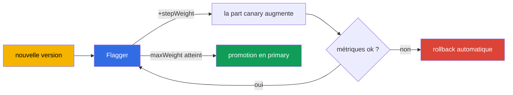

[RU version](ru.md) · [Eng version](en.md) · [Versión en español](es.md) · [Deutsche Version](de.md)

# Chapitre 25. Livraison progressive avec Flagger

> **La Partie 2 commence** - les best practices pour l'exploitation réelle. On y aborde des
> sujets qui ne figurent pas (ou presque pas) à l'examen, mais qui sont nécessaires en prod.
> Le premier : la livraison progressive. Au chapitre 6, nous faisions du canary à la main, en
> modifiant les poids dans le VirtualService. Ça marche, mais il faut un humain aux commandes.
> Flagger automatise tout le processus, avec analyse des métriques et rollback automatique.

## 25.1. Le problème du canary manuel

Rappelez-vous le canary du chapitre 6 : vous changez les poids 90/10, puis 70/30, vous
regardez les tableaux de bord, vous décidez d'avancer ou de revenir en arrière. Les
inconvénients sont évidents :

- **Il faut un humain.** Quelqu'un doit rester devant l'écran à changer les poids et
  surveiller les métriques.
- **Lent et de nuit.** Les déploiements se font souvent à des horaires peu pratiques, sous
  surveillance.
- **Facteur humain.** Il est facile de laisser passer une hausse des erreurs ou de la latence
  et de déployer une mauvaise version.

La livraison progressive (progressive delivery) supprime le travail manuel : le système
transfère lui-même le trafic petit à petit, vérifie les métriques à chaque étape et soit
continue, soit revient en arrière - sans humain.

## 25.2. Qu'est-ce que Flagger

**Flagger** est un opérateur de livraison progressive qui fonctionne au-dessus d'Istio (et
d'autres maillages). Vous décrivez la façon dont le déploiement doit se dérouler via une
ressource `Canary`, et Flagger se charge du reste :

- il repère une nouvelle version du déploiement ;
- il bascule progressivement le trafic vers elle en modifiant les poids dans le
  VirtualService/DestinationRule ;
- à chaque étape, il analyse les métriques (taux de succès, latences) ;
- si les métriques sont bonnes il augmente la part, si elles sont mauvaises il revient en
  arrière ;
- une fois l'objectif atteint, il « promeut » la nouvelle version en version principale
  (promote).



Idée clé : vous définissez les **règles** du déploiement une seule fois, et ensuite chaque
release les suit automatiquement et en toute sécurité.

## 25.3. Comment Flagger fonctionne avec Istio

Flagger n'invente pas son propre routage - il utilise les ressources Istio que nous avons
étudiées aux chapitres 5 et 6. Quand vous créez un `Canary` pour le déploiement `podinfo`,
Flagger déploie tout l'échafaudage autour :

- une copie du déploiement `podinfo-primary` (la version stable, vers laquelle va le trafic
  actuellement) ;
- les services `podinfo`, `podinfo-canary`, `podinfo-primary` ;
- un `DestinationRule` et un `VirtualService`, dont il pilote les poids.

Ensuite, à chaque mise à jour du déploiement d'origine, Flagger déplace lui-même les poids
dans ce VirtualService - c'est-à-dire qu'il fait exactement ce que vous faisiez à la main au
chapitre 6, mais automatiquement et avec vérification des métriques.

## 25.4. Installation de Flagger

Flagger ne fait pas partie d'Istio - il s'installe séparément, généralement via Helm. Il lui
faut deux choses : indiquer que le maillage est Istio, et lui donner l'adresse de Prometheus
(les métriques du chapitre 17 sont la base de l'analyse).

```bash
helm repo add flagger https://flagger.app
helm repo update

helm install flagger flagger/flagger \
  -n istio-system \
  --set meshProvider=istio \
  --set metricsServer=http://prometheus.istio-system:9090
```

- **`meshProvider=istio`** - Flagger pilotera les poids via le VirtualService/DestinationRule
  d'Istio.
- **`metricsServer`** - d'où tirer les métriques pour l'analyse (votre Prometheus).

Pour les vérifications et la génération de charge (webhooks du `Canary`), on installe aussi un
load-tester dans le namespace de l'application :

```bash
helm install flagger-loadtester flagger/loadtester -n test
```

Prérequis : Istio installé (chapitres 2-3) et un Prometheus fonctionnel (chapitre 17). Sans
métriques, Flagger ne pourra pas analyser le déploiement.

## 25.5. La ressource Canary

Toute la configuration du déploiement se décrit dans une seule ressource. Analysons les
champs clés :

```yaml
apiVersion: flagger.app/v1beta1
kind: Canary
metadata:
  name: podinfo
  namespace: test
spec:
  targetRef:
    apiVersion: apps/v1
    kind: Deployment
    name: podinfo            # quel déploiement on déploie
  service:
    port: 9898
  analysis:
    interval: 30s            # à quelle fréquence vérifier
    threshold: 5             # combien d'échecs consécutifs avant rollback
    maxWeight: 50            # jusqu'à quelle part amener le canary
    stepWeight: 10           # pas d'augmentation du poids
    metrics:
    - name: request-success-rate
      thresholdRange:
        min: 99              # taux de succès pas en dessous de 99 %
      interval: 1m
    - name: request-duration
      thresholdRange:
        max: 500             # latence pas au-dessus de 500 ms
      interval: 1m
    webhooks:
    - name: load-test
      url: http://flagger-loadtester.test/   # génération de charge pour la vérification
```

- **`targetRef`** - quel déploiement on déploie.
- **`analysis.interval` / `stepWeight` / `maxWeight`** - le rythme et les pas du déploiement
  (toutes les 30 s ajouter 10 % de trafic, jusqu'à 50 % maximum, puis promotion).
- **`threshold`** - combien de vérifications ratées consécutives sont tolérées avant le
  rollback automatique.
- **`metrics`** - ce qui compte comme succès : le taux de succès des requêtes et la latence
  (tirés des métriques Istio, chapitre 17). C'est le critère automatique « bon/mauvais ».
- **`webhooks`** - vérifications externes : génération de charge, tests d'acceptation. Sans
  trafic, les métriques ne s'accumulent pas, donc le load-test est généralement obligatoire.

## 25.6. Comment se déroule le déploiement : promotion et rollback

Quand vous mettez à jour l'image du déploiement `podinfo`, Flagger lance un cycle :

1. Il dirige `stepWeight` pour cent du trafic vers la nouvelle version (par exemple 10 %).
2. Il attend `interval` et vérifie les métriques (taux de succès, latence).
3. Si les métriques sont dans les limites des seuils, il augmente le poids d'un pas
   supplémentaire (20 %, 30 %, ...).
4. Si les métriques sont mauvaises `threshold` fois de suite, il **revient en arrière** : il
   renvoie tout le trafic vers primary, le canary est abandonné.
5. Une fois `maxWeight` atteint avec de bonnes métriques, c'est la **promotion** : la nouvelle
   version est copiée dans primary et devient la version principale, tout le trafic passe par
   elle.

Tout cela sans intervention humaine. Dans les logs du Canary, on voit la progression :
`Advance podinfo.test canary weight 20/40/50` et à la fin `Promotion completed!` - ou un
rollback si quelque chose s'est mal passé.

Bilan : une mauvaise version n'atteindra pas tous les utilisateurs - elle sera écartée
automatiquement sur une faible part de trafic, selon des métriques objectives.

## 25.7. Autres stratégies de déploiement

Le canary pondéré de la section 25.5 n'est qu'une stratégie parmi d'autres. Avec la même
ressource `Canary` (et le même échafaudage Istio), Flagger en gère trois de plus, seul le
bloc `analysis` change.

**Blue/Green** - aucun poids progressif : la nouvelle version passe d'abord N vérifications
« à l'écart », et ce n'est qu'ensuite que le trafic bascule entièrement vers elle. Se définit
via `iterations` sans `stepWeight` :

```yaml
  analysis:
    interval: 30s
    threshold: 5
    iterations: 10          # 10 vérifications réussies d'affilée - et on bascule 100 % d'un coup
    metrics:
    - name: request-success-rate
      thresholdRange: {min: 99}
      interval: 1m
```

**Test A/B** - le trafic est réparti non pas par poids, mais par un attribut de la requête :
un en-tête ou un cookie. Utile quand il faut montrer la nouvelle version à un segment précis
(bêta-testeurs, collaborateurs internes). Le routage se fait via `match` - la même syntaxe que
dans le `VirtualService` (chapitres 6 et 15) :

```yaml
  analysis:
    interval: 30s
    threshold: 5
    iterations: 10
    match:                  # seules les requêtes avec cet en-tête vont vers le canary
    - headers:
        x-canary:
          exact: "insider"
    metrics:
    - name: request-success-rate
      thresholdRange: {min: 99}
      interval: 1m
```

**Traffic mirroring (shadowing)** - une copie des requêtes est reflétée vers le canary, mais
la réponse du canary **n'est pas renvoyée** à l'utilisateur (chapitre 11). On teste ainsi la
nouvelle version sur du trafic réel sans aucun risque pour les utilisateurs :

```yaml
  analysis:
    interval: 30s
    threshold: 5
    iterations: 10
    mirror: true            # on duplique le trafic vers le canary, la réponse est jetée
    metrics:
    - name: request-success-rate
      thresholdRange: {min: 99}
      interval: 1m
```

Le choix de la stratégie dépend du risque et de la tâche : le canary est le défaut universel,
Blue/Green quand on ne peut pas maintenir deux versions sous charge en même temps, A/B pour une
vérification ciblée, le mirroring pour une vérification « en conditions réelles » sans impact
sur les utilisateurs.

## 25.8. Métriques personnalisées : MetricTemplate

Les `request-success-rate` et `request-duration` intégrés ne suffisent pas toujours : parfois
le critère de succès est une métrique métier (conversion, taux d'erreurs d'un endpoint précis)
ou une métrique d'un système externe. Pour cela il existe un CRD dédié, `MetricTemplate` : vous
y décrivez un fournisseur et une requête arbitraire renvoyant un nombre, puis vous référencez
le template depuis le `Canary`.

```yaml
apiVersion: flagger.app/v1beta1
kind: MetricTemplate
metadata:
  name: not-found-percentage
  namespace: test
spec:
  provider:
    type: prometheus
    address: http://prometheus.istio-system:9090
  query: |                                   # part des 404 dans le total des requêtes vers le canary
    100 - sum(
        rate(istio_requests_total{
          destination_workload="podinfo",
          response_code!="404"
        }[{{ interval }}])
    )
    /
    sum(
        rate(istio_requests_total{
          destination_workload="podinfo"
        }[{{ interval }}])
    ) * 100
```

Ce template se branche maintenant dans le `Canary` au même titre que les métriques intégrées,
via `templateRef` :

```yaml
  analysis:
    metrics:
    - name: "404s percentage"
      templateRef:
        name: not-found-percentage          # référence au MetricTemplate ci-dessus
        namespace: test
      thresholdRange:
        max: 5                               # pas plus de 5 % de réponses 404
      interval: 1m
```

Le fournisseur peut ne pas être uniquement Prometheus : Flagger prend en charge notamment
CloudWatch, Datadog, New Relic et d'autres - autrement dit, on peut bâtir le critère de
rollback même sur des métriques AWS (voir les sections suivantes). Les templates
`{{ interval }}` et autres variables, Flagger les substitue lui-même à chaque étape d'analyse.

## 25.9. Hooks (webhooks) : vérifications et portes manuelles

Dans la section 25.5, nous avons vu un webhook - le générateur de charge. En réalité, Flagger
appelle des hooks à différentes phases du déploiement, et c'est un puissant outil de contrôle.
Principaux types :

- **`confirm-rollout`** - porte **avant** le démarrage du déploiement : tant que le hook ne
  renvoie pas 200, le déploiement ne commence pas (par exemple, on attend une approbation ou
  une fenêtre de release).
- **`pre-rollout`** - tests d'acceptation de la nouvelle version **avant** d'augmenter le
  trafic ; un échec arrête le déploiement.
- **`rollout`** - génération de charge pendant l'analyse (le fameux load-test).
- **`confirm-promotion`** - porte manuelle **avant** la promotion : pratique quand la bascule
  finale doit être confirmée par un humain.
- **`post-rollout`** - actions après une promotion réussie (nettoyage, notifications).
- **`rollback`** - appelé lors d'un rollback.
- **`event`** - Flagger y envoie tous les événements du déploiement (pour des systèmes
  externes/alertes).

Exemple : un test d'acceptation avant le trafic, plus une porte manuelle sur la promotion.

```yaml
  analysis:
    webhooks:
    - name: acceptance-test
      type: pre-rollout                       # test AVANT d'augmenter le trafic
      url: http://flagger-loadtester.test/
      timeout: 30s
      metadata:
        type: bash
        cmd: "curl -sd 'test' http://podinfo-canary.test:9898/token | grep token"
    - name: load-test
      type: rollout                           # charge pendant l'analyse
      url: http://flagger-loadtester.test/
      metadata:
        cmd: "hey -z 1m -q 10 -c 2 http://podinfo-canary.test:9898/"
    - name: manual-gate
      type: confirm-promotion                 # un humain confirme la promotion
      url: http://flagger-loadtester.test/gate/halt
```

La porte manuelle `confirm-promotion` maintient le déploiement à `maxWeight` tant qu'on ne
l'autorise pas à avancer (via l'API du load-tester : `gate/open`). Ainsi l'analyse automatique
et le contrôle humain se combinent : la machine vérifie les métriques, et le dernier mot revient
à l'humain, si la release l'exige.

## 25.10. Exemple : mise en place et contrôle pas à pas

Prenons un exemple concret : nous avons un déploiement `podinfo` ordinaire, et nous voulons
que ses releases passent par Flagger. Parcourons tout le chemin étape par étape.

### Configuration initiale

**Étape 1. Prérequis.** Istio installé (chapitres 2-3), Prometheus fonctionnel (chapitre 17),
Flagger et le load-tester installés (section 25.4), namespace marqué pour l'injection :

```bash
kubectl create namespace test
kubectl label namespace test istio-injection=enabled
```

**Étape 2. On déploie l'application.** Un Deployment et un Service ordinaires - rien de
particulier :

```bash
kubectl apply -n test -f podinfo-deployment.yaml   # Deployment + Service :9898
kubectl get pods -n test          # contrôle : pods 2/2 (le sidecar est en place)
```

**Étape 3. On crée la ressource Canary** (de la section 25.5) et on attend l'initialisation :

```bash
kubectl apply -n test -f podinfo-canary.yaml
kubectl -n test get canary podinfo -w
```

**Contrôle à cette étape.** Attendez le statut `Initialized`. Assurez-vous que Flagger a créé
tout l'échafaudage :

```bash
kubectl -n test get canary podinfo     # STATUS: Initialized
kubectl -n test get deploy             # podinfo-primary est apparu
kubectl -n test get svc                # podinfo, podinfo-canary, podinfo-primary
kubectl -n test get vs,dr              # VirtualService et DestinationRule créés
```

Si ça bloque avant `Initialized` - consultez les logs de Flagger :
`kubectl logs -n istio-system deploy/flagger`.

### Utilisation au quotidien

Ensuite, la vie est simple : **vous mettez juste à jour l'image du déploiement, et Flagger fait
tout le reste.**

**Étape 4. On lance une release** - on change la version de l'image :

```bash
kubectl -n test set image deployment/podinfo podinfod=stefanprodan/podinfo:6.1.0
```

**Étape 5. On observe le déploiement.** Flagger commence lui-même à déplacer le trafic et à
vérifier les métriques :

```bash
kubectl -n test get canary podinfo -w
```

**Contrôle en cours de route.** Le statut passe par `Progressing` et se termine par `Succeeded`
(ou `Failed` en cas de rollback). Les détails sont visibles dans les événements :

```bash
kubectl -n test describe canary podinfo
# ... Advance podinfo.test canary weight 10
# ... Advance podinfo.test canary weight 20
# ... Promotion completed!
```

**Étape 6. Ce qu'on voit en cas de problème.** Si la nouvelle version a dégradé les métriques,
Flagger revient lui-même en arrière sur le trafic, le statut devient `Failed`, et la cause
figure dans les événements (par exemple, latence dépassée). Les utilisateurs sont alors quasi
épargnés - la mauvaise version n'a reçu qu'une faible part du trafic.

### Comment contrôler au quotidien

- **Le statut du Canary** est l'indicateur principal : `kubectl get canary -A` montre tous les
  déploiements et leur état (`Progressing`/`Succeeded`/`Failed`).
- **Le tableau de bord Flagger dans Grafana** montre visuellement le déroulement du déploiement
  et les métriques.
- **Les alertes sur `Failed`** - configurez des notifications (Flagger sait envoyer vers
  Slack/webhook) pour que l'équipe soit immédiatement informée des rollbacks.
- **Les événements et les logs** - `describe canary` et les logs de Flagger pour analyser
  pourquoi le déploiement a mal tourné.

L'intérêt, c'est qu'après la configuration initiale, la release quotidienne se réduit à mettre
à jour l'image - tout le contrôle de sécurité est pris en charge par Flagger, et il ne vous
reste qu'à surveiller le statut et à réagir aux alertes.

### Exemple d'alertes Prometheus

Pour « comprendre que quelque chose a mal tourné » non pas manuellement mais automatiquement,
configurez des alertes sur les métriques Istio (chapitre 17). Elles se rédigent sous forme de
`PrometheusRule` (pour Prometheus Operator). Voici trois règles de base.

```yaml
apiVersion: monitoring.coreos.com/v1
kind: PrometheusRule
metadata:
  name: istio-app-alerts
  namespace: monitoring
spec:
  groups:
  - name: istio.rules
    rules:
    # 1. Part élevée d'erreurs 5xx (> 5 % sur 5 minutes)
    - alert: HighErrorRate
      expr: |
        sum(rate(istio_requests_total{destination_workload="podinfo", response_code=~"5.."}[5m]))
        / sum(rate(istio_requests_total{destination_workload="podinfo"}[5m])) > 0.05
      for: 2m
      labels: {severity: critical}
      annotations:
        summary: "Beaucoup de 5xx sur podinfo (>5%)"

    # 2. Latence p99 élevée (> 500 ms)
    - alert: HighLatencyP99
      expr: |
        histogram_quantile(0.99,
          sum(rate(istio_request_duration_milliseconds_bucket{destination_workload="podinfo"}[5m])) by (le)
        ) > 500
      for: 5m
      labels: {severity: warning}
      annotations:
        summary: "p99 de latence de podinfo au-dessus de 500 ms"

    # 3. Flagger a annulé le déploiement
    - alert: CanaryFailed
      expr: flagger_canary_status{name="podinfo"} == 2
      for: 1m
      labels: {severity: critical}
      annotations:
        summary: "Flagger a annulé le déploiement canary de podinfo"
```

Analysons :

- **HighErrorRate** - calcule la part des réponses `5xx` sur le total des requêtes vers le
  service, à partir de la métrique `istio_requests_total`. Le seuil de 5 % sur 5 minutes est le
  même signal que celui sur lequel Flagger se base lui-même.
- **HighLatencyP99** - prend le 99e centile de la latence dans l'histogramme
  `istio_request_duration_milliseconds_bucket`. Une hausse du p99 est souvent le premier signe
  de problèmes.
- **CanaryFailed** - surveille la métrique de Flagger lui-même : la valeur `2` signifie l'échec
  du déploiement (vérifiez la correspondance exacte des valeurs de statut dans la documentation
  de Flagger - elle peut varier d'une version à l'autre).

Ces alertes complètent le statut du Canary : Flagger revient lui-même en arrière sur une
mauvaise version, et Prometheus notifie l'équipe que le rollback a eu lieu et pourquoi (erreurs
ou latence).

## 25.11. Flagger sur EKS/AWS

La base de l'analyse de Flagger, ce sont les métriques (chapitre 17), et sur EKS leur source
n'est souvent pas un Prometheus in-cluster, mais des services managés AWS. Points clés.

**Métriques depuis Amazon Managed Prometheus (AMP).** Au lieu d'un Prometheus autonome, les
métriques Istio peuvent être écrites dans AMP et de là alimenter Flagger. La différence avec un
`metricsServer` classique : les requêtes vers AMP doivent être signées en SigV4 (accès par
IAM). En général, on place entre Flagger et AMP un sidecar proxy (par exemple `aws-sigv4-proxy`)
qui signe les requêtes via IRSA, et Flagger s'adresse à lui comme à un Prometheus ordinaire :

```yaml
# MetricTemplate pointant vers le proxy SigV4 devant AMP
apiVersion: flagger.app/v1beta1
kind: MetricTemplate
metadata:
  name: success-rate-amp
  namespace: test
spec:
  provider:
    type: prometheus
    address: http://localhost:8005            # sigv4-proxy -> AMP workspace
  query: |
    100 - sum(
        rate(istio_requests_total{
          destination_workload="podinfo",
          response_code=~"5.."
        }[{{ interval }}])
    )
    /
    sum(rate(istio_requests_total{destination_workload="podinfo"}[{{ interval }}])) * 100
```

Le schéma « canary + rollback sur les métriques AMP + Flagger » est décrit dans le
[blog officiel AWS](https://aws.amazon.com/blogs/opensource/performing-canary-deployments-and-metrics-driven-rollback-with-amazon-managed-service-for-prometheus-and-flagger).

**Notifications de rollback vers Slack/SNS.** Flagger sait envoyer les événements via le
webhook `event` ou ses alertes intégrées. Sur AWS, il est pratique d'acheminer les rollbacks
vers SNS (et de là vers Chatbot/Slack, l'e-mail, PagerDuty), pour que l'équipe soit informée
d'un `Failed` immédiatement.

**Fournisseur Gateway API.** Si, au lieu des Gateway/VirtualService classiques, vous utilisez
Gateway API (chapitre 11), Flagger sait piloter les poids à travers lui aussi -
`meshProvider=gatewayapi`. Utile sur EKS avec des contrôleurs d'ingress qui implémentent
Gateway API. La logique d'analyse et de rollback reste la même.

## 25.12. Best practices pour la prod

- **Les bonnes métriques et les bons seuils sont la base de tout.** Flagger est bon
  exactement dans la mesure où les critères sont précis. Commencez par le taux de succès des
  requêtes et la latence (p99), et ajoutez au besoin des métriques personnalisées (y compris
  des métriques métier, chapitre 18).
- **Les seuils - à partir d'un vrai baseline.** Ne fixez pas les seuils au hasard. Prenez les
  valeurs normales des métriques du service et fixez les seuils avec une marge, sinon vous
  obtiendrez de faux rollbacks.
- **Générez impérativement de la charge.** Sans trafic, les métriques ne s'accumulent pas et
  l'analyse ne se déclenche pas. Configurez un webhook load-test ou appuyez-vous sur le trafic
  réel.
- **Des pas conservateurs pour les services critiques.** Un petit `stepWeight` et un `interval`
  raisonnable laissent les métriques s'accumuler. Un déploiement trop rapide n'aura pas le temps
  d'attraper le problème.
- **Tests d'acceptation via les webhooks.** Avant d'augmenter le trafic, faites passer des
  tests d'acceptation de la nouvelle version - cela attrape les régressions fonctionnelles
  invisibles dans les métriques de succès.
- **Alertes sur les rollbacks.** Un rollback automatique est un signal que la version est
  mauvaise. Configurez des notifications pour que l'équipe soit informée immédiatement.
- **Testez le processus lui-même en staging.** Assurez-vous que le déploiement, la promotion et
  le rollback fonctionnent avant de confier la prod à Flagger.

## 25.13. Résumé du chapitre

- La livraison progressive automatise le canary : le système déplace lui-même le trafic,
  vérifie les métriques et revient en arrière, sans travail manuel.
- **Flagger** est un opérateur au-dessus d'Istio ; il pilote les poids dans le
  VirtualService/DestinationRule selon les règles de la ressource `Canary`. Il s'installe
  séparément via Helm avec `meshProvider=istio` et l'adresse de Prometheus ; pour la charge, un
  load-tester.
- Flagger déploie l'échafaudage (déploiement primary, services, DR, VS) et à chaque mise à jour
  déplace les poids automatiquement.
- Dans le `Canary`, on définit le rythme (`interval`, `stepWeight`, `maxWeight`), les critères
  (`metrics` + `thresholdRange`), la tolérance aux erreurs (`threshold`) et les vérifications
  (`webhooks`).
- La même ressource sert aussi aux autres stratégies : **Blue/Green** (`iterations` sans
  `stepWeight`), **A/B** (`match` par en-têtes/cookies), **mirroring** (`mirror: true`).
- Ses propres critères se définissent via `MetricTemplate` - une requête arbitraire vers
  Prometheus, CloudWatch, Datadog, etc. (y compris des métriques métier), branchée dans le
  `Canary` via `templateRef`.
- Les **webhooks** sont appelés à différentes phases : `confirm-rollout`/`confirm-promotion`
  (portes manuelles), `pre-rollout` (tests d'acceptation), `rollout` (charge), `rollback`,
  `event`.
- Une bonne version est progressivement promue en primary, une mauvaise est automatiquement
  annulée sur une faible part de trafic.
- Sur EKS/AWS, les métriques proviennent souvent d'**Amazon Managed Prometheus** (requêtes via
  proxy SigV4/IRSA), les rollbacks sont envoyés vers **SNS/Slack** ; avec Gateway API -
  `meshProvider=gatewayapi`.
- Après la configuration initiale (déploiement -> Canary -> `Initialized` avec échafaudage), la
  release quotidienne = mettre à jour l'image ; le contrôle se fait via le statut du Canary
  (`Progressing`/`Succeeded`/`Failed`), le tableau de bord Grafana et les alertes de rollback.
- Best practices : métriques et seuils précis issus d'un baseline, génération de charge, pas
  conservateurs, tests d'acceptation, alertes sur les rollbacks, rodage en staging.

## 25.14. Questions d'auto-évaluation

1. Quels inconvénients du canary manuel la livraison progressive résout-elle ?
2. Que fait Flagger et comment est-il lié aux ressources Istio ?
3. À quoi servent `stepWeight`, `maxWeight`, `interval` et `threshold` dans le `Canary` ?
4. Pourquoi Flagger a-t-il impérativement besoin de trafic (charge) pour fonctionner ?
5. Pourquoi les seuils des métriques doivent-ils être issus d'un vrai baseline, et non fixés
   au hasard ?
6. En quoi diffèrent les stratégies canary, Blue/Green, A/B et mirroring, et quand choisir
   laquelle ?
7. À quoi sert un `MetricTemplate` et comment brancher sa propre métrique dans un `Canary` ?
8. À quoi servent les hooks `confirm-promotion` et `pre-rollout` ?
9. Comment fonctionne l'analyse de Flagger sur EKS avec Amazon Managed Prometheus et en quoi
   diffère-t-elle d'un Prometheus in-cluster ?
10. Décrivez le chemin d'un déploiement ordinaire jusqu'aux releases automatiques via Flagger.
    Comment contrôler la configuration initiale, et comment les déploiements quotidiens ?

## Pratique

Entraînez-vous au canary automatique avec Flagger : mise à jour de version, analyse des
métriques, promotion et rollback automatiques :

🧪 Lab 25 : [tasks/ica/labs/25](../../labs/25/README_FR.MD)

---
[Table des matières](../README_FR.md) · [Chapitre 24](../24/fr.md) · [Chapitre 26](../26/fr.md)
